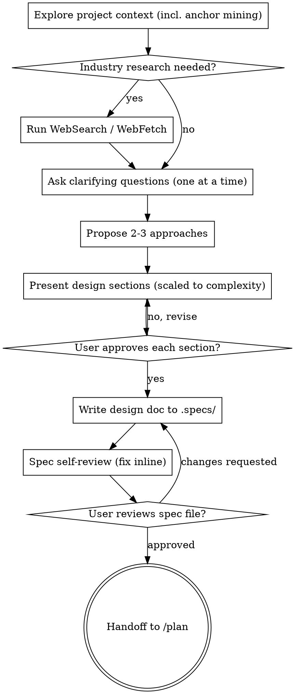

# /brainstorm — Ideas Into Designs

Help turn the idea in `$ARGUMENTS` into a fully formed design spec at
`.specs/YYYY-MM-DD-<slug>-design.md` through natural collaborative
dialogue.

Start by understanding the current project context, then ask questions
one at a time to refine the idea. Once you understand what you're
building, present the design and get user approval.

<HARD-GATE>
Do NOT invoke any implementation skill, write any code, scaffold any
project, run migrations, or take any implementation action until you
have presented a design and the user has approved it. This applies to
EVERY project regardless of perceived simplicity.
</HARD-GATE>

## Anti-Pattern: "This Is Too Simple To Need A Design"

Every project goes through this process. A todo list, a single-function
utility, a config change — all of them. "Simple" projects are where
unexamined assumptions cause the most wasted work. The design can be
short (a few sentences for truly simple projects), but you MUST present
it and get approval.

## When NOT to Use

- An approved spec already exists for this topic → go straight to `/plan`.
- A spec exists but needs small edits → edit it directly.
- Pure mechanical refactor (rename, file move) → write the change.

## Checklist

Create a task for each of these items and complete them in order:

1. **Explore project context** — files, docs, recent commits, AND
   anchor mining via the code graph (see below).
2. **(Optional) Industry research** — only when the world genuinely
   knows the topic better than this codebase does (see below).
3. **Ask clarifying questions** — one at a time, understand purpose /
   constraints / success criteria.
4. **Propose 2-3 approaches** — with trade-offs and your recommendation.
5. **Present design** — in sections scaled to their complexity, get
   user approval after each section.
6. **Write design doc** — save to `.specs/YYYY-MM-DD-<slug>-design.md`.
7. **Estimate story points** — apply the Fibonacci rubric below and
   fill the `Story Points` header field.
8. **Spec self-review** — quick inline check (includes estimate sanity).
9. **User reviews written spec** — ask the user to review the file
   before proceeding.
10. **Handoff to `/plan`** — output the next-step line.

## Process Flow



**The terminal state is invoking `/plan`.** Do NOT invoke any
implementation skill (`/build`, `bun cli` scaffolding, `/route`,
`/entity`, etc.) from `/brainstorm`. The ONLY command you point the
user to afterward is `/plan`.

## The Process

**Understanding the idea:**

- Check out the current project state first (files, docs, recent commits).
- Before asking detailed questions, assess scope: if the request
  describes multiple independent subsystems (e.g., "build a platform
  with chat, file storage, billing, and analytics"), flag this
  immediately. Don't spend questions refining details of a project
  that needs to be decomposed first.
- If the project is too large for a single spec, help the user
  decompose into sub-projects: what are the independent pieces, how
  do they relate, what order should they be built? Then brainstorm
  the first sub-project through the normal design flow. Each sub-project
  gets its own spec → plan → implementation cycle.
- For appropriately-scoped projects, ask questions one at a time to
  refine the idea.
- Prefer multiple choice questions when possible, but open-ended is
  fine too.
- Only one question per message — if a topic needs more exploration,
  break it into multiple questions.
- Focus on understanding: purpose, constraints, success criteria.

**Anchor mining (domain extension):**

Specs are built ON TOP OF what already exists in this codebase, not
in a vacuum. After mapping the project (`ls packages/`,
`ls packages/api/src/`, etc.), find the artifacts this feature
plausibly extends:

```bash
bun scripts/graph/cli/index.ts stats                       # what exists
# Extract domain nouns + verbs from the idea ("export agenda CSV"
# → nouns: agenda, CSV; verbs: export)
# For each noun, search the graph by id or path:
bun scripts/graph/cli/index.ts file <path-pattern>
jq '.tasks[] | select(.id|test("<noun>"; "i"))' \
   scripts/graph/.graph/graph.json
```

Output: a mental list of **anchors present** (existing artifacts the
feature would plausibly extend / compose with / replace) and
**anchors absent** (relevant artifacts not yet built). Cite them
INLINE in the Context section when relevant (paths and identifiers
welcome).

If the graph has no relevant anchors at all (truly new domain area),
say so explicitly — that's a legitimate finding, not a license to
invent paths.

**Common anchor locations** (use as a quick mental map; not all
apply to every spec):

Backend (`packages/api/src/`):
- Entities:     `<context>/entities/<X>.ts`
- Value objects:`<context>/objects/<X>.ts`
- Use cases:    `<context>/usecases/<X>.ts` (writes) ; `ui/usecases/<area>/<X>.ts` (BFF queries)
- Controllers:  `<context>/controllers/<X>.ts` ; `ui/controllers/<area>/<X>.ts`
- Repositories: `<context>/repositories/Drizzle<X>.ts`
- Events:       `<context>/events/<X>.ts` (domain) ; `shared/events/<X>.ts` (integration)
- Handlers:     `<context>/handlers/<X>.ts`
- Schemas:      `<context>/schemas/<X>.ts`
- Errors:       `<context>/errors/index.ts` (typed-string union — no file-per-error)
- Migrations:   `shared/db/drizzle/migrations/`

Frontend (`packages/app/src/`):
- Routes:       `routes/(app)/<feature>/index.tsx`
- Sections (smart):    `routes/(app)/<feature>/-components/<X>Section/index.tsx`
- Dumb components:     `routes/(app)/<feature>/-components/<X>/index.tsx`
- Forms:        `routes/(app)/<feature>/-forms/<X>Form/index.tsx`
- Hooks:        `routes/(app)/<feature>/-hooks/use<X>.ts`
- Local stores: `routes/(app)/<feature>/-stores/use<X>Store.ts`
- Cross-route stores: `shared/stores/use<X>Store.ts`
- Primitives (design system): `components/ui/<x>.tsx` (Base UI + CVA)
- Design tokens:`SYSTEM.md` (root)
- Product context: `PRD.md` (root)
- Locales:      `locales/pt.json`, `locales/en.json`

Channel / Go service (`packages/channel/internal/`):
- Bounded contexts: `<context>/` (e.g. `channel/`, `messaging/`, `chat/`, `webhook/`)
- Domain events:   `<context>/events/<X>.go`
- Handlers:        `<context>/handlers/<X>.go`
- Integration events (cross-service): `shared/events/<X>.go`

For features with visual decisions, cite **inline in Context**:
- The existing route/section that the new UI extends or mirrors
  (e.g. *"the FilterBar pattern from `packages/app/src/routes/(app)/patients/-components/FilterBar/`"*).
- Any `.pen` prototype or screenshot under `design/` if produced by `/prototype`.
- The SYSTEM.md token group used (e.g. *"reuses the existing `tag` color tokens for status pills"*) — anchors against drift toward inventing new tokens.

**Industry research (optional, opt-in):**

Decide in one sentence: *does the world know how to do this better
than this codebase does today?*

- **Yes — for protocol / domain conventions:** scheduling, auth
  flows, payments, idempotency, real-time messaging, rate limiting,
  calendar/availability, RBAC, billing, full-text search,
  observability, i18n. Sources: 2-3 well-known products + relevant
  RFCs + recent postmortems.
- **Yes — for UX patterns** where the world has settled
  conventions: inline editing, kanban / board layouts, infinite
  scroll vs pagination, table sorting/filtering UIs, drawer vs
  modal vs full-page, multi-step wizards, command palettes,
  comment threads, notification UIs, file upload UX,
  search-as-you-type, optimistic updates. Sources: how Linear /
  Notion / Calendly / Stripe Dashboard / Vercel handle the same
  shape. Cite the product + the specific pattern when it informs
  a Decision (e.g. *"Linear's drag-to-reorder pattern with rank
  field"*).
- **No** for: project-internal renames, refactors, exposing
  existing data through a new endpoint, trivial UX (a button that
  navigates), anything plainly project-specific. Say so in chat
  and skip.

The point is to enter the conversation informed, not to fish for URLs
to cite. If nothing informs the design, don't fake research.

**Exploring approaches:**

- Propose 2-3 different approaches with trade-offs.
- Present options conversationally with your recommendation and
  reasoning. Lead with your recommended option and explain why.
- Hybrids are encouraged.
- An inversion of the user's framing ("what if we don't do this and
  do X instead?") counts as an approach and is often the most valuable
  one to put on the table.

**Presenting the design:**

- Once you believe you understand what you're building, present the
  design.
- **Scale each section to its complexity:** a few sentences if
  straightforward, up to 200-300 words if nuanced.
- Ask after each section whether it looks right so far.
- Be ready to go back and clarify if something doesn't make sense.

**Design for isolation and clarity:**

- Break the system into smaller units that each have one clear
  purpose, communicate through well-defined interfaces, and can be
  understood and tested independently.
- For each unit, you should be able to answer: what does it do, how
  do you use it, and what does it depend on?
- Can someone understand what a unit does without reading its
  internals? Can you change the internals without breaking consumers?
  If not, the boundaries need work.
- Smaller, well-bounded units are also easier for you to work with —
  you reason better about code you can hold in context at once, and
  your edits are more reliable when files are focused. When a file
  grows large, that's often a signal that it's doing too much.

**Working in existing codebases:**

- Explore the current structure before proposing changes. Follow
  existing patterns.
- Where existing code has problems that affect the work (e.g., a file
  that's grown too large, unclear boundaries, tangled responsibilities),
  include targeted improvements as part of the design — the way a
  good developer improves code they're working in.
- Don't propose unrelated refactoring. Stay focused on what serves
  the current goal.

**Building a component or screen → run `ui-composition` first.**
Whenever the idea involves building (or substantially reshaping) a UI
component, section, or screen, invoke the `ui-composition` skill as part
of the brainstorm — feed it the visual artifact (screenshot / wireframe /
mockup) or the described layout. It classifies the screen into the 6
architectural citizens (Route Shell, Section, Component, Leaf, Dialog,
Form), decides reuse, and produces the `## UI Composition` section that
gets appended to this spec. This is a design/classification step, not
implementation — it does NOT violate the HARD-GATE, and its output feeds
the frontend decision angles below. Do this before presenting the design
so the citizen breakdown informs State ownership, reuse, and the hand-off
list.

**Frontend-specific decision angles** (cover these in
Decisions / User Stories / ACs whenever the spec touches UI; not
all apply to every spec — just don't *skip* them by accident):

- **State ownership.** Where does each piece of state live?
  - **URL search params** (`routeApi.useSearch()` + Zod schema on the route) — for state that should survive refresh, be shareable, and round-trip with the backend filter (filter bars, pagination, selected item, view mode).
  - **Zustand store** (local `-stores/use<X>Store.ts` or `shared/stores/`) — for cross-component client state in the same session that does NOT belong in the URL (modal open state, multi-step wizard draft, optimistic UI flags, selection in a multi-select).
  - **Local `useState`** — for state nobody else needs (hover, focus, transient input before submit).
  - Default: if the user can copy a link and the recipient should see the same view, it's URL. If two siblings need to coordinate without a parent, it's Zustand. Else it's local.
- **Loading / empty / error states.** Follow the codebase's pattern. Sections accept `data | undefined` and handle loading with inline skeletons; routes do NOT gate on `isLoading` (static UI stays visible). Empty state: in the section, not the route. Error: `toast.error(t('common.errors.unexpected'))` for unknown; specific i18n key for known errors.
- **Backend dependency.** Is the feature blocked on a backend endpoint? Cite inline in Context: *"depends on `GET /appointments/export.csv` (spec `.specs/<other>.md`); SDK regen required before this ships"*. If the endpoint doesn't exist, the spec MUST either declare it Out of Scope ("UI-only spec; endpoint ships separately") or include it in the Decisions.
- **Design references.** Link existing routes / sections / SYSTEM.md tokens / `.pen` prototypes INLINE in Context where they apply. Better than describing UI in prose — *"reuses the table layout from `routes/(app)/patients/-components/PatientListSection/`"* beats two paragraphs of layout description.
- **Forms.** Single form vs multi-step wizard? Inline mutation vs dialog? See `/form` skill's "Form Types Overview". Decisions about masks (CPF, phone) and validators come from the SDK schema; do NOT redefine.
- **A11y / i18n / mobile.** Only when the prompter asked OR the codebase already enforces it for similar features. Otherwise these are invention (anti-invention rule catches them).

## Enforced Spec Header

Every spec MUST start with this header, in this order. **These six
sections are the only ones enforced** — the rest of the spec is
free-form, scaled to the topic's complexity.

1. Context
2. Problem
3. Goal
4. Decisions
5. User Stories
6. Acceptance Criteria

Reading flow: Context (what's there) → Problem (what's wrong/missing)
→ Goal (what user gains) → Decisions (HOW the system is shaped) →
User Stories (the HOW playing out for the user) → Acceptance Criteria
(measurable success).

```md
# <Title> — Design Spec

**Date:** <YYYY-MM-DD>
**Status:** Draft
**Bounded Context:** <context-name | cross-context: list>
**Kind:** <feature | bug | chore | spike>
**Story Points:** <1 | 2 | 3 | 5 | 8 | 13 | 21> — <one-line justification anchored to the rubric>

## Context

<Domain-level narrative. 1–3 paragraphs in product language describing
the situation today: what exists, what the user does today, what's
around this idea in the codebase. Cite anchors INLINE with paths
(`packages/api/src/...`) at the moment of relevance. Tone: a colleague
who knows the codebase explaining at the whiteboard.>

## Problem

<What's missing or what's broken, concretely. Use numbered items if
multiple distinct problems. Each problem should be specific enough
that a future reader knows whether this spec solved it. Skip the
section ONLY if purely additive with no problem being solved — and
write "Net-new — no current problem being solved" so the omission is
explicit, not accidental.>

## Goal

<One paragraph: what capability the user gains, what new behavior
becomes possible, what friction is removed. Distinct from "Decisions"
(which describe HOW the system is shaped to deliver the goal).>

## Decisions

<Numbered, irreversible commitments the implementer must honor. Each
decision is one line OR a short paragraph when the choice has real
reasoning behind it.>

1. <decision>
2. <decision>
...

## User Stories

<Each story uses Given/When/Then so it becomes a concrete test
scenario downstream. Tie each to an AC number when relevant.>

- **Story 1:** As a <actor>, I want to <action>, so that <benefit>.
  - Given <state>, when <action>, then <outcome>.
  - Given <edge case>, when <action>, then <outcome>.

## Acceptance Criteria

<Numbered list. Each AC is measurable — it can become a failing test
during /plan and a green test during /build. Each AC should be
specific enough that two readers would agree on whether it's met.>

- [ ] AC-1: <criterion>
- [ ] AC-2: <criterion>
- ...
```

### Anti-invention rules

The same trace-to-source discipline applies to **Decisions, User
Stories, and Acceptance Criteria** — anything that didn't come from
real input becomes phantom work the implementer wastes tokens
defending.

**Decisions — do NOT invent.** Every Decision must trace to one of:

1. **Stated by the prompter** — they explicitly named the choice
   ("status em UPPER_CASE no CSV").
2. **Obvious codebase convention** — this project already enforces
   the pattern for similar features (e.g., "errors registered as
   typed strings inside `<context>/errors/index.ts`" — not invention,
   it's enforcing the existing `/errors` skill convention).
3. **Surfaced in Phase 2 and accepted** — you raised the question,
   the user agreed.

Common fabricated Decisions to cut:

- Encoding / delimiter choices the user didn't mention.
- Pagination strategy the user didn't mention.
- Audit logging the user didn't mention.
- Naming conventions when the codebase doesn't already enforce one
  AND the user didn't ask.
- "Use Drizzle" / "use TanStack Query" — these are background
  conventions, not Decisions. If `/plan` would derive it anyway from
  the codebase, cut it. Decisions are commitments the implementer
  might otherwise have gotten *wrong*.

**User Stories — do NOT invent actors or scenarios.** Each Story
must trace to:

1. **An actor the prompter named or that's obvious for the topic**
   (a "doctor exporting their agenda" is obvious for an
   agenda-export feature; a "compliance officer auditing exports" is
   invention unless mentioned).
2. **A scenario implied by an AC or a Decision** — every Given/When/Then
   should pair with an AC or commit-to-honor a Decision.

For internal-only changes with no end-user, the "actor" may be the
developer/operator maintaining the system. Example:
*"As a developer adding a new bounded context, I want the registry
auto-discovery to pick it up, so I don't have to edit
`ALL_REGISTRIES` manually."* That's honest.

If you can't write at least one Story without inventing an actor or
edge case, the feature may not need Stories — write the single
obvious one and move on. Don't pad.

**Acceptance Criteria — do NOT invent.** Every AC must trace to one of:

1. **Stated by the prompter** — they explicitly named the criterion.
2. **Obvious for the topic** — the behavior implies the AC and no
   reasonable reader would dispute it ("export returns CSV
   content-type" for a CSV export feature).
3. **Implied by an explicit Decision** — if Decision N says
   "BOM-prefixed UTF-8", then AC "first byte is `0xFEFF`" is
   derivable, not invention.
4. **Surfaced in Phase 2 push-back and accepted** — you raised the
   consideration, the user agreed it belongs in scope.

ACs that fail all four are **invention**. Common fabrications to cut:

- **Latency / performance** ("response < 200ms", "handles 1k concurrent")
  — only when the user mentioned the constraint.
- **Throughput / scale** — same rule.
- **Accessibility** ("passes WCAG AA") — only when the user asked.
- **i18n / multi-locale** — only when the user asked or the codebase
  already enforces it for this kind of feature.
- **Rate limiting / caching / retries** — only when explicitly in scope.
- **Audit logging** — only when the user asked OR Phase 2 surfaced it
  AND the user accepted.
- **Backwards-compatibility** — only when migration is in scope.
- **Mobile-specific behavior** — only when the user asked.

When in doubt, leave it out. A spec with 5 honest ACs beats one with
12 ACs where half are agent-invented NFRs the implementer will waste
tokens defending.

### Why the six are enforced

`/plan` and `/build` depend on each section to do their job:

- **Context** anchors the spec in real code (via inline graph anchors).
- **Problem** lets `/learnings` later evaluate whether shipped work
  actually closed the gap.
- **Goal** seeds the plan's `## What we're building` summary.
- **Decisions** are the irreversible commitments `/plan` honors when
  deriving artifacts — they fill the "HOW" gap that pure ACs leave.
- **User Stories** give each AC its **setup** (Given/When), so
  outer tests in `/plan` know what state to seed before asserting.
- **Acceptance Criteria** map 1-to-many to test paths in
  `/plan`'s Final Validation. `/build`'s goal criterion (7) refuses
  to clear until every AC has a green test in the transcript.

Skip any of the six and the downstream loop loses load-bearing input.

### Trivial-topic fallback

If the topic is so small that some sections feel forced (e.g., a
net-new internal rename with no observable user behavior), still
write at least one entry per section, even if minimal:

- **Problem:** *"Net-new — no current problem being solved."*
- **User Stories:** *"As a developer maintaining this codebase, I
  want X, so that Y."*
- **Acceptance Criteria:** *"Existing tests still pass after the
  rename."*

Making the omission explicit beats leaving sections silently empty.

### Free-form after the header

After Acceptance Criteria, add ONLY the sections the topic warrants.
Don't pad. Don't enumerate Risks / etc. unless they
earn their place.

**Common useful sections** (use only what fits):

- `UI Composition` — produced by the `ui-composition` skill when the
  spec builds a component/screen (citizen breakdown + ASCII layout map +
  hand-off list). Append it whenever frontend UI is in scope.
- `Open Questions` — only what truly remains unresolved.
- `Risks & Migration` — for changes that touch existing behavior.
- `Inspirations & Research` — sources from optional industry research,
  with URLs.
- `Unforeseen Angles` — insights the user did not initially name but
  agreed to capture.

None of these are mandatory. Scale each section to its complexity.

## Story-Point Estimation

After the spec body is written, estimate effort on a **Fibonacci scale**
(1, 2, 3, 5, 8, 13, 21) anchored to this codebase. Story points measure
**system breadth and risk**, not wall-clock time — they translate directly
to the artifacts `/plan` will produce and the gates `/build` will run.

**How to estimate:** walk the Decisions + Acceptance Criteria and count
the artifacts each implies (entities, schemas, use cases, controllers,
repositories, projectors, routes, sections, migrations, integration
events). Then match the totals to the rubric below — pick the **lowest**
tier the spec still fits in. When between tiers, round up.

### Rubric

| Pts | Shape | Typical artifacts |
|----:|---|---|
| **1** | Trivial, single-file. No schema change, no new route, no migration. | Locale key, label change, single-prop wiring, rename inside one file. |
| **2** | One bounded context, one read or one trivial mutation, zero migrations. | New section component on an existing route + one query use case; or one new internal handler. |
| **3** | One bounded context, may add ≤1 entity field or one new use case + controller. ≤1 migration with a default. Frontend or backend, not both heavily. | New AC on existing entity + use case + controller + SDK regen; or a new route with one existing query. |
| **5** | One bounded context end-to-end. New entity OR multiple coordinated use cases + repository + controller + tests + one migration + one new route or section. SDK regen, no cross-service contract. | "Add notes to patient": entity + repo + use cases + controller + route + section + form. |
| **8** | Multi-context (still inside `api`) **or** new bounded context with simple shape. Adds a domain event + internal handler **or** a new projection + projector. One migration with a backfill, OR more than one migration. | New `billing` context with one aggregate; or a projection that fans out from an existing context. |
| **13** | Cross-service (api ↔ channel) integration event with a new contract, OR multi-step wizard, OR saga across ≥2 use cases. Real backfill / data migration. Likely two PRs even if planned as one. | WhatsApp side-effect on a new domain event end-to-end; multi-step onboarding wizard with persisted draft. |
| **21** | Multi-context refactor + cross-service contract + UI overhaul, OR something that genuinely needs decomposition. **At 21, push back: propose splitting into smaller specs before approving.** | Replace the auth model; re-shape the appointment aggregate; ground-up new product surface. |

### Tie-breakers (round up when any apply)

- **Cross-service contract** (new integration event consumed by channel/Go or vice-versa) → +1 tier.
- **Migration with a backfill** that touches existing rows → +1 tier.
- **New projection + projector** (read-model materialization) → +1 tier over a write-only change of the same shape.
- **Spec touches ≥3 bounded contexts** → at least 8.
- **Spec implies a saga / outbox + integration event + UI reaction** → at least 13.
- **Spike / unknown unknowns** (the user said "we're not sure if it's possible") → at least 8, and flag in the body that the estimate is a guess pending the spike.

### Sanity check

- Estimate ≥ 13 → ask yourself *"can this be two specs?"*. If yes, say so to the user before writing the file.
- Estimate ≤ 2 → confirm the spec doesn't actually warrant being skipped (`/brainstorm` is not for one-line edits — the user could just make the change).
- The justification on the header line must cite the **specific reason** for the tier (e.g., *"new projection + cross-service integration event"*), not just *"medium complexity"*.

### Examples (anchored to existing specs)

- Adding a search filter to an existing list page → **2**.
- New patient note (entity field + use case + controller + section + form) → **5**.
- WhatsApp confirmation when an appointment is confirmed (domain event in `appointment` + integration event + channel handler) → **13**.
- Channel-to-integration refactor (rename across api + channel + projections + UI) → **21**, decompose.

## After the Design

**Documentation:**

- Write the validated design (spec) to `.specs/YYYY-MM-DD-<slug>-design.md`.
- Status starts as `Draft`. Never `Approved` from the agent — only
  the user marks it Approved.
- Use the project's writing conventions (clear, concise, domain
  language; no architectural artifact lists in Decisions).

**Spec Self-Review:**

After writing the spec document, look at it with fresh eyes:

1. **Placeholder scan:** Any `<placeholder>`, `TBD`, `TODO`,
   incomplete sections, or vague requirements? Fix them.
2. **Internal consistency:** Do any sections contradict each other?
   Does the architecture match the feature descriptions?
3. **Scope check:** Is this focused enough for a single implementation
   plan, or does it need decomposition?
4. **Ambiguity check:** Could any requirement be interpreted two
   different ways? If so, pick one and make it explicit.
5. **Honesty check (domain extension):** Every concrete factual claim
   in Context is verifiable:
   - Files / routes / contexts named exist in the codebase (verify by
     `bun scripts/graph/cli/index.ts file <path>` or Read), OR are
     clearly marked as proposed new artifacts.
   - Quotes / complaints / sentiments attributed to users / doctors /
     owners came from the prompter — not from agent imagination.
   - Pattern-match `relataram|reportaram|reclamam|users (?:reported|complained)|doctors (?:reported|complained)`;
     any non-quoted match → rewrite neutrally ("the gap is X" rather
     than "users reported X").
6. **Anchor check (domain extension):** The Context section cites at
   least one existing graph artifact (path + kind), OR explicitly
   states "no existing anchors; this introduces a new <kind/context>"
   with rationale.
7. **Trace-to-source check (domain extension).** Each Decision, User
   Story, and AC must trace to at least one of:
   - **(a)** something the prompter said,
   - **(b)** an obvious implication of the topic, or an obvious
     codebase convention already enforced for similar features,
   - **(c)** an item surfaced during Phase 2 push-back that the user
     explicitly accepted,
   - **(d)** for ACs only: an explicit Decision in this spec that
     implies the AC.

   Anything that fails all four is **invention**. Walk every
   numbered Decision, every Story, and every AC. Common invented
   items to cut:
   - Decisions: encoding / delimiter / pagination / naming
     conventions / audit logging that the user didn't mention AND
     the codebase doesn't already enforce.
   - User Stories: actors the prompter didn't name (a "compliance
     officer" auditing exports when no audit was asked for), edge
     case Given/When/Then for scenarios outside the ACs.
   - ACs: latency / throughput / a11y / i18n / rate-limiting /
     audit / backwards-compat / mobile-specific behavior that the
     user did not mention.

8. **Six-section presence check.** Verify the file has all six
   enforced sections in order: `## Context`, `## Problem`, `## Goal`,
   `## Decisions`, `## User Stories`, `## Acceptance Criteria`. Any
   missing → either fill it (using the trivial-topic fallback if the
   topic genuinely warrants it) or refuse to write the file until
   the user supplies the missing input.

9. **Story-points sanity check.** The header carries a
   `**Story Points:**` line with a Fibonacci value (1, 2, 3, 5, 8, 13,
   21) and a one-line justification that cites the specific rubric
   reason (artifact count, cross-service contract, new projection,
   migration with backfill, etc.). If the value is ≥13, the body
   explicitly answers *"can this be split?"*; if it's 21, the spec
   either decomposes or flags decomposition as Open Question.

Fix any issues inline. No need to re-review — just fix and move on.

**User Review Gate:**

After the spec review loop passes, present the file path AND the
estimate:

> "Spec written to `.specs/<file>.md`. Estimate: **<N> points** —
> <one-line justification>. Please review and let me know if you want
> changes (including the estimate) before we move to `/plan`."

Wait for the user's response. If they request changes, make them and
re-run the spec self-review. Only proceed once the user explicitly
approves (they edit the Status field to `Approved` or grant explicit
permission for you to edit it).

**Handoff to `/plan`:**

Once approved, output exactly:

```
Spec approved: .specs/<file>.md
Next: /plan .specs/<file>.md
```

Do NOT invoke `/plan` yourself.

## Key Principles

- **One question at a time** — don't overwhelm with multiple questions.
- **Multiple choice preferred** — easier to answer than open-ended
  when possible.
- **YAGNI ruthlessly** — remove unnecessary features from all designs.
- **Explore alternatives** — always propose 2-3 approaches before
  settling.
- **Anchor in real code** — every concrete claim in Context resolves
  to a path that exists today (or is clearly marked as proposed new).
- **Don't fake industry research** — opt-in; cite only when sources
  actually informed Decisions.
- **Incremental validation** — present design, get approval section
  by section before moving on.
- **Be flexible** — go back and clarify when something doesn't make
  sense.

## Tools You May Use

- `Read`, `Grep`, `Glob` — codebase exploration.
- `Bash` — the graph CLI (`bun scripts/graph/cli/index.ts ...`) and
  general inspection (`ls`, `git log`, etc.).
- `WebSearch` / `WebFetch` — opt-in industry research only.
- `Write` — only at the "Write design doc" step, only the spec file.
- `Edit` — only on the spec file itself.

## Never Write

- Any file outside `.specs/` during brainstorm.
- Code, schema, migration, scaffold of any kind.
- The spec file with `Status: Approved` set by the agent — only the
  user marks it Approved.

## Idea

$ARGUMENTS
