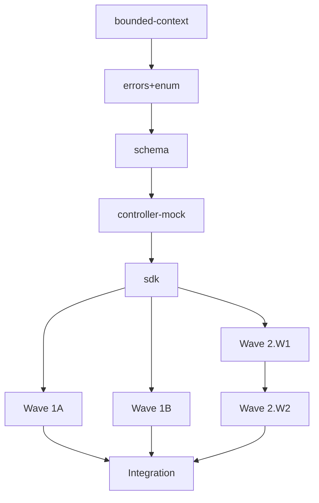

# /task-breakdown — Wave & Phase Planner (threshold-gated)

Take the File Structure list produced by `/plan` Phase 2 and overlay
the phase-lane execution model on top:

- **Phase 0 — Contract Lock** (serial, horizontal): bounded contexts,
  errors, enums, schemas, mocked controllers, SDK regen. Inherently
  cross-cutting — declares the API shape so that vertical slices can
  fan out without waiting on each other for contracts. **Note:**
  Phase 0 may place `errors` and `enums` whose **entity does not yet
  exist** — that's fine. Errors/enums are *closed-set definitions*,
  not *behaviors*; the entity that consumes them is implemented in
  Phase 1. This is not an ordering violation: Phase 0 declares,
  Phase 1 implements.
- **Phase 1 — Behavior Slices** (parallel by Story dependency,
  vertical): each Task is **one Story or AC = one observable behavior
  taken from RED to GREEN end-to-end**. A Task spans whatever
  artifacts the behavior requires (entity + usecase + controller +
  schema + form + component for a full-stack behavior; just a query
  filter + schema variant for a "hide field" behavior). Lanes
  (frontend / backend) are **tags** on Tasks for visualization, not
  separate phases — most Tasks span both.
- **Phase 2 — Integration + QA** (serial, horizontal): contract drift
  resolution, E2E coverage of every AC, final review.

(There is no separate "Phase 2 — Backend Lane" anymore. The previous
horizontal split between frontend and backend phases is the
anti-pattern Matt Pocock calls out: it makes tests insensitive to
real behavior change. We replaced it with vertical Behavior Slices.)

This skill does **not** decide WHAT artifacts exist (that's `/plan`
Phase 1 Explore + Phase 2 File Structure), nor HOW they're built
(that's `/plan` Phase 3 with TDD steps + inlined code, and `/build`
execution). It owns the **WHEN** layer — Phase 0 contract first,
then vertical Behavior Slices in dependency waves, then Phase 2
integration.

## When to Use

**Only invoked by `/plan` when one of these is true:**

- Plan produces ≥10 artifacts (counted from the File Structure list).
- Plan crosses ≥3 bounded contexts.
- User explicitly asks for the phase-lane preview standalone (sanity-check
  before committing to /plan).

For smaller plans, `/plan` inlines a simple topo-sort with a
`Parallel-with` column and skips this skill entirely. The phase-lane
overlay isn't worth the token cost for plans with 3-7 artifacts in
1-2 contexts.

## When NOT to Use

- Deriving artifacts from a spec → `/plan` Phase 1 (Explore)
- Writing TDD steps, validation, file paths, inlined code → `/plan` Phase 3
- Implementing code → per-artifact skills (`/entity`, `/usecase`, etc.)
- Making architectural decisions → `/plan` Phase 1 (with
  `/ddd-modeling` escape hatch)

## Inputs

1. The File Structure list from `/plan` Phase 2 — one entry per
   file to create/modify, with the owning skill and bounded context.
   In memory when called by `/plan`; the equivalent of the legacy
   `DerivedArtifact[]` shape.
2. Optional: a graph snapshot (from `/tmp/plan-graph.json`) for
   cross-checking dependency edges when called standalone.
2. The graph snapshot at `/tmp/plan-graph.json` (for cross-context
   dependency analysis between artifacts).

## Output

A `WavePlan` structure handed back to the caller (`/plan`) plus
an optional markdown view rendered inline in the plan's
`## Phase-Lane Overlay` section.

```ts
type AnnotatedTask = {
  storyId: string                  // 'Story 1' | 'AC-3' (the behavior this Task delivers)
  storyTitle: string               // human description of the behavior
  artifacts: DerivedArtifact[]     // all artifacts this Task touches, vertical slice
  phase: 0 | 1 | 2
  waveLabel: string                // '0' | 'W1' | 'W2' | 'W3' | '2'
  lane: 'backend' | 'frontend' | 'full-stack'  // tag for visualization
  classification:
    | 'serial'
    | 'parallel-now'
    | 'parallel-after-contract'
    | 'parallel-after-wave-1'
    | 'parallel-after-wave-2'
  startCondition: string           // human-readable: 'after P0.5', 'after Wave 1 stories'
  handoff?: TaskHandoff            // REQUIRED for any non-serial task (see Step 4.5)
}

// The load-bearing artifact when a task is executed by a FRESH-CONTEXT subagent.
// Classification says a task CAN fan out; the handoff is what makes it SAFE to.
type TaskHandoff = {
  frozenInputs: string[]   // EXACT identifiers the task consumes verbatim from earlier phases —
                           // SDK hooks/schemas/enums/event names ('useListPurchaseOrders',
                           // 'createPurchaseOrderMutationRequestSchema', 'PurchaseOrderRecordedEventName'),
                           // not prose ('the create schema'). The Phase-0 contract is the source.
  deliverables: string[]   // each output FILE PATH + the canon it must satisfy (R1..Rn style)
  scopeFences: string[]    // DONE (don't redefine/rebuild) · LEFT (this task) · OUT (other tasks)
  gates: string[]          // exact commands that close the task (tsc target, detect, test path)
  discretion: string[]     // what is explicitly left to the agent's judgment (prevents over-asking)
}

type WavePlan = {
  featureType: 1 | 2 | 3 | 4 | 5 | 6 | 7
  featureTypeRationale: string
  phasesInScope: (0 | 1 | 2 | 3)[]   // some feature types skip phases
  artifacts: AnnotatedArtifact[]
  parallelismMatrix: { kind: string; count: number; classification: string }[]
  criticalPath: string[]              // ordered artifact names on the longest dep chain
  dependencyGraph: string             // mermaid string for the plan file
}
```

## Process

### Step 1: Classify Feature Type (1–7)

Inspect the `DerivedArtifact[]` to calibrate scope. Use these heuristics:

| Type | Signal in `DerivedArtifact[]` | Phases needed |
|------|--------------------------------|---------------|
| **1 — Complete new feature** | ≥1 new entity AND ≥1 controller AND ≥1 frontend artifact | 0, 1, 2 |
| **2 — New endpoint(s), CRUD or read** | ≥1 new controller (mutation or query) with or without a corresponding frontend route. No new entity, or new entity is internal. **Mixed shapes (new backend endpoint + new frontend screen consuming it) live here**, not in Type 7. | 0, 1, 2 |
| **3 — Entity modification** | Only `action='modify'` on entity/repo; SDK regen if schema changed | 1, 2 (Phase 0 only for SDK) |
| **4 — New behavior on existing entity** | Modify existing entity's behavior + maybe new event/handler | 1, (2 if cross-context) |
| **5 — New integration / reaction** | Mostly handlers + events; cross-context or cross-service | 1, 2 |
| **6 — Small adjustment** | 1–2 artifacts total, no cross-cutting | targeted only |
| **7 — Frontend screen only (existing SDK)** | Only frontend kinds (route/component/form/store). **All backend endpoints already exist** — SDK is already generated and covers the data needs. If the backend needs new endpoints, this is Type 2 instead. | 1, 2 |

Record `featureType` and `featureTypeRationale` (1–2 sentences).

### Step 2: Phase Assignment (kind → phase)

Apply the deterministic mapping:

| Artifact kind | Phase |
|---------------|-------|
| `bounded-context` | 0 (must exist before any other code) |
| `errors`, `enum` | 0 (consumed by entities AND controllers; no behavior) |
| `schema` | 0 (controllers consume input/output schemas) |
| `controller` (mock first) | 0 |
| `sdk` regen | 0 (closes the contract lock) |
| `route`, `component`, `form`, `store`, `primitive` | 1 |
| `entity`, `value-object` | 2 |
| `db-modelling`, `migration` | 2 |
| `repository` | 2 |
| `usecase`, `query`, `service` | 2 |
| `event`, `handler` | 2 |
| qa / integration tasks (added by /plan) | 3 |

**Exception (controllers in Phase 2 too).** Phase 0 declares the
controller with **mocked response**. Phase 2 later replaces the mock
with the real use case / query call. In `/plan` this becomes two
Steps inside the same controller Task, not two separate Tasks.

### Step 3: Wave within Phase

Topo-sort the artifacts **within each phase** using their
`dependsOn` edges (derived from the code-graph by `/plan` Phase 1)
plus implicit-by-kind ordering.

#### Phase 0 — Contract Lock (always serial)

Wave order is fixed by industry pattern, not user-customizable:

```
0.0  bounded-context (only when net-new context is being created;
                      MUST be first — registry.ts, DI registration,
                      folder structure must exist before any other
                      artifact can reference the context)
0.1  errors + enum   (no deps; first because referenced everywhere)
0.2  schema          (input/output schemas)
0.3  controller      (declared with MOCK responses)
0.4  sdk regen       (runs `bun emit-openapi && bun sdk` so frontend
                      can fan out)
```

If no net-new context → skip 0.0; renumber 0.1..0.4 → 0.1..0.4 as
shown. If schema reused from existing context → 0.2 may be empty.
If no controller → 0.3 + 0.4 skipped (Feature Type 7 or pure handler
addition).

**Why bounded-context is 0.0 (not folded into 0.1):** errors, enums,
schemas and controllers all import from `<context>/registry.ts`. If
the context's folder + registry don't exist when those artifacts are
scaffolded, every CLI generator fails. Step 0.0 is the literal first
thing — folder + `registry.ts` + entry in `shared/registry.ts` — so
that 0.1..0.4 have a context to land in.

#### Phase 1 — Frontend Lane (parallel after P0.5)

Split into two wave labels:

- **Wave 1A — Read screens.** Routes and components that consume
  `query` outputs (read-only). Fully parallel; no inter-screen deps.
- **Wave 1B — Write screens.** Routes, components, and forms that
  call mutation controllers. May depend on Wave 1A if the same route
  hosts both (e.g., list page with inline edit). Default: parallel
  with 1A; sequence only on explicit `dependsOn`.

Inside each wave, individual screens are parallel — different
`files.writes`, no contention.

#### Phase 2 — Backend Lane (parallel by context wave)

Group artifacts by `context`. For each context, compute its
dependency on other contexts (artifact A in context X depends on
artifact B in context Y → context X depends on context Y).

- **Wave 2.W1 — Independent contexts.** Contexts with no inter-context
  deps. Run in parallel.
- **Wave 2.W2 — Dependent contexts.** Contexts that depend on Wave 1
  contexts.
- **Wave 2.W3+** — chain further if multiple levels.

Within a context, the implementation order is fixed by the backend
sequence (from `CLAUDE.md`):

```
errors+enum (already Phase 0) → entity → value-object → db-modelling →
migration → repository → service → usecase → handler → query
```

Each gets `parallel-after-wave-1` / `parallel-after-wave-2` etc.
based on its context's wave.

#### Phase 3 — Integration + QA (sequential)

```
3.1 contract-drift   (regenerate SDK if anything in Phase 2 changed contracts)
3.2 e2e              (Playwright tests covering each AC from the spec)
3.3 code-review      (final review across the entire change)
```

### Step 4: Classification

For each annotated artifact, set `classification`:

| Phase | Default classification |
|-------|------------------------|
| 0.1 | `serial` (first task; nothing in parallel) |
| 0.2–0.5 | `serial` (each waits the previous within Phase 0) |
| 1.\* | `parallel-after-contract` |
| 2.W1.\* | `parallel-after-contract` |
| 2.W2.\* | `parallel-after-wave-1` |
| 2.W3.\* | `parallel-after-wave-2` |
| 3.\* | `serial` |

`startCondition` is derived from the classification:

- `serial` → `"after <previous step id>"`
- `parallel-after-contract` → `"after 0.5"`
- `parallel-after-wave-X` → `"after Wave X of Phase 2"`

### Step 4.5: Handoff Sufficiency (every non-serial task)

Classification answers *"can this task fan out?"*. It does **not** answer *"will a fresh-context
subagent actually land it?"* — and those are different questions with a measured answer.

> **Why this step exists (measured, not asserted).** A single agent building a 7+-deliverable
> vertical slice in one context reliably **drops the tail** — it completes the early phases and
> then stubs the last artifacts (the create dialog, the e2e spec) under end-of-marathon budget
> pressure. This is a *capacity* limit, not a knowledge gap: each dropped artifact's canon passes
> its own isolated probe. The fix is the framework's own prescription — split at >7 deliverables and
> hand off to fresh-context subagents — **but only when the handoff is load-bearing.** A fresh agent
> handed a *precise* handoff (exact SDK identifiers, frozen contract, scope fences, deliverable→canon
> map) builds the tail the monolith dropped (measured: the dropped create-dialog + e2e both land,
> continuity held). A fresh agent handed a *vague* one ("build the frontend") re-derives shapes,
> hand-rolls schemas, and drifts — the same failure as the overloaded monolith, now with no shared
> context to recover from. **The handoff is the load-bearing artifact; spawning the subagent is the
> cheap part.**

So: **every task that is not `serial` MUST carry a `handoff`** sufficient for a fresh-context agent
to execute it without re-deriving anything. Fill all five fields:

- **`frozenInputs`** — the EXACT identifiers consumed from earlier phases, verbatim. Name
  `useCreatePurchaseOrder` / `createPurchaseOrderMutationRequestSchema` / `PurchaseOrderRecordedEventName`,
  never "the create hook / schema / event." These come from the Phase-0 Contract Lock output; if an
  identifier isn't frozen yet, the task isn't fannable — push it later or finish Phase 0.
- **`deliverables`** — each output file path + the one canon it must satisfy (the `R1..Rn` shape the
  agent checks itself against). The most common single-agent miss is a half-wired artifact (a search
  filter defined but never threaded into the hook) — name the wiring as the deliverable, not just the
  file.
- **`scopeFences`** — DONE (consume, never redefine/rebuild), LEFT (this task), OUT (sibling tasks).
  This is what the handoff-continuity check verifies; without it a fresh agent rebuilds what Phase 0
  already froze.
- **`gates`** — the exact close-out commands (`cd packages/app/react && bun x tsc --noEmit`, the
  detector, the test path). A subagent with no gate stops at "looks done" and stubs verification.
- **`discretion`** — what is explicitly the agent's call (file/component names, palette, layout) so it
  decides instead of stalling or over-asking.

Heuristic: if you couldn't paste a task's `handoff` into a fresh `claude -p` and expect a
canon-clean slice back, it isn't sufficient yet. The `synthetic-fullstack-handoff` probe is the
executable check of exactly this — a fresh agent finishing a slice from a handoff alone.

### Step 5: Critical Path + Parallelism Matrix

Walk the longest chain of `dependsOn` across all phases. That's the
`criticalPath` — its length is the lower bound on feature delivery
time, assuming infinite parallelism elsewhere.

Build the `parallelismMatrix`:

| kind | count | dominant classification |
|------|-------|--------------------------|
| controller | 3 | serial (Phase 0) |
| entity | 4 | parallel-after-contract |
| component | 7 | parallel-after-contract |
| ... | | |

### Step 6: Dependency Graph (mermaid)

Render the cross-phase dependency graph as a mermaid block that the
plan file can embed:

```
0.1 → 0.2 → 0.3 → 0.4 → 0.5
                            │
                ┌───────────┼───────────┐
                ▼           ▼           ▼
              1.* (FE)   2.W1.*       2.Data
                            │
                            ▼
                         2.W2.*
                            │
                            ▼
                          3.*
```

## Determinism Check

Before returning, verify:

- [ ] Every artifact has `phase` ∈ {0,1,2,3}
- [ ] Every artifact has `waveLabel`
- [ ] Every artifact has `classification` and `startCondition`
- [ ] No artifact in Phase 1 depends on an artifact in Phase 2 that
      isn't through the SDK contract (the SDK contract is the
      hand-off, NOT direct cross-phase artifact deps)
- [ ] Every controller in Phase 0 has a matching backend artifact in
      Phase 2 that will "unmock" it (use case or query)
- [ ] Every Phase 2 artifact's context has its bounded-context,
      errors, and enum artifacts in Phase 0 (or already existing)
- [ ] Critical path is computed and non-empty (unless feature is
      pure-additive with no chain)
- [ ] `featureType` matches the artifact mix (no Type 7 with new
      entities; no Type 6 with 10+ artifacts)

If any check fails, surface inconsistency to caller (`/plan` Phase 4
self-review).

## Output Template (rendered inline in plan's Phase-Lane Overlay section)

```markdown
## Wave Plan

**Feature Type:** <1–7> — <rationale>
**Phases in scope:** <list>
**Critical path length:** <N> steps

### Phase 0 — Contract Lock (serial)

| # | Artifact | Kind | Context | Classification |
|---|----------|------|---------|----------------|
| 0.1 | <BoundedContextName> | bounded-context | <ctx> | serial |
| 0.2 | <ErrorsName>, <EnumName> | errors, enum | <ctx> | serial |
| 0.3 | <SchemaName> | schema | <ctx> | serial |
| 0.4 | <ControllerName> | controller (MOCK) | <ctx> | serial |
| 0.5 | SDK regen | sdk | — | serial |

### Phase 1 — Frontend Lane (parallel after 0.5)

#### Wave 1A — Read Screens
| # | Artifact | Kind | Files (proposed) |
|---|----------|------|------------------|
| 1A.1 | <RouteName> | route | <path> |
| 1A.2 | <ComponentName> | component | <path> |

#### Wave 1B — Write Screens
| # | Artifact | Kind | Files (proposed) |
|---|----------|------|------------------|
| 1B.1 | <FormName> | form | <path> |
| 1B.2 | <RouteName> | route | <path> |

### Phase 2 — Backend Lane (parallel by context wave)

#### Wave 2.W1 — Independent contexts: <ctx-list>
| # | Artifact | Kind | Context | Classification |
|---|----------|------|---------|----------------|
| 2.W1.1 | <EntityName> | entity | <ctx> | parallel-after-contract |
| 2.W1.2 | <RepositoryName> | repository | <ctx> | parallel-after-contract |
| 2.W1.3 | <UseCaseName> | usecase | <ctx> | parallel-after-contract |

#### Wave 2.W2 — Dependent contexts: <ctx-list>
| # | Artifact | Kind | Context | Reason for dependency |
|---|----------|------|---------|------------------------|
| 2.W2.1 | <EntityName> | entity | <ctx> | depends on entity in <prev-ctx> |

### Phase 3 — Integration + QA (serial)
| # | Task | Classification |
|---|------|----------------|
| 3.1 | Contract drift resolution | serial |
| 3.2 | E2E test pass | serial |
| 3.3 | Final code review | serial |

### Parallelism Matrix

| Kind | Count | Dominant classification |
|------|-------|--------------------------|
| controller | <N> | serial (Phase 0) |
| entity | <N> | parallel-after-contract |
| ... | | |

### Critical Path

```
<artifact-1> → <artifact-2> → ... → <artifact-N>
```

### Dependency Graph


```

## Anti-Patterns

- ❌ **Horizontal Tasks** — grouping by artifact kind ("all entities,
  then all repos, then all use cases"). This is exactly the
  anti-pattern Matt Pocock's TDD framework warns about: tests
  detached from behavior, insensitive to real change. The Task unit
  is **one observable behavior** (Story/AC), not one layer.
- ❌ Putting `controller` in Phase 1 directly (skipping the mocked
  declaration in Phase 0). Without the Phase 0 contract, slices can't
  fan out.
- ❌ **Fanning out a task with a thin handoff** ("build the frontend",
  "wire up the consumer"). A `parallel-*` classification means a task
  *can* run in a fresh context — but a fresh-context subagent with a
  vague handoff re-derives shapes, hand-rolls schemas, and drops the
  tail, exactly like the overloaded monolith it was meant to relieve.
  Classification is permission to fan out; a load-bearing `handoff`
  (Step 4.5) is what makes it *safe* to. No `handoff`, no fan-out.
- ❌ Putting `entity` in Phase 0 (entities are domain, not contract).
- ❌ Skipping `featureType` classification — without it the phase
  scope is unconstrained and you over-engineer small changes.
- ❌ Adding Phase 2 (Integration + QA) tasks for trivial Type 6
  adjustments. A small fix doesn't need full E2E + drift + review.
- ❌ Reclassifying a Task's phase to "fix" a dependency cycle — the
  cycle is a real problem, not a labeling one. Refer back to
  `/plan` Phase 1 (re-explore) or `/ddd-modeling`.

## Checklist (before returning to /plan)

- [ ] Feature type classified (1–7) with rationale
- [ ] Every artifact has phase, waveLabel, classification,
  startCondition
- [ ] Every non-`serial` task carries a `handoff` (frozenInputs with
  EXACT identifiers · deliverables→canon · scopeFences · gates ·
  discretion) — Step 4.5. Could you paste it into a fresh `claude -p`
  and expect a canon-clean slice back?
- [ ] Phase 0 sequence is correct (bounded-context → errors+enum →
  schema → controller-mock → sdk)
- [ ] Frontend artifacts are all in Phase 1 with read/write split
- [ ] Backend artifacts grouped by context, dependent contexts in
  later waves
- [ ] No Phase 1 artifact depends on a Phase 2 artifact except
  through the SDK
- [ ] Critical path computed
- [ ] Parallelism matrix populated
- [ ] Dependency graph (mermaid) rendered
- [ ] Determinism check passes
- [ ] Markdown view rendered inline in the plan's `## Phase-Lane
  Overlay` section

## References

- `.claude/commands/plan.md` — consumer (Phase 1.8 threshold check
  + Phase 3 Task ordering). For plans under the threshold, /plan
  inlines the ordering and does not invoke this skill.
- `CLAUDE.md` — backend implementation order, frontend hierarchy,
  event architecture
- `docs/BACKEND.md`, `docs/FRONTEND.md` — architectural guides
