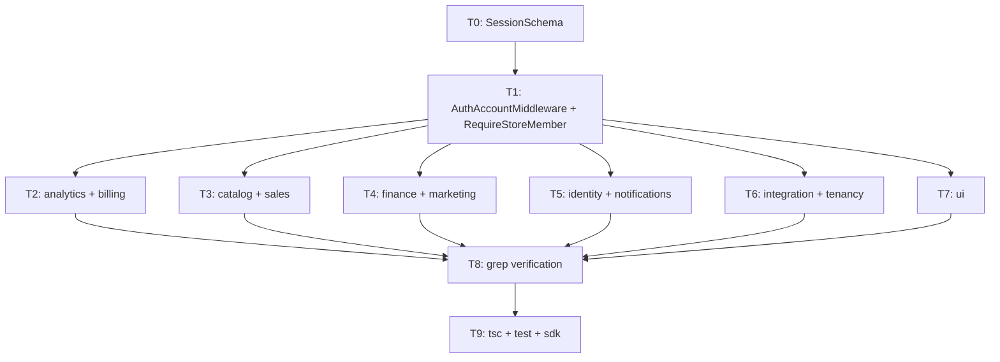

# SPEC-05: `AuthAccountMiddleware` Attaches `SessionSchema` Shape — Implementation Plan

> **For agentic workers:** Execute via `/build`. Steps use checkbox
> (`- [ ]`) syntax for tracking. Each Task wraps one observable
> behavior in an outer RED→GREEN cycle. This is a wide mechanical
> migration — committed in per-bounded-context waves so `bun tsc` is
> green at every commit boundary.

**Goal:** Change `AuthAccountMiddleware` to attach the canonical `SessionSchema` shape (`{ user, session }`) from SPEC-04 to `request.ctx`, then codemod all 53 controller files + 2 middleware files that read `ctx.session.userId` to read `ctx.user.id` instead, and update each controller's inline `ctx` schema from `session: z.object({ userId })` to `user: z.object({ id: z.string() })`.

**Architecture:** Phase 0 — one schema Task (creates `SessionSchema` in `src/shared/schemas/`). Phase 1 — middleware Task (rewrites `AuthAccountMiddleware` + updates `RequireStoreMember` cast). Phase 2 — grouped controller migration tasks (one per bounded context, parallel). Phase 3 — grep-verification + SDK regen. No new entities, repos, or use cases. Feature Type 3 (mechanical modification spanning existing artifacts; no new controllers or frontend screens).

**Tech Stack:** TypeScript + Bun; tsyringe-neo; Zod (`@template/core-typescript`).

**Spec:** `.specs/2026-05-25-refactor-batch-2/SPEC-05-authaccount-returns-session.md`
**Depends on:** SPEC-04 (`SessionSchema` must exist in `src/shared/schemas/SessionSchema.ts` before Task 1)
**Tasks:** 11
**Estimated minutes:** 220

> **Planner note — codemod approach.** The 53 controller sites are
> structurally identical: `session: z.object({ userId: z.string() })`
> in the InputSchema `ctx` block and `request.ctx.session.userId` in
> `handle()`. A sed-based codemod is appropriate per spec § Notes.
> Each Task applies it to one context, verifies `bun tsc` is green,
> and commits. This keeps each commit independently reviewable and
> keeps the build green throughout.

> **Planner note — SPEC-04 dependency.** Task 0 creates `SessionSchema`
> as the keystone artifact. If SPEC-04 was already completed before
> this plan runs, Task 0 is a no-op (schema already exists) — the
> builder should verify and skip if found. All Tasks except Task 0 hard
> depend on `SessionSchema` existing.

> **Planner note — RequireStoreMember.** This middleware reads
> `ctx.session?.userId` via a cast (`request.ctx as { session?: { userId?: string } }`).
> After the middleware change it reads `ctx.user?.id` via the analogous
> cast. This is migrated in Task 1 (middleware wave), not in the
> per-context controller waves, because it is a middleware not a
> controller.

---

## Wave Plan

**Feature Type:** 3 — Mechanical modification of existing artifacts across 10 bounded contexts; no new entities, repos, use cases, or frontend artifacts. Pure codemod + one schema declaration.
**Phases in scope:** 0 (schema declaration), 1 (middleware + controller migration), 2 (verification + SDK regen)
**Critical path length:** 5 steps (SessionSchema → AuthAccountMiddleware → controller groups → grep verification → SDK)

### Phase 0 — Contract Lock (serial)

| # | Artifact | Kind | Context | Classification |
|---|----------|------|---------|----------------|
| 0.1 | `SessionSchema` | schema | shared | serial |

### Phase 1 — Migration (serial then parallel)

| # | Artifact | Wave | Contexts | Classification |
|---|----------|------|----------|----------------|
| 1.1 | `AuthAccountMiddleware` + `RequireStoreMember` | W1 | auth, tenancy | serial (must precede controller tasks) |
| 1.2 | analytics + billing controllers | W2 | analytics, billing | parallel-after-wave-1 |
| 1.3 | catalog + sales controllers | W2 | catalog, sales | parallel-after-wave-1 |
| 1.4 | finance + marketing controllers | W2 | finance, marketing | parallel-after-wave-1 |
| 1.5 | identity + notifications controllers | W2 | identity, notifications | parallel-after-wave-1 |
| 1.6 | integration + tenancy controllers | W2 | integration, tenancy | parallel-after-wave-1 |
| 1.7 | ui controllers | W2 | ui | parallel-after-wave-1 |

### Phase 2 — Verification + SDK (serial)

| # | Task | Classification |
|---|------|----------------|
| 2.1 | Grep verification — zero `ctx.session.userId` sites | serial |
| 2.2 | `bun tsc` + `bun run test` full pass + SDK regen | serial |

### Dependency Graph



---

## Task 0: `SessionSchema` exists in `src/shared/schemas/`

> **SPEC-04 dependency.** If SPEC-04 already landed, verify the file
> exists and skip this Task. This Task is the keystone for all others.

**Files:**
- Create: `packages/api/typescript/src/shared/schemas/SessionSchema.ts`
- Modify: `packages/api/typescript/src/shared/schemas/index.ts` — export `SessionSchema` (create the barrel if it doesn't exist)

**Agent:** backend-developer
**Reviewer:** spec-compliance-reviewer → code-reviewer
**Model:** sonnet
**Skills:** /schema
**Depends on:** (none — this IS the SPEC-04 deliverable)
**Phase:** 0 (Contract Lock)

- [ ] **Step 1: Check if SPEC-04 already landed**

```bash
test -f packages/api/typescript/src/shared/schemas/SessionSchema.ts && echo "EXISTS — skip Task 0" || echo "MISSING — implement Task 0"
```

If EXISTS, skip to Task 1.

- [ ] **Step 2: Create the canonical `SessionSchema`**

Create `packages/api/typescript/src/shared/schemas/SessionSchema.ts`:

```ts
import { z } from '@template/core-typescript'

/**
 * Canonical session shape. Mirrors better-auth's getSession() response.
 * Populated by AuthAccountMiddleware and attached to request.ctx.
 * Consumed by controllers via `ctx.user.id` and `ctx.session.id`.
 *
 * SPEC-04 declares this; SPEC-05 wires it into the middleware.
 * SPEC-07 will add `session.storeId` here.
 */
export const SessionSchema = z.object({
  user: z.object({
    id: z.string(),
    email: z.string(),
    name: z.string().nullable(),
    emailVerified: z.boolean(),
  }),
  session: z.object({
    id: z.string(),
    userId: z.uuid(),
    expiresAt: z.coerce.date(),
    // storeId: z.string() — added in SPEC-07
  }),
})

export type Session = z.infer<typeof SessionSchema>
```

- [ ] **Step 3: Export from shared schemas barrel**

Create or update `packages/api/typescript/src/shared/schemas/index.ts`:

```ts
export { SessionSchema, type Session } from './SessionSchema'
```

(If the barrel already exists, add the export line. Do not disturb existing exports.)

- [ ] **Step 4: Verify `bun tsc` is still clean**

```bash
bun tsc --noEmit 2>&1 | head -20
```

Expected: 0 errors.

- [ ] **Step 5: Commit**

```bash
git add packages/api/typescript/src/shared/schemas/
git commit -m "feat(auth): canonical SessionSchema in shared/schemas (SPEC-04/SPEC-05 Task 0)"
```

---

## Task 1: `AuthAccountMiddleware` attaches `{ user, session }` + `RequireStoreMember` reads `user.id`

> **Phase 1, Wave 1 — serial.** Must commit before any controller Task
> runs. The middleware is the producer; controllers are consumers. Both
> must be in sync at every green commit boundary.

**Files:**
- Modify: `packages/api/typescript/src/auth/middlewares/AuthAccountMiddleware.ts`
- Modify: `packages/api/typescript/src/tenancy/middlewares/RequireStoreMember.ts`

**Agent:** backend-developer
**Reviewer:** spec-compliance-reviewer → code-reviewer
**Model:** sonnet
**Skills:** /middleware
**Depends on:** Task 0
**Phase:** 1 (Migration, Wave 1 — serial)

- [ ] **Step 1: Rewrite `AuthAccountMiddleware` to attach `SessionSchema` shape**

Replace the body of `AuthAccountMiddleware.ts` with the new implementation. The key changes:
- Import `SessionSchema` from `@shared/schemas` (or the aliased path matching the repo's tsconfig path mappings).
- Replace the bespoke `SessionResponseSchema` with `SessionSchema`.
- Attach `user: validated.data.user` and `session: validated.data.session` (not the flat `session: { userId, email, name }` object).

The current file is at `packages/api/typescript/src/auth/middlewares/AuthAccountMiddleware.ts` (lines 1–48). Replace it:

```ts
// src/auth/middlewares/AuthAccountMiddleware.ts
import { singleton } from 'tsyringe-neo'
import { BaseError } from '@template/core-typescript'
import type { HttpControllerRequest, HttpMiddlewareResponse } from '@template/core-typescript'
import type { Middleware } from '@template/core-typescript'
import type { BaseInterfaceErrors } from '@template/core-typescript'
import { SessionSchema } from '@shared/schemas'
import { BetterAuth } from '../services/Authentication/BetterAuth'

/**
 * Validates the better-auth session and attaches the canonical
 * SessionSchema shape to request.ctx:
 *   ctx.user    — { id, email, name, emailVerified }
 *   ctx.session — { id, userId, expiresAt }
 *
 * Downstream consumers read `ctx.user.id` (not `ctx.session.userId`).
 * See SPEC-05.
 */
@singleton()
export class AuthAccountMiddleware implements Middleware {
  constructor(private betterAuth: BetterAuth) {}

  async execute(request: HttpControllerRequest<unknown>): Promise<HttpMiddlewareResponse<void>> {
    const response = await this.betterAuth.auth.api.getSession({
      headers: request.raw.headers as Headers,
      asResponse: true,
    })

    if (!response.ok) {
      throw new BaseError<BaseInterfaceErrors>('UNAUTHORIZED')
    }

    const rawSession = await response.json()
    const validated = SessionSchema.safeParse(rawSession)

    if (!validated.success) {
      throw new BaseError<BaseInterfaceErrors>('UNAUTHORIZED', 'Invalid session structure')
    }

    request.ctx = {
      ...request.ctx,
      user: validated.data.user,
      session: validated.data.session,
    }

    return {}
  }
}
```

Key changes from the old file:
- `SessionResponseSchema` (bespoke local) removed; replaced by `SessionSchema` import.
- `request.ctx.session` was `{ userId, email, name }` → now `{ id, userId, expiresAt }` (the full `session` object from SessionSchema).
- `request.ctx.user` is now attached (`{ id, email, name, emailVerified }`).

- [ ] **Step 2: Update `RequireStoreMember` to read `ctx.user.id`**

The current cast in `RequireStoreMember.ts` (line 24) reads:
```ts
const userId = (request.ctx as { session?: { userId?: string } } | undefined)?.session?.userId
```

Change it to:
```ts
const userId = (request.ctx as { user?: { id?: string } } | undefined)?.user?.id
```

No other changes to the file are needed (the rest of the middleware — `storeId`, `findByStoreAndUser`, `membership` stamping — is unaffected).

- [ ] **Step 3: Run `bun tsc` and verify it's clean**

At this point controllers still reference `ctx.session.userId` — that's fine because the controllers' `ctx` schema is Zod-validated at the controller boundary, and the type of `request.ctx` is `unknown` until each controller parses it. The type system at the middleware level compiles. Verify:

```bash
cd packages/api/typescript && bun tsc --noEmit 2>&1 | head -30
```

Expected: any remaining errors are in controllers (from the old schema — those are fixed in subsequent Tasks), not in the middleware files themselves. If middleware errors appear, fix them before proceeding.

- [ ] **Step 4: Commit (Commit 1)**

```bash
git add packages/api/typescript/src/auth/middlewares/AuthAccountMiddleware.ts \
        packages/api/typescript/src/tenancy/middlewares/RequireStoreMember.ts
git commit -m "refactor(auth,tenancy): AuthAccountMiddleware attaches SessionSchema shape; RequireStoreMember reads user.id (SPEC-05 Task 1)"
```

---

## Task 2: Migrate `analytics` + `billing` controllers

> **Phase 1, Wave 2 — parallel with Tasks 3–7.** All Wave 2 tasks
> are independent (different files, different contexts). They can run
> concurrently. Each must leave `bun tsc` green at its commit.

**Affected files (5 total):**
- Modify: `src/analytics/controllers/CreateGoalController.ts`
- Modify: `src/analytics/controllers/DeleteGoalController.ts`
- Modify: `src/analytics/controllers/DuplicateLastGoalController.ts`
- Modify: `src/analytics/controllers/UpdateGoalController.ts`
- Modify: `src/billing/controllers/GetMySubscription.ts`
- Modify: `src/billing/controllers/ListSubscriptionEventHistory.ts`

**Agent:** backend-developer
**Reviewer:** spec-compliance-reviewer → code-reviewer
**Model:** sonnet
**Skills:** /controller
**Depends on:** Task 1
**Phase:** 1 (Migration, Wave 2 — parallel-after-wave-1)

- [ ] **Step 1: Apply the codemod to analytics + billing**

For each file in the list above, apply two mechanical changes:

**Change A — InputSchema `ctx` block** (find → replace):
```ts
// FIND (verbatim):
ctx: z.object({ session: z.object({ userId: z.string() }) })

// REPLACE WITH:
ctx: z.object({ user: z.object({ id: z.string() }) })
```

Some files may spread across multiple lines. The canonical pattern in this codebase (confirmed from `CreateGoalController.ts:8` and `UpdateProfileController.ts:9-11`) is either single-line or two-line. Handle both:

```ts
// Multi-line variant (FIND):
ctx: z.object({
    session: z.object({ userId: z.string() }),
}),

// Multi-line variant (REPLACE):
ctx: z.object({
    user: z.object({ id: z.string() }),
}),
```

**Change B — `handle()` body** (find → replace):
```ts
// FIND:
request.ctx.session.userId

// REPLACE WITH:
request.ctx.user.id
```

Also update `.example([...])` blocks that reference `ctx: { session: { userId: ... } }`:
```ts
// FIND in example:
ctx: { session: { userId: 'user-123' } }

// REPLACE:
ctx: { user: { id: 'user-123' } }
```

Run the codemod via sed (adjusting for each context directory):

```bash
# For analytics:
cd packages/api/typescript
for f in src/analytics/controllers/CreateGoalController.ts \
          src/analytics/controllers/DeleteGoalController.ts \
          src/analytics/controllers/DuplicateLastGoalController.ts \
          src/analytics/controllers/UpdateGoalController.ts; do
  # Change A: schema block
  sed -i '' \
    's/session: z\.object({ userId: z\.string() })/user: z.object({ id: z.string() })/g' \
    "$f"
  # Change B: usage in handle()
  sed -i '' \
    's/request\.ctx\.session\.userId/request.ctx.user.id/g' \
    "$f"
  # Change C: example block
  sed -i '' \
    "s/ctx: { session: { userId: 'user-123' } }/ctx: { user: { id: 'user-123' } }/g" \
    "$f"
  echo "Patched $f"
done

# For billing:
for f in src/billing/controllers/GetMySubscription.ts \
          src/billing/controllers/ListSubscriptionEventHistory.ts; do
  sed -i '' \
    's/session: z\.object({ userId: z\.string() })/user: z.object({ id: z.string() })/g' \
    "$f"
  sed -i '' \
    's/request\.ctx\.session\.userId/request.ctx.user.id/g' \
    "$f"
  sed -i '' \
    "s/ctx: { session: { userId: 'user-123' } }/ctx: { user: { id: 'user-123' } }/g" \
    "$f"
  echo "Patched $f"
done
```

After running sed, **manually inspect each patched file** to confirm the replacements are correct and no multi-line variants were missed. Fix any that sed didn't catch.

- [ ] **Step 2: Run `bun tsc` (analytics + billing scope)**

```bash
bun tsc --noEmit 2>&1 | grep -E "analytics|billing" | head -20
```

Expected: no errors in analytics or billing controllers.

- [ ] **Step 3: Commit (Commit 2)**

```bash
git add src/analytics/controllers/ src/billing/controllers/
git commit -m "refactor(analytics,billing): ctx.session.userId → ctx.user.id (SPEC-05 Task 2)"
```

(Run from `packages/api/typescript/`.)

---

## Task 3: Migrate `catalog` + `sales` controllers

**Affected files (7 total):**
- Modify: `src/catalog/controllers/AddProductTagController.ts`
- Modify: `src/catalog/controllers/BulkImportProductCostsFromCsvController.ts`
- Modify: `src/catalog/controllers/CreateProductCostController.ts`
- Modify: `src/catalog/controllers/DeleteProductCostController.ts`
- Modify: `src/catalog/controllers/RemoveProductTagController.ts`
- Modify: `src/catalog/controllers/UpdateProductCostController.ts`
- Modify: `src/sales/controllers/UpdateOrderOverrideController.ts`

**Agent:** backend-developer
**Reviewer:** spec-compliance-reviewer → code-reviewer
**Model:** sonnet
**Skills:** /controller
**Depends on:** Task 1
**Phase:** 1 (Migration, Wave 2 — parallel-after-wave-1)

- [ ] **Step 1: Apply the codemod to catalog + sales**

Apply the same three sed substitutions from Task 2 to each file in the list:

```bash
cd packages/api/typescript
for f in src/catalog/controllers/AddProductTagController.ts \
          src/catalog/controllers/BulkImportProductCostsFromCsvController.ts \
          src/catalog/controllers/CreateProductCostController.ts \
          src/catalog/controllers/DeleteProductCostController.ts \
          src/catalog/controllers/RemoveProductTagController.ts \
          src/catalog/controllers/UpdateProductCostController.ts \
          src/sales/controllers/UpdateOrderOverrideController.ts; do
  sed -i '' \
    's/session: z\.object({ userId: z\.string() })/user: z.object({ id: z.string() })/g' \
    "$f"
  sed -i '' \
    's/request\.ctx\.session\.userId/request.ctx.user.id/g' \
    "$f"
  sed -i '' \
    "s/ctx: { session: { userId: 'user-123' } }/ctx: { user: { id: 'user-123' } }/g" \
    "$f"
  echo "Patched $f"
done
```

Manually inspect each file. Pay attention to `BulkImportProductCostsFromCsvController.ts` — it may use a different example string (e.g., a different userId value). Fix manually if sed misses it.

- [ ] **Step 2: Run `bun tsc` (catalog + sales scope)**

```bash
bun tsc --noEmit 2>&1 | grep -E "catalog|sales" | head -20
```

Expected: 0 errors in catalog or sales.

- [ ] **Step 3: Commit (Commit 3)**

```bash
git add src/catalog/controllers/ src/sales/controllers/
git commit -m "refactor(catalog,sales): ctx.session.userId → ctx.user.id (SPEC-05 Task 3)"
```

---

## Task 4: Migrate `finance` + `marketing` controllers

**Affected files (9 total):**
- Modify: `src/finance/controllers/CreateOperationalCostController.ts`
- Modify: `src/finance/controllers/CreateWarrantyReserveController.ts`
- Modify: `src/finance/controllers/DeleteOperationalCostController.ts`
- Modify: `src/finance/controllers/DeleteWarrantyReserveController.ts`
- Modify: `src/finance/controllers/ToggleOperationalCostStatusController.ts`
- Modify: `src/finance/controllers/UpdateFeesConfigurationController.ts`
- Modify: `src/finance/controllers/UpdateOperationalCostController.ts`
- Modify: `src/finance/controllers/UpdateTaxesController.ts`
- Modify: `src/finance/controllers/UpdateWarrantyReserveController.ts`
- Modify: `src/marketing/controllers/BindCampaignToProductController.ts`
- Modify: `src/marketing/controllers/DeleteManualAdSpendController.ts`
- Modify: `src/marketing/controllers/ReconcileMarketingAccountsController.ts`
- Modify: `src/marketing/controllers/RecordManualAdSpendController.ts`
- Modify: `src/marketing/controllers/UnbindCampaignFromProductController.ts`
- Modify: `src/marketing/controllers/UpdateManualAdSpendController.ts`

**Agent:** backend-developer
**Reviewer:** spec-compliance-reviewer → code-reviewer
**Model:** sonnet
**Skills:** /controller
**Depends on:** Task 1
**Phase:** 1 (Migration, Wave 2 — parallel-after-wave-1)

- [ ] **Step 1: Apply the codemod to finance + marketing**

```bash
cd packages/api/typescript
for f in src/finance/controllers/CreateOperationalCostController.ts \
          src/finance/controllers/CreateWarrantyReserveController.ts \
          src/finance/controllers/DeleteOperationalCostController.ts \
          src/finance/controllers/DeleteWarrantyReserveController.ts \
          src/finance/controllers/ToggleOperationalCostStatusController.ts \
          src/finance/controllers/UpdateFeesConfigurationController.ts \
          src/finance/controllers/UpdateOperationalCostController.ts \
          src/finance/controllers/UpdateTaxesController.ts \
          src/finance/controllers/UpdateWarrantyReserveController.ts \
          src/marketing/controllers/BindCampaignToProductController.ts \
          src/marketing/controllers/DeleteManualAdSpendController.ts \
          src/marketing/controllers/ReconcileMarketingAccountsController.ts \
          src/marketing/controllers/RecordManualAdSpendController.ts \
          src/marketing/controllers/UnbindCampaignFromProductController.ts \
          src/marketing/controllers/UpdateManualAdSpendController.ts; do
  sed -i '' \
    's/session: z\.object({ userId: z\.string() })/user: z.object({ id: z.string() })/g' \
    "$f"
  sed -i '' \
    's/request\.ctx\.session\.userId/request.ctx.user.id/g' \
    "$f"
  sed -i '' \
    "s/ctx: { session: { userId: 'user-123' } }/ctx: { user: { id: 'user-123' } }/g" \
    "$f"
  echo "Patched $f"
done
```

Inspect all 15 files. Finance controllers tend to be uniform; marketing ones (especially `ReconcileMarketingAccountsController`) may have different example values — adjust manually.

- [ ] **Step 2: Run `bun tsc` (finance + marketing scope)**

```bash
bun tsc --noEmit 2>&1 | grep -E "finance|marketing" | head -20
```

Expected: 0 errors.

- [ ] **Step 3: Commit (Commit 4)**

```bash
git add src/finance/controllers/ src/marketing/controllers/
git commit -m "refactor(finance,marketing): ctx.session.userId → ctx.user.id (SPEC-05 Task 4)"
```

---

## Task 5: Migrate `identity` + `notifications` controllers

**Affected files (10 total):**
- Modify: `src/identity/controllers/GetProfileSettings.ts`
- Modify: `src/identity/controllers/GetUserPreferencesSettings.ts`
- Modify: `src/identity/controllers/RegisterFcmToken.ts`
- Modify: `src/identity/controllers/UnregisterFcmToken.ts`
- Modify: `src/identity/controllers/UpdateProfile.ts`
- Modify: `src/identity/controllers/UpdateUserPreferences.ts`
- Modify: `src/notifications/controllers/GetNotificationsInboxController.ts`
- Modify: `src/notifications/controllers/MarkNotificationReadController.ts`
- Modify: `src/notifications/controllers/SendNotificationController.ts`
- Modify: `src/notifications/controllers/TriggerDailyDigestController.ts`

**Agent:** backend-developer
**Reviewer:** spec-compliance-reviewer → code-reviewer
**Model:** sonnet
**Skills:** /controller
**Depends on:** Task 1
**Phase:** 1 (Migration, Wave 2 — parallel-after-wave-1)

- [ ] **Step 1: Apply the codemod to identity + notifications**

```bash
cd packages/api/typescript
for f in src/identity/controllers/GetProfileSettings.ts \
          src/identity/controllers/GetUserPreferencesSettings.ts \
          src/identity/controllers/RegisterFcmToken.ts \
          src/identity/controllers/UnregisterFcmToken.ts \
          src/identity/controllers/UpdateProfile.ts \
          src/identity/controllers/UpdateUserPreferences.ts \
          src/notifications/controllers/GetNotificationsInboxController.ts \
          src/notifications/controllers/MarkNotificationReadController.ts \
          src/notifications/controllers/SendNotificationController.ts \
          src/notifications/controllers/TriggerDailyDigestController.ts; do
  sed -i '' \
    's/session: z\.object({ userId: z\.string() })/user: z.object({ id: z.string() })/g' \
    "$f"
  sed -i '' \
    's/request\.ctx\.session\.userId/request.ctx.user.id/g' \
    "$f"
  sed -i '' \
    "s/ctx: { session: { userId: 'user-123' } }/ctx: { user: { id: 'user-123' } }/g" \
    "$f"
  echo "Patched $f"
done
```

Note: `UpdateProfile.ts` (identity) also has an inline comment `// AuthAccountMiddleware injects ctx.session.userId` on line 37. Update that comment to `// AuthAccountMiddleware injects ctx.user.id`. This is not caught by the sed above — fix manually.

- [ ] **Step 2: Run `bun tsc` (identity + notifications scope)**

```bash
bun tsc --noEmit 2>&1 | grep -E "identity|notifications" | head -20
```

Expected: 0 errors.

- [ ] **Step 3: Commit (Commit 5)**

```bash
git add src/identity/controllers/ src/notifications/controllers/
git commit -m "refactor(identity,notifications): ctx.session.userId → ctx.user.id (SPEC-05 Task 5)"
```

---

## Task 6: Migrate `integration` + `tenancy` controllers

**Affected files (13 total):**
- Modify: `src/integration/controllers/ConnectIntegrationController.ts`
- Modify: `src/integration/controllers/DisconnectIntegrationController.ts`
- Modify: `src/integration/controllers/ToggleIntegrationActiveController.ts`
- Modify: `src/integration/controllers/TriggerReintegrationAllController.ts`
- Modify: `src/integration/controllers/TriggerReintegrationController.ts`
- Modify: `src/tenancy/controllers/AcceptInvitation.ts`
- Modify: `src/tenancy/controllers/CreateStore.ts`
- Modify: `src/tenancy/controllers/DisableStore.ts`
- Modify: `src/tenancy/controllers/EnableStore.ts`
- Modify: `src/tenancy/controllers/InviteMember.ts`
- Modify: `src/tenancy/controllers/MyStores.ts`
- Modify: `src/tenancy/controllers/UpdateStorePreferences.ts`
- Modify: `src/tenancy/controllers/UpdateStoreSettings.ts`

**Agent:** backend-developer
**Reviewer:** spec-compliance-reviewer → code-reviewer
**Model:** sonnet
**Skills:** /controller
**Depends on:** Task 1
**Phase:** 1 (Migration, Wave 2 — parallel-after-wave-1)

- [ ] **Step 1: Apply the codemod to integration + tenancy controllers**

```bash
cd packages/api/typescript
for f in src/integration/controllers/ConnectIntegrationController.ts \
          src/integration/controllers/DisconnectIntegrationController.ts \
          src/integration/controllers/ToggleIntegrationActiveController.ts \
          src/integration/controllers/TriggerReintegrationAllController.ts \
          src/integration/controllers/TriggerReintegrationController.ts \
          src/tenancy/controllers/AcceptInvitation.ts \
          src/tenancy/controllers/CreateStore.ts \
          src/tenancy/controllers/DisableStore.ts \
          src/tenancy/controllers/EnableStore.ts \
          src/tenancy/controllers/InviteMember.ts \
          src/tenancy/controllers/MyStores.ts \
          src/tenancy/controllers/UpdateStorePreferences.ts \
          src/tenancy/controllers/UpdateStoreSettings.ts; do
  sed -i '' \
    's/session: z\.object({ userId: z\.string() })/user: z.object({ id: z.string() })/g' \
    "$f"
  sed -i '' \
    's/request\.ctx\.session\.userId/request.ctx.user.id/g' \
    "$f"
  sed -i '' \
    "s/ctx: { session: { userId: 'user-123' } }/ctx: { user: { id: 'user-123' } }/g" \
    "$f"
  echo "Patched $f"
done
```

Note: `ConnectIntegrationController.ts` has a multi-line `ctx` example block (lines 11–13 and the `.example()` on line 24). The sed Change A covers single-line; confirm multi-line was caught. If not, manually patch:

```ts
// FIND:
ctx: z.object({
    session: z.object({ userId: z.string() }),
}),
// REPLACE:
ctx: z.object({
    user: z.object({ id: z.string() }),
}),
```

Also in the `.example()` for `ConnectIntegrationController`:
```ts
// FIND:
ctx: { session: { userId: 'user-123' } },
// REPLACE:
ctx: { user: { id: 'user-123' } },
```

- [ ] **Step 2: Run `bun tsc` (integration + tenancy scope)**

```bash
bun tsc --noEmit 2>&1 | grep -E "integration|tenancy" | head -20
```

Expected: 0 errors.

- [ ] **Step 3: Commit (Commit 6)**

```bash
git add src/integration/controllers/ src/tenancy/controllers/
git commit -m "refactor(integration,tenancy): ctx.session.userId → ctx.user.id (SPEC-05 Task 6)"
```

---

## Task 7: Migrate `ui` controllers

**Affected files (1 total):**
- Modify: `src/ui/controllers/GetMyWatchHistory.ts`

**Agent:** backend-developer
**Reviewer:** spec-compliance-reviewer → code-reviewer
**Model:** sonnet
**Skills:** /controller
**Depends on:** Task 1
**Phase:** 1 (Migration, Wave 2 — parallel-after-wave-1)

- [ ] **Step 1: Apply the codemod to the ui controller**

```bash
cd packages/api/typescript
f="src/ui/controllers/GetMyWatchHistory.ts"
sed -i '' \
  's/session: z\.object({ userId: z\.string() })/user: z.object({ id: z.string() })/g' \
  "$f"
sed -i '' \
  's/request\.ctx\.session\.userId/request.ctx.user.id/g' \
  "$f"
sed -i '' \
  "s/ctx: { session: { userId: 'user-123' } }/ctx: { user: { id: 'user-123' } }/g" \
  "$f"
echo "Patched $f"
```

Inspect the file manually to confirm correctness.

- [ ] **Step 2: Run `bun tsc` (ui scope)**

```bash
bun tsc --noEmit 2>&1 | grep "ui" | head -10
```

Expected: 0 errors.

- [ ] **Step 3: Commit (Commit 7)**

```bash
git add src/ui/controllers/GetMyWatchHistory.ts
git commit -m "refactor(ui): ctx.session.userId → ctx.user.id (SPEC-05 Task 7)"
```

---

## Task 8: Grep verification — zero `ctx.session.userId` sites remain

> **Phase 2, serial.** This Task is a gate: it must pass before the
> SDK is regenerated. Runs after all Wave 2 Tasks complete.

**Files:** (none created or modified — verification only)

**Agent:** backend-developer
**Reviewer:** spec-compliance-reviewer → code-reviewer
**Model:** sonnet
**Skills:** (none)
**Depends on:** Tasks 2, 3, 4, 5, 6, 7
**Phase:** 2 (Verification)

- [ ] **Step 1: Grep for any surviving `ctx.session.userId` in controller files**

```bash
grep -rn "ctx\.session\.userId" \
  packages/api/typescript/src/ \
  --include="*.ts" \
  | grep -v ".test.ts"
```

Expected: **zero output**. If any lines appear, fix them before proceeding.

- [ ] **Step 2: Grep for any surviving inline `session: z.object({ userId` schema patterns**

```bash
grep -rn "session: z\.object({ userId" \
  packages/api/typescript/src/ \
  --include="*.ts"
```

Expected: **zero output**. If any lines appear, identify the file/context and apply the same Change A substitution.

- [ ] **Step 3: Grep for any example blocks with the old shape**

```bash
grep -rn "session: { userId:" \
  packages/api/typescript/src/ \
  --include="*.ts"
```

Expected: **zero output**. Fix any occurrences manually.

- [ ] **Step 4: Verify `AuthAccountMiddleware` attaches the new shape**

```bash
grep -n "user: validated.data.user" \
  packages/api/typescript/src/auth/middlewares/AuthAccountMiddleware.ts
grep -n "session: validated.data.session" \
  packages/api/typescript/src/auth/middlewares/AuthAccountMiddleware.ts
```

Expected: both lines are present (the new attachment shape).

- [ ] **Step 5: Verify `RequireStoreMember` reads `user.id`**

```bash
grep -n "user?.id" \
  packages/api/typescript/src/tenancy/middlewares/RequireStoreMember.ts
```

Expected: the cast reads `{ user?: { id?: string } }` and extracts `?.user?.id`.

- [ ] **Step 6: Commit verification result**

No files to commit (verification only). Proceed to Task 9.

---

## Task 9: Full `bun tsc` + `bun run test` pass + SDK regen

> **Phase 2, serial.** The final quality gate. Must be clean before
> the PR is opened.

**Files:** (generated — `packages/api/typescript/public/docs/openapi.json`)

**Agent:** backend-developer
**Reviewer:** spec-compliance-reviewer → code-reviewer
**Model:** sonnet
**Skills:** /sdk
**Depends on:** Task 8
**Phase:** 2 (Verification + SDK)

- [ ] **Step 1: Full type-check across all workspaces**

```bash
bun tsc
```

Expected: 0 errors across all TS workspaces (api, app, contracts, client). If errors appear, trace them — they will be in controllers that were missed by the codemod. Fix inline, then re-run.

- [ ] **Step 2: Run all tests**

```bash
bun run test
```

Expected: all tests pass. Controller and middleware tests that assert on `ctx.session.userId` will need to be updated to `ctx.user.id`. Identify failing tests:

```bash
bun run test 2>&1 | grep -E "FAIL|session\.userId" | head -20
```

For each failing test file, apply the same substitution (Change A + Change B) to the test's mock/assertion setup. The most likely candidates are controller unit tests that build a mock `request.ctx` with the old shape.

- [ ] **Step 3: Regenerate the SDK**

```bash
bun sdk
```

This runs `bun emit-openapi` (regenerates `openapi.json`) and then `bun x kubb generate` (regenerates the client SDK). The OpenAPI schema for every controller that had `ctx.session: { userId }` will now reflect `ctx.user: { id }` in its internal request structure (though `ctx` is not exposed in the public OpenAPI surface — only `body`, `params`, `query`, `headers` appear). Confirm `openapi.json` was updated:

```bash
git diff --stat packages/api/typescript/public/docs/openapi.json
```

Expected: the file changed (timestamp at minimum; possibly schema changes if the old `ctx` shape leaked into the OpenAPI output).

- [ ] **Step 4: Run `bun tsc` again after SDK regen**

```bash
bun tsc
```

Expected: still 0 errors (SDK regen can introduce breakage if the output type changed).

- [ ] **Step 5: Commit (final commit)**

```bash
git add packages/api/typescript/public/docs/openapi.json \
        packages/client/
git commit -m "chore(sdk): regen after SPEC-05 session shape migration (Task 9)"
```

(Add any test files that were updated in Step 2 to the same or a preceding commit.)

---

## Task 10: Update middleware + controller tests for new session shape

> **Merged with Task 9 if test failures are discovered there. Broken out
> as a separate Task for clarity — the builder should address failing
> tests in the same session as Task 9, not defer them.**

**Files (discover at runtime via `bun run test`):**
- Modify: test files in `src/auth/middlewares/*.test.ts` (if any)
- Modify: test files in `src/*/controllers/*.test.ts` that build `request.ctx` with old shape

**Agent:** backend-developer
**Reviewer:** spec-compliance-reviewer → code-reviewer
**Model:** sonnet
**Skills:** /test
**Depends on:** Tasks 2–7 (all controller migrations)
**Phase:** 2 (Verification)

- [ ] **Step 1: Identify failing test files**

```bash
bun run test 2>&1 | grep -E "FAIL|✗" | head -30
```

- [ ] **Step 2: Apply codemod to failing test files**

For each test file that asserts on the old session shape:

```bash
for f in <list of failing test files>; do
  sed -i '' \
    "s/session: { userId:/user: { id:/g" \
    "$f"
  sed -i '' \
    "s/ctx\.session\.userId/ctx.user.id/g" \
    "$f"
  echo "Patched test: $f"
done
```

Also update mock `request.ctx` construction:

```ts
// FIND in tests:
request.ctx = { session: { userId: 'user-abc' } }

// REPLACE:
request.ctx = { user: { id: 'user-abc' }, session: { id: 'sess-1', userId: 'user-abc', expiresAt: new Date() } }
```

- [ ] **Step 3: Run tests again**

```bash
bun run test
```

Expected: all pass.

- [ ] **Step 4: Commit test fixes**

```bash
git add <patched test files>
git commit -m "test: update controller/middleware tests for SessionSchema shape (SPEC-05 Task 10)"
```

---

## Task 11: Acceptance criteria verification

> **Phase 2, serial. Final gate before PR.**

**Files:** none

**Agent:** spec-compliance-reviewer
**Reviewer:** code-reviewer
**Model:** sonnet
**Skills:** /review
**Depends on:** Task 9, Task 10
**Phase:** 2

- [ ] **AC 1: `AuthAccountMiddleware` attaches `SessionSchema` shape**

```bash
grep -n "user: validated.data.user" \
  packages/api/typescript/src/auth/middlewares/AuthAccountMiddleware.ts
grep -n "session: validated.data.session" \
  packages/api/typescript/src/auth/middlewares/AuthAccountMiddleware.ts
```

Expected: both lines present. If not, fail.

- [ ] **AC 2: Zero controllers read `ctx.session.userId`**

```bash
result=$(grep -rn "ctx\.session\.userId" \
  packages/api/typescript/src/ \
  --include="*.ts")
[ -z "$result" ] && echo "AC 2 PASS" || echo "AC 2 FAIL: $result"
```

Expected: `AC 2 PASS`.

- [ ] **AC 3: Zero controllers inline `session: z.object({ userId`**

```bash
result=$(grep -rn "session: z\.object({ userId" \
  packages/api/typescript/src/ \
  --include="*.ts")
[ -z "$result" ] && echo "AC 3 PASS" || echo "AC 3 FAIL: $result"
```

Expected: `AC 3 PASS`.

- [ ] **AC 4: `bun tsc` clean**

```bash
bun tsc && echo "AC 4 PASS" || echo "AC 4 FAIL"
```

Expected: `AC 4 PASS`.

- [ ] **AC 5: `bun run test` clean**

```bash
bun run test && echo "AC 5 PASS" || echo "AC 5 FAIL"
```

Expected: `AC 5 PASS`.
