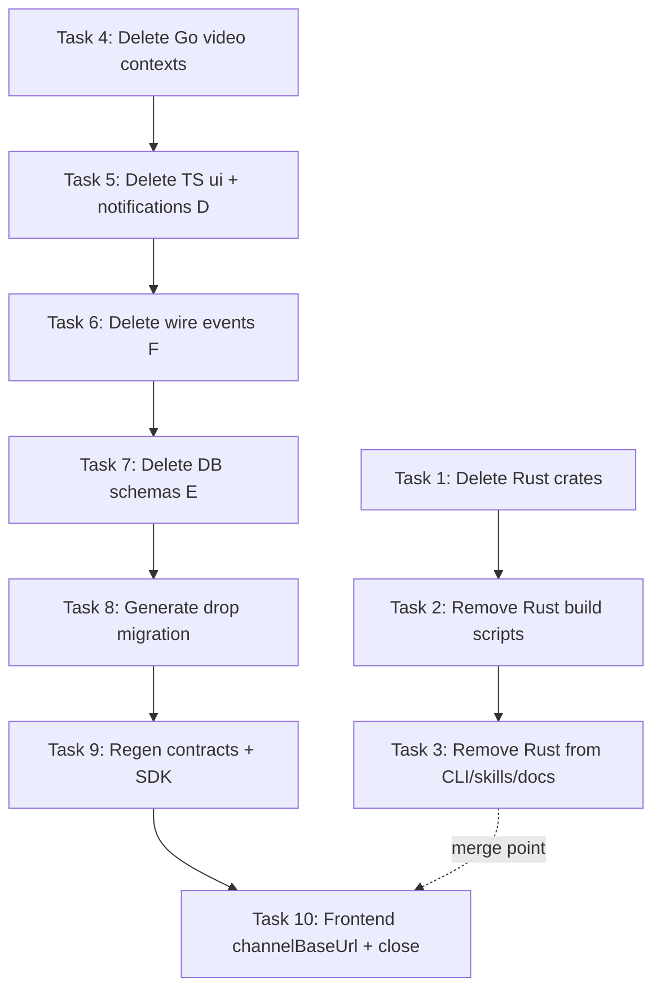

# SPEC-17: Remove the Video Domain — Implementation Plan

> **For agentic workers:** Execute via `/build`. Steps use checkbox
> (`- [ ]`) syntax for tracking. This spec is **Wave 0** — it runs first
> before any other batch-2 spec. Every commit boundary keeps
> `go build ./... && bun tsc && bun run test` green.

**Goal:** Fully excise the video streaming domain from the repo — the entire Rust service and toolchain (Stream A), the Go video worker contexts (Stream B), the TS `/ui` BoundedContext (Stream C), the video-specific notifications handler and read-repository (Stream D), the `video`/`channel`/`engagement`/`search` DB schemas and two analytics video tables (Stream E), nine TypeSpec wire events (Stream F), and the unused frontend `channelBaseUrl` constant (Stream G). After this plan the only backends are TypeScript + Go, and `bun tsc / go build / bun run test` are re-baselined as the Wave 1 starting point.

**Architecture:** Two independent streams run in parallel — **Stream A** (Rust removal, Tasks 1–3) is fully independent of **Streams B–G** (Go + TS + Contracts + App, Tasks 4–10). Within B–G the ordering is: Go contexts first (Task 4), then TS consumers before their contracts are deleted (Tasks 5–7 combined with Task 8 contracts), then SDK regeneration (Task 9), then docs/tooling cleanup (Task 10). The notifications handler (Stream D) and DB schemas (Stream E) must be removed in the same commit as or before the contracts migration to avoid dangling imports. SDK is regenerated after wire events are deleted (Task 9) to ensure the generated client no longer references video types.

**Tech Stack:** Go (fx, net/http), TypeScript + Bun (tsyringe-neo, Drizzle), TypeSpec, Drizzle migrations, Nx, root `package.json`, `.env.example`, `.gitignore`, docs.

**Spec:** `.specs/2026-05-25-refactor-batch-2/SPEC-17-remove-video-domain.md`

**Tasks:** 10

**Estimated minutes:** 240

> **Planner note — stream parallelism.** Tasks 1–3 (Rust) are independent of Tasks 4–10 (Go+TS+Contracts). A second agent MAY execute Tasks 1–3 while the primary executes Tasks 4–10, provided both agents work on separate commit branches that are later merged. If executing single-threaded, do Task 1 → 2 → 3 → 4 → 5 → 6 → 7 → 8 → 9 → 10.

> **Planner note — deletion ordering.** The critical constraint in Streams B–G is: **TS consumers must be removed before or simultaneously with their contract imports**. Concretely: Task 5 (TS `/ui` + notifications D) + Task 7 (contracts schema edits) must both land before or at the same time as Task 8 (migration). Task 6 (wire events) can precede Task 9 (SDK regen) — the SDK regen is the last step to close the contract lock.

> **Planner note — `pushLog.videoId` migration complexity.** The `push_log_user_video_kind_idx` unique index includes `videoId`. After dropping `videoId`, if push-log idempotency is still needed it must reindex on `(userId, kind)` alone. The spec says "reindex on `(userId, kind)` if needed" — since `kind` alone gives sufficient idempotency for non-video notifications, the plan creates a new `push_log_user_kind_idx` index in the migration.

---

## Task 1 (Stream A): Delete the Rust crate workspace + artefacts

> **Stream A — parallel with Tasks 4–10.**
> Move-only / delete-only. Removes everything Cargo-workspace-related.
> `bun tsc` and `go build ./...` are unaffected by this Task.

**Files:**
- Delete: `Cargo.toml`, `Cargo.lock`
- Delete: `packages/api/rust/` (entire tree including `Cargo.toml`, `core/`, `project.json`, `public/`, `src/`)
- Delete: `packages/client/dist/rust/` (entire tree)
- Delete: `packages/client/generators/rust/` (entire tree)
- Delete: `packages/contracts/generated/rust/` (entire tree)
- Delete: `scripts/graph/adapters/rust/` (entire tree)
- Delete: `packages/contracts/codegen/emit-wire-rs.ts`
- Delete: `packages/contracts/codegen/emit-wire-rs.test.ts`
- Delete: `packages/client/lib/render/rust.ts`
- Modify: `.gitignore` — remove `target/`, `packages/api/rust/target/`, `packages/client/typescript/src/api-rust/**` patterns

**Agent:** backend-developer
**Reviewer:** spec-compliance-reviewer → code-reviewer
**Model:** sonnet
**Skills:** (none — pure deletion)
**Depends on:** (none)

- [ ] **Step 1: Delete the Cargo workspace files**

```bash
cd /Users/gabrielaraujo/Desktop/Projetos/pessoal/template-fullstack
git rm Cargo.toml Cargo.lock
```

- [ ] **Step 2: Delete the Rust API service**

```bash
git rm -r packages/api/rust/
```

- [ ] **Step 3: Delete Rust client artefacts**

```bash
git rm -r packages/client/dist/rust/
git rm -r packages/client/generators/rust/
git rm packages/client/lib/render/rust.ts
```

- [ ] **Step 4: Delete generated Rust contracts**

```bash
git rm -r packages/contracts/generated/rust/
git rm packages/contracts/codegen/emit-wire-rs.ts
git rm packages/contracts/codegen/emit-wire-rs.test.ts
```

- [ ] **Step 5: Delete graph extractor for Rust**

```bash
git rm -r scripts/graph/adapters/rust/
```

- [ ] **Step 6: Clean `.gitignore`**

Remove these lines from `.gitignore`:
- `target/` (Cargo output root — no longer relevant)
- `packages/api/rust/target/`
- `packages/client/typescript/src/api-rust/client/**`
- `packages/client/typescript/src/api-rust/hooks/**`
- `packages/client/typescript/src/api-rust/types/**`
- `packages/client/typescript/src/api-rust/zod/**`
- `packages/client/typescript/src/api-rust/.kubb/**`

- [ ] **Step 7: Verify build is still green**

```bash
cd /Users/gabrielaraujo/Desktop/Projetos/pessoal/template-fullstack
go build ./packages/api/go/...
bun tsc --noEmit
```

Expected: 0 errors (neither go nor ts know about the deleted rust files).

- [ ] **Step 8: Commit (A.1)**

```bash
git add -A
git commit -m "feat(wave-0): SPEC-17 delete Rust crate workspace + client artefacts (Task 1)"
```

---

## Task 2 (Stream A): Remove Rust build scripts and Nx targets

> **Stream A — parallel with Tasks 4–10.**
> Removes `dev:api:rust`, `sdk:rust` from root `package.json`, the `api-rust` entry in
> `dev`/`dev:api`, the rust step from `packages/client/package.json` generate script,
> the `api-rust` dependsOn from `packages/client/project.json`, and the
> `codegen:wire:rust` step from `packages/contracts/package.json`.

**Files:**
- Modify: `package.json` (root) — scripts `dev`, `dev:api`, remove `dev:api:rust`, remove `sdk:rust`
- Modify: `packages/client/package.json` — `generate` script: remove `&& bun generators/rust/index.ts`
- Modify: `packages/client/project.json` — `generate.dependsOn`: remove `{ "projects": "api-rust", "target": "emit-openapi" }`
- Modify: `packages/contracts/package.json` — `codegen:wire`: remove `&& bun run codegen:wire:rust`; remove `codegen:wire:rust` entry
- Modify: `.env.example` — remove `API_RUST_PORT`, `API_RUST_EVENT_GROUP_ID`, `API_RUST_URL` lines

**Agent:** backend-developer
**Reviewer:** spec-compliance-reviewer → code-reviewer
**Model:** sonnet
**Skills:** (none — config edits)
**Depends on:** 1

- [ ] **Step 1: Edit root `package.json`**

In `scripts`:
- `"dev"`: remove `,api-rust` from `-p api-typescript,api-rust,api-go,app-react,app-astro`; update `--parallel=5` → `--parallel=4`
- `"dev:api"`: remove `,api-rust` from `-p api-typescript,api-rust,api-go`; update `--parallel=3` → `--parallel=2`
- Remove `"dev:api:rust": "nx run api-rust:dev"` line entirely
- Remove `"sdk:rust": "nx run client:generate"` line entirely (if it existed as a standalone alias — verify)

- [ ] **Step 2: Edit `packages/client/package.json`**

```diff
- "generate": "bun generators/typescript.ts && bun generators/rust/index.ts && bun generators/go.ts",
+ "generate": "bun generators/typescript.ts && bun generators/go.ts",
```

- [ ] **Step 3: Edit `packages/client/project.json`**

Remove the `{ "projects": "api-rust", "target": "emit-openapi" }` entry from `targets.generate.dependsOn`.

- [ ] **Step 4: Edit `packages/contracts/package.json`**

```diff
- "codegen:wire:rust": "bun codegen/emit-wire-rs.ts",
- "codegen:wire": "bun run codegen:wire:typescript && bun run codegen:wire:rust && bun run codegen:wire:go",
+ "codegen:wire": "bun run codegen:wire:typescript && bun run codegen:wire:go",
```

- [ ] **Step 5: Edit `.env.example`**

Remove the three lines:
```
API_RUST_PORT=3031
API_RUST_EVENT_GROUP_ID=api-rust
API_RUST_URL=http://localhost:3031
```

Also remove the `INTERNAL_SERVICE_KEY` comment that says "bypass header for api-rust → api-typescript" if no other service uses it; keep the key itself if it has a non-rust purpose (verify by grep).

- [ ] **Step 6: Verify scripts parse cleanly**

```bash
cd /Users/gabrielaraujo/Desktop/Projetos/pessoal/template-fullstack
bun run --help 2>&1 | grep -E "dev:|sdk:" || true
# Just verify no JSON parse errors in package.json
node -e "require('./package.json')" && echo "OK"
node -e "require('./packages/client/package.json')" && echo "OK"
node -e "require('./packages/client/project.json')" && echo "OK"
node -e "require('./packages/contracts/package.json')" && echo "OK"
```

- [ ] **Step 7: Commit (A.2)**

```bash
git add package.json packages/client/package.json packages/client/project.json \
        packages/contracts/package.json .env.example
git commit -m "feat(wave-0): SPEC-17 remove Rust build scripts + Nx targets (Task 2)"
```

---

## Task 3 (Stream A): Remove Rust from CLI, e2e, skills, and docs

> **Stream A — parallel with Tasks 4–10.**
> Removes the `rs → rust` CLI alias + rust branch from `scripts/cli.ts` and
> `scripts/cli/backend/index.ts`; drops the `rust:` key from `configureClient()`
> in `packages/e2e/utils/given/user.ts`; deletes the 16 `.claude/skills/*/rust/`
> variant dirs; and updates `CLAUDE.md` + `docs/BACKEND.md`.

**Files:**
- Modify: `scripts/cli.ts` — remove `rs → rust` alias + any rust-specific help text
- Modify: `scripts/cli/backend/index.ts` — remove `import * as rust from './rust'`; remove `rust` key from `PER_LANG_GENERATORS`; remove `case 'rust'` from `generateFullContext`
- Modify: `packages/e2e/utils/given/user.ts` — remove `rust: API_BASE_URL` from `configureClient(...)` call
- Delete: `.claude/skills/query/rust/`, `.claude/skills/usecase/rust/`, `.claude/skills/event/rust/`, `.claude/skills/projection/rust/`, `.claude/skills/handler/rust/`, `.claude/skills/middleware/rust/`, `.claude/skills/repository/rust/`, `.claude/skills/projector/rust/`, `.claude/skills/test/rust/`, `.claude/skills/entity/rust/`, `.claude/skills/enum/rust/`, `.claude/skills/value-object/rust/`, `.claude/skills/controller/rust/`, `.claude/skills/schema/rust/`, `.claude/skills/errors/rust/`, `.claude/skills/service/rust/`
- Modify: `CLAUDE.md` — update workspace table (remove `packages/api/rust` row), remove "Cargo workspace" from Build line, remove `dev:api:rust` from commands section, remove `rs → rust` row from skill-dispatch table, update "Polyglot" description to TS + Go only
- Modify: `docs/BACKEND.md` — remove rust-specific sections

**Agent:** backend-developer
**Reviewer:** spec-compliance-reviewer → code-reviewer
**Model:** sonnet
**Skills:** (none — deletion + doc edit)
**Depends on:** 2

- [ ] **Step 1: Remove Rust from `scripts/cli/backend/index.ts`**

Remove:
```ts
import * as rust from './rust'
```
Remove `rust: rust.backendGenerators` from `PER_LANG_GENERATORS`. Remove `case 'rust': return rust.generateFullContext(contextName)` from `generateFullContext`. Remove `rust` from the `BackendLang` type if it is defined there (check `helpers.ts`).

- [ ] **Step 2: Remove rust alias from `scripts/cli.ts`**

Remove the `rs → typescript` alias (or `rs → rust`) from the alias map. Remove `rust` from `--lang` help text. Remove the `rust` row from the skill-dispatch table shown in help output.

- [ ] **Step 3: Remove rust key from e2e `configureClient`**

In `packages/e2e/utils/given/user.ts`:
```diff
- configureClient({ typescript: API_BASE_URL, rust: API_BASE_URL, go: API_BASE_URL })
+ configureClient({ typescript: API_BASE_URL, go: API_BASE_URL })
```

Also remove `rust: { baseUrl: '' }` from `realSdkClient()` and `rust: { baseUrl: 'http://stub.local', fetch: fetchStub }` from `mockSdkClient()` in `packages/api/typescript/src/shared/registry.ts`. (These reference the generated `Client.create` which must be updated once SDK is regenerated in Task 9 — note as a follow-up step there.)

- [ ] **Step 4: Delete the 16 rust skill variant dirs**

```bash
for skill in query usecase event projection handler middleware repository projector test entity enum value-object controller schema errors service; do
  git rm -r .claude/skills/$skill/rust/ 2>/dev/null || true
done
```

- [ ] **Step 5: Update `CLAUDE.md`**

- Workspace table: remove `| packages/api/rust | Rust + sqlx + axum + utoipa | Writes, SSE, webhooks |`
- Overview line: `TypeScript + Bun`, ~~Rust~~, and `Go`
- Build line: `Build orchestrated by Nx for TS targets + ~~Cargo workspace for Rust +~~ Go modules for Go`
- Commands: remove `bun dev:api:rust` row
- Skill-dispatch table rows: remove `| .rs em packages/api/rust/ | rust | <skill>/rust/{SKILL,registry} |`
- Which-skills-have-variants: remove rust column from the table
- Skills section "16 skills have rust variants" note: update count to 0

- [ ] **Step 6: Update `docs/BACKEND.md`**

Search for Rust-specific sections (SDK pipeline rust emitter paragraph, Rust service architecture notes, axum/sqlx references) and remove them. Keep Go-specific sections unchanged.

- [ ] **Step 7: Verify CLI still works for ts + go**

```bash
cd /Users/gabrielaraujo/Desktop/Projetos/pessoal/template-fullstack
bun cli --lang=typescript --help 2>&1 | head -5
bun cli --lang=go --help 2>&1 | head -5
bun tsc --noEmit
```

Expected: no "rust" import errors; TypeScript compiles.

- [ ] **Step 8: Commit (A.3)**

```bash
git add scripts/cli.ts scripts/cli/backend/ packages/e2e/utils/given/user.ts \
        .claude/skills/ CLAUDE.md docs/BACKEND.md
git commit -m "feat(wave-0): SPEC-17 remove Rust from CLI, e2e, skills, docs (Task 3)"
```

---

## Task 4 (Stream B): Delete Go video worker contexts

> **Streams B–G start here — independent of Streams A (Tasks 1–3) but
> Tasks 4–10 are sequential with each other.**
> Delete `internal/{analytics,search,transcoding}/` and their registrations
> in `cmd/api/main.go`. `go build ./... && go test ./...` stays green.

**Files:**
- Delete: `packages/api/go/internal/analytics/` (entire tree)
- Delete: `packages/api/go/internal/search/` (entire tree)
- Delete: `packages/api/go/internal/transcoding/` (entire tree)
- Modify: `packages/api/go/cmd/api/main.go` — remove 3 imports + 3 `Module` registrations

**Agent:** backend-developer
**Reviewer:** spec-compliance-reviewer → code-reviewer
**Model:** sonnet
**Skills:** (none — pure deletion)
**Depends on:** (none — independent of Tasks 1–3)

- [ ] **Step 1: Remove imports and module registrations from `main.go`**

Edit `packages/api/go/cmd/api/main.go`:

```diff
-	"template/api-go/internal/analytics"
-	"template/api-go/internal/search"
-	"template/api-go/internal/transcoding"
```

```diff
 		// Bounded contexts.
-		transcoding.Module,
-		search.Module,
-		analytics.Module,
 		sync.Module,
```

After this edit, `main.go` imports only `integrations`, `sync`, `webhooks`, and `shared`.

- [ ] **Step 2: Verify `go build` passes before deleting the dirs**

```bash
cd /Users/gabrielaraujo/Desktop/Projetos/pessoal/template-fullstack
go build ./packages/api/go/...
```

Expected: 0 errors (the import paths are removed so the dirs can now be deleted without breaking the build).

- [ ] **Step 3: Delete the three context trees**

```bash
git rm -r packages/api/go/internal/analytics/
git rm -r packages/api/go/internal/search/
git rm -r packages/api/go/internal/transcoding/
```

- [ ] **Step 4: Build + test**

```bash
cd /Users/gabrielaraujo/Desktop/Projetos/pessoal/template-fullstack
go build ./packages/api/go/... && go test ./packages/api/go/...
```

Expected: build 0 errors; remaining tests (sync, integrations, webhooks) PASS.

- [ ] **Step 5: Commit (B)**

```bash
git add packages/api/go/cmd/api/main.go
git rm -r packages/api/go/internal/analytics packages/api/go/internal/search packages/api/go/internal/transcoding
git commit -m "feat(wave-0): SPEC-17 delete Go video worker contexts (Task 4)"
```

---

## Task 5 (Stream C+D): Delete TS `/ui` context and notifications video parts

> Delete the entire `src/ui/` BoundedContext and the video-only
> `notifications` handler + read-repository. Must precede the contract
> schema deletions (Task 7) because these TS files import from
> `@template/contracts/db` (video/channel tables). Keeping them while
> the schema exports are removed would cause `bun tsc` to fail.

**Files:**
- Delete: `packages/api/typescript/src/ui/` (entire tree: controllers/, entities/, enums/, errors/, events/, handlers/, middlewares/, objects/, projections/, repositories/, services/, usecases/, index.ts, registry.ts)
- Modify: `packages/api/typescript/src/index.ts` — remove `import UIRouter from '@ui/index'` + remove `UIRouter` from routers array
- Modify: `packages/api/typescript/src/shared/registry.ts` — remove `import { INSTANCE_REGISTRY as uiRegistry } from '@ui/registry'` + remove `...uiRegistry.mock`, `...uiRegistry.integration`, `...uiRegistry.real` from `ALL_REGISTRIES`
- Delete: `packages/api/typescript/src/notifications/handlers/NotifySubscribersHandler.ts`
- Delete: `packages/api/typescript/src/notifications/handlers/NotifySubscribersHandler.test.ts`
- Modify: `packages/api/typescript/src/notifications/handlers/external.ts` — remove `export { NotifySubscribersHandler } from './NotifySubscribersHandler'`
- Delete: `packages/api/typescript/src/notifications/repositories/SubscriptionReadRepository/` (entire dir: SubscriptionReadRepository.ts, DrizzleSubscriptionReadRepository.ts, MockSubscriptionReadRepository.ts, index.ts)
- Modify: `packages/api/typescript/src/notifications/repositories/index.ts` — remove `export * from './SubscriptionReadRepository'`
- Modify: `packages/api/typescript/src/notifications/registry.ts` — remove all three `SubscriptionReadRepository` imports + all three `{ token: SubscriptionReadRepository, instance: ... }` entries from mock/integration/real

**Agent:** backend-developer
**Reviewer:** spec-compliance-reviewer → code-reviewer
**Model:** sonnet
**Skills:** /bounded-context, /handler
**Depends on:** 4

- [ ] **Step 1: Remove UI wiring from `src/index.ts`**

Edit `packages/api/typescript/src/index.ts`:
```diff
- import UIRouter from '@ui/index'
```
And in the routers array:
```diff
-		UIRouter,
```

- [ ] **Step 2: Remove UI registry from `src/shared/registry.ts`**

Edit `packages/api/typescript/src/shared/registry.ts`:
```diff
- import { INSTANCE_REGISTRY as uiRegistry } from '@ui/registry'
```
In `ALL_REGISTRIES`:
```diff
 	mock: {
-		...uiRegistry.mock,
 		...authRegistry.mock,
 		...
 	},
 	integration: {
-		...uiRegistry.integration,
 		...authRegistry.integration,
 		...
 	},
 	real: {
-		...uiRegistry.real,
 		...authRegistry.real,
 		...
 	},
```

- [ ] **Step 3: Delete the entire `src/ui/` directory**

```bash
git rm -r packages/api/typescript/src/ui/
```

- [ ] **Step 4: Remove `NotifySubscribersHandler` from notifications**

Delete the two files:
```bash
git rm packages/api/typescript/src/notifications/handlers/NotifySubscribersHandler.ts
git rm packages/api/typescript/src/notifications/handlers/NotifySubscribersHandler.test.ts
```

Edit `packages/api/typescript/src/notifications/handlers/external.ts`:
```diff
- export { NotifySubscribersHandler } from './NotifySubscribersHandler'
```

- [ ] **Step 5: Remove `SubscriptionReadRepository` from notifications**

Delete the dir:
```bash
git rm -r packages/api/typescript/src/notifications/repositories/SubscriptionReadRepository/
```

Edit `packages/api/typescript/src/notifications/repositories/index.ts`:
```diff
- export * from './SubscriptionReadRepository'
```

Edit `packages/api/typescript/src/notifications/registry.ts` — remove all SubscriptionReadRepository imports and bindings (3 imports at top; 3 `{ token, instance }` entries in mock/integration/real arrays).

- [ ] **Step 6: `bun tsc` must pass (all video schema imports inside ui/ are now gone)**

```bash
cd /Users/gabrielaraujo/Desktop/Projetos/pessoal/template-fullstack
bun tsc --noEmit
```

Expected: 0 errors. If there are dangling imports in other contexts pointing to `@ui/` — that would be a spec violation (spec says ui is isolated); surface and fix.

- [ ] **Step 7: `bun run test` — notifications tests pass without `NotifySubscribersHandler`**

```bash
bun run test --filter='packages/api/typescript'
```

Expected: `NotifySubscribersHandler.test.ts` is gone; remaining notification tests (IntegrationHandshakeFailedNotifyHandler, OrderUpdatedNotifyHandler) pass.

- [ ] **Step 8: Commit (C+D)**

```bash
git add packages/api/typescript/src/index.ts \
        packages/api/typescript/src/shared/registry.ts \
        packages/api/typescript/src/notifications/handlers/external.ts \
        packages/api/typescript/src/notifications/repositories/index.ts \
        packages/api/typescript/src/notifications/registry.ts
git rm -r packages/api/typescript/src/ui/ \
          packages/api/typescript/src/notifications/handlers/NotifySubscribersHandler.ts \
          packages/api/typescript/src/notifications/handlers/NotifySubscribersHandler.test.ts \
          packages/api/typescript/src/notifications/repositories/SubscriptionReadRepository/
git commit -m "feat(wave-0): SPEC-17 delete TS /ui context + notifications video handler/repo (Task 5)"
```

---

## Task 6 (Stream F): Delete video wire events from TypeSpec

> Remove the 9 video/engagement/channel `.tsp` files and their imports
> from `wire/events/index.tsp`. The SDK regen in Task 9 closes the
> contract loop; this task only removes the source files.

**Files:**
- Delete: `packages/contracts/wire/events/video-uploaded.tsp`
- Delete: `packages/contracts/wire/events/video-transcoded.tsp`
- Delete: `packages/contracts/wire/events/video-published.tsp`
- Delete: `packages/contracts/wire/events/video-archived.tsp`
- Delete: `packages/contracts/wire/events/channel-subscribed.tsp`
- Delete: `packages/contracts/wire/events/channel-unsubscribed.tsp`
- Delete: `packages/contracts/wire/events/reaction-added.tsp`
- Delete: `packages/contracts/wire/events/comment-posted.tsp`
- Delete: `packages/contracts/wire/events/view-recorded.tsp`
- Modify: `packages/contracts/wire/events/index.tsp` — remove the 9 corresponding `import` lines

**Agent:** backend-developer
**Reviewer:** spec-compliance-reviewer → code-reviewer
**Model:** sonnet
**Skills:** /event
**Depends on:** 5

- [ ] **Step 1: Delete the nine `.tsp` event files**

```bash
git rm packages/contracts/wire/events/video-uploaded.tsp \
       packages/contracts/wire/events/video-transcoded.tsp \
       packages/contracts/wire/events/video-published.tsp \
       packages/contracts/wire/events/video-archived.tsp \
       packages/contracts/wire/events/channel-subscribed.tsp \
       packages/contracts/wire/events/channel-unsubscribed.tsp \
       packages/contracts/wire/events/reaction-added.tsp \
       packages/contracts/wire/events/comment-posted.tsp \
       packages/contracts/wire/events/view-recorded.tsp
```

- [ ] **Step 2: Remove the 9 import lines from `wire/events/index.tsp`**

Edit `packages/contracts/wire/events/index.tsp` — remove:
```diff
- import "./video-uploaded.tsp";
- import "./video-transcoded.tsp";
- import "./video-published.tsp";
- import "./video-archived.tsp";
- import "./channel-subscribed.tsp";
- import "./channel-unsubscribed.tsp";
- import "./reaction-added.tsp";
- import "./comment-posted.tsp";
- import "./view-recorded.tsp";
```

- [ ] **Step 3: Verify TypeSpec compiles**

```bash
cd /Users/gabrielaraujo/Desktop/Projetos/pessoal/template-fullstack/packages/contracts
bun run tsp:compile
```

Expected: 0 errors. If any remaining `.tsp` file references a deleted video type, fix it.

- [ ] **Step 4: Verify TS still compiles (wire events are referenced by deleted ui/ — already gone)**

```bash
cd /Users/gabrielaraujo/Desktop/Projetos/pessoal/template-fullstack
bun tsc --noEmit
```

Expected: 0 errors. `VideoPublishedEvent` was only consumed by `NotifySubscribersHandler` (deleted in Task 5).

- [ ] **Step 5: Commit (F)**

```bash
git add packages/contracts/wire/events/index.tsp
git rm packages/contracts/wire/events/video-uploaded.tsp \
       packages/contracts/wire/events/video-transcoded.tsp \
       packages/contracts/wire/events/video-published.tsp \
       packages/contracts/wire/events/video-archived.tsp \
       packages/contracts/wire/events/channel-subscribed.tsp \
       packages/contracts/wire/events/channel-unsubscribed.tsp \
       packages/contracts/wire/events/reaction-added.tsp \
       packages/contracts/wire/events/comment-posted.tsp \
       packages/contracts/wire/events/view-recorded.tsp
git commit -m "feat(wave-0): SPEC-17 delete 9 video/channel/engagement wire events (Task 6)"
```

---

## Task 7 (Stream E): Delete video/channel/engagement/search DB schemas + edit analytics/notifications

> Removes the four video-domain Drizzle schema files and their exports from
> `db/schema/index.ts`; edits `analytics.ts` and `notifications.ts` in-place
> to remove video-specific tables and columns. After this task
> `bun tsc` must still pass — the migration (Task 8) handles the Postgres side.

**Files:**
- Delete: `packages/contracts/db/schema/video.ts`
- Delete: `packages/contracts/db/schema/channel.ts`
- Delete: `packages/contracts/db/schema/engagement.ts`
- Delete: `packages/contracts/db/schema/search.ts`
- Modify: `packages/contracts/db/schema/index.ts` — remove `export * from './video'`, `./channel`, `./engagement`, `./search`
- Modify: `packages/contracts/db/schema/analytics.ts` — remove `import { videos } from './video'`, remove `videoWatchAnalytics` table, remove `videoDailyStats` table (keep schema shell and `analyticsSchema` if nothing else lives there; if no tables remain delete the file too and remove from index)
- Modify: `packages/contracts/db/schema/notifications.ts` — remove `videoId` column from `pushLog`; remove `push_log_user_video_kind_idx` unique index; add a new `push_log_user_kind_idx` index on `(userId, kind)` for continued idempotency

**Agent:** database-architect
**Reviewer:** spec-compliance-reviewer → code-reviewer
**Model:** sonnet
**Skills:** /db-modelling
**Depends on:** 6

- [ ] **Step 1: Delete the four schema files**

```bash
git rm packages/contracts/db/schema/video.ts \
       packages/contracts/db/schema/channel.ts \
       packages/contracts/db/schema/engagement.ts \
       packages/contracts/db/schema/search.ts
```

- [ ] **Step 2: Edit `db/schema/index.ts`**

Remove the four export lines:
```diff
- export * from './channel'
- export * from './video'
- export * from './engagement'
- export * from './search'
```

- [ ] **Step 3: Edit `db/schema/analytics.ts`**

Remove:
```diff
- import { videos } from './video'
```

Remove the full `videoWatchAnalytics` table definition and the full `videoDailyStats` table definition. If the file now only contains the `analyticsSchema = pgSchema('analytics')` line with no exported tables, **delete the file** and remove `export * from './analytics'` from `index.ts`. Otherwise keep the file with just the schema declaration (anticipating future goal analytics tables that come in later waves — check with `grep -n 'analytics' index.ts` to see if other goal tables are in a separate analytics file).

> Note: the batch-2 goal tables (`bkdash_analytics.ts`) are separate and unaffected. The `analytics.ts` file specifically contained only the two video tables — verify and delete the file if now empty.

- [ ] **Step 4: Edit `db/schema/notifications.ts`**

Remove `videoId` column from `pushLog`:
```diff
-		videoId: uuid('video_id'), // nullable; set for VIDEO_PUBLISHED kind; used for idempotency
```

Replace the unique index:
```diff
-	(t) => ({
-		// Idempotency: one entry per (userId, videoId, kind)
-		idempotentIdx: uniqueIndex('push_log_user_video_kind_idx').on(t.userId, t.videoId, t.kind),
-	}),
+	(t) => ({
+		// Idempotency: one delivery per (userId, kind) — videoId removed in SPEC-17.
+		idempotentIdx: uniqueIndex('push_log_user_kind_idx').on(t.userId, t.kind),
+	}),
```

Add `uniqueIndex` to imports if not already present.

- [ ] **Step 5: `bun tsc --noEmit`**

```bash
cd /Users/gabrielaraujo/Desktop/Projetos/pessoal/template-fullstack
bun tsc --noEmit
```

Expected: 0 errors. All consumers of the deleted schemas were already removed in Tasks 5 and 6. If any surprise import of `video`/`channel`/`engagement`/`search` remains, fix it.

- [ ] **Step 6: Commit (E-schema)**

```bash
git rm packages/contracts/db/schema/video.ts \
       packages/contracts/db/schema/channel.ts \
       packages/contracts/db/schema/engagement.ts \
       packages/contracts/db/schema/search.ts
git add packages/contracts/db/schema/index.ts \
        packages/contracts/db/schema/analytics.ts \
        packages/contracts/db/schema/notifications.ts
git commit -m "feat(wave-0): SPEC-17 delete video/channel/engagement/search schemas; drop analytics video tables + pushLog.videoId (Task 7)"
```

---

## Task 8 (Stream E): Generate and verify the drop migration

> Generates the Drizzle migration that drops the `video`, `channel`,
> `engagement`, `search` Postgres schemas, the two analytics video tables,
> and the `pushLog.videoId` column + old index, adding the new
> `push_log_user_kind_idx`. This migration is destructive but safe — template
> repo, no production data.

**Files:**
- Generate: `packages/contracts/db/migrations/<NNNN>_*.sql` (+ snapshot JSON)

**Agent:** database-architect
**Reviewer:** spec-compliance-reviewer → code-reviewer
**Model:** sonnet
**Skills:** /migrate, /db-modelling
**Depends on:** 7

- [ ] **Step 1: Generate the migration**

```bash
cd /Users/gabrielaraujo/Desktop/Projetos/pessoal/template-fullstack
bun migrate:create
```

Expected: Drizzle generates a new `packages/contracts/db/migrations/<NNNN>_*.sql` containing:
- `DROP SCHEMA video CASCADE;`
- `DROP SCHEMA channel CASCADE;`
- `DROP SCHEMA engagement CASCADE;`
- `DROP SCHEMA search CASCADE;`
- `DROP TABLE IF EXISTS analytics.video_watch_analytics;`
- `DROP TABLE IF EXISTS analytics.video_daily_stats;`
- `ALTER TABLE notifications.push_log DROP COLUMN IF EXISTS video_id;`
- `DROP INDEX IF EXISTS notifications.push_log_user_video_kind_idx;`
- `CREATE UNIQUE INDEX push_log_user_kind_idx ON notifications.push_log (user_id, kind);`

If the auto-generated SQL is missing any of these (Drizzle may not infer DROP SCHEMA for pgSchema removals), edit the generated SQL file directly to add the missing DROP statements. Drizzle generates what it tracks from the schema diff; explicit schema drops may need to be hand-inserted.

- [ ] **Step 2: Review the generated SQL**

Open the generated `.sql` file and verify:
- No DROP on e-commerce tables (sales, catalog, billing, marketing, analytics goal tables, etc.)
- The `push_log_user_kind_idx` index is correctly created

- [ ] **Step 3: Apply the migration**

```bash
bun migrate:dev
```

Expected: migration applies clean with 0 errors.

- [ ] **Step 4: Verify DB state (optional — skip if no local Postgres)**

```bash
psql "$DATABASE_URL" -c "\dn+" 2>/dev/null | grep -E "video|channel|engagement|search" || echo "Schemas dropped OK"
psql "$DATABASE_URL" -c "\d notifications.push_log" 2>/dev/null | grep -v video_id || echo "videoId removed OK"
```

- [ ] **Step 5: Run tests (PGlite picks up updated schema on next `bun run test`)**

```bash
bun run test --filter='packages/api/typescript'
```

Expected: all green. PGlite applies migrations fresh on each test run via `DrizzleDatabaseDriver`.

- [ ] **Step 6: Commit (E-migration)**

```bash
git add packages/contracts/db/migrations/
git commit -m "feat(wave-0): SPEC-17 drop migration: video/channel/engagement/search schemas + pushLog.videoId (Task 8)"
```

---

## Task 9 (Stream F+SDK): Regenerate contracts + SDK

> Runs `bun emit-openapi && bun sdk` to regenerate the TypeSpec-compiled
> contracts, the TS wire event bindings (no longer containing video events),
> and the full Kubb SDK (no longer containing rust client hooks).
> Also cleans up any rust references that survived in `shared/registry.ts`
> (the `Client.create` rust key).

**Files:**
- Regenerate: `packages/contracts/generated/typescript/src/wire/events/` (via `bun emit-openapi`)
- Regenerate: `packages/client/typescript/src/` (via `bun sdk`)
- Modify: `packages/api/typescript/src/shared/registry.ts` — remove `rust: { baseUrl: ... }` from `mockSdkClient()` and `realSdkClient()` (Client.create no longer accepts a rust key after SDK regen)
- Modify: `packages/api/typescript/public/docs/openapi.json` — regenerated artefact (commit as-is)

**Agent:** backend-developer
**Reviewer:** spec-compliance-reviewer → code-reviewer
**Model:** sonnet
**Skills:** /sdk
**Depends on:** 6, 7, 8

- [ ] **Step 1: Remove `rust` key from `Client.create` calls in `shared/registry.ts`**

Before regenerating (because the newly regenerated `Client` type won't have a `rust` constructor param):

Edit `packages/api/typescript/src/shared/registry.ts`:
```diff
 function mockSdkClient(): Client {
   const fetchStub = stubRequest as unknown as typeof fetch
   return Client.create({
     go: { baseUrl: 'http://stub.local', fetch: fetchStub },
     typescript: { baseUrl: 'http://stub.local', fetch: fetchStub },
-    rust: { baseUrl: 'http://stub.local', fetch: fetchStub },
   })
 }

 function realSdkClient(): Client {
   return Client.create({
     go: { baseUrl: Config.env.GO_WORKER_BASE_URL },
     typescript: { baseUrl: Config.env.API_URL },
-    rust: { baseUrl: '' },
   })
 }
```

- [ ] **Step 2: Emit OpenAPI specs**

```bash
cd /Users/gabrielaraujo/Desktop/Projetos/pessoal/template-fullstack
bun emit-openapi
```

Expected: `packages/api/typescript/public/docs/openapi.json` and `packages/api/go/public/openapi.json` regenerated; no rust OpenAPI emitted.

- [ ] **Step 3: Regenerate the SDK**

```bash
bun sdk
```

Expected: `packages/client/typescript/src/` regenerated without rust-api hooks. No `api-rust` subdirectory in generated output.

- [ ] **Step 4: `bun tsc --noEmit` (final check)**

```bash
bun tsc --noEmit
```

Expected: 0 errors. The regenerated SDK types no longer include video events or rust client.

- [ ] **Step 5: `bun run test` (full green baseline)**

```bash
bun run test
```

Expected: all TS tests pass. This is the Wave 1 clean starting point.

- [ ] **Step 6: `go build && go test`**

```bash
go build ./packages/api/go/... && go test ./packages/api/go/...
```

Expected: 0 errors; all Go tests pass.

- [ ] **Step 7: Commit (F-sdk)**

```bash
git add packages/contracts/generated/typescript/ \
        packages/client/typescript/ \
        packages/api/typescript/public/docs/openapi.json \
        packages/api/go/public/openapi.json \
        packages/api/typescript/src/shared/registry.ts
git commit -m "feat(wave-0): SPEC-17 regenerate contracts + SDK without video events or Rust (Task 9)"
```

---

## Task 10 (Stream G + cleanup): Frontend config + final verification

> Remove `channelBaseUrl` from frontend `config.ts`, run `bun tsc` to
> confirm the app type-checks, and mark the spec done.

**Files:**
- Modify: `packages/app/react/src/lib/config.ts` — remove `channelBaseUrl` constant

**Agent:** backend-developer
**Reviewer:** spec-compliance-reviewer → code-reviewer
**Model:** sonnet
**Skills:** (none — one-liner deletion)
**Depends on:** 9

- [ ] **Step 1: Remove `channelBaseUrl` from `config.ts`**

Edit `packages/app/react/src/lib/config.ts`:
```diff
 export const Config = {
 	baseUrl: import.meta.env.VITE_API_URL ?? 'http://localhost:3030',
-	channelBaseUrl: `${import.meta.env.VITE_API_URL ?? 'http://localhost:3030'}/v1/external/channel`,
 } as const
```

- [ ] **Step 2: Verify no other frontend file references `channelBaseUrl`**

```bash
grep -rn "channelBaseUrl" packages/app/ 2>/dev/null
```

Expected: 0 results.

- [ ] **Step 3: `bun tsc --noEmit` (app-react included)**

```bash
bun tsc --noEmit
```

Expected: 0 errors.

- [ ] **Step 4: Final `bun run test` + `go test` green baseline confirmation**

```bash
bun run test
go build ./packages/api/go/... && go test ./packages/api/go/...
```

Expected: all green. This is the clean Wave 1 starting point.

- [ ] **Step 5: Mark spec done in README**

Edit `.specs/2026-05-25-refactor-batch-2/README.md`:
```diff
- | 17 | Remove the video domain | 0 | A / B–G | Rust + Go + TS + Contracts + App | todo |
+ | 17 | Remove the video domain | 0 | A / B–G | Rust + Go + TS + Contracts + App | done |
```

Edit `.specs/2026-05-25-refactor-batch-2/SPEC-17-remove-video-domain.md` header:
```diff
- **Status:** todo
+ **Status:** done
```

- [ ] **Step 6: Commit (G + close)**

```bash
git add packages/app/react/src/lib/config.ts \
        .specs/2026-05-25-refactor-batch-2/README.md \
        .specs/2026-05-25-refactor-batch-2/SPEC-17-remove-video-domain.md
git commit -m "feat(wave-0): SPEC-17 remove frontend channelBaseUrl; mark spec done (Task 10)"
```

---

## Phase-Lane Overlay

**Feature Type:** 6 (large-scale subtraction — no new entities, no new controllers, no new frontend routes; entirely deletion + wiring cleanup across 5 areas)

**Phases in scope:** Phase 0 (contract lock via schema deletion + SDK regen), Phase 1 (no frontend work needed beyond one constant removal)

**Critical path:** Task 4 → Task 5 → Task 6 → Task 7 → Task 8 → Task 9 → Task 10 (7 sequential commits on the B–G stream)

**Stream A parallelism:** Tasks 1–3 may be executed in parallel with Tasks 4–10 by a second agent.


