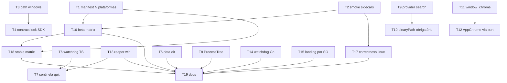

# Build Windows + Linux — Implementation Plan

> **For agentic workers:** Execute via `/build`. Cada Task embrulha um comportamento
> observável em ciclo RED→GREEN e foi verificada adversarialmente contra o repo real
> (55 agentes: 5 fronts → 2 lentes por task → revisão → crítico de completude). Os
> workflows de CI são REESCRITOS por completo preservando o histórico de incidentes nos
> comentários — leia o YAML proposto inteiro antes de editar; nada nele é decorativo.
> O checkout compartilhado é do founder: trabalhe em worktree ([[worktree-para-refactors-grandes]]).

**Goal:** Cada merge na main produz beta para macOS/arm64 + Linux/x64 + Windows/x64 num único
`latest.json` por canal; tag `vX.Y.Z` promove os três ao stable; a landing entrega o instalador
do sistema do visitante; o daemon tem paridade funcional no Windows (workspace `C:\…`, detecção
do `claude`, encerramento de agentes sem vazar processo); um PR que quebra o Linux fica vermelho
antes do merge.

**Architecture:** Nada de cross-compile — um runner por SO compila sidecars nativamente (o
prebuild do libsql é do host) e `tauri build --bundles` por matrix entry; um job `publish`
agrega os três e publica um manifesto multi-plataforma (contrato congelado na T1) + assets com
nomes congelados (spec, decisão 4). As correções de portabilidade seguem as regras da casa:
SO como tabela/estratégia declarada com um lookup (ProcessTree, ProviderSearch, UserConfigDir),
capacidade nova do console como port do DI (`WindowService`) alimentado por comando specta, e
o encerramento no Windows por três pontas (watchdog TS, watchdog Go, sentinela de stdin no quit).

**Tech Stack:** TypeScript, Bun, Go, Rust (Tauri v2), GitHub Actions, Astro, React, Zod, minisign

**Spec:** .specs/2026-08-25-windows-linux-build-design.md
**Tasks:** 19
**Estimated minutes:** 1050

---

## Wave Plan

**Feature Type:** 5 — integração/infra cross-cutting: nenhum aggregate novo, nenhum contrato de
domínio novo; o "contrato" desta feature são o manifesto do updater, o script de smoke e os nomes
de asset (W0), e o resto fan-out por arquivo sem contenção.
**Phases in scope:** 0 (contrato: T1, T2), 1 (fatias paralelas), 2 (CI/integração: T16–T18), QA/docs (T19)
**Critical path:** T1 → T16 → T18 → T19

### W0 — Contract Lock (paralelas entre si; todo o resto consome)

| # | Task | Lane | Classification |
|---|------|------|----------------|
| T1 | latest.json carrega N plataformas | ci | serial (contrato do publish) |
| T2 | Smoke dos sidecars recém-compilados | shell | serial (contrato dos 3 runners) |

### W1 — Fatias paralelas (parallel-after-contract; sem contenção de arquivo entre si)

| # | Task | Lane |
|---|------|------|
| T3 | Caminho absoluto do Windows aceito como workspace | backend |
| T5 | Data dir standalone por SO (paridade de base com o Go) | backend |
| T6 | Watchdog do daemon enxerga supervisor morto no Windows | backend |
| T8 | Árvore de processos do agente encerrada por estratégia por SO | backend |
| T9 | Detecção do CLI claude por tabela por SO (PATHEXT) | backend |
| T11 | Comando `window_chrome` (specta) no shell | shell |
| T13 | Reaper de sidecars órfãos no Windows | shell |
| T14 | Watchdog do gateway Go enxerga supervisor morto no Windows | backend |
| T15 | Landing entrega o instalador do SO do visitante | frontend |

### W2 — Dependentes de W1 (parallel-after-wave-1)

| # | Task | Depende de | Por quê |
|---|------|-----------|---------|
| T4 | Contract Lock — SDK regen do path de workspace | T3 | schema mudou no fio |
| T7 | Quit do shell drena o daemon (sentinela stdin) | T6, T13 | mesmo `src/index.ts` do watchdog; mesmo `lifecycle.rs` do reaper |
| T10 | binaryPath obrigatório do detector ao spawn | T9 | consome o resolvedor |
| T12 | Console reserva a faixa dos semáforos só em overlay | T11 | consome os bindings specta |
| T16 | Beta para os 3 SOs (matrix + publish) | T1, T2 | chama o manifest CLI + o smoke |
| T17 | PR que quebra Linux fica vermelho (correctness) | T2 | roda o smoke |

### W3–W4 — Serial de fechamento

| # | Task | Depende de |
|---|------|-----------|
| T18 | Stable para os 3 SOs (nomes versionados + aliases) | T1, T16 |
| T19 | Docs multi-plataforma (RELEASE.md, README, spec SP1) | T16, T17, T18 |

### Parallelism Matrix

| Lane | Tasks | Dominante |
|------|-------|-----------|
| ci | T1, T16, T17, T18 | serial no fim (W2–W3) |
| backend (daemon TS) | T3, T4, T5, T6, T7, T8, T9, T10 | parallel-after-contract |
| backend (gateway Go) | T14 | parallel-now |
| shell (Rust) | T2, T11, T13 | parallel-now |
| frontend | T12, T15 | parallel-after-contract |
| docs | T19 | serial (última) |

### Dependency Graph



---

## Task T1: latest.json carrega N plataformas

Um único `latest.json` por canal descreve todas as plataformas do release: `buildManifest` recebe uma lista `[{key,url,signature}]` com chaves da união fechada `UpdaterPlatformKey` ('darwin-aarch64' | 'linux-x86_64' | 'windows-x86_64'), recusa lista vazia, chave desconhecida, chave duplicada, URL não-https e assinatura vazia (nomeando a plataforma no erro), e emite `platforms` em ordem canônica. A CLI aceita o trio `--platform <key> --url <u> --sig-file <p>` repetido N vezes (o job `publish` do FRONT A chama uma vez com os três trios). Sem compatibilidade com a forma antiga (`--url/--sig-file` soltos) — FRONT A reescreve as chamadas em release-beta.yml:251-257 e release-stable.yml:229-235.

**Files to write:**
- Test: `scripts/release/make-manifest.test.ts` — reescrito por completo: forma multi-plataforma, ordem canônica, recusas nomeadas, parseCliArgs, CLI end-to-end num tmpdir
- Modify: `scripts/release/make-manifest.ts` — reescrito por completo: UPDATER_PLATFORM_KEYS + UpdaterPlatformKey, ManifestPlatform[], parseCliArgs puro, casca CLI com trios repetidos

**Files to read:**
- `scripts/release/make-manifest.ts`
- `scripts/release/make-manifest.test.ts`
- `packages/app/tauri/config/updater.ts`
- `packages/app/tauri/src-tauri/src/updater.rs`
- `packages/app/tauri/config/generate.test.ts`
- `.github/workflows/release-beta.yml`
- `.github/workflows/release-stable.yml`
- `tsconfig.scripts.json`
- `package.json`

**Agent:** general-purpose
**Reviewer:** spec-compliance-reviewer → code-reviewer
**Model:** sonnet
**Skills:** /test
**Depends on:** (none)
**Consumes (frozen):** UpdaterPlatformKey = 'darwin-aarch64' | 'linux-x86_64' | 'windows-x86_64' (chaves que o tauri-plugin-updater monta de std::env::consts::{OS,ARCH}) · Nomes de asset por canal (contrato com FRONT A): beta/codm-aarch64.app.tar.gz(.sig), beta/codm-linux-x86_64.AppImage(.sig), beta/codm-windows-x86_64-setup.exe(.sig); stable/CODM_vX.Y.Z_aarch64.app.tar.gz(.sig), stable/CODM_vX.Y.Z_linux-x86_64.AppImage(.sig), stable/CODM_vX.Y.Z_windows-x86_64-setup.exe(.sig)
**Scope fence:** DONE: núcleo puro + CLI + teste do script. LEFT (FRONT A): as chamadas nos workflows (`--platform ... --url ... --sig-file ...` x3 no job publish) e o download dos artifacts por runner. OUT: docs/RELEASE.md (front de docs, D16), updater.rs (não muda — só consome endpoints), qualquer chave além das três (windows-arm64/linux-arm64 ficam fora por D2).
**Gate:** bun test ./scripts/release && bun tsc:scripts
**Estimated minutes:** 40

**Riscos:**
- FRONT A precisa trocar as duas chamadas (release-beta.yml:251-257, release-stable.yml:229-235) no mesmo PR — a forma antiga sai com exit 2.
- `.specs/2026-08-06-sp1-release-autoupdate-design.md:98` (AC-4) e docs/RELEASE.md descrevem a forma darwin-only; o front de docs (D16) deve atualizar.

**ACs cobertos:**
- `buildManifest` com três plataformas emite `platforms` com as chaves `darwin-aarch64`, `linux-x86_64`, `windows-x86_64`, nesta ordem, independentemente da ordem de entrada.
- `buildManifest` recusa lista vazia, chave duplicada, URL não-https e assinatura vazia, nomeando a plataforma no erro.
- `parseCliArgs` aceita N trios `--platform/--url/--sig-file` e recusa `--url` antes de `--platform`, trio incompleto e chave fora da lista fechada.
- `bun scripts/release/make-manifest.ts` com dois trios grava um `latest.json` com as duas plataformas e sai 0; sem `--platform` sai 2 sem gravar.

### Step T1.1 — RED — teste completo do manifest multi-plataforma

**Arquivo:** `scripts/release/make-manifest.test.ts`

```typescript
import { describe, expect, it } from 'bun:test'
import { mkdtempSync, readFileSync, rmSync, writeFileSync } from 'node:fs'
import { tmpdir } from 'node:os'
import { join, resolve } from 'node:path'
import { UPDATER_PLATFORM_KEYS, buildManifest, parseCliArgs } from './make-manifest'

const R2 = 'https://pub-ae0c8cac60c94920b35464575c09e67d.r2.dev'

describe('make-manifest (SP1 AC-4 · multi-plataforma, plano 2026-08-25)', () => {
	const darwin = {
		key: 'darwin-aarch64' as const,
		url: `${R2}/beta/codm-aarch64.app.tar.gz`,
		signature: 'dW50cnVzdGVk…assinatura-mac…\n',
	}
	const linux = {
		key: 'linux-x86_64' as const,
		url: `${R2}/beta/codm-linux-x86_64.AppImage`,
		signature: 'dW50cnVzdGVk…assinatura-linux…\n',
	}
	const windows = {
		key: 'windows-x86_64' as const,
		url: `${R2}/beta/codm-windows-x86_64-setup.exe`,
		signature: 'dW50cnVzdGVk…assinatura-win…\n',
	}
	const base = { version: '0.1.0-beta.42', pubDate: '2026-08-25T07:00:00.000Z' }

	it('a lista fechada de chaves é exatamente a que o plugin monta de OS-ARCH', () => {
		// O falsificador: uma chave como `linux-x64` (triple do bun) ou `linux-amd64` (Go) passaria
		// no CI e o app instalado nunca acharia a própria plataforma — preso para sempre.
		expect([...UPDATER_PLATFORM_KEYS]).toEqual(['darwin-aarch64', 'linux-x86_64', 'windows-x86_64'])
	})

	it('emite a forma exata que o plugin consome, uma entrada por plataforma, assinaturas aparadas', () => {
		const m = buildManifest({ ...base, notes: 'beta abc123', platforms: [darwin, linux, windows] })
		expect(m).toEqual({
			version: '0.1.0-beta.42',
			pub_date: '2026-08-25T07:00:00.000Z',
			notes: 'beta abc123',
			platforms: {
				'darwin-aarch64': { url: darwin.url, signature: 'dW50cnVzdGVk…assinatura-mac…' },
				'linux-x86_64': { url: linux.url, signature: 'dW50cnVzdGVk…assinatura-linux…' },
				'windows-x86_64': { url: windows.url, signature: 'dW50cnVzdGVk…assinatura-win…' },
			},
		})
	})

	it('a ordem das plataformas no JSON é a canônica, não a dos argumentos', () => {
		const m = buildManifest({ ...base, platforms: [windows, darwin, linux] })
		expect(Object.keys(m.platforms)).toEqual(['darwin-aarch64', 'linux-x86_64', 'windows-x86_64'])
	})

	it('uma plataforma só continua válida (subconjunto é permitido; o "tudo ou nada" é decisão do workflow)', () => {
		const m = buildManifest({ ...base, platforms: [darwin] })
		expect(Object.keys(m.platforms)).toEqual(['darwin-aarch64'])
		expect(m.notes).toBe('')
	})

	it('aceita semver estável e com pré-release; recusa o resto', () => {
		expect(() => buildManifest({ ...base, version: '1.2.3', platforms: [darwin] })).not.toThrow()
		// O falsificador de AC-4: uma tag mal formada tem de morrer AQUI, no CI, nunca no cliente —
		// um manifest com versão não-semver faria o updater instalado falhar em silêncio para sempre.
		for (const bad of ['v1.2.3', '1.2', 'beta.42', '1.2.3-', '']) {
			expect(() => buildManifest({ ...base, version: bad, platforms: [darwin] })).toThrow('versão inválida')
		}
	})

	it('recusa lista vazia e plataforma duplicada', () => {
		expect(() => buildManifest({ ...base, platforms: [] })).toThrow('sem plataformas')
		expect(() => buildManifest({ ...base, platforms: [darwin, linux, { ...darwin, url: `${R2}/beta/outro.tar.gz` }] })).toThrow(
			"plataforma duplicada no manifest: 'darwin-aarch64'",
		)
	})

	it('recusa URL não-https e assinatura vazia — nomeando a plataforma culpada', () => {
		expect(() => buildManifest({ ...base, platforms: [darwin, { ...linux, url: 'http://inseguro/x.AppImage' }] })).toThrow(
			'https (linux-x86_64)',
		)
		expect(() => buildManifest({ ...base, platforms: [darwin, { ...windows, signature: '  \n' }] })).toThrow(
			'assinatura vazia (windows-x86_64)',
		)
	})
})

describe('make-manifest CLI — trios --platform/--url/--sig-file repetidos', () => {
	const triple = (key: string, asset: string) => ['--platform', key, '--url', `${R2}/beta/${asset}`, '--sig-file', `dist/${asset}.sig`]

	it('parseia N trios na ordem dada + version/out/notes', () => {
		const args = parseCliArgs([
			'--version',
			'0.1.0-beta.7',
			...triple('darwin-aarch64', 'codm-aarch64.app.tar.gz'),
			...triple('linux-x86_64', 'codm-linux-x86_64.AppImage'),
			...triple('windows-x86_64', 'codm-windows-x86_64-setup.exe'),
			'--notes',
			'beta — main@abc',
			'--out',
			'dist/latest.json',
		])
		expect(args).toEqual({
			version: '0.1.0-beta.7',
			out: 'dist/latest.json',
			notes: 'beta — main@abc',
			platforms: [
				{ key: 'darwin-aarch64', url: `${R2}/beta/codm-aarch64.app.tar.gz`, sigFile: 'dist/codm-aarch64.app.tar.gz.sig' },
				{ key: 'linux-x86_64', url: `${R2}/beta/codm-linux-x86_64.AppImage`, sigFile: 'dist/codm-linux-x86_64.AppImage.sig' },
				{ key: 'windows-x86_64', url: `${R2}/beta/codm-windows-x86_64-setup.exe`, sigFile: 'dist/codm-windows-x86_64-setup.exe.sig' },
			],
		})
	})

	it('recusa --url/--sig-file antes de qualquer --platform, trio incompleto, chave desconhecida, flag sem valor', () => {
		const head = ['--version', '1.0.0', '--out', 'x.json']
		expect(() => parseCliArgs([...head, '--url', `${R2}/a`, '--platform', 'darwin-aarch64', '--sig-file', 'a.sig'])).toThrow(
			'--url antes de qualquer --platform',
		)
		expect(() => parseCliArgs([...head, '--platform', 'darwin-aarch64', '--url', `${R2}/a`])).toThrow(
			'--platform darwin-aarch64 sem --url ou --sig-file',
		)
		expect(() => parseCliArgs([...head, ...triple('linux-x64', 'a')])).toThrow("plataforma desconhecida: 'linux-x64'")
		expect(() => parseCliArgs([...head, ...triple('windows-aarch64', 'a')])).toThrow('plataforma desconhecida')
		expect(() => parseCliArgs([...head, '--platform'])).toThrow('flag sem valor: --platform')
		expect(() => parseCliArgs([...head, '--bogus', '1'])).toThrow('flag desconhecida: --bogus')
	})

	it('recusa --version/--out ausentes e nenhum --platform', () => {
		expect(() => parseCliArgs(['--out', 'x.json', ...triple('darwin-aarch64', 'a')])).toThrow('uso:')
		expect(() => parseCliArgs(['--version', '1.0.0', ...triple('darwin-aarch64', 'a')])).toThrow('uso:')
		expect(() => parseCliArgs(['--version', '1.0.0', '--out', 'x.json'])).toThrow('nenhum --platform')
	})

	it('end-to-end: a casca lê cada .sig do disco e grava o latest.json com todas as plataformas', () => {
		const dir = mkdtempSync(join(tmpdir(), 'codm-make-manifest-'))
		try {
			writeFileSync(join(dir, 'mac.sig'), 'sig-mac\n')
			writeFileSync(join(dir, 'win.sig'), 'sig-win\n')
			const out = join(dir, 'out', 'latest.json')
			const proc = Bun.spawnSync(
				[
					'bun',
					resolve(import.meta.dirname, 'make-manifest.ts'),
					'--version',
					'1.2.3',
					'--platform',
					'windows-x86_64',
					'--url',
					`${R2}/stable/CODM_v1.2.3_windows-x86_64-setup.exe`,
					'--sig-file',
					join(dir, 'win.sig'),
					'--platform',
					'darwin-aarch64',
					'--url',
					`${R2}/stable/CODM_v1.2.3_aarch64.app.tar.gz`,
					'--sig-file',
					join(dir, 'mac.sig'),
					'--notes',
					'stable v1.2.3',
					'--out',
					out,
				],
				{ stdout: 'pipe', stderr: 'pipe' },
			)
			expect(proc.exitCode).toBe(0)
			const written = JSON.parse(readFileSync(out, 'utf8'))
			expect(written.version).toBe('1.2.3')
			expect(written.notes).toBe('stable v1.2.3')
			expect(Object.keys(written.platforms)).toEqual(['darwin-aarch64', 'windows-x86_64'])
			expect(written.platforms['windows-x86_64']).toEqual({ url: `${R2}/stable/CODM_v1.2.3_windows-x86_64-setup.exe`, signature: 'sig-win' })
			expect(written.platforms['darwin-aarch64'].signature).toBe('sig-mac')
		} finally {
			rmSync(dir, { recursive: true, force: true })
		}
	})

	it('end-to-end: argumentos inválidos saem com código 2 e a mensagem de uso, sem gravar nada', () => {
		const dir = mkdtempSync(join(tmpdir(), 'codm-make-manifest-'))
		try {
			const proc = Bun.spawnSync(['bun', resolve(import.meta.dirname, 'make-manifest.ts'), '--version', '1.0.0', '--out', join(dir, 'latest.json')], {
				stdout: 'pipe',
				stderr: 'pipe',
			})
			expect(proc.exitCode).toBe(2)
			expect(proc.stderr.toString()).toContain('nenhum --platform')
			expect(() => readFileSync(join(dir, 'latest.json'))).toThrow()
		} finally {
			rmSync(dir, { recursive: true, force: true })
		}
	})
})
```

Expected: RED: `UPDATER_PLATFORM_KEYS`/`parseCliArgs` não exportados; `buildManifest` rejeita `platforms` no tipo.

### Step T1.2 — GREEN — make-manifest.ts multi-plataforma (arquivo completo)

**Arquivo:** `scripts/release/make-manifest.ts`

```typescript
#!/usr/bin/env bun
/**
 * Emite o `latest.json` que o tauri-plugin-updater consome (SP1 AC-4; multi-plataforma desde o
 * plano 2026-08-25-windows-linux-build, decisão D4).
 *
 * O manifest é a ÚNICA fonte que o app instalado lê para decidir "há atualização?": `version` é
 * comparada por semver com a instalada, e `platforms.<os>-<arch>` aponta o artefato assinado DA
 * PLATAFORMA QUE ESTÁ RODANDO (.app.tar.gz / .AppImage / -setup.exe) + a assinatura minisign que o
 * cliente verifica contra a pubkey embarcada. Um manifest por canal carrega TODAS as plataformas
 * do release: o job `publish` do workflow recebe os artefatos dos três runners e chama este script
 * UMA vez, com um trio `--platform/--url/--sig-file` por plataforma. A URL é FIXA por canal no beta
 * (asset de nome estável — `config/updater.ts` explica por quê) e versionada no stable; a versão
 * vive aqui, não no nome do arquivo.
 *
 * As chaves são as que o plugin monta a partir de `std::env::consts::{OS,ARCH}` do Rust
 * (`darwin-aarch64`, `linux-x86_64`, `windows-x86_64`) — NÃO são os triples do bun/Go
 * (`build-sidecars.ts` HOST_TRIPLES: `linux-x64`), nem as pastas do bundle do Tauri. Uma chave
 * errada não quebra o CI: o app instalado só nunca encontra a própria plataforma e fica preso para
 * sempre — por isso `UPDATER_PLATFORM_KEYS` é uma lista FECHADA e `buildManifest`/`parseCliArgs`
 * recusam o que não está nela.
 *
 * Puro no núcleo (`buildManifest`, `parseCliArgs`) e fino na casca (CLI) — o teste cobre o núcleo
 * sem tocar disco além de um sig scratch.
 */
import { mkdirSync, readFileSync, writeFileSync } from 'node:fs'
import { dirname } from 'node:path'

/** Lista FECHADA — só entra aqui uma plataforma que o pipeline de release realmente builda e assina
 *  (D2: windows-arm64 e linux-arm64 ficam de fora — sem prebuild libsql / sem runner). */
export const UPDATER_PLATFORM_KEYS = ['darwin-aarch64', 'linux-x86_64', 'windows-x86_64'] as const
export type UpdaterPlatformKey = (typeof UPDATER_PLATFORM_KEYS)[number]

export function isUpdaterPlatformKey(value: string): value is UpdaterPlatformKey {
	return (UPDATER_PLATFORM_KEYS as readonly string[]).includes(value)
}

export interface ManifestPlatform {
	key: UpdaterPlatformKey
	url: string
	signature: string
}

export interface ManifestInput {
	version: string
	platforms: ManifestPlatform[]
	notes?: string
	/** Injetável para teste determinístico; default = agora. */
	pubDate?: string
}

export interface UpdaterManifest {
	version: string
	pub_date: string
	notes: string
	platforms: Partial<Record<UpdaterPlatformKey, { url: string; signature: string }>>
}

/** Semver com pré-release opcional — cobre `1.2.3` e `1.2.3-beta.42`. */
const SEMVER = /^\d+\.\d+\.\d+(-[0-9A-Za-z][0-9A-Za-z.-]*)?$/

const KNOWN = UPDATER_PLATFORM_KEYS.join(', ')

export function buildManifest(input: ManifestInput): UpdaterManifest {
	if (!SEMVER.test(input.version)) {
		throw new Error(`versão inválida para o manifest: '${input.version}' (esperado semver, ex. 0.1.0 ou 0.1.0-beta.42)`)
	}
	if (input.platforms.length === 0) {
		throw new Error('manifest sem plataformas — o publish precisa de pelo menos um trio --platform/--url/--sig-file')
	}
	const seen: UpdaterManifest['platforms'] = {}
	for (const p of input.platforms) {
		if (!isUpdaterPlatformKey(p.key)) {
			throw new Error(`plataforma desconhecida: '${String(p.key)}' (esperado uma de: ${KNOWN})`)
		}
		if (seen[p.key]) {
			throw new Error(`plataforma duplicada no manifest: '${p.key}'`)
		}
		if (!p.url.startsWith('https://')) {
			throw new Error(`URL do artefato deve ser https (${p.key}): '${p.url}'`)
		}
		if (p.signature.trim().length === 0) {
			throw new Error(
				`assinatura vazia (${p.key}) — o build não emitiu o .sig? (createUpdaterArtifacts + TAURI_SIGNING_PRIVATE_KEY)`,
			)
		}
		seen[p.key] = { url: p.url, signature: p.signature.trim() }
	}
	// Ordem canônica (a da lista fechada), independente da ordem dos argumentos — o JSON é
	// determinístico e o diff entre dois releases mostra só o que mudou de fato.
	const platforms: UpdaterManifest['platforms'] = {}
	for (const key of UPDATER_PLATFORM_KEYS) {
		const entry = seen[key]
		if (entry) platforms[key] = entry
	}
	return {
		version: input.version,
		pub_date: input.pubDate ?? new Date().toISOString(),
		notes: input.notes ?? '',
		platforms,
	}
}

export interface CliPlatform {
	key: UpdaterPlatformKey
	url: string
	sigFile: string
}

export interface CliArgs {
	version: string
	out: string
	notes?: string
	platforms: CliPlatform[]
}

const USAGE =
	'uso: make-manifest.ts --version <semver> --out <latest.json> [--notes <texto>] (--platform <darwin-aarch64|linux-x86_64|windows-x86_64> --url <https://…> --sig-file <path.sig>)+'

/**
 * Puro sobre argv (sem process.argv, sem process.exit) — testável. `--platform` ABRE um grupo;
 * `--url`/`--sig-file` pertencem ao grupo aberto mais recente. Toda flag consome exatamente um
 * valor, e um valor que começa com `--` é uma flag sem valor, não um valor.
 */
export function parseCliArgs(argv: string[]): CliArgs {
	let version: string | undefined
	let out: string | undefined
	let notes: string | undefined
	const groups: { key: UpdaterPlatformKey; url?: string; sigFile?: string }[] = []
	const current = (flag: string) => {
		const last = groups[groups.length - 1]
		if (!last) throw new Error(`${flag} antes de qualquer --platform\n${USAGE}`)
		return last
	}
	for (let i = 0; i < argv.length; i += 2) {
		const flag = argv[i]
		const value = argv[i + 1]
		if (value === undefined || value.startsWith('--')) throw new Error(`flag sem valor: ${flag}\n${USAGE}`)
		switch (flag) {
			case '--version':
				version = value
				break
			case '--out':
				out = value
				break
			case '--notes':
				notes = value
				break
			case '--platform':
				if (!isUpdaterPlatformKey(value)) throw new Error(`plataforma desconhecida: '${value}' (esperado uma de: ${KNOWN})`)
				groups.push({ key: value })
				break
			case '--url':
				current(flag).url = value
				break
			case '--sig-file':
				current(flag).sigFile = value
				break
			default:
				throw new Error(`flag desconhecida: ${flag}\n${USAGE}`)
		}
	}
	if (!version || !out) throw new Error(USAGE)
	if (groups.length === 0) throw new Error(`nenhum --platform informado\n${USAGE}`)
	const platforms = groups.map((g): CliPlatform => {
		if (!g.url || !g.sigFile) throw new Error(`--platform ${g.key} sem --url ou --sig-file\n${USAGE}`)
		return { key: g.key, url: g.url, sigFile: g.sigFile }
	})
	return { version, out, notes, platforms }
}

function parseOrExit(argv: string[]): CliArgs {
	try {
		return parseCliArgs(argv)
	} catch (e) {
		console.error(e instanceof Error ? e.message : String(e))
		process.exit(2)
	}
}

if (import.meta.main) {
	const args = parseOrExit(process.argv.slice(2))
	const manifest = buildManifest({
		version: args.version,
		notes: args.notes,
		platforms: args.platforms.map(p => ({ key: p.key, url: p.url, signature: readFileSync(p.sigFile, 'utf8') })),
	})
	mkdirSync(dirname(args.out), { recursive: true })
	writeFileSync(args.out, `${JSON.stringify(manifest, null, '\t')}\n`)
	console.log(`✓ ${args.out} (${manifest.version}: ${Object.keys(manifest.platforms).join(', ')})`)
}
```

### Step T1.3 — Gate

Run: `bun test ./scripts/release && bun tsc:scripts`

Expected: 12 pass, 0 fail; tsc sem erros

### Step T1.4 — Nota para o FRONT A (chamada nos workflows)

Forma nova da chamada no job `publish` (uma vez por canal). Beta:
  bun scripts/release/make-manifest.ts --version "$VERSION" --notes "beta — main@$SHA" --out dist-release/latest.json \
    --platform darwin-aarch64 --url https://pub-ae0c8cac60c94920b35464575c09e67d.r2.dev/beta/codm-aarch64.app.tar.gz --sig-file dist-release/codm-aarch64.app.tar.gz.sig \
    --platform linux-x86_64  --url https://pub-ae0c8cac60c94920b35464575c09e67d.r2.dev/beta/codm-linux-x86_64.AppImage     --sig-file dist-release/codm-linux-x86_64.AppImage.sig \
    --platform windows-x86_64 --url https://pub-ae0c8cac60c94920b35464575c09e67d.r2.dev/beta/codm-windows-x86_64-setup.exe   --sig-file dist-release/codm-windows-x86_64-setup.exe.sig
Stable: mesmas flags com URLs versionadas `stable/CODM_${GITHUB_REF_NAME}_aarch64.app.tar.gz`, `stable/CODM_${GITHUB_REF_NAME}_linux-x86_64.AppImage`, `stable/CODM_${GITHUB_REF_NAME}_windows-x86_64-setup.exe`. `--url`/`--sig-file` soltos (forma antiga) agora falham com exit 2 — sem compat.

---

## Task T2: O sidecar recém-compilado sobe e responde health no runner

Um único script bun cross-platform (`scripts/release/smoke-sidecars.ts`) sobe `codm-daemon` e `codm-gateway` a partir de `packages/app/tauri/src-tauri/binaries/` com o MESMO env que o shell injeta (espelho de `sidecars()` em `src-tauri/src/sidecars/mod.rs`, gate cross-lang no teste); o daemon nasce com o MESMO cwd do shell (`binaries/daemon-runtime`); o gateway nasce num cwd SEM `.env` — desvio DELIBERADO do inherit do shell (mod.rs:129-134 spawna com `cwd: None`), porque `godotenv.Overload(".env")` em config.go leria o `.env` de dev por cima do env injetado. O script espera `GET /v1/health` e `GET /api/health` responderem 200 dentro do orçamento do supervisor (60s, cadência 500ms), derruba os processos (aguardando a morte real antes de limpar o data dir) e sai 0; qualquer morte precoce ou timeout sai 1 com o tail do stderr. Portas do smoke (3130/3132) e data dir temporário nunca colidem com o daemon de produção do founder no runner macOS. Núcleo puro (`planSmoke`, `healthPathOf`) testado sem rede; um gate espelha as chaves de env do Rust (parse de mod.rs, tolerante ao reflow do rustfmt) para o smoke nunca divergir do shell.

**Files to write:**
- Create: `scripts/release/smoke-sidecars.ts` — núcleo puro + casca CLI; lido por todos os matrix entries e pelo correctness Linux
- Test: `scripts/release/smoke-sidecars.test.ts` — planSmoke/healthPathOf + gate cross-lang das chaves de env (mod.rs)

**Files to read:**
- `scripts/release/make-manifest.ts`
- `scripts/release/make-manifest.test.ts`
- `packages/app/tauri/config/build-sidecars.ts`
- `packages/app/tauri/config/sidecars.ts`
- `packages/app/tauri/src-tauri/src/sidecars/mod.rs`
- `packages/app/tauri/src-tauri/src/api/mod.rs`
- `packages/api/go/core/config/config.go`
- `packages/api/typescript/core/src/utils/Watchdog.ts`
- `tsconfig.scripts.json`

**Agent:** backend-developer
**Reviewer:** spec-compliance-reviewer → code-reviewer
**Model:** sonnet
**Skills:** /desktop-shell
**Depends on:** (none)
**Consumes (frozen):** Env de boot dos sidecars em src-tauri/src/sidecars/mod.rs (daemon: API_PORT, CODM_DATA_DIR, CODM_MIGRATIONS_DIR, API_GO_URL, NODE_ENV, CODM_PARENT_PID, CODM_APP_VERSION; gateway: CHANNEL_PORT, CODM_DATA_DIR, CHANNEL_ALLOWED_ORIGINS, CODM_PARENT_PID) · Health paths no contrato: TS `/v1/health` (openapi.json), Go `/health` sob base `/api` (api/mod.rs)
**Scope fence:** DONE: script + teste. LEFT: nada. OUT: mudar build-sidecars.ts, mod.rs, portas de produção, qualquer workflow (tasks A-release-*).
**Gate:** bun test scripts/release && bun tsc:scripts && bun emit-openapi && bun desktop:sidecars && bun scripts/release/smoke-sidecars.ts
**Estimated minutes:** 60

**Riscos:**
- `proc.stderr` como ReadableStream async-iterável depende dos bun-types atuais (tsconfig.base já usa types: ['bun','node']); se um bun antigo no runner não iterar, o fallback é `new Response(proc.stderr).text()` lido após o stop (perde o tail em tempo real, não a mensagem) — NUNCA um cast `as AsyncIterable` (Non-Negotiable 1).
- No Windows, `proc.kill()` termina o daemon sem drain (não existe SIGTERM) — o stop aguarda `proc.exited` antes do rmSync do data dir temporário, então nada vaza nem trava em lock de SQLite; é o mesmo comportamento do shell lá hoje (lifecycle.rs cfg(not(unix))).
- O health do daemon em `real` depende de `databaseHealthCheck` (gate) + `channelStatusHealthCheck` (diagnóstico, não bloqueia) — se um novo HEALTH_CHECK com gate=true depender do gateway, o smoke continua válido porque os dois sobem juntos.
- O extrator do gate cross-lang tolera o reflow do rustfmt (`\(\s*"`), e o teste ancora CHANNEL_ALLOWED_ORIGINS explicitamente — se mod.rs mudar o formato das tuplas além de whitespace, o guard `toBeGreaterThan(0)` + o `toContain` acusam o rot do regex em vez de passar vazio.

**ACs cobertos:**
- Rodando `bun scripts/release/smoke-sidecars.ts` após `bun desktop:sidecars`, os dois sidecars respondem 200 e o processo sai 0 em macOS, Linux e Windows.
- Com o closure `daemon-runtime/node_modules/@libsql` removido, o smoke sai 1 e imprime o stderr do daemon.
- `bun test scripts/release` passa e o teste reprova se uma chave de env de `sidecars()` em mod.rs for adicionada/removida sem espelho no script — inclusive chaves em tuplas multi-linha do rustfmt (CHANNEL_ALLOWED_ORIGINS).
- Com `daemon-runtime` ou `migrations` ausentes de binaries/, o smoke falha no planejamento com mensagem que manda rodar `bun desktop:sidecars`, não com ENOENT críptico nem timeout.
- O smoke nunca usa as portas 3030/3032 nem um data dir fora de um diretório temporário.

### Step T2.1 — RED — teste do núcleo puro + gate de espelho do env do shell

**Arquivo:** `scripts/release/smoke-sidecars.test.ts`

```typescript
import { describe, expect, it } from 'bun:test'
import { readFileSync } from 'node:fs'
import { resolve } from 'node:path'
import { healthPathOf, planSmoke, SMOKE_PORTS, type SmokeInputs } from './smoke-sidecars'

const ROOT = resolve(import.meta.dirname, '..', '..')

const base: SmokeInputs = {
	brand: 'codm',
	platform: 'darwin',
	binariesDir: '/repo/packages/app/tauri/src-tauri/binaries',
	entries: ['codm-daemon-aarch64-apple-darwin', 'codm-gateway-aarch64-apple-darwin', 'daemon-runtime', 'migrations'],
	dataDir: '/tmp/codm-smoke-abc',
	parentPid: 4242,
	appVersion: '0.5.0-beta.7',
	ports: SMOKE_PORTS,
	healthPaths: { daemon: '/v1/health', gateway: '/health' },
}

/**
 * As chaves de env que o SHELL passa a cada sidecar, extraídas do Rust — `sidecars()` em
 * src-tauri/src/sidecars/mod.rs escreve cada par como `("CHAVE".into(), …)`. O `\s*` entre o
 * parêntese e a aspa é OBRIGATÓRIO: o rustfmt quebra tuplas longas em várias linhas (hoje,
 * CHANNEL_ALLOWED_ORIGINS em mod.rs:138-141 — `(` numa linha, `"CHAVE".into(),` na seguinte);
 * um regex colado perderia essas chaves em silêncio. Mesmo desenho do DSK-07 (updater.rs
 * espelha updater.ts): o smoke não pode divergir do supervisor em silêncio.
 */
function shellBootEnvKeys(role: 'daemon' | 'gateway'): string[] {
	const source = readFileSync(resolve(ROOT, 'packages/app/tauri/src-tauri/src/sidecars/mod.rs'), 'utf8')
	const block = source.split(`name: "codm-${role}"`)[1]?.split('Sidecar {')[0] ?? ''
	return [...block.matchAll(/\(\s*"([A-Z_]+)"\.into\(\)/g)].map(m => m[1] as string)
}

describe('smoke-sidecars (planSmoke — o espelho do supervisor)', () => {
	it('escolhe o binário pelo prefixo <brand>-<role>- e ignora as pastas staged', () => {
		const plans = planSmoke(base)
		expect(plans.map(p => p.role)).toEqual(['daemon', 'gateway'])
		expect(plans[0]?.binary).toBe('/repo/packages/app/tauri/src-tauri/binaries/codm-daemon-aarch64-apple-darwin')
		expect(plans[1]?.binary).toBe('/repo/packages/app/tauri/src-tauri/binaries/codm-gateway-aarch64-apple-darwin')
	})

	it('no Windows exige o sufixo .exe (é o nome que o Tauri resolve como externalBin)', () => {
		const plans = planSmoke({
			...base,
			platform: 'win32',
			entries: [
				'codm-daemon-x86_64-pc-windows-msvc.exe',
				'codm-gateway-x86_64-pc-windows-msvc.exe',
				'daemon-runtime',
				'migrations',
			],
		})
		expect(plans.every(p => p.binary.endsWith('.exe'))).toBe(true)
		// Sem .exe no win32 = build que não vai virar bundle; o smoke tem de falhar aqui, legível.
		expect(() => planSmoke({ ...base, platform: 'win32' })).toThrow('codm-daemon')
	})

	it('falha alto quando um binário falta ou há dois para o mesmo papel', () => {
		expect(() =>
			planSmoke({ ...base, entries: ['codm-daemon-aarch64-apple-darwin', 'daemon-runtime', 'migrations'] }),
		).toThrow('codm-gateway')
		expect(() =>
			planSmoke({ ...base, entries: [...base.entries, 'codm-daemon-x86_64-apple-darwin'] }),
		).toThrow('codm-daemon')
	})

	it('falha alto quando o staging não tem daemon-runtime ou migrations', () => {
		// Sem isso o erro seria um spawn ENOENT críptico ou um timeout de 60s — aqui é legível.
		expect(() => planSmoke({ ...base, entries: base.entries.filter(e => e !== 'daemon-runtime') })).toThrow(
			'daemon-runtime',
		)
		expect(() => planSmoke({ ...base, entries: base.entries.filter(e => e !== 'migrations') })).toThrow('migrations')
	})

	it('o daemon nasce DENTRO de daemon-runtime e o gateway num cwd sem .env', () => {
		const [daemon, gateway] = planSmoke(base)
		expect(daemon?.cwd).toBe('/repo/packages/app/tauri/src-tauri/binaries/daemon-runtime')
		// Desvio DELIBERADO do shell (que spawna o gateway com cwd herdado — mod.rs cwd: None):
		// godotenv.Overload(".env") no config.go do gateway lê o .env do CWD por cima do env recebido —
		// rodando na raiz do repo ele trocaria CODM_DATA_DIR/CHANNEL_PORT pelos de produção do founder.
		expect(gateway?.cwd).toBe('/tmp/codm-smoke-abc')
	})

	it('espelha EXATAMENTE as chaves de env que o Rust passa a cada sidecar (gate cross-lang)', () => {
		const [daemon, gateway] = planSmoke(base)
		expect(Object.keys(daemon?.env ?? {}).sort()).toEqual(shellBootEnvKeys('daemon').sort())
		expect(Object.keys(gateway?.env ?? {}).sort()).toEqual(shellBootEnvKeys('gateway').sort())
		expect(shellBootEnvKeys('daemon').length).toBeGreaterThan(0)
		// Guard contra rot do próprio extrator: a tupla multi-linha do rustfmt TEM de aparecer.
		expect(shellBootEnvKeys('gateway')).toContain('CHANNEL_ALLOWED_ORIGINS')
	})

	it('valores: portas do smoke, data dir temporário, migrations staged, pid do supervisor', () => {
		const [daemon, gateway] = planSmoke(base)
		expect(daemon?.env).toMatchObject({
			API_PORT: '3130',
			CODM_DATA_DIR: '/tmp/codm-smoke-abc',
			CODM_MIGRATIONS_DIR: '/repo/packages/app/tauri/src-tauri/binaries/migrations',
			API_GO_URL: 'http://localhost:3132',
			NODE_ENV: 'production',
			CODM_PARENT_PID: '4242',
			CODM_APP_VERSION: '0.5.0-beta.7',
		})
		expect(gateway?.env).toMatchObject({
			CHANNEL_PORT: '3132',
			CODM_DATA_DIR: '/tmp/codm-smoke-abc',
			CHANNEL_ALLOWED_ORIGINS: 'tauri://localhost,http://localhost:5173',
			CODM_PARENT_PID: '4242',
		})
	})

	it('URLs de health: daemon direto na porta, gateway sob a fronteira /api (api/mod.rs)', () => {
		const [daemon, gateway] = planSmoke(base)
		expect(daemon?.healthUrl).toBe('http://127.0.0.1:3130/v1/health')
		expect(gateway?.healthUrl).toBe('http://127.0.0.1:3132/api/health')
	})
})

describe('smoke-sidecars (healthPathOf — o caminho vem do CONTRATO, não de literal)', () => {
	it('acha o path cujo último segmento é health', () => {
		expect(healthPathOf({ paths: { '/v1/session': {}, '/v1/health': {} } })).toBe('/v1/health')
		expect(healthPathOf({ paths: { '/health': {}, '/healthz-not': {} } })).toBe('/health')
	})
	it('recusa um spec sem health — o supervisor não teria o que chamar', () => {
		expect(() => healthPathOf({ paths: { '/v1/session': {} } })).toThrow('health')
	})
	it('recusa ambiguidade — dois paths de health é decisão humana, não first-match silencioso', () => {
		expect(() => healthPathOf({ paths: { '/health': {}, '/v1/health': {} } })).toThrow('esperava exatamente 1')
	})
})
```

Expected: 8+3 testes falham com 'Cannot find module ./smoke-sidecars'

### Step T2.2 — GREEN — o script (núcleo puro + casca CLI)

**Arquivo:** `scripts/release/smoke-sidecars.ts`

```typescript
#!/usr/bin/env bun
/**
 * Smoke dos sidecars recém-compilados — o gate que um build sozinho nunca dá. `build-sidecars.ts`
 * avisa em texto: o binário do daemon COMPILA limpo e morre no primeiro connect quando o prebuild
 * nativo do libsql não está ao lado dele. Este script sobe cada binário de `src-tauri/binaries/`
 * com o env que o shell injeta (espelho de `sidecars()` em src-tauri/src/sidecars/mod.rs, gate
 * cross-lang em ./smoke-sidecars.test.ts); o daemon com o MESMO cwd do shell (daemon-runtime), o
 * gateway num cwd SEM `.env` — desvio deliberado, ver BOOT.gateway. Espera o health responder 200
 * no mesmo orçamento do supervisor (60s, cadência 500ms) e derruba tudo.
 *
 * Puro no núcleo (`planSmoke`, `healthPathOf`) e fino na casca (CLI) — mesmo desenho do
 * make-manifest.ts. Roda em macOS, Linux e Windows: é o passo `smoke` de todo entry da matriz de
 * release e do job Linux do correctness.
 */
import { mkdtempSync, readdirSync, readFileSync, rmSync } from 'node:fs'
import { tmpdir } from 'node:os'
import { join, resolve } from 'node:path'
import { REPO } from '../../template.config'
import { SIDECARS } from '../../packages/app/tauri/config/sidecars'

/** Mesmo orçamento e cadência do bootstrap do supervisor (mod.rs: 60s, 500ms). */
export const HEALTH_BUDGET_MS = 60_000
export const HEALTH_CADENCE_MS = 500

/**
 * Portas do smoke — NUNCA as de produção (3030/3032). O runner macOS é a máquina de trabalho do
 * founder, e o daemon real dela escuta nas portas de produção; um smoke nelas falharia por
 * EADDRINUSE ou, pior, mediria o daemon errado.
 */
export const SMOKE_PORTS = { daemon: 3130, gateway: 3132 } as const

type Role = (typeof SIDECARS)[number]['role']

export interface SmokeInputs {
	brand: string
	platform: NodeJS.Platform
	binariesDir: string
	/** `readdirSync(binariesDir)` — injetado para o núcleo não tocar disco. */
	entries: readonly string[]
	dataDir: string
	parentPid: number
	appVersion: string
	ports: { daemon: number; gateway: number }
	/** Path de health por papel, lido do openapi.json de cada backend (ver `healthPathOf`). */
	healthPaths: Record<Role, string>
}

export interface SidecarPlan {
	role: Role
	name: string
	binary: string
	cwd: string
	env: Record<string, string>
	healthUrl: string
}

/** Um spec OpenAPI só precisa de `paths` aqui. Exige EXATAMENTE 1 path de health — dois seria
 * ambiguidade que merece decisão humana, não um first-match silencioso. */
export function healthPathOf(spec: { paths: Record<string, unknown> }): string {
	const matches = Object.keys(spec.paths).filter(p => p.split('/').at(-1) === 'health')
	if (matches.length !== 1) {
		throw new Error(
			`esperava exatamente 1 path de health no openapi.json, achei ${matches.length} (${matches.join(', ') || 'nenhum'})`,
		)
	}
	return matches[0] as string
}

/**
 * O boot de cada papel, ESPELHO de `sidecars()` em src-tauri/src/sidecars/mod.rs — env e a base do
 * health; cwd do daemon idêntico ao do shell. O gateway é o ÚNICO desvio deliberado: o shell o
 * spawna com `cwd: None` (herda o cwd do shell), mas `config.go` faz `godotenv.Overload(".env")`
 * relativo ao cwd, POR CIMA do env recebido — na raiz do repo isso trocaria
 * CODM_DATA_DIR/CHANNEL_PORT pelos valores de produção; por isso o smoke o põe no dataDir
 * temporário, que garantidamente não tem `.env`. A fronteira `/api` do gateway é decisão do shell
 * (api/mod.rs: pertence à BASE URL, não ao contrato), então mora aqui também.
 */
const BOOT: Record<Role, (i: SmokeInputs) => { cwd: string; env: Record<string, string>; healthBase: string }> = {
	daemon: i => ({
		cwd: join(i.binariesDir, 'daemon-runtime'),
		env: {
			API_PORT: String(i.ports.daemon),
			CODM_DATA_DIR: i.dataDir,
			CODM_MIGRATIONS_DIR: join(i.binariesDir, 'migrations'),
			// O rail espelha CHAVES, não valores: o shell hardcoda http://localhost:3032 (mod.rs:123);
			// aqui a URL aponta o gateway DO SMOKE (3132) — senão o daemon mediria o gateway errado.
			API_GO_URL: `http://localhost:${i.ports.gateway}`,
			NODE_ENV: 'production',
			CODM_PARENT_PID: String(i.parentPid),
			CODM_APP_VERSION: i.appVersion,
		},
		healthBase: `http://127.0.0.1:${i.ports.daemon}`,
	}),
	gateway: i => ({
		cwd: i.dataDir,
		env: {
			CHANNEL_PORT: String(i.ports.gateway),
			CODM_DATA_DIR: i.dataDir,
			CHANNEL_ALLOWED_ORIGINS: 'tauri://localhost,http://localhost:5173',
			CODM_PARENT_PID: String(i.parentPid),
		},
		healthBase: `http://127.0.0.1:${i.ports.gateway}/api`,
	}),
}

export function planSmoke(i: SmokeInputs): SidecarPlan[] {
	// Staging incompleto falha AQUI, legível — não como spawn ENOENT críptico nem timeout de 60s.
	for (const dir of ['daemon-runtime', 'migrations'] as const) {
		if (!i.entries.includes(dir)) throw new Error(`${dir} ausente em ${i.binariesDir} — rode bun desktop:sidecars`)
	}
	const exe = i.platform === 'win32' ? '.exe' : ''
	return SIDECARS.map(sidecar => {
		const name = `${i.brand}-${sidecar.role}`
		const candidates = i.entries.filter(e => e.startsWith(`${name}-`) && e.endsWith(exe))
		if (candidates.length !== 1) {
			throw new Error(
				`esperava exatamente 1 binário ${name}-<triple>${exe} em ${i.binariesDir}, achei ${candidates.length} (${candidates.join(', ') || 'nenhum'}) — rode bun desktop:sidecars`,
			)
		}
		const boot = BOOT[sidecar.role](i)
		return {
			role: sidecar.role,
			name,
			binary: join(i.binariesDir, candidates[0] as string),
			cwd: boot.cwd,
			env: boot.env,
			healthUrl: `${boot.healthBase}${i.healthPaths[sidecar.role]}`,
		}
	})
}

/**
 * O que os filhos herdam do processo do smoke — uma allowlist, não `...process.env`. O bun carrega
 * o `.env` da raiz no próprio process.env ao rodar da raiz do repo, e repassá-lo inteiro levaria
 * CODM_DATA_DIR/PORT/REDIS_URL de dev para dentro dos sidecars: o smoke deixaria de medir o boot
 * que o shell faz. O que entra é só o que o SO precisa para executar um binário.
 */
const INHERITED_ENV = [
	'PATH',
	'HOME',
	'TMPDIR',
	'LANG',
	'LC_ALL',
	// Windows: sem SystemRoot o runtime nem resolve DLLs; os *APPDATA são o os.UserConfigDir do Go.
	'SystemRoot',
	'SYSTEMROOT',
	'windir',
	'TEMP',
	'TMP',
	'USERPROFILE',
	'APPDATA',
	'LOCALAPPDATA',
	'ProgramData',
	'COMSPEC',
	'PATHEXT',
] as const

function inheritedEnv(): Record<string, string> {
	const out: Record<string, string> = {}
	for (const key of INHERITED_ENV) {
		const v = process.env[key]
		if (v !== undefined) out[key] = v
	}
	return out
}

const sleep = (ms: number): Promise<void> => new Promise(r => setTimeout(r, ms))

/**
 * Spawn num helper próprio para o tsc INFERIR `stderr: 'pipe'` no tipo do Subprocess: `proc.stderr`
 * sai `ReadableStream<Uint8Array>` (async-iterável no bun) e o `for await` dispensa qualquer cast —
 * tipar por `ReturnType<typeof Bun.spawn>` (genérico nos defaults) mascararia isso com um `as`.
 */
function spawnSidecar(plan: SidecarPlan) {
	return Bun.spawn([plan.binary], {
		cwd: plan.cwd,
		env: { ...inheritedEnv(), ...plan.env },
		stdout: 'ignore',
		stderr: 'pipe',
	})
}
type Spawned = ReturnType<typeof spawnSidecar>

interface Running {
	plan: SidecarPlan
	proc: Spawned
	stderr: string[]
}

function launch(plan: SidecarPlan): Running {
	console.log(`[smoke] ${plan.name}: ${plan.binary} (cwd ${plan.cwd})`)
	const proc = spawnSidecar(plan)
	const stderr: string[] = []
	// Tail do stderr — é a única coisa que explica um daemon que morreu antes de abrir a porta.
	void (async () => {
		for await (const chunk of proc.stderr) {
			for (const line of new TextDecoder().decode(chunk).split('\n')) {
				if (line.trim().length === 0) continue
				stderr.push(line)
				if (stderr.length > 40) stderr.shift()
			}
		}
	})()
	return { plan, proc, stderr }
}

/** 200 = pronto; 503 = vivo mas ainda não (segue); sem resposta = ainda não abriu a porta (segue). */
async function waitHealthy(r: Running): Promise<string | null> {
	const deadline = Date.now() + HEALTH_BUDGET_MS
	let last = 'sem resposta'
	while (Date.now() < deadline) {
		if (r.proc.exitCode !== null) return `${r.plan.name} saiu antes de ficar saudável (exit ${r.proc.exitCode})`
		try {
			const res = await fetch(r.plan.healthUrl, { signal: AbortSignal.timeout(2_000) })
			if (res.status === 200) return null
			last = `HTTP ${res.status}`
		} catch (error) {
			last = error instanceof Error ? error.message : String(error)
		}
		await sleep(HEALTH_CADENCE_MS)
	}
	return `${r.plan.name} não respondeu 200 em ${r.plan.healthUrl} dentro de ${HEALTH_BUDGET_MS / 1000}s (último: ${last})`
}

async function stop(r: Running): Promise<void> {
	if (r.proc.exitCode !== null) return
	// SIGTERM no unix (o daemon drena); no Windows o bun termina o processo — o que o shell também faz lá.
	r.proc.kill()
	const exited = await Promise.race([r.proc.exited.then(() => true), sleep(10_000).then(() => false)])
	if (!exited) {
		r.proc.kill('SIGKILL')
		// Espere a morte DE VERDADE antes do finally apagar o dataDir: no Windows um processo ainda
		// vivo segura lock nos arquivos SQLite e o rmSync lança (force:true não cobre EBUSY/EPERM).
		await Promise.race([r.proc.exited, sleep(2_000)])
	}
}

function openapiPath(workspace: keyof typeof REPO.workspaces): string {
	return resolve(import.meta.dirname, '..', '..', REPO.workspaces[workspace].pkgRoot, 'public', 'docs', 'openapi.json')
}

async function main(): Promise<number> {
	const binariesDir = resolve(import.meta.dirname, '..', '..', REPO.workspaces.appTauri.pkgRoot, 'src-tauri', 'binaries')
	const dataDir = mkdtempSync(join(tmpdir(), `${REPO.brand}-smoke-`))
	const healthPaths = Object.fromEntries(
		SIDECARS.map(s => [s.role, healthPathOf(JSON.parse(readFileSync(openapiPath(s.build.workspace), 'utf8')))]),
	) as Record<Role, string>
	const plans = planSmoke({
		brand: REPO.brand,
		platform: process.platform,
		binariesDir,
		entries: readdirSync(binariesDir),
		dataDir,
		parentPid: process.pid,
		appVersion: process.env.CODM_APP_VERSION ?? '0.0.0-smoke',
		ports: SMOKE_PORTS,
		healthPaths,
	})

	// Os dois de uma vez, como o shell — eles abrem o MESMO SQLite e migram de forma idempotente em
	// qualquer ordem; subir em série esconderia justamente a corrida que o boot real tem.
	const running = plans.map(launch)
	let failure: string | null = null
	try {
		const results = await Promise.all(running.map(waitHealthy))
		failure = results.find(r => r !== null) ?? null
		for (const [i, r] of running.entries()) {
			if (results[i] === null) console.log(`[smoke] ${r.plan.name}: 200 em ${r.plan.healthUrl}`)
		}
	} finally {
		await Promise.all(running.map(stop))
		rmSync(dataDir, { recursive: true, force: true })
	}
	if (failure !== null) {
		console.error(`::error::${failure}`)
		for (const r of running) {
			if (r.stderr.length === 0) continue
			console.error(`--- stderr ${r.plan.name} (últimas ${r.stderr.length} linhas)`)
			for (const line of r.stderr) console.error(`  ${line}`)
		}
		return 1
	}
	console.log(`[smoke] ${plans.length} sidecars saudáveis — ok`)
	return 0
}

if (import.meta.main) {
	process.exit(await main())
}
```

Expected: bun test scripts/release verde; bun tsc:scripts sem erro e sem nenhum cast em proc.stderr

### Step T2.3 — Prova local no macOS (a máquina do founder pode estar com o daemon de produção rodando — as portas 3130/3132 e o data dir temporário garantem que o smoke não o toca)

Run: `cp -n .env.example .env; bun emit-openapi && bun desktop:sidecars && bun scripts/release/smoke-sidecars.ts`

Expected: [smoke] codm-daemon: 200 em http://127.0.0.1:3130/v1/health [smoke] codm-gateway: 200 em http://127.0.0.1:3132/api/health [smoke] 2 sidecars saudáveis — ok

### Step T2.4 — Prova negativa (o falsificador do gate): apague o closure staged e veja o smoke reprovar com o stderr do daemon

Run: `rm -rf packages/app/tauri/src-tauri/binaries/daemon-runtime/node_modules/@libsql && bun scripts/release/smoke-sidecars.ts; echo "exit=$?"; bun desktop:sidecars`

Expected: ::error::codm-daemon saiu antes de ficar saudável (exit 1) … stderr com 'Cannot find package' … exit=1

### Step T2.5 — commit

```bash
feat(release): smoke cross-platform dos sidecars compilados (scripts/release/smoke-sidecars.ts)
```

---

## Task T3: Um caminho absoluto do Windows é aceito como workspace

`POST /workspaces` (e o use case `AddWorkspace`) aceita um caminho absoluto de QUALQUER SO — POSIX (`/…`), letra de unidade (`C:\…`, `D:/…`) e UNC (`\\servidor\…`) — e continua rejeitando relativos (`projects/acme`, `C:acme`, `~/dev/acme`). A regra é UMA regex exportada (`ABSOLUTE_PATH_PATTERN`) sem `node:path`, porque este schema atravessa o fio (OpenAPI `pattern` → Kubb `.regex()` → progenitor `AddWorkspaceBodyPath`). O caminho é persistido tal como veio do picker (sem normalizar separadores). Nenhum VO `WorkspacePath` existe (o entity `WorkspaceSchema.path` é `z.string().trim().min(1)` sem invariante de absoluto — permanece assim).

**Files to write:**
- Modify: `packages/api/typescript/src/workspace/usecases/AddWorkspace.ts` — trocar `.startsWith('/')` por `.regex(ABSOLUTE_PATH_PATTERN)`; exportar a constante com docblock — arquivo completo abaixo
- Test: `packages/api/typescript/src/workspace/usecases/AddWorkspace.test.ts` — describe puro do schema (aceita/rejeita por família de caminho + `.source` pinado via String.raw idêntico ao texto entre as barras do literal) e happy path integration com caminho Windows persistido verbatim — arquivo completo abaixo

**Files to read:**
- `packages/api/typescript/src/workspace/usecases/AddWorkspace.ts`
- `packages/api/typescript/src/workspace/usecases/AddWorkspace.test.ts`
- `packages/api/typescript/src/workspace/controllers/AddWorkspace.ts`
- `packages/api/typescript/src/workspace/entities/Workspace.ts`
- `packages/api/typescript/src/workspace/services/WorkspaceDetector/SystemWorkspaceDetector.ts`
- `packages/api/typescript/src/thread/objects/LoopSchedule.ts`
- `packages/client/dist/typescript/src/typescript/zod/addWorkspaceSchema.ts`
- `.claude/skills/schema/typescript/SKILL.md`
- `.claude/skills/usecase/typescript/SKILL.md`

**Agent:** backend-developer
**Reviewer:** spec-compliance-reviewer → code-reviewer
**Model:** sonnet
**Skills:** /usecase, /schema, /test
**Depends on:** (none)
**Consumes (frozen):** (none)
**Scope fence:** DONE: regex + schema do use case + testes. LEFT (tarefa C-workspace-path-contract-lock, que DEVE existir no plano agregado com dependsOnKeys: ['C-workspace-path-windows']): `bun emit-openapi && bun sdk` e os artefatos gerados — sem esse lock, o SDK atual re-emite `.regex(/^\/.*/)` e os 3 forms do console + o rust `AddWorkspaceBodyPath` continuam rejeitando caminhos Windows client-side. OUT: normalizar separadores/case do caminho (Windows FS é case-insensitive — dedupe exato aceito nesta fase), erro nomeado para caminho inválido (continua `VALIDATION_ERROR` genérico, como era), mudanças no react (os 3 consumidores já validam com `addWorkspaceMutationRequestSchema`), entity/VO.
**Gate:** cd packages/api/typescript && bun test src/workspace/usecases/AddWorkspace.test.ts src/workspace/entities/Workspace.test.ts && bun x tsc -p tsconfig.build.json --noEmit
**Estimated minutes:** 25

**Riscos:**
- O controller compõe `AddWorkspaceInputSchema.pick({ path: true })` — a regex viaja automaticamente; mas o `.trim()` NÃO sobrevive ao OpenAPI (Kubb hoje já o descarta) — comportamento pré-existente, sem mudança.
- Nada normaliza case/separador: em Windows `C:\x` e `c:\x` registram dois workspaces (FS case-insensitive). Aceito nesta fase; documentar.
- Escaping do pin: o `.source` de um regex literal escapa o `/` (uma barra invertida antes dele). O teste pina via String.raw contendo EXATAMENTE o texto entre as barras do literal — verificado por execução (bun) que `ABSOLUTE_PATH_PATTERN.source === String.raw`-form proposto. Qualquer reescrita do pin deve preservar: barra-invertida+`/`, classe `[`+2 barras invertidas+`/`+`]`, 4 barras invertidas.

**ACs cobertos:**
- `AddWorkspaceInputSchema.safeParse({ ownerId, path: 'C:\\Users\\dev\\acme-api' }).success === true`
- `AddWorkspaceInputSchema.safeParse({ ownerId, path: '\\\\fileserver\\share\\acme' }).success === true`
- `AddWorkspaceInputSchema.safeParse({ ownerId, path: 'projects/acme' }).success === false` e idem para `'C:acme'` e `'~/dev/acme'`
- `useCase.execute({ path: 'C:\\Users\\dev\\acme-api' })` persiste `workspace.path` idêntico ao input (sem normalização)
- `ABSOLUTE_PATH_PATTERN.source` é exatamente o texto entre as barras do literal — barra-invertida+`/`, `[A-Za-z]:[` + duas barras invertidas + `/` + `]`, quatro barras invertidas — pinado no teste com a MESMA forma String.raw do arquivo de teste (mudar a regex é decisão de contrato)

### Step T3.1 — RED — schema aceita caminhos do Windows e persiste verbatim

**Arquivo:** `packages/api/typescript/src/workspace/usecases/AddWorkspace.test.ts`

```typescript
import { afterAll, beforeAll, beforeEach, describe, expect, it } from 'bun:test'
import { container, type DependencyContainer } from 'tsyringe-neo'
import { TestBed } from '@test/support'
import { BaseError, DomainEventRepository } from '@codm/core-typescript'
import { WorkspaceBadge } from '@codm/contracts-typescript/wire/enums'
import { MOCK_CLOUD_OWNER_ID } from '@shared/services/CloudSession/MockCloudSession'
import { ABSOLUTE_PATH_PATTERN, AddWorkspace, AddWorkspaceInputSchema } from './AddWorkspace'
import { WorkspaceRepository } from '../repositories/WorkspaceRepository'
import { WorkspaceDetector } from '../services/WorkspaceDetector'
import { WorkspaceAddedEvent } from '../events/WorkspaceAddedEvent'

/**
 * O schema de entrada é a ÚNICA regra de forma do caminho — e atravessa o fio (OpenAPI `pattern` →
 * Kubb `addWorkspaceMutationRequestSchema` → progenitor `AddWorkspaceBodyPath`). Estes casos são
 * puros (sem TestBed) e cobrem uma família de caminho por linha; `.startsWith('/')` rejeitava TODO
 * caminho do Windows antes de o detector sequer olhar o disco.
 */
describe('AddWorkspaceInputSchema — caminho absoluto em qualquer SO', () => {
	const accepts = (path: string) => AddWorkspaceInputSchema.safeParse({ ownerId: MOCK_CLOUD_OWNER_ID, path }).success

	it.each([
		['POSIX', '/Users/dev/acme-api'],
		['Windows, letra de unidade e barra invertida', 'C:\\Users\\dev\\acme-api'],
		['Windows, letra de unidade e barra normal', 'D:/projects/acme'],
		['Windows, letra de unidade minúscula', 'c:\\work\\acme'],
		['UNC', '\\\\fileserver\\share\\acme'],
		['UNC estendido', '\\\\?\\C:\\work\\acme'],
	])('aceita %s', (_label, path) => {
		expect(accepts(path)).toBe(true)
	})

	it.each([
		['relativo POSIX', 'projects/acme'],
		['relativo à unidade (sem separador após o `:`)', 'C:acme'],
		['com til (o picker nativo nunca devolve `~`)', '~/dev/acme'],
		['vazio', ''],
		['só espaços', '   '],
	])('rejeita %s', (_label, path) => {
		expect(accepts(path)).toBe(false)
	})

	it('a regex que o OpenAPI/Kubb/progenitor re-emitem é exatamente esta — mudar é decisão de contrato', () => {
		// O String.raw abaixo contém LITERALMENTE o texto entre as barras do literal da implementação
		// (uma barra invertida antes do primeiro `/`; classe com duas barras invertidas + `/`; quatro
		// barras invertidas na alternativa UNC) — é o que `.source` devolve.
		expect(ABSOLUTE_PATH_PATTERN.source).toBe(String.raw`^(?:\/|[A-Za-z]:[\\/]|\\\\)`)
	})
})

describe('AddWorkspace use case', () => {
	let testBed: TestBed
	let testContainer: DependencyContainer

	beforeAll(async () => {
		testContainer = container.createChildContainer()
		testBed = await TestBed.create('integration', { testContainer, ownerId: MOCK_CLOUD_OWNER_ID })
	})
	beforeEach(async () => {
		await testBed.reset()
	})
	afterAll(async () => {
		await testBed.destroy()
	})

	it('happy path: persists the workspace with detected badges + emits workspace.added', async () => {
		const useCase = testBed.resolve(AddWorkspace)
		const out = await useCase.execute({ ownerId: MOCK_CLOUD_OWNER_ID, path: '/Users/dev/acme-api' })

		expect(out.workspaceId).toBeDefined()
		expect(out.badges).toEqual([WorkspaceBadge.GIT]) // MockWorkspaceDetector default

		const repo = testBed.resolve(WorkspaceRepository)
		const saved = await repo.findById(out.workspaceId)
		expect(saved?.path).toBe('/Users/dev/acme-api')

		const events = await testBed.resolve(DomainEventRepository).findByType(WorkspaceAddedEvent)
		expect(events).toHaveLength(1)
		expect(events[0]!.payload.workspaceId).toBe(out.workspaceId)
	})

	it('persiste um caminho do Windows tal como veio do picker (sem normalizar separadores)', async () => {
		const useCase = testBed.resolve(AddWorkspace)
		const out = await useCase.execute({ ownerId: MOCK_CLOUD_OWNER_ID, path: 'C:\\Users\\dev\\acme-api' })

		const saved = await testBed.resolve(WorkspaceRepository).findById(out.workspaceId)
		expect(saved?.path).toBe('C:\\Users\\dev\\acme-api')
	})

	it('dedupes by absolute path (WORKSPACE_ALREADY_REGISTERED)', async () => {
		const useCase = testBed.resolve(AddWorkspace)
		await useCase.execute({ ownerId: MOCK_CLOUD_OWNER_ID, path: '/Users/dev/dup' })
		await expect(useCase.execute({ ownerId: MOCK_CLOUD_OWNER_ID, path: '/Users/dev/dup' })).rejects.toThrow(BaseError)
	})

	it('rejects a missing path (PATH_NOT_FOUND)', async () => {
		testBed.override(WorkspaceDetector, {
			inspect: async () => ({ exists: false, isDirectory: false, badges: [] }),
		} as WorkspaceDetector)
		const useCase = testBed.resolve(AddWorkspace)
		await expect(useCase.execute({ ownerId: MOCK_CLOUD_OWNER_ID, path: '/no/such/path' })).rejects.toThrow(BaseError)
	})

	it('rejects a file path (PATH_NOT_A_DIRECTORY)', async () => {
		testBed.override(WorkspaceDetector, {
			inspect: async () => ({ exists: true, isDirectory: false, badges: [] }),
		} as WorkspaceDetector)
		const useCase = testBed.resolve(AddWorkspace)
		await expect(useCase.execute({ ownerId: MOCK_CLOUD_OWNER_ID, path: '/Users/dev/file.txt' })).rejects.toThrow(BaseError)
	})
})
```

### Step T3.2 — Rodar o teste — deve falhar (ABSOLUTE_PATH_PATTERN não existe; caminhos Windows rejeitados)

Run: `cd packages/api/typescript && bun test src/workspace/usecases/AddWorkspace.test.ts`

Expected: falha na importação: `ABSOLUTE_PATH_PATTERN` não é exportado por ./AddWorkspace — a suíte inteira erra (inclusive os testes de integração pré-existentes, derrubados pelo erro de resolução de módulo). Se você exportar a constante sem trocar o `.startsWith`, os casos 'aceita Windows…' e 'persiste um caminho do Windows' ficam vermelhos pontualmente.

### Step T3.3 — GREEN — AddWorkspace.ts com a regex única exportada

**Arquivo:** `packages/api/typescript/src/workspace/usecases/AddWorkspace.ts`

```typescript
import { injectable } from 'tsyringe-neo'
import { Handler, z, BaseError } from '@codm/core-typescript'
import type { Transaction } from '@codm/core-typescript'
import { WorkspaceBadge } from '@codm/contracts-typescript/wire/enums'
import { Workspace } from '../entities/Workspace'
import { WorkspaceRepository } from '../repositories/WorkspaceRepository'
import { WorkspaceDetector } from '../services/WorkspaceDetector'
import { WorkspaceAddedEvent } from '../events/WorkspaceAddedEvent'
import type { ApplicationErrors } from '../errors'

/**
 * Caminho ABSOLUTO em qualquer SO em que o daemon roda — UMA regex, sem `node:path`, porque este
 * schema atravessa o fio: o OpenAPI emite `pattern`, o Kubb re-emite `.regex(...)` em
 * `addWorkspaceMutationRequestSchema` (os três forms do console validam com ele) e o progenitor
 * cunha `AddWorkspaceBodyPath` (client rust) com o MESMO padrão. Uma alternativa por família:
 *   `/…`              POSIX (macOS, Linux)
 *   `C:\…` / `C:/…`   Windows com letra de unidade — o separador logo após `:` é obrigatório
 *                     (`C:acme` é relativo à unidade corrente, não absoluto)
 *   `\\servidor\…`    UNC (cobre também a forma estendida `\\?\C:\…`)
 * Era `.startsWith('/')`, que rejeitava TODO caminho do Windows antes de o detector olhar o disco.
 * O caminho NÃO é normalizado (separadores/case) — o dedupe por owner é textual, e o Windows FS
 * ser case-insensitive é limitação aceita nesta fase.
 */
export const ABSOLUTE_PATH_PATTERN = /^(?:\/|[A-Za-z]:[\\/]|\\\\)/

export const AddWorkspaceInputSchema = z.object({
	ownerId: z.uuid(),
	// Absolute path selected via the native folder picker — bounded and shape-checked at the edge.
	path: z.string().trim().min(1).max(1024).regex(ABSOLUTE_PATH_PATTERN),
})

export const AddWorkspaceOutputSchema = z.object({
	workspaceId: z.uuid(),
	badges: z.array(z.enum(WorkspaceBadge)),
})

/**
 * C05 AddWorkspace — verifies the path exists locally + is a directory, dedupes by absolute path
 * (per owner), detects git/Claude badges, persists the Workspace and raises `workspace.added`.
 */
@injectable()
export class AddWorkspace extends Handler<typeof AddWorkspaceInputSchema, typeof AddWorkspaceOutputSchema> {
	readonly name = 'add_workspace' as const
	readonly inputSchema = AddWorkspaceInputSchema
	readonly outputSchema = AddWorkspaceOutputSchema

	constructor(
		private readonly workspaces: WorkspaceRepository,
		private readonly detector: WorkspaceDetector,
	) {
		super()
	}

	protected async handle(input: this['input'], tx?: Transaction): Promise<this['output']> {
		const inspection = await this.detector.inspect(input.path)
		if (!inspection.exists) throw new BaseError<ApplicationErrors>('PATH_NOT_FOUND', `no such path: ${input.path}`)
		if (!inspection.isDirectory) throw new BaseError<ApplicationErrors>('PATH_NOT_A_DIRECTORY', `not a directory: ${input.path}`)

		const existing = await this.workspaces.findByOwnerAndPath(input.ownerId, input.path)
		if (existing) throw new BaseError<ApplicationErrors>('WORKSPACE_ALREADY_REGISTERED', `already registered: ${input.path}`)

		return this.withTransaction(tx, async tx => {
			const workspace = Workspace.create({ ownerId: input.ownerId, path: input.path, badges: inspection.badges })
			await this.workspaces.save(workspace, tx)

			await this.domainEventRepository.save(
				new WorkspaceAddedEvent({
					entityId: workspace.id.value,
					ownerId: input.ownerId,
					payload: { workspaceId: workspace.id.value, path: workspace.path, badges: workspace.badges },
				}),
				tx,
			)

			return { workspaceId: workspace.id.value, badges: workspace.badges }
		})
	}
}
```

### Step T3.4 — Gate

Run: `cd packages/api/typescript && bun test src/workspace/usecases/AddWorkspace.test.ts src/workspace/entities/Workspace.test.ts && bun x tsc -p tsconfig.build.json --noEmit`

Expected: todos os testes passam; tsc sem erros

### Step T3.5 — Commit

```bash
git add packages/api/typescript/src/workspace/usecases/AddWorkspace.ts packages/api/typescript/src/workspace/usecases/AddWorkspace.test.ts && git commit -m "feat(workspace): aceitar caminho absoluto do Windows (drive letter + UNC) no AddWorkspace"
```

---

## Task T4: O contrato do fio e as três SDKs refletem a regra de caminho absoluto por SO

Depois de `bun sdk` (que já roda `emit-openapi` como target upstream no task graph do Nx), o `openapi.json` do api-ts carrega o novo `pattern` no `body.path` de `POST /v1/workspaces` (a rota emitida leva o prefixo de versão; o controller continua declarando `path = '/workspaces'`), o Kubb re-emite `addWorkspaceMutationRequestSchema` com `.regex(/^(?:\/|[A-Za-z]:[\\/]|\\\\)/)` (consumido sem mudança de código por `WorkspaceStep`, `AddWorkspaceForm` e `OnboardingWorkspaceStep`), e o progenitor regenera `AddWorkspaceBodyPath` (client rust) com o mesmo padrão. Um smoke pós-regen prova que o schema gerado aceita `C:\Users\dev\proj` e rejeita `relative`. `bun tsc` verde em todos os workspaces. IMPORTANTE (grafia congelada): o emitter embute `RegExp.prototype.source` verbatim no `pattern` OpenAPI e o Kubb re-emite esse pattern byte-a-byte — por isso a upstream C-workspace-path-windows DEVE escrever o literal exatamente como `/^(?:\/|[A-Za-z]:[\\/]|\\\\)/` (barra inicial escapada `\/`, classe `[\\/]`, UNC `\\\\`), mantendo o `.trim()` já existente: `path: z.string().trim().min(1).max(1024).regex(/^(?:\/|[A-Za-z]:[\\/]|\\\\)/)`. Qualquer grafia equivalente mas diferente quebra os asserts desta task.

**Files to write:**
- Regen: `packages/api/typescript/public/docs/openapi.json` — pattern do body.path de POST /v1/workspaces (chave `/v1/workspaces` em `paths` — o prefixo de versão é aplicado na emissão)
- Regen: `packages/client/dist/typescript/src/typescript/zod/addWorkspaceSchema.ts` — `addWorkspaceMutationRequestSchema` com a nova regex (hoje linha 20: `"path": z.string().min(1).max(1024).regex(/^\/.*/)`)
- Regen: `packages/client/dist/typescript/src/typescript/types/AddWorkspace.ts` — `@pattern` do `AddWorkspaceMutationRequest.path` (hoje linha 26: `@pattern ^\/.*`) vira `^(?:\/|[A-Za-z]:[\\/]|\\\\)`
- Regen: `packages/client/dist/rust/src/typescript/mod.rs` — `AddWorkspaceBodyPath` — muda a linha `::regress::Regex::new(...)` (~113), a mensagem `doesn't match pattern` (~116) E o doc-comment com JSON schema embutido (~70-84)
- Regen: `packages/client/dist/go` — oapi-codegen ignora `pattern`; diff esperado vazio ou só de comentário

**Files to read:**
- `packages/client/dist/typescript/src/typescript/zod/addWorkspaceSchema.ts`
- `packages/client/dist/typescript/src/typescript/types/AddWorkspace.ts`
- `packages/client/dist/rust/src/typescript/mod.rs`
- `packages/api/typescript/src/workspace/usecases/AddWorkspace.ts`
- `packages/api/typescript/src/workspace/controllers/AddWorkspace.ts`
- `packages/app/react/src/routes/(app)/attach/-components/WorkspaceStep/index.tsx`
- `packages/app/react/src/routes/(app)/workspaces/-components/AddWorkspaceForm/index.tsx`
- `packages/app/react/src/routes/onboarding/-components/OnboardingWorkspaceStep/index.tsx`
- `.claude/skills/sdk/SKILL.md`

**Agent:** general-purpose
**Reviewer:** spec-compliance-reviewer → code-reviewer
**Model:** sonnet
**Skills:** /sdk
**Depends on:** T3
**Consumes (frozen):** AddWorkspacePathPattern — regex source congelado, grafia byte-a-byte: /^(?:\/|[A-Za-z]:[\\/]|\\\\)/ (definido UMA vez na upstream C-workspace-path-windows em AddWorkspaceInputSchema como `path: z.string().trim().min(1).max(1024).regex(/^(?:\/|[A-Za-z]:[\\/]|\\\\)/)`; RegExp.prototype.source preserva a grafia do autor e o emitter/Kubb a embutem verbatim — esta task depende dessa grafia exata) · addWorkspaceMutationRequestSchema · AddWorkspaceMutationRequest · AddWorkspaceBodyPath
**Scope fence:** DONE: regen + gates + commit dos artefatos gerados. OUT: qualquer edição manual em `packages/client/dist/**` ou `public/docs/openapi.json`; mudanças nos componentes react (já consomem o schema da SDK — provar com grep, não editar). Prova comportamental completa do regex (unit tests de POSIX/drive/UNC/relativo na InputSchema) pertence à upstream C-workspace-path-windows; aqui o smoke `bun -e` é gate de regeneração do artefato gerado, não teste de comportamento.
**Gate:** bun sdk && grep -qF -- '.regex(/^(?:\/|[A-Za-z]:[\\/]|\\\\)/)' packages/client/dist/typescript/src/typescript/zod/addWorkspaceSchema.ts && bun tsc
**Estimated minutes:** 20

**Riscos:**
- `bun sdk` (kubb) é incremental — se o regex antigo persistir em algum arquivo gerado, o step 2 manda rodar regen limpa (apagar `packages/client/dist/typescript/src` e re-rodar `bun sdk`) antes do commit (ver CLAUDE.md, seção Worktree). O grep -F do gate detecta.
- Acoplamento de grafia com a upstream: o gate/ACs assertam o literal byte-a-byte que o Kubb emite, derivado do `RegExp.source` escrito em C-workspace-path-windows. Mitigado congelando `AddWorkspacePathPattern` (consumesFrozen) — se a upstream escrever grafia equivalente mas diferente (ex.: `[\/\\]`), o gate falha e a correção é alinhar a UPSTREAM ao literal congelado, não relaxar o gate.
- O crate `codm-client-rust` é path-dep do shell Tauri: `mod.rs` regenerado recompila o shell no próximo `cargo build` — esperado, sem ação.

**ACs cobertos:**
- `grep -qF -- '.regex(/^(?:\/|[A-Za-z]:[\\/]|\\\\)/)' packages/client/dist/typescript/src/typescript/zod/addWorkspaceSchema.ts` sai com código 0 (fixed-string — sem semântica BRE)
- `packages/client/dist/rust/src/typescript/mod.rs` cunha `AddWorkspaceBodyPath` com `::regress::Regex::new("^(?:\\/|[A-Za-z]:[\\\\/]|\\\\\\\\)")`, com mensagem `doesn't match pattern` e doc-comment do newtype atualizados em conjunto
- O smoke `bun -e` de dentro de `packages/app/react` imprime `posix=true win=true relative=false` contra `addWorkspaceMutationRequestSchema`
- `bun tsc` verde e `git diff --stat` mostra apenas os artefatos gerados de POST /v1/workspaces alterados

### Step T4.1 — Regenerar OpenAPI + SDKs

Run: `bun sdk`

Expected: kubb + oapi-codegen + progenitor terminam sem erro (o gerador rust roda cargo check no crate). Não invocar `bun emit-openapi` à parte: `emit-openapi` já é target upstream de `client:generate` no task graph do Nx — `bun sdk` sozinho re-emite os openapi.json e regenera as três SDKs.

### Step T4.2 — Conferir que SÓ o contrato do path mudou

Run: `git diff --stat -- packages/api/typescript/public/docs packages/client/dist && git diff -- packages/client/dist/typescript/src/typescript/zod/addWorkspaceSchema.ts packages/client/dist/rust/src/typescript/mod.rs | grep '^[+-]' | grep -v '^[+-][+-]'`

Expected: addWorkspaceSchema.ts: `-"path": z.string().min(1).max(1024).regex(/^\/.*/)` → `+"path": z.string().min(1).max(1024).regex(/^(?:\/|[A-Za-z]:[\\/]|\\\\)/)`. mod.rs: ~4-6 linhas +/-, TODAS dentro do bloco do newtype `AddWorkspaceBodyPath` — a linha `::regress::Regex::new("^\\/.*")` → `::regress::Regex::new("^(?:\\/|[A-Za-z]:[\\\\/]|\\\\\\\\)")`, a mensagem `doesn't match pattern "^\\/.*"` e o doc-comment `///` com o JSON schema embutido (linhas ~70-84); nenhum outro tipo tocado. openapi.json: só o `pattern` do body.path em `paths["/v1/workspaces"].post` (e o types/AddWorkspace.ts com o novo `@pattern`). Se o diff mostrar arquivos FORA dos artefatos de POST /v1/workspaces (churn do kubb incremental — risco 1), rodar regen limpa ANTES de commitar: apagar o output do kubb (`rm -rf packages/client/dist/typescript/src`) e re-rodar `bun sdk`; nunca editar dist/ à mão.

### Step T4.3 — Smoke do schema gerado — path Windows passa, relativo não (gate de regen, não teste)

Run: `cd packages/app/react && bun -e "const{addWorkspaceMutationRequestSchema:s}=await import('@codm/client-typescript/typescript');console.log('posix='+s.shape.path.safeParse('/tmp/x').success+' win='+s.shape.path.safeParse('C:\\\\Users\\\\dev\\\\proj').success+' relative='+s.shape.path.safeParse('relative').success)"`

Expected: `posix=true win=true relative=false` (antes desta task o mesmo comando imprime `win=false`). OBRIGATÓRIO rodar de dentro de `packages/app/react`: da raiz do repo o bun não resolve o workspace dep `@codm/client-typescript` (falha com Cannot find module — verificado).

### Step T4.4 — Provar que o console consome o schema gerado (sem código novo)

Run: `grep -rln 'addWorkspaceMutationRequestSchema' packages/app/react/src --include='*.tsx' | grep -v stories | grep -v test`

Expected: exatamente os três consumidores: routes/(app)/attach/-components/WorkspaceStep/index.tsx, routes/(app)/workspaces/-components/AddWorkspaceForm/index.tsx, routes/onboarding/-components/OnboardingWorkspaceStep/index.tsx — nenhum valida path com regra própria

### Step T4.5 — Type-check end-to-end

Run: `bun tsc`

Expected: todos os workspaces TS verdes

### Step T4.6 — Commit dos artefatos gerados

```bash
git add packages/api/typescript/public/docs/openapi.json packages/client/dist && git commit -m "chore(sdk): contract lock — pattern de caminho absoluto por SO em POST /v1/workspaces"
```

---

## Task T5: O daemon standalone resolve o diretório de dados por SO igual ao gateway

Sem `CODM_DATA_DIR`, o daemon TS resolve `<UserConfigDir>/<produto>` com a MESMA regra por SO que `resolveDataDir("")` do gateway Go (`store.go:339-345` → `os.UserConfigDir()` + nome do produto): macOS `$HOME/Library/Application Support/<produto>`, Windows `%AppData%\<produto>` (join com `\`), Linux e demais unix `$XDG_CONFIG_HOME/<produto>` quando absoluto, senão `$HOME/.config/<produto>`; `%AppData%` ausente, `$HOME` ausente ou `XDG_CONFIG_HOME` relativo recusam com `MISSING_ENVIRONMENT_VARIABLE`, exatamente como o Go recusa. O `<produto>` deriva de `PROJECT` com fallback `'app'` — HONESTIDADE sobre a paridade: o Go hoje literaliza `"codm"` (store.go:344), então a paridade byte-a-byte do NOME da pasta vale quando `PROJECT=codm` está no ambiente, e passa a valer por construção em qualquer ambiente quando a follow-up 'go-datadir-project' (§Notes do plano) alinhar o Go ao mesmo `PROJECT`-fallback-`'app'`. Esta task entrega a metade TS: mesma FORMA de diretório por SO, mesmo esquema de derivação do nome. A regra por SO é uma tabela declarada (`RULE_BY_PLATFORM` + regra unix) e UM lookup — sem `if (platform === …)`. O default é lazy (`.default(fn)`): só corre quando a chave está ausente. Com a chave presente (o shell SEMPRE injeta; `.env.example:15` também), nada muda.

**Files to write:**
- Create: `packages/api/typescript/core/src/utils/UserConfigDir.ts` — transcrição de os.UserConfigDir() do Go como tabela por plataforma + `defaultDataDir` — arquivo completo abaixo
- Test: `packages/api/typescript/core/src/utils/UserConfigDir.test.ts` — um caso por linha da tabela + recusas espelhadas do Go — arquivo completo abaixo
- Modify: `packages/api/typescript/core/src/utils/Config.ts` — dois imports + substituir o bloco CODM_DATA_DIR (linhas 26-40) pelo bloco abaixo; corrige o comentário que citava um `projectName()` inexistente no Go
- Test: `packages/api/typescript/core/src/utils/Config.test.ts` — novo describe pinando o wiring do default e a passagem intocada do valor explícito — arquivo completo abaixo

**Files to read:**
- `packages/api/typescript/core/src/utils/Config.ts`
- `packages/api/typescript/core/src/utils/Config.test.ts`
- `packages/api/typescript/core/src/db/drivers/DataDirLock.ts`
- `packages/api/go/core/db/sqlite/store.go`
- `packages/api/typescript/src/shared/config/envModel.test.ts`
- `packages/api/typescript/tests/support/harnessDataDir.ts`
- `packages/api/typescript/core/package.json`
- `template.config.ts`

**Agent:** backend-developer
**Reviewer:** spec-compliance-reviewer → code-reviewer
**Model:** sonnet
**Skills:** /test
**Depends on:** (none)
**Consumes (frozen):** (none)
**Scope fence:** DONE: default do kernel TS + tabela por SO + testes. OUT: (a) mudar `DataDirLock.resolveDataDir` (expansão de `~` continua servindo o valor explícito do .env); (b) o lado Go — a follow-up 'go-datadir-project' (§Notes do plano) troca o literal `"codm"` de store.go:344 por derivação de `PROJECT` com fallback `"app"`, fechando a paridade por construção; independente desta (nenhum depende do outro compilar), mas o behavior completo do par só existe com as duas; (c) tocar `template.config.ts`/`.env.example` — drift PRÉ-EXISTENTE: `PROJECT` é declarado com `consumers: ['compose']` mas o apiTs JÁ o lê (Config.ts:40) antes desta task; adicionar apiTs aos consumers + regen do `.env.example` (rails ENV-01/ENV-04) fica para a task de findings junto do alinhamento Go, não escondido aqui; (d) mudar `GetSettings` (passa a reportar o default absoluto — correto).
**Gate:** cd packages/api/typescript/core && bun test src/utils/UserConfigDir.test.ts src/utils/Config.test.ts && bun run tsc && cd .. && bun test src/shared/config/envModel.test.ts && bun x tsc -p tsconfig.build.json --noEmit
**Estimated minutes:** 35

**Riscos:**
- Paridade EXATA do nome da pasta depende de `PROJECT`: o Go literaliza `"codm"` (store.go:344) e no cenário em que o default TS dispara (sem `.env`) PROJECT também está ausente → TS resolve `<UserConfigDir>/app` vs Go `<UserConfigDir>/codm`. A follow-up 'go-datadir-project' (§Notes do plano) fecha a paridade por construção; até ela landar, o behavior entregue aqui é a mesma FORMA de diretório por SO + derivação idêntica do nome no lado TS. Irrelevante para o app empacotado: o shell injeta CODM_DATA_DIR.
- `zod ^4` — `.default(fn)` é suportado; se o tsc reclamar do tipo da função, usar `.default(() => ...)` com retorno `string` explícito.
- Quem lia `~/.codm/data` como default em prosa fica desatualizado (só comentários; ajustar de passagem se tocar nos arquivos): `packages/api/typescript/tests/support/harnessDataDir.ts:22`, `packages/api/typescript/src/artifact/services/MediaStore/MediaStore.ts:24`, `scripts/require-emit-env.ts:9`.

**ACs cobertos:**
- `defaultDataDir({ platform: 'darwin', env: {}, home: '/Users/dev' }, 'codm') === '/Users/dev/Library/Application Support/codm'`
- `defaultDataDir({ platform: 'win32', env: { APPDATA: 'C:\\Users\\dev\\AppData\\Roaming' }, home }, 'codm') === 'C:\\Users\\dev\\AppData\\Roaming\\codm'`
- `defaultDataDir({ platform: 'linux', env: {}, home: '/home/dev' }, 'codm') === '/home/dev/.config/codm'` e com `XDG_CONFIG_HOME: '/xdg'` → `'/xdg/codm'`
- win32 sem APPDATA, linux com XDG relativo e darwin/linux sem home lançam `BaseError` (`MISSING_ENVIRONMENT_VARIABLE`)
- `EnvSchema.safeParse({}).data.CODM_DATA_DIR` é absoluto e igual a `defaultDataDir(...)` da plataforma corrente com produto `process.env.PROJECT ?? 'app'`; com `CODM_DATA_DIR` explícito o valor passa intocado
- Com `PROJECT=codm` no ambiente, o diretório resolvido é byte-a-byte o que `resolveDataDir("")` do gateway Go resolve no mesmo SO; sem PROJECT, o TS resolve `<UserConfigDir>/app` (paridade universal fecha na task irmã `follow-up 'go-datadir-project'`)
- `bun run tsc` dentro de `packages/api/typescript/core` passa (os dois testes novos type-checkam) e `bun test src/shared/config/envModel.test.ts` continua verde (nenhuma chave nova, `.env.example` inalterado)

### Step T5.1 — RED — tabela por SO espelhando o Go

**Arquivo:** `packages/api/typescript/core/src/utils/UserConfigDir.test.ts`

```typescript
import { describe, expect, it } from 'bun:test'
import { BaseError } from '../types/BaseError'
import { defaultDataDir, userConfigDir } from './UserConfigDir'

/**
 * Transcrição de `os.UserConfigDir()` do Go, que é o que `resolveDataDir("")` do gateway usa
 * (`packages/api/go/core/db/sqlite/store.go:339-345`). Um caso por linha da tabela e um por recusa —
 * o daemon standalone e o gateway têm de abrir o MESMO `codm.db` em qualquer SO, ou o operador vê
 * dois bancos e nenhum erro.
 */
describe('userConfigDir — os.UserConfigDir() do Go, por plataforma', () => {
	it('darwin → $HOME/Library/Application Support', () => {
		expect(userConfigDir({ platform: 'darwin', env: {}, home: '/Users/dev' })).toBe('/Users/dev/Library/Application Support')
	})

	it('win32 → %AppData%, e o join usa a barra invertida do Windows (filepath.Join)', () => {
		const env = { APPDATA: 'C:\\Users\\dev\\AppData\\Roaming' }
		expect(userConfigDir({ platform: 'win32', env, home: 'C:\\Users\\dev' })).toBe('C:\\Users\\dev\\AppData\\Roaming')
		expect(defaultDataDir({ platform: 'win32', env, home: 'C:\\Users\\dev' }, 'codm')).toBe('C:\\Users\\dev\\AppData\\Roaming\\codm')
	})

	it('win32 sem %AppData% recusa — o Go devolve "%AppData% is not defined"', () => {
		expect(() => userConfigDir({ platform: 'win32', env: {}, home: 'C:\\Users\\dev' })).toThrow(BaseError)
	})

	it('linux → $XDG_CONFIG_HOME quando definido e absoluto', () => {
		expect(defaultDataDir({ platform: 'linux', env: { XDG_CONFIG_HOME: '/xdg' }, home: '/home/dev' }, 'codm')).toBe('/xdg/codm')
	})

	it.each([
		['ausente', {}],
		['vazio', { XDG_CONFIG_HOME: '' }],
	])('linux → $HOME/.config quando XDG_CONFIG_HOME está %s', (_label, env) => {
		expect(defaultDataDir({ platform: 'linux', env, home: '/home/dev' }, 'codm')).toBe('/home/dev/.config/codm')
	})

	it('linux com XDG_CONFIG_HOME relativo recusa — o Go devolve "path in $XDG_CONFIG_HOME is relative"', () => {
		expect(() => userConfigDir({ platform: 'linux', env: { XDG_CONFIG_HOME: 'rel/config' }, home: '/home/dev' })).toThrow(BaseError)
	})

	it('qualquer outro unix (freebsd) cai na regra XDG, como o default do switch do Go', () => {
		expect(defaultDataDir({ platform: 'freebsd', env: {}, home: '/home/dev' }, 'codm')).toBe('/home/dev/.config/codm')
	})

	it.each([['darwin'], ['linux']] as const)('%s sem $HOME recusa, como o Go', platform => {
		expect(() => userConfigDir({ platform, env: {}, home: '' })).toThrow(BaseError)
	})

	it('o nome da pasta é o produto que o chamador declara — nunca escrito à mão aqui', () => {
		expect(defaultDataDir({ platform: 'darwin', env: {}, home: '/Users/dev' }, 'acme')).toBe('/Users/dev/Library/Application Support/acme')
	})
})
```

### Step T5.2 — RED — Config.ts entrega esse default quando a chave está ausente

**Arquivo:** `packages/api/typescript/core/src/utils/Config.test.ts`

```typescript
import { describe, expect, it } from 'bun:test'
import os from 'node:os'
import { EnvSchema } from './Config'
import { defaultDataDir } from './UserConfigDir'

/**
 * The boot-time secrets guard, and the incident that shaped it.
 *
 * On 2026-08-07 no installed app could open: the Tauri shell starts the daemon sidecar with
 * `NODE_ENV=production` (sidecars/mod.rs), and the guard was a FLAT list demanding a real
 * `BETTER_AUTH_SECRET` — a secret whose only reader is `auth/services/Authentication/BetterAuth.ts`,
 * a context mounted exclusively under `CODM_PROFILE=cloud`. The desktop daemon died on a check
 * protecting nothing it runs, before serving a single request.
 *
 * So the guard is keyed by the PROFILE that consumes the secret. These cases pin both halves: the
 * cloud slice still refuses a placeholder (the security property), and the desktop daemon boots
 * (the availability property). Delete the profile lookup and the second case goes red.
 */
describe('production secrets guard', () => {
	const PROD_ENV = { NODE_ENV: 'production', BETTER_AUTH_SECRET: 'SECRET', JWT_SECRET: 'SECRET' }

	/** Parses with CODM_PROFILE forced to `profile`, restoring whatever the ambient value was. */
	const parseUnderProfile = (profile: string, env: Record<string, string>) => {
		const previous = process.env.CODM_PROFILE
		if (profile === '') delete process.env.CODM_PROFILE
		else process.env.CODM_PROFILE = profile
		try {
			return EnvSchema.safeParse(env)
		} finally {
			if (previous === undefined) delete process.env.CODM_PROFILE
			else process.env.CODM_PROFILE = previous
		}
	}

	it('refuses the placeholder in the cloud profile — better-auth would sign sessions with it', () => {
		const result = parseUnderProfile('cloud', PROD_ENV)

		expect(result.success).toBe(false)
		expect(JSON.stringify(result.error?.issues)).toContain('BETTER_AUTH_SECRET')
	})

	it('lets the packaged desktop daemon boot — it never mounts the context that reads the secret', () => {
		const result = parseUnderProfile('', PROD_ENV)

		expect(result.success).toBe(true)
	})

	it('never guards JWT_SECRET — nothing in this fork signs with it', () => {
		const result = parseUnderProfile('cloud', PROD_ENV)

		expect(JSON.stringify(result.error?.issues)).not.toContain('JWT_SECRET')
	})
})

/**
 * O default de CODM_DATA_DIR é o diretório que o gateway Go abre quando ninguém lhe passa um
 * (`store.go` `resolveDataDir("")`). Era `~/.<produto>/data` — um daemon avulso sem `.env` abria um
 * `codm.db` que o gateway nunca veria. O shell desktop SEMPRE injeta a chave, então isto só governa
 * o dev standalone; mas é exatamente aí que dois bancos silenciosos custam uma tarde.
 *
 * Paridade do NOME da pasta: aqui o produto deriva de PROJECT (fallback 'app'); o Go alinha na task
 * irmã follow-up 'go-datadir-project' (store.go hoje literaliza "codm").
 */
describe('CODM_DATA_DIR default — o mesmo diretório que o gateway Go abre', () => {
	it('sem a chave, resolve para <UserConfigDir>/<produto> desta plataforma (nunca mais ~/.<produto>/data)', () => {
		const result = EnvSchema.safeParse({})

		expect(result.success).toBe(true)
		const expected = defaultDataDir({ platform: process.platform, env: process.env, home: os.homedir() }, process.env.PROJECT ?? 'app')
		expect(result.data?.CODM_DATA_DIR).toBe(expected)
		expect(result.data?.CODM_DATA_DIR.startsWith('~')).toBe(false)
	})

	it('com a chave, o valor passa intocado — o shell injeta o app_data_dir dele e o .env o seu', () => {
		const result = EnvSchema.safeParse({ CODM_DATA_DIR: '~/.codm/data' })

		expect(result.data?.CODM_DATA_DIR).toBe('~/.codm/data')
	})
})
```

### Step T5.3 — Rodar — deve falhar (módulo UserConfigDir inexistente; default ainda é ~/.<produto>/data)

Run: `cd packages/api/typescript/core && bun test src/utils/UserConfigDir.test.ts src/utils/Config.test.ts`

Expected: falha de resolução de './UserConfigDir' e/ou 'sem a chave, resolve…' vermelho

### Step T5.4 — GREEN — UserConfigDir.ts (tabela declarada, um lookup)

**Arquivo:** `packages/api/typescript/core/src/utils/UserConfigDir.ts`

```typescript
import { posix, win32 } from 'node:path'
import type { BaseInfrastructureErrors } from '../errors/codes'
import { BaseError } from '../types/BaseError'

/**
 * `os.UserConfigDir()` do Go, transcrito — porque é ISSO que o gateway usa quando ninguém lhe passa
 * um data dir (`packages/api/go/core/db/sqlite/store.go`, `resolveDataDir("")` →
 * `filepath.Join(os.UserConfigDir(), <produto>)`). Dois processos, UM `codm.db`: se o daemon
 * standalone escolhesse outra pasta por default, o operador sem `.env` veria dois bancos e nenhum
 * erro.
 *
 * A regra por SO é uma TABELA, não uma cadeia de `if (platform === …)`: cada linha declara de onde
 * vem a base e com que sabor de `path` se junta (o `filepath.Join` do Go usa o separador do SO —
 * no Windows o resultado leva `\`). Quem não tem linha própria cai na regra unix, que é o `default:`
 * do switch do Go. As recusas são as do Go, uma a uma: `%AppData%` indefinido, `$HOME` indefinido,
 * `$XDG_CONFIG_HOME` relativo.
 *
 * PURO: plataforma, env e home entram por parâmetro, para a tabela ser testada linha a linha num
 * macOS sem fingir SO por mocks globais.
 */
export interface UserConfigDirInput {
	readonly platform: NodeJS.Platform
	readonly env: Readonly<Record<string, string | undefined>>
	/** `os.homedir()` no chamador real — o Go lê `$HOME`; `homedir()` honra `$HOME` e cai no passwd. */
	readonly home: string
}

interface UserConfigDirRule {
	/** Sabor de `path` do SO — o Go junta com o separador nativo, então o Windows junta com `\`. */
	readonly path: typeof posix | typeof win32
	readonly base: (input: UserConfigDirInput) => string
}

/** Mesma família de erro que o resto do boot usa para "o ambiente não me deu o que preciso". */
function unusableEnv(detail: string): BaseError<BaseInfrastructureErrors> {
	return new BaseError<BaseInfrastructureErrors>('MISSING_ENVIRONMENT_VARIABLE', `cannot resolve the user config dir: ${detail}`)
}

const DARWIN: UserConfigDirRule = {
	path: posix,
	base: ({ home }) => {
		if (!home) throw unusableEnv('$HOME is not defined')
		return posix.join(home, 'Library', 'Application Support')
	},
}

const WINDOWS: UserConfigDirRule = {
	path: win32,
	base: ({ env }) => {
		const dir = env.APPDATA
		if (!dir) throw unusableEnv('%AppData% is not defined')
		return dir
	},
}

const UNIX: UserConfigDirRule = {
	path: posix,
	base: ({ env, home }) => {
		const xdg = env.XDG_CONFIG_HOME
		if (!xdg) {
			if (!home) throw unusableEnv('neither $XDG_CONFIG_HOME nor $HOME are defined')
			return posix.join(home, '.config')
		}
		if (!posix.isAbsolute(xdg)) throw unusableEnv('path in $XDG_CONFIG_HOME is relative')
		return xdg
	},
}

/** Linhas com regra própria; tudo o mais é unix — o `default:` do `switch runtime.GOOS` do Go. */
const RULE_BY_PLATFORM: Partial<Record<NodeJS.Platform, UserConfigDirRule>> = {
	darwin: DARWIN,
	win32: WINDOWS,
}

function ruleFor(platform: NodeJS.Platform): UserConfigDirRule {
	return RULE_BY_PLATFORM[platform] ?? UNIX
}

/** `os.UserConfigDir()` — a base por SO, sem o produto. */
export function userConfigDir(input: UserConfigDirInput): string {
	return ruleFor(input.platform).base(input)
}

/** `filepath.Join(os.UserConfigDir(), product)` — o default de CODM_DATA_DIR do daemon E do gateway. */
export function defaultDataDir(input: UserConfigDirInput, product: string): string {
	const rule = ruleFor(input.platform)
	return rule.path.join(rule.base(input), product)
}
```

### Step T5.5 — GREEN — Config.ts: imports

**Arquivo:** `packages/api/typescript/core/src/utils/Config.ts`

```typescript
Edição exata, logo abaixo de `import { z } from 'zod'` (linha 1), acrescentar duas linhas:

import os from 'node:os'
import { defaultDataDir } from './UserConfigDir'
```

### Step T5.6 — GREEN — Config.ts: bloco CODM_DATA_DIR (substitui as linhas 26-40 — comentário + entrada)

**Arquivo:** `packages/api/typescript/core/src/utils/Config.ts`

```typescript
// Data directory for the REAL daemon (founder decision 3: 2 processes, one embedded DB — no
	// external Postgres). It holds the product's SINGLE shared SQLite file, which the Go gateway
	// opens too, plus its `-wal`/`-shm` companions and this daemon's `daemon.lock`; migrations apply
	// on boot from either process, idempotently. A leading `~` expands to $HOME in the driver factory.
	// Tests pass no dbPath (a process-scoped temp file) and never read this key.
	//
	// O DEFAULT ESPELHA O GATEWAY GO, por SO (`core/db/sqlite/store.go` `resolveDataDir("")` →
	// `os.UserConfigDir()` + nome do produto — ver `UserConfigDir.ts`): macOS
	// `~/Library/Application Support/<produto>`, Windows `%AppData%\<produto>`, Linux
	// `$XDG_CONFIG_HOME/<produto>` (ou `~/.config/<produto>`). Era `~/.<produto>/data` — um daemon
	// standalone sem `.env` abria um `codm.db` que o gateway nunca veria. O shell desktop SEMPRE injeta
	// CODM_DATA_DIR, então isto governa só o dev avulso. Lazy (`.default(fn)`): a resolução corre
	// apenas quando a chave está ausente, e um `%AppData%` indefinido só é erro para quem precisa dele.
	//
	// O NOME DA PASTA É DERIVADO de `PROJECT` (fallback 'app'), não escrito à mão — upstream-prep T8
	// (Decision 4): env é o único canal que alcança TS, Go e o core sem espelho nem import novo. (O
	// gateway ainda literaliza `"codm"` em store.go:344 — a follow-up 'go-datadir-project' (§Notes do plano) o alinha ao
	// mesmo PROJECT-fallback-'app'; até lá, paridade exata do nome depende de PROJECT=codm no ambiente.)
	CODM_DATA_DIR: z
		.string()
		.default(() => defaultDataDir({ platform: process.platform, env: process.env, home: os.homedir() }, process.env.PROJECT ?? 'app')),
```

### Step T5.7 — Gate

Run: `cd packages/api/typescript/core && bun test src/utils/UserConfigDir.test.ts src/utils/Config.test.ts && bun run tsc && cd .. && bun test src/shared/config/envModel.test.ts && bun x tsc -p tsconfig.build.json --noEmit`

Expected: todos verdes — o `bun run tsc` do core (script `tsc` de core/package.json) type-checka os DOIS testes novos, que o tsconfig.build.json do pacote pai nunca inclui; ENV-01/ENV-04 continuam verdes porque nem as chaves nem o `.env.example` mudaram

### Step T5.8 — Commit

```bash
git add packages/api/typescript/core/src/utils/UserConfigDir.ts packages/api/typescript/core/src/utils/UserConfigDir.test.ts packages/api/typescript/core/src/utils/Config.ts packages/api/typescript/core/src/utils/Config.test.ts && git commit -m "feat(core): CODM_DATA_DIR default espelha os.UserConfigDir() do gateway Go por SO"
```

---

## Task T6: O daemon drena e sai quando o shell morre, também no Windows

O parent watchdog (`core/src/utils/Watchdog.ts`, armado em `src/index.ts:71`) já existe mas é POSIX-only nas duas pontas: a condição `process.ppid !== CODM_PARENT_PID` nunca dispara no Windows (não há reparenting — o ppid registrado congela no spawn) e a reação `process.kill(process.pid, 'SIGTERM')` no Windows é um TerminateProcess incondicional (nenhum listener de SIGTERM roda; o drain de `server.stop()` é pulado). Depois desta tarefa: (a) órfão ⇔ supervisor declarado E (ppid mudou OU `kill(supervisor, 0)` diz que morreu) — a sonda de vida é a MESMA que `DataDirLock` já usa, extraída para `ProcessLiveness.ts`, e a condição é uniforme (sem branch por SO; no POSIX o ppid dispara primeiro, no Windows só a sonda); (b) `onOrphaned` passa a ser OBRIGATÓRIO e `index.ts` entrega o MESMO `shutdown()` que SIGTERM/SIGINT/SIGUSR2 rodam — sem auto-sinal, portanto igual em qualquer SO. Comportamento POSIX observável: idêntico (drain completo, exit 0/1). Nota D10: a decisão previa 'no task' se o daemon já observasse CODM_PARENT_PID — ele observa, mas o mecanismo é inoperante no Windows nas duas pontas; documentar sem corrigir deixaria o Windows sem drain path (registrado como contradição do plano).

**Files to write:**
- Create: `packages/api/typescript/core/src/utils/ProcessLiveness.ts` — `isProcessAlive(pid)` — movido de DataDirLock.ts:61-71, byte-a-byte na semântica (EPERM ⇒ vivo, ESRCH ⇒ morto)
- Test: `packages/api/typescript/core/src/utils/ProcessLiveness.test.ts` — próprio pid vivo; pid inválido morto; filho já saído morto
- Modify: `packages/api/typescript/core/src/db/drivers/DataDirLock.ts` — apagar a função privada `isProcessAlive` (linhas 61-71) e importar de '../../utils/ProcessLiveness' — o subpath `./db/lock` continua sem DI/fastify
- Modify: `packages/api/typescript/core/src/utils/Watchdog.ts` — `SupervisorObservation`, `isOrphaned(raw, observed)`, opção `supervisorAlive`, `onOrphaned` obrigatório — arquivo completo abaixo
- Test: `packages/api/typescript/core/src/utils/Watchdog.test.ts` — casos existentes adaptados + ppid congelado/sonda + sonda real com filho morto — arquivo completo abaixo
- Modify: `packages/api/typescript/src/index.ts` — `startParentWatchdog({ onOrphaned: () => shutdown('CODM_PARENT_PID') })` + comentário — arquivo completo abaixo

**Files to read:**
- `packages/api/typescript/core/src/utils/Watchdog.ts`
- `packages/api/typescript/core/src/utils/Watchdog.test.ts`
- `packages/api/typescript/core/src/db/drivers/DataDirLock.ts`
- `packages/api/typescript/src/index.ts`
- `packages/app/tauri/src-tauri/src/sidecars/lifecycle.rs`
- `packages/app/tauri/src-tauri/src/sidecars/mod.rs`
- `packages/api/go/core/pkg/watchdog/watchdog.go`

**Agent:** backend-developer
**Reviewer:** spec-compliance-reviewer → code-reviewer
**Model:** sonnet
**Skills:** /test, /desktop-shell
**Depends on:** (none)
**Consumes (frozen):** CODM_PARENT_PID
**Scope fence:** DONE: condição + reação do watchdog TS uniformes por SO; extração da sonda de vida. OUT: o gateway Go (`core/pkg/watchdog/watchdog.go:72` tem a MESMA cegueira no Windows — frente Go), o shell (no Windows `send_sigterm` é no-op e o quit normal termina em `force_kill` sem drain — lifecycle.rs:112-122 — frente Rust/D6), canal stdin/HTTP shell→daemon, mudar o intervalo, o `ProcessTree` do AgentProcess (D6).
**Gate:** cd packages/api/typescript/core && bun test src/utils/Watchdog.test.ts src/utils/ProcessLiveness.test.ts && bun x tsc --noEmit && cd .. && bun x tsc -p tsconfig.build.json --noEmit && grep -rn 'startParentWatchdog(' --include='*.ts' src core/src | grep -v test | grep -v 'core/src/utils/Watchdog.ts'
**Estimated minutes:** 40

**Riscos:**
- `process.kill(pid, 0)` no Bun/Windows: o Node o suporta via libuv (OpenProcess + GetExitCodeProcess); o Bun no Windows também passa pelo libuv, mas não há teste unitário rodando em Windows nesta fase (D1) — o smoke D13 não cobre morte do pai. Validar manualmente no primeiro build Windows: matar o shell pelo Gerenciador de Tarefas e conferir que `:3030` libera em ~1s.
- Pid reuse no Windows: se outro processo herdar o pid do shell entre dois ticks (1s), a sonda lê "vivo" e o daemon sobrevive — coberto pelo reaper de próximo boot (D11). Limitação documentada no docblock. (O mesmo reuso é a janela teórica de flake do teste do ghost-pid — comentado no próprio teste.)
- Mudar `onOrphaned` para obrigatório é quebra de API do kernel: qualquer outro fork/call site sem argumento falha em compile (o que é a intenção). `grep` do gate confirma que só `src/index.ts` chama.

**ACs cobertos:**
- `isOrphaned('4242', { parentPid: 4242, supervisorAlive: false }) === true` (ppid congelado, supervisor morto — o caso Windows)
- `isOrphaned('4242', { parentPid: 1, supervisorAlive: true }) === true` (reparentado — o caso POSIX, mesmo com pid reutilizado)
- `isOrphaned('4242', { parentPid: 4242, supervisorAlive: true }) === false` e para supervisor não declarado sempre `false`
- `startParentWatchdog({ supervisorPid: String(pidDeFilhoJáSaído), currentParentPid: () => essePid, onOrphaned })` chama `onOrphaned` exatamente uma vez com a sonda default
- `startParentWatchdog({ supervisorPid: String(process.ppid), onOrphaned })` não dispara enquanto o runner (pai real) está vivo
- `src/index.ts` arma o watchdog com `onOrphaned: () => shutdown('CODM_PARENT_PID')` — o mesmo `shutdown` de SIGTERM/SIGINT/SIGUSR2; `startParentWatchdog()` sem `onOrphaned` não compila
- `isProcessAlive(process.pid) === true`; `isProcessAlive(pidDeFilhoJáSaído) === false`; `acquireDataDirLock` continua usando a mesma função (agora importada)
- `cd packages/api/typescript/core && bun x tsc --noEmit` verde — os .test.ts novos são type-checados pelo program do workspace core

### Step T6.1 — RED — sonda de vida como módulo próprio

**Arquivo:** `packages/api/typescript/core/src/utils/ProcessLiveness.test.ts`

```typescript
import { describe, expect, test } from 'bun:test'

import { isProcessAlive } from './ProcessLiveness'

/**
 * `kill(pid, 0)` — a sonda que `DataDirLock` sempre usou para "o dono do lock ainda existe?" e que o
 * parent watchdog passa a usar para "o shell ainda existe?". No Windows é a ÚNICA pergunta que
 * responde, porque o ppid registrado de um processo congela no spawn.
 */
describe('isProcessAlive', () => {
	test('este processo está vivo', () => {
		expect(isProcessAlive(process.pid)).toBe(true)
	})

	test.each([[0], [-1], [1.5], [Number.NaN]])('um pid inválido (%s) nunca está vivo', pid => {
		expect(isProcessAlive(pid)).toBe(false)
	})

	test('um filho que já saiu está morto', async () => {
		const child = Bun.spawn([process.execPath, '-e', 'process.exit(0)'])
		await child.exited
		expect(isProcessAlive(child.pid)).toBe(false)
	})
})
```

### Step T6.2 — RED — Watchdog: ppid congelado, sonda de vida, reação obrigatória

**Arquivo:** `packages/api/typescript/core/src/utils/Watchdog.test.ts`

```typescript
import { describe, expect, test } from 'bun:test'

import { declaredSupervisorPid, isOrphaned, startParentWatchdog } from './Watchdog'

const ALIVE = { parentPid: 4242, supervisorAlive: true }

describe('parent watchdog — the only defense that survives a SIGKILLed shell', () => {
	test('a daemon whose parent is still the shell that spawned it is not orphaned', () => {
		expect(isOrphaned('4242', ALIVE)).toBe(false)
	})

	test('a daemon reparented to launchd IS orphaned', () => {
		// This is the incident, verbatim: the shell was SIGKILLed, macOS handed the child to pid 1,
		// and it went on holding :3030 serving a stale catalog to a window that no longer had a backend.
		expect(isOrphaned('4242', { parentPid: 1, supervisorAlive: false })).toBe(true)
	})

	test('reparenting to anything else is orphaned too — the check is not `ppid === 1`', () => {
		// A subreaper (or a second shell) adopts the orphan instead of init. `ppid === 1` would miss it.
		expect(isOrphaned('4242', { parentPid: 9999, supervisorAlive: false })).toBe(true)
	})

	test('o ppid mudou mas a sonda ainda diz vivo (pid reutilizado, zumbi) — órfão mesmo assim', () => {
		expect(isOrphaned('4242', { parentPid: 1, supervisorAlive: true })).toBe(true)
	})

	test('no Windows o ppid está CONGELADO no spawn — o supervisor morto só aparece pela sonda de vida', () => {
		// Não há reparenting no Windows: `process.ppid` devolve o pid de quem criou o processo para
		// sempre, vivo ou não. Sem esta linha o watchdog nunca dispararia lá.
		expect(isOrphaned('4242', { parentPid: 4242, supervisorAlive: false })).toBe(true)
	})

	test.each([
		['unset', undefined],
		['empty', ''],
		['blank', '   '],
		['not a number', 'nope'],
		['zero', '0'],
		['negative', '-1'],
		['fractional', '12.5'],
	])('an unsupervised daemon (%s pid) is NEVER orphaned', (_label, raw) => {
		// `bun dev`, `bun test` and the e2e harness all run with no shell above them. A false positive
		// here would shut the daemon down one second into every local session.
		expect(declaredSupervisorPid(raw as string | undefined)).toBeNull()
		expect(isOrphaned(raw as string | undefined, { parentPid: 1, supervisorAlive: false })).toBe(false)
	})

	test('no supervisor declared ⇒ no watchdog at all (not even a live timer)', () => {
		expect(startParentWatchdog({ supervisorPid: undefined, intervalMs: 1, onOrphaned: () => {} })).toBeNull()
	})

	test('the reaction fires once, and only after the parent actually changes', async () => {
		let parent = 4242
		let shutdowns = 0
		const stop = startParentWatchdog({
			supervisorPid: '4242',
			currentParentPid: () => parent,
			supervisorAlive: () => true,
			onOrphaned: () => {
				shutdowns += 1
			},
			intervalMs: 2,
		})
		expect(stop).not.toBeNull()

		await Bun.sleep(20)
		expect(shutdowns, 'enquanto o pai esta vivo o watchdog nao pode fazer nada').toBe(0)

		parent = 1
		await Bun.sleep(30)
		expect(shutdowns, 'o watchdog tem de reagir dentro de poucos ticks').toBe(1)

		await Bun.sleep(20)
		expect(shutdowns, 'e uma vez so — um shutdown reentrante atropela o proprio drain').toBe(1)

		stop?.()
	})

	test('com o ppid congelado (Windows), a morte do supervisor vista pela sonda também dispara — uma vez', async () => {
		let alive = true
		let shutdowns = 0
		const stop = startParentWatchdog({
			supervisorPid: '4242',
			currentParentPid: () => 4242,
			supervisorAlive: () => alive,
			onOrphaned: () => {
				shutdowns += 1
			},
			intervalMs: 2,
		})

		await Bun.sleep(20)
		expect(shutdowns).toBe(0)

		alive = false
		await Bun.sleep(30)
		expect(shutdowns).toBe(1)

		await Bun.sleep(20)
		expect(shutdowns).toBe(1)

		stop?.()
	})

	test('a sonda default é real: um supervisor cujo pid já saiu dispara sem nenhum mock', async () => {
		// Flake teórico: reuso do pid do ghost entre `exited` e o tick do watchdog leria 'vivo'.
		// Pids são monotônicos nos SOs de CI (macOS/Linux); se este teste piscar um dia, é isso.
		const ghost = Bun.spawn([process.execPath, '-e', 'process.exit(0)'])
		await ghost.exited

		let shutdowns = 0
		const stop = startParentWatchdog({
			supervisorPid: String(ghost.pid),
			// ppid "igual" ao supervisor, como no Windows — só a sonda pode ver que ele morreu.
			currentParentPid: () => ghost.pid,
			onOrphaned: () => {
				shutdowns += 1
			},
			intervalMs: 2,
		})
		await Bun.sleep(30)
		expect(shutdowns).toBe(1)
		stop?.()
	})

	test('a sonda default é real: o nosso próprio pai (o test runner) está vivo — nada dispara', async () => {
		let shutdowns = 0
		const stop = startParentWatchdog({
			supervisorPid: String(process.ppid),
			onOrphaned: () => {
				shutdowns += 1
			},
			intervalMs: 2,
		})
		await Bun.sleep(20)
		expect(shutdowns).toBe(0)
		stop?.()
	})

	test('stopping it is enough to silence it', async () => {
		let shutdowns = 0
		const stop = startParentWatchdog({
			supervisorPid: '4242',
			currentParentPid: () => 1,
			supervisorAlive: () => false,
			onOrphaned: () => {
				shutdowns += 1
			},
			intervalMs: 2,
		})
		stop?.()
		await Bun.sleep(20)
		expect(shutdowns).toBe(0)
	})
})
```

### Step T6.3 — Rodar — deve falhar (ProcessLiveness inexistente; isOrphaned ainda recebe number)

Run: `cd packages/api/typescript/core && bun test src/utils/Watchdog.test.ts src/utils/ProcessLiveness.test.ts`

Expected: falha de resolução de './ProcessLiveness'; casos 'ppid congelado' e 'supervisorAlive' vermelhos/tipo incompatível

### Step T6.4 — GREEN — ProcessLiveness.ts

**Arquivo:** `packages/api/typescript/core/src/utils/ProcessLiveness.ts`

```typescript
/**
 * `kill(pid, 0)` — sonda sem entregar sinal. Vivia como função privada de `DataDirLock` ("o dono do
 * lock ainda existe?"); o parent watchdog precisa da MESMA pergunta ("o shell ainda existe?"), e no
 * Windows ela é a única que responde — lá o ppid registrado congela no spawn, então "fui
 * reparentado?" nunca vira verdadeiro.
 *
 * Semântica preservada byte-a-byte: EPERM ⇒ o processo existe mas não é nosso para sinalizar
 * (vivo); ESRCH ⇒ não existe (morto). No Windows o libuv responde a `kill(pid, 0)` com
 * OpenProcess + GetExitCodeProcess, com os mesmos dois códigos. Sem dependências: continua
 * publicável pelo subpath `@codm/core-typescript/db/lock`, que exige "só builtins".
 */
export function isProcessAlive(pid: number): boolean {
	if (!Number.isInteger(pid) || pid <= 0) return false
	try {
		process.kill(pid, 0)
		return true
	} catch (err) {
		// EPERM ⇒ the process exists but we can't signal it (still alive). ESRCH ⇒ no such process.
		return (err as NodeJS.ErrnoException).code === 'EPERM'
	}
}
```

### Step T6.5 — GREEN — DataDirLock.ts passa a importar a sonda

**Arquivo:** `packages/api/typescript/core/src/db/drivers/DataDirLock.ts`

```typescript
Duas edições exatas: (1) acrescentar `import { isProcessAlive } from '../../utils/ProcessLiveness'` após `import type { BaseInfrastructureErrors } from '../../errors/codes'` (linha 5); (2) apagar o bloco da função privada `isProcessAlive` (o docblock de uma linha + a função, linhas 61-71). Nenhuma outra linha muda — o call site em `acquireDataDirLock` (linha 100) continua igual.
```

### Step T6.6 — GREEN — Watchdog.ts (condição uniforme + reação obrigatória)

**Arquivo:** `packages/api/typescript/core/src/utils/Watchdog.ts`

```typescript
import { isProcessAlive } from './ProcessLiveness'

/**
 * PARENT WATCHDOG — the daemon's own answer to "the shell died and nobody told me".
 *
 * LIVES IN THE KERNEL, and the docblock below is the argument for why: not one line of this file
 * knows what product it is supervising. The condition is a pid comparison plus a liveness probe,
 * the reaction is whatever drain the caller hands in, and every dependency is injectable. It sat in
 * `packages/api/typescript/src/watchdog.ts` under the reasoning "it belongs to no bounded context"
 * — which was the right observation and the wrong conclusion: belonging to no context of THIS
 * product is precisely what makes something kernel.
 *
 * The Go gateway independently grew the same mechanism (`core/pkg/watchdog/watchdog.go`, same
 * `CODM_PARENT_PID` contract) — two implementations of one idea is the strongest evidence available
 * that the idea is not product-specific.
 *
 * ## Why the CHILD has to do this
 *
 * The desktop shell already kills this process on every exit path it can observe: `RunEvent::Exit`
 * (window close, Cmd+Q) and SIGTERM/SIGINT/SIGHUP (`src-tauri/src/sidecars/lifecycle.rs`). None of
 * that runs under `SIGKILL`, a panic in its event loop, or a power cut — no hook of the parent's
 * survives its own sudden death. What happens instead is that this process is REPARENTED (to
 * launchd on macOS, pid 1) and keeps running forever, holding `:3030` and answering a console that
 * belongs to a shell that no longer exists.
 *
 * That is not hypothetical: it is the 31/07 incident, twice in one day. `tauri dev` hard-kills the
 * shell on every recompile, and one of the surviving daemons went on serving a stale provider
 * catalog to a brand-new window — a bug with no error anywhere in it.
 *
 * ## The condition — two observations, one rule, no branch per OS
 *
 * Orphaned ⇔ a supervisor was declared AND (`process.ppid !== CODM_PARENT_PID` OR
 * `kill(CODM_PARENT_PID, 0)` says it is gone).
 *
 * The ppid half is exact on POSIX: a pid's parent changes for exactly one reason — the parent died —
 * so it needs no liveness probe and cannot be fooled by pid reuse. It is also stronger than
 * `ppid === 1`: under a subreaper the orphan is re-parented to something that is not init.
 *
 * The probe half is what Windows needs: there is NO reparenting there. The ppid a process reports is
 * the pid of whoever created it, frozen at spawn, alive or not — the ppid half never fires. The probe
 * (`ProcessLiveness.isProcessAlive`, the same one `DataDirLock` uses on a lock holder) is the only
 * question Windows answers. Its weakness — a reused pid reads as "alive" — is exactly what the ppid
 * half covers on POSIX, and on Windows is accepted (the shell's next-boot reaper is the belt to this
 * suspenders). Both halves run every tick on every OS: the rule is uniform, the OS just decides which
 * half turns true first.
 *
 * ## The reaction — the caller's drain, never a signal to ourselves
 *
 * `onOrphaned` is REQUIRED and `src/index.ts` hands in the very same `shutdown()` its SIGTERM/SIGINT
 * handlers run. It used to be `process.kill(process.pid, 'SIGTERM')` by default, which reads as "run
 * the graceful path" on POSIX and is an unconditional TerminateProcess on Windows — no listener runs,
 * the whole outbox/mediator/DB drain is skipped, and the provider CLI trees (spawned in groups of
 * their own, `AgentProcess.ts`) are leaked. Calling the drain directly is the same drain on every OS.
 * NOT `process.exit`: only that drain can reach the grandchildren.
 *
 * ## Why `CODM_PARENT_PID` is not in `REPO.env`
 *
 * It is a spawn-time argument, not configuration — same class as `CODM_MIGRATIONS_DIR`, which the
 * shell also injects and which is likewise absent from the registry and from `.env.example`. Adding
 * it there would put a pid in a file humans edit, and a stale value in `.env` would make every
 * `bun dev` daemon shut itself down one second after boot. Unset simply DISABLES the watchdog,
 * which is exactly right for `bun dev`, the tests and the e2e harness: nothing is supervising them.
 */

/** The env key the desktop shell stamps each sidecar with. Mirrored in `src-tauri/src/sidecars/mod.rs`. */
export const PARENT_PID_ENV = 'CODM_PARENT_PID'

/** How often the parent is checked. Short enough that a port is free ~1s after the shell dies. */
export const WATCHDOG_INTERVAL_MS = 1_000

/**
 * PURE — the supervisor pid the shell declared, or `null` when it declared nothing usable.
 *
 * Missing, empty and malformed all collapse to `null` on purpose: "nobody claimed to be supervising
 * us" is the normal state under `bun dev`, and it must never be confused with "our supervisor left".
 */
export function declaredSupervisorPid(raw: string | undefined): number | null {
	const pid = Number(raw)
	return Number.isInteger(pid) && pid > 0 ? pid : null
}

/** What ONE tick observed about the declared supervisor. */
export interface SupervisorObservation {
	/** `process.ppid` at this tick — changes under us when the parent dies (POSIX reparenting). */
	readonly parentPid: number
	/** `kill(supervisorPid, 0)` at this tick — the only signal Windows gives, where ppid is frozen. */
	readonly supervisorAlive: boolean
}

/**
 * PURE — orphaned iff a supervisor was declared AND it is no longer this process's parent OR it is
 * no longer alive. Both halves are evaluated; see "The condition" above for why neither is enough.
 */
export function isOrphaned(supervisorPid: string | undefined, observed: SupervisorObservation): boolean {
	const expected = declaredSupervisorPid(supervisorPid)
	if (expected === null) return false
	return observed.parentPid !== expected || !observed.supervisorAlive
}

export interface ParentWatchdogOptions {
	/** Defaults to `process.env.CODM_PARENT_PID`. */
	readonly supervisorPid?: string | undefined
	/** Defaults to reading `process.ppid` on every tick — it changes under us when the parent dies. */
	readonly currentParentPid?: () => number
	/** Defaults to `isProcessAlive` (`kill(pid, 0)`) — the half of the condition Windows relies on. */
	readonly supervisorAlive?: (pid: number) => boolean
	/**
	 * THE DRAIN. Required, and the caller's — `src/index.ts` passes the same `shutdown()` its signal
	 * handlers run. Never a signal to ourselves: that is a hard kill on Windows.
	 */
	readonly onOrphaned: () => void
	readonly intervalMs?: number
}

/**
 * Start watching. Returns a stop function, or `null` when no supervisor was declared (the watchdog
 * is off, by design, for every non-desktop way of running the daemon).
 *
 * The timer is `unref`'d: a watchdog must never be the reason a process stays alive, and it must
 * never keep a test runner open either.
 */
export function startParentWatchdog(options: ParentWatchdogOptions): (() => void) | null {
	const supervisorPid = options.supervisorPid ?? process.env[PARENT_PID_ENV]
	const currentParentPid = options.currentParentPid ?? (() => process.ppid)
	const supervisorAlive = options.supervisorAlive ?? isProcessAlive
	const intervalMs = options.intervalMs ?? WATCHDOG_INTERVAL_MS

	// Not supervised → nothing to watch. Returning null (rather than a no-op timer) keeps the
	// "is this daemon under a shell?" question answerable by the caller.
	const expected = declaredSupervisorPid(supervisorPid)
	if (expected === null) return null

	let fired = false
	const timer = setInterval(() => {
		if (fired) return
		const observed: SupervisorObservation = { parentPid: currentParentPid(), supervisorAlive: supervisorAlive(expected) }
		if (!isOrphaned(supervisorPid, observed)) return
		fired = true
		clearInterval(timer)
		console.error(
			`🛑 supervisor pid ${expected} is gone (parent now ${observed.parentPid}, alive=${observed.supervisorAlive}) — shutting down so no port is left held`,
		)
		options.onOrphaned()
	}, intervalMs)
	timer.unref?.()

	return () => clearInterval(timer)
}
```

### Step T6.7 — GREEN — index.ts entrega o mesmo drain dos sinais ao watchdog

**Arquivo:** `packages/api/typescript/src/index.ts`

```typescript
// api-ts — root process shell. The boot CHOREOGRAPHY lives in `start()` (src/server.ts, spec
// Decision 1) — production, the console's integration test harness, and e2e all inherit it. This
// file owns only what is genuinely PROCESS-level: the single-instance lock, signal handlers, the
// parent watchdog, telemetry, and translating a failed `start()`/`stop()` into an exit code.
//
// ref: dev:packages/api/src/shared/index.ts (root BoundedContext pattern)

// ── FIRST, AND THE ORDER IS LOAD-BEARING ────────────────────────────────────────────────────────
//
// `./polyfill` installs the reflect polyfill tsyringe-neo needs before any decorated module is
// evaluated. It is a RELATIVE import on purpose: under `bun build` the bundler does not preserve the
// order between a bare package side-effect import and a bare package value import, so
// `import 'reflect-metadata'` here would be hoisted below `@codm/core-typescript` and the shipped
// bundle would die at startup. See that file for the measurement.
import './polyfill'

import { Config, acquireDataDirLock, resolveDataDir, startParentWatchdog, startTelemetry } from '@codm/core-typescript'
import { start } from '../composition/server'

/**
 * THE SINGLE-INSTANCE LOCK — an explicit step, not an import side-effect.
 *
 * It used to live in `src/boot.ts`, whose whole job was to be imported for its side effect, above the
 * `start()` import, with a comment in TWO files saying it "must sit above" — correctness that
 * depended on import ORDER and was guarded by nothing but prose.
 *
 * WHY IT STAYS IN THE PROCESS SHELL and does not move into `start()`: `start()` is also what the
 * integration harness and the e2e runner call, and they boot many times over `HARNESS_DATA_DIR`.
 * Locking there would change the behaviour of ~79 suites for the benefit of one caller. The lock is a
 * PROCESS-level fact — "this daemon owns this data dir" — and this file is the process shell.
 *
 * WHY IT MUST STILL BE FIRST: a dir already held by a live daemon has to fail with ONE legible
 * `DATA_DIR_LOCKED`, before anything resolves a driver. `start()` runs bindContexts →
 * composeContexts, and composeContexts resolves EVERY controller; a locked dir discovered there
 * surfaces as a cascade of "Failed to resolve controller" traces with the real cause buried.
 *
 * Skipped under EMIT_OPENAPI: codegen never boots the real daemon, and binds the in-memory driver.
 */
async function main(): Promise<void> {
	if (Config.env.EMIT_OPENAPI !== 'true') acquireDataDirLock(resolveDataDir(Config.env.CODM_DATA_DIR))

	const server = await start({ env: Config.env.CODM_ENV, port: Config.env.API_PORT })
	await startTelemetry()
	console.log(`✅ api-ts listening on ${server.url}`)

	let isShuttingDown = false
	const shutdown = async (signal: string): Promise<void> => {
		if (isShuttingDown) return
		isShuttingDown = true
		console.log(`\n🛑 Received ${signal} — shutting down gracefully…`)
		try {
			await server.stop()
			console.log('✅ Graceful shutdown completed')
			process.exit(0)
		} catch (error) {
			console.error('❌ Graceful shutdown completed with failed step(s):', error)
			process.exit(1)
		}
	}

	process.on('SIGTERM', () => shutdown('SIGTERM'))
	process.on('SIGINT', () => shutdown('SIGINT'))
	process.on('SIGUSR2', () => shutdown('SIGUSR2'))

	// PARENT WATCHDOG — handed THE SAME `shutdown` the signal handlers run, so the whole drain runs and
	// the provider CLI process trees die with us. Not a SIGTERM to ourselves: on Windows a self-signal
	// is an unconditional TerminateProcess (no listener runs, every agent leaks); calling the drain is
	// the same drain on every OS. The signal handlers above never arrive on Windows at all — there,
	// this watchdog (ppid frozen at spawn, so the liveness probe half of its condition) is the ONLY
	// path from "the shell is gone" to a clean exit.
	//
	// No-op unless a desktop shell stamped CODM_PARENT_PID on this process. See core's Watchdog.
	startParentWatchdog({ onOrphaned: () => shutdown('CODM_PARENT_PID') })
}

main().catch(error => {
	console.error('❌ Failed to start api-ts:', error)
	process.exit(1)
})
```

### Step T6.8 — Gate

Run: `cd packages/api/typescript/core && bun test src/utils/Watchdog.test.ts src/utils/ProcessLiveness.test.ts && bun x tsc --noEmit && cd .. && bun x tsc -p tsconfig.build.json --noEmit && grep -rn 'startParentWatchdog(' --include='*.ts' src core/src | grep -v test | grep -v 'core/src/utils/Watchdog.ts'`

Expected: testes verdes; tsc do workspace core verde (é o ÚNICO program que inclui os .test.ts novos — o tsconfig.build.json de packages/api/typescript não os cobre, bun test transpila sem typecheck); tsc do build verde (o `onOrphaned` obrigatório faria qualquer outro call site sem drain falhar em compile); o grep lista só `src/index.ts` com `{ onOrphaned: () => shutdown('CODM_PARENT_PID') }`

### Step T6.9 — Commit

```bash
git add packages/api/typescript/core/src/utils/ProcessLiveness.ts packages/api/typescript/core/src/utils/ProcessLiveness.test.ts packages/api/typescript/core/src/db/drivers/DataDirLock.ts packages/api/typescript/core/src/utils/Watchdog.ts packages/api/typescript/core/src/utils/Watchdog.test.ts packages/api/typescript/src/index.ts && git commit -m "fix(daemon): parent watchdog dispara e drena também no Windows (sonda de vida + drain direto)"
```

---

## Task T7: No quit do shell, o daemon drena antes de morrer — tambem no Windows

No quit NORMAL do shell (fechar janela, Cmd+Q / tray Quit -> RunEvent::Exit; ou SIGTERM/SIGINT/SIGHUP via install_signal_handlers), a escalacao em lifecycle.rs manda SIGTERM a cada CommandChild e espera TERM_GRACE (3s) antes de forcar (CommandChild::kill = SIGKILL no Unix, TerminateProcess no Windows). No Windows `send_sigterm` ja e doc'd como no-op (#[cfg(not(unix))]) -- nao existe sinal para um processo sem console -- entao NENHUM sinal chega ao daemon TS: o TERM_GRACE inteiro passa em branco e `force_kill` sempre dispara, exatamente como um SIGKILL faria no POSIX. O `shutdown()` do daemon (drena outbox, para mediators, e o que realmente VAZA: cada arvore de processo de CLI provider, spawnada `detached: true` em AgentProcess.ts) nunca roda. Isso e DIFERENTE do caso que o parent watchdog cobre (C-watchdog-windows) -- ali o shell ja morreu (morte subita, sem hook nenhum rodando); aqui o shell esta vivo e saindo EM ORDEM, so nao tinha canal pra AVISAR o filho no Windows.

Esta tarefa abre esse canal sem depender de nenhum transporte especifico de SO: tauri-plugin-shell mantem o stdin de todo `CommandChild` PIPED (`Command::new` liga stdin/stdout/stderr como `Stdio::piped()`; `CommandChild::write(&mut self, buf: &[u8]) -> crate::Result<()>` escreve nesse pipe -- tauri-plugin-shell 2.3.5, `src/process/mod.rs:72`), entao o shell pode escrever uma LINHA-SENTINELA no stdin do filho, em QUALQUER SO, no mesmo passo "gracioso" que ja manda SIGTERM. No POSIX isso e so cinto-e-suspensorio (SIGTERM continua fazendo o trabalho real, nada muda la). No Windows e a UNICA coisa que chega. O daemon TS arma um listener em stdin (SOMENTE quando `CODM_PARENT_PID` esta setado -- nunca num terminal de `bun dev`) que roda o MESMO `shutdown()` que SIGTERM/SIGINT/SIGUSR2 e o parent watchdog (C-watchdog-windows) ja chamam -- entao o comportamento observavel fica unificado entre SOs, nao so "menos ruim" no Windows.

A escrita vai para AMBOS os sidecars (daemon e gateway): `ChildRegistry` e agnostico de papel por design (`Vec<Box<dyn Supervised>>` plano, sem tag de role). O gateway Go nunca le `os.Stdin` (confirmado por grep em `packages/api/go` -- zero ocorrencias), entao os bytes ficam no pipe sem leitor ate o processo sair, tao inofensivo quanto o SIGTERM que ele ja ignora por nao ter handler. Dar ao gateway um reader de stdin, se algum dia for desejado, e tarefa SEPARADA (fora de F-go-watchdog-windows tambem) -- nao muda o que o shell escreve aqui.

Nota de latencia (documentada em risco, nao corrigida aqui): `pid_alive` continua pessimista no Windows (`#[cfg(not(unix))]` sempre retorna `true`) -- o poll loop de `terminate_then_force` NUNCA ve saida antecipada la, entao `force_kill` sempre dispara ao fim do `TERM_GRACE`, MESMO que o daemon ja tenha saido sozinho segundos antes. Isso e seguro (`CommandChild::kill` num processo ja colhido e um erro ignorado, igual a todo outro `force_kill`) mas significa que o QUIT no Windows nao fica mais RAPIDO com esta tarefa -- fica mais SEGURO: o daemon agora tem a chance de drenar dentro da janela, em vez de ser `TerminateProcess`'d instantaneamente sem rodar nada. Encurtar a espera (uma sonda `pid_alive` ciente de saida antecipada no Windows) e um follow-up, nao esta tarefa.

**Files to write:**
- Modify: `packages/app/tauri/src-tauri/src/sidecars/lifecycle.rs` — Supervised::terminate vira &mut self (era &self) -- escreve SHUTDOWN_SENTINEL via CommandChild::write ALEM do send_sigterm ja existente (nao substitui); nova const SHUTDOWN_SENTINEL + fn write_shutdown_sentinel<W: Write>; terminate_then_force passa a receber `mut children` e itera `&mut children`; FakeProcess/RealProcess (nos testes) so mudam a assinatura de terminate, corpo identico; doc do modulo + do bloco #[cfg(not(unix))] atualizados para explicar o gap fechado (e corrigidos dois caminhos ja obsoletos: TS: `src/watchdog.ts` -> `core/src/utils/Watchdog.ts`, Go: `internal/shared/watchdog.go` -> `core/pkg/watchdog/watchdog.go`); dois testes novos no fim do mod tests. Conteudo final completo no step GREEN.
- Create: `packages/api/typescript/core/src/utils/StdinShutdown.ts` — SHUTDOWN_SENTINEL_LINE + isShutdownSentinelLine (pura) + armStdinShutdown(options) -- arma SOMENTE com enabled (default Boolean(process.env.CODM_PARENT_PID)), chama options.onShutdown no maximo uma vez (linha exata OU EOF), stdin injetavel para teste
- Test: `packages/api/typescript/core/src/utils/StdinShutdown.test.ts` — isShutdownSentinelLine (casos exatos, CR, prefixo, case) + armStdinShutdown via PassThrough injetado -- disabled-by-default sem listener nenhum attachado, linha partida em dois chunks, EOF sem sentinela, double-trigger sentinela+EOF dispara uma vez so
- Modify: `packages/api/typescript/core/src/index.ts` — UMA linha: `export * from './utils/StdinShutdown'` logo apos `export * from './utils/Watchdog'` -- barrel compartilhado, esta tarefa NAO possui o arquivo inteiro, nao reescrever o resto
- Modify: `packages/api/typescript/src/index.ts` — arquivo ja modificado por C-watchdog-windows (troca onOrphaned + shutdown reutilizavel) -- ler a Task T6 (C-watchdog-windows) deste plano PRIMEIRO para pegar o estado exato pos-C antes de editar. Esta tarefa SO adiciona `armStdinShutdown` ao import de '@codm/core-typescript' (ordem alfabetica: entre acquireDataDirLock e resolveDataDir) e uma chamada `armStdinShutdown({ onShutdown: () => shutdown('stdin-sentinel') })` logo depois da linha `startParentWatchdog({ onOrphaned: () => shutdown('CODM_PARENT_PID') })` que C introduz, ainda dentro de main(), antes do `}` de fechamento. NAO reescrever o arquivo inteiro -- se a ancora mudou porque C landou diferente do draft, adaptar a insercao mantendo a mesma ideia (logo apos o watchdog, mesmo shutdown reutilizado).

**Files to read:**
- `packages/app/tauri/src-tauri/src/sidecars/lifecycle.rs`
- `packages/app/tauri/src-tauri/src/sidecars/mod.rs`
- `packages/app/tauri/src-tauri/src/sidecars/supervision.rs`
- `packages/api/typescript/src/index.ts`
- `packages/api/typescript/core/src/utils/Watchdog.ts`
- `packages/api/typescript/core/src/index.ts`
- `a Task T6 (C-watchdog-windows) deste plano`
- `/Users/work/.cargo/registry/src/index.crates.io-1949cf8c6b5b557f/tauri-plugin-shell-2.3.5/src/process/mod.rs`

**Agent:** backend-developer
**Reviewer:** spec-compliance-reviewer → code-reviewer
**Model:** sonnet
**Skills:** /desktop-shell, /test
**Depends on:** T6, T13
**Consumes (frozen):** CODM_PARENT_PID (env var frozen by C-watchdog-windows / already shell-side in mod.rs) -- gate for armStdinShutdown's default `enabled` · startParentWatchdog({ onOrphaned: () => shutdown('CODM_PARENT_PID') }) -- exact call C-watchdog-windows lands in packages/api/typescript/src/index.ts; this task's armStdinShutdown call is inserted immediately after it, same main(), same shutdown closure · shutdown(signal: string): Promise<void> -- the SAME closure (with its `isShuttingDown` guard) C-watchdog-windows's signal handlers and parent watchdog call; this task reuses it verbatim as armStdinShutdown's onShutdown, does not redefine it · PARENT_PID_ENV -- exported by packages/api/typescript/core/src/utils/Watchdog.ts (value 'CODM_PARENT_PID'), imported by StdinShutdown.ts for the same default-enabled check the watchdog itself uses · SHUTDOWN_SENTINEL: &str = "codm:shutdown\n" -- FROZEN by this task in packages/app/tauri/src-tauri/src/sidecars/lifecycle.rs (pub(crate) const) · SHUTDOWN_SENTINEL_LINE = 'codm:shutdown' -- FROZEN by this task in packages/api/typescript/core/src/utils/StdinShutdown.ts (the same text, without the trailing newline the Rust side carries) · CommandChild::write(&mut self, buf: &[u8]) -> crate::Result<()> -- tauri-plugin-shell 2.3.5, ~/.cargo/registry/src/index.crates.io-1949cf8c6b5b557f/tauri-plugin-shell-2.3.5/src/process/mod.rs:72 -- the exact API this task's Supervised::terminate calls · Supervised::terminate(&mut self) -- signature CHANGED by this task from &self to &mut self (packages/app/tauri/src-tauri/src/sidecars/lifecycle.rs); every impl (CommandChild, and the two test-only FakeProcess/RealProcess) updated in the same commit
**Scope fence:** DONE: - Rust (lifecycle.rs): `Supervised::terminate` passa a `&mut self` e escreve `SHUTDOWN_SENTINEL` via `CommandChild::write` EM CIMA do `send_sigterm` ja existente (nao substitui) -- roda em toda plataforma, para os DOIS sidecars (ChildRegistry e agnostico de role). `send_sigterm`/`pid_alive` sob `#[cfg(not(unix))]` continuam no-op/pessimistas -- NAO tocados, so o docblock deles e atualizado para explicar por que isso agora e seguro. `terminate_then_force` ajustado para `mut children` + `for child in &mut children`. Dois testes novos: valor congelado da sentinela (bytes) + entrega real via pipe (processo real, sem CommandChild -- ele nao e construtivel fora de um App tauri). - TS: `core/src/utils/StdinShutdown.ts` -- `SHUTDOWN_SENTINEL_LINE` + `isShutdownSentinelLine` (pura, testada) + `armStdinShutdown` (arma SOMENTE com `enabled` default `Boolean(CODM_PARENT_PID)`; chama o `onShutdown` recebido no MAXIMO uma vez, por linha OU por EOF). Hookup em `src/index.ts` chamando `armStdinShutdown({ onShutdown: () => shutdown('stdin-sentinel') })` logo apos a linha que C-watchdog-windows introduz para o parent watchdog. - Congelamento do NOME+VALOR da sentinela nos dois lados com comentario-espelho cruzado (sem import cross-lang -- o prompt explicita que nao ha um). OUT: - Qualquer mudanca no gateway Go -- nem a frente watchdog do Go (F-go-watchdog-windows, tarefa irma) nem um leitor de stdin para o gateway (mencionado como follow-up hipotetico no docblock da const, nao implementado). - Encurtar `TERM_GRACE` ou tornar `pid_alive` Windows-aware para detectar saida antecipada -- ver nota de latencia no `behavior` acima; documentado como risco, nao corrigido. - Dar a `ChildRegistry`/`Supervised` nocao de "role" por child (daemon vs gateway) -- decisao explicita de simplicidade, justificada no docblock de `SHUTDOWN_SENTINEL`. - Qualquer gate/teste automatizado de paridade cross-lang do VALOR da sentinela -- fica em comentario-espelho nos dois arquivos, igual ao par `updater.rs`/`config/updater.ts`; nenhum script novo tipo `db:check-go` para isto. - Qualquer mudanca na condicao/reacao do parent watchdog TS (`isOrphaned`, `ProcessLiveness`, `declaredSupervisorPid`) -- isso e C-watchdog-windows inteiro; esta tarefa so CONSOME o `shutdown()` reutilizavel e o `startParentWatchdog({ onOrphaned: ... })` que C introduz, sem redefinir nada la. - Mudar o intervalo/timing de qualquer watchdog existente, ou o `ProcessTree`/escalonamento do `AgentProcess` (D6 -- fora de escopo, mencionado so como consumidor do drain). CONTENÇÃO: `lifecycle.rs` já foi alterado pela T13 (E-windows-reaper — `send_sigkill`/`pid_alive` reais sob `#[cfg(windows)]` via sysinfo); os blocos Rust abaixo mostram HEAD + sentinela — aplique-os como DELTA (constante `SHUTDOWN_SENTINEL`, fn `write_shutdown_sentinel`, `Supervised::terminate` em `&mut self` chamando a escrita, e os dois testes novos) SEM remover os blocos `cfg(windows)` da T13.
**Gate:** (cd packages/app/tauri/src-tauri && cargo test sidecars::lifecycle) && (cd packages/api/typescript/core && bun test src/utils/StdinShutdown.test.ts && bun x tsc --noEmit) && (cd packages/api/typescript && bun x tsc -p tsconfig.build.json --noEmit) && grep -rn "armStdinShutdown(" --include='*.ts' packages/api/typescript/src packages/api/typescript/core/src | grep -v '.test.ts' | grep -v 'core/src/utils/StdinShutdown.ts'
**Estimated minutes:** 55

**Riscos:**
- pid_alive continua pessimista no Windows (#[cfg(not(unix))] sempre true) -- terminate_then_force nunca detecta que o daemon ja saiu sozinho la, entao force_kill sempre dispara ao fim de TERM_GRACE (3s). E seguro (CommandChild::kill num processo ja colhido e erro ignorado, igual a todo force_kill) mas o quit no Windows continua demorando o TERM_GRACE inteiro -- esta tarefa torna o quit mais SEGURO (o daemon drena), nao mais RAPIDO. Encurtar isso e um follow-up separado (pid_alive Windows-aware).
- Sem CI Windows nesta fase (mesma lacuna que C-watchdog-windows ja registrou como risco): os dois testes novos em lifecycle.rs rodam so em macOS/Linux (#[cfg(unix)] no teste do pipe real; o teste de bytes e cross-plataforma). A entrega do valor via CommandChild::write() em si -- write(&mut self, buf) -> self.stdin_writer.write_all(buf) -- e a MESMA chamada em qualquer SO (os_pipe abstrai o SO), entao o risco real e estritamente sobre a leitura do lado Windows do stdin do PROCESSO FILHO (o daemon Bun), nao coberto por teste automatizado aqui. Validar manualmente no primeiro build Windows: fechar a janela normalmente e conferir nos logs do daemon que 'stdin-sentinel' aparece como motivo do shutdown, nao SIGTERM/CODM_PARENT_PID.
- Mudar Supervised::terminate de &self para &mut self e uma quebra de assinatura de trait -- qualquer implementador futuro (alem de CommandChild e dos dois fakes de teste) precisa seguir. Nao ha mais implementadores no repo hoje (grep por `impl Supervised for` confirma so os tres); o proprio gate roda cargo test, que falharia a compilar se algum implementador ficasse para tras.
- A sentinela chega tambem ao stdin do gateway Go, que nunca le os.Stdin -- os 14 bytes ficam no pipe buffer do SO ate o processo sair (buffer tipico de pipe e MUITO maior que isso), sem nenhum efeito. Se um dia o gateway crescer um reader de stdin para OUTRO proposito, ele precisa saber ignorar/consumir esta linha -- vale um comentario no lado Go quando essa tarefa (fora de escopo aqui) acontecer.
- armStdinShutdown depende de CODM_PARENT_PID para se armar (mesmo guard do parent watchdog) -- se por algum motivo o shell parar de setar essa env var (regressao em mod.rs, fora do escopo desta tarefa), tanto o watchdog quanto o stdin listener ficam mudos ao mesmo tempo; nenhuma redundancia cross-mecanismo cobre essa falha especifica, so o teste de C-watchdog-windows e desta tarefa cobrem cada mecanismo isoladamente.

**ACs cobertos:**
- write_shutdown_sentinel(&mut buf: Vec<u8>) grava exatamente b"codm:shutdown\n" -- valor byte a byte igual a SHUTDOWN_SENTINEL
- Um processo real com stdin piped recebe a sentinela verbatim quando write_shutdown_sentinel escreve nele (teste writing_the_sentinel_to_a_piped_stdin_reaches_the_child_verbatim, unix)
- impl Supervised for CommandChild::terminate chama send_sigterm E CommandChild::write(self, SHUTDOWN_SENTINEL.as_bytes()) -- ambos, no MESMO passo, em toda plataforma (sem #[cfg] na chamada de write)
- cargo test sidecars::lifecycle continua verde nos 7 testes pre-existentes com terminate(&mut self) -- a politica SIGTERM-then-force nao mudou de comportamento no POSIX
- isShutdownSentinelLine('codm:shutdown') === true; isShutdownSentinelLine('codm:shutdown\r') === true; qualquer prefixo/sufixo/case diferente === false
- armStdinShutdown({ stdin: fake, onShutdown }) SEM enabled:true e SEM CODM_PARENT_PID setado nao registra nenhum listener em 'data'/'end' (stdin.listenerCount(...) === 0) e onShutdown nunca dispara
- armStdinShutdown({ stdin: fake, enabled: true, onShutdown }) dispara onShutdown exatamente uma vez ao escrever a linha-sentinela, e exatamente uma vez (nao duas) quando a sentinela e seguida de EOF
- packages/api/typescript/src/index.ts chama armStdinShutdown({ onShutdown: () => shutdown('stdin-sentinel') }) logo apos o startParentWatchdog que C-watchdog-windows introduz, reusando o MESMO shutdown -- confirmado pelo grep do gate
- bun x tsc -p tsconfig.build.json --noEmit verde em packages/api/typescript -- o import de armStdinShutdown de '@codm/core-typescript' resolve (barrel atualizado)

### Step T7.1 — NOTE -- a API exata de escrita em stdin do CommandChild (citada, nao inventada)

`pub struct CommandChild { inner: Arc<SharedChild>, stdin_writer: PipeWriter }` (linha 65). O metodo relevante, linha 72: `pub fn write(&mut self, buf: &[u8]) -> crate::Result<()> { self.stdin_writer.write_all(buf)?; Ok(()) }` -- precisa de `&mut self` (nao `&self`), retorna `crate::Result<()>` (um alias de `std::result::Result<T, tauri_plugin_shell::Error>`). `stdin_writer` e um `os_pipe::PipeWriter`: o pipe existe para TODO CommandChild, criado em `Command::spawn` (`let (stdin_reader, stdin_writer) = pipe()?; command.stdin(stdin_reader);` -- linha ~296) -- ou seja, todo sidecar spawnado por `app.shell().sidecar(...)` ja tem stdin piped por padrao, sem nenhuma configuracao adicional no lado de `sidecars::mod.rs`. `pid()` (linha 84) e `kill()` (linha 78) sao as outras duas chamadas que `Supervised for CommandChild` ja usa -- `write` e a terceira, nova aqui. Como `write` exige `&mut self`, `Supervised::terminate` (que ate agora era `&self`, chamado via `for child in &children`) precisa virar `&mut self` (`for child in &mut children`) -- e essa mudanca de assinatura que a etapa GREEN abaixo faz.

### Step T7.2 — NOTA DE APLICAÇÃO — lifecycle.rs é compartilhado com a T13 (aplique como delta)

Esta task depende da T13 (E-windows-reaper), que já reescreveu `packages/app/tauri/src-tauri/src/sidecars/lifecycle.rs` com `send_sigkill`/`pid_alive` reais sob `#[cfg(windows)]` (crate `sysinfo`) e manteve `send_sigterm` no-op lá. Os dois blocos Rust desta task (RED e GREEN) foram escritos sobre o HEAD anterior à T13 e mostram o arquivo COMPLETO só para dar o contexto exato. NÃO sobrescreva o arquivo: abra o `lifecycle.rs` atual e aplique apenas o delta — (1) `pub const SHUTDOWN_SENTINEL: &str = "codm:shutdown\n";` com o comentário-espelho apontando `StdinShutdown.ts`; (2) `fn write_shutdown_sentinel(child: &mut CommandChild)` ignorando erro de escrita; (3) `Supervised::terminate` passa a `&mut self` e chama `write_shutdown_sentinel` ANTES do `send_sigterm` (que segue igual em todas as plataformas); (4) os dois `#[test]` novos. Todo o resto do arquivo (inclusive os blocos `cfg(windows)` da T13) permanece como está. O gate `cargo test sidecars::lifecycle` prova que os testes da T13 e os desta task passam juntos.

### Step T7.3 — RED (Rust) -- dois testes novos referenciando SHUTDOWN_SENTINEL / write_shutdown_sentinel, que ainda nao existem

**Arquivo:** `packages/app/tauri/src-tauri/src/sidecars/lifecycle.rs`

```rust
//! PROCESS LIFECYCLE — the other half of the 30/07 bug, widened on 31/07.
//!
//! Supervision makes a death visible; this makes "Restart" actually start clean. Without it the
//! button recreates the incident: the shell exits, its children are adopted by launchd (`ppid 1`)
//! and keep holding `:3030`/`:3032`, and the next window has NO children of its own while talking
//! happily to the previous session's processes. Nothing in that picture is an error anywhere.
//!
//! THREE parts now, in order of how much of the problem each one can see:
//!   (a) kill the children when the shell goes down GRACEFULLY (`RunEvent::Exit`);
//!   (b) kill them when the shell is asked to go down by SIGNAL (`install_signal_handlers`);
//!   (c) refuse to spawn onto a port somebody is already listening on (`port_conflict`).
//!
//! And the one the shell CANNOT do from here at all: `SIGKILL`, a panic in the event loop, or a
//! power cut run no hook of ours, so (a) and (b) are both skipped. The only defense that survives
//! the parent's sudden death is on the CHILD side — each sidecar watches the pid the shell handed
//! it (`CODM_PARENT_PID`) and exits when it stops being its parent (TS: `src/watchdog.ts`, Go:
//! `internal/shared/watchdog.go`). `sidecars::reap_previous_run` is the belt to that suspenders:
//! whatever a crash still left behind is swept at the NEXT boot, before anything is spawned.
//!
//! ## Why every kill here is SIGTERM first
//!
//! `CommandChild::kill` is `SIGKILL` (std's `Child::kill`), and `SIGKILL` cannot be caught — the
//! daemon's whole graceful `shutdown()` (`api/typescript/src/index.ts`) is skipped, including the
//! step that takes down every provider CLI's PROCESS GROUP. Those CLIs are spawned `detached: true`
//! (`AgentProcess.ts`), i.e. in a group of their OWN, so nothing on the shell side can reach them:
//! the daemon's own drain is the single path that can, and `SIGKILL` is exactly what denies it.
//! So the escalation mirrors the one the daemon already uses on its agents — SIGTERM to everyone,
//! ONE shared grace window, SIGKILL to whoever is left.

use std::sync::Arc;
use std::sync::Mutex;
use std::time::{Duration, Instant};

use tauri_plugin_shell::process::CommandChild;

/// Ceiling on how long the WHOLE fleet gets to exit on SIGTERM before SIGKILL follows.
///
/// Sized off the longest legitimate drain: the daemon's shutdown fans out to
/// `AgentRunnerFactory.shutdown()`, whose own escalation gives each provider CLI group
/// `KILL_GRACE_MS = 2s` (`AgentProcess.ts`) before forcing it. Three seconds leaves that plus the
/// outbox/mediator/DB steps around it. It is a CEILING, not a cost: `terminate_then_force` returns
/// the moment the last child is gone, which for an idle daemon is ~200ms.
pub const TERM_GRACE: Duration = Duration::from_secs(3);

/// How often the grace window re-checks whether the fleet is already gone.
const GRACE_POLL: Duration = Duration::from_millis(50);

/// Everything the shutdown path needs from a process, so the ESCALATION POLICY can be tested
/// without spawning anything and can serve two very different sources:
/// a `CommandChild` we own, and a bare pid left behind by a PREVIOUS run (`reaper::ForeignProcess`).
pub trait Supervised: Send {
    fn pid(&self) -> u32;
    /// Ask politely — SIGTERM, so the process's own shutdown hooks run and it can take its
    /// descendants with it. This is the ONLY step that can reach a grandchild.
    fn terminate(&self);
    /// Is it still there? Answered by `kill(pid, 0)`, so a process we are not allowed to signal
    /// (EPERM) still counts as alive.
    fn is_alive(&self) -> bool;
    /// Force. Consumes the handle because `CommandChild::kill` does.
    fn force_kill(self: Box<Self>);
}

impl Supervised for CommandChild {
    fn pid(&self) -> u32 {
        CommandChild::pid(self)
    }
    fn terminate(&self) {
        send_sigterm(CommandChild::pid(self));
    }
    fn is_alive(&self) -> bool {
        pid_alive(CommandChild::pid(self))
    }
    fn force_kill(self: Box<Self>) {
        // Errors are the EXPECTED case for a fleet the supervisor already declared `Down`.
        let _ = (*self).kill();
    }
}

// ── raw signals ───────────────────────────────────────────────────────────────────
//
// `libc` is declared for these three lines only. It was already in `Cargo.lock` (a transitive dep
// of tauri), so naming it adds no crate to the build.

/// SIGTERM to one pid. Failures are ignored on purpose: the only ones possible are ESRCH (already
/// gone — the goal) and EPERM (not ours — `terminate_then_force` will find it still alive and the
/// force step will fail identically, which is the honest outcome).
#[cfg(unix)]
pub(crate) fn send_sigterm(pid: u32) {
    unsafe { libc::kill(pid as libc::pid_t, libc::SIGTERM) };
}

/// SIGKILL to one pid — for a process we did NOT spawn and therefore hold no handle to.
#[cfg(unix)]
pub(crate) fn send_sigkill(pid: u32) {
    unsafe { libc::kill(pid as libc::pid_t, libc::SIGKILL) };
}

/// `kill(pid, 0)` — probe without delivering. EPERM means the process EXISTS but is not ours to
/// signal, which is still "alive"; only ESRCH means gone.
///
/// Reliable for our own children specifically because tauri-plugin-shell keeps a thread in
/// `SharedChild::wait()` per child (that is what produces `CommandEvent::Terminated`), so an exited
/// sidecar is REAPED rather than left as a zombie that would answer this probe forever.
#[cfg(unix)]
pub(crate) fn pid_alive(pid: u32) -> bool {
    if unsafe { libc::kill(pid as libc::pid_t, 0) } == 0 {
        return true;
    }
    std::io::Error::last_os_error().raw_os_error() == Some(libc::EPERM)
}

/// Windows has no SIGTERM for a console-less child, and no cheap liveness probe. The graceful half
/// degrades to a no-op and `pid_alive` stays pessimistic, so every child goes through `force_kill` —
/// the exact behaviour that shipped before this escalation existed.
#[cfg(not(unix))]
pub(crate) fn send_sigterm(_pid: u32) {}
#[cfg(not(unix))]
pub(crate) fn send_sigkill(_pid: u32) {}
#[cfg(not(unix))]
pub(crate) fn pid_alive(_pid: u32) -> bool {
    true
}

/// THE ESCALATION, once, for every caller: SIGTERM to EVERYONE first, then ONE shared grace window,
/// then force whoever is still standing. Returns the pids that had to be forced.
///
/// "Everyone first" is the load-bearing part. Terminating and waiting per child would serialize the
/// grace windows — two sidecars would cost `2 × TERM_GRACE` in the worst case, and a Cmd+Q would sit
/// there for six seconds. Signalling the fleet up front makes the drains overlap, so the wait is
/// bounded by the SLOWEST child rather than by their sum.
pub(crate) fn terminate_then_force(children: Vec<Box<dyn Supervised>>, grace: Duration) -> Vec<u32> {
    for child in &children {
        child.terminate();
    }
    let mut survivors = children;
    let deadline = Instant::now() + grace;
    loop {
        survivors.retain(|child| child.is_alive());
        if survivors.is_empty() || Instant::now() >= deadline {
            break;
        }
        std::thread::sleep(GRACE_POLL);
    }
    let forced: Vec<u32> = survivors.iter().map(|child| child.pid()).collect();
    for child in survivors {
        child.force_kill();
    }
    forced
}

/// The live children, retained for exactly one reason: killing them on the way out.
///
/// Before this the handle was dropped as `_child` right after spawn — and dropping a `CommandChild`
/// does NOT kill the process, which is precisely how the orphans in the incident were born.
#[derive(Default)]
pub struct ChildRegistry {
    children: Mutex<Vec<Box<dyn Supervised>>>,
}

impl ChildRegistry {
    /// Take ownership of a freshly spawned child.
    pub fn adopt(&self, child: CommandChild) {
        self.children
            .lock()
            .expect("child registry mutex")
            .push(Box::new(child));
    }

    /// Kill every surviving child — SIGTERM, one `TERM_GRACE` window, SIGKILL for the rest.
    ///
    /// Draining is not an optimization: it makes a SECOND call (the `RunEvent::Exit` that follows
    /// the signal handler's own `kill_all`) a no-op instead of a double-kill.
    pub fn kill_all(&self) {
        self.kill_all_within(TERM_GRACE);
    }

    /// `kill_all` with an explicit grace — the seam the tests use so a policy assertion does not
    /// cost three seconds of wall clock.
    pub fn kill_all_within(&self, grace: Duration) {
        let children: Vec<Box<dyn Supervised>> = self
            .children
            .lock()
            .expect("child registry mutex")
            .drain(..)
            .collect();
        if children.is_empty() {
            return;
        }
        log::info!(
            "codm-shell: shutting down — SIGTERM to {} sidecar process(es)",
            children.len()
        );
        for pid in terminate_then_force(children, grace) {
            log::warn!(
                "codm-shell: sidecar pid {pid} ignored SIGTERM within the grace — SIGKILLed"
            );
        }
    }
}

/// EVERY EXIT PATH, not just the graceful one. `RunEvent::Exit` covers a window close, Cmd+Q and
/// `app.exit()`; it does NOT run when the shell is signalled from outside — and outside is where
/// the founder's incidents come from: `tauri dev` kills and respawns the shell on every recompile,
/// which is how a day's worth of orphaned daemons was collected, one of them serving a stale
/// provider catalog to a brand-new window.
///
/// Order matters. `kill_all()` runs FIRST and synchronously, because it is the part that must not
/// depend on anything else still working; `app.exit(0)` follows so the shell closes through its own
/// path (and `RunEvent::Exit` fires, finding the registry already drained — a no-op).
///
/// The backstop exists because we have now SWALLOWED a signal whose default disposition was to
/// terminate the process. If the event loop is wedged, `app.exit(0)` never lands and the shell
/// would hang holding the terminal — strictly worse than the behaviour we replaced. So the task
/// gives it a bounded window and then exits by hand with the conventional `128 + signo`.
#[cfg(unix)]
pub fn install_signal_handlers(app: &tauri::AppHandle, children: Arc<ChildRegistry>) {
    use tokio::signal::unix::{signal, SignalKind};

    // SIGHUP rides along with the two the founder named: it is what a closing terminal delivers,
    // and `bun desktop:dev` is started from one.
    for (kind, signo) in [
        (SignalKind::terminate(), libc::SIGTERM),
        (SignalKind::interrupt(), libc::SIGINT),
        (SignalKind::hangup(), libc::SIGHUP),
    ] {
        let app = app.clone();
        let children = children.clone();
        tauri::async_runtime::spawn(async move {
            let Ok(mut stream) = signal(kind) else {
                log::error!("codm-shell: could not install handler for signal {signo}");
                return;
            };
            if stream.recv().await.is_none() {
                return;
            }
            log::info!("codm-shell: signal {signo} — taking the sidecars down first");
            children.kill_all();
            app.exit(0);
            tokio::time::sleep(EXIT_BACKSTOP).await;
            log::error!("codm-shell: event loop did not exit — leaving by hand");
            std::process::exit(128 + signo);
        });
    }
}

/// Windows delivers no POSIX signals; `RunEvent::Exit` is the only path there.
#[cfg(not(unix))]
pub fn install_signal_handlers(_app: &tauri::AppHandle, _children: Arc<ChildRegistry>) {}

/// How long `app.exit(0)` gets to actually close the shell before the signal handler stops waiting.
/// Generous next to a healthy event loop (which exits in milliseconds) and short enough that a
/// wedged one does not look like a hang.
#[cfg(unix)]
const EXIT_BACKSTOP: Duration = Duration::from_secs(5);

/// TEST-ONLY MUTUAL EXCLUSION between the tests that LISTEN and the tests that FORK.
///
/// macOS has no `SOCK_CLOEXEC`: `TcpListener::bind` creates the socket and marks it close-on-exec in
/// a SECOND syscall, so a `posix_spawn` landing between the two hands the listener to the child —
/// which then holds the port for its whole life, and `port_conflict` on a released port reports it
/// occupied. Measured at 6 failures in 12 `cargo test` runs (cargo gives every test its own thread,
/// so the listener test and the process-spawning tests genuinely overlap).
///
/// The shell itself is not exposed: its only forks are `/bin/ps` in the startup sweep and the two
/// `command.spawn()` calls, all of them SEQUENTIAL with — never concurrent to — `port_conflict`'s
/// transient bind, on the one `setup` thread. So the fix belongs here, in the tests, and not in a
/// production retry that would paper over a real conflict.
#[cfg(test)]
pub(crate) static FORK_GUARD: std::sync::Mutex<()> = std::sync::Mutex::new(());

/// Take `FORK_GUARD`, surviving a poisoned lock — a panic in one test must not cascade into
/// "all the other tests fail too", which is how a single red becomes an unreadable suite.
#[cfg(test)]
pub(crate) fn fork_guard() -> std::sync::MutexGuard<'static, ()> {
    FORK_GUARD.lock().unwrap_or_else(|poisoned| poisoned.into_inner())
}

/// Is somebody ALREADY listening on this port? `Some(reason)` if the port cannot be taken.
///
/// The technique is the honest one available before spawning: try to bind it ourselves and hand the
/// port straight back. There is a race — between our `drop` and the child's `bind` a third party
/// could take it — and it is the right trade: the alternative is letting the child lose the bind and
/// hoping it exits loudly, which is exactly the assumption that produced a window talking to another
/// session's daemon. A sidecar that fails to bind may log and keep running; a shell that never
/// spawned it cannot be confused about what it is talking to.
///
/// `127.0.0.1` is deliberate — the same address the probe and the SDK use. A process bound to the
/// wildcard (`*:3030`, which is what both sidecars do) still collides with it, so a hijacked port is
/// detected either way.
///
/// NOTE the division of labour with `reap_previous_run`, which runs just BEFORE this: the sweep
/// removes leftovers of OUR OWN binary (matched by path), and whatever still holds the port after
/// that is by definition somebody else's process — which this refuses to boot onto rather than
/// kill. Killing by port is the one thing neither of them will ever do.
pub fn port_conflict(port: u16) -> Option<String> {
    match std::net::TcpListener::bind(("127.0.0.1", port)) {
        Ok(listener) => {
            drop(listener);
            None
        }
        Err(e) => Some(format!(
            "port :{port} is already taken by another process ({e}) — refusing to boot onto a port this shell does not own"
        )),
    }
}

#[cfg(test)]
mod tests {
    use super::*;
    use std::sync::atomic::{AtomicBool, Ordering};

    /// A process that only exists in the test: it records what was done to it and decides for
    /// itself whether SIGTERM is enough to kill it.
    struct FakeProcess {
        pid: u32,
        alive: Arc<AtomicBool>,
        dies_on_term: bool,
        log: Arc<Mutex<Vec<String>>>,
    }

    impl FakeProcess {
        /// Not `new`: it hands back a `Box<dyn Supervised>`, which is what the escalation takes.
        fn boxed(pid: u32, dies_on_term: bool, log: &Arc<Mutex<Vec<String>>>) -> Box<dyn Supervised> {
            Box::new(Self {
                pid,
                alive: Arc::new(AtomicBool::new(true)),
                dies_on_term,
                log: log.clone(),
            })
        }
    }

    impl Supervised for FakeProcess {
        fn pid(&self) -> u32 {
            self.pid
        }
        fn terminate(&self) {
            self.log.lock().unwrap().push(format!("term {}", self.pid));
            if self.dies_on_term {
                self.alive.store(false, Ordering::SeqCst);
            }
        }
        fn is_alive(&self) -> bool {
            self.alive.load(Ordering::SeqCst)
        }
        fn force_kill(self: Box<Self>) {
            self.log.lock().unwrap().push(format!("kill {}", self.pid));
            self.alive.store(false, Ordering::SeqCst);
        }
    }

    /// A child that honours SIGTERM is NEVER SIGKILLed — that is the whole reason the graceful step
    /// exists: only a daemon that got to run its own shutdown takes its provider CLIs with it.
    #[test]
    fn a_child_that_exits_on_sigterm_is_never_forced() {
        let log = Arc::new(Mutex::new(Vec::new()));
        let forced = terminate_then_force(
            vec![FakeProcess::boxed(11, true, &log)],
            Duration::from_millis(200),
        );
        assert!(forced.is_empty(), "quem morreu no SIGTERM nao pode levar SIGKILL");
        assert_eq!(*log.lock().unwrap(), vec!["term 11"]);
    }

    /// ...and one that ignores it is forced anyway. "Graceful first" must never become
    /// "graceful only": the founder's complaint is orphans, and a polite request nobody answers is
    /// how you get one.
    #[test]
    fn a_child_that_ignores_sigterm_is_forced_after_the_grace() {
        let log = Arc::new(Mutex::new(Vec::new()));
        let started = Instant::now();
        let forced = terminate_then_force(
            vec![FakeProcess::boxed(22, false, &log)],
            Duration::from_millis(150),
        );
        assert_eq!(forced, vec![22]);
        assert_eq!(*log.lock().unwrap(), vec!["term 22", "kill 22"]);
        assert!(
            started.elapsed() >= Duration::from_millis(150),
            "o SIGKILL nao pode chegar antes da janela de graca terminar"
        );
    }

    /// THE FLEET IS SIGNALLED BEFORE ANYONE IS WAITED ON. If the escalation terminated and waited
    /// per child, the grace windows would stack and a two-sidecar quit would cost 2 × TERM_GRACE.
    #[test]
    fn the_whole_fleet_is_signalled_before_the_first_wait() {
        let log = Arc::new(Mutex::new(Vec::new()));
        let started = Instant::now();
        let forced = terminate_then_force(
            vec![
                FakeProcess::boxed(1, false, &log),
                FakeProcess::boxed(2, false, &log),
            ],
            Duration::from_millis(150),
        );
        assert_eq!(forced, vec![1, 2]);
        let log = log.lock().unwrap().clone();
        assert_eq!(
            log,
            vec!["term 1", "term 2", "kill 1", "kill 2"],
            "os dois SIGTERM tem de sair antes de qualquer espera"
        );
        assert!(
            started.elapsed() < Duration::from_millis(300),
            "as janelas de graca precisam se sobrepor, nao somar: {:?}",
            started.elapsed()
        );
    }

    /// Nothing to kill is not a failure — and the empty case has to stay silent, or every clean
    /// shutdown logs a scary line.
    #[test]
    fn killing_an_empty_registry_is_a_no_op() {
        let registry = ChildRegistry::default();
        registry.kill_all();
        registry.kill_all();
    }

    /// A real process, signalled for real: `terminate_then_force` has to work through the actual
    /// `libc` calls and not just through the fake, or the policy is tested and the plumbing is not.
    #[cfg(unix)]
    #[test]
    fn a_real_process_that_ignores_sigterm_is_still_killed() {
        let _no_listeners = fork_guard();
        struct RealProcess(std::process::Child);
        impl Supervised for RealProcess {
            fn pid(&self) -> u32 {
                self.0.id()
            }
            fn terminate(&self) {
                send_sigterm(self.0.id());
            }
            fn is_alive(&self) -> bool {
                pid_alive(self.0.id())
            }
            fn force_kill(mut self: Box<Self>) {
                let _ = self.0.kill();
                // Reap it, or the pid lingers as a zombie the assertion below would still see.
                let _ = self.0.wait();
            }
        }

        // `trap '' TERM` = ignore SIGTERM. The only way out of this process is SIGKILL.
        let child = std::process::Command::new("/bin/sh")
            .args(["-c", "trap '' TERM; sleep 30"])
            .spawn()
            .expect("spawn a SIGTERM-deaf process");
        let pid = child.id();
        let forced = terminate_then_force(vec![Box::new(RealProcess(child))], Duration::from_millis(300));

        assert_eq!(forced, vec![pid], "um processo surdo ao SIGTERM tem de ser forcado");
        assert!(!pid_alive(pid), "e depois do SIGKILL ele nao pode continuar vivo");
    }

    // ── RED: the two tests below reference `SHUTDOWN_SENTINEL` and `write_shutdown_sentinel`, which
    // do not exist yet — `cargo test sidecars::lifecycle` must fail to COMPILE here (E0433/E0425),
    // not just fail an assertion. That compile failure is the expected RED for this step.

    /// The frozen wire value, byte for byte: ONE complete line. The TS side
    /// (`core/src/utils/StdinShutdown.ts`) reads stdin as line-buffered text and compares against
    /// the SAME text minus this trailing `\n` — see `SHUTDOWN_SENTINEL`'s doc (added in GREEN) for
    /// why the two constants differ by exactly that character.
    #[test]
    fn the_shutdown_sentinel_is_one_terminated_line() {
        let mut buf: Vec<u8> = Vec::new();
        write_shutdown_sentinel(&mut buf);
        assert_eq!(buf, SHUTDOWN_SENTINEL.as_bytes());
        assert_eq!(
            String::from_utf8(buf).unwrap(),
            "codm:shutdown\n",
            "o valor esta CONGELADO — mudar aqui sem mudar StdinShutdown.ts quebra o par"
        );
    }

    /// The actual mechanism `impl Supervised for CommandChild::terminate` will exercise once GREEN
    /// lands: a piped stdin, written to while the child is alive, delivers the bytes verbatim.
    #[cfg(unix)]
    #[test]
    fn writing_the_sentinel_to_a_piped_stdin_reaches_the_child_verbatim() {
        let _no_listeners = fork_guard();
        let out_path = std::env::temp_dir().join(format!("codm-sentinel-test-{}", std::process::id()));
        let mut child = std::process::Command::new("/bin/sh")
            .arg("-c")
            .arg(format!("cat > {}", out_path.display()))
            .stdin(std::process::Stdio::piped())
            .spawn()
            .expect("spawn a stdin sink");
        let mut stdin = child.stdin.take().expect("piped stdin");
        write_shutdown_sentinel(&mut stdin);
        drop(stdin); // EOF — `cat` exits once its input closes
        child.wait().expect("child exits");

        let received = std::fs::read_to_string(&out_path).expect("read back what the child received");
        let _ = std::fs::remove_file(&out_path);
        assert_eq!(
            received, SHUTDOWN_SENTINEL,
            "o filho tem de receber a linha inteira, byte a byte, pelo MESMO tipo de pipe que CommandChild usa"
        );
    }

    /// AC-7 — a port somebody else holds is REFUSED, and the refusal names the port so the splash
    /// can tell the operator which one.
    #[test]
    fn an_occupied_port_is_refused_with_a_reason_naming_it() {
        // Nothing may fork while this listener exists — see `FORK_GUARD`.
        let _no_forks = fork_guard();
        // Port 0 = "any free port", so the test never fights a real service for a fixed number.
        let squatter = std::net::TcpListener::bind(("127.0.0.1", 0)).expect("bind an ephemeral port");
        let port = squatter.local_addr().expect("local addr").port();

        let conflict = port_conflict(port).expect("AC-7: uma porta ocupada tem de ser recusada");
        assert!(
            conflict.contains(&format!(":{port}")),
            "a razao precisa nomear a porta — e ela que o operador vai procurar: {conflict}"
        );

        drop(squatter);
        assert_eq!(
            port_conflict(port),
            None,
            "liberada a porta, o boot segue normal — o guarda nao pode virar um bloqueio permanente"
        );
    }
}
```

### Step T7.4 — Rodar -- deve falhar na COMPILACAO (nao so na asercao)

Run: `cd packages/app/tauri/src-tauri && cargo test sidecars::lifecycle`

Expected: error[E0433]/E0425: cannot find function `write_shutdown_sentinel` / cannot find value `SHUTDOWN_SENTINEL` in this scope (dois erros, um por identificador, apontando para as duas novas fn de teste) -- o crate inteiro falha ao compilar, entao NENHUM teste roda ainda, nem os que ja existiam antes. Esse e o RED esperado neste passo especifico do Rust (trait/const ainda nao existem).

### Step T7.5 — GREEN (Rust) -- SHUTDOWN_SENTINEL + write_shutdown_sentinel + Supervised::terminate(&mut self) + CommandChild escreve a sentinela

**Arquivo:** `packages/app/tauri/src-tauri/src/sidecars/lifecycle.rs`

```rust
//! PROCESS LIFECYCLE — the other half of the 30/07 bug, widened on 31/07.
//!
//! Supervision makes a death visible; this makes "Restart" actually start clean. Without it the
//! button recreates the incident: the shell exits, its children are adopted by launchd (`ppid 1`)
//! and keep holding `:3030`/`:3032`, and the next window has NO children of its own while talking
//! happily to the previous session's processes. Nothing in that picture is an error anywhere.
//!
//! THREE parts now, in order of how much of the problem each one can see:
//!   (a) kill the children when the shell goes down GRACEFULLY (`RunEvent::Exit`);
//!   (b) kill them when the shell is asked to go down by SIGNAL (`install_signal_handlers`);
//!   (c) refuse to spawn onto a port somebody is already listening on (`port_conflict`).
//!
//! And the one the shell CANNOT do from here at all: `SIGKILL`, a panic in the event loop, or a
//! power cut run no hook of ours, so (a) and (b) are both skipped. The only defense that survives
//! the parent's sudden death is on the CHILD side — each sidecar watches the pid the shell handed
//! it (`CODM_PARENT_PID`) and exits when it stops being its parent (TS: `core/src/utils/Watchdog.ts`,
//! Go: `core/pkg/watchdog/watchdog.go`). `sidecars::reap_previous_run` is the belt to that
//! suspenders: whatever a crash still left behind is swept at the NEXT boot, before anything is
//! spawned.
//!
//! ## Why every kill here is SIGTERM first
//!
//! `CommandChild::kill` is `SIGKILL` (std's `Child::kill`), and `SIGKILL` cannot be caught — the
//! daemon's whole graceful `shutdown()` (`api/typescript/src/index.ts`) is skipped, including the
//! step that takes down every provider CLI's PROCESS GROUP. Those CLIs are spawned `detached: true`
//! (`AgentProcess.ts`), i.e. in a group of their OWN, so nothing on the shell side can reach them:
//! the daemon's own drain is the single path that can, and `SIGKILL` is exactly what denies it.
//! So the escalation mirrors the one the daemon already uses on its agents — SIGTERM to everyone,
//! ONE shared grace window, SIGKILL to whoever is left.
//!
//! ## The gap SIGTERM-first left open on Windows
//!
//! `send_sigterm` was ALREADY a documented no-op on Windows (see the `#[cfg(not(unix))]` block
//! below) — but until now nothing connected that fact to its cost: on a NORMAL quit (window close,
//! the tray's Quit, `RunEvent::Exit`) the SIGTERM half of this file's own graceful step never
//! reaches the daemon there, so `TERM_GRACE` elapses doing nothing OBSERVABLE to the child and
//! `force_kill` (`CommandChild::kill` = `TerminateProcess`) always fires — every bit as hard a kill
//! as `SIGKILL` is on POSIX. `shutdown()` (outbox drain, mediator stop, and the part that actually
//! LEAKS: every provider CLI process tree, `AgentProcess.ts`) never runs. This is NOT the
//! sudden-death case the parent watchdog covers (`core/src/utils/Watchdog.ts`) — the shell is alive
//! and quitting in order, it simply had no channel to ASK the daemon on that OS.
//!
//! The fix opens that channel without a platform-specific transport: `tauri_plugin_shell` keeps a
//! spawned child's stdin PIPED (`process::Command::new`, `Stdio::piped()`) on every OS, so
//! `CommandChild::write` can carry a line to the child regardless of platform. `Supervised::terminate`
//! now writes `SHUTDOWN_SENTINEL` to stdin in the SAME step that sends SIGTERM — POSIX gets both (the
//! sentinel is belt-and-suspenders there; SIGTERM still does the real work and nothing about it
//! changes), Windows gets ONLY the sentinel, which is now the one thing that reaches it. The daemon
//! arms a stdin listener (`core/src/utils/StdinShutdown.ts`) that runs the exact same `shutdown()`
//! SIGTERM already triggers on POSIX — the drain is unified across OSes, not merely "less bad" on
//! Windows. The gateway sidecar receives the same bytes on its own stdin and ignores them (it reads
//! no stdin at all) — see `SHUTDOWN_SENTINEL`'s doc for why that is the intentionally simpler design.

use std::io::Write;
use std::sync::Arc;
use std::sync::Mutex;
use std::time::{Duration, Instant};

use tauri_plugin_shell::process::CommandChild;

/// Ceiling on how long the WHOLE fleet gets to exit on SIGTERM before SIGKILL follows.
///
/// Sized off the longest legitimate drain: the daemon's shutdown fans out to
/// `AgentRunnerFactory.shutdown()`, whose own escalation gives each provider CLI group
/// `KILL_GRACE_MS = 2s` (`AgentProcess.ts`) before forcing it. Three seconds leaves that plus the
/// outbox/mediator/DB steps around it. It is a CEILING, not a cost: `terminate_then_force` returns
/// the moment the last child is gone, which for an idle daemon is ~200ms.
pub const TERM_GRACE: Duration = Duration::from_secs(3);

/// How often the grace window re-checks whether the fleet is already gone.
const GRACE_POLL: Duration = Duration::from_millis(50);

/// THE SHELL→DAEMON STDIN LINE — written to EVERY supervised child's stdin on the graceful step, on
/// EVERY platform (POSIX included: belt-and-suspenders next to SIGTERM, never a replacement for it).
/// It is the one thing Windows can observe at all, because no signal exists there for a
/// console-less child (`send_sigterm` below is a no-op on `#[cfg(not(unix))]`).
///
/// Written to BOTH sidecars, not just the daemon: `ChildRegistry` is role-agnostic by design (a flat
/// `Vec<Box<dyn Supervised>>`, see the `Supervised` trait) and giving `Supervised::terminate` a
/// per-child role to consult would be new plumbing for zero behavioural gain — the Go gateway never
/// reads `os.Stdin` (confirmed: no reference anywhere in `packages/api/go`), so the bytes sit unread
/// in its stdin pipe until the process exits, exactly as harmless as the `SIGTERM` it already
/// ignores having no handler for. Wiring a reader on the Go side, if ever wanted, is a SEPARATE
/// task — it does not change what the shell writes here.
///
/// MIRROR of `core/src/utils/StdinShutdown.ts` `SHUTDOWN_SENTINEL_LINE` — Rust cannot import that
/// file, so this names it as the other half of the pair, against drift. Same seam rule as
/// `updater.rs` mirroring `config/updater.ts`. The TS constant holds the same text WITHOUT the
/// trailing `\n` (it compares an already-line-split string); this one carries the `\n` because it is
/// written straight into the raw byte stream and the newline is what makes it one complete line.
pub(crate) const SHUTDOWN_SENTINEL: &str = "codm:shutdown\n";

/// Write the sentinel to anything writable. Its own function — not inlined into
/// `impl Supervised for CommandChild::terminate` — purely so the BYTES are unit-testable without a
/// live `CommandChild`, which cannot be constructed outside a running tauri App (`Command::new` is
/// `pub(crate)` in `tauri_plugin_shell`, reachable only through `ShellExt`). See the tests at the
/// bottom of this file.
pub(crate) fn write_shutdown_sentinel<W: Write>(mut writer: W) {
    let _ = writer.write_all(SHUTDOWN_SENTINEL.as_bytes());
}

/// Everything the shutdown path needs from a process, so the ESCALATION POLICY can be tested
/// without spawning anything and can serve two very different sources:
/// a `CommandChild` we own, and a bare pid left behind by a PREVIOUS run (`reaper::ForeignProcess`).
pub trait Supervised: Send {
    fn pid(&self) -> u32;
    /// Ask politely — SIGTERM (POSIX only) AND the shutdown sentinel written to stdin (every
    /// platform — see `SHUTDOWN_SENTINEL`), so the process's own shutdown hooks run and it can take
    /// its descendants with it. `&mut self` because writing to a piped stdin needs it
    /// (`CommandChild::write` — tauri-plugin-shell 2.3.5, `src/process/mod.rs:72`). This is the ONLY
    /// step that can reach a grandchild.
    fn terminate(&mut self);
    /// Is it still there? Answered by `kill(pid, 0)`, so a process we are not allowed to signal
    /// (EPERM) still counts as alive.
    fn is_alive(&self) -> bool;
    /// Force. Consumes the handle because `CommandChild::kill` does.
    fn force_kill(self: Box<Self>);
}

impl Supervised for CommandChild {
    fn pid(&self) -> u32 {
        CommandChild::pid(self)
    }
    fn terminate(&mut self) {
        send_sigterm(CommandChild::pid(self));
        // Best-effort: a dead child's pipe write fails (`BrokenPipe`) exactly like a SIGTERM to an
        // already-gone pid fails inside `send_sigterm` — both are the EXPECTED case for whichever
        // sidecar finishes its own drain first, and neither failure blocks the other signal.
        let _ = CommandChild::write(self, SHUTDOWN_SENTINEL.as_bytes());
    }
    fn is_alive(&self) -> bool {
        pid_alive(CommandChild::pid(self))
    }
    fn force_kill(self: Box<Self>) {
        // Errors are the EXPECTED case for a fleet the supervisor already declared `Down`.
        let _ = (*self).kill();
    }
}

// ── raw signals ───────────────────────────────────────────────────────────────────
//
// `libc` is declared for these three lines only. It was already in `Cargo.lock` (a transitive dep
// of tauri), so naming it adds no crate to the build.

/// SIGTERM to one pid. Failures are ignored on purpose: the only ones possible are ESRCH (already
/// gone — the goal) and EPERM (not ours — `terminate_then_force` will find it still alive and the
/// force step will fail identically, which is the honest outcome).
#[cfg(unix)]
pub(crate) fn send_sigterm(pid: u32) {
    unsafe { libc::kill(pid as libc::pid_t, libc::SIGTERM) };
}

/// SIGKILL to one pid — for a process we did NOT spawn and therefore hold no handle to.
#[cfg(unix)]
pub(crate) fn send_sigkill(pid: u32) {
    unsafe { libc::kill(pid as libc::pid_t, libc::SIGKILL) };
}

/// `kill(pid, 0)` — probe without delivering. EPERM means the process EXISTS but is not ours to
/// signal, which is still "alive"; only ESRCH means gone.
///
/// Reliable for our own children specifically because tauri-plugin-shell keeps a thread in
/// `SharedChild::wait()` per child (that is what produces `CommandEvent::Terminated`), so an exited
/// sidecar is REAPED rather than left as a zombie that would answer this probe forever.
#[cfg(unix)]
pub(crate) fn pid_alive(pid: u32) -> bool {
    if unsafe { libc::kill(pid as libc::pid_t, 0) } == 0 {
        return true;
    }
    std::io::Error::last_os_error().raw_os_error() == Some(libc::EPERM)
}

/// Windows has no SIGTERM for a console-less child, so this half of the graceful step is a no-op —
/// `Supervised::terminate`'s OTHER half, the stdin sentinel (see `SHUTDOWN_SENTINEL`), is what
/// reaches the child there now. `pid_alive` stays pessimistic (no cheap liveness probe either), so
/// `terminate_then_force`'s poll loop never sees an early exit and `force_kill` always fires once
/// `TERM_GRACE` elapses — harmlessly, on a daemon that already exited on its own: `CommandChild::kill`
/// on a reaped process is the same ignored error every other `force_kill` call already tolerates.
/// Shortening that wait (an early-exit-aware probe for Windows) is a follow-up, not this fix — this
/// fix is about the daemon getting to DRAIN inside the window, not about the window's length.
#[cfg(not(unix))]
pub(crate) fn send_sigterm(_pid: u32) {}
#[cfg(not(unix))]
pub(crate) fn send_sigkill(_pid: u32) {}
#[cfg(not(unix))]
pub(crate) fn pid_alive(_pid: u32) -> bool {
    true
}

/// THE ESCALATION, once, for every caller: SIGTERM to EVERYONE first, then ONE shared grace window,
/// then force whoever is still standing. Returns the pids that had to be forced.
///
/// "Everyone first" is the load-bearing part. Terminating and waiting per child would serialize the
/// grace windows — two sidecars would cost `2 × TERM_GRACE` in the worst case, and a Cmd+Q would sit
/// there for six seconds. Signalling the fleet up front makes the drains overlap, so the wait is
/// bounded by the SLOWEST child rather than by their sum.
pub(crate) fn terminate_then_force(mut children: Vec<Box<dyn Supervised>>, grace: Duration) -> Vec<u32> {
    for child in &mut children {
        child.terminate();
    }
    let mut survivors = children;
    let deadline = Instant::now() + grace;
    loop {
        survivors.retain(|child| child.is_alive());
        if survivors.is_empty() || Instant::now() >= deadline {
            break;
        }
        std::thread::sleep(GRACE_POLL);
    }
    let forced: Vec<u32> = survivors.iter().map(|child| child.pid()).collect();
    for child in survivors {
        child.force_kill();
    }
    forced
}

/// The live children, retained for exactly one reason: killing them on the way out.
///
/// Before this the handle was dropped as `_child` right after spawn — and dropping a `CommandChild`
/// does NOT kill the process, which is precisely how the orphans in the incident were born.
#[derive(Default)]
pub struct ChildRegistry {
    children: Mutex<Vec<Box<dyn Supervised>>>,
}

impl ChildRegistry {
    /// Take ownership of a freshly spawned child.
    pub fn adopt(&self, child: CommandChild) {
        self.children
            .lock()
            .expect("child registry mutex")
            .push(Box::new(child));
    }

    /// Kill every surviving child — SIGTERM, one `TERM_GRACE` window, SIGKILL for the rest.
    ///
    /// Draining is not an optimization: it makes a SECOND call (the `RunEvent::Exit` that follows
    /// the signal handler's own `kill_all`) a no-op instead of a double-kill.
    pub fn kill_all(&self) {
        self.kill_all_within(TERM_GRACE);
    }

    /// `kill_all` with an explicit grace — the seam the tests use so a policy assertion does not
    /// cost three seconds of wall clock.
    pub fn kill_all_within(&self, grace: Duration) {
        let children: Vec<Box<dyn Supervised>> = self
            .children
            .lock()
            .expect("child registry mutex")
            .drain(..)
            .collect();
        if children.is_empty() {
            return;
        }
        log::info!(
            "codm-shell: shutting down — SIGTERM to {} sidecar process(es)",
            children.len()
        );
        for pid in terminate_then_force(children, grace) {
            log::warn!(
                "codm-shell: sidecar pid {pid} ignored SIGTERM within the grace — SIGKILLed"
            );
        }
    }
}

/// EVERY EXIT PATH, not just the graceful one. `RunEvent::Exit` covers a window close, Cmd+Q and
/// `app.exit()`; it does NOT run when the shell is signalled from outside — and outside is where
/// the founder's incidents come from: `tauri dev` kills and respawns the shell on every recompile,
/// which is how a day's worth of orphaned daemons was collected, one of them serving a stale
/// provider catalog to a brand-new window.
///
/// Order matters. `kill_all()` runs FIRST and synchronously, because it is the part that must not
/// depend on anything else still working; `app.exit(0)` follows so the shell closes through its own
/// path (and `RunEvent::Exit` fires, finding the registry already drained — a no-op).
///
/// The backstop exists because we have now SWALLOWED a signal whose default disposition was to
/// terminate the process. If the event loop is wedged, `app.exit(0)` never lands and the shell
/// would hang holding the terminal — strictly worse than the behaviour we replaced. So the task
/// gives it a bounded window and then exits by hand with the conventional `128 + signo`.
#[cfg(unix)]
pub fn install_signal_handlers(app: &tauri::AppHandle, children: Arc<ChildRegistry>) {
    use tokio::signal::unix::{signal, SignalKind};

    // SIGHUP rides along with the two the founder named: it is what a closing terminal delivers,
    // and `bun desktop:dev` is started from one.
    for (kind, signo) in [
        (SignalKind::terminate(), libc::SIGTERM),
        (SignalKind::interrupt(), libc::SIGINT),
        (SignalKind::hangup(), libc::SIGHUP),
    ] {
        let app = app.clone();
        let children = children.clone();
        tauri::async_runtime::spawn(async move {
            let Ok(mut stream) = signal(kind) else {
                log::error!("codm-shell: could not install handler for signal {signo}");
                return;
            };
            if stream.recv().await.is_none() {
                return;
            }
            log::info!("codm-shell: signal {signo} — taking the sidecars down first");
            children.kill_all();
            app.exit(0);
            tokio::time::sleep(EXIT_BACKSTOP).await;
            log::error!("codm-shell: event loop did not exit — leaving by hand");
            std::process::exit(128 + signo);
        });
    }
}

/// Windows delivers no POSIX signals; `RunEvent::Exit` is the only path there.
#[cfg(not(unix))]
pub fn install_signal_handlers(_app: &tauri::AppHandle, _children: Arc<ChildRegistry>) {}

/// How long `app.exit(0)` gets to actually close the shell before the signal handler stops waiting.
/// Generous next to a healthy event loop (which exits in milliseconds) and short enough that a
/// wedged one does not look like a hang.
#[cfg(unix)]
const EXIT_BACKSTOP: Duration = Duration::from_secs(5);

/// TEST-ONLY MUTUAL EXCLUSION between the tests that LISTEN and the tests that FORK.
///
/// macOS has no `SOCK_CLOEXEC`: `TcpListener::bind` creates the socket and marks it close-on-exec in
/// a SECOND syscall, so a `posix_spawn` landing between the two hands the listener to the child —
/// which then holds the port for its whole life, and `port_conflict` on a released port reports it
/// occupied. Measured at 6 failures in 12 `cargo test` runs (cargo gives every test its own thread,
/// so the listener test and the process-spawning tests genuinely overlap).
///
/// The shell itself is not exposed: its only forks are `/bin/ps` in the startup sweep and the two
/// `command.spawn()` calls, all of them SEQUENTIAL with — never concurrent to — `port_conflict`'s
/// transient bind, on the one `setup` thread. So the fix belongs here, in the tests, and not in a
/// production retry that would paper over a real conflict.
#[cfg(test)]
pub(crate) static FORK_GUARD: std::sync::Mutex<()> = std::sync::Mutex::new(());

/// Take `FORK_GUARD`, surviving a poisoned lock — a panic in one test must not cascade into
/// "all the other tests fail too", which is how a single red becomes an unreadable suite.
#[cfg(test)]
pub(crate) fn fork_guard() -> std::sync::MutexGuard<'static, ()> {
    FORK_GUARD.lock().unwrap_or_else(|poisoned| poisoned.into_inner())
}

/// Is somebody ALREADY listening on this port? `Some(reason)` if the port cannot be taken.
///
/// The technique is the honest one available before spawning: try to bind it ourselves and hand the
/// port straight back. There is a race — between our `drop` and the child's `bind` a third party
/// could take it — and it is the right trade: the alternative is letting the child lose the bind and
/// hoping it exits loudly, which is exactly the assumption that produced a window talking to another
/// session's daemon. A sidecar that fails to bind may log and keep running; a shell that never
/// spawned it cannot be confused about what it is talking to.
///
/// `127.0.0.1` is deliberate — the same address the probe and the SDK use. A process bound to the
/// wildcard (`*:3030`, which is what both sidecars do) still collides with it, so a hijacked port is
/// detected either way.
///
/// NOTE the division of labour with `reap_previous_run`, which runs just BEFORE this: the sweep
/// removes leftovers of OUR OWN binary (matched by path), and whatever still holds the port after
/// that is by definition somebody else's process — which this refuses to boot onto rather than
/// kill. Killing by port is the one thing neither of them will ever do.
pub fn port_conflict(port: u16) -> Option<String> {
    match std::net::TcpListener::bind(("127.0.0.1", port)) {
        Ok(listener) => {
            drop(listener);
            None
        }
        Err(e) => Some(format!(
            "port :{port} is already taken by another process ({e}) — refusing to boot onto a port this shell does not own"
        )),
    }
}

#[cfg(test)]
mod tests {
    use super::*;
    use std::sync::atomic::{AtomicBool, Ordering};

    /// A process that only exists in the test: it records what was done to it and decides for
    /// itself whether SIGTERM is enough to kill it.
    struct FakeProcess {
        pid: u32,
        alive: Arc<AtomicBool>,
        dies_on_term: bool,
        log: Arc<Mutex<Vec<String>>>,
    }

    impl FakeProcess {
        /// Not `new`: it hands back a `Box<dyn Supervised>`, which is what the escalation takes.
        fn boxed(pid: u32, dies_on_term: bool, log: &Arc<Mutex<Vec<String>>>) -> Box<dyn Supervised> {
            Box::new(Self {
                pid,
                alive: Arc::new(AtomicBool::new(true)),
                dies_on_term,
                log: log.clone(),
            })
        }
    }

    impl Supervised for FakeProcess {
        fn pid(&self) -> u32 {
            self.pid
        }
        fn terminate(&mut self) {
            self.log.lock().unwrap().push(format!("term {}", self.pid));
            if self.dies_on_term {
                self.alive.store(false, Ordering::SeqCst);
            }
        }
        fn is_alive(&self) -> bool {
            self.alive.load(Ordering::SeqCst)
        }
        fn force_kill(self: Box<Self>) {
            self.log.lock().unwrap().push(format!("kill {}", self.pid));
            self.alive.store(false, Ordering::SeqCst);
        }
    }

    /// A child that honours SIGTERM is NEVER SIGKILLed — that is the whole reason the graceful step
    /// exists: only a daemon that got to run its own shutdown takes its provider CLIs with it.
    #[test]
    fn a_child_that_exits_on_sigterm_is_never_forced() {
        let log = Arc::new(Mutex::new(Vec::new()));
        let forced = terminate_then_force(
            vec![FakeProcess::boxed(11, true, &log)],
            Duration::from_millis(200),
        );
        assert!(forced.is_empty(), "quem morreu no SIGTERM nao pode levar SIGKILL");
        assert_eq!(*log.lock().unwrap(), vec!["term 11"]);
    }

    /// ...and one that ignores it is forced anyway. "Graceful first" must never become
    /// "graceful only": the founder's complaint is orphans, and a polite request nobody answers is
    /// how you get one.
    #[test]
    fn a_child_that_ignores_sigterm_is_forced_after_the_grace() {
        let log = Arc::new(Mutex::new(Vec::new()));
        let started = Instant::now();
        let forced = terminate_then_force(
            vec![FakeProcess::boxed(22, false, &log)],
            Duration::from_millis(150),
        );
        assert_eq!(forced, vec![22]);
        assert_eq!(*log.lock().unwrap(), vec!["term 22", "kill 22"]);
        assert!(
            started.elapsed() >= Duration::from_millis(150),
            "o SIGKILL nao pode chegar antes da janela de graca terminar"
        );
    }

    /// THE FLEET IS SIGNALLED BEFORE ANYONE IS WAITED ON. If the escalation terminated and waited
    /// per child, the grace windows would stack and a two-sidecar quit would cost 2 × TERM_GRACE.
    #[test]
    fn the_whole_fleet_is_signalled_before_the_first_wait() {
        let log = Arc::new(Mutex::new(Vec::new()));
        let started = Instant::now();
        let forced = terminate_then_force(
            vec![
                FakeProcess::boxed(1, false, &log),
                FakeProcess::boxed(2, false, &log),
            ],
            Duration::from_millis(150),
        );
        assert_eq!(forced, vec![1, 2]);
        let log = log.lock().unwrap().clone();
        assert_eq!(
            log,
            vec!["term 1", "term 2", "kill 1", "kill 2"],
            "os dois SIGTERM tem de sair antes de qualquer espera"
        );
        assert!(
            started.elapsed() < Duration::from_millis(300),
            "as janelas de graca precisam se sobrepor, nao somar: {:?}",
            started.elapsed()
        );
    }

    /// Nothing to kill is not a failure — and the empty case has to stay silent, or every clean
    /// shutdown logs a scary line.
    #[test]
    fn killing_an_empty_registry_is_a_no_op() {
        let registry = ChildRegistry::default();
        registry.kill_all();
        registry.kill_all();
    }

    /// A real process, signalled for real: `terminate_then_force` has to work through the actual
    /// `libc` calls and not just through the fake, or the policy is tested and the plumbing is not.
    #[cfg(unix)]
    #[test]
    fn a_real_process_that_ignores_sigterm_is_still_killed() {
        let _no_listeners = fork_guard();
        struct RealProcess(std::process::Child);
        impl Supervised for RealProcess {
            fn pid(&self) -> u32 {
                self.0.id()
            }
            fn terminate(&mut self) {
                send_sigterm(self.0.id());
            }
            fn is_alive(&self) -> bool {
                pid_alive(self.0.id())
            }
            fn force_kill(mut self: Box<Self>) {
                let _ = self.0.kill();
                // Reap it, or the pid lingers as a zombie the assertion below would still see.
                let _ = self.0.wait();
            }
        }

        // `trap '' TERM` = ignore SIGTERM. The only way out of this process is SIGKILL.
        let child = std::process::Command::new("/bin/sh")
            .args(["-c", "trap '' TERM; sleep 30"])
            .spawn()
            .expect("spawn a SIGTERM-deaf process");
        let pid = child.id();
        let forced = terminate_then_force(vec![Box::new(RealProcess(child))], Duration::from_millis(300));

        assert_eq!(forced, vec![pid], "um processo surdo ao SIGTERM tem de ser forcado");
        assert!(!pid_alive(pid), "e depois do SIGKILL ele nao pode continuar vivo");
    }

    /// The frozen wire value, byte for byte: ONE complete line. The TS side
    /// (`core/src/utils/StdinShutdown.ts`) reads stdin as line-buffered text and compares against
    /// the SAME text minus this trailing `\n` — see `SHUTDOWN_SENTINEL`'s doc for why the two
    /// constants differ by exactly that character.
    #[test]
    fn the_shutdown_sentinel_is_one_terminated_line() {
        let mut buf: Vec<u8> = Vec::new();
        write_shutdown_sentinel(&mut buf);
        assert_eq!(buf, SHUTDOWN_SENTINEL.as_bytes());
        assert_eq!(
            String::from_utf8(buf).unwrap(),
            "codm:shutdown\n",
            "o valor esta CONGELADO — mudar aqui sem mudar StdinShutdown.ts quebra o par"
        );
    }

    /// The actual mechanism `impl Supervised for CommandChild::terminate` exercises: a piped stdin,
    /// written to while the child is alive, delivers the bytes verbatim. Goes through a REAL child
    /// and a REAL OS pipe rather than a fake, because `CommandChild` itself cannot be constructed in
    /// a test — `tauri_plugin_shell::process::Command::new` is `pub(crate)` to that crate and needs
    /// a live tauri App to reach through `ShellExt`. This is the same trade the `RealProcess` test
    /// above already makes for SIGTERM.
    #[cfg(unix)]
    #[test]
    fn writing_the_sentinel_to_a_piped_stdin_reaches_the_child_verbatim() {
        let _no_listeners = fork_guard();
        let out_path = std::env::temp_dir().join(format!("codm-sentinel-test-{}", std::process::id()));
        let mut child = std::process::Command::new("/bin/sh")
            .arg("-c")
            .arg(format!("cat > {}", out_path.display()))
            .stdin(std::process::Stdio::piped())
            .spawn()
            .expect("spawn a stdin sink");
        let mut stdin = child.stdin.take().expect("piped stdin");
        write_shutdown_sentinel(&mut stdin);
        drop(stdin); // EOF — `cat` exits once its input closes
        child.wait().expect("child exits");

        let received = std::fs::read_to_string(&out_path).expect("read back what the child received");
        let _ = std::fs::remove_file(&out_path);
        assert_eq!(
            received, SHUTDOWN_SENTINEL,
            "o filho tem de receber a linha inteira, byte a byte, pelo MESMO tipo de pipe que CommandChild usa"
        );
    }

    /// AC-7 — a port somebody else holds is REFUSED, and the refusal names the port so the splash
    /// can tell the operator which one.
    #[test]
    fn an_occupied_port_is_refused_with_a_reason_naming_it() {
        // Nothing may fork while this listener exists — see `FORK_GUARD`.
        let _no_forks = fork_guard();
        // Port 0 = "any free port", so the test never fights a real service for a fixed number.
        let squatter = std::net::TcpListener::bind(("127.0.0.1", 0)).expect("bind an ephemeral port");
        let port = squatter.local_addr().expect("local addr").port();

        let conflict = port_conflict(port).expect("AC-7: uma porta ocupada tem de ser recusada");
        assert!(
            conflict.contains(&format!(":{port}")),
            "a razao precisa nomear a porta — e ela que o operador vai procurar: {conflict}"
        );

        drop(squatter);
        assert_eq!(
            port_conflict(port),
            None,
            "liberada a porta, o boot segue normal — o guarda nao pode virar um bloqueio permanente"
        );
    }
}
```

### Step T7.6 — Rodar -- verde, incluindo os testes pre-existentes (assinatura mudou, comportamento POSIX nao)

Run: `cd packages/app/tauri/src-tauri && cargo test sidecars::lifecycle`

Expected: todos os testes do modulo `sidecars::lifecycle::tests` passam, incluindo os 7 pre-existentes (agora compilando com `terminate(&mut self)`) e os 2 novos: `the_shutdown_sentinel_is_one_terminated_line` e `writing_the_sentinel_to_a_piped_stdin_reaches_the_child_verbatim`

### Step T7.7 — RED (TS) -- StdinShutdown.test.ts referenciando um modulo que ainda nao existe

**Arquivo:** `packages/api/typescript/core/src/utils/StdinShutdown.test.ts`

```typescript
import { PassThrough } from 'node:stream'

import { afterEach, beforeEach, describe, expect, test } from 'bun:test'

import { armStdinShutdown, isShutdownSentinelLine, SHUTDOWN_SENTINEL_LINE } from './StdinShutdown'
import { PARENT_PID_ENV } from './Watchdog'

/**
 * The TS half of the pair `lifecycle.rs`'s `SHUTDOWN_SENTINEL` mirrors — see that file's doc for the
 * Rust side. `PassThrough` stands in for `process.stdin`: same `Readable` interface, none of the
 * risk of a suite fighting over a shared process-global stream. Stream events are not synchronous
 * with `.write()`/`.end()`, so every assertion below waits one short tick first.
 */
describe('isShutdownSentinelLine — the wire value, exact', () => {
	test('matches the frozen sentinel', () => {
		expect(isShutdownSentinelLine(SHUTDOWN_SENTINEL_LINE)).toBe(true)
	})

	test('trims a trailing CR — a CRLF write must not read as "not the sentinel"', () => {
		expect(isShutdownSentinelLine(`${SHUTDOWN_SENTINEL_LINE}\r`)).toBe(true)
	})

	test.each([
		['empty', ''],
		['unrelated text', 'hello world'],
		['a prefix of the sentinel', 'codm:shutdow'],
		['the sentinel plus extra text', 'codm:shutdown now'],
		['different case', 'CODM:SHUTDOWN'],
	])('rejects %s', (_label, line) => {
		expect(isShutdownSentinelLine(line)).toBe(false)
	})
})

describe('armStdinShutdown', () => {
	let stdin: PassThrough

	beforeEach(() => {
		stdin = new PassThrough()
	})

	afterEach(() => {
		stdin.destroy()
	})

	test('disabled by default with no supervisor declared — no listener is even attached', async () => {
		const previous = process.env[PARENT_PID_ENV]
		delete process.env[PARENT_PID_ENV]
		try {
			let shutdowns = 0
			armStdinShutdown({
				stdin,
				onShutdown: () => {
					shutdowns += 1
				},
			})
			expect(stdin.listenerCount('data')).toBe(0)
			expect(stdin.listenerCount('end')).toBe(0)
			stdin.write(`${SHUTDOWN_SENTINEL_LINE}\n`)
			await Bun.sleep(10)
			expect(shutdowns, 'sem CODM_PARENT_PID isto e um terminal de dev, nunca um pedido de shutdown').toBe(0)
		} finally {
			if (previous === undefined) delete process.env[PARENT_PID_ENV]
			else process.env[PARENT_PID_ENV] = previous
		}
	})

	test('a matched line fires the drain exactly once', async () => {
		let shutdowns = 0
		armStdinShutdown({
			stdin,
			enabled: true,
			onShutdown: () => {
				shutdowns += 1
			},
		})
		stdin.write(`${SHUTDOWN_SENTINEL_LINE}\n`)
		await Bun.sleep(10)
		expect(shutdowns).toBe(1)
	})

	test('a line split across two chunks still matches — the buffer survives a partial write', async () => {
		let shutdowns = 0
		armStdinShutdown({
			stdin,
			enabled: true,
			onShutdown: () => {
				shutdowns += 1
			},
		})
		stdin.write(SHUTDOWN_SENTINEL_LINE.slice(0, 4))
		await Bun.sleep(10)
		expect(shutdowns, 'metade da linha ainda nao e a linha').toBe(0)
		stdin.write(`${SHUTDOWN_SENTINEL_LINE.slice(4)}\n`)
		await Bun.sleep(10)
		expect(shutdowns).toBe(1)
	})

	test('EOF with no sentinel still fires — the pipe closing means the same thing', async () => {
		let shutdowns = 0
		armStdinShutdown({
			stdin,
			enabled: true,
			onShutdown: () => {
				shutdowns += 1
			},
		})
		stdin.end()
		await Bun.sleep(10)
		expect(shutdowns).toBe(1)
	})

	test('a sentinel followed by EOF fires only once — the second trigger is a no-op', async () => {
		let shutdowns = 0
		armStdinShutdown({
			stdin,
			enabled: true,
			onShutdown: () => {
				shutdowns += 1
			},
		})
		stdin.write(`${SHUTDOWN_SENTINEL_LINE}\n`)
		await Bun.sleep(10)
		stdin.end()
		await Bun.sleep(10)
		expect(
			shutdowns,
			'dois triggers, um drain — o segundo tem de ser ignorado aqui MESMO antes do isShuttingDown de index.ts entrar em jogo',
		).toBe(1)
	})

	test('an unrelated line changes nothing — only an exact match fires', async () => {
		let shutdowns = 0
		armStdinShutdown({
			stdin,
			enabled: true,
			onShutdown: () => {
				shutdowns += 1
			},
		})
		stdin.write('some other line\n')
		await Bun.sleep(10)
		expect(shutdowns).toBe(0)
	})
})
```

### Step T7.8 — Rodar -- deve falhar por resolucao de modulo

Run: `cd packages/api/typescript/core && bun test src/utils/StdinShutdown.test.ts`

Expected: error: Cannot find module './StdinShutdown' from 'src/utils/StdinShutdown.test.ts' (e o mesmo para o import de armStdinShutdown/isShutdownSentinelLine/SHUTDOWN_SENTINEL_LINE) -- nenhum teste roda

### Step T7.9 — GREEN (TS) -- StdinShutdown.ts

**Arquivo:** `packages/api/typescript/core/src/utils/StdinShutdown.ts`

```typescript
import type { Readable } from 'node:stream'

import { PARENT_PID_ENV } from './Watchdog'

/**
 * SHELL→DAEMON STDIN CHANNEL — the shutdown sentinel the desktop shell writes to this process's
 * stdin on the GRACEFUL step of its own shutdown escalation, on EVERY platform
 * (`src-tauri/src/sidecars/lifecycle.rs`, `Supervised::terminate`). POSIX still gets SIGTERM too —
 * the sentinel is belt-and-suspenders there. On Windows `send_sigterm` is a documented no-op (no
 * signal exists for a console-less child) and this stdin line is the ONLY announcement the shell can
 * make before its `force_kill` (`CommandChild::kill` = `TerminateProcess`) — a hard kill that skips
 * every listener, taking the whole drain (outbox, mediator, every provider CLI process tree —
 * `AgentProcess.ts`) with it.
 *
 * Naming mirrors `Watchdog.ts`: both are the daemon's reaction to a fact the SHELL, not the daemon,
 * observes first. `Watchdog` answers "did my supervisor disappear?" by polling; this answers "did my
 * supervisor ASK me to stop?" by listening. Same drain either way — see `src/index.ts`.
 *
 * MIRROR of `src-tauri/src/sidecars/lifecycle.rs` `SHUTDOWN_SENTINEL` — TS cannot import that file,
 * so this names it as the other half of the pair, against drift. Same seam rule as `config/updater.ts`
 * mirroring `updater.rs`. The Rust constant carries a trailing `\n` (it writes straight into the raw
 * byte stream and the newline is what makes it one line); this one does not, because it is compared
 * against an already-line-split string — see `isShutdownSentinelLine`.
 */
export const SHUTDOWN_SENTINEL_LINE = 'codm:shutdown'

/**
 * PURE — is this line (already split on '\n') the shutdown sentinel? Trimmed so a trailing '\r'
 * survives if the shell's pipe ever delivers CRLF — the daemon does not need to care which the OS
 * used.
 */
export function isShutdownSentinelLine(line: string): boolean {
	return line.trim() === SHUTDOWN_SENTINEL_LINE
}

export interface StdinShutdownOptions {
	/** Defaults to `process.stdin`. Injectable so tests never touch the real stream. */
	readonly stdin?: Readable
	/**
	 * Defaults to `Boolean(process.env.CODM_PARENT_PID)` — armed only under a supervising shell, so a
	 * human's keyboard in a dev terminal is never mistaken for a shutdown request.
	 */
	readonly enabled?: boolean
	/**
	 * THE DRAIN — the SAME `shutdown()` the signal handlers and the parent watchdog call. Required:
	 * there is no default reaction, because there is no safe one — see `Watchdog.ts`'s `onOrphaned`.
	 */
	readonly onShutdown: () => void
}

/**
 * Arm the stdin listener. A no-op when `enabled` resolves to `false` (the default check), which is
 * what keeps `bun dev`, tests and the e2e harness untouched — none of them are supervised by a
 * desktop shell.
 *
 * Two triggers, because a pipe can end two ways: a matched LINE (the shell wrote the sentinel) or
 * EOF with no trailing line at all (the shell's end of the pipe closed — the `CommandChild` handle
 * dropped, or the pipe broke). Both mean the same thing here: nobody upstream can write to us any
 * more, so react exactly as if the shell had asked.
 *
 * Fires `onShutdown` AT MOST ONCE — a second sentinel, or EOF after a sentinel already fired, is
 * silently ignored here; `shutdown()` itself (`src/index.ts`) carries its own `isShuttingDown` guard,
 * so a sentinel racing a SIGTERM is safe at two independent layers, not just one.
 */
export function armStdinShutdown(options: StdinShutdownOptions): void {
	const enabled = options.enabled ?? Boolean(process.env[PARENT_PID_ENV])
	if (!enabled) return

	const stdin = options.stdin ?? process.stdin
	let fired = false
	let buffered = ''

	const onData = (chunk: string | Buffer): void => {
		buffered += chunk.toString()
		const lines = buffered.split('\n')
		buffered = lines.pop() ?? ''
		for (const line of lines) {
			if (isShutdownSentinelLine(line)) {
				fire()
				return
			}
		}
	}

	const fire = (): void => {
		if (fired) return
		fired = true
		stdin.off('data', onData)
		stdin.off('end', fire)
		options.onShutdown()
	}

	stdin.setEncoding('utf8')
	stdin.on('data', onData)
	stdin.on('end', fire)
}
```

### Step T7.10 — GREEN (TS) -- hookup no barrel de core (uma linha)

**Arquivo:** `packages/api/typescript/core/src/index.ts`

```typescript
Uma linha adicionada logo apos `export * from './utils/Watchdog'` (bloco "// Utils" perto do fim do arquivo):

export * from './utils/StdinShutdown'

Nao mexer em mais nada nesse arquivo -- e o barrel publico de @codm/core-typescript, compartilhado por todos os contextos.
```

### Step T7.11 — GREEN (TS) -- hookup em src/index.ts (pos C-watchdog-windows)

**Arquivo:** `packages/api/typescript/src/index.ts`

```typescript
Duas edicoes exatas sobre o estado que C-watchdog-windows deixa (ler a Task T6 (C-watchdog-windows) deste plano antes, secao do step "GREEN -- index.ts entrega o mesmo drain dos sinais ao watchdog", para confirmar a linha-ancora):

(1) na linha de import de '@codm/core-typescript', acrescentar `armStdinShutdown` em ordem alfabetica entre `acquireDataDirLock` e `resolveDataDir`:

import { Config, acquireDataDirLock, armStdinShutdown, resolveDataDir, startParentWatchdog, startTelemetry } from '@codm/core-typescript'

(2) logo apos a linha `startParentWatchdog({ onOrphaned: () => shutdown('CODM_PARENT_PID') })` que C introduz dentro de `main()` (e antes do `}` que fecha a funcao), inserir:

	// SHELL\u2192DAEMON STDIN CHANNEL \u2014 o shell escreve SHUTDOWN_SENTINEL_LINE no nosso stdin no passo
	// GRACIOSO da propria escalacao de shutdown dele (`src-tauri/src/sidecars/lifecycle.rs`,
	// `Supervised::terminate`), em TODA plataforma. O POSIX ainda recebe SIGTERM tambem \u2014 isto e
	// cinto-e-suspensorio la. No Windows `send_sigterm` e um no-op (nao existe sinal para um processo
	// sem console) e esta linha e o UNICO aviso antes do `force_kill` do shell (`CommandChild::kill` =
	// TerminateProcess) \u2014 um kill duro que puraria este drain inteiro. Mesmo `shutdown` de todo
	// outro gatilho, entao o comportamento e identico em qualquer SO; o guard `enabled` de
	// `armStdinShutdown` (default `Boolean(CODM_PARENT_PID)`) evita que um terminal de `bun dev` seja
	// confundido com um pedido de shutdown.
	armStdinShutdown({ onShutdown: () => shutdown('stdin-sentinel') })

Nao reescrever o arquivo inteiro -- se C landou com uma forma diferente do draft (nomes/posicao), adaptar a insercao mantendo a mesma ideia: logo apos o watchdog, reusando o MESMO `shutdown`.
```

### Step T7.12 — Rodar -- verde (TS)

Run: `cd packages/api/typescript/core && bun test src/utils/StdinShutdown.test.ts && bun x tsc --noEmit`

Expected: todos os testes de StdinShutdown.test.ts passam (isShutdownSentinelLine + armStdinShutdown, 9 casos no total); tsc do workspace core verde

### Step T7.13 — Gate

Run: `(cd packages/app/tauri/src-tauri && cargo test sidecars::lifecycle) && (cd packages/api/typescript/core && bun test src/utils/StdinShutdown.test.ts && bun x tsc --noEmit) && (cd packages/api/typescript && bun x tsc -p tsconfig.build.json --noEmit) && grep -rn "armStdinShutdown(" --include='*.ts' packages/api/typescript/src packages/api/typescript/core/src | grep -v '.test.ts' | grep -v 'core/src/utils/StdinShutdown.ts'`

Expected: cargo test verde (sidecars::lifecycle, 9 testes); bun test verde (StdinShutdown.test.ts); tsc verde nos dois programs (core solto + tsconfig.build.json, que agora inclui a chamada armStdinShutdown em src/index.ts); o grep final so lista packages/api/typescript/src/index.ts chamando armStdinShutdown(

### Step T7.14 — Commit

```bash
git add packages/app/tauri/src-tauri/src/sidecars/lifecycle.rs packages/api/typescript/core/src/utils/StdinShutdown.ts packages/api/typescript/core/src/utils/StdinShutdown.test.ts packages/api/typescript/core/src/index.ts packages/api/typescript/src/index.ts && git commit -m "$(cat <<'EOF'
fix(shell): shell escreve sentinela de shutdown no stdin dos sidecars -- daemon drena tambem no quit normal do Windows

No quit gracioso (RunEvent::Exit / SIGTERM-SIGINT-SIGHUP), lifecycle.rs agora escreve uma linha-sentinela
no stdin de cada CommandChild alem do SIGTERM ja existente. No Windows, onde send_sigterm sempre foi um
no-op, essa linha passa a ser o UNICO aviso que chega ao daemon antes do force_kill (TerminateProcess) --
e o daemon (armado so com CODM_PARENT_PID setado) roda o MESMO shutdown() que SIGTERM ja dispara no POSIX.
EOF
)"
```

---

## Task T8: Um run de agente no Windows é encerrado com toda a árvore de processos

`AgentProcess.kill()` derruba a árvore inteira do CLI em qualquer OS: no POSIX exatamente como hoje (detached + SIGTERM ao grupo, SIGKILL após 2s), no Windows sem `detached` e com UM passe forçado `taskkill /T /F /PID` (D6 — `taskkill` sem `/F` só posta WM_CLOSE a janelas; um CLI de console sem janela nunca morre nele, então passe gracioso seria 2s de latência morta por cancel). No Windows, quando a raiz da árvore já foi colhida (`exitCode`/`signalCode` preenchidos — o `finally` do runner chama `kill()` em TODO fim de run, saída limpa inclusive), nada é spawnado: `/F` num pid reutilizado atingiria uma árvore inocente. A estratégia é um objeto declarado por plataforma (`PROCESS_TREES: Record<NodeJS.Platform, ProcessTree>`), escolhido por UM lookup em `process.platform` dentro de `AgentProcess.ts`; o spawner consome a estratégia (`spawnOptions` + `terminate`). O shell-out do Windows é injetável por parâmetro de fábrica com default de produção — sem backdoor de teste.

**Files to write:**
- Create: `packages/api/typescript/core/src/utils/ProcessTree.ts` — Estratégia declarada: posixProcessTree (comportamento atual, byte-a-byte), windowsProcessTree(run = spawnTreeCommand) com passe único /T /F + guard de árvore já colhida (exitCode/signalCode), PROCESS_TREES exaustivo por NodeJS.Platform
- Test: `packages/api/typescript/core/src/utils/ProcessTree.test.ts` — Windows via exec fake (um único /T /F imediato; nada quando já colhido ou sem pid; nunca sinaliza o handle direto); POSIX fallback sem escalação quando o grupo já morreu; tabela PROCESS_TREES
- Modify: `packages/api/typescript/src/agent/services/AgentRunner/ClaudeAgentRunner/AgentProcess.ts` — Extrai createNodeAgentProcessSpawner(tree); kill() delega a tree.terminate; spawn espalha tree.spawnOptions; nodeAgentProcessSpawner = createNodeAgentProcessSpawner(PROCESS_TREES[process.platform])
- Test: `packages/api/typescript/src/agent/services/AgentRunner/ClaudeAgentRunner/AgentProcess.test.ts` — Prova que o spawner consome a estratégia: spawnOptions observável (líder de grupo ou não) e kill() → terminate exatamente uma vez com KILL_GRACE_MS; ambos os casos skipIf(win32) — spawnam /bin/sh e sondam grupo POSIX
- Modify: `packages/api/typescript/core/src/index.ts` — uma linha: `export * from './utils/ProcessTree'` (âncora: após `export * from './utils/MimeTypeExtractor'`)

**Files to read:**
- `packages/api/typescript/src/agent/services/AgentRunner/ClaudeAgentRunner/AgentProcess.ts`
- `packages/api/typescript/src/agent/services/AgentRunner/ClaudeAgentRunner/cancellation.test.ts`
- `packages/api/typescript/src/agent/services/AgentRunner/ClaudeAgentRunner/ClaudeAgentRunner.ts`
- `packages/api/typescript/src/agent/services/AgentRunner/ClaudeAgentRunner/index.ts`
- `packages/api/typescript/src/agent/services/AgentRunner/index.ts`
- `packages/api/typescript/tests/architecture/pty-isolation.test.ts`
- `packages/api/typescript/src/agent/services/ProviderDetector/ProviderDetector.ts`
- `.claude/skills/service/typescript/SKILL.md`
- `.claude/skills/test/typescript/SKILL.md`
- `CLAUDE.md`

**Agent:** backend-developer
**Reviewer:** spec-compliance-reviewer → code-reviewer
**Model:** opus
**Skills:** /service, /test
**Depends on:** (none)
**Consumes (frozen):** (none)
**Scope fence:** DONE: ProcessTree.ts + testes, AgentProcess.ts refatorado para consumir a estratégia. LEFT: nada. OUT: os barrels (ClaudeAgentRunner/index.ts e AgentRunner/index.ts ficam INTOCADOS — ClaudeAgentRunner.ts:14 importa nodeAgentProcessSpawner direto de './AgentProcess', os testes novos importam por caminho relativo, e nada fora de AgentRunner/ consome as estratégias; vazar PROCESS_TREES pelo barrel convidaria uso fora do lookup único); qualquer mudança em ClaudeAgentRunner.ts (o seam `withOptions`/`spawner` permanece igual); cancellation.test.ts (é a PROVA de que o POSIX não mudou — deve passar intacto); o reaper Rust (front B/D11); SystemProviderDetector (D-provider-search). Nos arquivos de PRODUÇÃO desta task, nenhum `if`/`===` de plataforma: a única leitura de `process.platform` é o índice de `PROCESS_TREES` em AgentProcess.ts (o `it.skipIf(process.platform === 'win32')` dos testes é guard de harness, não produção). O guard-rail global 'zero === de plataforma no daemon' pertence à task que fechar a frente D — D7 e D9 também devem ser tabela declarada + lookup. LOCAL: `ProcessTree` vive em `packages/api/typescript/core/src/utils/` (utilitário de SO, sem deps do contexto) e é consumido via `@codm/core-typescript`.
**Gate:** (cd packages/api/typescript/core && bun test src/utils/ProcessTree.test.ts && bun x tsc --noEmit) && cd packages/api/typescript && bun test src/agent/services/AgentRunner/ClaudeAgentRunner && bun test tests/architecture/pty-isolation.test.ts && bun x tsc -p tsconfig.build.json --noEmit && cd ../../.. && bun lint
**Estimated minutes:** 50

**Riscos:**
- `Bun.spawn`/`node:child_process` sob Bun no Windows: `detached: false` e `windowsHide` são honrados pelo libuv; confirmar no smoke Windows (D13) que `taskkill /T /F /PID` de fato encerra um `claude.exe` + filhos — não há CI Windows rodando `bun test` (só o build beta).
- No Windows, descendentes órfãos de uma saída NORMAL do CLI não são varridos: o guard exitCode/signalCode pula o `taskkill` de propósito (`/F` num pid que o OS já reutilizou é pior que uma varredura perdida). Aceito: uma saída normal do CLI fecha os próprios MCP servers; no POSIX o SIGTERM ao grupo ainda os alcança; o reaper do shell (D11) não cobre processos `claude`.
- `process.kill(-2147483647, 0)` no teste POSIX assume ESRCH; em Linux com `pid_max` = 4194304 continua fora do range. OK em macOS/Linux.

**ACs cobertos:**
- No macOS/Linux, `proc.kill()` continua a matar filho E neto via grupo (cancellation.test.ts passa sem nenhuma alteração).
- Com a estratégia Windows e um exec injetado, `terminate` numa árvore viva chama `taskkill /T /F /PID 4242` exatamente uma vez, imediatamente, sem timer armado e sem jamais sinalizar o handle direto; com `exitCode` ou `signalCode` já preenchidos, ou sem pid, nada é spawnado.
- `PROCESS_TREES` é `Record<NodeJS.Platform, ProcessTree>` — `win32` → Windows, todas as demais → POSIX; `tsc` falha se a união ganhar um membro sem entrada.
- `createNodeAgentProcessSpawner(tree)` espalha `tree.spawnOptions` no spawn (com `detached: false` o filho NÃO lidera grupo; com `posixProcessTree` lidera) e `kill()` chama `tree.terminate` exatamente uma vez com `graceMs = 2000`.
- Nos arquivos de produção tocados por esta task (ProcessTree.ts, AgentProcess.ts), a única leitura de `process.platform` é o índice `PROCESS_TREES[process.platform]`; nenhum `if`/`===` de plataforma (o `skipIf` dos testes é guard de harness). O rail global 'zero desvio por plataforma no daemon' é da task de fechamento da frente D.
- `tests/architecture/pty-isolation.test.ts` continua verde (o único novo import de `node:child_process` está sob `services/AgentRunner/`).
- Nenhum barrel muda: `ClaudeAgentRunner/index.ts` e `AgentRunner/index.ts` ficam byte-a-byte iguais — o import de `nodeAgentProcessSpawner` em ClaudeAgentRunner.ts:14 já resolve direto de './AgentProcess'.

### Step T8.1 — RED — a estratégia por plataforma (Windows com exec fake, POSIX fallback, tabela)

**Arquivo:** `packages/api/typescript/core/src/utils/ProcessTree.test.ts`

```typescript
import { describe, expect, it } from 'bun:test'
import { PROCESS_TREES, posixProcessTree, windowsProcessTree, type TreeRoot } from './ProcessTree'

/**
 * The OS strategies behind `AgentProcess.kill()` (D6 of the Windows/Linux build plan).
 *
 * The Windows strategy is exercised from ANY host by injecting the shell-out (`run`) — the only
 * thing it does with the OS is spawn `taskkill`, so recording the argv IS observing the behaviour.
 * The POSIX strategy's group kill is proven against a real `/bin/sh` in `cancellation.test.ts`; here
 * only its fallback branch (group already gone) is pinned, because that branch is what decides
 * whether an escalation timer gets armed.
 */

const GRACE_MS = 30
const wait = (ms: number): Promise<void> => new Promise(resolve => setTimeout(resolve, ms))
/** A promise that never settles — "the tree is still alive". */
const stillAlive = (): Promise<never> => new Promise<never>(() => {})

function fakeRoot(
	pid: number | undefined,
	state: { exitCode?: number | null; signalCode?: NodeJS.Signals | null } = {},
): { root: TreeRoot; signals: string[] } {
	const signals: string[] = []
	const root: TreeRoot = {
		pid,
		exitCode: state.exitCode ?? null,
		signalCode: state.signalCode ?? null,
		kill(signal?: NodeJS.Signals | number) {
			signals.push(String(signal ?? 'SIGTERM'))
			return true
		},
	}
	return { root, signals }
}

describe('windowsProcessTree', () => {
	it('spawns WITHOUT detached — taskkill /T walks the tree from a child that stays in our group', () => {
		const tree = windowsProcessTree(() => {})
		expect(tree.spawnOptions).toEqual({ detached: false, windowsHide: true })
	})

	it('terminates a live tree with ONE forced taskkill /T /F — no graceful pass, no escalation timer (D6)', async () => {
		const calls: string[][] = []
		const tree = windowsProcessTree((file, args) => calls.push([file, ...args]))
		const { root } = fakeRoot(4242)

		tree.terminate(root, stillAlive(), GRACE_MS)
		expect(calls).toEqual([['taskkill', '/T', '/F', '/PID', '4242']])

		await wait(GRACE_MS * 3)
		// Still exactly one call: nothing was armed to fire after any grace window.
		expect(calls).toEqual([['taskkill', '/T', '/F', '/PID', '4242']])
	})

	it('does NOTHING when the tree root was already reaped — the runner’s finally kills on EVERY run end, and /F on a reused pid would hit an innocent tree', () => {
		const calls: string[][] = []
		const tree = windowsProcessTree((file, args) => calls.push([file, ...args]))

		const exitedClean = fakeRoot(4242, { exitCode: 0 })
		tree.terminate(exitedClean.root, Promise.resolve(0), GRACE_MS)

		const exitedBySignal = fakeRoot(4242, { signalCode: 'SIGTERM' })
		tree.terminate(exitedBySignal.root, Promise.resolve(0), GRACE_MS)

		expect(calls).toEqual([])
	})

	it('a child that never got a pid has nothing to terminate', () => {
		const calls: string[][] = []
		const tree = windowsProcessTree((file, args) => calls.push([file, ...args]))
		const { root, signals } = fakeRoot(undefined)

		tree.terminate(root, stillAlive(), GRACE_MS)

		expect(calls).toEqual([])
		expect(signals).toEqual([])
	})

	it('never signals the child handle directly — on Windows `child.kill()` is TerminateProcess of ONE pid, the leak this strategy exists to prevent', () => {
		const tree = windowsProcessTree(() => {})
		const { root, signals } = fakeRoot(4242)

		tree.terminate(root, stillAlive(), GRACE_MS)

		expect(signals).toEqual([])
	})
})

describe('posixProcessTree', () => {
	it('spawns detached so the child leads its own process group (unchanged from before the strategy split)', () => {
		expect(posixProcessTree.spawnOptions).toEqual({ detached: true })
	})

	it('falls back to the direct child and arms NO escalation when the group is already gone', async () => {
		// A pid no live group can carry: signalling its negative form throws ESRCH, which is the
		// "already reaped / never a group leader" branch of `signalGroup`.
		const { root, signals } = fakeRoot(2_147_483_647)

		posixProcessTree.terminate(root, stillAlive(), GRACE_MS)
		expect(signals).toEqual(['SIGTERM'])

		await wait(GRACE_MS * 3)
		// No SIGKILL: `signalGroup` returned false, so there was nothing left to escalate to.
		expect(signals).toEqual(['SIGTERM'])
	})

	it('a child that never got a pid is not signalled at all', () => {
		const { root, signals } = fakeRoot(undefined)
		posixProcessTree.terminate(root, stillAlive(), GRACE_MS)
		expect(signals).toEqual([])
	})
})

describe('PROCESS_TREES — the declared platform → strategy relation', () => {
	it('routes win32 to the Windows strategy and every unix-like platform to the POSIX one', () => {
		expect(PROCESS_TREES.win32.spawnOptions.detached).toBe(false)
		for (const platform of ['darwin', 'linux', 'freebsd', 'openbsd', 'netbsd', 'sunos', 'aix', 'android', 'haiku', 'cygwin'] as const) {
			expect(PROCESS_TREES[platform]).toBe(posixProcessTree)
		}
	})

	it('covers the platform this test is running on — the lookup in AgentProcess can never be undefined', () => {
		expect(PROCESS_TREES[process.platform]).toBeDefined()
	})
})
```

Expected: FAIL: Cannot find module './ProcessTree'

### Step T8.2 — RED — o spawner consome a estratégia (spawnOptions + terminate)

**Arquivo:** `packages/api/typescript/src/agent/services/AgentRunner/ClaudeAgentRunner/AgentProcess.test.ts`

```typescript
import { describe, expect, it } from 'bun:test'
import { posixProcessTree, type ProcessTree, type TreeRoot } from '@codm/core-typescript'
import { createNodeAgentProcessSpawner, type AgentProcess } from './AgentProcess'

/**
 * `nodeAgentProcessSpawner` is `createNodeAgentProcessSpawner(PROCESS_TREES[process.platform])`.
 * This suite proves the spawner actually CONSUMES the strategy it was built with — both halves:
 * `spawnOptions` reach `spawn()`, and `kill()` delegates to `terminate()` exactly once with the
 * production grace window. Spawning `/bin/sh` here does not contradict §8 rule 8 (no test spawns a
 * PROVIDER CLI): whether a child became a group leader is an OS fact a fake process cannot show.
 *
 * Both cases spawn `/bin/sh` and probe POSIX process groups — meaningless on a Windows host, hence
 * the `skipIf`. The Windows half of the strategy is already proven host-agnostic in
 * `ProcessTree.test.ts` via the injected exec fake.
 */

const KILL_GRACE_MS = 2_000

function alive(pid: number): boolean {
	try {
		process.kill(pid, 0)
		return true
	} catch {
		return false
	}
}

/** Does a process GROUP with this id exist? `kill(-pid, 0)` probes the group without signalling it. */
function groupExists(pid: number): boolean {
	try {
		process.kill(-pid, 0)
		return true
	} catch {
		return false
	}
}

async function readFirstLine(proc: AgentProcess): Promise<string> {
	let buffer = ''
	for await (const chunk of proc.stdout) {
		buffer += typeof chunk === 'string' ? chunk : new TextDecoder().decode(chunk)
		const newline = buffer.indexOf('\n')
		if (newline >= 0) return buffer.slice(0, newline)
	}
	throw new Error(`process never printed a line; got ${JSON.stringify(buffer)}`)
}

// `exec` replaces the sh with the sleep in the SAME pid: no grandchild inherits the stdout pipe, so
// a fake strategy's direct SIGKILL kills the only process and lets 'close' fire (`exited` resolves
// instead of hanging on a pipe a grandchild still holds). The child+grandchild sweep is
// cancellation.test.ts's property, not this suite's.
const ANNOUNCE_PID_THEN_BLOCK = ['/bin/sh', '-c', 'echo $$; exec sleep 300']

describe('createNodeAgentProcessSpawner — consumes the ProcessTree strategy', () => {
	it.skipIf(process.platform === 'win32')(
		'spawns with the strategy’s options and hands kill() to terminate() ONCE, with the production grace window',
		async () => {
			const calls: { pid: number | undefined; graceMs: number }[] = []
			const tree: ProcessTree = {
				spawnOptions: { detached: false },
				terminate(child: TreeRoot, _exited, graceMs) {
					calls.push({ pid: child.pid, graceMs })
					child.kill('SIGKILL')
				},
			}
			const proc = createNodeAgentProcessSpawner(tree)({ cmd: ANNOUNCE_PID_THEN_BLOCK, cwd: process.cwd(), stdin: false })

			const pid = Number(await readFirstLine(proc))
			expect(alive(pid)).toBe(true)
			// `detached: false` reached `spawn()`: the child shares OUR group, so no group carries its pid.
			// That is the observable difference between the two strategies' spawn options.
			expect(groupExists(pid)).toBe(false)

			proc.kill()
			proc.kill() // idempotent — the second call must not reach the strategy
			expect(calls).toEqual([{ pid, graceMs: KILL_GRACE_MS }])

			await proc.exited
			expect(alive(pid)).toBe(false)
		},
	)

	it.skipIf(process.platform === 'win32')(
		'with the POSIX strategy the child leads its own process group (today’s behaviour, kept byte-for-byte)',
		async () => {
			const proc = createNodeAgentProcessSpawner(posixProcessTree)({ cmd: ANNOUNCE_PID_THEN_BLOCK, cwd: process.cwd(), stdin: false })

			const pid = Number(await readFirstLine(proc))
			expect(groupExists(pid)).toBe(true)

			proc.kill()
			await proc.exited
			expect(alive(pid)).toBe(false)
		},
	)
})
```

Expected: FAIL: createNodeAgentProcessSpawner is not exported / Cannot find module './ProcessTree'

### Step T8.3 — GREEN — ProcessTree.ts: a relação plataforma → estratégia

**Arquivo:** `packages/api/typescript/core/src/utils/ProcessTree.ts`

```typescript
import { spawn as spawnChild, type ChildProcess, type SpawnOptions } from 'node:child_process'

/**
 * HOW A PROVIDER CLI'S PROCESS TREE IS OWNED AND TORN DOWN — one strategy per OS family, chosen by
 * ONE lookup on `process.platform` (`PROCESS_TREES`), never by an `if` at a call site.
 *
 * A provider CLI spawns children of its own (hooks, MCP servers — one of which is a client of ours
 * after the MCP inversion), and killing only the direct child leaks them (§4.11, AC-3.3). What "the
 * whole tree" means is an OS fact, so it is declared per OS:
 *
 *  - POSIX: `detached: true` makes the child a process-GROUP leader, so a negative pid names the
 *    group. Graceful `SIGTERM` to the group first, `SIGKILL` to the group after the grace window,
 *    on an `unref`'d timer (a pending kill must never keep a process — or a test runner — alive),
 *    cleared when the tree root exits. This is the pre-existing behaviour, moved here verbatim.
 *  - Windows: there is no process group a signal can name — `process.kill(-pid)` throws `EINVAL`
 *    and `child.kill()` is `TerminateProcess` of ONE pid. The tree is what `taskkill /T` walks
 *    (parent → children by pid), and the pass is FORCED (`/F`) in one shot, per D6: `taskkill`
 *    without `/F` only posts WM_CLOSE to WINDOWS, and a windowless console CLI answers "can only
 *    be terminated forcefully" and stays — a graceful pass would buy 2s of dead latency per
 *    cancel, never a teardown. No timer to arm, nothing to escalate to.
 */
export interface ProcessTree {
	/** Spawn options that make the tree terminable later. Spread into every provider spawn. */
	readonly spawnOptions: Readonly<Pick<SpawnOptions, 'detached' | 'windowsHide'>>
	/**
	 * Terminate the whole tree rooted at `child`. `exited` and `graceMs` drive the POSIX
	 * graceful→forced escalation; the Windows strategy takes the tree down in one forced pass and
	 * ignores both. Idempotence is the caller's job (`AgentProcess.kill`).
	 */
	terminate(child: TreeRoot, exited: Promise<unknown>, graceMs: number): void
}

/** What a strategy needs from the child: its pid, its liveness (`exitCode`/`signalCode` are set the
 * moment the root is reaped), and the direct-kill fallback. */
export type TreeRoot = Pick<ChildProcess, 'pid' | 'kill' | 'exitCode' | 'signalCode'>

/**
 * Fire-and-forget shell-out used by the Windows strategy. A PARAMETER of the factory (with the
 * production default) rather than a module-level seam, so the strategy is unit-tested from any host
 * without a test-only hook living in production code.
 */
export type TreeCommand = (file: string, args: readonly string[]) => void

/** POSIX — the process GROUP is the tree. */
export const posixProcessTree: ProcessTree = {
	spawnOptions: { detached: true },
	terminate(child, exited, graceMs) {
		/**
		 * Signal the whole process GROUP. Returns whether the group still existed — a `false` means
		 * there is nothing left to escalate to, which is why the caller stops rather than arming a timer.
		 */
		const signalGroup = (signal: 'SIGTERM' | 'SIGKILL'): boolean => {
			if (child.pid === undefined) return false
			try {
				process.kill(-child.pid, signal)
				return true
			} catch {
				// ESRCH (already reaped) or EPERM (never became a group leader): fall back to the direct
				// child, which is the only pid we can still name.
				child.kill(signal)
				return false
			}
		}
		// Negative pid = the process GROUP, available because of `detached: true`.
		if (!signalGroup('SIGTERM')) return
		const escalation = setTimeout(() => signalGroup('SIGKILL'), graceMs)
		escalation.unref?.()
		// A group that exits on SIGTERM must not keep a live timer around for the grace window.
		void exited.then(
			() => clearTimeout(escalation),
			() => clearTimeout(escalation),
		)
	},
}

/** Production shell-out: `taskkill` with no console window and no handle kept on our side. */
const spawnTreeCommand: TreeCommand = (file, args) => {
	const proc = spawnChild(file, [...args], { stdio: 'ignore', windowsHide: true })
	// `taskkill` missing or refusing is not a daemon-level error: the shell's orphan reaper is the
	// backstop. An unhandled 'error' would take the daemon down.
	proc.once('error', () => {
		// no-op — see comment above
	})
	proc.unref()
}

/**
 * Windows — the tree is what `taskkill /T /F` walks, in ONE forced pass (D6; see the module
 * docblock for why a graceful pass is a guaranteed no-op against a console CLI).
 *
 * `detached: false` — explicitly, and asserted by the strategy test: detaching would only cut the
 * child from the console and from the shell's parent-death cleanup, and hides nothing from
 * `taskkill`.
 *
 * The already-reaped guard exists because the runner's `finally` calls `kill()` on EVERY run end,
 * clean exits included: spawning `taskkill /T /F` at a pid the OS may already have handed to
 * someone else is worse than skipping a sweep of descendants a NORMAL exit should have closed
 * itself.
 */
export function windowsProcessTree(run: TreeCommand = spawnTreeCommand): ProcessTree {
	return {
		spawnOptions: { detached: false, windowsHide: true },
		terminate(child, _exited, _graceMs) {
			if (child.pid === undefined) return
			// Tree root already reaped — there is no tree left that this pid safely names.
			if (child.exitCode !== null || child.signalCode !== null) return
			run('taskkill', ['/T', '/F', '/PID', String(child.pid)])
		},
	}
}

/**
 * The declared relation platform → strategy. `Record<NodeJS.Platform, …>` and not a partial map with
 * a fallback: every platform Node can report is listed, so a new member of the union is a `tsc`
 * error here rather than an `undefined` lookup at spawn time (same discipline as `PROVIDER_BINARIES`).
 */
export const PROCESS_TREES: Record<NodeJS.Platform, ProcessTree> = {
	aix: posixProcessTree,
	android: posixProcessTree,
	darwin: posixProcessTree,
	freebsd: posixProcessTree,
	haiku: posixProcessTree,
	linux: posixProcessTree,
	openbsd: posixProcessTree,
	sunos: posixProcessTree,
	cygwin: posixProcessTree,
	netbsd: posixProcessTree,
	win32: windowsProcessTree(),
}
```

### Step T8.4 — Exportar ProcessTree no barrel do core

Modificar `packages/api/typescript/core/src/index.ts`: após a linha `export * from './utils/MimeTypeExtractor'`, acrescentar `export * from './utils/ProcessTree'`. (Âncora deliberadamente distinta das usadas por T7 e T9 no mesmo barrel — inserções não adjacentes fazem merge limpo.) O módulo vive em `core/src/utils` porque é utilitário de SO sem nenhuma dependência do contexto `agent` — mesmo critério de `Watchdog`, `ProcessLiveness` (T6) e `StdinShutdown` (T7).

### Step T8.5 — GREEN — AgentProcess.ts consome a estratégia (arquivo completo)

**Arquivo:** `packages/api/typescript/src/agent/services/AgentRunner/ClaudeAgentRunner/AgentProcess.ts`

```typescript
import { spawn as spawnChild } from 'node:child_process'
import { BaseError, PROCESS_TREES, type ProcessTree } from '@codm/core-typescript'
import type { AgentApplicationErrors } from '../../../errors'

export interface AgentProcessSpec {
	cmd: readonly string[]
	cwd: string
	/** Whether stdin stays open for writes. `false` when the prompt rode in on argv. */
	stdin: boolean
}

/**
 * A running provider CLI, reduced to the four things the runner actually does with one.
 *
 * This interface is the ENTIRE reason the runner is testable. §8 rule 8 forbids any test from
 * spawning a real CLI, so the process is a port: production passes `nodeAgentProcessSpawner`, tests
 * pass a fake that replays canned bytes. The codec next door stays pure because the only files in the
 * transport that know `child_process` exists are this one and `ProcessTree.ts`.
 */
export interface AgentProcess {
	/** Raw stdout chunks. The runner never assumes a chunk is a line. */
	stdout: AsyncIterable<Uint8Array | string>
	/** Raw stderr chunks — diagnostics only; never parsed as frames. */
	stderr: AsyncIterable<Uint8Array | string>
	write(chunk: string): void
	/** Close stdin. THE act that ends a turn (measured: holding it open kept the child alive 17358ms). */
	endStdin(): void
	/** Terminate the process TREE, so a CLI's own children die with it. */
	kill(): void
	exited: Promise<number>
}

export type AgentProcessSpawner = (spec: AgentProcessSpec) => AgentProcess

/** POSIX only: how long the terminated group gets on SIGTERM before SIGKILL follows (§4.11). The
 * Windows strategy ignores it — its single pass is already forced (D6). */
const KILL_GRACE_MS = 2_000

/**
 * The real spawner over a `ProcessTree` strategy: plain pipes, no PTY.
 *
 * WHAT makes the tree killable (`detached` on POSIX, nothing on Windows) and HOW it is killed
 * (graceful→forced group signals vs one forced `taskkill /T /F`) are the strategy's — this function
 * only spreads its `spawnOptions` into the spawn and hands `kill()` to its `terminate()`. `kill()`
 * is idempotent HERE, so a strategy never has to be.
 *
 * Exported as a FACTORY so the strategy is a parameter (tests pair a real `/bin/sh` with a fake
 * tree); production binds it once, below, by ONE lookup on `process.platform`.
 */
export function createNodeAgentProcessSpawner(tree: ProcessTree): AgentProcessSpawner {
	return spec => {
		const [bin, ...args] = spec.cmd
		let child: ReturnType<typeof spawnChild>
		try {
			child = spawnChild(bin as string, args, {
				cwd: spec.cwd,
				stdio: [spec.stdin ? 'pipe' : 'ignore', 'pipe', 'pipe'],
				...tree.spawnOptions,
			})
		} catch (cause) {
			throw new BaseError<AgentApplicationErrors>('TERMINAL_SPAWN_FAILED', `failed to spawn ${bin}: ${String(cause)}`)
		}

		// Node reports spawn failures (ENOENT) ASYNCHRONOUSLY on 'error', not by throwing above. Attaching
		// a no-op immediately guarantees the event is never unhandled — an unhandled 'error' takes the
		// whole daemon down — even before `exited` below attaches its own listener.
		let spawnError: Error | null = null
		child.once('error', cause => {
			spawnError = cause
		})

		const exited = new Promise<number>((resolve, reject) => {
			child.once('error', cause =>
				reject(new BaseError<AgentApplicationErrors>('TERMINAL_SPAWN_FAILED', `failed to spawn ${bin}: ${String(cause)}`)),
			)
			child.once('close', code => resolve(code ?? 0))
		})

		// Fallback for stdout/stderr when the child was spawned without a pipe — yields nothing.
		const empty = (async function* () {
			// no-op — deliberately empty, see comment above
		})()

		let killed = false

		return {
			stdout: child.stdout ?? empty,
			stderr: child.stderr ?? empty,
			write(chunk) {
				if (spawnError) return
				child.stdin?.write(chunk)
			},
			endStdin() {
				child.stdin?.end()
			},
			kill() {
				if (killed) return
				killed = true
				tree.terminate(child, exited, KILL_GRACE_MS)
			},
			exited,
		}
	}
}

/** The production spawner — the host platform's strategy, resolved once by ONE lookup. */
export const nodeAgentProcessSpawner: AgentProcessSpawner = createNodeAgentProcessSpawner(PROCESS_TREES[process.platform])
```

### Step T8.6 — Gate

Run: `cd packages/api/typescript && bun test src/agent/services/AgentRunner/ClaudeAgentRunner && bun test tests/architecture/pty-isolation.test.ts && bun x tsc -p tsconfig.build.json --noEmit && cd ../../.. && bun lint`

Expected: ProcessTree.test.ts, AgentProcess.test.ts, cancellation.test.ts (intacto — inclusive 'kills the child AND the grandchild it spawned'), ClaudeAgentRunner.test.ts, buildArgs.test.ts verdes; pty-isolation verde (ProcessTree.ts está sob o prefixo permitido AgentRunner/); tsc e lint limpos; nenhum barrel alterado (git status mostra só os 4 arquivos da task)

### Step T8.7 — Commit

```bash
feat(agent): process-tree strategy per platform — taskkill /T /F on Windows, POSIX group kill unchanged
```

---

## Task T9: O daemon encontra o CLI claude no Windows e no Linux

`SystemProviderDetector` resolve o binário do provider por UMA tabela declarada por plataforma (`PROVIDER_SEARCH: Record<NodeJS.Platform, ProviderSearchSpec>` com `pathDelimiter`, `extensions(env)`, `knownDirs(env)`): no Windows consulta `PATHEXT` (default `.COM;.EXE;.BAT;.CMD`) e, após o PATH, os knownDirs na ordem `~/.claude/local`, `~/.local/bin`, `~/.bun/bin`, `%LOCALAPPDATA%\Programs`, `%APPDATA%\npm` (home-dirs primeiro — o instalador nativo vence o shim npm); no Linux `~/.claude/local`, `~/.local/bin`, `~/.bun/bin`, `~/.npm-global/bin`, `/usr/local/bin`; no macOS a lista de hoje verbatim. `resolveBinary(command, spec, env)` percorre PATH (split pelo delimitador DECLARADO) e depois os knownDirs, tentando cada extensão em ordem, e devolve o caminho absoluto do primeiro arquivo executável — nunca um diretório, nunca um shim sem extensão no Windows. A row win32 é testável de um host POSIX porque a tabela é parametrizada (plataforma, home, env), não lida de `process`. Como a delegação apaga o único site cru de `process.env.` que o rail process-env inventariava, o INVENTORY do rail encolhe para vazio (estado final sancionado pelo próprio rail).

**Files to write:**
- Create: `packages/api/typescript/core/src/utils/ProviderSearch.ts` — ProviderSearchSpec, PROVIDER_SEARCH (exaustivo por NodeJS.Platform), resolveBinary(command, spec, env)
- Test: `packages/api/typescript/core/src/utils/ProviderSearch.test.ts` — Fixture em mkdtempSync com nome de comando fixture-only ('codm-fixture-cli' — os knownDirs POSIX incluem dirs de sistema reais): PATH/knownDirs/extensões/ordem PATHEXT/shim sem extensão ignorado/diretório ignorado/não-executável ignorado; tabela
- Modify: `packages/api/typescript/src/agent/services/ProviderDetector/SystemProviderDetector.ts` — Remove knownDirs + whichOnPath; probeWhich = resolveBinary(command, this.search, { home: homedir(), env: process.env }); search = PROVIDER_SEARCH[process.platform]
- Modify: `packages/api/typescript/tests/architecture/process-env.test.ts` — Esvazia o INVENTORY (a única entrada — SystemProviderDetector.ts — vira morta: o site cru process.env.PATH morre com whichOnPath); shrink-only, direção sancionada pelo próprio rail
- Modify: `packages/api/typescript/core/src/index.ts` — uma linha: `export * from './utils/ProviderSearch'` (âncora: após `export * from './utils/TryCatch'`)

**Files to read:**
- `packages/api/typescript/src/agent/services/ProviderDetector/SystemProviderDetector.ts`
- `packages/api/typescript/src/agent/services/ProviderDetector/ProviderDetector.ts`
- `packages/api/typescript/src/agent/services/ProviderDetector/ProviderDetector.test.ts`
- `packages/api/typescript/src/agent/services/ProviderDetector/MockProviderDetector.ts`
- `packages/api/typescript/src/agent/services/ProviderDetector/index.ts`
- `packages/api/typescript/src/agent/types/ProviderBinarySpec.ts`
- `packages/api/typescript/tests/architecture/process-env.test.ts`
- `packages/api/typescript/tests/architecture/pty-isolation.test.ts`
- `packages/api/typescript/src/artifact/usecases/GetArtifactContent.test.ts`
- `.claude/skills/service/typescript/SKILL.md`
- `.claude/skills/test/typescript/SKILL.md`
- `CLAUDE.md`

**Agent:** backend-developer
**Reviewer:** spec-compliance-reviewer → code-reviewer
**Model:** opus
**Skills:** /service, /test
**Depends on:** (none)
**Consumes (frozen):** (none)
**Scope fence:** DONE: ProviderSearch.ts + teste, SystemProviderDetector.probeWhich delegando, INVENTORY do rail process-env esvaziado (tests/architecture/process-env.test.ts — shrink-only), barrel. LEFT: nada. OUT: ProviderDetector.ts/`ProviderDetection` (tarefa D-binary-path-required), MockProviderDetector, DetectProviders controller, qualquer mudança de wire (o OutputSchema de DetectProviders não muda — `binaryPath: z.string().optional()` continua igual, logo NÃO há `bun sdk`), ProcessTree (D-process-tree). `ProviderDetector.test.ts` continua passando sem alteração (a subclasse fake ainda sobrescreve `probeWhich`). LOCAL: `ProviderSearch` vive em `packages/api/typescript/core/src/utils/` e é consumido via `@codm/core-typescript` (o barrel `ProviderDetector/index.ts` NÃO muda).
**Gate:** (cd packages/api/typescript/core && bun test src/utils/ProviderSearch.test.ts && bun x tsc --noEmit) && cd packages/api/typescript && bun test src/agent/services/ProviderDetector && bun test tests/architecture/pty-isolation.test.ts && bun test tests/architecture/process-env.test.ts && bun x tsc -p tsconfig.build.json --noEmit && cd ../../.. && bun lint
**Estimated minutes:** 55

**Riscos:**
- `process.env.PATH` no Windows: Node normaliza chaves de env de forma case-insensitive (`Path` ≡ `PATH`); Bun também documenta isso, mas o daemon é `bun build --compile` — confirmar no smoke Windows (D13) que `DetectProviders` reporta `binaryPath` terminado em `.exe`.
- Um `claude.cmd` (instalação via npm) resolvido no Windows é entregue ao spawn SEM shell. Sob Node ≥ 20.12 isso dá `EINVAL` (mitigação CVE-2024-27980); sob Bun não há essa guarda documentada. A ordem PATHEXT padrão coloca `.exe` (instalador nativo) antes de `.cmd`. Se o smoke mostrar EINVAL para `.cmd`, o lugar de tratar é a estratégia Windows de `ProcessTree` (uma `launch()` declarada por extensão), não um `if` no runner.
- A unificação `X_OK + isFile()` é levemente mais estrita que o `existsSync` que os knownDirs usavam no macOS: um `~/.claude/local/claude` sem bit de execução deixa de ser reportado — correto (o spawn falharia de qualquer forma).

**ACs cobertos:**
- Com a row `win32`, um diretório em PATH contendo o comando sem extensão e `<comando>.exe` resolve para `<dir>/<comando>.exe`; com `PATHEXT='.CMD;.EXE'` e ambos presentes, resolve `<comando>.cmd` (a ordem é a do OS).
- Com a row `win32` e PATH vazio, `APPDATA=<x>` faz `<x>/npm/<comando>.cmd` ser encontrado e `LOCALAPPDATA=<y>` faz `<y>/Programs/<comando>.exe` ser encontrado; sem essas variáveis nenhum dos dois é candidato.
- Com a row `linux`, `~/.npm-global/bin/<comando>` é encontrado sem estar em PATH; com a row `darwin` a lista de knownDirs é exatamente a de hoje (incl. `/opt/homebrew/bin`).
- Um diretório chamado como o binário ou um arquivo sem bit de execução nunca é devolvido como binário.
- `PROVIDER_SEARCH` é `Record<NodeJS.Platform, ProviderSearchSpec>`; `SystemProviderDetector` faz UM lookup `PROVIDER_SEARCH[process.platform]` e nenhum `if (process.platform …)` existe no daemon.
- Os testes de `ProviderSearch.test.ts` são herméticos: nenhuma chamada de `resolveBinary` usa um nome de CLI real — um `claude` instalado em `/usr/local/bin` ou `/opt/homebrew/bin` da máquina não afeta nenhuma asserção.
- `tests/architecture/process-env.test.ts` passa com `INVENTORY` vazio: o daemon não tem mais nenhum site cru de `process.env.` fora do Config, e não há entrada morta.
- `ProviderDetector.test.ts` passa sem alteração; o OutputSchema de `DetectProviders` não muda (sem `bun sdk`).

### Step T9.1 — RED — tabela por plataforma contra um PATH de fixture em diretório temporário

**Arquivo:** `packages/api/typescript/core/src/utils/ProviderSearch.test.ts`

```typescript
import { afterEach, beforeEach, describe, expect, it } from 'bun:test'
import { mkdirSync, mkdtempSync, rmSync, writeFileSync } from 'node:fs'
import { tmpdir } from 'node:os'
import { join } from 'node:path'
import { PROVIDER_SEARCH, resolveBinary, type ProviderSearchEnv } from './ProviderSearch'

/**
 * The per-platform search table against a temp-dir fixture: the table is a function of (platform,
 * home, env), never of `process`, so the win32 row is testable from a POSIX host. Two hermeticity
 * rules keep these tests honest:
 *
 * - Every `resolveBinary` call uses a fixture-only command name (`codm-fixture-cli`), NEVER a real
 *   CLI's name: the POSIX rows' knownDirs include REAL absolute system dirs (`/usr/local/bin`,
 *   `/opt/homebrew/bin`), so a literal `claude` would leak the host machine's actual install into a
 *   `toBeNull()` assertion — deterministic failure on any machine with claude installed there.
 * - The one assertion that needs `accessSync X_OK` to REJECT a file (no exec bit) is guarded with
 *   `it.if(process.platform !== 'win32')` — on Windows X_OK degrades to F_OK, which is exactly why
 *   the win32 row never offers the bare name.
 */

const CLI = 'codm-fixture-cli'

let root: string

const dir = (...segments: string[]): string => {
	const path = join(root, ...segments)
	mkdirSync(path, { recursive: true })
	return path
}
/** An executable file. `mode` is what the exec bit is on POSIX — on Windows the extension is the bit. */
const executable = (at: string, name: string): string => {
	const path = join(at, name)
	writeFileSync(path, '#!/bin/sh\n', { mode: 0o755 })
	return path
}
const plainFile = (at: string, name: string): string => {
	const path = join(at, name)
	writeFileSync(path, 'not executable\n', { mode: 0o644 })
	return path
}
const env = (vars: Record<string, string>, home = root): ProviderSearchEnv => ({ home, env: vars })

beforeEach(() => {
	root = mkdtempSync(join(tmpdir(), 'codm-provider-search-'))
})
afterEach(() => {
	rmSync(root, { recursive: true, force: true })
})

describe('resolveBinary — darwin/linux rows (POSIX)', () => {
	it('finds an executable on PATH and returns its absolute path', () => {
		const bin = dir('bin')
		const found = executable(bin, CLI)
		expect(resolveBinary(CLI, PROVIDER_SEARCH.darwin, env({ PATH: bin }))).toBe(found)
	})

	it('splits PATH on the DECLARED delimiter and honours entry order', () => {
		const first = dir('first')
		const second = dir('second')
		const winner = executable(first, CLI)
		executable(second, CLI)
		expect(resolveBinary(CLI, PROVIDER_SEARCH.linux, env({ PATH: `${first}:${second}` }))).toBe(winner)
	})

	it.if(process.platform !== 'win32')('skips a file without the exec bit and a DIRECTORY with the binary’s name', () => {
		const bin = dir('bin')
		plainFile(bin, CLI) // needs X_OK to reject — hence the it.if guard (Windows degrades X_OK to F_OK)
		dir('dirs', CLI) // a directory named like the binary — `access(X_OK)` alone would accept it
		expect(resolveBinary(CLI, PROVIDER_SEARCH.darwin, env({ PATH: `${bin}:${join(root, 'dirs')}` }))).toBeNull()
	})

	it('falls back to the known install dirs under HOME when PATH has nothing (darwin: ~/.claude/local)', () => {
		const local = dir('.claude', 'local')
		const found = executable(local, CLI)
		expect(resolveBinary(CLI, PROVIDER_SEARCH.darwin, env({ PATH: dir('empty') }))).toBe(found)
	})

	it('linux knows the npm-global prefix (~/.npm-global/bin) — darwin does not need to', () => {
		const npmGlobal = dir('.npm-global', 'bin')
		const found = executable(npmGlobal, CLI)
		expect(resolveBinary(CLI, PROVIDER_SEARCH.linux, env({ PATH: '' }))).toBe(found)
		expect(resolveBinary(CLI, PROVIDER_SEARCH.darwin, env({ PATH: '' }))).toBeNull()
	})

	it('PATH wins over the known dirs', () => {
		const bin = dir('bin')
		const onPath = executable(bin, CLI)
		executable(dir('.local', 'bin'), CLI)
		expect(resolveBinary(CLI, PROVIDER_SEARCH.linux, env({ PATH: bin }))).toBe(onPath)
	})

	it('returns null when PATH is unset and nothing is installed', () => {
		expect(resolveBinary(CLI, PROVIDER_SEARCH.linux, env({}))).toBeNull()
	})
})

describe('resolveBinary — win32 row', () => {
	it('resolves through PATHEXT: a bare name (the npm bash shim) is IGNORED, `.exe` is found', () => {
		const bin = dir('bin')
		executable(bin, CLI) // extensionless shim — not a Windows executable
		const exe = executable(bin, `${CLI}.exe`)
		expect(resolveBinary(CLI, PROVIDER_SEARCH.win32, env({ PATH: bin, PATHEXT: '.COM;.EXE;.BAT;.CMD' }))).toBe(exe)
	})

	it('tries the extensions in PATHEXT order — .exe before .cmd when both exist', () => {
		const bin = dir('bin')
		executable(bin, `${CLI}.cmd`)
		const exe = executable(bin, `${CLI}.exe`)
		expect(resolveBinary(CLI, PROVIDER_SEARCH.win32, env({ PATH: bin, PATHEXT: '.COM;.EXE;.BAT;.CMD' }))).toBe(exe)
		// And the OTHER way round when the machine's PATHEXT says so: the order is the OS's, not ours.
		expect(resolveBinary(CLI, PROVIDER_SEARCH.win32, env({ PATH: bin, PATHEXT: '.CMD;.EXE' }))).toBe(join(bin, `${CLI}.cmd`))
	})

	it('uses the Windows default PATHEXT when the variable is unset', () => {
		const bin = dir('bin')
		const exe = executable(bin, `${CLI}.exe`)
		expect(resolveBinary(CLI, PROVIDER_SEARCH.win32, env({ PATH: bin }))).toBe(exe)
	})

	it('splits PATH on `;` regardless of the host', () => {
		const first = dir('first')
		const second = dir('second')
		const exe = executable(second, `${CLI}.exe`)
		expect(resolveBinary(CLI, PROVIDER_SEARCH.win32, env({ PATH: `${first};${second}`, PATHEXT: '.EXE' }))).toBe(exe)
	})

	it('knows %APPDATA%\\npm and %LOCALAPPDATA%\\Programs when those variables exist, and skips them when they do not', () => {
		const appData = dir('AppData', 'Roaming')
		const cmd = executable(dir('AppData', 'Roaming', 'npm'), `${CLI}.cmd`)
		expect(resolveBinary(CLI, PROVIDER_SEARCH.win32, env({ PATH: '', PATHEXT: '.EXE;.CMD', APPDATA: appData }))).toBe(cmd)

		const localAppData = dir('AppData', 'Local')
		const exe = executable(dir('AppData', 'Local', 'Programs'), `${CLI}.exe`)
		expect(resolveBinary(CLI, PROVIDER_SEARCH.win32, env({ PATH: '', PATHEXT: '.EXE', LOCALAPPDATA: localAppData }))).toBe(exe)

		// Neither variable → neither dir is even a candidate.
		expect(resolveBinary(CLI, PROVIDER_SEARCH.win32, env({ PATH: '', PATHEXT: '.EXE;.CMD' }))).toBeNull()
	})

	it('knows the native installer’s home (~/.local/bin/<name>.exe) and ~/.claude/local, like POSIX', () => {
		const exe = executable(dir('.local', 'bin'), `${CLI}.exe`)
		expect(resolveBinary(CLI, PROVIDER_SEARCH.win32, env({ PATH: '', PATHEXT: '.EXE' }))).toBe(exe)
	})
})

describe('PROVIDER_SEARCH — the declared platform → search relation', () => {
	it('declares the delimiter and the extensions per platform, never read from the host', () => {
		expect(PROVIDER_SEARCH.win32.pathDelimiter).toBe(';')
		expect(PROVIDER_SEARCH.darwin.pathDelimiter).toBe(':')
		expect(PROVIDER_SEARCH.linux.pathDelimiter).toBe(':')
		expect(PROVIDER_SEARCH.darwin.extensions(env({}))).toEqual([''])
		expect(PROVIDER_SEARCH.win32.extensions(env({ PATHEXT: '.COM;.EXE' }))).toEqual(['.com', '.exe'])
	})

	it('keeps today’s macOS list verbatim (Homebrew included)', () => {
		expect(PROVIDER_SEARCH.darwin.knownDirs(env({}, '/Users/x'))).toEqual([
			join('/Users/x', '.claude', 'local'),
			join('/Users/x', '.local', 'bin'),
			join('/Users/x', '.bun', 'bin'),
			'/usr/local/bin',
			'/opt/homebrew/bin',
		])
	})

	it('covers the platform this test is running on — the lookup in SystemProviderDetector can never be undefined', () => {
		expect(PROVIDER_SEARCH[process.platform]).toBeDefined()
	})
})
```

Expected: FAIL: Cannot find module './ProviderSearch'

### Step T9.2 — GREEN — ProviderSearch.ts

**Arquivo:** `packages/api/typescript/core/src/utils/ProviderSearch.ts`

```typescript
import { accessSync, constants, statSync } from 'node:fs'
import { join } from 'node:path'

/**
 * WHERE each platform keeps CLIs and WHAT an executable is called there — the search half of
 * provider detection, as a DECLARED relation platform → spec (`PROVIDER_SEARCH`), consumed by ONE
 * lookup in `SystemProviderDetector`. No `if (platform === …)` anywhere: a platform that differs
 * differs in its ROW, not in a branch of the walk.
 *
 * Everything host-specific is a parameter (`ProviderSearchEnv`: home + env) or a declared field
 * (`pathDelimiter`), never read from `process` here — which is what lets the win32 row be tested on
 * a Mac against a temp-dir fixture (`ProviderSearch.test.ts`). The only host facts the walk uses are
 * `join` (a separator) and the exec bit, both of which every candidate has on every host.
 */
export interface ProviderSearchEnv {
	/** The user's home — `os.homedir()` in production. */
	readonly home: string
	/** The process environment (`PATH`, `PATHEXT`, `APPDATA`, …) — `process.env` in production. */
	readonly env: NodeJS.ProcessEnv
}

export interface ProviderSearchSpec {
	/** Separator of the PATH variable on this platform — declared so a row is testable from any host. */
	readonly pathDelimiter: ':' | ';'
	/** Suffixes to try for a binary name, IN ORDER. `''` means the bare name. */
	extensions(env: ProviderSearchEnv): readonly string[]
	/** Install locations checked AFTER `PATH`, in order — where the provider CLIs commonly land. */
	knownDirs(env: ProviderSearchEnv): readonly string[]
}

/** A POSIX row: `:`-separated PATH, the bare name is the executable. */
const unix = (knownDirs: ProviderSearchSpec['knownDirs']): ProviderSearchSpec => ({
	pathDelimiter: ':',
	extensions: () => [''],
	knownDirs,
})

/** Today's macOS list, verbatim — the native installer, XDG, bun, and both Homebrew prefixes. */
const darwinSearch = unix(({ home }) => [
	join(home, '.claude', 'local'),
	join(home, '.local', 'bin'),
	join(home, '.bun', 'bin'),
	'/usr/local/bin',
	'/opt/homebrew/bin',
])

/** Linux (and every other unix-like): same as macOS minus Homebrew, plus the npm-global prefix. */
const linuxSearch = unix(({ home }) => [
	join(home, '.claude', 'local'),
	join(home, '.local', 'bin'),
	join(home, '.bun', 'bin'),
	join(home, '.npm-global', 'bin'),
	'/usr/local/bin',
])

/** What Windows itself assumes when `PATHEXT` is unset. */
const DEFAULT_PATHEXT = '.COM;.EXE;.BAT;.CMD'

/**
 * `%VAR%`-rooted install dirs: `[env key, ...path segments]`. A variable that is absent simply
 * contributes no dir — there is no "Windows without APPDATA" branch, only an empty row.
 */
const WINDOWS_ENV_DIRS: readonly (readonly [string, ...string[]])[] = [
	['LOCALAPPDATA', 'Programs'],
	['APPDATA', 'npm'],
]

/**
 * Windows: `;`-separated PATH; an executable is `name + one of PATHEXT`, in PATHEXT's own order —
 * the bare name is deliberately NOT a candidate (the npm shim `claude` beside `claude.cmd` is a bash
 * script no Windows loader can run). Extensions are lowercased only so the reported path reads
 * `claude.exe` rather than `claude.EXE`; NTFS does not care.
 *
 * knownDirs order: home-rooted dirs first (the native installer's `~/.local/bin/claude.exe`
 * outranks npm shims), then the `%VAR%`-rooted ones.
 */
const windowsSearch: ProviderSearchSpec = {
	pathDelimiter: ';',
	extensions: ({ env }) =>
		(env.PATHEXT ?? DEFAULT_PATHEXT)
			.split(';')
			.filter(Boolean)
			.map(ext => ext.toLowerCase()),
	knownDirs: ({ home, env }) => [
		join(home, '.claude', 'local'),
		// The native installer (`install.ps1`) lands `claude.exe` here — same path shape as POSIX.
		join(home, '.local', 'bin'),
		join(home, '.bun', 'bin'),
		...WINDOWS_ENV_DIRS.flatMap(([key, ...segments]) => {
			const base = env[key]
			return base ? [join(base, ...segments)] : []
		}),
	],
}

/**
 * The declared relation platform → search spec. `Record<NodeJS.Platform, …>` and not a partial map
 * with a fallback: every platform Node can report is listed, so a new member of the union is a
 * `tsc` error here (same discipline as `PROVIDER_BINARIES`).
 */
export const PROVIDER_SEARCH: Record<NodeJS.Platform, ProviderSearchSpec> = {
	aix: linuxSearch,
	android: linuxSearch,
	darwin: darwinSearch,
	freebsd: linuxSearch,
	haiku: linuxSearch,
	linux: linuxSearch,
	openbsd: linuxSearch,
	sunos: linuxSearch,
	win32: windowsSearch,
	cygwin: linuxSearch,
	netbsd: linuxSearch,
}

/**
 * Portable `which` over a declared row: PATH entries first (split on the row's delimiter), then the
 * row's known dirs; in each, every extension in order. Returns the ABSOLUTE path of the first
 * executable FILE, or null.
 *
 * Runtime-agnostic on purpose — `node:fs` + `node:path` resolve identically under Bun and Node, so
 * this file makes no claim about which runtime hosts it (`Bun.which` would).
 */
export function resolveBinary(command: string, spec: ProviderSearchSpec, env: ProviderSearchEnv): string | null {
	const onPath = (env.env.PATH ?? '').split(spec.pathDelimiter).filter(Boolean)
	const extensions = spec.extensions(env)
	for (const dir of [...onPath, ...spec.knownDirs(env)]) {
		for (const ext of extensions) {
			const candidate = join(dir, `${command}${ext}`)
			if (isExecutableFile(candidate)) return candidate
		}
	}
	return null
}

/**
 * Exec bit AND a regular file. `access(X_OK)` alone accepts a DIRECTORY named like the binary
 * (search permission is `x`), and on Windows it degrades to `F_OK` — there the extension is the
 * exec bit, which is why the win32 row never offers the bare name.
 */
function isExecutableFile(path: string): boolean {
	try {
		accessSync(path, constants.X_OK)
		return statSync(path).isFile()
	} catch {
		return false
	}
}
```

### Step T9.3 — Exportar ProviderSearch no barrel do core

Modificar `packages/api/typescript/core/src/index.ts`: após a linha `export * from './utils/TryCatch'`, acrescentar `export * from './utils/ProviderSearch'`. (Âncora distinta das de T7/T8 no mesmo barrel.) O módulo vive em `core/src/utils` — busca de executável em PATH/PATHEXT/dirs conhecidos é utilitário de SO sem dependência do contexto `agent`; `SystemProviderDetector` o consome via `@codm/core-typescript`.

### Step T9.4 — GREEN — SystemProviderDetector.ts delega a busca à tabela (arquivo completo)

**Arquivo:** `packages/api/typescript/src/agent/services/ProviderDetector/SystemProviderDetector.ts`

```typescript
import { injectable } from 'tsyringe-neo'
import { spawnSync } from 'node:child_process'
import { homedir } from 'node:os'
import { LoggingService, PROVIDER_SEARCH, resolveBinary, type ProviderSearchSpec } from '@codm/core-typescript'
import { ProviderKind, ProviderStatus } from '@codm/contracts-typescript/wire/enums'
import type { ProviderCapabilities } from '../../types/ProviderCapabilities'
import { KNOWN_PROVIDERS, PROVIDER_BINARIES, ProviderDetector, type ProviderDetection } from './ProviderDetector'

/**
 * Bounds every liveness/capability probe (`--version`, `--help`) against a stalled or hostile CLI
 * binary. Both probes sit on `resolve()`'s call path, which a session start `await`s directly — an
 * unbounded `spawnSync` here blocks the whole daemon on one bad binary. Local `--version` / `--help`
 * invocations return in single-digit milliseconds for every CLI this engine drives; 3s is generous
 * headroom without letting one hung binary become a hung daemon.
 */
const PROBE_TIMEOUT_MS = 3_000

/**
 * Real `ProviderDetector` — probes `PATH` + known install directories for each provider binary and
 * reads its `--version`, caching the result in-memory. Registered in the `real` DI env only; tests
 * bind `MockProviderDetector` so detection never shells out.
 *
 * The OS-touching operations (`probeWhich`, `probeVersion`, `probeCapabilities`) are `protected` so
 * the caching + status-mapping logic — the part with actual behavior — is unit-tested via a subclass
 * that fakes them, with no real binaries on the machine (`ProviderDetector.test.ts`). The SEARCH
 * itself (where a platform keeps CLIs, what an executable is called there) is a declared per-platform
 * table in `ProviderSearch.ts`, tested against a temp-dir fixture from any host.
 */
@injectable()
export class SystemProviderDetector extends ProviderDetector {
	constructor(private readonly logging: LoggingService) {
		super()
	}

	/**
	 * The host platform's row of `PROVIDER_SEARCH` — ONE lookup on `process.platform`, resolved once.
	 * The table is exhaustive over `NodeJS.Platform`, so this can never be undefined.
	 */
	protected readonly search: ProviderSearchSpec = PROVIDER_SEARCH[process.platform]

	private cache: ProviderDetection[] | undefined

	async detect(options?: { refresh?: boolean }): Promise<ProviderDetection[]> {
		if (this.cache && !options?.refresh) return this.cache
		const detections: ProviderDetection[] = []
		for (const provider of KNOWN_PROVIDERS) {
			detections.push(await this.probeProvider(provider))
		}
		this.cache = detections
		return detections
	}

	async resolve(name: ProviderKind): Promise<ProviderDetection | undefined> {
		const detections = await this.detect()
		return detections.find(d => d.name === name)
	}

	private async probeProvider(provider: ProviderKind): Promise<ProviderDetection> {
		const spec = PROVIDER_BINARIES[provider]
		// `spec.bin` + `spec.fallbackBins` ARE the binary names to try, in order. There is exactly ONE
		// declaration of them per CLI — for claude that declaration is the static on its own runner, so
		// "how to find it" cannot drift from "how to drive it".
		const binaries = [spec.bin, ...(spec.fallbackBins ?? [])]
		for (const binary of binaries) {
			const binaryPath = this.probeWhich(binary)
			if (binaryPath) {
				const version = await this.probeVersion(binaryPath, spec.versionArgs)
				const caps = await this.probeCapabilities(provider, binaryPath)
				return { name: provider, status: ProviderStatus.DETECTED, binaryPath, version, caps }
			}
		}
		return { name: provider, status: ProviderStatus.NOT_INSTALLED }
	}

	/**
	 * Discover what THIS binary can do, by running the spec's `helpArgs` and grepping the output for
	 * each key of its `capabilityFlags` map (GOAL-agent-abstraction §4.7, Fase 1).
	 *
	 * Grep-the-help rather than parse-the-version, deliberately: a version string tells you what the
	 * CLI calls itself, not what flags it accepts, and a wrong guess makes the CLI abort on an unknown
	 * argument. Help text is the CLI's own statement of its surface.
	 *
	 * The flag→capability MAP lives in the spec, not here — this method contains zero provider
	 * knowledge, which is what stops it from becoming the next `switch (provider)`.
	 *
	 * Any failure (binary gone, non-zero exit, help on stderr only, throw, TIMEOUT) yields `{}` —
	 * every capability is opt-in, so the unprobed binary is driven with the conservative argv. A
	 * timeout or spawn error is never silent, though: it is a structured warning on the injected
	 * `LoggingService` (see `logProbeFailure`), because a probe that silently degrades AND silently
	 * fails is undebuggable the day a CLI update makes `--help` hang.
	 */
	protected async probeCapabilities(provider: ProviderKind, binaryPath: string): Promise<ProviderCapabilities> {
		const spec = PROVIDER_BINARIES[provider]
		if (!spec.helpArgs || !spec.capabilityFlags) return {}
		try {
			const res = spawnSync(binaryPath, [...spec.helpArgs], {
				stdio: ['ignore', 'pipe', 'pipe'],
				encoding: 'utf8',
				timeout: PROBE_TIMEOUT_MS,
			})
			// `spawnSync` does not throw on timeout — it kills the child and sets `res.error`
			// (`ETIMEDOUT`) instead. Catching only the `throw` path (ENOENT-before-spawn, etc.) would
			// miss exactly the hang this bound exists to guard against.
			if (res.error) {
				this.logProbeFailure('capability', binaryPath, res.error)
				return {}
			}
			// Some CLIs print help to stderr and exit non-zero; both streams count, the exit code does not.
			const help = `${res.stdout ?? ''}\n${res.stderr ?? ''}`
			if (!help.trim()) return {}
			const caps: ProviderCapabilities = {}
			for (const [flag, capability] of Object.entries(spec.capabilityFlags)) {
				if (help.includes(flag)) caps[capability] = true
			}
			return caps
		} catch (error) {
			this.logProbeFailure('capability', binaryPath, error)
			return {}
		}
	}

	/**
	 * Resolve a binary name to its ABSOLUTE path on this machine — `PATH` first, then the platform's
	 * known install dirs, each with the platform's executable suffixes (`ProviderSearch`). Null when
	 * nothing executable answers to the name. The home and the environment are read HERE, at probe
	 * time, so a `PATH` the shell injected after boot is honoured by `{ refresh: true }`.
	 */
	protected probeWhich(command: string): string | null {
		return resolveBinary(command, this.search, { home: homedir(), env: process.env })
	}

	/**
	 * Read `<binaryPath> <versionArgs>`, returning the trimmed first line, or undefined on any
	 * failure (non-zero exit, no stdout, throw, or TIMEOUT — see `probeCapabilities` for why the
	 * `res.error` check matters and `logProbeFailure` for why it is never silent).
	 *
	 * `versionArgs` comes from the spec (`ProviderBinarySpec.versionArgs`), not a hardcoded
	 * `['--version']` — this used to be a second hardcoded copy of a fact the spec already declares.
	 */
	protected async probeVersion(binaryPath: string, versionArgs: readonly string[]): Promise<string | undefined> {
		try {
			const res = spawnSync(binaryPath, [...versionArgs], {
				stdio: ['ignore', 'pipe', 'ignore'],
				encoding: 'utf8',
				timeout: PROBE_TIMEOUT_MS,
			})
			if (res.error) {
				this.logProbeFailure('version', binaryPath, res.error)
				return undefined
			}
			if (res.status !== 0 || !res.stdout) return undefined
			return res.stdout.trim().split('\n')[0]?.trim() || undefined
		} catch (error) {
			this.logProbeFailure('version', binaryPath, error)
			return undefined
		}
	}

	/**
	 * The one place a probe failure becomes visible — through the INJECTED `LoggingService`, like
	 * every other production log in this package.
	 *
	 * It was a raw `console.warn` when the capability probe landed, on the reasoning that "there is
	 * no lighter-weight structured logger at this layer". That reasoning was wrong twice over, and
	 * `tests/architecture/console-discipline.test.ts` caught it: this class is `@injectable()` and
	 * is resolved from the container in the `real` env, so it can take `LoggingService` in the
	 * constructor like every other injectable service here — it is not bootstrap/DI-less code, which
	 * is the only thing that guard exempts. And a raw `console.*` here never reaches Loki and carries
	 * no trace correlation, which is precisely the failure that matters for a probe: a degraded
	 * provider is diagnosed from logs, after the fact, on a machine nobody is watching.
	 *
	 * `RunnerLogger` is still the wrong tool for a different reason (it is scoped to a running
	 * terminal session, which does not exist during detection) — that half of the old note was right
	 * and is kept.
	 */
	private logProbeFailure(kind: 'version' | 'capability', binaryPath: string, error: unknown): void {
		const reason = error instanceof Error ? error.message : String(error)
		this.logging.warn({
			content: {
				probe: kind,
				binaryPath,
				message: 'provider probe failed — degrading to conservative default',
				error: reason,
			},
		})
	}
}
```

### Step T9.5 — Rail process-env — INVENTORY encolhe para vazio (arquivo completo)

**Arquivo:** `packages/api/typescript/tests/architecture/process-env.test.ts`

```typescript
import { describe, expect, it } from 'bun:test'
import { readdirSync, readFileSync, statSync } from 'node:fs'
import { join } from 'node:path'

/**
 * RAIL (spec D14/AC-4): `process.env.` fora do módulo Config é proibido em src/. O Config tipado
 * (`RawEnvSchema`) é a única porta de entrada de ambiente — um site cru é um eixo paralelo em
 * gestação (foi assim que nasceram mais de um flag de teste solto por aí, extintos desde). Exceções
 * vivem no INVENTORY (shrink-only, motivo inline); a lista vazia é o estado final.
 */
const SRC = join(import.meta.dir, '../../src')
const INVENTORY: string[] = []

function walk(dir: string): string[] {
	return readdirSync(dir).flatMap(name => {
		const full = join(dir, name)
		return statSync(full).isDirectory() ? walk(full) : full.endsWith('.ts') && !full.endsWith('.test.ts') ? [full] : []
	})
}

describe('process.env é exclusivo do Config', () => {
	it('nenhum site cru fora do inventário', () => {
		const offenders = walk(SRC)
			.filter(file => !INVENTORY.some(entry => file.endsWith(entry)))
			.filter(file => /process\.env\./.test(readFileSync(file, 'utf8')))
		expect(offenders).toEqual([])
	})
	it('o inventário não tem entradas mortas', () => {
		for (const entry of INVENTORY) {
			const file = walk(SRC).find(f => f.endsWith(entry))
			expect(file, `entrada morta no INVENTORY: ${entry}`).toBeDefined()
			expect(/process\.env\./.test(readFileSync(file!, 'utf8')), `${entry} não usa mais process.env`).toBe(true)
		}
	})
})
```

Expected: A única entrada do INVENTORY ('ProviderDetector/SystemProviderDetector.ts', com o comentário do PATH) sai — o site cru `process.env.PATH` morreu com whichOnPath; o arquivo novo só passa `process.env` como objeto (`env: process.env` não casa com `/process\.env\./`). Shrink-only: lista vazia é o estado final que o próprio rail declara. Sem essa mudança, o teste 'o inventário não tem entradas mortas' fica vermelho.

### Step T9.6 — Gate

Run: `cd packages/api/typescript && bun test src/agent/services/ProviderDetector && bun test tests/architecture/pty-isolation.test.ts && bun test tests/architecture/process-env.test.ts && bun x tsc -p tsconfig.build.json --noEmit && cd ../../.. && bun lint`

Expected: ProviderSearch.test.ts verde (rows darwin/linux/win32 + tabela, comando fixture-only); ProviderDetector.test.ts verde SEM alteração (a subclasse fake ainda sobrescreve probeWhich); pty-isolation verde (ProviderSearch.ts não importa child_process); process-env verde com INVENTORY vazio (nenhum site cru novo, nenhuma entrada morta); tsc e lint limpos

### Step T9.7 — Commit

```bash
feat(agent): per-platform provider search table — PATHEXT + Windows/Linux install dirs
```

---

## Task T10: Um run nunca é iniciado com um nome de binário cru — o caminho resolvido é obrigatório do detector ao spawn

`ProviderDetection` vira união discriminada por `status`: uma row `DETECTED` SEMPRE carrega `binaryPath: string`; `AgentRunRequest.binaryPath` e os inputs de `IssueWorkAgent`/`OrchestratorAgent` passam a exigir `binaryPath`; `ClaudeAgentRunner.run` spawna `request.binaryPath` e o fallback `?? ClaudeAgentRunner.binary.bin` desaparece (junto com o teste que o pinava). O buraco é fechado no TIPO (um caller que omite o caminho não compila), não com um `if` em runtime — no Windows um nome cru resolveria via loader para `claude.cmd`/`claude.exe` conforme a sorte do PATH.

**Files to write:**
- Modify: `packages/api/typescript/src/agent/services/ProviderDetector/ProviderDetector.ts` — ProviderDetection = DetectedProvider | NotInstalledProvider (binaryPath obrigatório em DETECTED)
- Modify: `packages/api/typescript/src/agent/types/AgentRunRequest.ts` — binaryPath: string (obrigatório) + doc
- Modify: `packages/api/typescript/src/agent/types/ProviderBinarySpec.ts` — doc de `bin`: nome que o detector procura; o runner nunca o spawna cru
- Modify: `packages/api/typescript/src/agent/services/AgentRunner/ClaudeAgentRunner/ClaudeAgentRunner.ts` — linha 279: const cmd = [request.binaryPath, ...args]
- Modify: `packages/api/typescript/src/agent/agents/IssueWorkAgent/types.ts` — binaryPath: z.string() (obrigatório)
- Modify: `packages/api/typescript/src/agent/agents/OrchestratorAgent/types.ts` — binaryPath: z.string() (obrigatório)
- Modify: `packages/api/typescript/src/agent/usecases/RunIssueTurn.ts` — resolveProvider devolve DetectedProvider; drainRun recebe DetectedProvider
- Modify: `packages/api/typescript/src/agent/usecases/RunOrchestratorTurn.ts` — resolveProvider devolve DetectedProvider
- Test: `packages/api/typescript/src/agent/services/AgentRunner/ClaudeAgentRunner/ClaudeAgentRunner.test.ts` — request() ganha binaryPath default; assertion not.toContain(binary.bin) no it de argv existente (~197); DELETE do it 'falls back to its OWN binary name…' (~214-222)
- Test: `packages/api/typescript/src/agent/services/AgentRunner/ClaudeAgentRunner/cancellation.test.ts` — os 2 requests ganham binaryPath
- Test: `packages/api/typescript/src/agent/types/Agent.identity.test.ts` — buildRequest do ProbeAgent (~linha 93) ganha binaryPath
- Test: `packages/api/typescript/src/agent/agents/IssueWorkAgent/IssueWorkAgent.test.ts` — input() ganha binaryPath default
- Test: `packages/api/typescript/src/agent/agents/OrchestratorAgent/OrchestratorAgent.test.ts` — input() ganha binaryPath
- Test: `packages/api/typescript/src/agent/services/ProviderDetector/ProviderDetector.test.ts` — novo it: uma row DETECTED sempre carrega binaryPath (o tipo narrow)

**Files to read:**
- `packages/api/typescript/src/agent/services/ProviderDetector/ProviderDetector.ts`
- `packages/api/typescript/src/agent/services/ProviderDetector/MockProviderDetector.ts`
- `packages/api/typescript/src/agent/types/AgentRunRequest.ts`
- `packages/api/typescript/src/agent/types/ProviderBinarySpec.ts`
- `packages/api/typescript/src/agent/types/Agent.identity.test.ts`
- `packages/api/typescript/src/agent/services/AgentRunner/ClaudeAgentRunner/ClaudeAgentRunner.ts`
- `packages/api/typescript/src/agent/agents/IssueWorkAgent/types.ts`
- `packages/api/typescript/src/agent/agents/IssueWorkAgent/IssueWorkAgent.ts`
- `packages/api/typescript/src/agent/agents/OrchestratorAgent/types.ts`
- `packages/api/typescript/src/agent/agents/OrchestratorAgent/OrchestratorAgent.ts`
- `packages/api/typescript/src/agent/usecases/RunIssueTurn.ts`
- `packages/api/typescript/src/agent/usecases/RunOrchestratorTurn.ts`
- `packages/api/typescript/src/agent/controllers/DetectProviders.ts`
- `packages/api/typescript/src/agent/services/AgentRunner/ClaudeAgentRunner/ClaudeAgentRunner.test.ts`
- `packages/api/typescript/src/agent/services/AgentRunner/ClaudeAgentRunner/cancellation.test.ts`
- `packages/api/typescript/src/agent/agents/IssueWorkAgent/IssueWorkAgent.test.ts`
- `packages/api/typescript/src/agent/agents/OrchestratorAgent/OrchestratorAgent.test.ts`
- `.claude/skills/test/typescript/SKILL.md`
- `CLAUDE.md`

**Agent:** backend-developer
**Reviewer:** spec-compliance-reviewer → code-reviewer
**Model:** sonnet
**Skills:** /service, /schema, /test
**Depends on:** T9
**Consumes (frozen):** (none)
**Scope fence:** DONE: união `ProviderDetection`, `binaryPath` obrigatório em AgentRunRequest + inputs dos agentes, remoção do fallback em ClaudeAgentRunner:279 e do teste que o pinava, narrowing nos dois usecases, testes ajustados (incl. `Agent.identity.test.ts`). LEFT: nada. OUT: o OutputSchema de `DetectProviders` (continua `binaryPath: z.string().optional()` no fio — NOT_INSTALLED não tem path; logo sem `bun sdk`), MockProviderDetector (já cumpre a união), StubAgentRunner/E2eStubAgentRunner (ignoram o request), qualquer mudança em ProviderSearch/ProcessTree.
**Gate:** cd packages/api/typescript && bun x tsc -p tsconfig.build.json --noEmit && bun test src/agent && bun test src/ui/usecases/GetAttachThreadWizard.test.ts src/thread/usecases/AttachThread.test.ts && cd ../../.. && bun lint
**Estimated minutes:** 45

**Riscos:**
- Literais `{ name, status: ProviderStatus.DETECTED, binaryPath, … }` em testes fora de um contexto tipado (`const x = {...}` sem anotação) inferem `status: ProviderStatus` largo e deixam de ser atribuíveis à união — corrigir anotando `: ProviderDetection` no literal, nunca com cast. Os sites conhecidos passam o literal direto a `MockProviderDetector.with({...})` (contextualmente tipado) e não têm esse problema.
- O wire de `DetectProviders` fica igual (`binaryPath` opcional porque NOT_INSTALLED não tem); NÃO rodar `bun sdk` nesta tarefa — se `openapi.json` mudar, algo saiu do escopo.
- Esta task roda DEPOIS de `D-provider-search` (D7): se aquela task tiver renomeado `FakeSystemProviderDetector`/probes ou introduzido `ProviderSearch`, adapte a montagem do teste do step 2 e as referências nos docblocks — as assertions e o desenho da união não mudam.

**ACs cobertos:**
- `ClaudeAgentRunner.run` spawna `argv[0] === request.binaryPath`; o it de argv (~197) também assevera que `ClaudeAgentRunner.binary.bin` cru nunca aparece no `cmd`; o it 'falls back to its OWN binary name when detection resolved no path' foi removido.
- `grep -rn 'binaryPath ??' packages/api/typescript/src` não retorna nada; `AgentRunRequest.binaryPath` é `string` (obrigatório) e o `buildRequest` do ProbeAgent em `Agent.identity.test.ts` compila com o campo.
- Um literal `ProviderDetection` com `status: DETECTED` e sem `binaryPath` é erro de `tsc` (visível em `bun x tsc -p tsconfig.build.json --noEmit`); após `status !== DETECTED` lançar, `detection.binaryPath` é `string` em `RunIssueTurn.drainRun` e `RunOrchestratorTurn`.
- `IssueWorkAgent`/`OrchestratorAgent` inputs exigem `binaryPath` (`z.string()`), e todos os testes de `src/agent` passam com os helpers atualizados.
- O OutputSchema de `DetectProviders` não muda (`binaryPath: z.string().optional()`), o teste 'omits binaryPath/version for a NOT_INSTALLED provider' segue verde e `bun emit-openapi` não produz diff.

### Step T10.1 — PIN — argv[0] é o binaryPath resolvido, e o teste do fallback morre (caracterização; o RED desta tarefa é de tipo)

**Arquivo:** `packages/api/typescript/src/agent/services/AgentRunner/ClaudeAgentRunner/ClaudeAgentRunner.test.ts`

````typescript
(1) No helper `request()` (linha ~82) acrescente `binaryPath: '/opt/bin/claude',` logo após `cwd: '/tmp/workspace',` — a partir do GREEN de AgentRunRequest o tipo exige o campo, e um helper sem ele é erro de `tsc` (esse É o RED de tipo da tarefa). (2) NÃO crie um `it` novo: o teste `it('builds its own argv — there is no provider to branch on, and no def to look up')` (linha ~197) JÁ roda `run(request({ binaryPath: '/opt/bin/claude', … }))` e assevera `expect(cmd[0]).toBe('/opt/bin/claude')` — acrescente a ele, logo após essa assertion:

```typescript
		// Never the bare name: on Windows a bare `claude` resolves through PATHEXT to whichever of
		// `claude.exe` / `claude.cmd` the loader meets first — the runner spawns ONLY the resolved path.
		expect(cmd).not.toContain(ClaudeAgentRunner.binary.bin)
```

(3) DELETE o `it('falls back to its OWN binary name when detection resolved no path', …)` inteiro (linhas ~214-222): ele chama `request()` sem binaryPath e assevera `cmd[0] === ClaudeAgentRunner.binary.bin` — o fallback que ele pina é exatamente o comportamento que esta tarefa remove, e com o default no helper ele falharia em runtime (cmd[0] passaria a ser '/opt/bin/claude'). (4) Verifique: `cd packages/api/typescript && bun test src/agent/services/AgentRunner/ClaudeAgentRunner/ClaudeAgentRunner.test.ts`.
````

Expected: bun test verde — o pin passa já hoje (o código atual usa request.binaryPath quando presente) e nenhum vermelho de runtime aparece aqui. O RED real da tarefa é de tipo e só se materializa em `bun x tsc -p tsconfig.build.json --noEmit` DEPOIS do GREEN de AgentRunRequest: um `request()`/`buildRequest` sem binaryPath deixa de compilar, provando que nenhum caller pode omitir o caminho.

### Step T10.2 — RED — uma row DETECTED sempre carrega binaryPath

**Arquivo:** `packages/api/typescript/src/agent/services/ProviderDetector/ProviderDetector.test.ts`

````typescript
Use o fake/helper de detecção NO ESTADO PÓS `D-provider-search` — hoje é `FakeSystemProviderDetector` com construtor `{ claude: { path, version } }`; se aquela task tiver renomeado o fake, o construtor ou os probes, adapte a montagem mantendo INTACTA a assertion `const path: string = claude.binaryPath`. Dentro de `describe('SystemProviderDetector — detection logic (faked probes)', …)` adicione:

```typescript
	it('a DETECTED row ALWAYS carries the resolved binaryPath — the union makes a path-less DETECTED unrepresentable', async () => {
		const detector = new FakeSystemProviderDetector({ claude: { path: '/opt/homebrew/bin/claude', version: '1.2.3' } })
		const claude = await detector.resolve(ProviderKind.CLAUDE_CODE)
		if (claude?.status !== ProviderStatus.DETECTED) throw new Error('expected DETECTED')
		// After the narrowing this is `string`, not `string | undefined` — a compile-time fact the runtime assertion pins.
		const path: string = claude.binaryPath
		expect(path).toBe('/opt/homebrew/bin/claude')
	})
```

Materialize o RED (bun test NÃO checa tipos): `cd packages/api/typescript && bun x tsc -p tsconfig.build.json --noEmit`.
````

Expected: FAIL em `cd packages/api/typescript && bun x tsc -p tsconfig.build.json --noEmit` — Type 'string | undefined' is not assignable to type 'string' — até `ProviderDetection` virar união. `bun test` passa em runtime mesmo antes (bun não checa tipos); o RED é exclusivamente o do tsc.

### Step T10.3 — GREEN — ProviderDetection como união discriminada

**Arquivo:** `packages/api/typescript/src/agent/services/ProviderDetector/ProviderDetector.ts`

````typescript
Substitua o bloco `export interface ProviderDetection { … }` (mantendo o docblock acima dele e acrescentando o parágrafo final) por:

```typescript
/**
 * … (docblock existente, mantido) …
 *
 * A UNION on `status`, not one interface with optionals: a `DETECTED` row without a `binaryPath` was
 * representable before and the runner papered over it with a bare binary name. On Windows a bare
 * name is whichever of `claude.exe` / `claude.cmd` the loader meets first on PATH — so the path the
 * search resolved is REQUIRED where the status says it exists, and unrepresentable where it does not.
 */
export interface DetectedProvider {
	name: ProviderKind
	status: ProviderStatus.DETECTED
	/** ABSOLUTE path resolved by the detector's search (see `D-provider-search`; hoje `SystemProviderDetector.probeWhich`) — exactly what the runner spawns. */
	binaryPath: string
	version?: string
	caps?: ProviderCapabilities
}

export interface NotInstalledProvider {
	name: ProviderKind
	status: ProviderStatus.NOT_INSTALLED
	// Declared as `undefined` rather than omitted so `d.binaryPath` stays a legal read on the union —
	// `DetectProviders` maps the whole catalog with one expression, and the wire shape is unchanged.
	binaryPath?: undefined
	version?: undefined
	caps?: undefined
}

export type ProviderDetection = DetectedProvider | NotInstalledProvider
```

Nota: se `D-provider-search` tiver introduzido um símbolo próprio para a busca (ex.: `ProviderSearch`), cite esse nome no docblock em vez de `probeWhich` — não invente o símbolo se ele não existir.
````

### Step T10.4 — GREEN — AgentRunRequest.binaryPath obrigatório

**Arquivo:** `packages/api/typescript/src/agent/types/AgentRunRequest.ts`

````typescript
Substitua as duas linhas
```typescript
	/** Resolved by `ProviderDetector`; the runner falls back to the bare binary name of its own CLI. */
	binaryPath?: string
```
por
```typescript
	/**
	 * ABSOLUTE path resolved by `ProviderDetector` — the runner spawns exactly this and NEVER a bare
	 * binary name. REQUIRED, not optional-with-fallback: on Windows a bare `claude` resolves through
	 * PATHEXT to whichever of `claude.exe` / `claude.cmd` the loader meets first, and a `.cmd` cannot be
	 * spawned without a shell. Both use cases already refuse to run a provider that is not DETECTED, so
	 * the only thing a fallback could ever serve was a caller that forgot the field — now a `tsc` error.
	 */
	binaryPath: string
```

Após este step, confirme o RED de tipo do step 1: `cd packages/api/typescript && bun x tsc -p tsconfig.build.json --noEmit` acusa os construtores de request ainda sem o campo (helpers de teste, `Agent.identity.test.ts`) até os steps seguintes fecharem.
````

### Step T10.5 — GREEN — o runner spawna o caminho, sem fallback

**Arquivo:** `packages/api/typescript/src/agent/services/AgentRunner/ClaudeAgentRunner/ClaudeAgentRunner.ts`

```typescript
Linha 279: substitua `const cmd = [request.binaryPath ?? ClaudeAgentRunner.binary.bin, ...args]` por `const cmd = [request.binaryPath, ...args]`. Nada mais muda (o docblock de `static readonly binary` continua verdadeiro: `bin` é o nome que o DETECTOR procura).
```

### Step T10.6 — GREEN — doc de ProviderBinarySpec.bin

**Arquivo:** `packages/api/typescript/src/agent/types/ProviderBinarySpec.ts`

```typescript
Substitua `/** Primary binary name, used when the detector resolved no absolute path. */` por `/** Primary binary name the DETECTOR searches for (a busca de `D-provider-search`; hoje `SystemProviderDetector.probeWhich`). Never spawned bare: the runner only ever receives the resolved absolute path (`AgentRunRequest.binaryPath`). */` — ajustando a referência ao nome real que `D-provider-search` tiver dado à busca.
```

### Step T10.7 — GREEN — inputs dos agentes exigem binaryPath

**Arquivo:** `packages/api/typescript/src/agent/agents/IssueWorkAgent/types.ts`

````typescript
Em `IssueWorkAgent/types.ts` (linha ~68-69) substitua
```typescript
	/** Resolved by `ProviderDetector`; absent lets the runner fall back to its own CLI's bare binary name. */
	binaryPath: z.string().optional(),
```
por
```typescript
	/** ABSOLUTE path resolved by `ProviderDetector`. REQUIRED — the runner spawns exactly this, never a bare name (see `AgentRunRequest.binaryPath`). */
	binaryPath: z.string(),
```
Em `OrchestratorAgent/types.ts` (linha ~271-272) faça a mesma substituição (o comentário lá é `/** Resolved by `ProviderDetector`; absent lets the runner fall back to the bare binary name. */`). `IssueWorkAgent.ts:86` e `OrchestratorAgent.ts:81` (`binaryPath: input.binaryPath`) passam a tipar `string` sem edição.
````

### Step T10.8 — GREEN — narrowing nos usecases

**Arquivo:** `packages/api/typescript/src/agent/usecases/RunIssueTurn.ts`

```typescript
Em `RunIssueTurn.ts`: (a) no import da linha 10 troque `type ProviderDetection` por `type DetectedProvider, type ProviderDetection`; (b) `resolveProvider` (linha ~247) passa a devolver `Promise<{ detection: DetectedProvider; runner: AgentRunner }>` — o corpo não muda: o `if (!detection || detection.status !== ProviderStatus.DETECTED) throw …` já estreita para `DetectedProvider`; (c) o parâmetro `detection: ProviderDetection` de `drainRun` (linha ~258) vira `detection: DetectedProvider` (`resolveSession` continua aceitando `ProviderDetection`). Em `RunOrchestratorTurn.ts`: (a) no import da linha 35 acrescente `type DetectedProvider`; (b) `resolveProvider` (linha ~592) passa a devolver `Promise<DetectedProvider>`; corpo inalterado. Com isso `binaryPath: detection.binaryPath` (RunIssueTurn:293, RunOrchestratorTurn:392) é `string` e satisfaz os inputs agora obrigatórios.
```

### Step T10.9 — GREEN — helpers de teste ganham o caminho

**Arquivo:** `packages/api/typescript/src/agent/agents/IssueWorkAgent/IssueWorkAgent.test.ts`

```typescript
(1) `IssueWorkAgent.test.ts` helper `input()` (linha ~46): acrescente `binaryPath: '/usr/local/bin/claude',` após `cwd: '/Users/dev/project',` — o `it('threads the invocation facts …')` da linha ~254 continua sobrescrevendo com o mesmo valor. (2) `OrchestratorAgent.test.ts` helper `input()` (linha ~36): acrescente `binaryPath: '/usr/local/bin/claude',` após `cwd: '/Users/dev/project',`. (3) `cancellation.test.ts`: nos dois `runner.run({ agentName: AgentName.ISSUE_WORK, cwd: process.cwd(), …})` (linhas ~127 e ~156) acrescente `binaryPath: '/opt/bin/claude',` após `cwd`. (4) `Agent.identity.test.ts` (linha ~93): em `probeAgentFor`, o `buildRequest` do ProbeAgent é tipado contra `Omit<AgentRunRequest, 'mcp' | 'agentName'>` — troque o retorno para `return { cwd: input.cwd, binaryPath: '/usr/local/bin/claude', systemPrompt: 'probe', messages: [] }`. Além desses quatro arquivos, nenhum outro teste constrói `AgentRunRequest` (door.test/door.write-isolation/GetIssueStatus.test constroem `AgentRunIdentity`, não requests); os que constroem `ProviderDetection` DETECTED (DetectProviders.test, GetAttachThreadWizard.test, AttachThread.test, RunIssueTurn.test, MockProviderDetector) já carregam `binaryPath`.
```

### Step T10.10 — Gate

Run: `cd packages/api/typescript && bun x tsc -p tsconfig.build.json --noEmit && bun test src/agent && bun test src/ui/usecases/GetAttachThreadWizard.test.ts src/thread/usecases/AttachThread.test.ts && cd ../../.. && bun lint`

Expected: tsc limpo (nenhum caller de AgentRunRequest sem binaryPath — incluindo o ProbeAgent de Agent.identity.test.ts; `grep -rn 'binaryPath ??' packages/api/typescript/src` vazio); todos os testes de src/agent verdes incluindo a assertion `not.toContain(ClaudeAgentRunner.binary.bin)` no it de argv e o novo 'a DETECTED row ALWAYS carries the resolved binaryPath'; o it de fallback não existe mais; DetectProviders.test 'omits binaryPath/version for a NOT_INSTALLED provider' continua verde (wire inalterado); lint limpo

### Step T10.11 — Commit

```bash
refactor(agent): binaryPath is required from detection to spawn — no bare binary name fallback
```

---

## Task T11: O shell responde qual chrome de janela este host desenha (semáforos sobrepostos ou barra nativa)

O console pode perguntar ao shell, por um comando tipado ponta a ponta (tauri-specta), se a janela que fez a pergunta tem os controles do SO SOBREPOSTOS ao webview (`titleBar: 'overlay'` — macOS com `titleBarStyle: 'Overlay'`) ou uma barra de título NATIVA acima do webview (`'native'` — Windows/Linux, onde o tauri ignora `Overlay` e o SO desenha min/max/fechar por conta própria). A resposta deriva do `titleBarStyle` DECLARADO para a janela chamadora (config/window.ts → tauri.conf.json) cruzado com o enum fechado `Platform` já declarado em `system_preconditions` — nunca de um literal 'main', nunca de string de SO, nunca de adivinhação no console.

**Files to write:**
- Create: `packages/app/tauri/src-tauri/src/commands/window.rs` — `TitleBar` (serde lowercase) + `WindowChrome { title_bar }` (camelCase) + `chrome_for(style, platform)` pura sobre `Platform` + comando `window_chrome(app, window)` + testes
- Modify: `packages/app/tauri/src-tauri/src/commands/mod.rs` — `mod window; pub use window::*;` (entra no passo RED — sem registro o arquivo nem compila) + `window_chrome` no `collect_commands!` (passo de implementação)
- Regen: `packages/app/tauri/commands/bindings.ts` — regenerado por `cargo test` (export_typescript_bindings); commitar
- Modify: `packages/app/tauri/commands/index.ts` — uma linha: `export type { TitleBar, WindowChrome } from './bindings'` — o entry público é o único import permitido pelo console; a task E-window-chrome-console tipa o port `WindowService.chrome()` com esses tipos
- Modify: `packages/app/tauri/config/capabilities.ts` — chave abstrata `windowChrome: []` em CAPABILITY_PERMISSIONS + `'windowChrome'` em CAPABILITIES
- Regen: `packages/app/tauri/src-tauri/capabilities/default.json` — `bun run generate` (script local do pacote) — lista vazia não altera o JSON; rodar mesmo assim para o rail de drift
- Test: `packages/app/tauri/src-tauri/src/commands/window.rs` — `chrome_for` para Platform::Macos/Windows/Linux × Overlay/Visible/Transparent + forma serde do payload

**Files to read:**
- `packages/app/tauri/package.json`
- `packages/app/tauri/src-tauri/src/commands/mod.rs`
- `packages/app/tauri/src-tauri/src/commands/secrets.rs`
- `packages/app/tauri/src-tauri/src/commands/system_preconditions.rs`
- `packages/app/tauri/src-tauri/src/system_preconditions/mod.rs`
- `packages/app/tauri/src-tauri/src/sidecars/supervision.rs`
- `packages/app/tauri/commands/bindings.ts`
- `packages/app/tauri/commands/index.ts`
- `packages/app/tauri/config/capabilities.ts`
- `packages/app/tauri/config/window.ts`
- `packages/app/tauri/config/generate.test.ts`
- `.claude/skills/desktop-shell/SKILL.md`

**Agent:** general-purpose
**Reviewer:** spec-compliance-reviewer → code-reviewer
**Model:** sonnet
**Skills:** /desktop-shell
**Depends on:** (none)
**Consumes (frozen):** (none)
**Scope fence:** DONE: comando `window_chrome` + tipos + bindings + re-export dos tipos em commands/index.ts + chave de capability. OUT: qualquer código react (task E-window-chrome-console), controles de janela customizados (D5: YAGNI), mudanças em config/window.ts ou generate.ts, permissões extras (core:default cobre invoke).
**Gate:** cd packages/app/tauri && bun run sidecars >/dev/null && (cd src-tauri && cargo test --quiet) && bun run generate && bun test ./config && git diff --exit-code src-tauri/capabilities/default.json && grep -q 'async windowChrome() : Promise<WindowChrome>' commands/bindings.ts && grep -q 'export type WindowChrome = { titleBar: TitleBar }' commands/bindings.ts && grep -q "export type { TitleBar, WindowChrome } from './bindings'" commands/index.ts
**Estimated minutes:** 45

**Riscos:**
- `tauri::utils::config::WindowConfig` é `#[non_exhaustive]` e `TitleBarStyle` também — só leitura por campo/`matches!`, nunca construção nem `match` exaustivo (o código acima já respeita).
- O docblock do specta é copiado para o bindings.ts — manter os comentários em inglês/curtos; a frase 'the serde test below' vai para o TS, aceitável (é o padrão dos outros comandos).
- `cargo test` cru precisa de `binaries/` (o build.rs resolve externalBin/resources antes de compilar qualquer teste); o gate roda `bun run sidecars` primeiro exatamente por isso — o `dependsOn` do project.json só protege o caminho via nx (`bun x nx run app-tauri:test`), não o `cargo test` direto do gate.
- `Platform`/`current_platform` vivem em `crate::system_preconditions` (módulo top-level, lib.rs:33) — não confundir com o submódulo homônimo `commands/system_preconditions.rs`; o path `crate::…` resolve o top-level sem ambiguidade.

**ACs cobertos:**
- `commands.windowChrome()` existe em `packages/app/tauri/commands/bindings.ts` com retorno `Promise<WindowChrome>` e `WindowChrome = { titleBar: TitleBar }`, `TitleBar = "overlay" | "native"`, gerados por `cargo test` (nunca à mão).
- `chrome_for(Overlay, Platform::Macos)` é overlay; `chrome_for(Overlay, Platform::Windows | Platform::Linux)` e `chrome_for(Visible | Transparent, Platform::Macos)` são native — decidido sobre o enum fechado `Platform` de `system_preconditions` (nenhuma string de SO), provado em `cargo test` no Mac.
- O payload serializa como `{"titleBar":"overlay"}` / `{"titleBar":"native"}` (teste serde).
- `packages/app/tauri/commands/index.ts` re-exporta `export type { TitleBar, WindowChrome } from './bindings'` — o console importa os tipos pelo entry público `@codm/app-tauri/commands`, nunca do arquivo gerado.
- `config/capabilities.ts` declara `windowChrome: []` e `'windowChrome'` em CAPABILITIES; `bun run generate` (script local do pacote) não altera `capabilities/default.json` e `bun test ./config` continua verde (rail DSK-06).

### Step T11.1 — RED — registrar o módulo em mod.rs + testes de `chrome_for` e da forma serde em commands/window.rs

**Arquivo:** `packages/app/tauri/src-tauri/src/commands/window.rs`

```rust
// PASSO RED em DUAS edições — sem a (a), um .rs não referenciado por `mod` nem é compilado
// pelo cargo e o RED nunca acontece:
//
// (a) commands/mod.rs — registrar o módulo na árvore (SEM o item no `collect_commands!` ainda;
//     esse entra no passo de implementação). Após `mod update;\npub use update::*;` acrescentar:
//
//         mod window;
//         pub use window::*;
//
// (b) commands/window.rs — criar o arquivo contendo SÓ o bloco de testes abaixo (o arquivo
//     completo vem no passo seguinte):

#[cfg(test)]
mod tests {
    use super::*;
    use crate::system_preconditions::Platform;
    use tauri::utils::TitleBarStyle;

    /// The ONE configuration where the OS overlays its controls on the webview: the window declares
    /// `Overlay` AND the host is macOS, the only OS where tauri honours that style.
    #[test]
    fn overlay_on_macos_is_the_only_overlay() {
        assert_eq!(chrome_for(TitleBarStyle::Overlay, Platform::Macos), WindowChrome { title_bar: TitleBar::Overlay });
    }

    /// Same declared style, other hosts: tauri falls back to the native decorated title bar, and the
    /// console must NOT reserve a band for controls that are drawn ABOVE it, not over it. `Platform`
    /// is a closed set — every non-mac variant is proven, no invented "freebsd" needed.
    #[test]
    fn overlay_elsewhere_is_native() {
        for platform in [Platform::Windows, Platform::Linux] {
            assert_eq!(chrome_for(TitleBarStyle::Overlay, platform), WindowChrome { title_bar: TitleBar::Native }, "{platform:?}");
        }
    }

    /// A window that never asked for Overlay (the boot-error splash; or config/window.ts flipped to
    /// Visible one day) is native even on macOS — the declared style is the fact, the OS only gates it.
    #[test]
    fn visible_and_transparent_are_native_even_on_macos() {
        assert_eq!(chrome_for(TitleBarStyle::Visible, Platform::Macos).title_bar, TitleBar::Native);
        assert_eq!(chrome_for(TitleBarStyle::Transparent, Platform::Macos).title_bar, TitleBar::Native);
    }

    /// The wire shape the react port declares BY HAND (`WindowService.ts`: `{ titleBar: 'overlay' |
    /// 'native' }`) — pinned here so a serde rename on this side fails in `cargo test`, not in the
    /// console at runtime.
    #[test]
    fn the_payload_is_camel_case_with_lowercase_variants() {
        let json = serde_json::to_value(WindowChrome { title_bar: TitleBar::Overlay }).expect("serialize");
        assert_eq!(json, serde_json::json!({ "titleBar": "overlay" }));
        let json = serde_json::to_value(WindowChrome { title_bar: TitleBar::Native }).expect("serialize");
        assert_eq!(json, serde_json::json!({ "titleBar": "native" }));
    }
}
```

Expected: cd src-tauri && cargo test --quiet → erro de compilação: `chrome_for` / `WindowChrome` / `TitleBar` não encontrados no módulo `window` (RED).

### Step T11.2 — commands/window.rs — arquivo completo

**Arquivo:** `packages/app/tauri/src-tauri/src/commands/window.rs`

```rust
//! `window_chrome` — what this host draws around the webview, so the console can lay out its
//! integrated title bar (react `AppChrome`) against a FACT instead of a platform name.
//!
//! `config/window.ts` declares `titleBarStyle: 'Overlay'` for the main window. Tauri honours that
//! on macOS only: there the OS traffic lights are overlaid top-left ON the webview, and the console
//! has to keep its wordmark clear of them. On Windows and Linux the same config yields a NATIVE
//! decorated title bar ABOVE the webview — min/max/close come from the OS, and a reserved band in
//! the console would be dead space under nothing.
//!
//! The answer is derived, not hardcoded: the calling window's declared `title_bar_style` (read off
//! the same generated config the shell was built from — never a `"main"` literal, the special
//! `tauri::Window` argument names the caller) crossed with the declared `Platform` vocabulary from
//! `crate::system_preconditions` — the same closed enum `full_disk_access.rs` consumes; no stringly
//! OS names. `chrome_for` is the pure core so all three hosts are provable on any one of them.
//!
//! Same command shape as `secrets.rs` / `system_preconditions.rs`: `#[tauri::command]` +
//! `#[specta::specta]`, collected once in `super::specta_builder()`, TS bindings regenerated by
//! `cargo test`. `core:default` covers `invoke`, so the capability key is declared with an empty
//! permission list (`config/capabilities.ts` `windowChrome: []`).

use tauri::utils::TitleBarStyle;

use crate::system_preconditions::{current_platform, Platform};

/// Who draws the window controls, from the webview's point of view.
#[derive(Debug, Clone, Copy, PartialEq, Eq, serde::Serialize, specta::Type)]
#[serde(rename_all = "lowercase")]
pub enum TitleBar {
    /// The OS overlays its controls ON the webview (macOS `titleBarStyle: Overlay`): the console
    /// owns the full window height and must reserve the traffic-light band.
    Overlay,
    /// The OS draws a decorated title bar ABOVE the webview (Windows, Linux — or any window that
    /// did not ask for Overlay): nothing overlaps the console, nothing to reserve.
    Native,
}

/// What crosses to the console — mirrors the react port `WindowService.chrome()` verbatim
/// (`{ titleBar: 'overlay' | 'native' }`); the serde test below pins that shape.
#[derive(Debug, Clone, Copy, PartialEq, Eq, serde::Serialize, specta::Type)]
#[serde(rename_all = "camelCase")]
pub struct WindowChrome {
    pub title_bar: TitleBar,
}

/// PURE — the decision, testable for every host on any host. Overlay iff the window DECLARED it
/// and the platform is the one that honours it (`Platform::Macos` — the closed vocabulary
/// `system_preconditions` declares; a new platform extends the enum, never a string compare).
pub fn chrome_for(style: TitleBarStyle, platform: Platform) -> WindowChrome {
    let overlay = matches!(style, TitleBarStyle::Overlay) && matches!(platform, Platform::Macos);
    WindowChrome {
        title_bar: if overlay { TitleBar::Overlay } else { TitleBar::Native },
    }
}

/// The calling window's declared style, from the generated config the shell was built with. A
/// window absent from the config (none today — `main` and `boot-error` are both declared) falls
/// back to tauri's own default, `Visible`, i.e. native.
fn declared_style(app: &tauri::AppHandle, label: &str) -> TitleBarStyle {
    app.config()
        .app
        .windows
        .iter()
        .find(|w| w.label == label)
        .map(|w| w.title_bar_style)
        .unwrap_or_default()
}

#[tauri::command]
#[specta::specta]
pub fn window_chrome(app: tauri::AppHandle, window: tauri::Window) -> WindowChrome {
    chrome_for(declared_style(&app, window.label()), current_platform())
}

#[cfg(test)]
mod tests {
    use super::*;
    use crate::system_preconditions::Platform;
    use tauri::utils::TitleBarStyle;

    /// The ONE configuration where the OS overlays its controls on the webview: the window declares
    /// `Overlay` AND the host is macOS, the only OS where tauri honours that style.
    #[test]
    fn overlay_on_macos_is_the_only_overlay() {
        assert_eq!(chrome_for(TitleBarStyle::Overlay, Platform::Macos), WindowChrome { title_bar: TitleBar::Overlay });
    }

    /// Same declared style, other hosts: tauri falls back to the native decorated title bar, and the
    /// console must NOT reserve a band for controls that are drawn ABOVE it, not over it. `Platform`
    /// is a closed set — every non-mac variant is proven, no invented "freebsd" needed.
    #[test]
    fn overlay_elsewhere_is_native() {
        for platform in [Platform::Windows, Platform::Linux] {
            assert_eq!(chrome_for(TitleBarStyle::Overlay, platform), WindowChrome { title_bar: TitleBar::Native }, "{platform:?}");
        }
    }

    /// A window that never asked for Overlay (the boot-error splash; or config/window.ts flipped to
    /// Visible one day) is native even on macOS — the declared style is the fact, the OS only gates it.
    #[test]
    fn visible_and_transparent_are_native_even_on_macos() {
        assert_eq!(chrome_for(TitleBarStyle::Visible, Platform::Macos).title_bar, TitleBar::Native);
        assert_eq!(chrome_for(TitleBarStyle::Transparent, Platform::Macos).title_bar, TitleBar::Native);
    }

    /// The wire shape the react port declares BY HAND (`WindowService.ts`: `{ titleBar: 'overlay' |
    /// 'native' }`) — pinned here so a serde rename on this side fails in `cargo test`, not in the
    /// console at runtime.
    #[test]
    fn the_payload_is_camel_case_with_lowercase_variants() {
        let json = serde_json::to_value(WindowChrome { title_bar: TitleBar::Overlay }).expect("serialize");
        assert_eq!(json, serde_json::json!({ "titleBar": "overlay" }));
        let json = serde_json::to_value(WindowChrome { title_bar: TitleBar::Native }).expect("serialize");
        assert_eq!(json, serde_json::json!({ "titleBar": "native" }));
    }
}
```

### Step T11.3 — commands/mod.rs — registrar o comando no único builder

**Arquivo:** `packages/app/tauri/src-tauri/src/commands/mod.rs`

```rust
// Edição exata — o `mod window;` / `pub use window::*;` JÁ entrou no passo RED. Resta o item no
// builder: em `specta_builder()`, dentro de `tauri_specta::collect_commands![ … ]`, acrescentar
// `window_chrome` como último item, após `repair_system_precondition`:
//            repair_system_precondition,
//            window_chrome
//        ])
```

### Step T11.4 — commands/index.ts — re-exportar os tipos pelo entry público

**Arquivo:** `packages/app/tauri/commands/index.ts`

```typescript
// Edição exata — uma linha nova ao final do arquivo, após a linha existente
// `export type { SidecarFailure, SupervisionState } from './bindings'`:
export type { TitleBar, WindowChrome } from './bindings'
// Razão: o docblock deste entry manda consumidores importarem de '@codm/app-tauri/commands',
// 'never the generated file directly' — a task E-window-chrome-console tipa o port
// `WindowService.chrome()` com `WindowChrome`/`TitleBar` e precisa deles acessíveis por aqui.
```

### Step T11.5 — capabilities.ts — chave abstrata declarada (lista vazia: core:default cobre invoke)

**Arquivo:** `packages/app/tauri/config/capabilities.ts`

```typescript
// Edição exata:
// 1) em CAPABILITY_PERMISSIONS, após a entrada `systemPreconditions: [],` acrescentar:
	// CHROME DA JANELA (contract: WindowService) — respaldada pelo comando custom `window_chrome`
	// (src-tauri/src/commands/window.rs), que `core:default` já cobre por ser `invoke`. O console
	// pergunta "quem desenha os controles desta janela?" e reserva a faixa dos semáforos só quando o
	// host os sobrepõe ao webview — nunca pelo nome da plataforma (desktop-shell bp-02).
	windowChrome: [],

// 2) em CAPABILITIES, após `'systemPreconditions',` acrescentar:
	'windowChrome',
```

### Step T11.6 — GREEN — cargo test (regenera bindings.ts) + generate + rails do config

```bash
# `sidecars`/`generate` são os scripts LOCAIS de packages/app/tauri/package.json — os `bun
# desktop:*` da raiz NÃO resolvem a partir de um subdiretório de workspace (bun: 'Script not found').
cd packages/app/tauri && bun run sidecars >/dev/null && (cd src-tauri && cargo test --quiet) && bun run generate && bun test ./config && git diff --exit-code src-tauri/capabilities/default.json; git diff --stat commands/bindings.ts
```

Expected: 4 testes novos verdes; `default.json` sem diff (lista vazia); `commands/bindings.ts` modificado — commitar.

### Step T11.7 — bindings.ts — trecho esperado após a regeneração (não editar à mão)

// em `export const commands = { … }`, após `repairSystemPrecondition`:
async windowChrome() : Promise<WindowChrome> {
    return await TAURI_INVOKE("window_chrome");
}

// em `/** user-defined types **/` (ordem alfabética do specta):
/**
 * Who draws the window controls, from the webview's point of view.
 */
export type TitleBar = 
/**
 * The OS overlays its controls ON the webview (macOS `titleBarStyle: Overlay`): the console
 * owns the full window height and must reserve the traffic-light band.
 */
"overlay" | 
/**
 * The OS draws a decorated title bar ABOVE the webview (Windows, Linux — or any window that
 * did not ask for Overlay): nothing overlaps the console, nothing to reserve.
 */
"native"
// …
/**
 * What crosses to the console — mirrors the react port `WindowService.chrome()` verbatim
 * (`{ titleBar: 'overlay' | 'native' }`); the serde test below pins that shape.
 */
export type WindowChrome = { titleBar: TitleBar }

// `app: tauri::AppHandle` e `window: tauri::Window` são special args — omitidos da assinatura TS,
// exatamente como `secretGet(key)` omite o AppHandle.

Expected: grep 'async windowChrome() : Promise<WindowChrome>' e 'export type WindowChrome = { titleBar: TitleBar }' encontram as linhas.

### Step T11.8 — commit

```bash
feat(desktop): window_chrome command — overlay vs native title bar, typed via tauri-specta
```

---

## Task T12: O console reserva a faixa dos semáforos só quando o host os sobrepõe ao webview

A barra de título integrada (`AppChrome`) pergunta à porta `WindowService.chrome()` quem desenha os controles da janela e reserva a faixa de 78px (dos DOIS lados, para o wordmark seguir centrado) apenas quando a resposta é `'overlay'` (macOS); com `'native'` (Windows/Linux com barra de título do SO, ou uma aba de browser) usa a calha de 12px — sem `isTauri()` no componente (desktop-shell bp-02), sem flash enquanto a porta responde (a faixa é espelhada, o centro nunca se move), `data-tauri-drag-region` preservado. O `ServicesProvider` sobe um nível em `__root.tsx` para envolver a casca da janela, porque a barra agora consome uma porta.

**Files to write:**
- Create: `packages/app/react/src/services/WindowService/WindowService.ts` — porta pura: `TitleBar`, `WindowChrome`, `WindowService.chrome()`
- Create: `packages/app/react/src/services/WindowService/TauriWindowService.ts` — `commands.windowChrome()` — único lugar que importa @codm/app-tauri/commands para esta porta
- Create: `packages/app/react/src/services/WindowService/BrowserWindowService.ts` — degradação honesta: uma aba tem a barra do browser acima → `native`
- Test: `packages/app/react/src/services/WindowService/BrowserWindowService.test.ts` — espelha BrowserSystemPreconditionsService.test.ts
- Modify: `packages/app/react/src/services/tokens.ts` — import type WindowService + `export const WindowToken = token<WindowService>('WindowService')`
- Modify: `packages/app/react/src/services/hooks/index.ts` — `useWindow()` (porta) + `useWindowChrome()` (PULL resolvido) — arquivo completo abaixo
- Modify: `packages/app/react/src/services/registry/browser.ts` — import BrowserWindowService + entrada `[WindowToken, BrowserWindowService]`
- Modify: `packages/app/react/src/services/registry/tauri.ts` — import TauriWindowService + entrada `[WindowToken, TauriWindowService]`
- Modify: `packages/app/react/src/services/registry/test.ts` — classe `FakeWindowService` (seed opcional, default native) + entrada `[WindowToken, FakeWindowService]`
- Modify: `packages/app/react/src/services/index.ts` — exporta useWindow, useWindowChrome, WindowToken, tipos WindowService/WindowChrome/TitleBar
- Modify: `packages/app/react/src/components/console/AppChrome.tsx` — arquivo completo: consome `useWindowChrome()`, dispatch por mapa BAND, `data-title-bar`
- Test: `packages/app/react/src/components/console/AppChrome.test.tsx` — comportamento via Container de teste com FakeWindowService semeado (idioma UpdateReadyPill.test.tsx)
- Create: `packages/app/react/src/components/console/AppChrome.stories.tsx` — OverlayTitleBar / NativeTitleBar com ServicesProvider próprio (idioma OnboardingFlow withServices)
- Modify: `packages/app/react/src/routes/__root.tsx` — `RootComponent` completo: ServicesProvider passa a envolver a div `h-dvh` (AppChrome + rotas)

**Files to read:**
- `packages/app/react/src/services/index.ts`
- `packages/app/react/src/services/tokens.ts`
- `packages/app/react/src/services/hooks/index.ts`
- `packages/app/react/src/services/registry/browser.ts`
- `packages/app/react/src/services/registry/tauri.ts`
- `packages/app/react/src/services/registry/test.ts`
- `packages/app/react/src/services/SystemPreconditionsService/TauriSystemPreconditionsService.ts`
- `packages/app/react/src/services/SystemPreconditionsService/BrowserSystemPreconditionsService.test.ts`
- `packages/app/react/src/services/providers/ServicesProvider.tsx`
- `packages/app/react/src/services/providers/ServicesProvider.test.tsx`
- `packages/app/react/src/components/console/AppChrome.tsx`
- `packages/app/react/src/components/console/UpdateReadyPill.tsx`
- `packages/app/react/src/components/console/UpdateReadyPill.test.tsx`
- `packages/app/react/src/routes/__root.tsx`
- `packages/app/react/src/routes/onboarding/-components/OnboardingFlow/index.stories.tsx`
- `packages/app/react/tests/architecture/app-chrome.test.ts`
- `packages/app/tauri/commands/bindings.ts`
- `.claude/skills/desktop-shell/SKILL.md`
- `.claude/skills/storybook/SKILL.md`

**Agent:** frontend-developer
**Reviewer:** spec-compliance-reviewer → code-reviewer
**Model:** opus
**Skills:** /desktop-shell, /storybook, /component
**Depends on:** T11
**Consumes (frozen):** commands.windowChrome(): Promise<WindowChrome> — packages/app/tauri/commands/bindings.ts (gerado por E-window-chrome-command) · WindowChrome = { titleBar: 'overlay' | 'native' } (forma do fio, pinada pelo teste serde do Rust)
**Scope fence:** DONE: porta + 3 impls + fake + token + hooks + registries + AppChrome + story + teste + subida do ServicesProvider em __root.tsx. OUT: controles de janela customizados (D5), tocar em `isTauri`/`detectEnvironment`, tocar no rail app-chrome.test.ts, AppScreenFrame do storybook (reprodução ESTÁTICA, deliberadamente separada), i18n (a barra não tem texto localizável), `bun cli` (sem verbo para portas — registrar o gap no PR).
**Gate:** cd packages/app/react && bun x tsc --noEmit && bun test src/components/console/AppChrome.test.tsx src/services tests/architecture/app-chrome.test.ts tests/architecture/stories-smoke.test.tsx && cd ../../.. && bun x nx run app-react:lint && ! grep -rn "isTauri" packages/app/react/src/components
**Estimated minutes:** 90

**Riscos:**
- Subir o `ServicesProvider` faz a splash `data-services-splash` cobrir a barra durante o load do chunk de bindings — invisível com a janela nascendo oculta, mas visível em `bun dev:app:react` no browser por alguns ms (aceitável; era a razão original de a barra ficar fora).
- `AppChrome.test.tsx` afirma classes Tailwind literais (`w-[78px]`/`w-3`) — se o design mudar a largura, o teste muda junto; é o preço de afirmar na fronteira do DOM sem medir layout (happy-dom).
- `ServicesProvider.test.tsx`/outros testes que montam `testBindings` passam a resolver `FakeWindowService` — sem seed devolve `native`, o mesmo do browser; nenhum teste existente afirma sobre a barra.
- `bun cli` não tem verbo para porta/serviço frontend — arquivos escritos à mão; registrar o gap (`bun cli port <Name>`) como follow-up no PR (regra da casa, CLAUDE.md 'if you wrote it, the CLI should write it').

**ACs cobertos:**
- Com a porta reportando `{ titleBar: 'overlay' }`, `AppChrome` renderiza `header[data-title-bar="overlay"]` e os DOIS espaçadores com `w-[78px]`; com `'native'`, `header[data-title-bar="native"]` e ambos com `w-3` — provado num Container de teste com `FakeWindowService` semeado, sem host.
- `AppChrome.tsx` não importa `isTauri` nem `@tauri-apps/*`; a única dependência de plataforma da porta está em `TauriWindowService.ts` (`commands.windowChrome()`).
- O `header` e os dois espaçadores mantêm `data-tauri-drag-region` em qualquer resposta do host.
- `BrowserWindowService.chrome()` devolve `{ titleBar: 'native' }`; `FakeWindowService` sem seed também.
- `<AppChrome` continua montada exatamente uma vez, em `routes/__root.tsx` (rail tests/architecture/app-chrome.test.ts verde), agora DENTRO do `ServicesProvider`.
- `bun x tsc --noEmit`, `bun test` (incl. stories-smoke com `Console/AppChrome` OverlayTitleBar/NativeTitleBar) e `nx run app-react:lint` verdes.

### Step T12.1 — RED — AppChrome.test.tsx: a faixa depende do que a porta reporta

**Arquivo:** `packages/app/react/src/components/console/AppChrome.test.tsx`

```typescript
import { afterEach, describe, expect, it } from 'bun:test'
import { act } from 'react'
import { createRoot, type Root } from 'react-dom/client'
import { type Bindings, Container, ServicesProvider, type WindowChrome } from '@/services'
import testBindings, { FakeWindowService } from '@/services/registry/test'
import { WindowToken } from '@/services/tokens'
import { AppChrome } from './AppChrome'

/**
 * A barra de título integrada reserva a faixa dos semáforos pelo que o HOST REPORTA — nunca pelo
 * nome da plataforma (desktop-shell bp-02). Cada caso roda com ZERO host presente: o Container vem
 * de `registry/test` com um `FakeWindowService` semeado, exatamente como UpdateReadyPill.test.tsx
 * faz com `FakeUpdateService`. Se esta suíte precisasse do tauri para rodar, a costura estaria
 * quebrada.
 *
 * happy-dom não mede layout (storybook canon, regra 5): o que se afirma aqui é a CLASSE que cada
 * espaçador recebe e o atributo que a barra publica, não pixels.
 */

function containerWith(chrome: WindowChrome): Container {
	class Seeded extends FakeWindowService {
		constructor() {
			super(chrome)
		}
	}
	const container = new Container()
	container.load(testBindings)
	container.load([[WindowToken, Seeded]] as unknown as Bindings)
	return container
}

describe('AppChrome', () => {
	let root: Root | null = null
	let host: HTMLElement | null = null

	afterEach(() => {
		act(() => root?.unmount())
		root = null
		host = null
	})

	function render(container: Container): HTMLElement {
		host = document.createElement('div')
		document.body.appendChild(host)
		root = createRoot(host)
		act(() => {
			root!.render(
				<ServicesProvider container={container}>
					<AppChrome />
				</ServicesProvider>,
			)
		})
		return host
	}

	function spacers(el: HTMLElement): [Element, Element] {
		const header = el.querySelector('header')
		if (!header) throw new Error('AppChrome não renderizou o <header>')
		const { children } = header
		return [children[0]!, children[children.length - 1]!]
	}

	/** macOS: os semáforos ficam SOBRE o webview — a barra abre a faixa dos dois lados. */
	it('host que sobrepõe os semáforos → faixa de 78px espelhada', async () => {
		const el = render(containerWith({ titleBar: 'overlay' }))
		await act(async () => {})

		expect(el.querySelector('header')?.getAttribute('data-title-bar')).toBe('overlay')
		const [left, right] = spacers(el)
		expect(left.className).toBe('w-[78px]')
		expect(right.className).toBe('w-[78px]')
	})

	/** Windows/Linux (barra nativa acima do webview) e uma aba de browser: nada a reservar. */
	it('host com barra de título nativa → só a calha de 12px, também espelhada', async () => {
		const el = render(containerWith({ titleBar: 'native' }))
		await act(async () => {})

		expect(el.querySelector('header')?.getAttribute('data-title-bar')).toBe('native')
		const [left, right] = spacers(el)
		expect(left.className).toBe('w-3')
		expect(right.className).toBe('w-3')
	})

	/** A superfície de arraste é o que torna a janela arrastável numa barra Overlay — o atributo
	 *  não é herdado, então a barra E cada espaçador precisam dele, em qualquer host. */
	it('a barra e os espaçadores seguem sendo região de arraste', async () => {
		const el = render(containerWith({ titleBar: 'overlay' }))
		await act(async () => {})

		expect(el.querySelector('header')?.hasAttribute('data-tauri-drag-region')).toBe(true)
		const [left, right] = spacers(el)
		expect(left.hasAttribute('data-tauri-drag-region')).toBe(true)
		expect(right.hasAttribute('data-tauri-drag-region')).toBe(true)
	})

	/** O default do Container de teste (fake sem seed) é `native` — a mesma resposta do browser. */
	it('sem seed, o fake reporta native (a resposta honesta de uma aba)', async () => {
		const container = new Container()
		container.load(testBindings)
		const el = render(container)
		await act(async () => {})

		expect(el.querySelector('header')?.getAttribute('data-title-bar')).toBe('native')
	})
})
```

Expected: bun test src/components/console/AppChrome.test.tsx → falha: `@/services` não exporta `WindowChrome`; `FakeWindowService`/`WindowToken` inexistentes (RED).

### Step T12.2 — RED — BrowserWindowService.test.ts

**Arquivo:** `packages/app/react/src/services/WindowService/BrowserWindowService.test.ts`

```typescript
import { describe, expect, it } from 'bun:test'
import { BrowserWindowService } from './BrowserWindowService'

/**
 * DEGRADAÇÃO HONESTA: uma aba de browser tem a barra do PRÓPRIO browser acima do documento — os
 * controles da janela nunca se sobrepõem ao console. `native` não é um default otimista, é a
 * descrição exata do host (desktop-shell DSK-03). Reportar `overlay` faria o console web reservar
 * 78px para semáforos que não existem.
 */
describe('BrowserWindowService', () => {
	it('reporta a barra de título como nativa — nada se sobrepõe ao documento numa aba', async () => {
		const service = new BrowserWindowService()
		expect(await service.chrome()).toEqual({ titleBar: 'native' })
	})
})
```

Expected: bun test src/services/WindowService → Cannot find module './BrowserWindowService' (RED).

### Step T12.3 — Porta — WindowService.ts

**Arquivo:** `packages/app/react/src/services/WindowService/WindowService.ts`

```typescript
/**
 * WINDOW PORT — quem desenha os controles da janela em que o console está?
 *
 * O console NÃO consegue responder isso sozinho, e é essa a razão de ser uma porta em vez de um
 * `isTauri()` num componente: o fato é da JANELA do host. No macOS o shell declara
 * `titleBarStyle: 'Overlay'` (packages/app/tauri/config/window.ts) e o SO sobrepõe os semáforos ao
 * webview — o console é dono da altura toda e precisa reservar a faixa deles. No Windows e no Linux
 * o tauri ignora `Overlay` e o SO desenha uma barra de título nativa ACIMA do webview (min/max/
 * fechar de graça) — nada se sobrepõe, nada a reservar. Numa aba de browser, idem: a barra é a do
 * browser.
 *
 * A UI ramifica no que esta porta REPORTA (`titleBar`), nunca no nome do host (desktop-shell bp-02).
 *
 * Tipos puros, sem SDK de plataforma — a forma que uma implementação expo/nativa futura satisfaria
 * verbatim (DSK-07). `TitleBar` é declarado à mão (não importado das bindings) pela mesma razão que
 * `SupervisedSidecar`/`SystemPreconditionId`: a porta não conhece tauri. A implementação Tauri é
 * onde os dois se encontram, e é lá — e no teste serde do Rust — que uma divergência para de
 * compilar.
 */

/** Quem desenha os controles, do ponto de vista do webview. */
export const TITLE_BARS = ['overlay', 'native'] as const

export type TitleBar = (typeof TITLE_BARS)[number]

export interface WindowChrome {
	/** `overlay`: os controles do SO ficam SOBRE o webview (macOS). `native`: ficam ACIMA dele. */
	titleBar: TitleBar
}

export interface WindowService {
	/** O chrome desta janela (PULL). Estável durante a vida da janela — uma leitura basta. */
	chrome(): Promise<WindowChrome>
}
```

### Step T12.4 — Tauri — TauriWindowService.ts

**Arquivo:** `packages/app/react/src/services/WindowService/TauriWindowService.ts`

```typescript
import { commands } from '@codm/app-tauri/commands'
import type { WindowChrome, WindowService } from './WindowService'

/**
 * O host, tipado ponta a ponta por tauri-specta (packages/app/tauri/commands/bindings.ts — nome do
 * comando e retorno vêm do Rust em src-tauri/src/commands/window.rs). Sem `invoke` stringly:
 * renomeie `titleBar` ou uma variante no Rust e ESTE arquivo para de compilar, porque o
 * `WindowChrome` gerado deixa de ser atribuível ao da porta. É esse o trilho contra deriva.
 *
 * O comando decide pelo `titleBarStyle` DECLARADO da janela chamadora cruzado com o SO — o console
 * nunca infere "macOS ⇒ overlay"; ele pergunta.
 */
export class TauriWindowService implements WindowService {
	async chrome(): Promise<WindowChrome> {
		return await commands.windowChrome()
	}
}
```

### Step T12.5 — Browser — BrowserWindowService.ts

**Arquivo:** `packages/app/react/src/services/WindowService/BrowserWindowService.ts`

```typescript
import type { WindowChrome, WindowService } from './WindowService'

/**
 * DEGRADAÇÃO HONESTA: uma aba de browser tem a barra do PRÓPRIO browser acima do documento — os
 * controles da janela nunca se sobrepõem ao console. `native` é a descrição exata do host, não um
 * default otimista (desktop-shell DSK-03).
 */
export class BrowserWindowService implements WindowService {
	async chrome(): Promise<WindowChrome> {
		return { titleBar: 'native' }
	}
}
```

### Step T12.6 — tokens.ts — WindowToken

**Arquivo:** `packages/app/react/src/services/tokens.ts`

```typescript
// Edição exata (duas linhas):
// 1) após `import type { UpdateService } from './UpdateService/UpdateService'`:
import type { WindowService } from './WindowService/WindowService'
// 2) após `export const SystemPreconditionsToken = …`:
export const WindowToken = token<WindowService>('WindowService')
```

### Step T12.7 — hooks/index.ts — arquivo completo (useWindow + useWindowChrome)

**Arquivo:** `packages/app/react/src/services/hooks/index.ts`

```typescript
import { useEffect, useState } from 'react'
import type { Token } from '../core/token'
import { useContainer } from '../providers/ServicesProvider'
import {
	AutostartToken,
	BadgeToken,
	CloudSessionToken,
	FilePickerToken,
	HostInfoToken,
	LoggingToken,
	NotificationToken,
	AnalyticsToken,
	SecretsToken,
	SupervisionToken,
	UpdateToken,
	SystemPreconditionsToken,
	WindowToken,
} from '../tokens'
import type { AutostartService } from '../AutostartService/AutostartService'
import type { BadgeService } from '../BadgeService/BadgeService'
import type { CloudSessionService } from '../CloudSessionService/CloudSessionService'
import type { FilePickerService } from '../FilePickerService/FilePickerService'
import type { HostInfoService } from '../HostInfoService/HostInfoService'
import type { LoggingService } from '../LoggingService/LoggingService'
import type { NotificationService } from '../NotificationService/NotificationService'
import type { AnalyticsService } from '../AnalyticsService/AnalyticsService'
import type { SystemPreconditionsService } from '../SystemPreconditionsService/SystemPreconditionsService'
import type { SecretsService } from '../SecretsService/SecretsService'
import type { SupervisionService } from '../SupervisionService/SupervisionService'
import type { UpdateService } from '../UpdateService/UpdateService'
import type { WindowChrome, WindowService } from '../WindowService/WindowService'

/** Resolve any service by its token from the bound Container. Throws outside the provider. */
export function useService<T>(t: Token<T>): T {
	return useContainer().resolve(t)
}

/** Typed capability hooks — the everyday surface; components consume PORTS, never a platform class. */
export const useFilePicker = (): FilePickerService => useService(FilePickerToken)
export const useNotification = (): NotificationService => useService(NotificationToken)
export const useBadge = (): BadgeService => useService(BadgeToken)
export const useSecrets = (): SecretsService => useService(SecretsToken)
export const useAutostart = (): AutostartService => useService(AutostartToken)
export const useHostInfo = (): HostInfoService => useService(HostInfoToken)
export const useSupervision = (): SupervisionService => useService(SupervisionToken)
export const useCloudSession = (): CloudSessionService => useService(CloudSessionToken)
export const useLogging = (): LoggingService => useService(LoggingToken)
export const useUpdate = (): UpdateService => useService(UpdateToken)
export const useAnalytics = (): AnalyticsService => useService(AnalyticsToken)
export const useSystemPreconditions = (): SystemPreconditionsService => useService(SystemPreconditionsToken)
export const useWindow = (): WindowService => useService(WindowToken)

/**
 * O chrome desta janela, resolvido — o PULL de `WindowService.chrome()` com cancelamento no
 * unmount (mesma disciplina de `UpdateReadyPill`). `null` enquanto o host não respondeu: quem
 * consome decide o que desenhar nesse instante SEM adivinhar a plataforma (AppChrome espelha a
 * faixa dos dois lados, então a resposta tardia nunca move o centro). O nome da variável local
 * evita o global `window` de propósito.
 */
export function useWindowChrome(): WindowChrome | null {
	const windowService = useWindow()
	const [chrome, setChrome] = useState<WindowChrome | null>(null)

	useEffect(() => {
		let cancelled = false
		void windowService.chrome().then(value => {
			if (!cancelled) setChrome(value)
		})
		return () => {
			cancelled = true
		}
	}, [windowService])

	return chrome
}
```

### Step T12.8 — registry/browser.ts + registry/tauri.ts — binding declarativo

**Arquivo:** `packages/app/react/src/services/registry/browser.ts`

```typescript
// registry/browser.ts — edição exata:
// 1) na lista de tokens importados de '../tokens', acrescentar `WindowToken,` após `SystemPreconditionsToken,`
// 2) após `import { BrowserUpdateService } from '../UpdateService/BrowserUpdateService'`:
import { BrowserWindowService } from '../WindowService/BrowserWindowService'
// 3) no record default, após `[SystemPreconditionsToken, BrowserSystemPreconditionsService],`:
	[WindowToken, BrowserWindowService],

// registry/tauri.ts — edição exata (mesmas três posições):
// 1) `WindowToken,` na lista importada de '../tokens'
// 2) após `import { TauriUpdateService } from '../UpdateService/TauriUpdateService'`:
import { TauriWindowService } from '../WindowService/TauriWindowService'
// 3) após `[SystemPreconditionsToken, TauriSystemPreconditionsService],`:
	[WindowToken, TauriWindowService],
```

### Step T12.9 — registry/test.ts — FakeWindowService + binding

**Arquivo:** `packages/app/react/src/services/registry/test.ts`

```typescript
// Edição exata:
// 1) `WindowToken,` na lista importada de '../tokens' (após `SystemPreconditionsToken,`)
// 2) após `import type { UpdateService } from '../UpdateService/UpdateService'`:
import type { WindowChrome, WindowService } from '../WindowService/WindowService'

// 3) após a classe `FakeSystemPreconditionsService` (antes do `export default [`):
/**
 * Semeado com o chrome que o host reportaria — `native` por default, a MESMA resposta que
 * `BrowserWindowService` dá (uma aba não sobrepõe nada ao console). Um teste que precisa dos
 * semáforos sobrepostos liga uma subclasse semeada com `{ titleBar: 'overlay' }`, como
 * `SeededPicker` faz em ServicesProvider.test.tsx — `new` continua fora do teste.
 */
export class FakeWindowService implements WindowService {
	constructor(private readonly value: WindowChrome = { titleBar: 'native' }) {}

	async chrome(): Promise<WindowChrome> {
		return this.value
	}
}

// 4) no record default, após `[SystemPreconditionsToken, FakeSystemPreconditionsService],`:
	[WindowToken, FakeWindowService],
```

### Step T12.10 — services/index.ts — superfície pública

**Arquivo:** `packages/app/react/src/services/index.ts`

```typescript
// Edição exata:
// 1) no bloco `export { … } from './hooks'`, acrescentar após `useUpdate,`:
	useWindow,
	useWindowChrome,
// 2) no bloco `export { … } from './tokens'`, acrescentar após `SystemPreconditionsToken,`:
	WindowToken,
// 3) ao final dos exports de tipos de porta, após `export type { UpdateService } from './UpdateService/UpdateService'`:
export { TITLE_BARS } from './WindowService/WindowService'
export type { TitleBar, WindowChrome, WindowService } from './WindowService/WindowService'
```

### Step T12.11 — AppChrome.tsx — arquivo completo

**Arquivo:** `packages/app/react/src/components/console/AppChrome.tsx`

```typescript
import type { ComponentProps } from 'react'
import { cn } from '@/lib/utils'
import { type TitleBar, useWindowChrome } from '@/services'

/**
 * AppChrome — the integrated window title bar (VS Code style). On macOS the tauri Overlay
 * titleBarStyle (see packages/app/tauri/config/window.ts) makes the webview own the full window
 * height with the native traffic lights overlaid top-left; this bar draws the app's own header in
 * that band. On Windows/Linux the same config yields a NATIVE decorated title bar above the webview
 * (min/max/close come from the OS), and in a browser tab the browser's own bar sits above the page.
 *
 * WHICH band to reserve is the HOST's fact, not the platform's name: `useWindowChrome()` asks the
 * WindowService port (`window_chrome` in the shell), and the bar branches on what it REPORTS —
 * never `isTauri()` here (desktop-shell bp-02). Dispatch by map, not by `if` chain (CMP-P18).
 *
 * NO FLASH while the port answers: the band is mirrored left and right in a
 * `grid-cols-[auto_1fr_auto]`, so the wordmark is a true centre at EVERY band width. Before the
 * answer (`null`) the bar renders the gutter; the answer only widens both sides symmetrically, and
 * nothing the eye tracks moves. `data-title-bar` publishes the resolved answer (absent until then).
 *
 * Deliberately minimal: the reserved band and the wordmark, nothing else. `data-tauri-drag-region`
 * is on the header AND on both spacers so the whole bar drags the window — the attribute is not
 * inherited, so any element added here needs it too, or that patch of the bar stops dragging. On a
 * native title bar the attribute is harmless (the OS bar drags too; this one just adds surface).
 *
 * Custom window controls for the native hosts are OUT on purpose: native decorations already
 * provide them.
 */
const BAND: Record<TitleBar, string> = {
	// Traffic lights overlaid top-left — reserve the band so the wordmark clears them.
	overlay: 'w-[78px]',
	// Nothing overlaps the webview — just the gutter.
	native: 'w-3',
}

export function AppChrome({ className, ...props }: ComponentProps<'header'>) {
	const chrome = useWindowChrome()
	const trafficLightBand = BAND[chrome?.titleBar ?? 'native']
	return (
		<header
			data-tauri-drag-region
			data-title-bar={chrome?.titleBar}
			className={cn(
				'grid h-8 shrink-0 grid-cols-[auto_1fr_auto] items-center border-b border-border/60 bg-route-background/70 backdrop-blur',
				className,
			)}
			{...props}
		>
			<div data-tauri-drag-region className={trafficLightBand} />
			<div data-tauri-drag-region className="flex justify-center">
				{/* eslint-disable-next-line local/no-hardcoded-jsx-text -- brand wordmark, never localized (see Logo.tsx) */}
				<span className="select-none text-sm text-muted-foreground">codm</span>
			</div>
			<div data-tauri-drag-region className={trafficLightBand} />
		</header>
	)
}
```

### Step T12.12 — __root.tsx — `RootComponent` completo: ServicesProvider envolve a casca da janela

**Arquivo:** `packages/app/react/src/routes/__root.tsx`

```typescript
// Edição exata: SUBSTITUIR a função `RootComponent` inteira (do `function RootComponent() {` até o
// seu `}` de fechamento, antes de `/** Thin mount point — \`useLoopbackAuth\` …`) por:

function RootComponent() {
	const { queryClient } = Route.useRouteContext()
	return (
		<QueryClientProvider client={queryClient}>
			{/* Client-side services — environment detected & bound ONCE here (see @/services). The
			    provider sits ABOVE the window shell: AppChrome asks the WindowService port whether this
			    host overlays its traffic lights (macOS) or draws a native title bar (Windows/Linux, a
			    browser tab), so the bar needs the container like every other port consumer. While the
			    bindings chunk loads the provider paints its splash instead of this tree — invisible in
			    practice, because the main window is BORN HIDDEN (config/window.ts `visible: false`)
			    until every sidecar has answered its health probe. */}
			<ServicesProvider>
				{/* THE WINDOW'S SHELL, and the reason it is here and not in a route layout.
				    `titleBarStyle: 'Overlay'` + `hiddenTitle` (packages/app/tauri/config/window.ts) are
				    properties of the WINDOW: there is no OS title bar over ANY route on macOS, and the
				    traffic lights are overlaid on whatever the webview paints top-left. So "this window's
				    chrome" is true for every React route, not just the authenticated console — which is
				    why AppChrome lived in `(app)/route.tsx` and `/attach`, `/onboarding` and `/styleguide`
				    (all SIBLINGS of `(app)`, not children) came up with no drag surface at all and their
				    own headers under the traffic lights.
				    The boot-error splash is NOT part of this: separate window, plain HTML, no React. */}
				<div className="flex h-dvh flex-col overflow-hidden bg-route-background text-foreground">
					<AppChrome />
					{/* The routes' scroll container. Screens below are sized against THIS box (`h-full` /
					    `min-h-full`), never the viewport — the bar has already taken its band out of it. */}
					<div className="min-h-0 flex-1 overflow-auto">
						{/* SP2 (spec Decisions 4/7): listens for the codm://auth deep link no matter which
						    screen is showing — the OS can hand the callback back while the operator is on
						    /login, i.e. exactly when CloudSessionGate (nested inside (app)) has redirected
						    away and unmounted. Root-level, and OUTSIDE SupervisionGate on purpose, so the
						    subscription itself is never gated behind the daemon's own readiness check. */}
						<DeepLinkAuthListener />
						{/* Pré-condições do ambiente (spec Decision 16): sonda e publica no store — NÃO navega.
						    Root-level como o DeepLinkAuthListener porque a verificação é do processo — vale de
						    qualquer tela — e porque re-sondar no foco da janela precisa estar montado enquanto o
						    operador está nos Ajustes do macOS. Quem decide "isso pede /onboarding" é o
						    `OnboardingGate`, montado em `(app)/route.tsx`, lendo o MESMO store. */}
						<SystemPreconditionProbe />
						{/* SP4 — product telemetry (PostHog). Root-level like DeepLinkAuthListener: pageviews
						    and consent are process-wide (every route, not just (app)), and identify() has to
						    react to the SAME status CloudSessionGate/useLoopbackAuth flip from whichever
						    screen is showing. */}
						<PostHogListener />
						{/* Supervision decides whether the console's server work can succeed AT ALL: with the
						    daemon down every request is doomed (it is the origin of all of them, the gateway's
						    proxied ones included), so they get paused rather than fired, failed and retried.
						    Root-level because the pause is process-wide, and it wraps the Outlet — never the
						    Toaster — so a held console can still speak. */}
						<SupervisionGate>
							<Outlet />
						</SupervisionGate>
						<Toaster />
					</div>
				</div>
			</ServicesProvider>
			{/* Overlays de dev — apareciam no app EMPACOTADO por estarem montados sem condição
			    (reportado em 2026-08-07, v0.1.3). Ver ./-devtools por que o import é dinâmico. */}
			<Suspense fallback={null}>
				<Devtools />
			</Suspense>
		</QueryClientProvider>
	)
}
```

### Step T12.13 — AppChrome.stories.tsx — as duas respostas do host

**Arquivo:** `packages/app/react/src/components/console/AppChrome.stories.tsx`

```typescript
import { useState } from 'react'
import type { Meta, StoryObj } from '@storybook/react'
import { type Bindings, Container, ServicesProvider, type WindowChrome } from '@/services'
import testBindings, { FakeWindowService } from '@/services/registry/test'
import { WindowToken } from '@/services/tokens'
import { AppChrome } from './AppChrome'

/**
 * `AppChrome` é CONECTADO a uma porta (`useWindowChrome()`), não a SDK/rota — por isso não usa
 * `connected({ route })`: a fiação genérica de `@/storybook` só cobre route/SDK/Zustand, não o
 * Container de serviços. Cada story monta o PRÓPRIO `ServicesProvider` com um `FakeWindowService`
 * semeado (mesmo padrão de `OnboardingFlow/index.stories.tsx` `withServices`), provando as duas
 * respostas que o host pode dar: os semáforos sobrepostos (macOS) e a barra nativa (Windows/Linux,
 * browser). Os semáforos NÃO são desenhados aqui — no app real quem os desenha é o SO; a barra só
 * RESERVA a faixa (ver `storybook/AppScreenFrame.tsx` para a reprodução estática de fidelity).
 */
function withWindow(chrome: WindowChrome) {
	return function Harness() {
		const [container] = useState(() => {
			class Seeded extends FakeWindowService {
				constructor() {
					super(chrome)
				}
			}
			const c = new Container()
			c.load(testBindings)
			c.load([[WindowToken, Seeded]] as unknown as Bindings)
			return c
		})
		return (
			<ServicesProvider container={container}>
				<div className="w-[960px] overflow-hidden rounded-asymmetric-xl border border-border bg-route-background">
					<AppChrome />
				</div>
			</ServicesProvider>
		)
	}
}

const meta = {
	title: 'Console/AppChrome',
	component: AppChrome,
} satisfies Meta<typeof AppChrome>
export default meta

type Story = StoryObj<typeof meta>

/** macOS: os semáforos do SO ficam SOBRE o webview — a barra abre 78px dos dois lados. */
export const OverlayTitleBar: Story = {
	render: withWindow({ titleBar: 'overlay' }),
}

/** Windows/Linux (barra de título nativa acima) e browser: só a calha de 12px. */
export const NativeTitleBar: Story = {
	render: withWindow({ titleBar: 'native' }),
}
```

### Step T12.14 — GREEN — tsc, testes, rails e lint

Run: `cd packages/app/react && bun x tsc --noEmit && bun test src/components/console/AppChrome.test.tsx src/services tests/architecture/app-chrome.test.ts tests/architecture/stories-smoke.test.tsx && cd ../../.. && bun x nx run app-react:lint && ! grep -rn "isTauri" packages/app/react/src/components`

Expected: tsc limpo (o `WindowChrome` gerado é atribuível ao da porta); AppChrome.test.tsx 4 verdes; BrowserWindowService.test.ts verde; ServicesProvider.test.tsx segue verde (default bindings ganham WindowToken); rail app-chrome (montagem única em __root.tsx) verde; stories-smoke renderiza as duas stories novas; lint sem `no-restricted-imports`; nenhum `isTauri` em components/.

### Step T12.15 — Verificação visual (opcional, quando houver host): bun desktop:dev no Mac

Run: `bun desktop:dev`

Expected: No macOS a barra segue idêntica (faixa de 78px, wordmark centrado, janela arrastável). Em `bun dev:app:react` numa aba do browser, `header[data-title-bar="native"]` e espaçadores `w-3`.

### Step T12.16 — commit

```bash
feat(console): AppChrome reserves the traffic-light band only when the host overlays it (WindowService port)
```

---

## Task T13: No Windows, sidecars órfãos de uma execução anterior são recolhidos no boot

No Windows, o startup sweep do shell (`sidecars::reap_previous_run`) enxerga a tabela de processos com o caminho ABSOLUTO do executável de cada pid (a mesma régua de match byte-a-byte do macOS/Linux — nunca porta, nunca nome), casa `codm-daemon.exe`/`codm-gateway.exe` no diretório do shell, e consegue de fato encerrá-los (`TerminateProcess`) e confirmar que morreram — hoje os três helpers de sinal são no-op em `not(unix)` e a tabela volta vazia, então um `retry_boot` no Windows reproduz o incidente de `:3030` ocupado que o sweep existe para impedir. macOS e Linux ficam byte-a-byte iguais.

**Files to write:**
- Modify: `packages/app/tauri/src-tauri/Cargo.toml` — adiciona `[target.'cfg(windows)'.dependencies] sysinfo = { version = "0.39", default-features = false, features = ["system"] }` com o docblock de justificativa, logo após o bloco `[target.'cfg(unix)'.dependencies] libc`
- Regen: `packages/app/tauri/src-tauri/Cargo.lock` — cargo resolve todos os targets — o lock muda no Mac também (sysinfo 0.39.x + segunda cópia do crate `windows` 0.62.x + sub-crates; sysinfo 0.39 NÃO usa ntapi); commitar
- Modify: `packages/app/tauri/src-tauri/src/sidecars/lifecycle.rs` — substitui o bloco `#[cfg(not(unix))]` (send_sigterm/send_sigkill/pid_alive no-op, linhas ~112-120) por impls `#[cfg(windows)]` reais via sysinfo + fallback `#[cfg(not(any(unix, windows)))]`
- Modify: `packages/app/tauri/src-tauri/src/sidecars/reaper.rs` — process_table() cfg(windows) via sysinfo; sufixo EXE_SUFFIX nos caminhos; wording de log honesto por plataforma (não-unix: self-exit vs TerminateProcess); docblock '## Platforms'; testes novos (arquivo completo abaixo)
- Test: `packages/app/tauri/src-tauri/src/sidecars/reaper.rs` — `the_sidecar_file_name_carries_the_host_exe_suffix` (roda em todo host) + `#[cfg(windows)] the_windows_table_lists_this_process_by_its_absolute_exe_path`

**Files to read:**
- `packages/app/tauri/src-tauri/src/sidecars/reaper.rs`
- `packages/app/tauri/src-tauri/src/sidecars/lifecycle.rs`
- `packages/app/tauri/src-tauri/src/sidecars/mod.rs`
- `packages/app/tauri/src-tauri/Cargo.toml`
- `packages/app/tauri/project.json`
- `.claude/skills/desktop-shell/SKILL.md`

**Agent:** general-purpose
**Reviewer:** spec-compliance-reviewer → code-reviewer
**Model:** opus
**Skills:** /desktop-shell
**Depends on:** (none)
**Consumes (frozen):** (none)
**Scope fence:** DONE: tabela de processos + liveness + force-kill no Windows, sufixo .exe, wording de log honesto por plataforma, e o REQUISITO de handoff para a task da matriz de CI (o job windows-latest deve rodar `cargo test --lib` antes do `tauri build` — sem isso o teste cfg(windows) não tem executor). LEFT: nada. OUT: qualquer mudança no comportamento unix (SIGTERM→SIGKILL, /bin/ps, /proc), `install_signal_handlers` no Windows (D10: parent-death é o drain), `ChildRegistry`, a IMPLEMENTAÇÃO da matriz de CI (front CI — este task só entrega o requisito de handoff acima), `windows-sys` FFI manual (alternativa registrada nos riscos, não implementada).
**Gate:** bun x nx run app-tauri:test — o gate canônico da casa: o alvo `test` em packages/app/tauri/project.json declara dependsOn:["sidecars"] (tauri_build::build() resolve bundle.externalBin antes do primeiro #[test]) e roda `cargo test --quiet` em src-tauri. Advisory (nunca condição de done): `cargo clippy -- -D warnings` no crate; best-effort no Mac: `rustup target add x86_64-pc-windows-msvc && cargo check --target x86_64-pc-windows-msvc`. HONESTIDADE sobre o lado Windows: o teste #[cfg(windows)] e o runtime dos ACs 1-2 só executam num host Windows; nesta fase o CI Windows apenas COMPILA o crate (tauri build do beta, D14) — handoff obrigatório para a task da matriz de CI (front E): o job windows-latest DEVE rodar `cargo test --manifest-path packages/app/tauri/src-tauri/Cargo.toml --lib` antes do `tauri build` (custo marginal num job já existente); se o founder recusar o custo, a verificação runtime é manual no primeiro beta Windows.
**Estimated minutes:** 60

**Riscos:**
- sysinfo 0.39 exige `windows >=0.62` enquanto o lock tem 0.61.3 → duas cópias do crate `windows` compiladas no build Windows (tempo de build; sem efeito em macOS/Linux). Alternativa se doer: `windows-sys` FFI direto (zero crates novos, ~70 linhas unsafe).
- MSRV do sysinfo 0.39 = rust 1.95; o runner Windows deve usar rustup stable atual (D1) — um toolchain pinado antigo quebra o build.
- O teste `#[cfg(windows)]` só tem executor se a task da matriz de CI aceitar o handoff (`cargo test --lib` no job windows-latest antes do `tauri build`); sem ele, a verificação runtime é manual no primeiro beta Windows — o risco é a delegação ficar vazia sem ninguém perceber, por isso o requisito está nomeado no gate e nos findings.
- `pid_alive` no Windows cria um `System` por poll (a cada 50ms durante a janela de graça) — custo de um `OpenProcess`; aceitável, mas se medido como lento, cachear um `System` por chamada de `terminate_then_force` é o próximo passo.
- O teste `the_windows_table_lists_this_process_by_its_absolute_exe_path` compara `current_exe()` (GetModuleFileNameW) com `Process::exe()` (QueryFullProcessImageNameW) — mesma forma esperada (`C:\…`, sem `\\?\`); se divergirem em casing/forma num runner específico, comparar via `std::fs::canonicalize` dos dois lados, não relaxar a régua de igualdade.
- No Windows `send_sigterm` é no-op → todo reap espera `TERM_GRACE` (3s) antes do `TerminateProcess`. Só acontece quando HÁ órfãos; o boot normal não paga nada.

**ACs cobertos:**
- Num boot no Windows com um `codm-daemon.exe` órfão exec'd do MESMO diretório do shell, o sweep encontra o pid pelo caminho absoluto do executável, o encerra e `shell.log` registra `reaped pid N via TerminateProcess — C:\…\codm-daemon.exe`.
- No Windows, um órfão que sai sozinho dentro da janela de graça (ex.: o watchdog `CODM_PARENT_PID` dele dispara) é reportado como `reaped pid N via self-exit within the grace` — nunca como um `terminate` que não foi enviado.
- Um processo com o mesmo nome mas em outro diretório (outro checkout) ou qualquer processo que apenas ocupe `:3030` sobrevive ao sweep no Windows, e `port_conflict` recusa o boot nomeando a porta.
- No macOS e no Linux o comportamento do sweep é byte-a-byte o anterior (`/bin/ps` / `/proc`, SIGTERM→SIGKILL, mesma escalada) e `bun x nx run app-tauri:test` continua verde.
- `sidecar_file_name('codm-daemon')` devolve `codm-daemon.exe` no Windows e `codm-daemon` nos demais hosts (teste roda em todo host).
- Cargo.toml declara `sysinfo` apenas sob `[target.'cfg(windows)'.dependencies]`; o build macOS/Linux não compila o crate.

### Step T13.1 — RED — os dois testes novos em reaper.rs falham (sufixo + tabela Windows)

**Arquivo:** `packages/app/tauri/src-tauri/src/sidecars/reaper.rs`

```rust
// Adicionar dentro de `mod tests` de reaper.rs (o arquivo completo está no passo de código):

    /// The Windows exec path ends in `.exe` (tauri-plugin-shell's `relative_command_path` appends it);
    /// unix paths do not. One formula, `std::env::consts::EXE_SUFFIX`, no cfg — the same suffix the
    /// plugin uses, so the sweep matches what was actually exec'd on every host.
    #[test]
    fn the_sidecar_file_name_carries_the_host_exe_suffix() {
        let expected = if cfg!(windows) { "codm-daemon.exe" } else { "codm-daemon" };
        assert_eq!(sidecar_file_name("codm-daemon"), expected);
    }

    /// The Windows table answers the same question `/proc/<pid>/exe` does: the pid → ABSOLUTE
    /// image path, as the kernel reports it. Proven on the one process this test is sure about —
    /// itself — against `current_exe()`, the other Win32 source of the same path.
    #[cfg(windows)]
    #[test]
    fn the_windows_table_lists_this_process_by_its_absolute_exe_path() {
        let me = std::env::current_exe().expect("current exe");
        let table = process_table();
        let mine = table.iter().find(|(pid, _)| *pid == std::process::id());
        assert_eq!(
            mine.map(|(_, path)| path.as_str()),
            Some(me.to_string_lossy().as_ref()),
            "a tabela tem de reportar este processo pelo caminho absoluto do executavel"
        );
    }
```

Expected: bun x nx run app-tauri:test → error[E0425]: cannot find function `sidecar_file_name` (RED); no Windows também `process_table` sem a variante cfg(windows) resolveria para o fallback vazio e o segundo teste falharia com `None`.

### Step T13.2 — Cargo.toml — dependência sysinfo gated ao Windows

**Arquivo:** `packages/app/tauri/src-tauri/Cargo.toml`

```toml
# Edição exata: APÓS o bloco existente
#
#   [target.'cfg(unix)'.dependencies]
#   libc = "0.2"
#
# acrescentar (fim do arquivo):

# Windows counterpart of the three helpers above AND the startup sweep's process table
# (src/sidecars/reaper.rs). Win32 has no `kill(2)`: liveness is `OpenProcess` + exit code, force is
# `TerminateProcess`, and "which binary is this pid" is `QueryFullProcessImageNameW` — `sysinfo`
# wraps all three behind safe calls. It is what makes the sweep POSSIBLE on Windows at all:
# `tasklist` prints only the image NAME (the matching rule needs the absolute path), `wmic` is gone
# on Windows 11, and PowerShell's `Get-Process | select Path` costs a ~1s interpreter start on every
# boot. `default-features = false` + `system` keeps it to processes only (no disks, networks,
# components, users, no rayon). Windows-gated so the macOS/Linux builds never compile it.
[target.'cfg(windows)'.dependencies]
sysinfo = { version = "0.39", default-features = false, features = ["system"] }
```

### Step T13.3 — lifecycle.rs — sinais reais no Windows (probe + force), graceful segue no-op

**Arquivo:** `packages/app/tauri/src-tauri/src/sidecars/lifecycle.rs`

```rust
// Edição exata: SUBSTITUIR o bloco atual (docblock "Windows has no SIGTERM for a console-less child…"
// + as três fns `#[cfg(not(unix))]` send_sigterm / send_sigkill / pid_alive) por:

/// Windows has no SIGTERM for a console-less child: there is nothing between "ask" and
/// `TerminateProcess`, so the graceful half stays a no-op and every process goes through
/// `force_kill` after the grace window. The daemon's Windows drain path is its `CODM_PARENT_PID`
/// watchdog, not a signal from here. Liveness and force are REAL, though — via `sysinfo`, the same
/// crate the startup sweep's table uses: without them `terminate_then_force` could never see a
/// Windows process die, and `reaper` could find an orphan without being able to remove it.
#[cfg(windows)]
pub(crate) fn send_sigterm(_pid: u32) {}

/// `TerminateProcess` on one pid — the Windows equivalent of SIGKILL, for a process we hold no
/// handle to. Failures (already gone, or not ours) are ignored for the same reason as on unix:
/// `terminate_then_force` will find it still alive and report it, which is the honest outcome.
#[cfg(windows)]
pub(crate) fn send_sigkill(pid: u32) {
    let system = windows_system_for(pid);
    if let Some(process) = system.process(sysinfo::Pid::from_u32(pid)) {
        process.kill();
    }
}

/// Is the pid still in the process table? `sysinfo` opens the process to ask; one this user cannot
/// open (another session, elevated) is still LISTED — like `kill(pid, 0)`'s EPERM, that counts as
/// alive. Only a pid that is gone comes back `None`.
#[cfg(windows)]
pub(crate) fn pid_alive(pid: u32) -> bool {
    windows_system_for(pid)
        .process(sysinfo::Pid::from_u32(pid))
        .is_some()
}

/// One refresh, one pid, no fields — the cheapest view `sysinfo` offers (feature `system`).
/// Built per call: `pid_alive` is polled every `GRACE_POLL` and a cached table would answer stale.
#[cfg(windows)]
fn windows_system_for(pid: u32) -> sysinfo::System {
    use sysinfo::{ProcessRefreshKind, ProcessesToUpdate, System};
    let mut system = System::new();
    system.refresh_processes_specifics(
        ProcessesToUpdate::Some(&[sysinfo::Pid::from_u32(pid)]),
        true,
        ProcessRefreshKind::nothing(),
    );
    system
}

/// Neither unix nor Windows: nothing to signal with and nothing to probe with — the
/// pre-escalation behaviour (straight to `force_kill` after the grace window) is all that is left.
#[cfg(not(any(unix, windows)))]
pub(crate) fn send_sigterm(_pid: u32) {}
#[cfg(not(any(unix, windows)))]
pub(crate) fn send_sigkill(_pid: u32) {}
#[cfg(not(any(unix, windows)))]
pub(crate) fn pid_alive(_pid: u32) -> bool {
    true
}

// Também: no docblock de `install_signal_handlers` `#[cfg(not(unix))]` ("Windows delivers no POSIX
// signals; `RunEvent::Exit` is the only path there.") — sem mudança de código.
```

### Step T13.4 — reaper.rs — arquivo completo (tabela Windows via sysinfo, EXE_SUFFIX, wording honesto por plataforma)

**Arquivo:** `packages/app/tauri/src-tauri/src/sidecars/reaper.rs`

```rust
//! STARTUP SWEEP — the shell's first act, before a single sidecar is spawned.
//!
//! Every shutdown path this crate controls kills the fleet (`ChildRegistry::kill_all`, reached from
//! `RunEvent::Exit` and from `install_signal_handlers`), and every sidecar kills ITSELF when its
//! parent disappears (`CODM_PARENT_PID` + the two watchdogs). What is left over after all of that
//! is the residue of a run that ended in a way NOTHING could observe: `SIGKILL`, a panic in the
//! event loop, a hard reset. This is where that residue is collected, one boot late.
//!
//! It is also what makes `retry_boot` honest. That command is `app.restart()`, which execs a fresh
//! process WITHOUT going through `RunEvent::Exit` — so before this sweep existed, the retry button
//! reliably reproduced the incident it was there to fix: old children still holding `:3030`, new
//! shell refused by `port_conflict`, splash again.
//!
//! ## The matching rule, and why it is not negotiable
//!
//! A process is ours iff its EXECUTABLE PATH is byte-for-byte one of the paths this shell is about
//! to spawn. Never the port, never the process name.
//!
//! Matching by port would mean killing whoever answers on `:3030`/`:3032`, and the founder's
//! machine has sibling repos running all day — a `vite` on `:5173` from template-fullstack was
//! sitting there during the very incident that prompted this. "It is on my port" is not evidence of
//! ownership; "it IS my binary, at the exact path I am about to exec" is. Matching by NAME would be
//! nearly as bad: a second checkout of this same repo has a `codm-daemon` too, at a different path,
//! and it belongs to a different shell.
//!
//! The consequence is deliberate: a foreign process holding one of our ports SURVIVES this sweep,
//! and `port_conflict` then refuses the boot and names the port on the splash. Refusing loudly is
//! the correct answer to somebody else's process; killing it is not ours to do.
//!
//! ## Platforms
//!
//! macOS reads `ps -Ao pid=,comm=` (BSD `comm` is the full executable path); Linux reads the
//! `/proc/<pid>/exe` symlink; Windows asks `sysinfo` for each process's image path
//! (`QueryFullProcessImageNameW` — the kernel's own answer, like `/proc/<pid>/exe`). Anywhere else
//! the table comes back empty and the sweep is a no-op: a wrong `pid → path` mapping is worse than
//! no sweep.
//!
//! The path we compare against carries the host's executable suffix (`.exe` on Windows, nothing
//! elsewhere) — the same `EXE_SUFFIX` tauri-plugin-shell's `relative_command_path` appends when it
//! execs the sidecar, so "the path we are about to exec" stays one formula on every host.

use std::path::PathBuf;
use std::time::Duration;

use super::lifecycle::{pid_alive, send_sigkill, send_sigterm, terminate_then_force, Supervised, TERM_GRACE};

/// One process the sweep found and removed.
#[derive(Debug, PartialEq, Eq)]
pub struct Reaped {
    pub pid: u32,
    /// The executable path that matched — echoed so the report proves WHICH binary was matched,
    /// never "whatever was on the port".
    pub path: String,
    /// `true` when the process had to be force-killed after the grace window. On Windows there is
    /// no graceful ask (`lifecycle::send_sigterm` is a no-op there), so `false` means the process
    /// exited ON ITS OWN during the grace window — e.g. its own `CODM_PARENT_PID` watchdog fired.
    pub forced: bool,
}

/// A process this shell did NOT spawn and holds no handle to — only a pid. Same escalation as a
/// live child (`terminate_then_force`), because a leftover daemon has exactly the same reason to
/// get its graceful shutdown: it may be holding provider CLIs in process groups of their own, and
/// only its own drain can reach them.
struct ForeignProcess {
    pid: u32,
}

impl Supervised for ForeignProcess {
    fn pid(&self) -> u32 {
        self.pid
    }
    fn terminate(&self) {
        send_sigterm(self.pid);
    }
    fn is_alive(&self) -> bool {
        pid_alive(self.pid)
    }
    fn force_kill(self: Box<Self>) {
        send_sigkill(self.pid);
    }
}

/// What the report calls the two escalation steps — `[graceful, forced]`. Named per platform so
/// `shell.log` never claims a SIGKILL on a host that has no signals — nor a "terminate" that was
/// never sent: on Windows the graceful half is a no-op, so a non-forced reap there means the
/// process exited on its own inside the grace window, and the log says exactly that.
#[cfg(unix)]
const HOW: [&str; 2] = ["SIGTERM", "SIGKILL"];
#[cfg(not(unix))]
const HOW: [&str; 2] = ["self-exit within the grace", "TerminateProcess"];

/// PURE — the safety property, isolated so it can be falsified in `cargo test` instead of on a
/// machine with the founder's other repos running.
///
/// Exact path equality, nothing else: no basename match, no prefix match, no `contains`.
pub fn orphans_in(table: &[(u32, String)], ours: &[String]) -> Vec<(u32, String)> {
    table
        .iter()
        .filter(|(_, path)| ours.iter().any(|our| our == path))
        .cloned()
        .collect()
}

/// PURE — `ps -Ao pid=,comm=` into `(pid, executable path)`.
///
/// Splits on the FIRST run of whitespace only: `ps` right-aligns the pid column, and everything
/// after it is one path that may itself contain spaces (`/Applications/My App.app/...`).
pub fn parse_ps_table(output: &str) -> Vec<(u32, String)> {
    output
        .lines()
        .filter_map(|line| {
            let (pid, rest) = line.trim_start().split_once(char::is_whitespace)?;
            let pid: u32 = pid.parse().ok()?;
            let path = rest.trim_start().trim_end_matches(['\r', '\n']);
            (!path.is_empty()).then(|| (pid, path.to_owned()))
        })
        .collect()
}

/// PURE — the file name a sidecar is exec'd as on THIS host: the `externalBin` name plus the
/// platform's executable suffix (`std::env::consts::EXE_SUFFIX`: `.exe` on Windows, empty
/// elsewhere). The same suffix `tauri_plugin_shell::process::relative_command_path` appends, so a
/// Windows leftover is matched as `codm-daemon.exe`, which is what actually ran.
pub fn sidecar_file_name(name: &str) -> String {
    format!("{name}{}", std::env::consts::EXE_SUFFIX)
}

/// The absolute paths this shell will spawn its sidecars from — the same computation
/// `tauri_plugin_shell`'s `relative_command_path` does (`current_exe()`'s directory, stepping out
/// of `deps/` under `cargo test`, plus the host's exe suffix), because "the path we are about to
/// exec" is the entire matching rule and a second, drifting derivation of it would quietly widen
/// or narrow the sweep.
///
/// The canonicalized form is added ALONGSIDE the joined one (never instead of it): the two differ
/// only when the target dir sits behind a symlink, and a previous run may have exec'd either. On
/// Windows `canonicalize` yields the verbatim `\\?\C:\…` form, which no process table reports —
/// the joined form is the one that matches there, and the extra entry is harmless.
fn sidecar_binary_paths(names: &[&str]) -> Vec<String> {
    let Ok(exe) = tauri::utils::platform::current_exe() else {
        return Vec::new();
    };
    let Some(exe_dir) = exe.parent() else {
        return Vec::new();
    };
    let base = if exe_dir.ends_with("deps") {
        exe_dir.parent().unwrap_or(exe_dir)
    } else {
        exe_dir
    };

    let mut paths: Vec<String> = Vec::new();
    let mut push = |path: PathBuf| {
        if let Some(text) = path.to_str() {
            if !paths.iter().any(|existing| existing == text) {
                paths.push(text.to_owned());
            }
        }
    };
    for name in names {
        let path = base.join(sidecar_file_name(name));
        if let Ok(real) = std::fs::canonicalize(&path) {
            push(real);
        }
        push(path);
    }
    paths
}

/// Sweep, then report. Returns what was removed — and logs it, via `log::warn!` so it survives into
/// `shell.log` on a packaged build, not just a dev terminal's stderr.
///
/// Silence when nothing matched is intentional: the sweep runs on EVERY boot and the normal case
/// must not log anything.
pub fn reap_previous_run(names: &[&str]) -> Vec<Reaped> {
    reap_within(names, TERM_GRACE)
}

fn reap_within(names: &[&str], grace: Duration) -> Vec<Reaped> {
    let ours = sidecar_binary_paths(names);
    if ours.is_empty() {
        return Vec::new();
    }
    let found = orphans_in(&process_table(), &ours);
    if found.is_empty() {
        return Vec::new();
    }

    log::warn!(
        "codm-shell: startup sweep — {} sidecar process(es) left by a previous run",
        found.len()
    );
    let handles: Vec<Box<dyn Supervised>> = found
        .iter()
        .map(|(pid, _)| Box::new(ForeignProcess { pid: *pid }) as Box<dyn Supervised>)
        .collect();
    let forced = terminate_then_force(handles, grace);

    found
        .into_iter()
        .map(|(pid, path)| {
            let forced = forced.contains(&pid);
            let how = HOW[usize::from(forced)];
            log::warn!("codm-shell: reaped pid {pid} via {how} — {path}");
            Reaped { pid, path, forced }
        })
        .collect()
}

/// `(pid, absolute executable path)` for every process this user can see.
#[cfg(target_os = "macos")]
fn process_table() -> Vec<(u32, String)> {
    // Absolute path to `ps`: this runs before anything else and must not depend on the PATH a
    // double-clicked .app happens to inherit.
    let Ok(output) = std::process::Command::new("/bin/ps")
        .args(["-Ao", "pid=,comm="])
        .output()
    else {
        return Vec::new();
    };
    parse_ps_table(&String::from_utf8_lossy(&output.stdout))
}

#[cfg(target_os = "linux")]
fn process_table() -> Vec<(u32, String)> {
    let Ok(entries) = std::fs::read_dir("/proc") else {
        return Vec::new();
    };
    entries
        .filter_map(|entry| {
            let entry = entry.ok()?;
            let pid: u32 = entry.file_name().to_str()?.parse().ok()?;
            // `/proc/<pid>/exe` is the kernel's own answer to "which binary is this", which is
            // exactly the question; `comm` on Linux is a truncated NAME and would answer a
            // different, unsafe one.
            let exe = std::fs::read_link(entry.path().join("exe")).ok()?;
            Some((pid, exe.to_string_lossy().into_owned()))
        })
        .collect()
}

#[cfg(windows)]
fn process_table() -> Vec<(u32, String)> {
    use sysinfo::{ProcessRefreshKind, ProcessesToUpdate, System, UpdateKind};
    // One snapshot, exe paths only — no CPU/memory/cmdline sampling; this runs on every boot.
    let mut system = System::new();
    system.refresh_processes_specifics(
        ProcessesToUpdate::All,
        true,
        ProcessRefreshKind::nothing().with_exe(UpdateKind::Always),
    );
    system
        .processes()
        .iter()
        .filter_map(|(pid, process)| {
            // `exe()` is `QueryFullProcessImageNameW` — the kernel's absolute path for the image,
            // the Windows answer to `/proc/<pid>/exe`. `None` for a process this user cannot open
            // (another session, elevated): such a process cannot be ours, and no path never matches.
            let exe = process.exe()?;
            Some((pid.as_u32(), exe.to_string_lossy().into_owned()))
        })
        .collect()
}

#[cfg(not(any(target_os = "macos", target_os = "linux", windows)))]
fn process_table() -> Vec<(u32, String)> {
    Vec::new()
}

#[cfg(test)]
mod tests {
    use super::*;

    const OURS: &str = "/repo/packages/app/tauri/src-tauri/target/debug/codm-daemon";

    fn ours() -> Vec<String> {
        vec![OURS.to_owned()]
    }

    /// The leftover from a previous run of THIS shell is found — that is the sweep's only job.
    #[test]
    fn a_leftover_of_our_own_binary_is_matched() {
        let table = vec![(4242, OURS.to_owned())];
        assert_eq!(orphans_in(&table, &ours()), vec![(4242, OURS.to_owned())]);
    }

    /// FALSEADOR (c), at the logic level: NOTHING that is not our exact path is ever touched. A
    /// sibling repo's identically-named binary, a path that merely starts with ours, and the
    /// founder's vite on one of our ports all have to come back empty — killing any of them is the
    /// failure mode this rule exists to make impossible.
    #[test]
    fn nothing_but_our_exact_path_is_ever_matched() {
        let table = vec![
            (1, "/other-checkout/target/debug/codm-daemon".to_owned()),
            (2, format!("{OURS}-backup")),
            (3, "/repo/packages/app/tauri/src-tauri/target/debug/codm-daemon.old".to_owned()),
            (4, "/opt/homebrew/bin/node".to_owned()),
            (5, "/usr/local/bin/bun".to_owned()),
            (6, "/repo/target/debug/codm-daemon".to_owned()),
        ];
        assert_eq!(
            orphans_in(&table, &ours()),
            Vec::new(),
            "mesmo nome, mesmo prefixo ou mesma porta nao sao a mesma coisa que o mesmo binario"
        );
    }

    /// Two sidecars, one sweep — and the process that only SHARES a directory with them is left
    /// alone (that directory is `target/debug`, which also holds the shell itself).
    #[test]
    fn every_sidecar_path_is_matched_and_neighbours_are_not() {
        let daemon = OURS.to_owned();
        let gateway = "/repo/packages/app/tauri/src-tauri/target/debug/codm-gateway".to_owned();
        let shell = "/repo/packages/app/tauri/src-tauri/target/debug/codm-desktop".to_owned();
        let table = vec![
            (10, daemon.clone()),
            (11, shell),
            (12, gateway.clone()),
        ];
        assert_eq!(
            orphans_in(&table, &[daemon.clone(), gateway.clone()]),
            vec![(10, daemon), (12, gateway)]
        );
    }

    /// The `ps` shape this depends on: right-aligned pid, then a path that may contain spaces.
    #[test]
    fn the_ps_table_is_parsed_pid_first_path_rest() {
        let output = "    1 /sbin/launchd\n 9812 /repo/target/debug/codm-daemon\n  777 /Applications/My App.app/Contents/MacOS/My App\n";
        assert_eq!(
            parse_ps_table(output),
            vec![
                (1, "/sbin/launchd".to_owned()),
                (9812, "/repo/target/debug/codm-daemon".to_owned()),
                (777, "/Applications/My App.app/Contents/MacOS/My App".to_owned()),
            ],
            "um caminho com espaco nao pode ser cortado ao meio"
        );
    }

    /// Garbage in the table must not produce a pid — a mis-parse here is a kill on a random process.
    #[test]
    fn unparseable_lines_yield_no_pid() {
        assert_eq!(parse_ps_table("\n  PID COMM\nnotapid /bin/sh\n 123 \n"), vec![]);
    }

    /// The Windows exec path ends in `.exe` (tauri-plugin-shell's `relative_command_path` appends it);
    /// unix paths do not. One formula, `std::env::consts::EXE_SUFFIX`, no cfg — the same suffix the
    /// plugin uses, so the sweep matches what was actually exec'd on every host.
    #[test]
    fn the_sidecar_file_name_carries_the_host_exe_suffix() {
        let expected = if cfg!(windows) { "codm-daemon.exe" } else { "codm-daemon" };
        assert_eq!(sidecar_file_name("codm-daemon"), expected);
    }

    /// The Windows table answers the same question `/proc/<pid>/exe` does: the pid → ABSOLUTE
    /// image path, as the kernel reports it. Proven on the one process this test is sure about —
    /// itself — against `current_exe()`, the other Win32 source of the same path.
    #[cfg(windows)]
    #[test]
    fn the_windows_table_lists_this_process_by_its_absolute_exe_path() {
        let me = std::env::current_exe().expect("current exe");
        let table = process_table();
        let mine = table.iter().find(|(pid, _)| *pid == std::process::id());
        assert_eq!(
            mine.map(|(_, path)| path.as_str()),
            Some(me.to_string_lossy().as_ref()),
            "a tabela tem de reportar este processo pelo caminho absoluto do executavel"
        );
    }

    /// End to end against REAL processes: a decoy at another path survives the sweep that removes
    /// the one whose path we claim as ours. Same shape as falseador (b) + (c), without the app.
    #[cfg(unix)]
    #[test]
    fn the_sweep_removes_our_path_and_spares_every_other() {
        // This test FORKS — see `lifecycle::FORK_GUARD` for why that must not overlap a listener.
        let _no_listeners = super::super::lifecycle::fork_guard();
        // Two identical processes; only one of them is exec'd from "our" path.
        let mut ours_proc = std::process::Command::new("/bin/sleep").arg("30").spawn().expect("spawn");
        let mut foreign = std::process::Command::new("/bin/sleep").arg("30").spawn().expect("spawn");
        let (our_pid, foreign_pid) = (ours_proc.id(), foreign.id());

        // The table is the seam: `orphans_in` is what decides, and here it decides on a claim that
        // only the first pid runs our binary.
        let table = vec![
            (our_pid, OURS.to_owned()),
            (foreign_pid, "/usr/local/bin/vite".to_owned()),
        ];
        let matched = orphans_in(&table, &ours());
        assert_eq!(matched, vec![(our_pid, OURS.to_owned())]);

        let handles: Vec<Box<dyn Supervised>> = matched
            .iter()
            .map(|(pid, _)| Box::new(ForeignProcess { pid: *pid }) as Box<dyn Supervised>)
            .collect();
        terminate_then_force(handles, Duration::from_millis(500));
        let _ = ours_proc.wait();

        assert!(!pid_alive(our_pid), "o remanescente do nosso caminho tem de morrer");
        assert!(pid_alive(foreign_pid), "o processo de outro caminho tem de sobreviver");

        let _ = foreign.kill();
        let _ = foreign.wait();
    }

    /// A sweep that finds nothing reports nothing — the normal boot.
    #[test]
    fn an_empty_sweep_reports_nothing() {
        // `process_table()` shells out to `/bin/ps`, i.e. this forks — see `lifecycle::FORK_GUARD`.
        let _no_listeners = super::super::lifecycle::fork_guard();
        assert_eq!(reap_within(&["no-such-sidecar-binary"], Duration::from_millis(10)), Vec::new());
    }
}
```

### Step T13.5 — GREEN + lock — nx app-tauri:test (sidecars + cargo test) passa no Mac e o lock muda

Run: `bun x nx run app-tauri:test && git status --short packages/app/tauri/src-tauri/Cargo.lock`

Expected: todos os testes verdes (os existentes + `the_sidecar_file_name_carries_the_host_exe_suffix`) — o alvo `test` constrói os sidecars antes (dependsOn:["sidecars"] em project.json) e roda `cargo test --quiet` em src-tauri; `M packages/app/tauri/src-tauri/Cargo.lock` com entradas novas `sysinfo 0.39.x` e uma SEGUNDA cópia do crate `windows` (0.62.x, ao lado do 0.61.3 já presente via tauri) + seus sub-crates windows-* (sysinfo 0.39 NÃO usa ntapi) — commitar o lock junto. Advisory, não bloqueia o done: `cd packages/app/tauri/src-tauri && cargo clippy --quiet -- -D warnings` (clippy não é gate em nenhum lugar do repo; lints pré-existentes do crate não são deste task).

### Step T13.6 — Best-effort no Mac — o crate compila para o target Windows

Run: `rustup target add x86_64-pc-windows-msvc && cd packages/app/tauri/src-tauri && cargo check --target x86_64-pc-windows-msvc --quiet`

Expected: `Finished` sem erros (só type-check; o link não é exigido). Se alguma dependência transitiva do tauri não checar cross no Mac, registrar e seguir — nunca suprimir com cfg. A compilação Windows REAL desta fase acontece no job windows-latest do beta (tauri build); o `cargo test` nesse job é o requisito de handoff passado à task da matriz de CI (ver gate).

### Step T13.7 — commit

```bash
feat(desktop): startup sweep reaps orphan sidecars on Windows (sysinfo table + real terminate/probe, .exe suffix)
```

---

## Task T14: O gateway drena e sai quando o shell morre, também no Windows

O parent watchdog (`core/pkg/watchdog/watchdog.go`, armado via `fx.Invoke(watchdog.StartParentWatchdog)` em `internal/shared/module.go:63`) é POSIX-only: `IsOrphaned` só compara `currentParentPID != supervisor` e o loop lê `os.Getppid()` a cada tick — no Windows não existe reparenting, então `os.Getppid()` devolve para sempre o pid de quem criou o processo, congelado no spawn, vivo ou não. Um shell SIGKILLed no Windows nunca muda o ppid do gateway, então a condição nunca vira true e o gateway fica de pé segurando :3032 e os locks do SQLite. Depois desta tarefa: (a) órfão ⇔ supervisor declarado E (ppid mudou OU a sonda de vida diz que o supervisor morreu) — condição uniforme, sem branch por SO em nenhum código de chamada (`IsOrphaned`, `watchParent`, `StartParentWatchdog` continuam com a mesma forma); (b) a sonda de vida é resolvida em tempo de build via build tags — `process_alive_unix.go` (`//go:build unix`) repete o idioma signal 0 + EPERM que `core/db/sqlite/lock.go` já usa, `process_alive_windows.go` (`//go:build windows`) usa `golang.org/x/sys/windows` (OpenProcess + GetExitCodeProcess) porque `os.Process.Signal` no Windows não entende signal 0 — é exatamente por isso que a `isProcessAlive` de `lock.go` já documenta 'no Windows isto retorna false para todo pid', o que é seguro PARA UM LOCK (reclamar errado só custa um retry) e seria catastrófico PARA ESTE WATCHDOG (combinado com o ppid congelado, o gateway se leria órfão no primeiro tick e desligaria um segundo depois do boot) — por isso a sonda do Windows aqui é uma sonda REAL, não o mesmo fallback conservador de `lock.go`, e não é compartilhada com ele; (c) a reação continua `fx.Shutdowner` (nunca `os.Exit`), inalterada — o Windows nunca teve SIGTERM para receber, o que faltava era a condição algum dia virar true lá. O wiring existente em `internal/shared/module.go` não muda: mesma assinatura `StartParentWatchdog(lc fx.Lifecycle, shutdowner fx.Shutdowner)`, mesmo `fx.Invoke`. NOTA DE VERIFICAÇÃO: `core/` é um módulo Go separado (`packages/api/go/core/go.mod`, module `template/core-go`, consumido via `replace` em `packages/api/go/go.mod`) — `go test`/`go vet` com um padrão `./core/pkg/watchdog/...` a partir de `packages/api/go` falha com 'main module does not contain package' mesmo no HEAD sem esta mudança; confirmado empiricamente antes de congelar o `gate` abaixo, que por isso entra em `packages/api/go/core` antes de testar/vetar.

**Files to write:**
- Modify: `packages/api/go/core/pkg/watchdog/watchdog.go` — `IsOrphaned(rawSupervisorPID string, currentParentPID int, supervisorAlive bool) bool`, `watchParent(..., supervisorAlive func(pid int) bool, ...)`, `StartParentWatchdog` passa `processAlive` (resolvido por build tag) — arquivo completo abaixo
- Create: `packages/api/go/core/pkg/watchdog/process_alive_unix.go` — `//go:build unix` — `processAlive(pid int) bool` via signal 0 + EPERM, mesmo idioma de `core/db/sqlite/lock.go`, duplicado (não importado) de propósito
- Create: `packages/api/go/core/pkg/watchdog/process_alive_windows.go` — `//go:build windows` — `processAlive(pid int) bool` via `golang.org/x/sys/windows` OpenProcess + GetExitCodeProcess + constante local `stillActive = 259` (o pacote não exporta STILL_ACTIVE — verificado por cross-compile). NÃO reaproveita o `isProcessAlive` de lock.go (aquele retorna sempre false no Windows, o que seria catastrófico aqui)
- Modify: `packages/api/go/core/pkg/watchdog/watchdog_test.go` — tabela de `IsOrphaned` estendida com `supervisorAlive`; testes (a) ppid muda, (b) ppid congelado + sonda mockada, (c) supervisor vivo nunca dispara, (d) sonda default real via processo já finalizado — arquivo completo abaixo
- Test: `packages/api/go/core/pkg/watchdog/process_alive_unix_test.go` — `//go:build unix` — `processAlive` isolado: próprio pid vivo, pid inválido morto, filho já saído morto
- Modify: `packages/api/go/core/go.mod` — `go mod tidy` promove `golang.org/x/sys` de indirect para direct dentro do MÓDULO core (`template/core-go`, não o módulo api-go raiz) — agora importado por `process_alive_windows.go`; go.sum não muda (módulo já estava baixado como indirect). Confirmado por cross-compile GOOS=windows.

**Files to read:**
- `packages/api/go/core/pkg/watchdog/watchdog.go`
- `packages/api/go/core/pkg/watchdog/watchdog_test.go`
- `packages/api/go/internal/shared/module.go`
- `packages/api/go/core/db/sqlite/lock.go`
- `packages/api/go/go.mod`
- `packages/api/go/core/go.mod`
- `a Task T6 (C-watchdog-windows) deste plano`

**Agent:** backend-developer
**Reviewer:** spec-compliance-reviewer → code-reviewer
**Model:** sonnet
**Skills:** /service, /test
**Depends on:** (none)
**Consumes (frozen):** CODM_PARENT_PID · fx.Shutdowner / Shutdowner.Shutdown() · watchdog.StartParentWatchdog(lc fx.Lifecycle, shutdowner fx.Shutdowner) — unchanged, still called from internal/shared/module.go via fx.Invoke(watchdog.StartParentWatchdog) · DeclaredSupervisorPID(raw string) int · IsOrphaned(rawSupervisorPID string, currentParentPID int, supervisorAlive bool) bool · processAlive(pid int) bool — unexported, resolved per-OS by build tag (process_alive_unix.go / process_alive_windows.go) · watchParent(ctx, rawSupervisorPID, interval, parentPID, supervisorAlive, onOrphaned) · core/ is the SEPARATE go module template/core-go (packages/api/go/core/go.mod), consumed by the outer template/api-go module via `replace template/core-go => ./core` — go test/go vet on watchdog must cd into packages/api/go/core, not pattern-match ./core/... from packages/api/go
**Scope fence:** DONE: sonda de vida cross-platform (process_alive_unix.go via signal 0/EPERM, process_alive_windows.go via OpenProcess/GetExitCodeProcess + constante local stillActive); IsOrphaned/watchParent/StartParentWatchdog com condição uniforme (ppid mudou OU sonda diz morto) sem branch por SO em código de chamada; wiring existente em internal/shared/module.go inalterado (mesma assinatura, mesmo fx.Invoke); testes tabulares cobrindo ppid puro, ppid congelado+sonda mockada, supervisor vivo, e a sonda default real via processo já finalizado; gate corrigido para respeitar o módulo Go separado de core/. LEFT: validação manual num host Windows real (matar o shell pelo Gerenciador de Tarefas e confirmar que :3032 libera em ~1s) — não há CI Windows nesta fase, e a sonda do Windows não roda em nenhum teste automatizado deste gate (build tag exclui o arquivo do host darwin/linux; só o cross-compile a cobre estaticamente). OUT: daemon TS (C-watchdog-windows, task irmã já desenhada e congelada), shell Rust (lifecycle.rs — send_sigterm/force_kill no Windows, frente D6), canal stdin/HTTP shell→gateway, o intervalo do watchdog (watchdogInterval), core/db/sqlite/lock.go (permanece como está — decisão explícita de NÃO compartilhar a sonda com o watchdog, documentada no docblock de watchdog.go).
**Gate:** cd packages/api/go/core && go test ./pkg/watchdog/... && go vet ./... && cd .. && go build ./cmd/api
**Estimated minutes:** 50

**Riscos:**
- O gate local roda em darwin: mesmo corrigido para entrar em packages/api/go/core, `go vet ./...` ali e `go build ./cmd/api` NUNCA compilam process_alive_windows.go (excluído pelo build tag `windows`). Um erro de compilação ali só apareceria numa máquina Windows real ou no passo explícito de cross-compile (`GOOS=windows go build ./pkg/watchdog/...` a partir de core) — que foi adicionado como step extra e já pegou um erro real durante o design (windows.STILL_ACTIVE inexistente).
- O `gate` literal originalmente sugerido (`cd packages/api/go && go test ./core/pkg/watchdog/...`) foi verificado E CORRIGIDO nesta tarefa: core/ é um módulo Go separado (go.mod próprio, module template/core-go, consumido via replace) — esse padrão falha com 'main module does not contain package' mesmo no HEAD sem nenhuma mudança desta tarefa. O gate congelado acima já entra em packages/api/go/core antes de testar/vetar.
- Reuso de pid dentro de uma janela de tick (~1s): se outro processo herdar o pid do shell morto entre dois ticks, a sonda lê 'vivo' e o gateway sobrevive aquele tick — mesma janela teórica documentada na tarefa irmã do daemon TS (C-watchdog-windows) e no teste do pid-fantasma aqui.
- golang.org/x/sys/windows OpenProcess/GetExitCodeProcess não têm cobertura de teste automatizado nesta fase (sem runner Windows) — só o cross-compile estático garante que compila; a corretude do valor de retorno (comparação com stillActive=259 vs o código de saída real) depende de validação manual no primeiro build Windows.
- Mudar a assinatura de IsOrphaned (novo parâmetro supervisorAlive bool) e de watchParent (novo parâmetro supervisorAlive func(pid int) bool) é breaking dentro do pacote — confirmado por grep que os únicos chamadores são StartParentWatchdog e os próprios testes deste pacote, então nada fora dele quebra.

**ACs cobertos:**
- IsOrphaned("4242", 4242, false) == true (ppid congelado, sonda diz morto — o caso Windows)
- IsOrphaned("4242", 1, true) == true (reparentado, sonda ainda diz vivo por pid reutilizado — o caso POSIX continua coberto)
- IsOrphaned("4242", 4242, true) == false; para supervisor não declarado ("", "0", "-1", "nope", "   ") sempre false, independente de ppid/sonda
- watchParent com ppid FIXO (simulando Windows) e sonda mockada indo de true para false dispara onOrphaned exatamente uma vez
- watchParent com a sonda DEFAULT real (processAlive, sem mock) e o pid de um processo já finalizado dispara onOrphaned
- watchParent com supervisor vivo (ppid inalterado + sonda viva) nunca dispara em ~40ms de polling a 2ms
- processAlive(os.Getpid()) == true; processAlive de um pid já finalizado == false; processAlive(0) == false e processAlive(-1) == false
- cd packages/api/go/core && go test ./pkg/watchdog/... verde; go vet ./... verde (dentro de core); GOOS=windows GOARCH=amd64 go build ./pkg/watchdog/... verde a partir de core (compila process_alive_windows.go); cd packages/api/go && go build ./cmd/api verde
- internal/shared/module.go permanece sem alterações — fx.Invoke(watchdog.StartParentWatchdog) continua compilando com a mesma assinatura StartParentWatchdog(lc fx.Lifecycle, shutdowner fx.Shutdowner)

### Step T14.1 — RED — Watchdog: tabela de IsOrphaned estendida, ppid congelado, sonda mockada, sonda default real

**Arquivo:** `packages/api/go/core/pkg/watchdog/watchdog_test.go`

```go
package watchdog

import (
	"context"
	"os"
	"os/exec"
	"strconv"
	"sync/atomic"
	"testing"
	"time"
)

func TestIsOrphaned(t *testing.T) {
	cases := []struct {
		name            string
		supervisor      string
		parent          int
		supervisorAlive bool
		want            bool
	}{
		// The shell that spawned us is still our parent AND still alive — the normal state, all day.
		{"parent unchanged, supervisor alive", "4242", 4242, true, false},
		// The incident, verbatim: the shell was SIGKILLed and macOS handed us to launchd, where we
		// went on holding :3032 for a window that no longer had a backend.
		{"reparented to launchd", "4242", 1, false, true},
		// Stronger than `ppid == 1`: a subreaper adopts the orphan instead of init and this still sees it.
		{"reparented to a subreaper", "4242", 9999, false, true},
		// ppid changed but the probe reads a reused pid as alive — still orphaned, the ppid half
		// alone is already enough.
		{"reparented but the probe reads a reused pid as alive", "4242", 1, true, true},
		// WINDOWS, verbatim: os.Getppid() is frozen at spawn and can never change there, so the
		// probe is the ONLY half that can ever turn true.
		{"ppid frozen (Windows), probe says the supervisor is gone", "4242", 4242, false, true},
		// Everything below is `bun dev` / `go test` / the e2e harness: nothing is supervising us, and
		// a false positive would shut the gateway down one second into every local session.
		{"no supervisor declared", "", 1, false, false},
		{"blank supervisor", "   ", 1, false, false},
		{"malformed supervisor", "nope", 1, false, false},
		{"zero supervisor", "0", 1, false, false},
		{"negative supervisor", "-1", 1, false, false},
	}
	for _, tc := range cases {
		t.Run(tc.name, func(t *testing.T) {
			if got := IsOrphaned(tc.supervisor, tc.parent, tc.supervisorAlive); got != tc.want {
				t.Fatalf("IsOrphaned(%q, %d, %v) = %v, want %v", tc.supervisor, tc.parent, tc.supervisorAlive, got, tc.want)
			}
		})
	}
}

func alwaysAlive(int) bool { return true }

// waitForShutdown polls shutdowns until it reaches want or a one-second deadline expires, then
// fails loudly — the same "poll, don't sleep-a-fixed-amount" shape the pre-existing test used.
func waitForShutdown(t *testing.T, shutdowns *atomic.Int64, want int64) {
	t.Helper()
	deadline := time.Now().Add(time.Second)
	for shutdowns.Load() < want && time.Now().Before(deadline) {
		time.Sleep(2 * time.Millisecond)
	}
	if got := shutdowns.Load(); got != want {
		t.Fatalf("esperava %d shutdown(s), obteve %d", want, got)
	}
}

// (a) POSIX path, unaffected by this task: the ppid changing alone is enough to fire, with a probe
// that never budges from "alive".
func TestWatchParentReactsOnPPIDChange(t *testing.T) {
	var parent atomic.Int64
	parent.Store(4242)
	var shutdowns atomic.Int64

	ctx, cancel := context.WithCancel(context.Background())
	defer cancel()
	go watchParent(ctx, "4242", 2*time.Millisecond, func() int { return int(parent.Load()) }, alwaysAlive, func() {
		shutdowns.Add(1)
	})

	time.Sleep(30 * time.Millisecond)
	if got := shutdowns.Load(); got != 0 {
		t.Fatalf("com o pai vivo e o ppid inalterado o watchdog nao pode desligar nada, mas desligou %d vez(es)", got)
	}

	parent.Store(1)
	waitForShutdown(t, &shutdowns, 1)

	// And exactly once: the loop returns after firing, so a slow fx unwind is never raced by a
	// second Shutdown from the same watchdog.
	time.Sleep(30 * time.Millisecond)
	if got := shutdowns.Load(); got != 1 {
		t.Fatalf("o watchdog tem de parar depois de disparar, mas disparou %d vezes", got)
	}
}

// (b) WINDOWS path: os.Getppid() never changes there, so a constant ppid stands in for "frozen at
// spawn" — only the liveness probe going false can shut the gateway down.
func TestWatchParentReactsOnProbeDeath_FrozenPPID(t *testing.T) {
	var alive atomic.Bool
	alive.Store(true)
	var shutdowns atomic.Int64

	ctx, cancel := context.WithCancel(context.Background())
	defer cancel()
	// currentParentPID is a CONSTANT 4242 for the whole test — if this loop only used the ppid half
	// (the pre-Windows-fix behaviour), it would never fire no matter what the probe says.
	go watchParent(ctx, "4242", 2*time.Millisecond, func() int { return 4242 }, func(int) bool { return alive.Load() }, func() {
		shutdowns.Add(1)
	})

	time.Sleep(30 * time.Millisecond)
	if got := shutdowns.Load(); got != 0 {
		t.Fatalf("com a sonda dizendo vivo e o ppid congelado o watchdog nao pode desligar nada, mas desligou %d vez(es)", got)
	}

	alive.Store(false)
	waitForShutdown(t, &shutdowns, 1)

	time.Sleep(30 * time.Millisecond)
	if got := shutdowns.Load(); got != 1 {
		t.Fatalf("o watchdog tem de parar depois de disparar, mas disparou %d vezes", got)
	}
}

// (c) Live supervisor on any OS: ppid unchanged AND the probe agrees. This is the steady state of
// every supervised gateway, all day, and it must never fire.
func TestWatchParentDoesNotReactWhileSupervisorIsLive(t *testing.T) {
	var shutdowns atomic.Int64
	ctx, cancel := context.WithCancel(context.Background())
	defer cancel()

	go watchParent(ctx, "4242", 2*time.Millisecond, func() int { return 4242 }, alwaysAlive, func() {
		shutdowns.Add(1)
	})

	time.Sleep(40 * time.Millisecond)
	if got := shutdowns.Load(); got != 0 {
		t.Fatalf("supervisor vivo (ppid inalterado + sonda viva) nao pode disparar nada, disparou %d vez(es)", got)
	}
}

// (d) The DEFAULT probe StartParentWatchdog actually wires — processAlive, no mock — must itself
// correctly read a real dead process as dead. This is what proves process_alive_unix.go (the file
// this build compiles on every CI runner and every contributor's machine) is not just
// self-consistent with IsOrphaned's contract on paper, but right about an operating-system fact.
func TestDefaultProbeDetectsARealDeadProcess(t *testing.T) {
	// Re-exec the test binary itself with a filter that matches nothing: it starts, runs no test,
	// exits 0. A disposable, definitely-dead-by-the-time-we-check pid, no fixture required.
	cmd := exec.Command(os.Args[0], "-test.run=^$")
	if err := cmd.Start(); err != nil {
		t.Fatalf("nao foi possivel iniciar o processo descartavel: %v", err)
	}
	deadPID := cmd.Process.Pid
	if err := cmd.Wait(); err != nil {
		t.Fatalf("o processo descartavel deveria sair limpo: %v", err)
	}

	var shutdowns atomic.Int64
	ctx, cancel := context.WithCancel(context.Background())
	defer cancel()

	// ppid frozen on the dead supervisor's own pid, exactly what Windows would report — only the
	// DEFAULT probe (processAlive, not a mock) can make this fire.
	go watchParent(ctx, strconv.Itoa(deadPID), 2*time.Millisecond, func() int { return deadPID }, processAlive, func() {
		shutdowns.Add(1)
	})

	waitForShutdown(t, &shutdowns, 1)
}

// A cancelled context stops it — that is what keeps the goroutine from outliving a NORMAL shutdown
// and firing a redundant Shutdown into an app that is already unwinding.
func TestWatchParentStopsOnContextCancel(t *testing.T) {
	var shutdowns atomic.Int64
	ctx, cancel := context.WithCancel(context.Background())
	cancel()

	done := make(chan struct{})
	go func() {
		watchParent(ctx, "4242", time.Millisecond, func() int { return 1 }, alwaysAlive, func() { shutdowns.Add(1) })
		close(done)
	}()

	select {
	case <-done:
	case <-time.After(time.Second):
		t.Fatal("watchParent nao respeitou o cancelamento do contexto")
	}
	if got := shutdowns.Load(); got != 0 {
		t.Fatalf("cancelado antes do primeiro tick, nao pode ter desligado nada (%d)", got)
	}
}
```

### Step T14.2 — RED — processAlive isolado (unix): próprio pid vivo, pid inválido morto, filho já saído morto

**Arquivo:** `packages/api/go/core/pkg/watchdog/process_alive_unix_test.go`

```go
//go:build unix

package watchdog

import (
	"os"
	"os/exec"
	"testing"
)

// processAlive is the probe process_alive_unix.go actually compiles on every unix build (darwin
// included) — exercised directly here at the unit level. watchdog_test.go's
// TestDefaultProbeDetectsARealDeadProcess exercises the very same function again, but through the
// watchdog loop end-to-end.
func TestProcessAliveUnix(t *testing.T) {
	t.Run("este processo esta vivo", func(t *testing.T) {
		if !processAlive(os.Getpid()) {
			t.Fatal("o proprio processo de teste deveria estar vivo")
		}
	})

	t.Run("pid invalido nunca esta vivo", func(t *testing.T) {
		for _, pid := range []int{0, -1} {
			if processAlive(pid) {
				t.Fatalf("processAlive(%d) deveria ser false", pid)
			}
		}
	})

	t.Run("um filho que ja saiu esta morto", func(t *testing.T) {
		cmd := exec.Command(os.Args[0], "-test.run=^$")
		if err := cmd.Start(); err != nil {
			t.Fatalf("nao foi possivel iniciar o processo descartavel: %v", err)
		}
		pid := cmd.Process.Pid
		if err := cmd.Wait(); err != nil {
			t.Fatalf("o processo descartavel deveria sair limpo: %v", err)
		}
		if processAlive(pid) {
			t.Fatal("um processo que ja saiu nao pode estar vivo")
		}
	})
}
```

### Step T14.3 — Rodar — deve falhar (processAlive inexistente; IsOrphaned/watchParent com assinatura antiga)

Run: `cd packages/api/go/core && go test ./pkg/watchdog/...`

Expected: erro de compilação: `undefined: processAlive` e `not enough arguments in call to IsOrphaned` / `too many arguments in call to watchParent` — o pacote inteiro falha em compilar, os dois arquivos _test.go novos incluídos. NOTA: rodar de dentro de packages/api/go/core, não de packages/api/go — core é um módulo Go separado (template/core-go, go.mod próprio) e o padrão ./core/pkg/watchdog/... a partir de packages/api/go falha com 'main module does not contain package' independentemente desta mudança.

### Step T14.4 — GREEN — process_alive_unix.go

**Arquivo:** `packages/api/go/core/pkg/watchdog/process_alive_unix.go`

```go
//go:build unix

package watchdog

import (
	"errors"
	"os"
	"syscall"
)

// processAlive probes pid with signal 0 — the same idiom core/db/sqlite/lock.go uses for a lock
// holder ("is it safe to reclaim its lockfile?"). Signal 0 delivers nothing: nil ⇒ alive; EPERM ⇒
// exists but we may not signal it (still alive); ESRCH ⇒ no such process. Exact on POSIX, and it
// does not even need to be — the ppid half of IsOrphaned already catches every real death here; this
// probe only matters for the reused-pid edge case documented in watchdog.go.
func processAlive(pid int) bool {
	if pid <= 0 {
		return false
	}
	proc, err := os.FindProcess(pid)
	if err != nil {
		return false
	}
	err = proc.Signal(syscall.Signal(0))
	if err == nil {
		return true
	}
	return errors.Is(err, syscall.EPERM)
}
```

### Step T14.5 — GREEN — process_alive_windows.go

**Arquivo:** `packages/api/go/core/pkg/watchdog/process_alive_windows.go`

```go
//go:build windows

package watchdog

import (
	"errors"

	"golang.org/x/sys/windows"
)

// processAlive probes pid via OpenProcess + GetExitCodeProcess. Signal 0 (process_alive_unix.go's
// idiom) does not exist here: os.Process.Signal on Windows only understands os.Kill, which is why
// core/db/sqlite/lock.go's isProcessAlive conservatively returns false for EVERY pid on this OS —
// correct for a lock (a wrong reclaim only costs the true owner a retry with a clear error),
// catastrophic for a watchdog whose ppid half never fires on Windows (see watchdog.go: os.Getppid()
// is frozen at spawn there). This file is a real probe, built for that difference.

// stillActive is the Win32 STILL_ACTIVE sentinel GetExitCodeProcess returns while pid has not
// exited yet (259 / 0x103, same value as STATUS_PENDING — that collision is a documented Win32
// wart, not a bug here). golang.org/x/sys/windows does not export this constant, so it is declared
// locally instead of pulled from a package that does not have it.
const stillActive = 259

func processAlive(pid int) bool {
	if pid <= 0 {
		return false
	}
	handle, err := windows.OpenProcess(windows.PROCESS_QUERY_LIMITED_INFORMATION, false, uint32(pid))
	if err != nil {
		// ERROR_ACCESS_DENIED ⇒ exists but we may not query it (still alive) — the Windows analogue
		// of EPERM in process_alive_unix.go. Anything else (ERROR_INVALID_PARAMETER, ...) ⇒ no such
		// pid.
		return errors.Is(err, windows.ERROR_ACCESS_DENIED)
	}
	defer windows.CloseHandle(handle)

	var exitCode uint32
	if err := windows.GetExitCodeProcess(handle, &exitCode); err != nil {
		// OpenProcess succeeded but the exit code could not be read — treat as alive rather than
		// risk a false shutdown. The ppid half of IsOrphaned is what actually covers Windows' one
		// false negative (a reused pid), same trade documented in watchdog.go.
		return true
	}
	return exitCode == stillActive
}
```

### Step T14.6 — GREEN — watchdog.go (condição uniforme + sonda injetável)

**Arquivo:** `packages/api/go/core/pkg/watchdog/watchdog.go`

```go
package watchdog

import (
	"context"
	"log/slog"
	"os"
	"strconv"
	"time"

	"go.uber.org/fx"
)

// PARENT WATCHDOG — the gateway's own answer to "the shell died and nobody told me".
//
// The desktop shell kills this process on every exit path it can observe: RunEvent::Exit (window
// close, Cmd+Q) and SIGTERM/SIGINT/SIGHUP (src-tauri/src/sidecars/lifecycle.rs). None of that runs
// under SIGKILL, a panic in its event loop, or a power cut — no hook of the parent's survives its
// own sudden death. What happens instead is that this process is REPARENTED (to launchd on macOS,
// pid 1) and keeps running forever, holding :3032 for a shell that no longer exists.
//
// That is the 31/07 incident: `tauri dev` hard-kills the shell on every recompile, and the founder
// collected orphans all day — one of them serving stale data to a brand-new window, with no error
// anywhere in the picture.
//
// ## The condition — two observations, one rule, no branch per OS
//
// Orphaned ⇔ a supervisor was declared AND (os.Getppid() != CODM_PARENT_PID OR the liveness probe
// says CODM_PARENT_PID is gone).
//
// The ppid half is exact on POSIX: a pid's parent changes for exactly one reason — the parent died —
// so it needs no probe and cannot be fooled by pid reuse. It is also stronger than `ppid == 1`: on a
// host with a subreaper the orphan is adopted by something that is not init.
//
// The probe half is what WINDOWS NEEDS: there is no reparenting there. os.Getppid() on Windows
// returns the pid of whoever created the process, frozen at spawn, alive or not — the ppid half
// never fires. process_alive_windows.go answers the one question Windows can: is CODM_PARENT_PID's
// process handle still alive right now (OpenProcess + GetExitCodeProcess)? Both halves are computed
// on every tick on every OS; IsOrphaned itself never branches on GOOS — the OS just decides which
// half turns true first.
//
// Why not reuse core/db/sqlite/lock.go's isProcessAlive? On POSIX the idiom is identical (signal 0,
// EPERM ⇒ alive) and process_alive_unix.go duplicates it on purpose rather than pull in a
// core/db/sqlite → core/pkg/watchdog dependency for ten lines. On WINDOWS the two callers need
// OPPOSITE defaults for the case neither can resolve cleanly: lock.go's Windows path conservatively
// returns "dead" for every pid, because for a LOCK that means "always reclaimable" — safe, since a
// wrong reclaim only costs the true owner a retry with a clear error. For THIS watchdog "dead" would
// be catastrophic: combined with the frozen ppid it would read every Windows gateway as orphaned on
// the very first tick and shut it down a second after boot. So process_alive_windows.go is a real
// probe (OpenProcess + GetExitCodeProcess), not a conservative stand-in.
//
// ## The reaction — fx.Shutdowner, never os.Exit
//
// The reaction is fx.Shutdowner, not os.Exit: it unwinds the same OnStop hooks a SIGTERM would (http
// server drained, outbox dispatcher stopped, SQLite store closed), so the shared codm.db is never
// left mid-write by the cleanup that exists to prevent messes. This does not change with this task —
// Windows has no SIGTERM to receive in the first place, so fx.Shutdowner was ALREADY the only
// reaction that could ever run there; what was missing was the CONDITION ever becoming true.
//
// CODM_PARENT_PID is deliberately absent from REPO.env / .env.example: it is a spawn-time argument
// the shell stamps on the child, same class as CODM_MIGRATIONS_DIR, and a pid sitting in a file
// humans edit would make every `bun dev` gateway shut itself down a second after boot. Unset simply
// DISABLES the watchdog — which is correct for `bun dev`, the tests and the e2e harness, none of
// which have a shell above them. (It is read here rather than in core/config/config.go for the same
// reason: it is not configuration, and config.go's readers are gated by the ENV-03 parity rail.)
const parentPIDEnv = "CODM_PARENT_PID"

// How often the parent is checked. Short enough that the port is free ~1s after the shell dies.
const watchdogInterval = time.Second

// DeclaredSupervisorPID is PURE: the supervisor pid the shell declared, or 0 when it declared
// nothing usable. Missing, empty and malformed all collapse to 0 on purpose — "nobody is
// supervising us" is the normal state under `bun dev` and must never read as "our supervisor left".
func DeclaredSupervisorPID(raw string) int {
	pid, err := strconv.Atoi(raw)
	if err != nil || pid <= 0 {
		return 0
	}
	return pid
}

// IsOrphaned is PURE: orphaned iff a supervisor was declared AND (it is no longer our parent OR the
// caller's liveness probe says it is gone). supervisorAlive is the RESULT of that probe for this
// tick, not a function — the caller (watchParent) decides when to pay for the syscall, this stays a
// plain equality-and-bool so it is trivial to table-test without spawning anything real.
func IsOrphaned(rawSupervisorPID string, currentParentPID int, supervisorAlive bool) bool {
	supervisor := DeclaredSupervisorPID(rawSupervisorPID)
	if supervisor == 0 {
		return false
	}
	return currentParentPID != supervisor || !supervisorAlive
}

// StartParentWatchdog is the fx wiring: one goroutine, stopped with the app.
func StartParentWatchdog(lc fx.Lifecycle, shutdowner fx.Shutdowner) {
	raw := os.Getenv(parentPIDEnv)
	if DeclaredSupervisorPID(raw) == 0 {
		return
	}

	ctx, cancel := context.WithCancel(context.Background())
	lc.Append(fx.Hook{
		OnStart: func(context.Context) error {
			go watchParent(ctx, raw, watchdogInterval, os.Getppid, processAlive, func() {
				if err := shutdowner.Shutdown(); err != nil {
					slog.Error("parent watchdog could not request shutdown", "error", err)
					os.Exit(1)
				}
			})
			slog.Info("parent watchdog armed", "supervisor", raw, "interval", watchdogInterval)
			return nil
		},
		// Cancelling on stop keeps the goroutine from outliving a NORMAL shutdown and firing a
		// second, redundant Shutdown into an app that is already unwinding.
		OnStop: func(context.Context) error {
			cancel()
			return nil
		},
	})
}

// watchParent polls until it is orphaned or cancelled. Split out from the wiring — with the
// interval, the ppid source and the liveness probe all as parameters — so the loop is exercised by a
// test at millisecond cadence, with a fake probe, instead of by fx at the real one and the real
// interval.
func watchParent(
	ctx context.Context,
	rawSupervisorPID string,
	interval time.Duration,
	parentPID func() int,
	supervisorAlive func(pid int) bool,
	onOrphaned func(),
) {
	ticker := time.NewTicker(interval)
	defer ticker.Stop()
	for {
		select {
		case <-ctx.Done():
			return
		case <-ticker.C:
			parent := parentPID()
			alive := supervisorAlive(DeclaredSupervisorPID(rawSupervisorPID))
			if !IsOrphaned(rawSupervisorPID, parent, alive) {
				continue
			}
			slog.Error(
				"supervisor is gone — shutting down so no port is left held",
				"supervisor", rawSupervisorPID,
				"reparentedTo", parent,
				"supervisorAlive", alive,
			)
			onOrphaned()
			return
		}
	}
}
```

### Step T14.7 — go mod tidy — golang.org/x/sys vira dependência direta do módulo core (usada em process_alive_windows.go)

Run: `cd packages/api/go/core && go mod tidy && git diff -- go.mod go.sum`

Expected: golang.org/x/sys sai do bloco `// indirect` em packages/api/go/core/go.mod (agora importado diretamente por process_alive_windows.go, mesmo que este build/GOOS não o compile); nenhuma outra dependência muda; go.sum sem diff (o módulo já estava baixado como indirect); go.mod do módulo api-go raiz (packages/api/go/go.mod) NÃO muda — o import vive só no módulo core

### Step T14.8 — Rodar — verde

Run: `cd packages/api/go/core && go test ./pkg/watchdog/... -v`

Expected: PASS em TestIsOrphaned (todas as sub-tabelas), TestWatchParentReactsOnPPIDChange, TestWatchParentReactsOnProbeDeath_FrozenPPID, TestWatchParentDoesNotReactWhileSupervisorIsLive, TestDefaultProbeDetectsARealDeadProcess, TestWatchParentStopsOnContextCancel, TestProcessAliveUnix — ok

### Step T14.9 — Verificação cross-compile Windows — o gate local (darwin) nunca compila process_alive_windows.go

Run: `cd packages/api/go/core && GOOS=windows GOARCH=amd64 go build ./pkg/watchdog/... && GOOS=windows GOARCH=amd64 go vet ./pkg/watchdog/...`

Expected: compila e vetta limpo sob GOOS=windows — é a ÚNICA verificação estática deste gate que efetivamente inclui process_alive_windows.go, já que o build tag `windows` exclui o arquivo de qualquer `go build`/`go vet` rodando em darwin/linux. (Durante o design desta tarefa esta verificação pegou um erro real: `windows.STILL_ACTIVE` não existe no pacote golang.org/x/sys/windows — por isso process_alive_windows.go declara a constante localmente.)

### Step T14.10 — Gate

Run: `cd packages/api/go/core && go test ./pkg/watchdog/... && go vet ./... && cd .. && go build ./cmd/api`

Expected: testes verdes; `go vet ./...` limpo dentro do módulo core (cobre process_alive_unix.go + watchdog.go no host darwin/linux); `go build ./cmd/api` verde a partir de packages/api/go — o call site em internal/shared/module.go continua compilando com a mesma assinatura de StartParentWatchdog

### Step T14.11 — Commit

```bash
git add packages/api/go/core/pkg/watchdog/watchdog.go packages/api/go/core/pkg/watchdog/watchdog_test.go packages/api/go/core/pkg/watchdog/process_alive_unix.go packages/api/go/core/pkg/watchdog/process_alive_unix_test.go packages/api/go/core/pkg/watchdog/process_alive_windows.go packages/api/go/core/go.mod packages/api/go/core/go.sum && git commit -m "feat(gateway): parent watchdog dispara e drena tambem no Windows (sonda de vida por build tag)"
```

---

## Task T15: O visitante baixa o instalador do seu sistema

A landing tem UMA tabela declarada de downloads (`DOWNLOADS` em `config/download.ts`: macOS .dmg, Windows -setup.exe, Linux .AppImage, Linux .deb — aliases fixos `stable/<nome>` no R2). O HTML estático sai com o CTA em `DEFAULT_DOWNLOAD` (macOS); um script bundlado (`DownloadDetect.astro`, montado uma vez no BaseLayout) detecta o sistema via `detectDownloadOs(userAgent, userAgentData.platform)` — função pura testada — e troca href/rótulo/ícone de todo `[data-download-cta]` (Nav, Hero, card de preço, CTA do Footer). Sob o CTA do Hero e do Footer, `DownloadOthers.astro` lista todos os instaladores. O rótulo vem do content como template `hero.ctaDownload` ("Download para {platform}") + `hero.otherPlatforms`; nomes de SO aparecem só no passo do download.

**Files to write:**
- Test: `packages/app/astro/src/config/download.test.ts` — tabela (nomes de asset = contrato com os workflows), PRIMARY_DOWNLOAD, detectDownloadOs por UA/hint, downloadLabel
- Modify: `packages/app/astro/src/config/download.ts` — reescrito: R2_PUBLIC_BASE, DownloadEntry, DOWNLOADS, DEFAULT_DOWNLOAD, PRIMARY_DOWNLOAD, DOWNLOAD_ICONS (derivado de DOWNLOADS), detectDownloadOs, downloadLabel (DMG_DOWNLOAD_URL some)
- Create: `packages/app/astro/src/components/DownloadDetect.astro` — só <script> bundlado; troca href/rótulo/ícone dos [data-download-cta]
- Create: `packages/app/astro/src/components/DownloadIcon.astro` — os 3 glifos do CTA no HTML, só o default visível (hidden attr)
- Create: `packages/app/astro/src/components/DownloadOthers.astro` — lista estática 'Outras plataformas' com os 4 instaladores
- Modify: `packages/app/astro/src/components/Icon.astro` — IconName ganha 'windows' (filled) e 'download' (stroke) + os dois paths
- Modify: `packages/app/astro/src/pages/[locale]/_content/config.ts` — hero.ctaMac → hero.ctaDownload (z.string().includes('{platform}')) + hero.otherPlatforms
- Modify: `packages/app/astro/src/pages/[locale]/_content/home.pt.json` — ctaMac → ctaDownload 'Download para {platform}' + otherPlatforms 'Outras plataformas'
- Modify: `packages/app/astro/src/pages/[locale]/_content/home.en.json` — ctaMac → ctaDownload 'Download for {platform}' + otherPlatforms 'Other platforms'
- Modify: `packages/app/astro/src/pages/[locale]/_components/Hero.astro` — CTA data-download-cta + DownloadIcon + label template + DownloadOthers; prop downloadHref removida
- Modify: `packages/app/astro/src/pages/[locale]/_components/Home.astro` — deixa de importar download.ts; Hero/Pricing sem downloadHref; Pricing recebe downloadTemplate
- Modify: `packages/app/astro/src/pages/[locale]/_components/PricingSection.astro` — props downloadHref/downloadLabel → downloadTemplate; CTA do card vira data-download-cta
- Modify: `packages/app/astro/src/components/Footer.astro` — CTA data-download-cta + DownloadIcon + label template + DownloadOthers
- Modify: `packages/app/astro/src/components/Nav.astro` — botão 'Baixar' vira data-download-cta (só href troca)
- Modify: `packages/app/astro/src/layouts/BaseLayout.astro` — monta <DownloadDetect /> depois do <Footer />
- Modify: `package.json` — test:tooling ganha ./packages/app/astro/src/config (rail test-liveness exige um alvo declarado)

**Files to read:**
- `packages/app/astro/src/config/download.ts`
- `packages/app/astro/src/components/Nav.astro`
- `packages/app/astro/src/components/Footer.astro`
- `packages/app/astro/src/components/Icon.astro`
- `packages/app/astro/src/components/LocaleSwitcher.astro`
- `packages/app/astro/src/layouts/BaseLayout.astro`
- `packages/app/astro/src/pages/[locale]/_components/Home.astro`
- `packages/app/astro/src/pages/[locale]/_components/Hero.astro`
- `packages/app/astro/src/pages/[locale]/_components/PricingSection.astro`
- `packages/app/astro/src/pages/[locale]/_content/config.ts`
- `packages/app/astro/src/pages/[locale]/_content/home.pt.json`
- `packages/app/astro/src/pages/[locale]/_content/home.en.json`
- `packages/app/astro/src/pages/index.astro`
- `packages/app/astro/CLAUDE.md`
- `packages/app/astro/astro.config.mjs`
- `scripts/test-liveness.test.ts`
- `package.json`

**Agent:** frontend-developer
**Reviewer:** spec-compliance-reviewer → code-reviewer
**Model:** opus
**Skills:** /component
**Depends on:** (none)
**Consumes (frozen):** Aliases stable no R2 (contrato com FRONT A, regravados a cada release-stable): stable/codm-aarch64.dmg, stable/codm-windows-x86_64-setup.exe, stable/codm-linux-x86_64.AppImage, stable/codm-linux-x86_64.deb · Regra de copy: agnóstica de plataforma ("computador"); macOS/Windows/Linux só no passo do download
**Scope fence:** DONE: tabela + detecção + CTAs + lista + copy + teste + lane. LEFT (FRONT A): publicar os aliases stable/codm-linux-x86_64.{AppImage,deb} + stable/codm-windows-x86_64-setup.exe no R2 (até lá o link Windows/Linux dá 404 — o macOS continua funcionando). OUT: página de download dedicada, detecção server-side/edge (site é `output: 'static'`), ícone Tux fiel (Linux usa o glifo genérico 'download'), tradução dos nomes próprios de SO, docs/RELEASE.md.
**Gate:** bun test ./packages/app/astro/src/config && bun test ./scripts/test-liveness.test.ts && cd packages/app/astro && bun x astro check && bun x biome check --diagnostic-level=error src && bun x astro build
**Estimated minutes:** 90

**Riscos:**
- Até o FRONT A publicar os aliases `stable/codm-linux-x86_64.{AppImage,deb} + stable/codm-windows-x86_64-setup.exe` no R2, os links Windows/Linux respondem 404 — o macOS continua funcionando; sequenciar a landing depois do primeiro release-stable multi-OS ou aceitar a janela.
- Detecção por UA é heurística: Chromium congela a UA (por isso o hint `userAgentData.platform` vence); Safari no iPad com "Request Desktop" se apresenta como macOS — cai no default, aceitável.
- `z.string().includes()` exige zod ≥ 3.23 (o astro resolve 3.25.76 — verificado).
- `astro check` só vê `bun:test` porque `@types/bun` está na raiz e o tsconfig do astro não restringe `types` (verificado) — se alguém adicionar `types: [...]` ao tsconfig do astro, o teste precisa migrar para scripts/.

**ACs cobertos:**
- `DOWNLOADS` declara exatamente quatro URLs `${R2_PUBLIC_BASE}/stable/{codm-aarch64.dmg, codm-windows-x86_64-setup.exe, codm-linux-x86_64.AppImage, codm-linux-x86_64.deb}`, nesta ordem, e o teste trava a lista.
- `detectDownloadOs` devolve 'windows' | 'macos' | 'linux' para UAs desktop, `undefined` para Android/iPhone/UA vazia, e prioriza `userAgentData.platform` sobre a UA.
- O HTML estático do Hero, do card de preço, do Footer e do Nav sai com href `stable/codm-aarch64.dmg` e, com JS, num Windows o href vira `stable/codm-windows-x86_64-setup.exe`, o rótulo "Download para Windows" e o glifo do Windows; no Linux, `stable/codm-linux-x86_64.AppImage`.
- A lista "Outras plataformas" aparece sob o CTA do Hero e do Footer com os quatro instaladores, sem JS.
- Nenhum texto do content nomeia um sistema fora do passo do download: `hero.ctaMac` deixa de existir; `hero.ctaDownload` contém `{platform}` (validado pelo schema) e `hero.otherPlatforms` existe em pt e en.
- `bun test:tooling` executa `download.test.ts` e `scripts/test-liveness.test.ts` continua verde.

### Step T15.1 — RED — teste da tabela e da detecção (bun:test, sem browser)

**Arquivo:** `packages/app/astro/src/config/download.test.ts`

```typescript
import { describe, expect, it } from 'bun:test'
import { DEFAULT_DOWNLOAD, DOWNLOADS, PRIMARY_DOWNLOAD, R2_PUBLIC_BASE, detectDownloadOs, downloadLabel } from './download'

const UA = {
	winChrome: 'Mozilla/5.0 (Windows NT 10.0; Win64; x64) AppleWebKit/537.36 (KHTML, like Gecko) Chrome/128.0.0.0 Safari/537.36',
	macSafari: 'Mozilla/5.0 (Macintosh; Intel Mac OS X 14_6) AppleWebKit/605.1.15 (KHTML, like Gecko) Version/17.6 Safari/605.1.15',
	linuxFirefox: 'Mozilla/5.0 (X11; Ubuntu; Linux x86_64; rv:129.0) Gecko/20100101 Firefox/129.0',
	android: 'Mozilla/5.0 (Linux; Android 14; Pixel 8) AppleWebKit/537.36 (KHTML, like Gecko) Chrome/128.0.0.0 Mobile Safari/537.36',
	iphone: 'Mozilla/5.0 (iPhone; CPU iPhone OS 17_6 like Mac OS X) AppleWebKit/605.1.15 (KHTML, like Gecko) Version/17.6 Mobile/15E148 Safari/604.1',
}

describe('config/download — a tabela declarada (única fonte dos CTAs)', () => {
	it('os aliases são EXATAMENTE os que release-stable regrava no R2 — o contrato com os workflows', () => {
		// O falsificador: renomear um asset num lado só. O build fica verde e o botão 404a no clique.
		expect(DOWNLOADS.map(d => d.url)).toEqual([
			`${R2_PUBLIC_BASE}/stable/codm-aarch64.dmg`,
			`${R2_PUBLIC_BASE}/stable/codm-windows-x86_64-setup.exe`,
			`${R2_PUBLIC_BASE}/stable/codm-linux-x86_64.AppImage`,
			`${R2_PUBLIC_BASE}/stable/codm-linux-x86_64.deb`,
		])
	})

	it('chaves únicas, cada uma com os/label/icon coerentes', () => {
		expect(new Set(DOWNLOADS.map(d => d.key)).size).toBe(DOWNLOADS.length)
		expect(DOWNLOADS.map(d => [d.os, d.label, d.icon])).toEqual([
			['macos', 'macOS', 'apple'],
			['windows', 'Windows', 'windows'],
			['linux', 'Linux', 'download'],
			['linux', 'Linux', 'download'],
		])
	})

	it('o servidor renderiza macOS; o CTA principal do Linux é o AppImage (o formato que o updater atualiza)', () => {
		expect(DEFAULT_DOWNLOAD.key).toBe('darwin-aarch64-dmg')
		expect(PRIMARY_DOWNLOAD.macos.key).toBe('darwin-aarch64-dmg')
		expect(PRIMARY_DOWNLOAD.windows.key).toBe('windows-x86_64-setup')
		expect(PRIMARY_DOWNLOAD.linux.key).toBe('linux-x86_64-appimage')
	})
})

describe('detectDownloadOs — pura sobre UA + userAgentData.platform', () => {
	it('reconhece desktop Windows / macOS / Linux pela UA', () => {
		expect(detectDownloadOs(UA.winChrome)).toBe('windows')
		expect(detectDownloadOs(UA.macSafari)).toBe('macos')
		expect(detectDownloadOs(UA.linuxFirefox)).toBe('linux')
	})

	it('celular não recebe instalador — Android contém "Linux" e iPhone contém "Mac OS X"; ambos ficam no default', () => {
		expect(detectDownloadOs(UA.android)).toBeUndefined()
		expect(detectDownloadOs(UA.iphone)).toBeUndefined()
	})

	it('o hint de userAgentData.platform vence a UA (Chromium congela a UA; o hint é a verdade)', () => {
		expect(detectDownloadOs(UA.linuxFirefox, 'Windows')).toBe('windows')
		expect(detectDownloadOs(UA.winChrome, 'macOS')).toBe('macos')
		expect(detectDownloadOs(UA.winChrome, 'Android')).toBeUndefined()
		// hint desconhecido cai na UA, não no default
		expect(detectDownloadOs(UA.linuxFirefox, 'Unknown')).toBe('linux')
	})

	it('UA vazia ou irreconhecível → undefined (o chamador mantém DEFAULT_DOWNLOAD)', () => {
		expect(detectDownloadOs('')).toBeUndefined()
		expect(detectDownloadOs('curl/8.4.0')).toBeUndefined()
	})
})

describe('downloadLabel — preenche o {platform} do content com o nome próprio', () => {
	it('substitui o placeholder', () => {
		expect(downloadLabel('Download para {platform}', PRIMARY_DOWNLOAD.windows)).toBe('Download para Windows')
		expect(downloadLabel('Download for {platform}', PRIMARY_DOWNLOAD.linux)).toBe('Download for Linux')
	})

	it('rótulo sem placeholder (Nav: "Baixar") volta intacto', () => {
		expect(downloadLabel('Baixar', PRIMARY_DOWNLOAD.macos)).toBe('Baixar')
	})
})
```

Expected: RED: `DOWNLOADS`, `detectDownloadOs` etc. não existem em download.ts.

### Step T15.2 — GREEN — config/download.ts (arquivo completo)

**Arquivo:** `packages/app/astro/src/config/download.ts`

```typescript
/**
 * Downloads da landing — a tabela DECLARADA por plataforma. Única fonte: Nav, Hero, card de preço e
 * Footer leem daqui; nada mais na landing conhece uma URL de instalador.
 *
 * As URLs são aliases FIXOS do canal stable no R2 (`stable/<nome-fixo>`): o workflow
 * `release-stable` regrava cada alias apontando para a versão recém-cortada, então a landing nunca
 * precisa saber a versão. Os nomes são os MESMOS que os workflows publicam (`codm-<arch>.<ext>`) —
 * `download.test.ts` trava a lista; mudar um lado sem o outro quebra o botão em silêncio (404 no
 * clique, build verde).
 *
 * A página é estática (`output: 'static'`), então a escolha do sistema é progressive enhancement:
 * o servidor renderiza o CTA com `DEFAULT_DOWNLOAD` (macOS, o alvo original) e
 * `components/DownloadDetect.astro` troca href/rótulo/ícone no cliente a partir de
 * `detectDownloadOs`. A detecção é uma função PURA sobre strings (UA + `userAgentData.platform`),
 * testada sem browser. Copy segue agnóstica de plataforma ("computador"); os nomes macOS / Windows /
 * Linux aparecem só aqui, no passo do download.
 */
export const R2_PUBLIC_BASE = 'https://pub-ae0c8cac60c94920b35464575c09e67d.r2.dev'

export type DownloadOs = 'macos' | 'windows' | 'linux'
/** Subconjunto de `IconName` (components/Icon.astro). Linux usa o glifo genérico de download —
 *  um Tux fiel não cabe no vocabulário de 24px traçado à mão do Icon.astro. */
export type DownloadIcon = 'apple' | 'windows' | 'download'

export interface DownloadEntry {
	/** Estável — vira `data-download-key` no HTML e chave de teste. */
	key: 'darwin-aarch64-dmg' | 'windows-x86_64-setup' | 'linux-x86_64-appimage' | 'linux-x86_64-deb'
	os: DownloadOs
	/** Nome próprio do sistema — não traduz. Preenche `{platform}` nos rótulos do content. */
	label: string
	/** Qualificador neutro de idioma (arquitetura · formato), mostrado na lista "outras plataformas". */
	detail: string
	icon: DownloadIcon
	url: string
}

const stable = (asset: string) => `${R2_PUBLIC_BASE}/stable/${asset}`

const MACOS: DownloadEntry = {
	key: 'darwin-aarch64-dmg',
	os: 'macos',
	label: 'macOS',
	detail: 'Apple Silicon · .dmg',
	icon: 'apple',
	url: stable('codm-aarch64.dmg'),
}
const WINDOWS: DownloadEntry = {
	key: 'windows-x86_64-setup',
	os: 'windows',
	label: 'Windows',
	detail: 'x64 · .exe',
	icon: 'windows',
	url: stable('codm-windows-x86_64-setup.exe'),
}
const LINUX_APPIMAGE: DownloadEntry = {
	key: 'linux-x86_64-appimage',
	os: 'linux',
	label: 'Linux',
	detail: 'x64 · .AppImage',
	icon: 'download',
	url: stable('codm-linux-x86_64.AppImage'),
}
const LINUX_DEB: DownloadEntry = {
	key: 'linux-x86_64-deb',
	os: 'linux',
	label: 'Linux',
	detail: 'x64 · .deb',
	icon: 'download',
	url: stable('codm-linux-x86_64.deb'),
}

/** Ordem = ordem da lista "outras plataformas". */
export const DOWNLOADS: readonly DownloadEntry[] = [MACOS, WINDOWS, LINUX_APPIMAGE, LINUX_DEB]

/** O que o HTML estático mostra antes (ou na ausência) de JS. */
export const DEFAULT_DOWNLOAD: DownloadEntry = MACOS

/** CTA principal por sistema — DECLARADO, não derivado por busca: Linux prefere o AppImage, o
 *  formato que o updater atualiza; o .deb fica na lista para quem quer o pacote. */
export const PRIMARY_DOWNLOAD: Record<DownloadOs, DownloadEntry> = {
	macos: MACOS,
	windows: WINDOWS,
	linux: LINUX_APPIMAGE,
}

/** Glifos que um CTA carrega no HTML (todos; só o do entry ativo fica visível) — DERIVADO da
 *  tabela: um ícone novo numa entry entra aqui sozinho, sem segunda lista para esquecer. */
export const DOWNLOAD_ICONS: readonly DownloadIcon[] = [...new Set(DOWNLOADS.map(d => d.icon))]

type Verdict = DownloadOs | 'none'

/** Regras em ordem de precedência sobre UMA string (hint ou UA). Mobile vem primeiro porque a UA
 *  do Android contém "Linux" e a do iPhone contém "Mac OS X" — um celular não baixa instalador. */
const OS_RULES: readonly { pattern: RegExp; verdict: Verdict }[] = [
	{ pattern: /android|iphone|ipad|ipod/i, verdict: 'none' },
	{ pattern: /windows/i, verdict: 'windows' },
	{ pattern: /mac os x|macintosh|macos/i, verdict: 'macos' },
	{ pattern: /linux|x11/i, verdict: 'linux' },
]

function classify(s: string): Verdict | undefined {
	for (const rule of OS_RULES) if (rule.pattern.test(s)) return rule.verdict
	return undefined
}

/**
 * `platformHint` = `navigator.userAgentData.platform` (Chromium: "Windows" / "macOS" / "Linux" /
 * "Android") — mais confiável que a UA congelada; a UA é o fallback (Safari, Firefox). Um hint que
 * nenhuma regra reconhece cai na UA. `undefined` = não reconhecido ou mobile → o chamador mantém
 * `DEFAULT_DOWNLOAD`.
 */
export function detectDownloadOs(userAgent: string, platformHint?: string): DownloadOs | undefined {
	const verdict = (platformHint ? classify(platformHint) : undefined) ?? classify(userAgent)
	return verdict === 'none' ? undefined : verdict
}

/** Preenche o `{platform}` do rótulo do content ("Download para {platform}") com o nome próprio. */
export function downloadLabel(template: string, entry: DownloadEntry): string {
	return template.replace('{platform}', entry.label)
}
```

### Step T15.3 — Icon.astro — dois glifos novos (edição pontual)

**Arquivo:** `packages/app/astro/src/components/Icon.astro`

```astro
Três edições exatas em Icon.astro:
1. `export type IconName =` — acrescentar `| 'windows' | 'download'` ao final da união.
2. Em `strokePaths`, adicionar a entrada (lucide `download`):
	download: 'M21 15v4a2 2 0 0 1-2 2H5a2 2 0 0 1-2-2v-4M7 10l5 5 5-5M12 15V3',
3. Em `filledPaths`, adicionar (silhueta simplificada do logo Windows, 4 painéis, mesma regra do comentário 'apple'/'github' — marca em fill, não traçada):
	windows: 'M3 5.6l7.4-1.05v7.2H3zM11.4 4.35L21 3v8.75h-9.6zM3 12.25h7.4v7.2L3 18.4zM11.4 12.25H21V21l-9.6-1.35z',
O comentário de cabeçalho ganha ao final: "`windows` também é marca (filled); `download` é o lucide `download`, usado pelo CTA de Linux."
```

### Step T15.4 — Content — schema + copy pt/en (edições pontuais)

**Arquivo:** `packages/app/astro/src/pages/[locale]/_content/config.ts`

```typescript
Em `_content/config.ts`, dentro de `hero:`, substituir a linha
	ctaMac: z.string(), // "Download para macOS" — also reused by the plan card + footer CTA
por
	// "Download para {platform}" — `{platform}` vira macOS / Windows / Linux (config/download.ts,
	// detecção no cliente). Reusado pelo card de preço + CTA do footer. Nomes de SO só aqui.
	ctaDownload: z.string().includes('{platform}'),
	otherPlatforms: z.string(), // "Outras plataformas" — título da lista completa sob o CTA

Em `home.pt.json` (`hero`): trocar `"ctaMac": "Download para macOS",` por
	"ctaDownload": "Download para {platform}",
	"otherPlatforms": "Outras plataformas",
Em `home.en.json` (`hero`): trocar `"ctaMac": "Download for macOS",` por
	"ctaDownload": "Download for {platform}",
	"otherPlatforms": "Other platforms",
```

### Step T15.5 — DownloadDetect.astro — o script que escolhe o sistema (arquivo completo)

**Arquivo:** `packages/app/astro/src/components/DownloadDetect.astro`

```astro
---
// Progressive enhancement do CTA de download (plano 2026-08-25, D15). O HTML sai do servidor com
// DEFAULT_DOWNLOAD (macOS) — sem JS o botão continua funcionando e a lista "outras plataformas"
// cobre o resto. Com JS, este módulo (bundlado pelo Vite — por isso pode importar `~/config/download`,
// mesmo padrão do LocaleSwitcher) lê a plataforma e troca href/rótulo/ícone de TODO
// `a[data-download-cta]` da página (Nav, Hero, card de preço, Footer). Montado UMA vez em BaseLayout;
// o Astro dedupe o <script> do componente. Sem props, sem markup.
---

<script>
	import { DEFAULT_DOWNLOAD, PRIMARY_DOWNLOAD, detectDownloadOs, downloadLabel } from '~/config/download'

	// `userAgentData` ainda não está no lib.dom — leitura tipada estreita (interseção), sem `any`.
	const uaData = (navigator as Navigator & { userAgentData?: { platform?: string } }).userAgentData
	const os = detectDownloadOs(navigator.userAgent, uaData?.platform)
	const entry = os ? PRIMARY_DOWNLOAD[os] : DEFAULT_DOWNLOAD

	if (entry.key !== DEFAULT_DOWNLOAD.key) {
		document.querySelectorAll<HTMLAnchorElement>('a[data-download-cta]').forEach(a => {
			a.href = entry.url
			const label = a.querySelector<HTMLElement>('[data-download-label]')
			if (label?.dataset.downloadTemplate) label.textContent = downloadLabel(label.dataset.downloadTemplate, entry)
			a.querySelectorAll<HTMLElement>('[data-download-icon]').forEach(icon => {
				icon.hidden = icon.dataset.downloadIcon !== entry.icon
			})
		})
	}
</script>
```

### Step T15.6 — DownloadIcon.astro — os glifos do CTA (arquivo completo)

**Arquivo:** `packages/app/astro/src/components/DownloadIcon.astro`

```astro
---
import Icon from '~/components/Icon.astro'
import { DEFAULT_DOWNLOAD, DOWNLOAD_ICONS } from '~/config/download'

/** Os três glifos que um CTA de download pode mostrar, TODOS no HTML — só o da `DEFAULT_DOWNLOAD`
 *  visível no servidor; `DownloadDetect.astro` alterna o atributo `hidden` no cliente (o preflight do
 *  Tailwind v4 dá `[hidden] { display: none !important }`, então vence o `inline-flex`). Icon.astro
 *  não repassa atributos arbitrários, por isso o `data-download-icon` mora no <span>. */
interface Props {
	size?: number
}

const { size = 16 } = Astro.props
---

{
	DOWNLOAD_ICONS.map(icon => (
		<span data-download-icon={icon} hidden={icon !== DEFAULT_DOWNLOAD.icon} class="inline-flex">
			<Icon name={icon} size={size} />
		</span>
	))
}
```

### Step T15.7 — DownloadOthers.astro — a lista completa (arquivo completo)

**Arquivo:** `packages/app/astro/src/components/DownloadOthers.astro`

```astro
---
import { DOWNLOADS } from '~/config/download'

/** "Outras plataformas" — a lista COMPLETA, estática (zero JS): quem cai num sistema que a detecção
 *  não reconhece (ou quer o outro formato — Linux .deb) acha o instalador aqui. `title` vem do
 *  content (`hero.otherPlatforms`); `label`/`detail` são nomes próprios e qualificadores neutros de
 *  idioma da tabela. Alinhamento/cor vêm por `class` — o Hero centraliza, o Footer alinha à esquerda. */
interface Props {
	title: string
	class?: string
}

const { title, class: className } = Astro.props
---

<p class:list={['m-0 flex flex-wrap items-center gap-x-3 gap-y-1 text-[12.5px]', className]}>
	<span>{title}:</span>
	{
		DOWNLOADS.map(d => (
			<a href={d.url} data-download-other={d.key} class="whitespace-nowrap underline-offset-2 transition-colors hover:underline">
				{d.label} <span class="opacity-70">({d.detail})</span>
			</a>
		))
	}
</p>
```

### Step T15.8 — Hero.astro (arquivo completo)

**Arquivo:** `packages/app/astro/src/pages/[locale]/_components/Hero.astro`

```astro
---
import type { CollectionEntry } from 'astro:content'
import DownloadIcon from '~/components/DownloadIcon.astro'
import DownloadOthers from '~/components/DownloadOthers.astro'
import Icon from '~/components/Icon.astro'
import { DEFAULT_DOWNLOAD, downloadLabel } from '~/config/download'

interface Props {
	t: CollectionEntry<'landing'>['data']['hero']
	githubHref: string
}

const { t, githubHref } = Astro.props

// D3 (Hero — asqga/OnY7I): five floating mock-UI cards scattered around the H1, positions
// measured off the design's 1440×780 canvas and converted to percentages so they scale
// with the section instead of pinning literal desktop pixels. Only shown from `lg` up —
// at narrower widths they'd overlap the copy the design keeps clear on a 1440 canvas.
const floatCards = [
	{ id: 'message', left: '3.5%', top: '42%', rotate: '2.5deg' },
	{ id: 'task', left: '6.9%', top: '67%', rotate: '-2deg' },
	{ id: 'skill', left: '3%', top: '33%', rotate: '1.5deg' },
	{ id: 'reply', left: '75.9%', top: '39.5%', rotate: '-2.5deg' },
	{ id: 'terminal', left: '71.3%', top: '66.5%', rotate: '2deg' },
] as const
---

<header class="relative flex min-h-[88vh] flex-col items-center justify-center overflow-hidden px-6 pb-16 pt-[110px] text-center">
	{/* D3 (founder, 11/08) — the hero backdrop is the design's two measured blur blobs
	    (OnY7I/XAKBh: $secondary 760×380 blur 64 · OnY7I/w7tT1: $accent 420×260 blur 48),
	    NOT the old three.js dot wave — the island and the `three` dependency were removed
	    with it. Same treatment the pricing section already uses. */}
	<div aria-hidden="true" class="pointer-events-none absolute inset-0 overflow-hidden">
		<div class="absolute left-[25%] top-[-140px] h-[380px] w-[760px] rounded-full bg-[var(--secondary)] blur-[64px]"></div>
		<div class="absolute left-[23%] top-[95px] h-[260px] w-[420px] rounded-full bg-[var(--accent)] blur-[48px]"></div>
	</div>

	<div aria-hidden="true" class="pointer-events-none absolute inset-0 hidden lg:block">
		<div
			class:list={['reveal-back reveal-stagger absolute w-[300px] rounded-asymmetric-lg border border-[var(--border)] bg-[var(--background)] p-[14px_16px] shadow-[var(--shadow-float)]']}
			style={{ '--i': 5, left: floatCards[0].left, top: floatCards[0].top, transform: `rotate(${floatCards[0].rotate})` }}
		>
			<div class="mb-2 flex items-center gap-2">
				<span class="flex h-6 w-6 items-center justify-center rounded-full bg-[var(--accent)] text-[9px] font-bold text-[var(--muted-foreground)]">GA</span>
				<span class="text-[11.5px] font-semibold text-[var(--caption-foreground)]">{t.cards.message.sender}</span>
			</div>
			<div class="rounded-[6px_14px_14px_14px] bg-[var(--secondary)] px-[13px] py-[9px] text-[13px] text-[var(--secondary-foreground)]">
				{t.cards.message.text}
			</div>
		</div>

		<div
			class="reveal-back reveal-stagger absolute w-[270px] rounded-asymmetric-lg border border-[var(--border)] bg-[var(--background)] p-[13px_16px] shadow-[var(--shadow-float)]"
			style={{ '--i': 7, left: floatCards[1].left, top: floatCards[1].top, transform: `rotate(${floatCards[1].rotate})` }}
		>
			<div class="mb-1.5 flex items-center gap-2">
				<span class="h-[7px] w-[7px] shrink-0 rounded-full bg-[var(--primary)]"></span>
				<span class="flex-1 font-mono text-[12.5px] font-bold text-[var(--foreground)]">{t.cards.task.key}</span>
				<span class="whitespace-nowrap rounded-[9px_9px_9px_3px] bg-[var(--secondary)] px-[9px] py-[3px] text-[9.5px] font-bold text-[var(--secondary-foreground)]">
					{t.cards.task.status}
				</span>
			</div>
			<p class="m-0 font-mono text-[10.5px] text-[var(--caption-foreground)]">{t.cards.task.sub}</p>
		</div>

		<div
			class="reveal-back reveal-stagger absolute flex items-center gap-2 rounded-asymmetric-md border border-[var(--border)] bg-[var(--background)] px-[14px] py-[10px] shadow-[var(--shadow-float)]"
			style={{ '--i': 9, left: floatCards[2].left, top: floatCards[2].top, transform: `rotate(${floatCards[2].rotate})` }}
		>
			<Icon name="sparkles" size={14} class="text-[var(--secondary-foreground)]" />
			<span class="font-mono text-xs font-bold text-[var(--foreground)]">{t.cards.skill.text}</span>
		</div>

		<div
			class="reveal-back reveal-stagger absolute w-[290px] rounded-asymmetric-lg border border-[var(--border)] bg-[var(--background)] p-[13px_16px] shadow-[var(--shadow-float)]"
			style={{ '--i': 11, left: floatCards[3].left, top: floatCards[3].top, transform: `rotate(${floatCards[3].rotate})` }}
		>
			<div class="mb-[7px] inline-flex items-center gap-1.5 rounded-[9px_9px_9px_3px] bg-[var(--muted)] px-[9px] py-[3px]">
				<span class="h-[5px] w-[5px] rounded-full bg-[var(--primary)]"></span>
				<span class="font-mono text-[10px] text-[var(--muted-foreground)]">{t.cards.reply.label}</span>
			</div>
			<div class="rounded-[14px_6px_14px_14px] bg-[var(--primary)] px-[13px] py-[9px] text-[13px] text-[var(--primary-foreground)]">
				{t.cards.reply.text}
			</div>
		</div>

		<div
			class="reveal-back reveal-stagger absolute w-[330px] rounded-asymmetric-lg bg-[var(--illustration-terminal)] p-[13px_16px] shadow-[var(--shadow-float)]"
			style={{ '--i': 13, left: floatCards[4].left, top: floatCards[4].top, transform: `rotate(${floatCards[4].rotate})` }}
		>
			<div class="mb-1.5 flex items-center gap-2 text-[var(--terminal-text-dim)]">
				<Icon name="terminal" size={12} />
				<span class="font-mono text-[10.5px]">{t.cards.terminal.path}</span>
			</div>
			<p class="m-0 font-mono text-[11px] leading-[1.5] text-[var(--success-bright)]">{t.cards.terminal.lines[0]}</p>
			<p class="m-0 font-mono text-[11px] leading-[1.5] text-[var(--terminal-text-mid)]">{t.cards.terminal.lines[1]}</p>
			<p class="m-0 font-mono text-[11px] leading-[1.5] text-[var(--terminal-text-dim)]">{t.cards.terminal.lines[2]}</p>
		</div>
	</div>

	<div class="relative flex max-w-[980px] flex-col items-center">
		{/* D-motion (2026-08-25) Decision 5 — the hero ANIMATES on load (founder): it ships hidden and the
		    observer at the end of <body> marks it `.is-inview` on the first frame (already-intersecting
		    targets fire immediately), so the entrance plays instead of being pre-resolved server-side.
		    Badge/CTA are "cards/badges" (`reveal-back`, Decision 1); headline/subhead are text
		    (`reveal`, Decision 2). Replaces the old block-level `animate-rise-in` with a
		    per-element staggered entrance (Decision 7: "headline → subhead → CTA, stagger"). No-JS and
		    reduced-motion still render at rest (BaseLayout <noscript> + global.css). */}
		<div
			class="reveal-back reveal-stagger mb-[26px] inline-flex items-center gap-[10px] rounded-asymmetric-md border border-[var(--border)] bg-[var(--background)] py-2 pl-4 pr-[7px] shadow-[var(--shadow-float)]"
			style={{ '--i': 0 }}
		>
			<span class="animate-pulse-dot h-2 w-2 rounded-full bg-[var(--primary)]"></span>
			<span class="text-[12.5px] font-semibold text-[var(--fg-60)]">{t.tagline}</span>
			<span class="rounded-asymmetric-2xs bg-[var(--secondary)] px-[11px] py-1 text-[11.5px] font-bold text-[var(--secondary-foreground)]">
				{t.freeChip}
			</span>
		</div>
		<h1
			class="reveal reveal-stagger m-0 text-balance text-[length:clamp(42px,7vw,76px)] font-extrabold leading-[1.02] tracking-[-2.5px]"
			style={{ '--i': 1 }}
		>
			<span class="block">{t.titleBold}</span>
			<span class="block font-light">{t.titleLight}</span>
		</h1>
		<p
			class="reveal reveal-stagger mx-auto mt-7 max-w-[620px] whitespace-pre-line text-balance text-base leading-[1.55] text-[var(--muted-foreground)]"
			style={{ '--i': 2 }}
		>
			{t.subtitle}
		</p>
		{/* Download por sistema (plano 2026-08-25, D15): o servidor renderiza DEFAULT_DOWNLOAD (macOS);
		    DownloadDetect.astro (montado no BaseLayout) troca href/rótulo/ícone pelo sistema do visitante.
		    Os `data-download-*` são o contrato com esse script. */}
		<div class="reveal-back reveal-stagger mt-[34px] flex flex-wrap items-center justify-center gap-3" style={{ '--i': 3 }}>
			<a
				href={DEFAULT_DOWNLOAD.url}
				data-download-cta
				data-download-key={DEFAULT_DOWNLOAD.key}
				class="inline-flex items-center gap-[9px] whitespace-nowrap rounded-asymmetric-md bg-[var(--primary)] px-[26px] py-[14px] text-[15px] font-bold text-[var(--primary-foreground)] transition-opacity hover:opacity-90"
			>
				<DownloadIcon size={18} />
				<span data-download-label data-download-template={t.ctaDownload}>{downloadLabel(t.ctaDownload, DEFAULT_DOWNLOAD)}</span>
			</a>
			<a
				href={githubHref}
				class="inline-flex items-center gap-[9px] whitespace-nowrap rounded-asymmetric-md border border-[var(--fg-20)] px-6 py-[14px] text-[15px] font-bold text-[var(--fg-60)] transition-colors hover:bg-[var(--muted)]"
			>
				<Icon name="github" size={18} />
				{t.ctaGithub}
			</a>
		</div>
		<div class="reveal reveal-stagger mt-4" style={{ '--i': 4 }}>
			<DownloadOthers title={t.otherPlatforms} class="justify-center text-[var(--muted-foreground)]" />
		</div>
	</div>
</header>
```

### Step T15.9 — Home.astro (arquivo completo)

**Arquivo:** `packages/app/astro/src/pages/[locale]/_components/Home.astro`

```astro
---
import { getEntry } from 'astro:content'
import type { Locale } from '~/i18n'
import DemoSection from './DemoSection.astro'
import FeaturesSection from './FeaturesSection.astro'
import Hero from './Hero.astro'
import PricingSection from './PricingSection.astro'
import RouterSection from './RouterSection.astro'

interface Props {
	locale: Locale
}

// Composition root for the home page: one getEntry, typed slices down. Sibling
// sections live next to this file in `_components/`; the interactive island lives
// in `../_islands/`.
//
// R22/Marquee removal (design/codm.pen `ji2y3` → `asqga`): the design's landing has no
// closing-CTA section (its copy moved into Footer.astro, R22) and no logo marquee
// between Hero and "Como funciona" — both are gone from this composition root. Section
// order follows the design's VISUAL order (sorted by canvas y, founder-confirmed 11/08 —
// the .pen children array lists them differently, which is how this briefly shipped
// backwards): Hero → DemoSection ("Como funciona") → FeaturesSection ("Combine a ponte
// com skills e scripts", bento) → RouterSection ("Você fala, o agente executa") →
// PricingSection ("Preço"). File names are unchanged (R27 mapping in the plan) even
// though their content/id no longer says "demo"/"router"/"features".
//
// Download por sistema (plano 2026-08-25, D15): nenhum `downloadHref` desce daqui — cada CTA lê
// `DEFAULT_DOWNLOAD` de ~/config/download (a única fonte) e `DownloadDetect.astro` (BaseLayout)
// troca pelo sistema do visitante no cliente. O que desce é só o TEMPLATE do rótulo, que é copy.
const { locale } = Astro.props
const entry = await getEntry('landing', `home.${locale}`)
const t = entry!.data

const githubHref = t.footer.project.links.find(l => l.label.includes('GitHub'))?.href ?? 'https://github.com/codm'
---

<Hero t={t.hero} githubHref={githubHref} />
<DemoSection t={t.howItWorks} />
<FeaturesSection t={t.capabilities} />
<RouterSection t={t.useCases} />
<PricingSection locale={locale} t={t.pricing} downloadTemplate={t.hero.ctaDownload} />
```

### Step T15.10 — PricingSection.astro — CTA do card (edições pontuais)

**Arquivo:** `packages/app/astro/src/pages/[locale]/_components/PricingSection.astro`

```astro
Quatro edições exatas em PricingSection.astro (o resto do arquivo fica como está):
1. Imports: acrescentar
	import DownloadIcon from '~/components/DownloadIcon.astro'
	import { DEFAULT_DOWNLOAD, downloadLabel } from '~/config/download'
2. `interface Props`: remover `downloadHref: string` e o bloco `/** Same honest label ... */ downloadLabel: string`; no lugar:
	/** Template do rótulo (t.hero.ctaDownload, "Download para {platform}") — o mesmo do Hero; o
	 * sistema é escolhido no cliente por DownloadDetect.astro (plano 2026-08-25, D15). */
	downloadTemplate: string
3. Destructuring: `const { locale, t, downloadHref, downloadLabel } = Astro.props` → `const { locale, t, downloadTemplate } = Astro.props`
4. O `<a href={downloadHref} class="mt-4 flex ...">` do card vira:
	<a
		href={DEFAULT_DOWNLOAD.url}
		data-download-cta
		data-download-key={DEFAULT_DOWNLOAD.key}
		class="mt-4 flex items-center justify-center gap-[9px] whitespace-nowrap rounded-asymmetric-md bg-[var(--primary)] py-[14px] text-[15px] font-bold text-[var(--primary-foreground)] transition-opacity hover:opacity-90"
	>
		<DownloadIcon size={17} />
		<span data-download-label data-download-template={downloadTemplate}>{downloadLabel(downloadTemplate, DEFAULT_DOWNLOAD)}</span>
	</a>
(substitui `<Icon name="apple" size={17} />{downloadLabel}`).
```

### Step T15.11 — Footer.astro (arquivo completo)

**Arquivo:** `packages/app/astro/src/components/Footer.astro`

```astro
---
import { getEntry } from 'astro:content'
import DownloadIcon from '~/components/DownloadIcon.astro'
import DownloadOthers from '~/components/DownloadOthers.astro'
import Icon from '~/components/Icon.astro'
import { DEFAULT_DOWNLOAD, downloadLabel } from '~/config/download'
import { type Locale, routeFor } from '~/i18n'

interface Props {
	locale: Locale
}

const { locale } = Astro.props
const entry = await getEntry('landing', `home.${locale}`)
const t = entry!.data

// A link's kind decides its href source: `/…` is an in-site route (needs the locale
// prefix), `#…` is a same-page anchor, anything else is external — never a per-label
// special case.
const hrefFor = (href: string) => (href.startsWith('/') ? routeFor(locale, href) : href)

// Privacy/Terms have no dedicated route yet (same "not out of scope, just not shipped"
// situation as /docs — see Home.astro's docsHref). Anchored to the GitHub README until
// those pages exist, rather than a dead `#` or a misleading link to the homepage.
const githubHref = t.footer.project.links.find(l => l.label.includes('GitHub'))?.href ?? 'https://github.com/codm'
const legalFallbackHref = `${githubHref}#readme`
---

<!--
  R22 — ClosingCta.astro no longer exists as a standalone section. The design's dark
  footer (JLnsz) bakes the final call-to-action (headline + CTAs) directly into its top,
  above the Explorar/Projeto columns — so the closing pitch now lives here, once, instead
  of as a separate section Home.astro mounted right before the footer.

  Download por sistema (plano 2026-08-25, D15): o CTA sai do servidor com DEFAULT_DOWNLOAD (macOS)
  e DownloadDetect.astro (BaseLayout) troca href/rótulo/ícone pelo sistema do visitante; a lista
  DownloadOthers logo abaixo cobre quem não foi reconhecido ou quer outro formato.

  Colors here are literal `white/NN` alpha utilities, not `--fg-60`/`--fg-20` — this
  surface is unconditionally dark (it never runs against the light `:root` palette), so
  it doesn't need the theme-auto-inverting token (which composes `oklch(from var(--foreground)…)`
  and is meant for elements that toggle between a `.dark`-scoped wrapper and plain
  `:root`, like the Hero/Pricing outline buttons). Same literal-alpha pattern the legal
  row below already used before this rewrite.
-->
<footer class="overflow-hidden bg-[var(--site-dark)] px-6 pt-20 text-white md:px-16">
	<div class="mx-auto flex max-w-[1312px] flex-col gap-10 md:flex-row">
		<div class="flex flex-1 flex-col gap-[22px]">
			<h2 class="m-0 whitespace-pre-line text-balance text-[length:clamp(28px,4vw,40px)] font-extrabold leading-[1.12] tracking-[-1.2px] text-white">
				{t.footer.headline}
			</h2>
			<div class="flex flex-wrap items-center gap-3">
				<a
					href={DEFAULT_DOWNLOAD.url}
					data-download-cta
					data-download-key={DEFAULT_DOWNLOAD.key}
					class="inline-flex items-center gap-[9px] whitespace-nowrap rounded-asymmetric-md bg-[var(--primary)] px-6 py-[13px] text-[14.5px] font-bold text-[var(--primary-foreground)] transition-opacity hover:opacity-90"
				>
					<DownloadIcon size={17} />
					<span data-download-label data-download-template={t.hero.ctaDownload}>{downloadLabel(t.hero.ctaDownload, DEFAULT_DOWNLOAD)}</span>
				</a>
				<a
					href={githubHref}
					class="inline-flex items-center gap-[9px] whitespace-nowrap rounded-asymmetric-md border border-white/20 px-[22px] py-[13px] text-[14.5px] font-bold text-white/60 transition-colors hover:bg-white/5"
				>
					<Icon name="github" size={17} />
					{t.hero.ctaGithub}
				</a>
			</div>
			<DownloadOthers title={t.hero.otherPlatforms} class="text-white/60 [&_a:hover]:text-white" />
		</div>
		<div class="flex w-[170px] flex-col gap-3">
			<span class="text-[13px] font-bold text-white">{t.footer.explore.title}</span>
			{
				t.footer.explore.links.map(l => (
					<a href={hrefFor(l.href)} class="text-[13px] text-white/60 transition-colors hover:text-white">
						{l.label}
					</a>
				))
			}
		</div>
		<div class="flex w-[170px] flex-col gap-3">
			<span class="text-[13px] font-bold text-white">{t.footer.project.title}</span>
			{
				t.footer.project.links.map(l => (
					<a href={hrefFor(l.href)} class="text-[13px] text-white/60 transition-colors hover:text-white">
						{l.label}
					</a>
				))
			}
		</div>
	</div>
	<div class="mx-auto mt-12 flex max-w-[1312px] flex-col gap-2 border-t border-white/[0.12] py-[18px]">
		<div class="flex flex-wrap items-center gap-5">
			<span class="flex-1 text-[12.5px] text-white/40">{t.footer.copyright}</span>
			<a href={legalFallbackHref} class="text-[12.5px] text-white/60 transition-colors hover:text-white">{t.footer.privacy}</a>
			<a href={legalFallbackHref} class="text-[12.5px] text-white/60 transition-colors hover:text-white">{t.footer.terms}</a>
		</div>
		{/* SP4 — transparency disclosure: not a node in the design's footer, but a compliance
		    line the design doesn't contradict — kept as a quiet caption beneath the legal row. */}
		<p class="text-[11.5px] text-white/30">{t.footer.telemetryNotice}</p>
	</div>
</footer>
```

### Step T15.12 — Nav.astro (arquivo completo)

**Arquivo:** `packages/app/astro/src/components/Nav.astro`

```astro
---
import { getEntry } from 'astro:content'
import LocaleSwitcher from '~/components/LocaleSwitcher.astro'
import LogoMark from '~/components/LogoMark.astro'
import { DEFAULT_DOWNLOAD } from '~/config/download'
import { type Locale, routeFor } from '~/i18n'

interface Props {
	locale: Locale
	localeLinks: Partial<Record<Locale, string>>
}

const { locale, localeLinks } = Astro.props
const entry = await getEntry('landing', `home.${locale}`)
const t = entry!.data

const homeHref = routeFor(locale, '/')
const blogHref = routeFor(locale, '/blog')
const githubHref = t.footer.project.links.find(l => l.label === 'GitHub')?.href ?? 'https://github.com/codm'

// D3 (Nav — asqga/uw9ir): plain top bar, 76px, page-bg — the floating hide-on-scroll pill
// from the pre-D3 nav is gone (design shows a static bar, no scroll choreography).
const anchors = [
	{ href: '#how-it-works', label: t.nav.links.howItWorks },
	{ href: '#use-cases', label: t.nav.links.useCases },
	{ href: '#pricing', label: t.nav.links.pricing },
	{ href: blogHref, label: t.nav.links.blog },
	{ href: githubHref, label: t.nav.links.github },
]
const link = 'text-[14px] font-semibold text-[var(--muted-foreground)] transition-colors hover:text-[var(--foreground)]'
---

<nav class="mx-auto flex h-[76px] max-w-[1440px] items-center gap-8 px-6 md:px-16">
	{/* The real brand mark (same SVG as the app icon/favicon) — the .pen's green square +
	    script "dm" is its stand-in, not the source (founder, 11/08). */}
	<a href={homeHref} class="flex items-center gap-2.5" aria-label="CODM">
		<LogoMark class="h-[34px] w-auto shrink-0" />
		<span class="text-[16px] font-extrabold tracking-[0.4px] text-[var(--foreground)]">CODM</span>
	</a>
	<div class="flex flex-1 items-center justify-center gap-[26px]">
		{anchors.map(anchor => <a href={anchor.href} class:list={['hidden sm:inline', link]}>{anchor.label}</a>)}
	</div>
	<div class="flex items-center gap-3">
		<LocaleSwitcher localeLinks={localeLinks} />
		{/* "Baixar" — rótulo curto, sem nome de sistema e sem ícone; só o href troca no cliente
		    (DownloadDetect.astro, plano 2026-08-25 D15). Sem `data-download-label` de propósito. */}
		<a
			href={DEFAULT_DOWNLOAD.url}
			data-download-cta
			data-download-key={DEFAULT_DOWNLOAD.key}
			class="whitespace-nowrap rounded-asymmetric-2xs bg-[var(--primary)] px-[18px] py-[10px] text-[14px] font-bold text-[var(--primary-foreground)] transition-opacity hover:opacity-90"
		>
			{t.nav.download}
		</a>
	</div>
</nav>
```

### Step T15.13 — BaseLayout.astro — montar o detector (edição pontual)

**Arquivo:** `packages/app/astro/src/layouts/BaseLayout.astro`

```astro
Duas edições em BaseLayout.astro:
1. Imports: acrescentar `import DownloadDetect from '~/components/DownloadDetect.astro'` (ordem alfabética, antes de Footer).
2. No <body>, logo após `<Footer locale={locale} />`, inserir:
	{/* Download por sistema (plano 2026-08-25, D15) — troca href/rótulo/ícone de todo
	    `a[data-download-cta]` (Nav, Hero, preço, Footer) pelo sistema do visitante. Uma montagem por
	    página; sem JS o HTML já sai com o macOS + a lista "outras plataformas". */}
	<DownloadDetect />
```

### Step T15.14 — package.json — a lane que executa o teste novo (edição pontual)

**Arquivo:** `package.json`

```json
No script `test:tooling` (package.json:80), inserir ` ./packages/app/astro/src/config` logo após ` ./scripts/release`. Motivo: o workspace astro não tem target `test`, e `scripts/test-liveness.test.ts` (CHECK 1) falha para qualquer `*.test.ts` que nenhum alvo declarado alcance — a edição é obrigatória, não cosmética.
```

### Step T15.15 — Gate

Run: `bun test ./packages/app/astro/src/config && bun test ./scripts/test-liveness.test.ts && cd packages/app/astro && bun x astro check && bun x biome check --diagnostic-level=error src && bun x astro build`

Expected: 9 pass no download.test.ts; test-liveness verde; astro check 0 erros (ctaMac não referenciado em lugar nenhum); build gera dist/pt/index.html contendo `data-download-cta`, `data-download-other="linux-x86_64-deb"` e `stable/codm-windows-x86_64-setup.exe`

### Step T15.16 — Verificação manual (uma vez)

Run: `cd packages/app/astro && bun x astro preview  # abrir http://localhost:4321/pt/ num Chrome com DevTools → Network conditions → UA "Windows"; o CTA do Hero deve ler "Download para Windows" com o glifo do Windows e href …/stable/codm-windows-x86_64-setup.exe; o botão "Baixar" do Nav aponta para o mesmo href; com JS desativado o CTA continua "Download para macOS" e a lista mostra os 4 instaladores.`

Expected: CTA troca no cliente; fallback estático intacto

---

## Task T16: Cada merge na main produz um beta para macOS, Linux e Windows

`release-beta.yml` vira três jobs: `prepare` (versão `-beta.<run>` + gates de repo variables, uma vez), `build` (matriz darwin-aarch64 no self-hosted / linux-x86_64 no ubuntu-22.04 / windows-x86_64 no windows-latest, cada um: deps do SO, sidecars, smoke, `tauri build --bundles`, stage com nomes fixos por plataforma, upload-artifact) e `publish` (ubuntu: download de tudo, `latest.json` com 3 plataformas ASSERTADO por jq antes de qualquer publicação, release `beta` recriada, upload R2 com content-types corretos e verificação por HEAD). Se um SO falha, nada é publicado (D4) — garantido pelo `needs` do publish, com `fail-fast: false` para o cancelamento cruzado não matar o trap de cleanup do keychain no runner self-hosted. Passos macOS-only (keychain/codesign, `nice`, target fora do workspace) ficam atrás de `if: runner.os == 'macOS'`; rust-cache só nos runners hospedados.

**Files to write:**
- Modify: `.github/workflows/release-beta.yml` — arquivo inteiro reescrito (task é dona) — histórico de incidentes preservado nos comentários

**Files to read:**
- `.github/workflows/release-beta.yml`
- `.github/workflows/deploy-landing.yml`
- `packages/app/tauri/config/updater.ts`
- `packages/app/tauri/config/generate.ts`
- `scripts/release/make-manifest.ts`
- `scripts/release/smoke-sidecars.ts`
- `docs/RELEASE.md`

**Agent:** general-purpose
**Reviewer:** spec-compliance-reviewer → code-reviewer
**Model:** opus
**Skills:** /desktop-shell
**Depends on:** T1, T2
**Consumes (frozen):** CLI do make-manifest após FRONT B (task B-manifest-multi-platform): `--version --notes --out` + `--platform <key> --url <https://…> --sig-file <path>` repetido por plataforma (chaves darwin-aarch64, linux-x86_64, windows-x86_64). ATENÇÃO: o CLI atual (argv.indexOf, platforms hardcoded darwin-aarch64) aceita a invocação nova em silêncio — por isso o publish asserta as 3 chaves com jq antes de publicar, e esta task NÃO pode mergear antes daquela. · smoke-sidecars.ts (task A-smoke-sidecars): invocado da raiz do repo, sem args (`bun scripts/release/smoke-sidecars.ts`); resolve sozinho o data dir temporário, CODM_MIGRATIONS_DIR=binaries/migrations e portas fixas de smoke 3130/3132 (nunca as de produção); aceita CODM_APP_VERSION opcional via env; exit 0 = health 200 dos dois sidecars. · Nomes fixos no R2 beta: codm-aarch64.{app.tar.gz,app.tar.gz.sig,dmg}, codm-linux-x86_64.{AppImage,AppImage.sig,deb}, codm-windows-x86_64-setup.exe{,.sig}, latest.json
**Scope fence:** DONE: release-beta.yml completo. LEFT: nada. OUT: release-stable.yml (A-release-stable-matrix), correctness.yml, make-manifest.ts (FRONT B), landing (outro front).
**Gate:** python3 -c "import yaml; d=yaml.safe_load(open('.github/workflows/release-beta.yml')); assert sorted(d['jobs'])==['build','prepare','publish']; print('yaml ok')"; então merge → run 'release-beta' verde nos 3 SOs; gh release view beta lista 9 arquivos no total (8 assets de binário/sig + latest.json); curl -sf $R2/beta/latest.json | jq '.platforms | keys' == ["darwin-aarch64","linux-x86_64","windows-x86_64"]
**Estimated minutes:** 120

**Riscos:**
- `runs-on: ${{ fromJSON(matrix.runner) }}` com lista para o self-hosted — padrão documentado; se o GitHub recusar, cair para dois jobs (build-mac / build-hosted) partilhando os mesmos passos.
- windows-latest pode migrar para windows-2025 e mudar a toolchain (D1 pediu `latest`); pinar `windows-2022` é a saída se algo quebrar.
- No Windows, o `cp "$BUNDLE"/nsis/*-setup.exe` depende do nome que o Tauri gera (`CoDM_<v>_x64-setup.exe`) — confirmar no primeiro run e ajustar o glob se o productName com maiúsculas/acentos sair diferente.
- Minutos: Linux ~10 min ×1 + Windows ~15 min ×2 ≈ 40 min por beta na cota de 2.000/mês — o path filter é o freio (fail-fast: false gasta um pouco mais quando um SO falha, preço da limpeza garantida no self-hosted); documentar em RELEASE.md (task A-docs).
- O first-run no Windows precisa do `bun install --frozen-lockfile` com workspaces simbólicos (junctions) — se falhar por permissão, `git config core.symlinks true` antes do checkout não resolve; usar `actions/checkout` com Developer Mode já habilitado nos runners hospedados (é o padrão).
- O key 'B-manifest-multi-platform' em dependsOnKeys presume o slug da task FRONT B que reescreve o make-manifest — o planner deve alinhar com o key real daquela task.

**ACs cobertos:**
- Um push na main que casa o filtro de caminhos produz um run com os jobs prepare, build×3 e publish verdes.
- A release `beta` no GitHub tem exatamente 9 arquivos: 8 assets de binário/assinatura (3 macOS, 3 Linux, 2 Windows) + latest.json, com os nomes fixos por plataforma.
- `curl $R2/beta/latest.json` devolve `platforms` com as chaves darwin-aarch64, linux-x86_64 e windows-x86_64, cada uma com url https e signature não vazia.
- Se qualquer job de build falhar, o job publish não roda e a release `beta` anterior permanece intacta.
- Se o make-manifest emitir um manifest sem as 3 plataformas, o passo `manifest cobre as 3 plataformas` falha ANTES de qualquer release ou upload ao R2.
- Nenhum passo com `security`/`codesign`/`nice` executa fora do runner macOS; Swatinem/rust-cache nunca executa no self-hosted.

### Step T16.1 — Workflow completo

**Arquivo:** `.github/workflows/release-beta.yml`

```yaml
# Canal BETA = main (roadmap decisão 3): cada merge substitui a prerelease rolante `beta`.
# As máquinas do founder assinam este canal (echo beta > $CODM_DATA_DIR/update-channel) — o
# incidente do "daemon com binário de 15h" morre aqui. Desde 07/08/2026 o beta TAMBÉM é assinado
# com Developer ID e notarizado — não por causa do Gatekeeper, mas porque um app ad-hoc perde a
# permissão de disco a cada update e derruba os agentes (ver docs/RELEASE.md). Os ARTEFATOS DE
# UPDATE seguem assinados com a chave minisign (TAURI_SIGNING_PRIVATE_KEY), que é outra coisa e é
# o que o cliente verifica.
#
# Desde 2026-08-25 o beta sai para TRÊS sistemas (docs/RELEASE.md, "Plataformas"): macOS arm64 no
# runner self-hosted, Linux x64 e Windows x64 em runners hospedados do GitHub — um runner por SO,
# sem cross-compile, porque o daemon compilado só carrega o prebuild nativo do libsql do próprio
# host (build-sidecars.ts, "CROSS-TRIPLE GAP"). Um build por SO alimenta UM latest.json com as três
# plataformas; se um SO falhar, NADA é publicado — um manifest parcial deixaria uma plataforma
# presa numa versão enquanto o release avança.
name: release-beta

on:
  push:
    branches: [main]
    # Só o que ENTRA no app dispara um beta. Antes era todo push na main, e num único dia isso
    # gerou 36 builds — a maioria por mudança em docs, spec ou backend que o bundle nem carrega.
    # Mesmo filtro de caminho que o deploy-landing já usa (e por isso rodou 5 vezes no mesmo dia).
    # Importa DOBRADO agora: Linux e Windows consomem minutos hospedados (1× e 2×).
    paths:
      - 'packages/app/**'
      - 'packages/api/**'
      - 'packages/client/**'
      - 'packages/contracts/**'
      - 'scripts/release/**'
      - '.github/workflows/release-beta.yml'
  # Para publicar um beta sem esperar um push que case com os caminhos acima.
  workflow_dispatch: {}

# Um beta por vez; um merge novo cancela o build do anterior — o canal só quer o mais recente.
concurrency:
  group: release-beta
  cancel-in-progress: true

permissions:
  contents: write

env:
  # A ORIGEM PÚBLICA (spec SP2.5) — repo privado ⇒ assets do GitHub 404am anônimos. Mesma base que
  # config/updater.ts embarca no app; mudar aqui sem mudar lá deixa todo app instalado sem update.
  R2_PUBLIC: https://pub-ae0c8cac60c94920b35464575c09e67d.r2.dev
  R2_BUCKET: codm-releases

jobs:
  # ── 1. insumos, UMA vez ───────────────────────────────────────────────────────────────────────
  prepare:
    runs-on: ubuntu-22.04
    outputs:
      version: ${{ steps.v.outputs.version }}
    steps:
      - uses: actions/checkout@v4

      # Versão do beta: base da conf + `-beta.<run>` — semver crescente por merge, sem commit de
      # bump (spec decisão 4). Injetada via --config em cada build, nunca escrita no repo. Calculada
      # AQUI, uma vez, para os três builds saírem com a MESMA versão (github.run_number é o mesmo
      # nos três, mas um único cálculo é um único lugar para errar).
      - name: version
        id: v
        run: echo "version=$(jq -r .version packages/app/tauri/src-tauri/tauri.conf.json)-beta.${{ github.run_number }}" >> "$GITHUB_OUTPUT"

      # Um release sem esta variável produz um app cujo login abre localhost:3030 — defeito
      # INVISÍVEL no artefato (os assets do frontend vão comprimidos dentro do binário, então
      # nenhum grep no .app prova que a URL foi assada). Medido na v0.1.3; a única defesa é
      # falhar aqui, no insumo, em vez de tentar verificar na saída.
      - name: cloud url presente
        run: |
          test -n "${{ vars.CODM_CLOUD_URL }}" || {
            echo "::error::vars.CODM_CLOUD_URL vazia — o app sairia apontando o daemon local. Defina a repo variable antes de publicar."
            exit 1
          }
          echo "cloud: ${{ vars.CODM_CLOUD_URL }}"

      # MESMO defeito invisível, uma camada mais fundo — ver o comentário gêmeo em
      # release-stable.yml. Com a chave vazia o console resolve para o NoopAnalyticsService e a
      # telemetria some SEM erro; a v0.3.0 saiu assim. O que falhou nas duas vezes não foi a repo
      # variable não existir, foi ela não CHEGAR ao passo de build — que é o que este teste cobre.
      - name: posthog presente
        run: |
          test -n "${{ vars.VITE_POSTHOG_KEY }}" || {
            echo "::error::vars.VITE_POSTHOG_KEY vazia — o app sairia com a telemetria desligada em silêncio. Defina a repo variable antes de publicar."
            exit 1
          }
          echo "posthog: ${{ vars.VITE_POSTHOG_HOST }} (chave presente, ${#POSTHOG_KEY} chars)"
        env:
          POSTHOG_KEY: ${{ vars.VITE_POSTHOG_KEY }}

  # ── 2. um build por SO ────────────────────────────────────────────────────────────────────────
  build:
    needs: prepare
    strategy:
      # `fail-fast: false`, de propósito: o `publish` já exige os três verdes via `needs`, então a
      # garantia "um SO falhou ⇒ nada é publicado" não depende de cancelar os irmãos. E cancelar o
      # job macOS no meio do passo de codesign mata o bash SEM garantia de rodar o `trap cleanup` —
      # num runner DESCARTÁVEL isso não importa, mas o self-hosted é a máquina de trabalho do
      # founder, e um keychain temporário órfão na lista de busca é exatamente o tipo de estado que
      # o comentário do rust-cache abaixo ensina a não deixar para trás. (O cancel-in-progress da
      # concurrency ainda pode cancelar no meio — por isso o passo de codesign também limpa órfãos
      # de runs anteriores antes de criar o keychain.)
      fail-fast: false
      matrix:
        include:
          # macOS — runner SELF-HOSTED no Mac mini do founder: minutos self-hosted não contam na
          # cota do GitHub (nem em repo privado), e o build macOS custava 10x lá. Em 2026-08-07 a
          # cota estourou — 57 builds macOS num dia, ~3.250 minutos faturados contra 2.000
          # disponíveis — e TODOS os workflows pararam. A máquina já era o ambiente de build (mesmo
          # toolchain, chave de assinatura local, caches quentes), então o custo vai a zero e o
          # build fica mais rápido.
          #
          # CUIDADO ao tornar este repo público: runner self-hosted + repo público deixa qualquer
          # PR de fork executar código nesta máquina. As duas coisas são mutuamente exclusivas.
          #
          # `runner` é JSON (fromJSON abaixo) porque um label composto é uma LISTA, e o matrix não
          # aceita lista literal em `runs-on` sem essa volta.
          - key: darwin-aarch64
            runner: '["self-hosted", "macOS", "ARM64"]'
            bundles: app,dmg
            # `nice`: esta máquina também roda o daemon de produção do founder (agentes atendendo
            # WhatsApp). Um build de release competindo por CPU já causou contenção aqui; a
            # prioridade baixa faz o build ceder ao trabalho real em vez do contrário.
            nice: nice -n 10
          # Linux x64 — hospedado, multiplicador 1×. AppImage é o formato do updater (o .deb não se
          # auto-atualiza; existe para quem prefere o gerenciador de pacotes).
          - key: linux-x86_64
            runner: '"ubuntu-22.04"'
            bundles: appimage,deb
            nice: ''
          # Windows x64 — hospedado, multiplicador 2×. Só NSIS (sem MSI): é o que o updater instala
          # em silêncio. Sem assinatura Authenticode nesta fase (SmartScreen avisa — docs/RELEASE.md).
          - key: windows-x86_64
            runner: '"windows-latest"'
            bundles: nsis
            nice: ''
    runs-on: ${{ fromJSON(matrix.runner) }}
    defaults:
      run:
        # O shell default do Windows é pwsh; TODO passo abaixo é bash (git-bash no Windows). Um
        # passo escrito em bash e executado em pwsh falha em `||`/`test`/heredoc — em silêncio às
        # vezes, que é o pior jeito.
        shell: bash
    steps:
      - uses: actions/checkout@v4

      - uses: oven-sh/setup-bun@v2
      - uses: actions/setup-go@v5
        with:
          go-version-file: packages/api/go/go.mod

      # Toolchain de sistema do Tauri no Ubuntu 22.04 (webkit2gtk 4.1 + tray + rsvg) e o que este
      # shell puxa por cima: libdbus-1-dev (keyring `sync-secret-service`), patchelf (AppImage).
      - name: deps de sistema (Linux)
        if: runner.os == 'Linux'
        run: |
          sudo apt-get update
          sudo apt-get install -y --no-install-recommends \
            libwebkit2gtk-4.1-dev build-essential curl wget file libxdo-dev libssl-dev \
            libayatana-appindicator3-dev librsvg2-dev libdbus-1-dev patchelf

      # Runners HOSPEDADOS são descartáveis: o Rust vem da action e o cache de cargo é bem-vindo.
      # O `if` é a fronteira — nada disto encosta no self-hosted (ver o bloco logo abaixo).
      - name: toolchain Rust (runners hospedados)
        if: runner.os != 'macOS'
        uses: dtolnay/rust-toolchain@stable
      - name: cache do cargo (runners hospedados)
        if: runner.os != 'macOS'
        uses: Swatinem/rust-cache@v2
        with:
          workspaces: packages/app/tauri/src-tauri

      # NÃO reintroduza Swatinem/rust-cache no runner self-hosted. Ela existe para dar cache de Rust
      # a runners DESCARTÁVEIS, e para isso o passo de save PODA `~/.cargo/bin` — em 2026-08-07, 4
      # segundos depois de entrar no `Post Run`, apagou o binário `rustup` da máquina do founder e
      # deixou todos os symlinks (cargo, rustc, rustfmt) pendurados. O build passou; o que quebrou
      # foi o ambiente de desenvolvimento DEPOIS, e o sintoma apareceu longe da causa: o
      # correctness seguinte falhou com `Executable not found in $PATH: "cargo"`. Nos runners
      # hospedados acima ela é inofensiva — o `if: runner.os != 'macOS'` é o que separa os dois.
      #
      # Num runner PERSISTENTE o cache de disco é o próprio disco — não há nada para restaurar.
      # O que `git clean -ffdx` do checkout apagaria é o `target/`, e por isso ele mora FORA do
      # workspace (passo abaixo): sobrevive entre execuções sem nenhuma action.
      #
      # Só o `target/` sai do workspace, de propósito. Ele é cache de compilador puro — o cargo
      # revalida por fingerprint, então um target quente não consegue mascarar bug de fonte. O
      # resto do checkout continua limpo a cada execução, que é o que impede um ARTEFATO GERADO
      # sobrevivente (o openapi.json do //go:embed já foi essa pegadinha) de fingir que o build
      # funciona num clone frio.
      - name: cargo target fora do workspace (self-hosted)
        if: runner.os == 'macOS'
        run: echo "CARGO_TARGET_DIR=$HOME/.cache/codm-cargo-target" >> "$GITHUB_ENV"

      - name: deps
        run: bun install --frozen-lockfile

      # O gateway Go embute public/docs/openapi.json (//go:embed) e o arquivo é GERADO —
      # existe em qualquer checkout de dev, mas nunca num runner limpo. Sem este step o build
      # do sidecar morre com "pattern docs/openapi.json: no matching files found" (1º run real,
      # 2026-08-07). O .env de exemplo basta: o emit curto-circuita o boot após gerar o spec.
      - name: openapi (insumo gerado do embed)
        run: |
          cp -n .env.example .env
          bun emit-openapi

      - name: sidecars
        run: cd packages/app/tauri && bun config/build-sidecars.ts

      # O gate que o build sozinho nunca dá (build-sidecars.ts: "compila limpo e morre no primeiro
      # connect"). Sobe os dois binários recém-compilados como o shell sobe — cwd daemon-runtime,
      # mesmo env — e exige 200 no health de cada um. É AQUI que um prebuild do libsql faltando, um
      # Go que não linka no SO, ou uma migração quebrada aparecem: antes do tauri build de 10 min,
      # não na máquina do usuário. Contrato do script (A-smoke-sidecars): invocado da raiz, sem
      # args; resolve sozinho data dir temporário, CODM_MIGRATIONS_DIR e portas; CODM_APP_VERSION
      # é env opcional.
      - name: smoke dos sidecars
        env:
          CODM_APP_VERSION: ${{ needs.prepare.outputs.version }}
        run: bun scripts/release/smoke-sidecars.ts

      # O ÚNICO executor dos testes #[cfg(windows)] do shell (reaper/lifecycle — tasks do plano
      # 2026-08-25): nenhum outro workflow roda cargo em Windows. `--lib` compila só a crate, sem
      # bundle; os binários dos sidecars já existem (passo acima), então o build.rs resolve
      # externalBin/resources sem erro. No macOS os mesmos testes já rodam via app-tauri:test.
      - name: cargo test do shell (Windows — executor dos testes cfg(windows))
        if: runner.os == 'Windows'
        run: cargo test --manifest-path packages/app/tauri/src-tauri/Cargo.toml --lib

      # O CERTIFICADO NÃO ESTÁ NO KEYCHAIN DESTE PROCESSO, e é por isso que o passo monta um. O
      # runner é self-hosted, então a máquina TEM o certificado — no keychain de login do founder.
      # Mas o Actions roda como serviço, com sessão e keychain próprios, e um `codesign` daqui
      # responde `no identity found` (medido). O Tauri não sofre disso porque importa o `.p12` dos
      # secrets num keychain temporário dentro do próprio passo dele; aqui fazemos o mesmo, antes.
      - name: assina os Mach-O aninhados nos resources
        if: runner.os == 'macOS'
        env:
          IDENTITY: "Developer ID Application: BK COMPANY LTDA (V4F6T68S5B)"
          APPLE_CERTIFICATE: ${{ secrets.APPLE_CERTIFICATE }}
          APPLE_CERTIFICATE_PASSWORD: ${{ secrets.APPLE_CERTIFICATE_PASSWORD }}
        run: |
          set -euo pipefail

          KEYCHAIN="$RUNNER_TEMP/codm-nested-signing.keychain-db"
          # Um run CANCELADO (cancel-in-progress da concurrency, ou cancelamento manual) mata o
          # bash sem rodar o trap abaixo — num runner persistente isso deixa o keychain temporário
          # órfão. Limpa qualquer sobra do run anterior ANTES de criar o novo.
          security delete-keychain "$KEYCHAIN" 2>/dev/null || true

          # Só os diretórios STAGED COMO RESOURCE. Os sidecars (`codm-daemon`, `codm-gateway`) ficam
          # de fora de propósito: o Tauri os assina como `externalBin`, e a notarização confirmou —
          # ela reclamou do `.node` e de mais nada.
          LIST="$RUNNER_TEMP/nested-machos.txt"
          : > "$LIST"
          find packages/app/tauri/src-tauri/binaries/daemon-runtime \
               packages/app/tauri/src-tauri/binaries/migrations \
               -type f 2>/dev/null | while IFS= read -r f; do
            # `if`, nunca `cmd && cmd`: sob `set -e` o `&&` que falha no ÚLTIMO comando do corpo
            # mata o laço, e o primeiro `.js` do node_modules (não é Mach-O) fazia grep sair 1 e o
            # passo morrer sem imprimir uma linha sequer. Reproduzido no /bin/bash 3.2 do runner.
            if file "$f" | grep -q "Mach-O"; then printf '%s\n' "$f" >> "$LIST"; fi
          done
          if [ ! -s "$LIST" ]; then echo "nenhum Mach-O aninhado — nada a assinar"; exit 0; fi

          KEYCHAIN_PW="$(openssl rand -base64 24)"
          CERT="$RUNNER_TEMP/codm-nested-cert.p12"
          # O keychain e o .p12 saem do disco aconteça o que acontecer, e a lista de busca volta ao
          # que era: este runner é a máquina de trabalho do founder, não um descartável.
          PREV_KEYCHAINS="$(security list-keychains -d user | sed 's/[",]//g' | xargs)"
          cleanup() {
            security list-keychains -d user -s $PREV_KEYCHAINS >/dev/null 2>&1 || true
            security delete-keychain "$KEYCHAIN" >/dev/null 2>&1 || true
            rm -f "$CERT"
          }
          trap cleanup EXIT

          printf '%s' "$APPLE_CERTIFICATE" | base64 --decode > "$CERT"
          security create-keychain -p "$KEYCHAIN_PW" "$KEYCHAIN"
          security set-keychain-settings -lut 21600 "$KEYCHAIN"
          security unlock-keychain -p "$KEYCHAIN_PW" "$KEYCHAIN"
          security import "$CERT" -k "$KEYCHAIN" -P "$APPLE_CERTIFICATE_PASSWORD" -T /usr/bin/codesign >/dev/null
          # Sem isto o codesign trava num prompt de autorização que não existe num runner sem TTY.
          security set-key-partition-list -S apple-tool:,apple:,codesign: -s -k "$KEYCHAIN_PW" "$KEYCHAIN" >/dev/null
          # `codesign` procura na LISTA DE BUSCA, não no keychain que acabamos de criar — sem
          # acrescentá-lo aqui, a identidade importada segue invisível.
          security list-keychains -d user -s "$KEYCHAIN" $PREV_KEYCHAINS >/dev/null

          found=0
          while IFS= read -r f; do
            found=$((found + 1))
            echo "assinando $f"
            codesign --force --timestamp --options runtime --keychain "$KEYCHAIN" -s "$IDENTITY" "$f"
            codesign -dv --verbose=2 "$f" 2>&1 | grep -E "^Authority=Developer ID Application" || {
              echo "::error::$f não ficou com Developer ID depois do codesign"
              exit 1
            }
          done < "$LIST"
          echo "Mach-O aninhados assinados: $found"

      # `--bundles` restringe o que este SO empacota (a conf gerada segue com `targets: 'all'`):
      # macOS app+dmg, Linux appimage+deb, Windows só nsis. Os artefatos de update (.sig) saem
      # junto do bundle que o updater consome em cada SO (app.tar.gz / AppImage / -setup.exe).
      - name: tauri build
        env:
          # O console é compilado DENTRO do tauri build (beforeBuildCommand) e o Vite resolve
          # VITE_* no BUILD: sem isto o app empacotado nasce apontando o daemon local e o login
          # abre localhost:3030 (medido na v0.1.3). Repo variable, não secret — é URL pública.
          VITE_CODM_CLOUD_URL: ${{ vars.CODM_CLOUD_URL }}
          # Telemetria de produto (SP4). O Vite resolve VITE_* no BUILD: sem estas linhas o app sai
          # com a chave vazia e a telemetria fica desligada EM SILÊNCIO — sem erro, só um dashboard
          # que nunca enche. Repo variables, não secrets: a chave de ingest do PostHog é pública.
          VITE_POSTHOG_KEY: ${{ vars.VITE_POSTHOG_KEY }}
          VITE_POSTHOG_HOST: ${{ vars.VITE_POSTHOG_HOST }}
          # A MESMA chave minisign assina os três SOs — é a pubkey embarcada que o cliente verifica.
          TAURI_SIGNING_PRIVATE_KEY: ${{ secrets.TAURI_SIGNING_PRIVATE_KEY }}
          # Chave gerada com --ci = senha vazia; sem esta linha o build tenta abrir um prompt de
          # senha num runner sem TTY e morre com "Device not configured" (medido localmente).
          TAURI_SIGNING_PRIVATE_KEY_PASSWORD: ""
          # Assinatura Apple — NÃO é a chave acima (aquela é minisign, do updater). Sem estas o
          # build sai ad-hoc, e o grant de TCC de um app ad-hoc fica preso ao cdhash: todo update
          # invalida a permissão de disco e os agentes gerados pelo daemon perdem o workspace
          # (medido na v0.2.0, 07/08/2026 — "System Policy: deny file-read-data /Users/.../Desktop").
          # Nos runners Linux/Windows estas variáveis são ignoradas — só o bundler macOS as lê
          # (as APPLE_* de secrets chegam vazias; a identity abaixo é constante e inofensiva lá).
          APPLE_CERTIFICATE: ${{ secrets.APPLE_CERTIFICATE }}
          APPLE_CERTIFICATE_PASSWORD: ${{ secrets.APPLE_CERTIFICATE_PASSWORD }}
          APPLE_SIGNING_IDENTITY: "Developer ID Application: BK COMPANY LTDA (V4F6T68S5B)"
          # Notarização: sem ela o Gatekeeper barra o .dmg baixado do R2.
          APPLE_ID: ${{ secrets.APPLE_ID }}
          APPLE_PASSWORD: ${{ secrets.APPLE_PASSWORD }}
          APPLE_TEAM_ID: V4F6T68S5B

        run: cd packages/app/tauri && ${{ matrix.nice }} bun x tauri build --bundles ${{ matrix.bundles }} --config "{\"version\":\"${{ needs.prepare.outputs.version }}\"}"

      # A conf fica com signingIdentity '-' de propósito (rail DSK-10: build local não deve exigir
      # certificado); a identidade real vem do APPLE_SIGNING_IDENTITY acima, que a sobrepõe. Se essa
      # sobreposição falhar, o app sai ad-hoc e o defeito é INVISÍVEL no artefato — só aparece na
      # máquina do usuário, quando o TCC prende a permissão de disco ao cdhash e os agentes perdem o
      # workspace no update seguinte (v0.2.0, 07/08/2026). Verificar na saída é a única defesa.
      #
      # O caminho sai de $CARGO_TARGET_DIR como o `stage` abaixo: o target mora FORA do workspace
      # desde que o CI virou self-hosted, e um gate apontando para o caminho antigo não acharia o
      # bundle — falharia por motivo errado, ou pior, passaria por não encontrar nada para reprovar.
      - name: assinatura Apple presente no bundle
        if: runner.os == 'macOS'
        run: |
          APP=$(ls -d "$CARGO_TARGET_DIR"/release/bundle/macos/*.app | head -1)
          if ! codesign -dv --verbose=2 "$APP" 2>&1 | grep -q "^Authority=Developer ID Application"; then
            echo "::error::$APP saiu SEM Developer ID (provavelmente ad-hoc). Confira os secrets APPLE_*."
            codesign -dv --verbose=2 "$APP" 2>&1 | head -20
            exit 1
          fi
          codesign -dv --verbose=2 "$APP" 2>&1 | grep -E "^Authority=|^TeamIdentifier="

      # Nomes FIXOS de asset — a URL do manifest não muda entre versões (config/updater.ts). Os
      # nomes novos carregam o SO (`codm-linux-x86_64.AppImage`, `codm-windows-x86_64-setup.exe`)
      # porque `x86_64` sozinho não diz qual; o macOS mantém `codm-aarch64.*` — URL que a landing e
      # todo app instalado já conhecem.
      #
      # Os caminhos derivam de $CARGO_TARGET_DIR quando ele existe (self-hosted, definido lá em
      # cima) e do target padrão do crate nos runners hospedados — nunca de um caminho repetido:
      # quem decide onde o cargo escreve é aquela variável, e um caminho repetido aqui volta a
      # divergir dela no dia em que ela mudar (foi exatamente o que aconteceu ao movê-la, com o
      # `tauri build` verde e o `stage` falhando logo depois).
      - name: stage
        run: |
          set -euo pipefail
          BUNDLE="${CARGO_TARGET_DIR:-packages/app/tauri/src-tauri/target}/release/bundle"
          mkdir -p dist-release
          case "$RUNNER_OS" in
            macOS)
              cp "$BUNDLE"/macos/*.app.tar.gz     dist-release/codm-aarch64.app.tar.gz
              cp "$BUNDLE"/macos/*.app.tar.gz.sig dist-release/codm-aarch64.app.tar.gz.sig
              cp "$BUNDLE"/dmg/*.dmg              dist-release/codm-aarch64.dmg ;;
            Linux)
              cp "$BUNDLE"/appimage/*.AppImage     dist-release/codm-linux-x86_64.AppImage
              cp "$BUNDLE"/appimage/*.AppImage.sig dist-release/codm-linux-x86_64.AppImage.sig
              cp "$BUNDLE"/deb/*.deb               dist-release/codm-linux-x86_64.deb ;;
            Windows)
              cp "$BUNDLE"/nsis/*-setup.exe     dist-release/codm-windows-x86_64-setup.exe
              cp "$BUNDLE"/nsis/*-setup.exe.sig dist-release/codm-windows-x86_64-setup.exe.sig ;;
            *) echo "::error::SO desconhecido: $RUNNER_OS"; exit 1 ;;
          esac
          ls -la dist-release

      # Cada SO entrega o seu pedaço; o `publish` junta os três. `if-no-files-found: error` porque
      # um stage vazio não pode virar um manifest sem plataforma em silêncio.
      - uses: actions/upload-artifact@v4
        with:
          name: release-${{ matrix.key }}
          path: dist-release/
          if-no-files-found: error
          retention-days: 3

  # ── 3. um manifest, uma release, um upload ────────────────────────────────────────────────────
  publish:
    needs: [prepare, build]
    runs-on: ubuntu-22.04
    steps:
      - uses: actions/checkout@v4
      - uses: oven-sh/setup-bun@v2
      # O wrangler (upload R2, mais abaixo) roda sob NODE, nao sob bun: sob bun ele sai com codigo
      # 0 sem subir nada em cerca de metade das execucoes — o que aqui publicaria um latest.json
      # apontando para um asset inexistente. Ver o comentario longo em deploy-landing.yml.
      - uses: actions/setup-node@v4
        with:
          node-version: '22'

      - uses: actions/download-artifact@v4
        with:
          pattern: release-*
          merge-multiple: true
          path: dist-release

      # A lista COMPLETA, conferida antes de tocar em release ou R2: `needs` garante que os três
      # jobs passaram, não que cada um stageou tudo que o manifest vai apontar.
      - name: todos os artefatos presentes
        run: |
          set -e
          for f in codm-aarch64.app.tar.gz codm-aarch64.app.tar.gz.sig codm-aarch64.dmg \
                   codm-linux-x86_64.AppImage codm-linux-x86_64.AppImage.sig codm-linux-x86_64.deb \
                   codm-windows-x86_64-setup.exe codm-windows-x86_64-setup.exe.sig; do
            test -s "dist-release/$f" || { echo "::error::artefato ausente ou vazio: $f"; exit 1; }
          done
          ls -la dist-release

      # Um latest.json, três plataformas — as chaves são as que o tauri-plugin-updater consulta
      # (`<os>-<arch>` do alvo Rust). Cada URL é o artefato de UPDATE daquele SO, não o instalador
      # humano (dmg/deb ficam fora do manifest). Este passo consome o CLI multi-`--platform` do
      # make-manifest (task do FRONT B) — o CLI antigo, single-platform, aceitaria esta invocação
      # em silêncio (argv.indexOf pega o primeiro --url) e publicaria um manifest só-darwin; por
      # isso o passo seguinte ASSERTA as três chaves antes de tocar release ou R2.
      - name: manifest
        run: >
          bun scripts/release/make-manifest.ts
          --version "${{ needs.prepare.outputs.version }}"
          --notes "beta — main@${{ github.sha }}"
          --out dist-release/latest.json
          --platform darwin-aarch64 --url "$R2_PUBLIC/beta/codm-aarch64.app.tar.gz" --sig-file dist-release/codm-aarch64.app.tar.gz.sig
          --platform linux-x86_64 --url "$R2_PUBLIC/beta/codm-linux-x86_64.AppImage" --sig-file dist-release/codm-linux-x86_64.AppImage.sig
          --platform windows-x86_64 --url "$R2_PUBLIC/beta/codm-windows-x86_64-setup.exe" --sig-file dist-release/codm-windows-x86_64-setup.exe.sig

      # Código de saída não é prova (lição do wrangler): o manifest precisa CONTER as três
      # plataformas, com url https e assinatura não vazia, antes de qualquer publicação. Um
      # manifest parcial deixaria um SO preso numa versão para sempre — em silêncio.
      - name: manifest cobre as 3 plataformas
        run: |
          set -euo pipefail
          jq -e '.platforms | keys == ["darwin-aarch64","linux-x86_64","windows-x86_64"]' dist-release/latest.json
          jq -e '.platforms | all(.url and (.url | startswith("https://")) and (.signature | length > 0))' dist-release/latest.json
          jq '.version, (.platforms | keys)' dist-release/latest.json

      # Prerelease ROLANTE: recria a release `beta` inteira a cada merge. Prerelease nunca é vista
      # pelo endpoint stable (releases/latest ignora prereleases por natureza).
      - name: publish
        env:
          GH_TOKEN: ${{ github.token }}
        run: |
          gh release delete beta --yes --cleanup-tag || true
          gh release create beta --prerelease \
            --title "beta ${{ needs.prepare.outputs.version }}" \
            --notes "Canal beta (main@${{ github.sha }}) — macOS arm64 (assinado e notarizado), Linux x64 (AppImage/deb) e Windows x64 (NSIS, sem assinatura: o SmartScreen avisa). Instalação e canais: docs/RELEASE.md." \
            dist-release/*

      # A ORIGEM PÚBLICA é o R2 (spec SP2.5): repo privado ⇒ assets do GitHub 404am anônimos —
      # tanto para o download da landing quanto para o auto-updater. O canal beta é ROLANTE:
      # sobrescreve os mesmos objetos a cada merge; a versão vive no latest.json.
      #
      # `npx`, nunca `bunx` — ver deploy-landing.yml. E o latest.json sobe POR ÚLTIMO: um manifest
      # que aponta para um binário que ainda não subiu é um updater baixando 404.
      - name: upload r2
        env:
          CLOUDFLARE_API_TOKEN: ${{ secrets.CLOUDFLARE_API_TOKEN }}
          CLOUDFLARE_ACCOUNT_ID: ${{ secrets.CLOUDFLARE_ACCOUNT_ID }}
        run: |
          set -euo pipefail
          put() { npx --yes wrangler@4.120.0 r2 object put "$R2_BUCKET/beta/$1" --file "dist-release/$1" --content-type "$2" --remote; }
          put codm-aarch64.app.tar.gz            application/gzip
          put codm-aarch64.app.tar.gz.sig        text/plain
          put codm-aarch64.dmg                   application/x-apple-diskimage
          put codm-linux-x86_64.AppImage         application/vnd.appimage
          put codm-linux-x86_64.AppImage.sig     text/plain
          put codm-linux-x86_64.deb              application/vnd.debian.binary-package
          put codm-windows-x86_64-setup.exe      application/vnd.microsoft.portable-executable
          put codm-windows-x86_64-setup.exe.sig  text/plain
          put latest.json                        application/json

      # O wrangler já saiu 0 sem publicar (deploy-landing, 2026-08-08). Código de saída não é prova;
      # o objeto no ar é. Confere tamanho byte a byte contra o arquivo local, para os nove.
      - name: verifica no r2
        run: |
          set -euo pipefail
          for f in dist-release/*; do
            name=$(basename "$f")
            local_size=$(stat -c %s "$f")
            remote_size=$(curl -sfI "$R2_PUBLIC/beta/$name" | tr -d '\r' | awk 'tolower($1)=="content-length:"{print $2}')
            if [ "$local_size" != "$remote_size" ]; then
              echo "::error::$name no R2 tem ${remote_size:-nada} bytes; local tem $local_size — o upload não aconteceu."
              exit 1
            fi
            echo "ok $name ($local_size bytes)"
          done
```

### Step T16.2 — Validação sintática antes do merge

Run: `python3 -c "import yaml; d=yaml.safe_load(open('.github/workflows/release-beta.yml')); assert sorted(d['jobs'])==['build','prepare','publish']; print('yaml ok:', sorted(d['jobs']))"`

Expected: yaml ok: ['build', 'prepare', 'publish']

### Step T16.3 — Prova real: workflow_dispatch no branch (ou o merge) e conferir o manifest

Run: `gh workflow run release-beta --ref main && sleep 10 && gh run watch $(gh run list -w release-beta -L1 --json databaseId -q '.[0].databaseId') --exit-status && curl -sf https://pub-ae0c8cac60c94920b35464575c09e67d.r2.dev/beta/latest.json | jq '.platforms | keys'`

Expected: ["darwin-aarch64","linux-x86_64","windows-x86_64"]

### Step T16.4 — commit

```bash
ci(release-beta): matriz macOS/Linux/Windows + publish agregado com latest.json de 3 plataformas
```

---

## Task T17: Um PR que quebra o Linux fica vermelho antes do merge

`correctness.yml` ganha o job `linux` (ubuntu-22.04, hospedado): deps apt do Tauri, `bun install`, openapi, sidecars, `cargo check` do shell e o smoke dos sidecars. Roda só quando o diff toca o que entra no app (job `changes` sem action externa: `git diff --name-only` materializado em arquivo — nunca em pipe com `grep -q`, que sob pipefail morre em SIGPIPE e pularia o job na direção errada — contra a base do push/PR, com os caminhos do release-beta MAIS scripts/release/ e o próprio correctness.yml), para não repetir o estouro de cota de 2026-08-07 com um job de 10 min a cada push de docs. A redeclaração do path-set do release-beta como regex bash é inevitável (`on.paths` filtraria o `detect` junto; action externa vetada) — e redeclaração inevitável ganha GATE (non-negotiable 5): nasce `scripts/release/workflow-paths.test.ts` (entra de graça no `test:tooling`, que já cobre ./scripts/release) assertando que todo caminho que dispara um beta aciona o job linux, com fixture negativa. O job `detect` no self-hosted permanece intacto. Windows não entra aqui (custo 2×): o beta é quem pega quebra de Windows.

**Files to write:**
- Test: `scripts/release/workflow-paths.test.ts` — rail de redeclaração (non-negotiable 5): paths do release-beta ⊆ regex do job changes; fixture negativa; coberto por test:tooling sem mudar package.json
- Modify: `.github/workflows/correctness.yml` — arquivo inteiro (task é dona); job detect preservado byte a byte

**Files to read:**
- `.github/workflows/correctness.yml`
- `.github/workflows/release-beta.yml`
- `packages/app/tauri/project.json`
- `packages/app/tauri/src-tauri/Cargo.toml`
- `scripts/release/smoke-sidecars.ts`
- `scripts/release/make-manifest.test.ts`
- `package.json`

**Agent:** general-purpose
**Reviewer:** spec-compliance-reviewer → code-reviewer
**Model:** sonnet
**Skills:** /desktop-shell
**Depends on:** T2
**Consumes (frozen):** Filtro de caminhos do release-beta.yml (release-beta.yml:16-21): packages/app/**, packages/api/**, packages/client/**, packages/contracts/**, scripts/release/**, .github/workflows/release-beta.yml — este job adiciona apenas o próprio correctness.yml; a lista é 1:1 com a do beta (ambos incluem scripts/release/**), presa pelo rail workflow-paths.test.ts · Contrato CLI do smoke-sidecars.ts (A-smoke-sidecars): `bun scripts/release/smoke-sidecars.ts` a partir do repo root, zero args e zero env extra, encontra os binários em packages/app/tauri/src-tauri/binaries, exit != 0 em falha, imprime os status 200 do daemon e do gateway — a task A-smoke-sidecars declara esse contrato como parte do seu DONE
**Scope fence:** DONE: correctness.yml + scripts/release/workflow-paths.test.ts. OUT: mover `detect` para a nuvem, cargo test no Linux (custo), Windows, mudar package.json (test:tooling já cobre ./scripts/release).
**Gate:** bun test ./scripts/release/workflow-paths.test.ts; python3 -c "import yaml; d=yaml.safe_load(open('.github/workflows/correctness.yml')); assert sorted(d['jobs'])==['changes','detect','linux']"; abrir PR tocando packages/app/tauri → job linux roda e fica verde; PR só de docs → job linux `skipped`
**Estimated minutes:** 55

**Riscos:**
- `cargo check` no Ubuntu 22.04 precisa que `libwebkit2gtk-4.1-dev` exista no repositório (existe desde 22.04); se a imagem mudar para 24.04 a lista continua válida.
- `github.event.before` num force-push aponta para um commit que pode não existir mais — o fallback `desktop=true` cobre (roda a mais, nunca a menos).
- `dtolnay/rust-toolchain@stable` sem `rust-toolchain.toml` no repo: um stable novo pode introduzir lint novo em `cargo check`; não há `-D warnings`, então não quebra.
- O rail extrai a regex do texto de correctness.yml por âncora (`grep -Eq '...' "$RUNNER_TEMP/changed.txt"`): se alguém reescrever o step noutro formato a âncora some — mas o teste então FALHA alto ('o rail perdeu a âncora'), nunca passa vazio.
- O pacote `yaml` (eemeli, YAML 1.2) parseia `on:` como chave string — diferente do PyYAML (1.1, vira `True`); o rail usa `yaml` de propósito e o gate python acessa só `jobs`.

**ACs cobertos:**
- Um PR que altera `packages/app/tauri/src-tauri/**` com erro de compilação Linux faz o job `linux` falhar.
- Um PR que altera somente `docs/**` ou `.specs/**` deixa o job `linux` como `skipped` e o `detect` roda normalmente.
- No job `linux`, o passo `smoke dos sidecars` imprime 200 para daemon e gateway.
- Remover um caminho do regex do job `changes` que exista no `paths:` do release-beta.yml faz `bun test ./scripts/release/workflow-paths.test.ts` (e portanto `test:tooling`) falhar; `docs/x.md` não casa com o filtro (fixture negativa).

### Step T17.1 — RED — rail da redeclaração de caminhos (falha até o workflow ganhar a âncora)

**Arquivo:** `scripts/release/workflow-paths.test.ts`

```typescript
import { describe, expect, it } from 'bun:test'
import { readFileSync } from 'node:fs'
import { join } from 'node:path'
import { parse } from 'yaml'

// Rail do non-negotiable 5: o job `changes` de correctness.yml REDECLARA o path-set do
// release-beta.yml como regex bash. A redeclaração é inevitável — `on.paths` filtraria o
// `detect` junto (que tem de rodar sempre), e o plano veta action externa numa cota que já
// estourou uma vez — e redeclaração inevitável ganha GATE. Este teste prende as duas listas:
// todo caminho que dispara um beta TEM de acionar o job linux; senão um PR passa verde e o
// beta quebra 10 minutos depois do merge, que é exatamente o furo que o job existe para fechar.
//
// Entra de graça no `test:tooling` (package.json já roda `bun test ./scripts/release`).

const root = join(import.meta.dir, '..', '..')
const beta = parse(readFileSync(join(root, '.github/workflows/release-beta.yml'), 'utf8'))
const correctness = readFileSync(join(root, '.github/workflows/correctness.yml'), 'utf8')

// A âncora é o grep do step `filter` — se o step for reescrito sem esse formato, o rail
// falha alto em vez de passar vazio.
const anchor = correctness.match(/grep -Eq '([^']+)' "\$RUNNER_TEMP\/changed\.txt"/)
if (!anchor) throw new Error('correctness.yml: step `filter` sem o grep esperado — o rail perdeu a âncora')
const filter = new RegExp(anchor[1])

describe('workflow-paths (rail correctness ↔ release-beta)', () => {
	it('todo caminho que dispara o release-beta aciona o job linux de correctness', () => {
		const paths: string[] = beta.on.push.paths
		expect(paths.length).toBeGreaterThan(0)
		for (const glob of paths) {
			// O self-path de cada workflow é próprio dele — o de correctness é testado abaixo.
			if (glob === '.github/workflows/release-beta.yml') continue
			const sample = `${glob.replace(/\/\*\*$/, '/')}x`
			expect(filter.test(sample)).toBe(true)
		}
	})

	it('o superset deliberado também aciona: scripts/release/ (o smoke vive lá) e o próprio workflow', () => {
		expect(filter.test('scripts/release/smoke-sidecars.ts')).toBe(true)
		expect(filter.test('.github/workflows/correctness.yml')).toBe(true)
	})

	it('fixture negativa: docs/specs não acionam o job linux', () => {
		for (const doc of ['docs/RELEASE.md', '.specs/2026-08-25-x.md', 'README.md', 'docs/x.md']) {
			expect(filter.test(doc)).toBe(false)
		}
	})
})
```

Expected: FALHA agora com 'o rail perdeu a âncora' (correctness.yml ainda não tem o job changes); passa após o próximo step

### Step T17.2 — Workflow completo

**Arquivo:** `.github/workflows/correctness.yml`

```yaml
name: correctness

# Rung-2 merge gate (docs/CORRECTNESS.md §4): the mechanical detectors run on every push /
# PR. New violations gate; pre-existing debt is frozen in the per-detector *.baseline.json
# files and ratcheted down over time. Companion to tsc + test, which run in the same job.
#
# Desde 2026-08-25 há um SEGUNDO job, `linux`: o shell desktop sai para Linux e Windows, e um PR
# que só compila no Mac do founder passava verde até o beta quebrar 10 minutos depois do merge.
# O job compila os sidecars, faz `cargo check` do shell e sobe os sidecars (smoke) num ubuntu
# hospedado — Windows fica de fora aqui (2× de cota); quem pega quebra de Windows é o release-beta.

on:
  push:
    branches: [main]
  pull_request:

jobs:
  detect:
    # Mesmo runner self-hosted dos releases. Este job é BARATO no ubuntu (multiplicador 1x) e
    # foi o macOS que estourou a cota em 2026-08-07 — mas a cota é uma só, então enquanto ela
    # não reseta NADA roda na nuvem, gate de merge incluso. Aqui o custo é zero e o gate volta
    # a existir. Trade-off consciente: o gate passa a depender do Mac estar ligado. Para voltar
    # à nuvem quando a cota resetar, basta trocar esta linha por `runs-on: ubuntu-latest`.
    runs-on: [self-hosted, macOS, ARM64]
    steps:
      - uses: actions/checkout@v4
        with:
          # registry-scan / slice-closure walk `git ls-files` — need full history-free but
          # complete tree; default fetch-depth 1 is fine since they read the working tree.
          fetch-depth: 1

      - uses: oven-sh/setup-bun@v2
        with:
          bun-version: latest

      - name: Install dependencies
        run: bun install --frozen-lockfile

      # O //go:embed do gateway (public/embed.go) aponta docs/openapi.json — GERADO, presente em
      # todo checkout de dev e ausente num runner limpo. Sem isto o type-check (que compila o Go)
      # morre com "no matching files found" — mesmo fix do release-beta (2026-08-07).
      - name: Generated embed inputs (openapi)
        run: |
          cp -n .env.example .env
          bun emit-openapi

      # `nice` porque o runner divide a máquina com o daemon de produção do founder: o CI cede
      # CPU em vez de disputar. Sem isto um `bun run test` deixa o app perceptivelmente lento.
      - name: Mechanical detectors (rung-2 gate)
        run: nice -n 10 bun run detect

      - name: Type-check
        run: nice -n 10 bun tsc

      - name: Tests
        run: nice -n 10 bun run test

  # O job `linux` custa ~10 min de cota HOSPEDADA por execução. `on.paths` filtraria o workflow
  # inteiro (e o `detect` tem de rodar sempre), então o filtro é este job: os caminhos do
  # release-beta.yml MAIS `scripts/release/` (o smoke deste job mora lá) e este próprio arquivo.
  # A redeclaração do path-set é presa por scripts/release/workflow-paths.test.ts (test:tooling):
  # se o filtro do beta mudar sem este mudar junto, o tooling fica vermelho. Sem action externa:
  # numa cota que já estourou uma vez, cada minuto poupado conta, e o `git diff` é grátis.
  #
  # Trade-off consciente: este job roda HOSPEDADO em todo push/PR (inclusive os só-docs que ele
  # existe para poupar) e o GitHub fatura por job arredondando para 1 min — ~1 min de cota por
  # push de docs. A alternativa (self-hosted) custaria zero mas enfileiraria atrás do `detect`
  # no único runner do Mac e faria até o SKIP depender do Mac estar ligado. 1 min < 10 min.
  changes:
    runs-on: ubuntu-22.04
    outputs:
      desktop: ${{ steps.filter.outputs.desktop }}
    steps:
      - uses: actions/checkout@v4
        with:
          fetch-depth: 1
      - name: o diff toca o que entra no app?
        id: filter
        run: |
          set -euo pipefail
          if [ "${{ github.event_name }}" = "pull_request" ]; then
            BASE="${{ github.event.pull_request.base.sha }}"
          else
            BASE="${{ github.event.before }}"
          fi
          # Branch novo (before = zeros) ou base inalcançável: na dúvida, roda.
          if [ -z "$BASE" ] || [ "$BASE" = "0000000000000000000000000000000000000000" ] || ! git fetch --no-tags --depth=1 origin "$BASE" 2>/dev/null; then
            echo "desktop=true" >> "$GITHUB_OUTPUT"; echo "base indisponível — rodando"; exit 0
          fi
          # Materializa o diff ANTES do grep: com pipefail, `git diff | grep -q` pode morrer em
          # 141 (SIGPIPE — o grep casa cedo e sai enquanto o git ainda escreve) e o else PULARIA
          # o job linux num diff que toca o app — fail-closed na direção errada.
          git diff --name-only "$BASE" HEAD > "$RUNNER_TEMP/changed.txt"
          if grep -Eq '^(packages/app/|packages/api/|packages/client/|packages/contracts/|scripts/release/|\.github/workflows/correctness\.yml)' "$RUNNER_TEMP/changed.txt"; then
            echo "desktop=true" >> "$GITHUB_OUTPUT"; echo "toca o app — rodando"
          else
            echo "desktop=false" >> "$GITHUB_OUTPUT"; echo "só docs/specs — job linux pulado"
          fi

  linux:
    needs: changes
    if: needs.changes.outputs.desktop == 'true'
    # Hospedado e descartável: aqui rust-cache é bem-vinda (o incidente de 2026-08-07 foi no
    # self-hosted, onde ela poda ~/.cargo/bin da máquina do founder — ver release-beta.yml).
    runs-on: ubuntu-22.04
    steps:
      - uses: actions/checkout@v4

      # Toolchain de sistema do Tauri v2 no Ubuntu 22.04 (libwebkit2gtk-4.1-dev etc.) +
      # libdbus-1-dev (keyring/secret-service) + patchelf (AppImage). Esta é a lista canônica
      # de deps Linux do repo — a leg Linux do release-beta usa a MESMA; quem mudar uma muda a
      # outra, senão o PR passa aqui e o beta quebra lá (ou vice-versa).
      - name: deps de sistema
        run: |
          sudo apt-get update
          sudo apt-get install -y --no-install-recommends \
            libwebkit2gtk-4.1-dev build-essential curl wget file libxdo-dev libssl-dev \
            libayatana-appindicator3-dev librsvg2-dev libdbus-1-dev patchelf

      - uses: oven-sh/setup-bun@v2
      - uses: actions/setup-go@v5
        with:
          go-version-file: packages/api/go/go.mod
      - uses: dtolnay/rust-toolchain@stable
      - uses: Swatinem/rust-cache@v2
        with:
          workspaces: packages/app/tauri/src-tauri

      - name: deps
        run: bun install --frozen-lockfile

      - name: openapi (insumo gerado do embed)
        run: |
          cp -n .env.example .env
          bun emit-openapi

      # ANTES do cargo check: `build.rs` (tauri_build) resolve `bundle.externalBin` + `resources` da
      # conf, e sem `binaries/` o check morre em `resource path binaries/codm-daemon-<triple> doesn't
      # exist` — a mesma razão pela qual `app-tauri:test` depende de `sidecars` (project.json).
      - name: sidecars
        run: cd packages/app/tauri && bun config/build-sidecars.ts

      # `check`, não `build`/`test`: é o que separa "compila no Linux" (o que um PR precisa provar)
      # de "linka e empacota" (o que o beta prova, com o custo que isso tem). `--locked` porque o
      # Cargo.lock é commitado e um lock que muda sozinho num runner é um lock errado no repo.
      # `check` no perfil DEBUG de propósito: com build.devUrl na conf o generate_context! não
      # embute o frontendDist (packages/app/react/dist/client — gitignorado, ausente aqui);
      # `--release`/custom-protocol exigiria o build do SPA e quebraria neste runner.
      - name: cargo check do shell
        run: cd packages/app/tauri/src-tauri && cargo check --locked

      # Os binários que acabaram de compilar SOBEM? (scripts/release/smoke-sidecars.ts — mesmo cwd
      # e env que o shell usa; é o gate que build-sidecars.ts diz que um build nunca dá. Contrato:
      # repo root, zero args, exit != 0 em falha, imprime os 200 de daemon e gateway.)
      - name: smoke dos sidecars
        run: bun scripts/release/smoke-sidecars.ts
```

### Step T17.3 — GREEN — rail passa

Run: `bun test ./scripts/release/workflow-paths.test.ts`

Expected: 3 pass, 0 fail (paths do beta cobertos; superset explícito casa; docs não casa)

### Step T17.4 — Validação sintática

Run: `python3 -c "import yaml; d=yaml.safe_load(open('.github/workflows/correctness.yml')); print(sorted(d['jobs']))"`

Expected: ['changes', 'detect', 'linux']

### Step T17.5 — commit

```bash
ci(correctness): job linux (cargo check do shell + sidecars + smoke) filtrado por caminhos, com rail de drift correctness↔release-beta
```

---

## Task T18: Uma tag vX.Y.Z publica a release estável para os três SOs com nomes versionados

`release-stable.yml` ganha a mesma forma prepare → build (matriz) → publish. `prepare` faz o gate tag == versão da conf e expõe a versão. Cada SO sobe seu artefato; `publish` gera `latest.json` com 3 plataformas apontando para os nomes VERSIONADOS no R2 (`CODM_vX.Y.Z_aarch64.app.tar.gz`, `CODM_vX.Y.Z_linux-x86_64.AppImage`, `CODM_vX.Y.Z_windows-x86_64-setup.exe`), prova via jq que o manifest contém exatamente as 3 plataformas ANTES de qualquer upload, publica a release da tag e sobe ao R2 com retenção total + aliases fixos para a landing (`codm-aarch64.dmg`, `codm-linux-x86_64.AppImage`, `codm-linux-x86_64.deb`, `codm-windows-x86_64-setup.exe`). Material de assinatura Apple (APPLE_*) só entra no ambiente do runner macOS self-hosted — nunca nos runners hospedados Linux/Windows.

**Files to write:**
- Modify: `.github/workflows/release-stable.yml` — arquivo inteiro reescrito (task é dona)

**Files to read:**
- `.github/workflows/release-stable.yml`
- `.github/workflows/release-beta.yml`
- `packages/app/tauri/config/updater.ts`
- `packages/app/astro/src/config/download.ts`
- `scripts/release/make-manifest.ts`
- `packages/app/tauri/src-tauri/src/sidecars/mod.rs`

**Agent:** general-purpose
**Reviewer:** spec-compliance-reviewer → code-reviewer
**Model:** opus
**Skills:** /desktop-shell
**Depends on:** T1, T16
**Consumes (frozen):** CLI do make-manifest N plataformas (FRONT B, task B-manifest-multi-platform — key a reconciliar pelo planner): flags `--version <semver>`, `--notes <texto>`, `--out <path>` + triplas REPETÍVEIS `--platform <key> --url <url> --sig-file <path>`, nessa ordem posicional dentro de cada tripla; keys de plataforma = darwin-aarch64 | linux-x86_64 | windows-x86_64; assinatura vazia = erro fatal · scripts/release/smoke-sidecars.ts (criado por A-smoke-sidecars, D13): invocado da RAIZ do repo via `bun scripts/release/smoke-sidecars.ts`; lê env CODM_APP_VERSION (opcional); sobe packages/app/tauri/src-tauri/binaries/codm-daemon com cwd=binaries/daemon-runtime + CODM_DATA_DIR temporário + CODM_MIGRATIONS_DIR=binaries/migrations e codm-gateway, exigindo 200 no health (mesmo env que src-tauri/src/sidecars/mod.rs injeta); escolhe PORTAS EFÊMERAS (nunca as default 3030/3032 — o Mac mini self-hosted roda o daemon de produção nelas) e verifica que quem respondeu foi o PID que ele mesmo lançou · Aliases fixos consumidos pela landing (outro front): stable/codm-aarch64.dmg, stable/codm-linux-x86_64.AppImage, stable/codm-linux-x86_64.deb, stable/codm-windows-x86_64-setup.exe
**Scope fence:** DONE: release-stable.yml completo. OUT: beta, correctness, landing, make-manifest, smoke-sidecars.ts.
**Gate:** python3 -c "import yaml; d=yaml.safe_load(open('.github/workflows/release-stable.yml')); assert sorted(d['jobs'])==['build','prepare','publish']" && printf 'sig' > /tmp/a.sig && bun scripts/release/make-manifest.ts --version 0.0.1 --notes t --out /tmp/latest.json --platform darwin-aarch64 --url https://x/a --sig-file /tmp/a.sig --platform linux-x86_64 --url https://x/b --sig-file /tmp/a.sig --platform windows-x86_64 --url https://x/c --sig-file /tmp/a.sig && jq -e '.platforms|keys==["darwin-aarch64","linux-x86_64","windows-x86_64"]' /tmp/latest.json — a segunda metade é EXATAMENTE a invocação do job publish e prova a compatibilidade com a CLI do FRONT B sem tag real. Prova end-to-end só com tag real (o gate do prepare exige tag == conf): cortar a próxima stable e conferir `gh release view vX.Y.Z` + `curl $R2/stable/latest.json | jq '.platforms|keys'`
**Estimated minutes:** 60

**Riscos:**
- Só é provado end-to-end por uma tag real (o gate exige tag == conf) — a primeira stable pós-merge é o teste; se falhar num SO, a release não é criada e basta corrigir e re-taggear (apague a tag antes). O gate local do make-manifest reduz o risco do publish, mas não o dos builds.
- Manter `CODM_` maiúsculo no prefixo versionado — é o padrão já publicado; o productName virou `CoDM` mas os nomes no R2 são decisão deste workflow, não da conf.
- Acoplamento cross-front duplo: a invocação do `manifest` congela a CLI de triplas do B-manifest-multi-platform, e o `smoke dos sidecars` congela `scripts/release/smoke-sidecars.ts` (criado por A-smoke-sidecars). Ambos os contratos estão nomeados em consumesFrozen; divergência aparece no gate local (manifest) ou no primeiro build (smoke).
- O smoke no runner macOS divide a máquina com o daemon de PRODUÇÃO do founder (portas 3030/3032 ocupadas): o contrato do smoke-sidecars.ts EXIGE portas fixas de smoke (3130/3132, nunca 3030/3032 de produção) + observação de exitCode do processo lançado (waitHealthy aborta se o sidecar morrer) — se a task dona do script relaxar isso, o smoke vira falso-verde contra o daemon de produção.

**ACs cobertos:**
- Um push de tag `vX.Y.Z` igual à versão da conf produz release com 8 artefatos + latest.json (9 assets no GitHub) e objetos versionados no R2 para os três SOs.
- Uma tag diferente da versão da conf falha no job prepare sem iniciar nenhum build.
- `$R2/stable/latest.json` aponta cada plataforma para a URL versionada correspondente, com assinatura não vazia.
- Se o latest.json gerado não contiver exatamente as chaves darwin-aarch64, linux-x86_64 e windows-x86_64, o job publish falha ANTES do gh release e de qualquer upload ao R2 (guard jq pós-manifest).
- Os aliases `stable/codm-aarch64.dmg`, `stable/codm-linux-x86_64.AppImage`, `stable/codm-linux-x86_64.deb` e `stable/codm-windows-x86_64-setup.exe` servem a versão recém-publicada (tamanho igual ao local).
- Nos runners hospedados (Linux/Windows) nenhum secret APPLE_* entra no ambiente do passo `tauri build` (expressões condicionadas a runner.os == 'macOS' resolvem para vazio).

### Step T18.1 — Workflow completo

**Arquivo:** `.github/workflows/release-stable.yml`

```yaml
# Canal STABLE = tags vX.Y.Z (roadmap decisão 3). O cliente lê $R2/stable/latest.json
# (config/updater.ts — desde SP2.5 o updater aponta ao R2, não ao GitHub: repo privado 404a GET
# anônimo em release asset). O beta escreve em beta/, então o canal rolante nunca alcança quem
# está no stable — o isolamento vem dos prefixos R2 distintos. A tag só vira release se casar com
# a versão da conf: um manifest cuja versão diverge do bundle instalado é um updater quebrado em
# silêncio.
#
# Três SOs desde 2026-08-25, na MESMA forma do release-beta.yml (prepare → build por SO → publish
# agregado) — leia os dois juntos. O que muda no stable: retenção TOTAL no R2 (nome versionado por
# artefato) + um alias fixo por instalador para o botão da landing.
name: release-stable

on:
  push:
    tags: ['v*']

permissions:
  contents: write

env:
  R2_PUBLIC: https://pub-ae0c8cac60c94920b35464575c09e67d.r2.dev
  R2_BUCKET: codm-releases

jobs:
  prepare:
    runs-on: ubuntu-22.04
    outputs:
      version: ${{ steps.v.outputs.version }}
    steps:
      - uses: actions/checkout@v4

      # O GATE da decisão 4: tag == versão da conf, ou nada é publicado. Roda ANTES de qualquer
      # build — uma tag errada custaria três builds (um deles a 2×) para descobrir o mesmo erro.
      - name: verify tag matches conf version
        id: v
        run: |
          CONF="v$(jq -r .version packages/app/tauri/src-tauri/tauri.conf.json)"
          if [ "$CONF" != "${GITHUB_REF_NAME}" ]; then
            echo "::error::tag ${GITHUB_REF_NAME} != versão da conf ${CONF} — suba a versão em config/ e regenere antes de taggear"
            exit 1
          fi
          echo "version=${GITHUB_REF_NAME#v}" >> "$GITHUB_OUTPUT"

      # Um release sem esta variável produz um app cujo login abre localhost:3030 — defeito
      # INVISÍVEL no artefato (os assets do frontend vão comprimidos dentro do binário, então
      # nenhum grep no .app prova que a URL foi assada). Medido na v0.1.3; a única defesa é
      # falhar aqui, no insumo, em vez de tentar verificar na saída.
      - name: cloud url presente
        run: |
          test -n "${{ vars.CODM_CLOUD_URL }}" || {
            echo "::error::vars.CODM_CLOUD_URL vazia — o app sairia apontando o daemon local. Defina a repo variable antes de publicar."
            exit 1
          }
          echo "cloud: ${{ vars.CODM_CLOUD_URL }}"

      # MESMO defeito invisível, uma camada mais fundo: com a chave vazia o console não quebra nem
      # avisa — `AnalyticsService/index.ts` resolve para o NoopAnalyticsService e a telemetria some
      # em silêncio. Um dashboard vazio é indistinguível de "ninguém usou o app", então o erro só
      # apareceria semanas depois, como uma pergunta sobre os números. A v0.3.0 saiu exatamente
      # assim. Repo variable existir não basta — o que falhou nas duas vezes foi ela não CHEGAR ao
      # passo de build, e é isso que este teste cobre.
      - name: posthog presente
        run: |
          test -n "${{ vars.VITE_POSTHOG_KEY }}" || {
            echo "::error::vars.VITE_POSTHOG_KEY vazia — o app sairia com a telemetria desligada em silêncio. Defina a repo variable antes de publicar."
            exit 1
          }
          echo "posthog: ${{ vars.VITE_POSTHOG_HOST }} (chave presente, ${#POSTHOG_KEY} chars)"
        env:
          POSTHOG_KEY: ${{ vars.VITE_POSTHOG_KEY }}

  build:
    needs: prepare
    strategy:
      fail-fast: true
      matrix:
        include:
          # Self-hosted no Mac mini do founder (custo zero de cota; ver release-beta.yml e
          # docs/RELEASE.md). CUIDADO ao tornar o repo público: runner self-hosted + repo público
          # deixa qualquer PR de fork executar código nesta máquina.
          - key: darwin-aarch64
            runner: '["self-hosted", "macOS", "ARM64"]'
            bundles: app,dmg
            nice: nice -n 10
          - key: linux-x86_64
            runner: '"ubuntu-22.04"'
            bundles: appimage,deb
            nice: ''
          - key: windows-x86_64
            runner: '"windows-latest"'
            bundles: nsis
            nice: ''
    runs-on: ${{ fromJSON(matrix.runner) }}
    defaults:
      run:
        shell: bash
    steps:
      - uses: actions/checkout@v4

      - uses: oven-sh/setup-bun@v2
      - uses: actions/setup-go@v5
        with:
          go-version-file: packages/api/go/go.mod

      - name: deps de sistema (Linux)
        if: runner.os == 'Linux'
        run: |
          sudo apt-get update
          sudo apt-get install -y --no-install-recommends \
            libwebkit2gtk-4.1-dev build-essential curl wget file libxdo-dev libssl-dev \
            libayatana-appindicator3-dev librsvg2-dev libdbus-1-dev patchelf

      - name: toolchain Rust (runners hospedados)
        if: runner.os != 'macOS'
        uses: dtolnay/rust-toolchain@stable
      - name: cache do cargo (runners hospedados)
        if: runner.os != 'macOS'
        uses: Swatinem/rust-cache@v2
        with:
          workspaces: packages/app/tauri/src-tauri

      # NÃO reintroduza Swatinem/rust-cache no self-hosted — ver o comentário longo em
      # release-beta.yml: o passo de save dela poda `~/.cargo/bin` e apagou o `rustup` da máquina do
      # founder em 2026-08-07. Runner persistente não precisa dela; o `target/` mora fora do
      # workspace (passo abaixo).
      - name: cargo target fora do workspace (self-hosted)
        if: runner.os == 'macOS'
        run: echo "CARGO_TARGET_DIR=$HOME/.cache/codm-cargo-target" >> "$GITHUB_ENV"

      - name: deps
        run: bun install --frozen-lockfile

      # O gateway Go embute public/docs/openapi.json (//go:embed) e o arquivo é GERADO —
      # existe em qualquer checkout de dev, mas nunca num runner limpo. Sem este step o build
      # do sidecar morre com "pattern docs/openapi.json: no matching files found" (1º run real,
      # 2026-08-07). O .env de exemplo basta: o emit curto-circuita o boot após gerar o spec.
      - name: openapi (insumo gerado do embed)
        run: |
          cp -n .env.example .env
          bun emit-openapi

      - name: sidecars
        run: cd packages/app/tauri && bun config/build-sidecars.ts

      # Ver release-beta.yml: sobe os binários recém-compilados como o shell sobe (mesmo env de
      # src-tauri/src/sidecars/mod.rs) e exige 200. CONTRATO do script (congelado com a task que o
      # cria): portas EFÊMERAS, nunca as default 3030/3032 — o Mac mini self-hosted roda o daemon de
      # PRODUÇÃO nelas, e um smoke na porta default daria 200 contra o binário errado (falso-verde)
      # — e verificação de que quem respondeu foi o PID que o próprio script lançou.
      - name: smoke dos sidecars
        env:
          CODM_APP_VERSION: ${{ needs.prepare.outputs.version }}
        run: bun scripts/release/smoke-sidecars.ts

      # A Apple exige que TODO Mach-O dentro do bundle seja assinado com Developer ID E com
      # timestamp seguro. O Tauri assina o .app e os binários declarados em `externalBin`, mas NÃO o
      # que entra por `bundle.resources` — e o closure do libsql traz um `.node`, que é Mach-O. A
      # notarização da v0.4.0 reprovou exatamente nele, com as duas mensagens: "not signed with a
      # valid Developer ID certificate" e "does not include a secure timestamp".
      #
      # Assina por BUSCA, não por caminho fixo: o dia em que outro prebuild nativo entrar no closure
      # ele já sai assinado, em vez de reprovar numa notarização 12 minutos build adentro. `file`
      # decide o que é Mach-O — extensão não decide (`.node` é Mach-O, `.js` ao lado não é).
      # O CERTIFICADO NÃO ESTÁ NO KEYCHAIN DESTE PROCESSO, e é por isso que o passo monta um. O
      # runner é self-hosted, então a máquina TEM o certificado — no keychain de login do founder.
      # Mas o Actions roda como serviço, com sessão e keychain próprios, e um `codesign` daqui
      # responde `no identity found` (medido). O Tauri não sofre disso porque importa o `.p12` dos
      # secrets num keychain temporário dentro do próprio passo dele; aqui fazemos o mesmo, antes.
      - name: assina os Mach-O aninhados nos resources
        if: runner.os == 'macOS'
        env:
          IDENTITY: "Developer ID Application: BK COMPANY LTDA (V4F6T68S5B)"
          APPLE_CERTIFICATE: ${{ secrets.APPLE_CERTIFICATE }}
          APPLE_CERTIFICATE_PASSWORD: ${{ secrets.APPLE_CERTIFICATE_PASSWORD }}
        run: |
          set -euo pipefail

          # Só os diretórios STAGED COMO RESOURCE. Os sidecars (`codm-daemon`, `codm-gateway`) ficam
          # de fora de propósito: o Tauri os assina como `externalBin`, e a notarização confirmou —
          # ela reclamou do `.node` e de mais nada.
          LIST="$RUNNER_TEMP/nested-machos.txt"
          : > "$LIST"
          find packages/app/tauri/src-tauri/binaries/daemon-runtime \
               packages/app/tauri/src-tauri/binaries/migrations \
               -type f 2>/dev/null | while IFS= read -r f; do
            # `if`, nunca `cmd && cmd`: sob `set -e` o `&&` que falha no ÚLTIMO comando do corpo
            # mata o laço, e o primeiro `.js` do node_modules (não é Mach-O) fazia grep sair 1 e o
            # passo morrer sem imprimir uma linha sequer. Reproduzido no /bin/bash 3.2 do runner.
            if file "$f" | grep -q "Mach-O"; then printf '%s\n' "$f" >> "$LIST"; fi
          done
          if [ ! -s "$LIST" ]; then echo "nenhum Mach-O aninhado — nada a assinar"; exit 0; fi

          KEYCHAIN="$RUNNER_TEMP/codm-nested-signing.keychain-db"
          KEYCHAIN_PW="$(openssl rand -base64 24)"
          CERT="$RUNNER_TEMP/codm-nested-cert.p12"
          # O keychain e o .p12 saem do disco aconteça o que acontecer, e a lista de busca volta ao
          # que era: este runner é a máquina de trabalho do founder, não um descartável.
          PREV_KEYCHAINS="$(security list-keychains -d user | sed 's/[",]//g' | xargs)"
          cleanup() {
            security list-keychains -d user -s $PREV_KEYCHAINS >/dev/null 2>&1 || true
            security delete-keychain "$KEYCHAIN" >/dev/null 2>&1 || true
            rm -f "$CERT"
          }
          trap cleanup EXIT

          printf '%s' "$APPLE_CERTIFICATE" | base64 --decode > "$CERT"
          security create-keychain -p "$KEYCHAIN_PW" "$KEYCHAIN"
          security set-keychain-settings -lut 21600 "$KEYCHAIN"
          security unlock-keychain -p "$KEYCHAIN_PW" "$KEYCHAIN"
          security import "$CERT" -k "$KEYCHAIN" -P "$APPLE_CERTIFICATE_PASSWORD" -T /usr/bin/codesign >/dev/null
          # Sem isto o codesign trava num prompt de autorização que não existe num runner sem TTY.
          security set-key-partition-list -S apple-tool:,apple:,codesign: -s -k "$KEYCHAIN_PW" "$KEYCHAIN" >/dev/null
          # `codesign` procura na LISTA DE BUSCA, não no keychain que acabamos de criar — sem
          # acrescentá-lo aqui, a identidade importada segue invisível.
          security list-keychains -d user -s "$KEYCHAIN" $PREV_KEYCHAINS >/dev/null

          found=0
          while IFS= read -r f; do
            found=$((found + 1))
            echo "assinando $f"
            codesign --force --timestamp --options runtime --keychain "$KEYCHAIN" -s "$IDENTITY" "$f"
            codesign -dv --verbose=2 "$f" 2>&1 | grep -E "^Authority=Developer ID Application" || {
              echo "::error::$f não ficou com Developer ID depois do codesign"
              exit 1
            }
          done < "$LIST"
          echo "Mach-O aninhados assinados: $found"

      # Sem `--config version`: no stable a versão É a da conf (gate acima).
      - name: tauri build
        env:
          VITE_CODM_CLOUD_URL: ${{ vars.CODM_CLOUD_URL }}
          VITE_POSTHOG_KEY: ${{ vars.VITE_POSTHOG_KEY }}
          VITE_POSTHOG_HOST: ${{ vars.VITE_POSTHOG_HOST }}
          TAURI_SIGNING_PRIVATE_KEY: ${{ secrets.TAURI_SIGNING_PRIVATE_KEY }}
          # Chave gerada com --ci = senha vazia; sem esta linha o build tenta abrir um prompt de
          # senha num runner sem TTY e morre com "Device not configured" (medido localmente).
          TAURI_SIGNING_PRIVATE_KEY_PASSWORD: ""
          # Assinatura Apple — NÃO é a chave acima (aquela é minisign, do updater). Sem estas o
          # build sai ad-hoc, e o grant de TCC de um app ad-hoc fica preso ao cdhash: todo update
          # invalida a permissão de disco e os agentes gerados pelo daemon perdem o workspace
          # (medido na v0.2.0, 07/08/2026 — "System Policy: deny file-read-data /Users/.../Desktop").
          #
          # TODAS condicionadas a macOS: o bundler ignora APPLE_* fora do macOS, mas o certificado
          # é material crítico (ver memória apple-signing-material) e não entra no ambiente de
          # runners hospedados de terceiros sem necessidade.
          APPLE_CERTIFICATE: ${{ runner.os == 'macOS' && secrets.APPLE_CERTIFICATE || '' }}
          APPLE_CERTIFICATE_PASSWORD: ${{ runner.os == 'macOS' && secrets.APPLE_CERTIFICATE_PASSWORD || '' }}
          APPLE_SIGNING_IDENTITY: ${{ runner.os == 'macOS' && 'Developer ID Application: BK COMPANY LTDA (V4F6T68S5B)' || '' }}
          # Notarização: sem ela o Gatekeeper barra o .dmg baixado do R2.
          APPLE_ID: ${{ runner.os == 'macOS' && secrets.APPLE_ID || '' }}
          APPLE_PASSWORD: ${{ runner.os == 'macOS' && secrets.APPLE_PASSWORD || '' }}
          APPLE_TEAM_ID: ${{ runner.os == 'macOS' && 'V4F6T68S5B' || '' }}

        run: cd packages/app/tauri && ${{ matrix.nice }} bun x tauri build --bundles ${{ matrix.bundles }}

      # A conf fica com signingIdentity '-' de propósito (rail DSK-10: build local não deve exigir
      # certificado); a identidade real vem do APPLE_SIGNING_IDENTITY acima, que a sobrepõe. Se essa
      # sobreposição falhar, o app sai ad-hoc e o defeito é INVISÍVEL no artefato — só aparece na
      # máquina do usuário, quando o TCC prende a permissão de disco ao cdhash e os agentes perdem o
      # workspace no update seguinte (v0.2.0, 07/08/2026). Verificar na saída é a única defesa.
      - name: assinatura Apple presente no bundle
        if: runner.os == 'macOS'
        run: |
          APP=$(ls -d "$CARGO_TARGET_DIR"/release/bundle/macos/*.app | head -1)
          if ! codesign -dv --verbose=2 "$APP" 2>&1 | grep -q "^Authority=Developer ID Application"; then
            echo "::error::$APP saiu SEM Developer ID (provavelmente ad-hoc). Confira os secrets APPLE_*."
            codesign -dv --verbose=2 "$APP" 2>&1 | head -20
            exit 1
          fi
          codesign -dv --verbose=2 "$APP" 2>&1 | grep -E "^Authority=|^TeamIdentifier="

      # Nomes FIXOS no stage (os mesmos do beta) — o `publish` é quem versiona ao subir ao R2.
      # Caminhos derivados de $CARGO_TARGET_DIR — ver o comentário em release-beta.yml.
      - name: stage
        run: |
          set -euo pipefail
          BUNDLE="${CARGO_TARGET_DIR:-packages/app/tauri/src-tauri/target}/release/bundle"
          mkdir -p dist-release
          case "$RUNNER_OS" in
            macOS)
              cp "$BUNDLE"/macos/*.app.tar.gz     dist-release/codm-aarch64.app.tar.gz
              cp "$BUNDLE"/macos/*.app.tar.gz.sig dist-release/codm-aarch64.app.tar.gz.sig
              cp "$BUNDLE"/dmg/*.dmg              dist-release/codm-aarch64.dmg ;;
            Linux)
              cp "$BUNDLE"/appimage/*.AppImage     dist-release/codm-linux-x86_64.AppImage
              cp "$BUNDLE"/appimage/*.AppImage.sig dist-release/codm-linux-x86_64.AppImage.sig
              cp "$BUNDLE"/deb/*.deb               dist-release/codm-linux-x86_64.deb ;;
            Windows)
              cp "$BUNDLE"/nsis/*-setup.exe     dist-release/codm-windows-x86_64-setup.exe
              cp "$BUNDLE"/nsis/*-setup.exe.sig dist-release/codm-windows-x86_64-setup.exe.sig ;;
            *) echo "::error::SO desconhecido: $RUNNER_OS"; exit 1 ;;
          esac
          ls -la dist-release

      - uses: actions/upload-artifact@v4
        with:
          name: release-${{ matrix.key }}
          path: dist-release/
          if-no-files-found: error
          retention-days: 3

  publish:
    needs: [prepare, build]
    runs-on: ubuntu-22.04
    steps:
      - uses: actions/checkout@v4
      - uses: oven-sh/setup-bun@v2
      # O wrangler roda sob NODE, nao sob bun — ver deploy-landing.yml.
      - uses: actions/setup-node@v4
        with:
          node-version: '22'

      - uses: actions/download-artifact@v4
        with:
          pattern: release-*
          merge-multiple: true
          path: dist-release

      - name: todos os artefatos presentes
        run: |
          set -e
          for f in codm-aarch64.app.tar.gz codm-aarch64.app.tar.gz.sig codm-aarch64.dmg \
                   codm-linux-x86_64.AppImage codm-linux-x86_64.AppImage.sig codm-linux-x86_64.deb \
                   codm-windows-x86_64-setup.exe codm-windows-x86_64-setup.exe.sig; do
            test -s "dist-release/$f" || { echo "::error::artefato ausente ou vazio: $f"; exit 1; }
          done
          ls -la dist-release

      # stable = URLs VERSIONADAS no manifest (config/updater.ts: canal de arquivo quer URL única).
      - name: manifest
        run: >
          bun scripts/release/make-manifest.ts
          --version "${{ needs.prepare.outputs.version }}"
          --notes "stable ${GITHUB_REF_NAME}"
          --out dist-release/latest.json
          --platform darwin-aarch64 --url "$R2_PUBLIC/stable/CODM_${GITHUB_REF_NAME}_aarch64.app.tar.gz" --sig-file dist-release/codm-aarch64.app.tar.gz.sig
          --platform linux-x86_64 --url "$R2_PUBLIC/stable/CODM_${GITHUB_REF_NAME}_linux-x86_64.AppImage" --sig-file dist-release/codm-linux-x86_64.AppImage.sig
          --platform windows-x86_64 --url "$R2_PUBLIC/stable/CODM_${GITHUB_REF_NAME}_windows-x86_64-setup.exe" --sig-file dist-release/codm-windows-x86_64-setup.exe.sig

      # GUARD do acoplamento cross-front: o make-manifest de UMA plataforma (a versão anterior do
      # script) aceitaria a invocação acima em SILÊNCIO — `arg()` pega a primeira ocorrência de cada
      # flag, ignora `--platform` e sai 0 com um latest.json só-darwin. Um manifest parcial é um
      # updater quebrado para Linux/Windows sem nenhum erro em lugar nenhum; este passo é a única
      # defesa que não depende do outro front ter mergeado primeiro.
      - name: manifest tem as 3 plataformas
        run: |
          KEYS=$(jq -r '.platforms|keys|sort|join(",")' dist-release/latest.json)
          test "$KEYS" = "darwin-aarch64,linux-x86_64,windows-x86_64" || {
            echo "::error::latest.json com plataformas '$KEYS' — o make-manifest N-plataformas (FRONT B) não está no ar ou a invocação divergiu"
            exit 1
          }
          echo "manifest ok: $KEYS"

      - name: publish
        env:
          GH_TOKEN: ${{ github.token }}
        run: |
          gh release create "${GITHUB_REF_NAME}" \
            --title "codm ${GITHUB_REF_NAME}" \
            --notes "Release estável — macOS arm64, Linux x64 (AppImage/deb) e Windows x64 (NSIS). Instalação e canais: docs/RELEASE.md." \
            dist-release/*

      # stable = retenção TOTAL (decisão do founder): cada versão fica no R2 sob nome versionado;
      # latest.json e os aliases dos instaladores apontam sempre para a mais nova (o botão da
      # landing usa os aliases). Ordem: versionados → aliases → latest.json por ÚLTIMO.
      - name: upload r2
        env:
          CLOUDFLARE_API_TOKEN: ${{ secrets.CLOUDFLARE_API_TOKEN }}
          CLOUDFLARE_ACCOUNT_ID: ${{ secrets.CLOUDFLARE_ACCOUNT_ID }}
        run: |
          set -euo pipefail
          # put <nome no R2> <arquivo local em dist-release> <content-type>
          put() { npx --yes wrangler@4.120.0 r2 object put "$R2_BUCKET/stable/$1" --file "dist-release/$2" --content-type "$3" --remote; }
          T="${GITHUB_REF_NAME}"
          put "CODM_${T}_aarch64.app.tar.gz"             codm-aarch64.app.tar.gz            application/gzip
          put "CODM_${T}_aarch64.app.tar.gz.sig"         codm-aarch64.app.tar.gz.sig        text/plain
          put "CODM_${T}_aarch64.dmg"                    codm-aarch64.dmg                   application/x-apple-diskimage
          put "CODM_${T}_linux-x86_64.AppImage"          codm-linux-x86_64.AppImage         application/vnd.appimage
          put "CODM_${T}_linux-x86_64.AppImage.sig"      codm-linux-x86_64.AppImage.sig     text/plain
          put "CODM_${T}_linux-x86_64.deb"               codm-linux-x86_64.deb              application/vnd.debian.binary-package
          put "CODM_${T}_windows-x86_64-setup.exe"       codm-windows-x86_64-setup.exe      application/vnd.microsoft.portable-executable
          put "CODM_${T}_windows-x86_64-setup.exe.sig"   codm-windows-x86_64-setup.exe.sig  text/plain
          # aliases fixos — os instaladores humanos que a landing linka
          put codm-aarch64.dmg                codm-aarch64.dmg               application/x-apple-diskimage
          put codm-linux-x86_64.AppImage      codm-linux-x86_64.AppImage     application/vnd.appimage
          put codm-linux-x86_64.deb           codm-linux-x86_64.deb          application/vnd.debian.binary-package
          put codm-windows-x86_64-setup.exe   codm-windows-x86_64-setup.exe  application/vnd.microsoft.portable-executable
          put latest.json                     latest.json                    application/json

      # Código de saída do wrangler não é prova (deploy-landing, 2026-08-08); o objeto no ar é.
      - name: verifica no r2
        run: |
          set -euo pipefail
          check() {
            local_size=$(stat -c %s "dist-release/$2")
            remote_size=$(curl -sfI "$R2_PUBLIC/stable/$1" | tr -d '\r' | awk 'tolower($1)=="content-length:"{print $2}')
            [ "$local_size" = "$remote_size" ] || { echo "::error::$1 no R2 tem ${remote_size:-nada} bytes; local tem $local_size"; exit 1; }
            echo "ok $1"
          }
          T="${GITHUB_REF_NAME}"
          check "CODM_${T}_aarch64.app.tar.gz" codm-aarch64.app.tar.gz
          check "CODM_${T}_linux-x86_64.AppImage" codm-linux-x86_64.AppImage
          check "CODM_${T}_windows-x86_64-setup.exe" codm-windows-x86_64-setup.exe
          check codm-aarch64.dmg codm-aarch64.dmg
          check codm-linux-x86_64.AppImage codm-linux-x86_64.AppImage
          check codm-linux-x86_64.deb codm-linux-x86_64.deb
          check codm-windows-x86_64-setup.exe codm-windows-x86_64-setup.exe
          check latest.json latest.json
```

### Step T18.2 — Validação sintática

Run: `python3 -c "import yaml; d=yaml.safe_load(open('.github/workflows/release-stable.yml')); print(sorted(d['jobs']))"`

Expected: ['build', 'prepare', 'publish']

### Step T18.3 — Prova local da invocação do make-manifest (contrato FRONT B)

Run: `printf 'sig' > /tmp/a.sig && bun scripts/release/make-manifest.ts --version 0.0.1 --notes t --out /tmp/latest.json --platform darwin-aarch64 --url https://x/a --sig-file /tmp/a.sig --platform linux-x86_64 --url https://x/b --sig-file /tmp/a.sig --platform windows-x86_64 --url https://x/c --sig-file /tmp/a.sig && jq -e '.platforms|keys==["darwin-aarch64","linux-x86_64","windows-x86_64"]' /tmp/latest.json`

Expected: true (exit 0) — é EXATAMENTE a invocação do job publish; se falhar, a CLI N-plataformas (B-manifest-multi-platform) não está no ar ou o shape das flags divergiu

### Step T18.4 — commit

```bash
ci(release-stable): matriz de 3 SOs, nomes versionados + aliases por plataforma no R2
```

---

## Task T19: A documentação explica como Linux e Windows são construídos, distribuídos e instalados

`docs/RELEASE.md` ganha as seções "Plataformas" (tabela formato/updater/assinatura/chave do manifest/nomes no R2), "Linux", "Windows", "A matriz de build" (prepare → build por SO → publish, custo de cota, rust-cache só hospedado, smoke) e atualiza o intro de "Os dois canais" (artefato por plataforma, não mais `.app.tar.gz`), "Cortar uma release estável", "Trocar o canal de uma máquina" (caminhos por SO), "Instalação do beta" (ponteiro para Plataformas), o parágrafo "não deve voltar" do rust-cache (escopado ao self-hosted) e o "NÃO faz" (sai Windows/Linux, entra assinatura Windows). `packages/app/tauri/README.md` troca o parágrafo obsoleto de toolchain por pré-requisitos por SO.

**Files to write:**
- Modify: `docs/RELEASE.md` — 2 seções novas + 6 edições pontuais (texto completo e âncoras exatas abaixo)
- Modify: `packages/app/tauri/README.md` — substitui a seção 'Toolchain prerequisites' inteira (linhas 44-50)
- Modify: `.specs/2026-08-06-sp1-release-autoupdate-design.md` — uma linha: decisão 7 / AC-4 anotadas como superadas pelo spec 2026-08-25 (manifesto multi-plataforma)

**Files to read:**
- `docs/RELEASE.md`
- `packages/app/tauri/README.md`
- `.github/workflows/release-beta.yml`
- `.github/workflows/release-stable.yml`
- `.github/workflows/correctness.yml`
- `scripts/release/make-manifest.ts`
- `scripts/release/smoke-sidecars.ts`
- `packages/app/tauri/config/build-sidecars.ts`
- `packages/app/tauri/src-tauri/Cargo.toml`
- `packages/app/tauri/src-tauri/src/lib.rs`

**Agent:** general-purpose
**Reviewer:** spec-compliance-reviewer → code-reviewer
**Model:** sonnet
**Skills:** /desktop-shell
**Depends on:** T16, T17, T18
**Consumes (frozen):** Nomes no R2 definidos nos workflows (grep 1:1 antes de escrever) · D3 (sem assinatura Windows), D17 (secret-service como limitação) · `scripts/release/smoke-sidecars.ts` é CRIADO por A-release-beta-matrix (D13) — antes de escrever, conferir no output mergeado o nome exato do script; se a task batizou diferente, a doc segue o código (gate: test -f) · Flag `--platform` do make-manifest multi-plataforma nasce nas tasks de matriz (make-manifest.ts hoje tipa `platforms: Record<'darwin-aarch64', …>` na linha 31, sem flag) — copiar a flag do código mergeado; se o nome divergir, a doc segue o código · Reintrodução do `Swatinem/rust-cache` nos jobs hospedados (`if: runner.os != 'macOS'`) pelas tasks de matriz — SE os siblings mergeados NÃO reintroduzirem a action, remover o parágrafo **Cache.** da seção nova e manter intocada a frase original 'não deve voltar' (pular o passo 9)
**Scope fence:** DONE: as duas docs. OUT: landing copy (outro front — a seção 'Instalação do beta' ganha só um ponteiro de uma linha), roadmap .specs, skill desktop-shell.
**Gate:** test -f scripts/release/smoke-sidecars.ts && grep -q 'smoke-sidecars' docs/RELEASE.md; for n in codm-linux-x86_64.AppImage codm-linux-x86_64.AppImage.sig codm-linux-x86_64.deb codm-windows-x86_64-setup.exe; do grep -q "$n" .github/workflows/release-beta.yml && grep -q "$n" docs/RELEASE.md || exit 1; done; grep -n 'Windows/Linux, rollout' docs/RELEASE.md → vazio; grep -c 'linux-x86_64' docs/RELEASE.md → ≥ 4; grep -q -- '--platform' scripts/release/make-manifest.ts; grep -c 'não deve voltar' docs/RELEASE.md → 1 (somente a forma escopada ao self-hosted)
**Estimated minutes:** 55

**Riscos:**
- O README ainda diz `lib/native/...` em pontos antigos (fora desta task); não tocar — só a seção de toolchain.
- Os caminhos de data dir por SO derivam de `dirs::data_dir()` (lib.rs:55) — conferir no primeiro build Linux/Windows real que o path é exatamente esse antes de espalhar para a landing.
- `scripts/release/smoke-sidecars.ts` e a flag `--platform` do make-manifest nascem nas tasks de matriz — se o merge delas batizou nomes diferentes, a doc segue o código (conferir antes de escrever; o gate test -f + greps pega a divergência).

**ACs cobertos:**
- `docs/RELEASE.md` não contém mais 'Windows/Linux' na seção 'NÃO faz' e contém as seções 'Plataformas', 'Linux', 'Windows' e 'A matriz de build', com '## Plataformas' posicionada DEPOIS de '### Trocar o canal de uma máquina' (a subseção de canais continua filha de 'Os dois canais').
- Os nomes de arquivo documentados batem 1:1 com os `put` dos workflows (grep de cada nome nos dois arquivos), incluindo o path `scripts/release/smoke-sidecars.ts` e a flag `--platform` do make-manifest, que existem no código mergeado.
- `docs/RELEASE.md` não se auto-contradiz sobre o rust-cache: a frase 'não deve voltar' só existe na forma escopada ao runner self-hosted (ou, se os siblings não reintroduziram a action, o parágrafo **Cache.** não existe e a frase original permanece).
- O intro de 'Os dois canais' não cita mais `.app.tar.gz` como o artefato universal — aponta a tabela de 'Plataformas'.
- `packages/app/tauri/README.md` lista a lista apt idêntica à dos workflows e distingue 'release targets' (3) de hosts que `HOST_TRIPLES` resolve (5).

### Step T19.1 — RELEASE.md — intro de 'Os dois canais': o artefato de update é por plataforma (edição de uma linha)

**Arquivo:** `docs/RELEASE.md`

```markdown
No parágrafo logo após a tabela de canais (linha ~13), substituir "baixa o\n`.app.tar.gz`, **verifica a assinatura minisign**" por "baixa o artefato de update da sua plataforma (tabela em \"Plataformas\", abaixo), **verifica a assinatura minisign**" — o resto da frase (pubkey embarcada, instala e relança, falha engolida) fica intacto.
```

### Step T19.2 — RELEASE.md — 'Trocar o canal de uma máquina': substituir o bloco bash pelos caminhos por SO (edição pontual, a subseção permanece dentro de 'Os dois canais')

**Arquivo:** `docs/RELEASE.md`

````markdown
### Trocar o canal de uma máquina

O arquivo `update-channel` vive no data dir do app (`app_data_dir()/data`), que muda por SO:

```bash
# macOS
DATA="$HOME/Library/Application Support/app.codm.desktop/data"
# Linux
DATA="$HOME/.local/share/app.codm.desktop/data"
# Windows (git-bash / PowerShell: $env:APPDATA\app.codm.desktop\data)
DATA="$APPDATA/app.codm.desktop/data"

# entrar no beta (máquinas do founder):
echo beta > "$DATA/update-channel"
# voltar ao stable:
rm "$DATA/update-channel"
```

`CODM_UPDATE_CHANNEL=beta` (env) sobrepõe o arquivo — uso de CI/teste.
````

### Step T19.3 — RELEASE.md — nova seção '## Plataformas', inserida DEPOIS do bloco '### Trocar o canal de uma máquina' (após a linha '`CODM_UPDATE_CHANNEL=beta` (env) sobrepõe o arquivo — uso de CI/teste.', linha ~26) e ANTES de '## Cortar uma release estável' — nunca antes da subseção h3, para não órfã-la sob 'Plataformas'

**Arquivo:** `docs/RELEASE.md`

```markdown
## Plataformas (desde 2026-08-25)

| Plataforma | Instalador (humano) | Artefato de update (o que o `latest.json` aponta) | Assinatura do app | Chave no manifest |
|---|---|---|---|---|
| macOS arm64 | `.dmg` | `.app.tar.gz` + `.sig` | Developer ID + notarização | `darwin-aarch64` |
| Linux x64 | `.AppImage` **ou** `.deb` | `.AppImage` + `.sig` | nenhuma | `linux-x86_64` |
| Windows x64 | `-setup.exe` (NSIS) | `-setup.exe` + `.sig` | nenhuma nesta fase (SmartScreen avisa) | `windows-x86_64` |

A chave **minisign** é a mesma para os três: é a pubkey embarcada (`config/updater.ts`) que cada
app verifica. Fora: Windows arm64 (o libsql não publica prebuild `win32-arm64`) e Linux arm64
(depois; o prebuild existe, falta o runner).

Nomes no R2 (`pub-….r2.dev`), por canal:

| | beta (fixo, rolante) | stable (versionado, retenção total) | alias fixo (landing) |
|---|---|---|---|
| macOS | `beta/codm-aarch64.{dmg,app.tar.gz,app.tar.gz.sig}` | `stable/CODM_vX.Y.Z_aarch64.{dmg,app.tar.gz,app.tar.gz.sig}` | `stable/codm-aarch64.dmg` |
| Linux | `beta/codm-linux-x86_64.{AppImage,AppImage.sig,deb}` | `stable/CODM_vX.Y.Z_linux-x86_64.{AppImage,AppImage.sig,deb}` | `stable/codm-linux-x86_64.{AppImage,deb}` |
| Windows | `beta/codm-windows-x86_64-setup.exe{,.sig}` | `stable/CODM_vX.Y.Z_windows-x86_64-setup.exe{,.sig}` | `stable/codm-windows-x86_64-setup.exe` |

`latest.json` é **um por canal** com as três plataformas dentro. Se o build de um SO falha, nada é
publicado — um manifest parcial deixaria uma plataforma presa numa versão enquanto as outras
avançam, e o cliente daquela plataforma nunca saberia.

### Linux

- **AppImage é o formato do updater.** O `.deb` existe para quem prefere o gerenciador de pacotes,
  mas **não se auto-atualiza** (o plugin só sabe substituir AppImage): quem instala pelo `.deb`
  atualiza baixando o `.deb` novo. Diga isso na página de download.
- AppImage precisa de FUSE 2 em algumas distros (`sudo apt install libfuse2` no Ubuntu 22.04+; ou
  rode com `--appimage-extract-and-run`). Marque como executável (`chmod +x`) — o browser não faz.
- **Keyring**: o shell guarda a sessão via `keyring` com `sync-secret-service`, que exige um
  Secret Service D-Bus rodando (gnome-keyring, KWallet ≥ 5.97 com o portal, KeePassXC com o
  Secret Service ligado). Sem ele o login não persiste entre aberturas. **Limitação conhecida
  desta fase** — sem fallback em arquivo por enquanto.
- Sem assinatura: não há Gatekeeper/SmartScreen no Linux; a integridade do update é a minisign.
- Dados em `~/.local/share/app.codm.desktop/data` (o `app_data_dir` do Tauri + `data`).

### Windows

- Instalador **NSIS** (`-setup.exe`), por usuário, com o WebView2 via *download bootstrapper* —
  a primeira instalação numa máquina sem WebView2 (raro: Win10/11 atualizados já têm) precisa de
  internet. Sem MSI de propósito: o updater instala o NSIS em silêncio; dois formatos seriam dois
  caminhos de update.
- **Sem assinatura Authenticode nesta fase.** O SmartScreen mostra "O Windows protegeu o computador"
  → *Mais informações* → *Executar assim mesmo*. O auto-update **não** passa pelo SmartScreen
  (o updater verifica a minisign e roda o instalador em silêncio). Quando a assinatura entrar
  (roadmap: Azure Trusted Signing, ~US$10/mês), o slot é `bundle.windows.signCommand` na conf
  gerada — renderizado por `config/generate.ts` a partir de env, nunca cravado no JSON, pela mesma
  razão que `signingIdentity` fica `'-'` (DSK-10): build local não pode exigir certificado.
- Dados em `%APPDATA%\app.codm.desktop\data`.
- O reaper de órfãos e o desligamento gracioso são diferentes no Windows (não há SIGTERM); o
  daemon é derrubado pelo watchdog de `CODM_PARENT_PID` e pela terminação da árvore — ver o plano
  `.plans/2026-08-25-windows-linux-build.md`.
```

### Step T19.4 — RELEASE.md — 'Cortar uma release estável', item 3: uma linha

**Arquivo:** `docs/RELEASE.md`

```markdown
Substituir o item 3 por: "3. O workflow valida **tag == versão da conf** (diverge ⇒ falha sem publicar, antes de qualquer build), builda nos três SOs em paralelo (macOS self-hosted, Linux e Windows hospedados), assina os artefatos de update e — só se os três passaram — publica a release com DMG + AppImage + deb + NSIS + `.sig`s + um `latest.json` de três plataformas, e sobe tudo ao R2 (versionado + aliases)."
```

### Step T19.5 — RELEASE.md — 'Instalação do beta (texto para a página de download)': acrescentar uma linha no fim da seção (linha ~162)

**Arquivo:** `docs/RELEASE.md`

```markdown
Acrescentar como parágrafo final da seção: "Linux/Windows: formatos, avisos (SmartScreen, libfuse2, deb sem auto-update) e nomes de arquivo na seção \"Plataformas\" acima — a landing gera os CTAs por user-agent (task da lane landing)."
```

### Step T19.6 — RELEASE.md — nova seção 'A matriz de build' (inserir antes de '## Runner self-hosted (macOS)'). CONDICIONAL: se as tasks de matriz mergeadas não reintroduziram o rust-cache, omitir o parágrafo **Cache.** e pular o passo de emenda do 'não deve voltar'

**Arquivo:** `docs/RELEASE.md`

```markdown
## A matriz de build (release-beta / release-stable)

Os dois workflows têm a mesma forma, três jobs:

1. **`prepare`** (ubuntu, segundos) — decide a versão (`<conf>-beta.<run>` ou a tag) e confere os
   insumos que produzem um app quebrado em silêncio (`CODM_CLOUD_URL`, `VITE_POSTHOG_KEY`). No
   stable é aqui que a tag é comparada com a conf — antes de gastar um minuto de build.
2. **`build`** — uma matriz com **um runner por SO, sem cross-compile**: o daemon é um `bun build
   --compile` que só carrega o prebuild nativo do libsql do próprio host (`build-sidecars.ts`,
   "CROSS-TRIPLE GAP"), então cada binário nasce no SO em que vai rodar. Cada entrada instala as
   deps do SO, compila os sidecars, **sobe os dois e exige 200 no health** (`scripts/release/
   smoke-sidecars.ts` — o gate que um build sozinho não dá), roda `tauri build --bundles <lista>`
   (macOS `app,dmg`, Linux `appimage,deb`, Windows `nsis`; a conf gerada segue com `targets: all`),
   renomeia os artefatos com o nome fixo da plataforma e os sobe como artifact do run.
   Os passos macOS (keychain temporário + codesign dos Mach-O aninhados, `nice`, `target/` fora do
   workspace, gate do Developer ID) ficam atrás de `if: runner.os == 'macOS'`.
3. **`publish`** (ubuntu) — baixa os três artifacts, confere a lista completa, gera **um**
   `latest.json` com as três plataformas (`make-manifest.ts --platform … --url … --sig-file …` ×3),
   cria a release no GitHub, sobe ao R2 com o content-type certo (o `latest.json` por último) e
   confere por `HEAD` que cada objeto tem o tamanho do arquivo local — o wrangler já saiu 0 sem
   publicar.

**Custo.** macOS é self-hosted (zero). Linux hospedado conta 1×, Windows 2×: um beta custa
~40 min de cota (≈10 min Linux + ≈15 min Windows ×2). Com 2.000 min/mês isso dá ~50 betas — o
filtro de caminhos do `release-beta` (só o que entra no app dispara) é o que mantém isso viável.
O `correctness` tem um job `linux` (cargo check + sidecars + smoke, ~10 min ×1) filtrado do mesmo
jeito por um `git diff` contra a base do PR; Windows **não** roda no gate de PR — quem pega quebra
de Windows é o beta seguinte.

**Cache.** `Swatinem/rust-cache` volta, mas **só nos runners hospedados** (`if: runner.os !=
'macOS'`): eles são descartáveis, e a poda de `~/.cargo/bin` que apagou o `rustup` do founder
(abaixo) não tem vítima lá.

**Windows, três pegadinhas** já resolvidas nos workflows, para não redescobrir: o shell default é
pwsh (`defaults.run.shell: bash` força git-bash em todo passo); os sidecars ganham `.exe`
(build-sidecars.ts já faz); e não existe `nice` — é um campo da matriz, vazio fora do Mac.
```

### Step T19.7 — RELEASE.md — 'O que este pipeline NÃO faz (ainda)': substituir o parágrafo

**Arquivo:** `docs/RELEASE.md`

```markdown
## O que este pipeline NÃO faz (ainda)

Assinatura Authenticode no Windows (SmartScreen avisa — ver "Windows" acima), Windows arm64 e
Linux arm64, rollout percentual, `minVersion` forçado — ver roadmap (SP2/SP4).
```

### Step T19.8 — RELEASE.md — seção 'Runner self-hosted (macOS)': inserir o parágrafo imediatamente após 'As duas decisões são mutuamente exclusivas.' (último parágrafo do corpo do h2) e ANTES da subseção '### O CI agora escreve na SUA máquina…'

**Arquivo:** `docs/RELEASE.md`

```markdown
Desde 2026-08-25 os builds de **Linux e Windows** rodam em runners hospedados (`ubuntu-22.04`,
`windows-latest`) — não há Mac que os compile, e o daemon não cross-compila. Eles voltam a consumir
cota (1× e 2×); o que os mantém baratos é o filtro de caminhos e o fato de o macOS, o único 10×,
continuar aqui.
```

### Step T19.9 — RELEASE.md — subseção '### O CI agora escreve na SUA máquina': escopar a frase 'não deve voltar' ao self-hosted (edição de uma linha; CONDICIONAL — só se o rust-cache de fato voltou nos workflows mergeados, senão pular e omitir o parágrafo Cache. do passo da matriz)

**Arquivo:** `docs/RELEASE.md`

```markdown
Substituir a frase "A action foi removida dos dois workflows de release e **não deve voltar**." por: "A action foi removida dos passos do runner self-hosted e **não deve voltar a ele**. Nos jobs hospedados da matriz (Linux/Windows, `if: runner.os != 'macOS'`) ela roda — lá o runner é descartável e a poda de `~/.cargo/bin` não tem vítima." As duas frases seguintes do parágrafo (runner persistente, `CARGO_TARGET_DIR`) ficam intactas.
```

### Step T19.10 — README do shell — substituir a seção 'Toolchain prerequisites' inteira (linhas 44-50)

**Arquivo:** `packages/app/tauri/README.md`

````markdown
## Toolchain prerequisites

`bun desktop:dev` / `bun desktop:bundle` need, on every OS: **bun**, **go** (the gateway sidecar),
**Rust via rustup** (`cargo`), and the SDK generated once (`bun sdk`). Per OS, on top of that:

| OS | Extra |
|---|---|
| macOS | Xcode Command Line Tools (`xcode-select --install`). Signing is NOT required locally — the conf ships `signingIdentity: '-'` (rail DSK-10); the Developer ID only reaches release builds through env. |
| Linux (Ubuntu 22.04+) | `sudo apt install libwebkit2gtk-4.1-dev build-essential curl wget file libxdo-dev libssl-dev libayatana-appindicator3-dev librsvg2-dev libdbus-1-dev patchelf` — webkit/gtk/tray for Tauri, `libdbus-1-dev` for the keyring `sync-secret-service` feature, `patchelf` for the AppImage bundler. A running Secret Service (gnome-keyring/KWallet) is needed at RUNTIME for the session to persist. |
| Windows 10/11 | `rustup` with the **MSVC** toolchain (`x86_64-pc-windows-msvc`, needs Visual Studio Build Tools "Desktop development with C++"), bun, go. WebView2 is already on Win10/11; the NSIS installer bootstraps it otherwise. Use git-bash or PowerShell — the scripts are cross-platform, the sidecars get `.exe` automatically. |

Release targets today: `aarch64-apple-darwin`, `x86_64-unknown-linux-gnu`,
`x86_64-pc-windows-msvc`. `HOST_TRIPLES` in `config/build-sidecars.ts` also resolves
`x86_64-apple-darwin` and `aarch64-unknown-linux-gnu` hosts for local dev, but no release ships
them yet. Sidecars are always built on the host — no cross-compile — because the daemon loads the
host's libsql native prebuild at runtime; `scripts/release/smoke-sidecars.ts` boots the freshly
built binaries exactly as the shell does and is the fastest way to know a toolchain is complete:

```bash
cp -n .env.example .env && bun emit-openapi && bun desktop:sidecars && bun scripts/release/smoke-sidecars.ts
```

- **Icons** — `src-tauri/icons/` is committed (all three OS formats); regenerate with
  `bun x tauri icon <path-to-1024.png>` only when the artwork changes.
````

### Step T19.11 — commit

```bash
docs(release): plataformas Linux/Windows, matriz de build, pré-requisitos por SO
```

### Step T19.12 — Anotar a spec SP1 (decisão 7 e AC-4 superadas)

Modificar `.specs/2026-08-06-sp1-release-autoupdate-design.md`: logo abaixo da decisão 7 ('macOS/arm64 apenas nesta fase') e do AC-4 (make-manifest darwin-only), acrescentar em cada um a anotação `> Superado em 2026-08-25 — ver .specs/2026-08-25-windows-linux-build-design.md (manifesto multi-plataforma, matrix de 3 SOs).` Nada mais muda na spec histórica.

---

## Final Validation

- [ ] `bun tsc` — type check completo limpo
- [ ] `bun lint` — lint limpo
- [ ] `bun run test` — todos os testes (inclui `test:tooling`: rails DSK + workflow-paths + smoke/manifest)
- [ ] `cd packages/api/go && go test ./... && go vet ./... && go build ./cmd/api` — gateway limpo (T14)
- [ ] `bun x nx run app-tauri:test` — cargo test do shell (specta bindings sem drift, reaper, lifecycle, window_chrome)
- [ ] `bun desktop:generate --check` — conf gerada sem drift
- [ ] `cd packages/app/react && bun run storybook:build` — stories da T12 compilam
- [ ] `bun e2e` — suíte existente permanece verde (nenhum e2e novo: os comportamentos novos são de CI/host, cobertos pelos gates por task)
- [ ] AC mapping (spec → prova):
  - AC-1 → gates de T16/T18 (assert da estrutura dos jobs por yaml + run real nos 3 SOs) e `scripts/release/workflow-paths.test.ts` (T17)
  - AC-2 → T16 job `publish` (gate: `curl $R2/beta/latest.json | jq '.platforms|keys'` == 3 chaves)
  - AC-3 → `scripts/release/make-manifest.test.ts` (T1)
  - AC-4 → nomes congelados provados por T1 (testes) + T16/T18 (stage/publish) — spec decisão 4
  - AC-5 → `packages/api/typescript/src/workspace/usecases/AddWorkspace.test.ts` (T3) + gate da T4 (SDK regen + `bun tsc`)
  - AC-6 → `packages/api/typescript/src/agent/services/ProviderDetector/ProviderSearch.test.ts` (T9) + `ProviderDetector.test.ts` (T10)
  - AC-7 → `.../ClaudeAgentRunner/ProcessTree.test.ts` + `AgentProcess.test.ts` (T8)
  - AC-8 → `packages/app/astro/src/config/download.test.ts` (T15)
  - AC-9 → job `linux` do correctness (T17) + `scripts/release/workflow-paths.test.ts`
  - AC-10 → `packages/app/react/src/components/console/AppChrome.test.tsx` + `BrowserWindowService.test.ts` (T12) e `#[test]`s de `commands/window.rs` (T11)
  - AC-11 → `scripts/release/smoke-sidecars.test.ts` + execução real do smoke no gate da T2
  - AC-12 → `#[cfg(windows)]` tests de `reaper.rs` (T13; executor: passo `cargo test --lib` do job Windows em T16) + `cargo check` do job linux (T17)
  - AC-13 → gate de greps da T19
  - AC-14 → os comandos deste bloco
  - AC-15 → **manual** no primeiro par de betas multi-SO (instalar N, publicar N+1, update aplicado por SO) — sem gate automatizado; não marcar antes de executar
  - AC-16 → `packages/api/go/core/pkg/watchdog/*_test.go` (T14)
  - AC-17 → teste do handler puro da sentinela (T7) + testes da escalação em `lifecycle.rs` (T7)

## Notes

**Follow-ups registrados (fora do escopo deste plano):**
- `go-datadir-project` — store.go:344 literaliza `"codm"`; alinhar a folha ao mesmo
  `PROJECT`-fallback-`'app'` do TS (e declarar `apiGo`/`apiTs` como consumidores de `PROJECT` no
  manifesto `template.config.ts` + regen `.env.example`, rails ENV-01/ENV-04 — o drift de
  consumo já existe hoje, T5 apenas o documenta).
- Windows code signing (Azure Trusted Signing, ~US$10/mês) — slot `bundle.windows.signCommand`;
  entra quando o aviso do SmartScreen incomodar (spec decisão 3).
- `windows-2022` como pin reprodutível do runner, se o founder preferir a `windows-latest`
  (spec decisão 1).
- Rótulo de pasta no console usa `split('/')` (WorkspacesSection:25, OnboardingWorkspaceStep:28)
  — cosmético no Windows (mostra o caminho inteiro); corrigir quando o console for polido para
  Windows.

**Limitações conscientes desta fase:**
- `bun desktop:bundle` local em Linux/Windows é documentado (T19) mas nenhum gate o executa —
  o custo de um bundle completo por PR não se paga; o beta é o gate real (spec decisão 14).
- AppImage exige `libfuse2` na máquina do usuário; o `.deb` é a alternativa documentada (T19).
- `keyring` no Linux exige um Secret Service vivo (gnome-keyring/KWallet); sem ele o
  `secret_set` falha — limitação documentada, sem fallback nesta fase (spec decisão 17).
- Windows ARM64 fora (sem prebuild `@libsql/win32-arm64`); Linux ARM64 fica para depois.
- O quit normal do shell no Windows depende da sentinela (T7); a morte SÚBITA depende dos
  watchdogs (T6 daemon, T14 gateway) e o resíduo é varrido no próximo boot pelo reaper (T13) —
  as três pontas juntas são a paridade com o SIGTERM do POSIX.

**Ambiente dos runners:** Linux instala
`libwebkit2gtk-4.1-dev build-essential libssl-dev libayatana-appindicator3-dev librsvg2-dev patchelf libxdo-dev libdbus-1-dev`
(o YAML da T16 é a fonte); Windows usa rustup MSVC + bun + go do runner, WebView2 via
bootstrapper do NSIS; macOS segue self-hosted com o keychain/certificado existentes.
