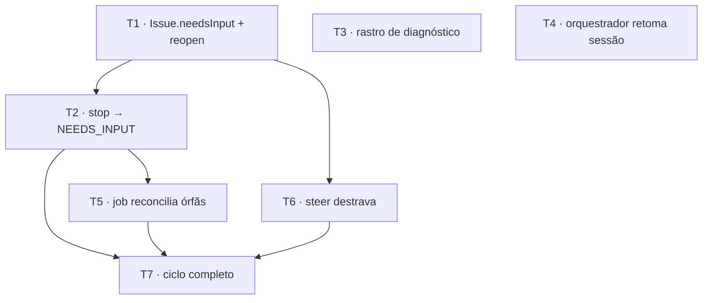

# Issue presa em WORKING — Implementation Plan

> **For agentic workers:** Execute via `/build`. Steps use checkbox
> (`- [ ]`) syntax for tracking. Each Task wraps one observable
> behavior in an outer RED→GREEN cycle (Matt Pocock vertical slicing).

**Goal:** Uma issue nunca mais fica marcada como trabalhando quando não há nada rodando — o agente encerrando sem declarar, o processo morrendo ou o daemon reiniciando levam a issue a `NEEDS_INPUT` com o motivo escrito, e um steer a devolve ao trabalho.

**Architecture:** Três cortes independentes que se encontram num só caminho. (1) A entidade `Issue` ganha a transição `NEEDS_INPUT` que o enum, a UI e a ferramenta MCP já assumiam existir, e `reopen()` passa a aceitar esse estado como origem. (2) O contexto `issue` passa a escutar `ThreadStopRaisedEvent` — o mesmo integration event que o `thread` já consome para gravar a linha do Stop — e move o status; dois consumidores, um publicador só. (3) Um job repetível no contexto `agent` é o **único** produtor do fato "esta issue travou": ele detecta a órfã pela ausência de qualquer coisa em voo (nenhum item de mailbox não-consumido, nenhum evento de outbox não-processado) e emite `AgentRunStopRaisedEvent` com `source: INFERRED`, entrando no mesmo caminho do item (2).

**Tech Stack:** TypeScript, Bun, Drizzle, tsyringe, Zod

**Spec:** .specs/2026-08-26-issue-presa-em-working-design.md
**Tasks:** 7
**Estimated minutes:** 195

---

## Wave Plan

**Feature Type:** 5 — New integration / reaction. O núcleo é uma reação nova cruzando contextos (`thread.stop_raised` → status da issue) mais um job repetível; nenhuma entidade nova, nenhum controller, nenhum schema de wire. Carrega um componente de Type 4 (behavior nova numa entidade existente) como pré-requisito da reação.

**Phases in scope:** 1 (Behavior Slices), 2 (Integration). **Não há Phase 0 / Contract Lock**: nenhum contrato TypeSpec muda, nenhum controller ou schema de wire é tocado, logo **nenhum `bun sdk` / `emit-openapi`** entra neste plano. O `CHECK` de `issue_issues.status` já aceita `NEEDS_INPUT`, então também **não há migração**.

**Critical path length:** 4 steps — `T1 → T2 → T5 → T7`

### Phase 1 — Behavior Slices

#### Wave W1 — sem dependências (paralelo entre si)

| # | Task | Behavior | Contexto | Classification |
|---|------|----------|----------|----------------|
| T1 | A issue sabe entrar em NEEDS_INPUT e voltar | AC-1, AC-2, AC-3 | issue | parallel-now |
| T3 | Um turno silencioso e um stop engolido deixam rastro | AC-11, AC-12 | agent, thread | parallel-now |
| T4 | O orquestrador retoma sua sessão | Story 5, AC-13 | agent | parallel-now |

#### Wave W2 — depois de T1 (paralelo entre si)

| # | Task | Behavior | Contexto | Classification |
|---|------|----------|----------|----------------|
| T2 | Um stop com issueId leva a issue a NEEDS_INPUT | Story 3, AC-5, AC-6 | issue | parallel-after-wave-1 |
| T6 | Um steer destrava uma issue parada | Story 2, AC-4 | thread, agent | parallel-after-wave-1 |

#### Wave W3 — depois de T2

| # | Task | Behavior | Contexto | Classification |
|---|------|----------|----------|----------------|
| T5 | Uma issue órfã é detectada e parada | Story 1, AC-7..AC-10 | agent | parallel-after-wave-2 |

### Phase 2 — Integration (serial)

| # | Task | Classification |
|---|------|----------------|
| T7 | Ciclo completo ponta a ponta + `contexts:check` | serial |

### Parallelism Matrix

| Kind | Count | Dominant classification |
|------|-------|--------------------------|
| entity | 1 (modify) | parallel-now |
| usecase | 2 (1 new, 1 modify) | parallel-after-wave-1 |
| handler | 2 (1 new, 1 modify) | parallel-after-wave-1 |
| service | 1 (new) + 1 (modify) | mixed |
| job | 1 (new) | parallel-after-wave-2 |
| test (flow) | 1 (new) | serial |

### Dependency Graph



---

## Task T1: A issue sabe entrar em NEEDS_INPUT e voltar ao trabalho

**Files to write:**
- Modify: `packages/api/typescript/src/issue/entities/Issue.ts` — adiciona `needsInput(reason?)`; `reopen()` passa a aceitar `NEEDS_INPUT` além de `COMPLETED`
- Test: `packages/api/typescript/src/issue/entities/Issue.test.ts` — adiciona os casos das duas transições
- Modify: `packages/api/typescript/src/issue/errors/index.ts` — adiciona o código `ISSUE_NOT_REOPENABLE`

**Files to read:**
- `packages/api/typescript/src/issue/errors/index.ts`

**Agent:** backend-developer
**Reviewer:** spec-compliance-reviewer → code-reviewer
**Model:** sonnet
**Skills:** /entity, /test
**Depends on:** (none)
**Consumes (frozen):** `IssueStatus.NEEDS_INPUT`, `IssueStatus.WORKING`, `IssueStatus.COMPLETED` de `@codm/contracts-typescript/wire/enums`; `BaseError` e o union `DomainErrors` de `../errors`.
**Scope fence:** LEFT — só a entidade e seu teste. OUT — o use case que chama `needsInput()` (T2), o `SteerIssueTurn` que chama `reopen()` (T6), qualquer leitura de banco. Não crie use case, repositório nem handler aqui.
**Gate:** `cd packages/api/typescript && bun test src/issue/entities/Issue.test.ts && bun x tsc -p tsconfig.build.json --noEmit`

### Step T1.1 — Escrever o teste que falha

Adicione ao final do `describe('Issue entity', …)` em `packages/api/typescript/src/issue/entities/Issue.test.ts`:

```typescript
	it('needsInput() moves WORKING → NEEDS_INPUT and stores the reason in meta', () => {
		const i = Issue.open(base)
		i.needsInput('o turno encerrou sem conclusão')
		expect(i.status).toBe(IssueStatus.NEEDS_INPUT)
		expect(i.meta).toBe('o turno encerrou sem conclusão')
	})

	it('needsInput() without a reason leaves meta untouched', () => {
		const i = Issue.open(base)
		i.needsInput()
		expect(i.status).toBe(IssueStatus.NEEDS_INPUT)
		expect(i.meta).toBeUndefined()
	})

	it('needsInput() twice is a no-op, not a throw', () => {
		const i = Issue.open(base)
		i.needsInput('primeira')
		expect(() => i.needsInput('segunda')).not.toThrow()
		expect(i.status).toBe(IssueStatus.NEEDS_INPUT)
	})

	it('needsInput() does NOT regress a COMPLETED issue', () => {
		const i = Issue.open(base)
		i.complete('entregue')
		i.needsInput('stop atrasado')
		expect(i.status).toBe(IssueStatus.COMPLETED)
		expect(i.meta).toBe('entregue')
	})

	it('needsInput() on an archived issue throws ISSUE_ARCHIVED', () => {
		const i = Issue.open(base)
		i.archive(IssueArchiveReason.MANUAL)
		expect(() => i.needsInput('x')).toThrow(BaseError)
	})

	it('reopen() accepts NEEDS_INPUT as the origin state', () => {
		const i = Issue.open(base)
		i.needsInput('travou')
		i.reopen()
		expect(i.status).toBe(IssueStatus.WORKING)
		expect(i.completedAt).toBeUndefined()
	})

	it('reopen() on a WORKING issue throws ISSUE_NOT_REOPENABLE', () => {
		const i = Issue.open(base)
		expect(() => i.reopen()).toThrow(BaseError)
	})
```

### Step T1.2 — Rodar o teste e ver falhar

Run: `cd packages/api/typescript && bun test src/issue/entities/Issue.test.ts`
Expected: FAIL — `i.needsInput is not a function`

### Step T1.3 — Adicionar o código de erro

Modify `packages/api/typescript/src/issue/errors/index.ts`: adicione `'ISSUE_NOT_REOPENABLE'` ao union `DomainErrors` do contexto, ao lado de `'ISSUE_NOT_COMPLETED'`, e registre-o no mesmo mapa/objeto onde `ISSUE_NOT_COMPLETED` já aparece, com o mesmo status HTTP.

`ISSUE_NOT_COMPLETED` deixa de ser levantado por `reopen()` (a origem agora é um conjunto, não um estado), mas **não remova o código** — verifique com `grep -rn "ISSUE_NOT_COMPLETED" packages/api/typescript/src` antes de decidir; se ninguém mais o levanta, ainda assim mantenha o código registrado, porque removê-lo é mudança de contrato de erro fora do escopo desta spec.

### Step T1.4 — Proposed file (o executor escreve isto sobre o arquivo atual)

```typescript
// packages/api/typescript/src/issue/entities/Issue.ts — COMPLETE final file
import { AggregateRoot, BaseError, z } from '@codm/core-typescript'
import type Z from 'zod'
import { IssueStatus, ProviderKind, IssueArchiveReason } from '@codm/contracts-typescript/wire/enums'
import type { DomainErrors } from '../errors'

export const IssueSchema = z.object({
	ownerId: z.uuid(),
	threadId: z.uuid(),
	// Generated slug, unique within the thread (e.g. "pix-payment"). Doubles as the outbound label.
	key: z.string().trim().min(1),
	title: z.string().trim().min(1),
	status: z.enum(IssueStatus),
	provider: z.enum(ProviderKind),
	meta: z.string().optional(),
	archived: z.boolean(),
	archiveReason: z.enum(IssueArchiveReason).optional(),
	completedAt: z.date().optional(),
	/**
	 * The transcript entry that ASKED for this issue — the message the finished result will quote
	 * (§7.6, where the issue return always cites it).
	 *
	 * OPTIONAL, and it has to be: `DeclareIssueOpen` also opens issues for work an agent separated out
	 * mid-run, and `CreateIssueController` opens them from the console. Neither has an originating
	 * message. Making it required would break both, which is why §6.2 states it as nullable and
	 * mandatory only on the orchestrator path.
	 */
	originEntryId: z.uuid().optional(),
	/**
	 * What the operator actually asked for, in their words — the subagent's prompt.
	 *
	 * Before the pivot the prompt was the raw inbound text, re-read from the transcript at spawn time.
	 * Now the issue OWNS its goal, because the orchestrator may reword what it heard into a brief the
	 * transcript never literally contained.
	 */
	goal: z.string().trim().min(1).optional(),
})

export type IssueProps = Z.infer<typeof IssueSchema>

/** De quais estados `reopen()` aceita voltar ao trabalho — ver o docblock do método. */
const REOPENABLE_FROM: readonly IssueStatus[] = [IssueStatus.COMPLETED, IssueStatus.NEEDS_INPUT]

/**
 * `Issue` (BC5 Issue Execution, Core) — a unit of concurrent work with its own terminal session.
 * Invariants: `key` unique within the thread (DB-enforced); lifecycle NEEDS_INPUT → WORKING →
 * COMPLETED, plus archive (MANUAL / AUTO_24H / THREAD_DETACHED) and restore. The terminal log is a
 * separate table (own lifecycle/scale: T12 replay of a transport log, unbounded per issue).
 * Stops are NOT here any more — since B4 a Stop is a child of the `Thread` aggregate (it can exist
 * without an issue at all), so `Thread.raiseStop`/`resolveStop` own it and this line no longer covers it.
 */
export class Issue extends AggregateRoot<typeof IssueSchema> {
	static override schema = IssueSchema

	static open(data: {
		ownerId: string
		threadId: string
		key: string
		title: string
		provider: ProviderKind
		status?: IssueStatus
		originEntryId?: string
		goal?: string
	}): Issue {
		return new Issue({
			ownerId: data.ownerId,
			threadId: data.threadId,
			key: data.key,
			title: data.title,
			status: data.status ?? IssueStatus.WORKING,
			provider: data.provider,
			meta: undefined,
			archived: false,
			archiveReason: undefined,
			completedAt: undefined,
			originEntryId: data.originEntryId,
			goal: data.goal,
		})
	}

	complete(meta?: string): void {
		if (this.status === IssueStatus.COMPLETED) throw new BaseError<DomainErrors>('ISSUE_ALREADY_COMPLETED')
		this.status = IssueStatus.COMPLETED
		this.completedAt = new Date()
		if (meta !== undefined) this.meta = meta
	}

	/**
	 * WORKING → NEEDS_INPUT — a transição que faltava, e a razão de ela ter faltado importa.
	 *
	 * O enum declara `NEEDS_INPUT`, `GetIssuesOverview` e `GetSessionIssues` agrupam a UI por ele, e
	 * `OpenIssuesReader` documenta que uma issue nesse estado pertence ao conjunto candidato do
	 * classificador — mas nenhum método aqui produzia o valor, então nenhuma linha do banco jamais o
	 * teve. Uma ferramenta MCP anunciava a transição e não a fazia; o operador lia "marquei como
	 * NEEDS_INPUT" e a issue seguia `WORKING`.
	 *
	 * SILENCIOSA em dois casos, e nenhum dos dois é descuido:
	 *  - já em `NEEDS_INPUT` ⇒ no-op. O fato que dispara isto é at-least-once (outbox + job repetível),
	 *    então uma redelivery não pode virar erro — a mesma postura de `CompleteIssue`.
	 *  - já `COMPLETED` ⇒ no-op, e o `meta` da conclusão é preservado. Um stop que chega depois da
	 *    entrega é tardio, não uma correção: regredir o estado apagaria a entrega do operador.
	 *
	 * `reason` é opcional e só sobrescreve `meta` quando presente, pelo mesmo contrato de `complete()`.
	 */
	needsInput(reason?: string): void {
		this.assertNotArchived()
		if (this.status !== IssueStatus.WORKING) return
		this.status = IssueStatus.NEEDS_INPUT
		if (reason !== undefined) this.meta = reason
	}

	/**
	 * DE VOLTA AO TRABALHO — e a origem é um CONJUNTO, não um estado.
	 *
	 * Não existe um "reabrir" que o operador aciona por si: receber trabalho é o que reabre uma issue
	 * (spec Decisão 4). Reabrir sem instrução deixaria a issue em `WORKING` sem nada enfileirado, que é
	 * um estado que ninguém consegue explicar depois. Por isso este método é chamado do caminho do
	 * steer e de lugar nenhum além dele.
	 *
	 * `NEEDS_INPUT` entrou no conjunto junto com a transição que passou a produzi-lo: uma issue parada
	 * esperando o operador é exatamente aquela que um steer existe para destravar, e deixá-la de fora
	 * a prenderia lá pelo motivo simétrico ao que prendia em `WORKING`.
	 *
	 * `completedAt` é ZERADO, e isso não é arrumação: `AutoArchiveCompletedIssues` seleciona por essa
	 * coluna. Uma issue reaberta que mantivesse o carimbo antigo seria arquivada por baixo de um agente
	 * que está trabalhando dentro dela — o pior tipo de bug, porque o sintoma aparece longe da causa.
	 */
	reopen(): void {
		this.assertNotArchived()
		if (!REOPENABLE_FROM.includes(this.status)) throw new BaseError<DomainErrors>('ISSUE_NOT_REOPENABLE')
		this.status = IssueStatus.WORKING
		this.completedAt = undefined
	}

	archive(reason: IssueArchiveReason): void {
		if (this.archived) throw new BaseError<DomainErrors>('ISSUE_ALREADY_ARCHIVED')
		this.archived = true
		this.archiveReason = reason
	}

	restore(): void {
		if (!this.archived) throw new BaseError<DomainErrors>('ISSUE_NOT_ARCHIVED')
		this.archived = false
		this.archiveReason = undefined
	}

	/** Guard used by RaiseStop / SteerIssue — no new stops/steers on an archived issue. */
	assertNotArchived(): void {
		if (this.archived) throw new BaseError<DomainErrors>('ISSUE_ARCHIVED')
	}
}

export interface Issue extends IssueProps {}
```

### Step T1.5 — Rodar o teste e ver passar

Run: `cd packages/api/typescript && bun test src/issue/entities/Issue.test.ts`
Expected: PASS — todos os casos, incluindo os 7 novos.

### Step T1.6 — Type check + lint

Run: `bun tsc && bun lint`
Expected: 0 errors. Se `bun tsc` acusar `ISSUE_NOT_COMPLETED` sem uso em algum ponto, isso é esperado — o código continua registrado (Step T1.3).

### Step T1.7 — Commit

```bash
git add packages/api/typescript/src/issue/entities/Issue.ts \
        packages/api/typescript/src/issue/entities/Issue.test.ts \
        packages/api/typescript/src/issue/errors/index.ts
git commit -m "feat(issue): Issue ganha a transição NEEDS_INPUT e reopen a aceita como origem (Task T1)"
```

---

## Task T2: Um stop com issueId leva a issue a NEEDS_INPUT

**Files to write:**
- Create: `packages/api/typescript/src/issue/usecases/MarkIssueNeedsInput.ts`
- Test: `packages/api/typescript/src/issue/usecases/MarkIssueNeedsInput.test.ts`
- Create: `packages/api/typescript/src/issue/handlers/MarkIssueNeedsInputFromStop.ts`
- Modify: `packages/api/typescript/src/issue/handlers/external.ts` — adiciona o export do handler novo (rail WIRE-01)

**Files to read:**
- `packages/api/typescript/src/issue/usecases/CompleteIssue.ts`
- `packages/api/typescript/src/issue/handlers/MaterializeIssueFromExecution.ts`

**Agent:** backend-developer
**Reviewer:** spec-compliance-reviewer → code-reviewer
**Model:** sonnet
**Skills:** /usecase, /handler, /test
**Depends on:** T1
**Consumes (frozen):** `Issue.needsInput(reason?)` (T1); `IssueRepository.findById(id, tx?)` e `.save(issue, tx?)`; `ThreadStopRaisedEvent` de `@codm/contracts-typescript/wire/events`, cujo payload é `{ stopId, issueId?, threadId, kind, detail }`; `IssueStatus` de `@codm/contracts-typescript/wire/enums`.
**Scope fence:** DONE — a entidade e suas transições são de T1: consuma `needsInput()`, não reescreva a regra de estado no use case. OUT — o job que emite o fato (T5), o `RecordStopFromExecution` do contexto `thread` (T3 mexe nele, e ele continua sendo quem grava a LINHA do stop; este Task só move o STATUS). Não publique nenhum integration event daqui: `PublishAgentIntegrationEvents` continua sendo o publicador único.
**Gate:** `cd packages/api/typescript && bun test src/issue/usecases/MarkIssueNeedsInput.test.ts && bun x tsc -p tsconfig.build.json --noEmit && bun test tests/architecture/wiring-completeness.test.ts`

### Step T2.1 — Escrever o teste que falha

```typescript
// packages/api/typescript/src/issue/usecases/MarkIssueNeedsInput.test.ts
import { afterAll, beforeAll, beforeEach, describe, expect, it } from 'bun:test'
import { container, type DependencyContainer } from 'tsyringe-neo'
import { TestBed, givenIssue } from '@test/support'
import { IssueStatus } from '@codm/contracts-typescript/wire/enums'
import { IssueRepository } from '../repositories/IssueRepository'
import { MarkIssueNeedsInput } from './MarkIssueNeedsInput'

describe('MarkIssueNeedsInput', () => {
	let testBed: TestBed
	let testContainer: DependencyContainer
	let usecase: MarkIssueNeedsInput

	beforeAll(async () => {
		testContainer = container.createChildContainer()
		testBed = await TestBed.create('integration', { testContainer, ownerId: 'integration-tenant' })
		usecase = testBed.resolve(MarkIssueNeedsInput)
	})
	beforeEach(async () => {
		await testBed.reset()
	})
	afterAll(async () => {
		await testBed.destroy()
	})

	it('moves a WORKING issue to NEEDS_INPUT and stores the reason', async () => {
		const issue = await givenIssue(testBed)
		await usecase.execute({ issueId: issue.id.value, reason: 'o turno encerrou sem conclusão' })

		const reloaded = await testBed.resolve(IssueRepository).findById(issue.id.value)
		expect(reloaded?.status).toBe(IssueStatus.NEEDS_INPUT)
		expect(reloaded?.meta).toBe('o turno encerrou sem conclusão')
	})

	it('is idempotent — a redelivered fact does not throw and does not change the reason', async () => {
		const issue = await givenIssue(testBed)
		await usecase.execute({ issueId: issue.id.value, reason: 'primeira' })
		await usecase.execute({ issueId: issue.id.value, reason: 'segunda' })

		const reloaded = await testBed.resolve(IssueRepository).findById(issue.id.value)
		expect(reloaded?.status).toBe(IssueStatus.NEEDS_INPUT)
		expect(reloaded?.meta).toBe('primeira')
	})

	it('does NOT regress a COMPLETED issue', async () => {
		const issue = await givenIssue(testBed)
		const issues = testBed.resolve(IssueRepository)
		issue.complete('entregue')
		await issues.save(issue)

		await usecase.execute({ issueId: issue.id.value, reason: 'stop atrasado' })

		const reloaded = await issues.findById(issue.id.value)
		expect(reloaded?.status).toBe(IssueStatus.COMPLETED)
		expect(reloaded?.meta).toBe('entregue')
	})

	it('is a no-op for an unknown issue id', async () => {
		await expect(usecase.execute({ issueId: '00000000-0000-4000-8000-0000000000ff', reason: 'x' })).resolves.toBeUndefined()
	})

	it('is a no-op for an archived issue', async () => {
		const issue = await givenIssue(testBed)
		const issues = testBed.resolve(IssueRepository)
		issue.archive('MANUAL')
		await issues.save(issue)

		await expect(usecase.execute({ issueId: issue.id.value, reason: 'x' })).resolves.toBeUndefined()
	})
})
```

### Step T2.2 — Rodar o teste e ver falhar

Run: `cd packages/api/typescript && bun test src/issue/usecases/MarkIssueNeedsInput.test.ts`
Expected: FAIL — `Cannot find module './MarkIssueNeedsInput'`

### Step T2.3 — Scaffold do use case

```bash
bun cli usecase issue MarkIssueNeedsInput --internal
```

### Step T2.4 — Proposed file (o executor escreve isto sobre o scaffold)

```typescript
// packages/api/typescript/src/issue/usecases/MarkIssueNeedsInput.ts — COMPLETE final file
import { injectable } from 'tsyringe-neo'
import { Handler, z } from '@codm/core-typescript'
import type { Transaction } from '@codm/core-typescript'
import { IssueStatus } from '@codm/contracts-typescript/wire/enums'
import { IssueRepository } from '../repositories/IssueRepository'

export const MarkIssueNeedsInputInputSchema = z.object({ issueId: z.uuid(), reason: z.string().optional() })
export const MarkIssueNeedsInputOutputSchema = z.void()

/**
 * O STATUS da issue quando um Stop é levantado sobre ela — a metade que faltava do par.
 *
 * O Stop em si é filho do agregado `Thread` desde B4, e é o `thread` quem grava a linha
 * (`RecordStopFromExecution` → `RaiseStop`). Este use case não duplica nada disso: ele responde a
 * outra pergunta sobre outro estado — "esta issue ainda está trabalhando?" — e a resposta pertence ao
 * contexto que é dono do ciclo de vida dela. Dois consumidores do mesmo integration event, um
 * publicador só, cada um mudando o SEU estado: é o que a regra de B4 pede, não o que ela proíbe.
 *
 * Sem evento de saída. O fato que disparou isto (`integration.thread.stop_raised`) já está no ledger e
 * já tem publicador; mintar um segundo aqui poria a mesma ocorrência duas vezes na fita.
 *
 * IDEMPOTENTE em toda entrada que não seja uma issue `WORKING` viva: id desconhecido, arquivada,
 * já em `NEEDS_INPUT` ou já `COMPLETED` saem sem tocar em nada. O fato é at-least-once (outbox, mais o
 * job repetível de `ReconcileStalledIssues`), então a redelivery é o caso NORMAL, não a exceção — a
 * mesma postura que `CompleteIssue` já adota.
 */
@injectable()
export class MarkIssueNeedsInput extends Handler<typeof MarkIssueNeedsInputInputSchema, typeof MarkIssueNeedsInputOutputSchema> {
	readonly name = 'mark_issue_needs_input' as const
	readonly inputSchema = MarkIssueNeedsInputInputSchema
	readonly outputSchema = MarkIssueNeedsInputOutputSchema

	constructor(private readonly issues: IssueRepository) {
		super()
	}

	protected async handle(input: this['input'], tx?: Transaction): Promise<void> {
		const issue = await this.issues.findById(input.issueId)
		// A entidade também recusaria a arquivada (`assertNotArchived` lança) e ignoraria o que não está
		// `WORKING`. O guard está aqui em vez de num try/catch porque um stop sobre uma issue arquivada é
		// um NÃO-EVENTO previsto, e transformar previsto em exceção capturada esconde o imprevisto.
		if (!issue || issue.archived || issue.status !== IssueStatus.WORKING) return
		issue.needsInput(input.reason)
		await this.withTransaction(tx, async tx => {
			await this.issues.save(issue, tx)
		})
	}
}
```

### Step T2.5 — Scaffold do handler externo

```bash
bun cli handler issue MarkIssueNeedsInputFromStop --external
```

### Step T2.6 — Proposed file (o executor escreve isto sobre o scaffold)

```typescript
// packages/api/typescript/src/issue/handlers/MarkIssueNeedsInputFromStop.ts — COMPLETE final file
import { injectable } from 'tsyringe-neo'
import { EventHandler } from '@codm/core-typescript'
import { ThreadStopRaisedEvent } from '@codm/contracts-typescript/wire/events'
import { MarkIssueNeedsInput } from '../usecases/MarkIssueNeedsInput'

/**
 * O stop de execução → o STATUS da issue que ele parou.
 *
 * Handler próprio, e não uma quarta branch em `MaterializeIssueFromExecution`: aquele handler
 * materializa a EXISTÊNCIA e a CONCLUSÃO de uma issue a partir dos três fatos `issue.*`; este reage a
 * um fato `thread.*` para mudar o ciclo de vida dela. Misturá-los faria um handler que escuta dois
 * agregados diferentes por duas razões diferentes.
 *
 * `issueId` é OPCIONAL no evento congelado — um stop pode ser da thread inteira, sem issue nenhuma
 * (foi por isso que ele virou opcional em B4). Sem id não há status a mover, e o retorno silencioso é
 * a leitura correta: não é falha, é um stop que não é sobre uma issue.
 *
 * O `detail` vira o `meta` da issue: é o texto que o console mostra ao responder "por que isto parou?",
 * e é a mesma string que o card de Needs-you exibe — uma origem só para as duas telas.
 */
@injectable()
export class MarkIssueNeedsInputFromStop extends EventHandler<typeof ThreadStopRaisedEvent> {
	readonly event = ThreadStopRaisedEvent

	constructor(private readonly markNeedsInput: MarkIssueNeedsInput) {
		super()
	}

	async handle(event: this['input']): Promise<void> {
		const { issueId, detail } = event.payload
		if (!issueId) return
		await this.markNeedsInput.execute({ issueId, reason: detail })
	}
}
```

### Step T2.7 — Exportar do barril (rail WIRE-01)

Modify `packages/api/typescript/src/issue/handlers/external.ts`: após o export de `MaterializeIssueFromExecution`, adicione

```typescript
// O stop de execução muda o STATUS da issue. A LINHA do stop continua sendo do `thread` (B4) — este
// handler é o segundo consumidor do mesmo fato, não um segundo publicador dele.
export { MarkIssueNeedsInputFromStop } from './MarkIssueNeedsInputFromStop'
```

### Step T2.8 — Rodar os testes e ver passar

Run: `cd packages/api/typescript && bun test src/issue/usecases/MarkIssueNeedsInput.test.ts && bun test tests/architecture/wiring-completeness.test.ts`
Expected: PASS — os 5 casos do use case; WIRE-01 verde com o handler novo no barril.

### Step T2.9 — Type check + lint

Run: `bun tsc && bun lint`
Expected: 0 errors

### Step T2.10 — Commit

```bash
git add packages/api/typescript/src/issue/usecases/MarkIssueNeedsInput.ts \
        packages/api/typescript/src/issue/usecases/MarkIssueNeedsInput.test.ts \
        packages/api/typescript/src/issue/handlers/MarkIssueNeedsInputFromStop.ts \
        packages/api/typescript/src/issue/handlers/external.ts
git commit -m "feat(issue): um stop com issueId move a issue para NEEDS_INPUT (Task T2)"
```

---

## Task T3: Um turno silencioso e um stop engolido deixam rastro

**Files to write:**
- Modify: `packages/api/typescript/src/agent/usecases/RunIssueTurn.ts` — `warn` no lugar do `return` mudo em `persistOutcome` (linha 353)
- Modify: `packages/api/typescript/src/thread/handlers/RecordStopFromExecution.ts` — injeta `LoggingService` e loga antes de engolir cada um dos quatro códigos sancionados

**Files to read:**
- `packages/api/typescript/src/agent/services/ProviderDetector/SystemProviderDetector.ts`

**Agent:** backend-developer
**Reviewer:** spec-compliance-reviewer → code-reviewer
**Model:** sonnet
**Skills:** /usecase, /handler
**Depends on:** (none)
**Consumes (frozen):** `LoggingService` de `@codm/core-typescript`, cujo `warn` recebe `{ content: { message, …campos } }`; `MailboxItemKind` de `@codm/contracts-typescript/wire/enums`.
**Scope fence:** LEFT — apenas as duas linhas de diagnóstico. OUT — NÃO mude o comportamento de nenhum dos dois: o `return` de `RunIssueTurn` continua sendo um `return` (a transição é de T5, não daqui), e `RecordStopFromExecution` continua engolindo exatamente os mesmos quatro códigos e relançando todo o resto. Não adicione evento, não adicione stop, não mexa na lista `swallowed`.
**Gate:** `cd packages/api/typescript && bun x tsc -p tsconfig.build.json --noEmit && bun test src/agent/usecases/RunIssueTurn.test.ts`

### Step T3.1 — O rastro do turno silencioso

Modify `packages/api/typescript/src/agent/usecases/RunIssueTurn.ts`, dentro de `persistOutcome`, no ramo `if (outcome.kind === 'COMPLETED')`: substitua a linha `if (this.agent.tools.length > 0) return` por

```typescript
			if (this.agent.tools.length > 0) {
				// O turno acabou e o agente NÃO declarou nada — nem `TransitionIssueStatus`, nem `RaiseStop`,
				// nem `AskOperator`. Continua sendo um `return`: inferir a conclusão aqui publicaria
				// `integration.issue.completed` uma segunda vez (o fato declarado já a publicou), e inferir um
				// stop aqui é impossível de fazer certo — a declaração chega por uma ferramenta MCP que commita
				// fora deste fluxo, então ler o estado daqui responde a pergunta errada. Quem fecha a issue
				// travada é `ReconcileStalledIssues`, pela ausência de trabalho em voo.
				//
				// O que muda é o SILÊNCIO. Até 2026-08-26 este caminho não deixava rastro em lugar nenhum, e um
				// turno que encerrou prometendo "volto com o veredito" custou 1h22 de issue marcada como viva
				// sem nada rodando. Esta linha é o que aponta a causa em segundos.
				this.logging.warn({
					content: {
						message: 'turn ended without a declared outcome — the reconcile sweep will close the issue',
						issueId: input.issueId,
						threadId: input.threadId,
						turnKind: input.turnKind,
					},
				})
				return
			}
```

### Step T3.2 — O rastro do stop engolido

```typescript
// packages/api/typescript/src/thread/handlers/RecordStopFromExecution.ts — COMPLETE final file
import { injectable } from 'tsyringe-neo'
import { BaseError, EventHandler, LoggingService } from '@codm/core-typescript'
import { ThreadStopRaisedEvent } from '@codm/contracts-typescript/wire/events'
import { StopKind } from '@codm/contracts-typescript/wire/enums'
import { Id } from '@codm/core-typescript'
import { RaiseStop } from '../usecases/RaiseStop'

/**
 * The stop fact from the terminal engine → a Stop on the thread it belongs to.
 *
 * This branch used to live in `issue/handlers/MaterializeIssueFromExecution`, alongside the three ISSUE
 * facts. It moved with the aggregate (B4, spec decision 4): the consuming context is the one that owns
 * the state the fact changes, and stops are `Thread`'s children now. `MaterializeIssueFromExecution`
 * keeps `opened` / `created` / `completed`, which really are issue facts.
 *
 * `threadId` comes off the payload — the fact has always carried it (that is how thread-scoped SSE
 * consumers key off it directly) — so a stop with no `issueId` routes exactly as well as one with.
 */
@injectable()
export class RecordStopFromExecution extends EventHandler<typeof ThreadStopRaisedEvent> {
	readonly event = ThreadStopRaisedEvent

	constructor(
		private readonly raiseStop: RaiseStop,
		private readonly logging: LoggingService,
	) {
		super()
	}

	async handle(event: this['input']): Promise<void> {
		try {
			// `detail` is the agent's OWN words, additive on the frozen event since Fase 6 (§4.4 item (i)) —
			// before it existed this was hardcoded `''` and every Needs-you card rendered the generic title
			// with no body.
			//
			// HUMAN_REQUESTED is the one kind whose title is the text: it is what `AskOperator` raises, and
			// the operator needs to read the QUESTION on the card, not the generic catalog line. The other
			// four kinds leave `title` undefined — `RaiseStop` resolves the generic title from
			// `THREAD_MESSAGES.stopTitle`, with the operator's language in hand, which this handler has no
			// way to know.
			const detail = event.payload.detail
			const title = event.payload.kind === StopKind.HUMAN_REQUESTED && detail.length > 0 ? detail : undefined
			await this.raiseStop.execute({
				stopId: event.payload.stopId || Id.value(),
				threadId: event.payload.threadId,
				issueId: event.payload.issueId,
				kind: event.payload.kind,
				title,
				detail,
			})
		} catch (error) {
			// ONLY the sanctioned no-op outcomes are swallowed (the stop is simply not recorded). Anything
			// else — a DB outage included — must rethrow so the outbox retries instead of silently eating
			// the needs-you signal.
			const swallowed: readonly string[] = ['STOP_CRITERION_DISABLED', 'ISSUE_ARCHIVED', 'ISSUE_NOT_FOUND', 'THREAD_NOT_FOUND']
			if (error instanceof BaseError && swallowed.includes(error.name)) {
				// ENGOLIR NÃO É SUMIR. Em 2026-08-26 dois `integration.thread.stop_raised` foram publicados e
				// processados sem erro, e nenhuma linha apareceu em `stops` — e não havia como saber qual das
				// quatro guardas recusou, porque nenhuma delas dizia nada. O `warn` custa uma linha e é a
				// diferença entre um diagnóstico de segundos e uma reconstrução pelo banco.
				this.logging.warn({
					content: {
						message: 'stop not recorded — a sanctioned guard refused it',
						reason: error.name,
						stopId: event.payload.stopId,
						issueId: event.payload.issueId,
						threadId: event.payload.threadId,
						kind: event.payload.kind,
					},
				})
				return
			}
			throw error
		}
	}
}
```

### Step T3.3 — Type check + lint

Run: `bun tsc && bun lint`
Expected: 0 errors. Se algum teste construir `RecordStopFromExecution` com `new` passando um argumento só, ele passa a precisar do segundo — resolva pelo container (`testBed.resolve(RecordStopFromExecution)`), como `tests/flows/stop-control-plane.flow.test.ts` já faz.

### Step T3.4 — Rodar os testes tocados

Run: `cd packages/api/typescript && bun test src/agent/usecases/RunIssueTurn.test.ts tests/flows/stop-control-plane.flow.test.ts`
Expected: PASS — nenhum comportamento mudou, só o diagnóstico.

### Step T3.5 — Commit

```bash
git add packages/api/typescript/src/agent/usecases/RunIssueTurn.ts \
        packages/api/typescript/src/thread/handlers/RecordStopFromExecution.ts
git commit -m "feat(agent,thread): turno sem declaração e stop engolido passam a deixar rastro (Task T3)"
```

---

## Task T4: O orquestrador retoma sua própria sessão

**Files to write:**
- Modify: `packages/api/typescript/src/agent/entities/AgentSession.ts` — `MISSING_CURSOR` passa a valer só para sessão de issue
- Test: `packages/api/typescript/src/agent/entities/AgentSession.test.ts` — adiciona os dois casos

**Files to read:**
- `packages/api/typescript/src/agent/usecases/RunOrchestratorTurn.ts` (só `resolveSession`, linhas 590-612)

**Agent:** backend-developer
**Reviewer:** spec-compliance-reviewer → code-reviewer
**Model:** sonnet
**Skills:** /entity, /test
**Depends on:** (none)
**Consumes (frozen):** `ResumeInvalidationReason.MISSING_CURSOR | MODEL_CHANGED | CWD_CHANGED | CONVERSATION_ADVANCED`; o campo `issueId?: string` do `AgentSessionSchema`, cuja AUSÊNCIA identifica a linha do orquestrador (`agent_sessions_orchestrator_unq` é `UNIQUE(thread_id) WHERE issue_id IS NULL`).
**Scope fence:** LEFT — só `resumeDecision` e seu teste. OUT — NÃO mexa em `RunOrchestratorTurn.upsertSession` para gravar um cursor: a decisão de não passar cursor numa conversa é deliberada e documentada (`resolveSession:594`), e o conserto é a entidade parar de exigir o que o chamador declarou não usar. Não mude nada do caminho de issue.
**Gate:** `cd packages/api/typescript && bun test src/agent/entities/AgentSession.test.ts && bun x tsc -p tsconfig.build.json --noEmit`

### Step T4.1 — Escrever o teste que falha

Adicione ao `describe` de `resumeDecision` em `packages/api/typescript/src/agent/entities/AgentSession.test.ts`:

```typescript
	it('an ORCHESTRATOR session (no issueId) resumes without a cursor', () => {
		const session = AgentSession.create({
			ownerId: '00000000-0000-4000-8000-000000000001',
			threadId: '00000000-0000-4000-8000-0000000000aa',
			provider: ProviderKind.CLAUDE_CODE,
			cwd: '/tmp/ws',
			agentSessionId: 'cli-session-1',
			model: AgentModelId.DEFAULT,
		})

		const decision = session.resumeDecision({ model: AgentModelId.DEFAULT, cwd: '/tmp/ws' })
		expect(decision.resume).toBe(true)
	})

	it('an ISSUE session with no cursor is still invalidated with MISSING_CURSOR', () => {
		const session = AgentSession.create({
			ownerId: '00000000-0000-4000-8000-000000000001',
			issueId: '00000000-0000-4000-8000-0000000000bb',
			threadId: '00000000-0000-4000-8000-0000000000aa',
			provider: ProviderKind.CLAUDE_CODE,
			cwd: '/tmp/ws',
			agentSessionId: 'cli-session-2',
			model: AgentModelId.DEFAULT,
		})

		const decision = session.resumeDecision({ model: AgentModelId.DEFAULT, cwd: '/tmp/ws' })
		expect(decision.resume).toBe(false)
		expect(decision.resume === false && decision.reason).toBe(ResumeInvalidationReason.MISSING_CURSOR)
	})

	it('an ORCHESTRATOR session still checks model and cwd', () => {
		const session = AgentSession.create({
			ownerId: '00000000-0000-4000-8000-000000000001',
			threadId: '00000000-0000-4000-8000-0000000000aa',
			provider: ProviderKind.CLAUDE_CODE,
			cwd: '/tmp/ws',
			agentSessionId: 'cli-session-3',
			model: AgentModelId.DEFAULT,
		})

		const decision = session.resumeDecision({ model: AgentModelId.DEFAULT, cwd: '/tmp/OTHER' })
		expect(decision.resume).toBe(false)
		expect(decision.resume === false && decision.reason).toBe(ResumeInvalidationReason.CWD_CHANGED)
	})
```

Se o arquivo de teste ainda não importa `AgentModelId`, `ProviderKind` ou `ResumeInvalidationReason`, adicione-os aos imports existentes no topo.

### Step T4.2 — Rodar o teste e ver falhar

Run: `cd packages/api/typescript && bun test src/agent/entities/AgentSession.test.ts`
Expected: FAIL — o primeiro caso recebe `resume: false` com `MISSING_CURSOR`.

### Step T4.3 — Corrigir a guarda

Modify `packages/api/typescript/src/agent/entities/AgentSession.ts`, no método `resumeDecision`: troque a linha `if (!this.lastMessageId) return { resume: false, reason: ResumeInvalidationReason.MISSING_CURSOR }` por

```typescript
		// O CURSOR SÓ EXISTE PARA UMA SESSÃO DE ISSUE — e a ausência de `issueId` é o que identifica a
		// linha do orquestrador, então isto é lookup sobre o modelo, não um caso especial.
		//
		// As duas metades foram escritas sob premissas opostas e nunca se encontraram:
		// `RunOrchestratorTurn.resolveSession` decidiu, com razão declarada, NÃO passar cursor ("a
		// conversation has no equivalent notion of 'the turn before this one'"), enquanto esta linha
		// reprovava toda linha sem `lastMessageId` antes de chegar na comparação — e `upsertSession` do
		// orquestrador nunca grava um. O resultado era um orquestrador ESTRUTURALMENTE incapaz de retomar:
		// 28 avisos de `MISSING_CURSOR` num único boot, cada mensagem da thread abrindo uma sessão nova.
		//
		// Consertar do outro lado (gravar um cursor para a conversa) contradiria a decisão de 594 e daria
		// à thread um conceito que ela não tem. `model` e `cwd` seguem sendo checados para os dois tipos.
		if (this.issueId && !this.lastMessageId) return { resume: false, reason: ResumeInvalidationReason.MISSING_CURSOR }
```

Nada mais muda: `ctx.cursor !== this.lastMessageId` continua logo abaixo e, para o orquestrador, compara `undefined` com `undefined` — igual, então segue para o `resume: true`. Confirme isso lendo as duas linhas seguintes antes de commitar.

### Step T4.4 — Rodar o teste e ver passar

Run: `cd packages/api/typescript && bun test src/agent/entities/AgentSession.test.ts`
Expected: PASS — incluindo os 3 casos novos e todos os pré-existentes do caminho de issue.

### Step T4.5 — Type check + lint

Run: `bun tsc && bun lint`
Expected: 0 errors

### Step T4.6 — Commit

```bash
git add packages/api/typescript/src/agent/entities/AgentSession.ts \
        packages/api/typescript/src/agent/entities/AgentSession.test.ts
git commit -m "fix(agent): MISSING_CURSOR passa a valer só para sessão de issue (Task T4)"
```

---

## Task T5: Uma issue órfã é detectada e parada

**Files to write:**
- Create: `packages/api/typescript/src/agent/services/StalledIssueReader/StalledIssueReader.ts`
- Create: `packages/api/typescript/src/agent/services/StalledIssueReader/LibSqlStalledIssueReader.ts`
- Create: `packages/api/typescript/src/agent/services/StalledIssueReader/MockStalledIssueReader.ts`
- Create: `packages/api/typescript/src/agent/services/StalledIssueReader/index.ts`
- Modify: `packages/api/typescript/src/agent/registry.ts` — adiciona o binding `mock`/`integration`/`real` do reader
- Create: `packages/api/typescript/src/agent/usecases/ReconcileStalledIssues.ts`
- Test: `packages/api/typescript/src/agent/usecases/ReconcileStalledIssues.test.ts`
- Create: `packages/api/typescript/src/agent/jobs.ts`

**Files to read:**
- `packages/api/typescript/src/thread/services/OpenIssuesReader/LibSqlOpenIssuesReader.ts`
- `packages/api/typescript/src/issue/usecases/AutoArchiveCompletedIssues.ts`
- `packages/api/typescript/src/agent/events/AgentRunStopRaisedEvent.ts`

**Agent:** backend-developer
**Reviewer:** spec-compliance-reviewer → code-reviewer
**Model:** sonnet
**Skills:** /service, /usecase, /event, /test
**Depends on:** T2
**Consumes (frozen):** `AgentRunStopRaisedEvent` com payload `{ stopId, issueId, threadId, kind, detail, source }`; `StopKind.HUMAN_REQUESTED`; `FactSource.INFERRED` de `../enums`; `IssueStatus.WORKING`; as tabelas Drizzle `issues`, `agentMailbox` e `outbox` de `@codm/contracts/db`; `LibSqlDatabaseDriver` de `@codm/core-typescript`; `MailboxTargetKind.ISSUE`. O handler que consome o fato resultante é `MarkIssueNeedsInputFromStop` (T2) — NÃO o chame diretamente.
**Scope fence:** DONE — `Issue.needsInput()` (T1), `MarkIssueNeedsInput` + `MarkIssueNeedsInputFromStop` (T2). Este Task **emite o fato e para por aí**; a mudança de status acontece pelo caminho que T2 já construiu, via outbox. OUT — não escreva na tabela `issues`, não chame `IssueRepository`, não publique integration event (`PublishAgentIntegrationEvents` continua o publicador único de `agent.run.stop_raised` → `integration.thread.stop_raised`). Não crie `StopKind` novo.
**Gate:** `cd packages/api/typescript && bun test src/agent/usecases/ReconcileStalledIssues.test.ts && bun test tests/architecture/wiring-completeness.test.ts && bun contexts:check && bun x tsc -p tsconfig.build.json --noEmit`

### Step T5.1 — Escrever o teste que falha

```typescript
// packages/api/typescript/src/agent/usecases/ReconcileStalledIssues.test.ts
import { afterAll, beforeAll, beforeEach, describe, expect, it } from 'bun:test'
import { container, type DependencyContainer } from 'tsyringe-neo'
import { uuidv7 } from 'uuidv7'
import { TestBed, givenIssue, givenThread } from '@test/support'
import { IssueStatus, MailboxItemKind, MailboxTargetKind } from '@codm/contracts-typescript/wire/enums'
import { IssueRepository } from '@issue/repositories/IssueRepository'
import { MailboxRepository } from '../repositories/MailboxRepository'
import { ReconcileStalledIssues } from './ReconcileStalledIssues'

describe('ReconcileStalledIssues', () => {
	let testBed: TestBed
	let testContainer: DependencyContainer
	let usecase: ReconcileStalledIssues

	beforeAll(async () => {
		testContainer = container.createChildContainer()
		testBed = await TestBed.create('integration', { testContainer, ownerId: 'integration-tenant' })
		usecase = testBed.resolve(ReconcileStalledIssues)
	})
	beforeEach(async () => {
		await testBed.reset()
	})
	afterAll(async () => {
		await testBed.destroy()
	})

	async function enqueueSteer(ownerId: string, issueId: string, threadId: string): Promise<void> {
		await testBed.resolve(MailboxRepository).enqueue({
			ownerId,
			targetKind: MailboxTargetKind.ISSUE,
			targetId: issueId,
			kind: MailboxItemKind.STEER,
			payload: { issueId, threadId, key: 'k', title: 't', text: 'segue' },
			dedupKey: uuidv7(),
		})
	}

	it('marks a WORKING issue with both queues empty as stalled', async () => {
		const thread = await givenThread(testBed)
		const issue = await givenIssue(testBed, { threadId: thread.id.value })

		const { stalledIssueIds } = await usecase.execute({})

		expect(stalledIssueIds).toEqual([issue.id.value])
	})

	it('does NOT touch an issue with a mailbox item still in flight', async () => {
		const thread = await givenThread(testBed)
		const issue = await givenIssue(testBed, { threadId: thread.id.value })
		await enqueueSteer(issue.ownerId, issue.id.value, thread.id.value)

		const { stalledIssueIds } = await usecase.execute({})

		expect(stalledIssueIds).toEqual([])
	})

	it('does NOT touch an issue whose outbox event is not processed yet', async () => {
		const thread = await givenThread(testBed)
		const issue = await givenIssue(testBed, { threadId: thread.id.value })
		// Um fato recém-gravado e ainda não despachado — a janela em que um turno acabou de declarar
		// COMPLETED e o materializador ainda não rodou. Marcar aqui seria o falso positivo que o segundo
		// predicado existe para impedir. `givenDomainEvent` grava pelo `DomainEventRepository`, que é
		// exatamente o caminho que deixa a linha em `shared_outbox` com `processed_at IS NULL`.
		await givenDomainEvent(
			testBed,
			new AgentRunCompletedEvent({
				entityId: issue.id.value,
				ownerId: issue.ownerId,
				payload: {
					issueId: issue.id.value,
					threadId: thread.id.value,
					key: issue.key,
					completedAt: new Date(),
					source: FactSource.DECLARED,
				},
			}),
		)

		const { stalledIssueIds } = await usecase.execute({})

		expect(stalledIssueIds).toEqual([])
	})

	it('does NOT touch archived issues nor issues outside WORKING', async () => {
		const thread = await givenThread(testBed)
		const issues = testBed.resolve(IssueRepository)

		const archived = await givenIssue(testBed, { threadId: thread.id.value })
		archived.archive('MANUAL')
		await issues.save(archived)

		const completed = await givenIssue(testBed, { threadId: thread.id.value, key: 'other' })
		completed.complete('entregue')
		await issues.save(completed)

		const { stalledIssueIds } = await usecase.execute({})

		expect(stalledIssueIds).toEqual([])
	})

	it('running twice does not raise a second stop for the same issue', async () => {
		const thread = await givenThread(testBed)
		const issue = await givenIssue(testBed, { threadId: thread.id.value })

		const first = await usecase.execute({})
		expect(first.stalledIssueIds).toEqual([issue.id.value])

		// O consumidor do fato, chamado diretamente — o mesmo encadeamento explícito que
		// `tests/flows/stop-control-plane.flow.test.ts` usa. Não há dispatcher a "drenar" no modo
		// `integration`: o TestBed só troca o OutboxDispatcher por um mock no modo `mock`.
		await testBed.resolve(MarkIssueNeedsInputFromStop).handle(
			new ThreadStopRaisedEvent({
				ownerId: issue.ownerId,
				payload: {
					stopId: uuidv7(),
					issueId: issue.id.value,
					threadId: thread.id.value,
					kind: StopKind.HUMAN_REQUESTED,
					detail: ReconcileStalledIssues.DETAIL,
				},
			}),
		)

		// A segunda varredura não a vê mais: a idempotência vem do PREDICADO (ela não está mais
		// `WORKING`), não de um registro de "já avisei".
		const second = await usecase.execute({})
		expect(second.stalledIssueIds).toEqual([])

		const reloaded = await testBed.resolve(IssueRepository).findById(issue.id.value)
		expect(reloaded?.status).toBe(IssueStatus.NEEDS_INPUT)
	})
})
```

Imports adicionais no topo deste arquivo, além dos já listados: `givenDomainEvent` de `@test/support`, `StopKind` de `@codm/contracts-typescript/wire/enums`, `ThreadStopRaisedEvent` de `@codm/contracts-typescript/wire/events`, `AgentRunCompletedEvent` de `../events/AgentRunCompletedEvent`, `FactSource` de `../enums`, `MarkIssueNeedsInputFromStop` de `@issue/handlers/MarkIssueNeedsInputFromStop`, e `uuidv7` de `uuidv7`.

Confirme a assinatura de `MailboxRepository.enqueue` contra `src/agent/repositories/MailboxRepository/MailboxRepository.ts` antes de usar `enqueueSteer` — o campo de dedup pode chamar-se `dedupKey` ou vir dentro de um segundo argumento de opções, como em `SteerIssueTurn`.

### Step T5.2 — Rodar o teste e ver falhar

Run: `cd packages/api/typescript && bun test src/agent/usecases/ReconcileStalledIssues.test.ts`
Expected: FAIL — `Cannot find module './ReconcileStalledIssues'`

### Step T5.3 — Scaffold do service

```bash
bun cli service agent StalledIssueReader
```

O scaffolder emite **um arquivo plano** (`agent/services/StalledIssueReader.ts`) com abstract + Default + Mock juntos. Todos os services vizinhos do contexto `agent` (`AgentRunnerFactory/`, `ProviderDetector/`, `MailboxDispatcher/`) usam **pasta com barril**. Siga a convenção do contexto: apague o arquivo plano gerado e escreva os quatro arquivos dos passos seguintes. O gap está registrado nas Notes.

### Step T5.4 — Proposed file: a porta

```typescript
// packages/api/typescript/src/agent/services/StalledIssueReader/StalledIssueReader.ts — COMPLETE final file

/**
 * Uma issue que se diz trabalhando e não tem trabalho nenhum em voo.
 *
 * Carrega só o que o fato precisa (`AgentRunStopRaisedEvent` quer os três ids) — não é uma issue
 * rehidratada, e não deve virar uma: o contexto `agent` lê o estado da issue para decidir se há run,
 * nunca para mexer no ciclo de vida dela, que é do `issue`.
 */
export interface StalledIssueRef {
	issueId: string
	ownerId: string
	threadId: string
}

/**
 * Quais issues estão marcadas como trabalhando SEM nada em voo — o predicado que fecha a classe de
 * falha "a issue mente sobre estar viva".
 *
 * Modelado como read Service (leitura de tabela em estilo BFF, não import de write-model de outro
 * contexto), exatamente como `thread/services/OpenIssuesReader` lê a tabela `issues` a partir do
 * `thread`. A direção é a que o CONTEXT_MAP já declara.
 *
 * ### Por que o predicado tem DUAS metades, e por que nenhuma delas é um timeout
 * O sistema já sabe, com precisão, se existe alguém trabalhando numa issue — o `MailboxDispatcher`
 * mantém lease por alvo com heartbeat, e `claimNext` recusa um alvo com lease vivo. Então:
 *
 *  1. **Nenhum item de mailbox em voo** (`consumed_at IS NULL AND dead_at IS NULL`) — cobre de uma vez
 *     o run em andamento (lease vivo) e o turno enfileirado esperando slot. Um item consumido é um
 *     turno que ACABOU, e é o instante exato em que a issue vira órfã se ninguém declarou nada.
 *  2. **Nenhum evento de outbox pendente para a issue** (`processed_at IS NULL`) — fecha a corrida com
 *     o materializador. Sem esta metade, um turno que acabou de declarar `COMPLETED` seria marcado
 *     como parado na janela entre gravar o fato e o outbox despachá-lo.
 *
 * As duas juntas significam "não há nada em voo". Um timeout responderia a mesma pergunta pior: ele
 * chuta quanto tempo um turno pode durar, e um turno legítimo de vinte minutos vira falso positivo.
 */
export abstract class StalledIssueReader {
	abstract stalledIssues(): Promise<StalledIssueRef[]>
}
```

### Step T5.5 — Proposed file: a implementação

```typescript
// packages/api/typescript/src/agent/services/StalledIssueReader/LibSqlStalledIssueReader.ts — COMPLETE final file
import { injectable } from 'tsyringe-neo'
import { and, eq, isNull, sql } from 'drizzle-orm'
import { LibSqlDatabaseDriver } from '@codm/core-typescript'
import { agentMailbox, issues, outbox } from '@codm/contracts/db'
import { IssueStatus, MailboxTargetKind } from '@codm/contracts-typescript/wire/enums'
import type { StalledIssueRef } from './StalledIssueReader'
import { StalledIssueReader } from './StalledIssueReader'

@injectable()
export class LibSqlStalledIssueReader extends StalledIssueReader {
	constructor(private driver: LibSqlDatabaseDriver) {
		super()
	}

	/**
	 * SEM `tryCatchAsync`, e a assimetria com `OpenIssuesReader.openIssues` é deliberada — a mesma razão
	 * que `hasWorkingIssue` documenta do outro lado.
	 *
	 * Degradar para "nenhuma órfã" num erro de leitura é indistinguível de "está tudo bem", e o efeito é
	 * a varredura ficar verde para sempre enquanto issues se acumulam mentindo. Um reconciliador que não
	 * consegue ler tem de falhar ALTO: o job repete em um minuto e o erro aparece.
	 */
	async stalledIssues(): Promise<StalledIssueRef[]> {
		const inFlightMailbox = this.driver.db
			.select({ one: sql`1` })
			.from(agentMailbox)
			.where(
				and(
					eq(agentMailbox.targetKind, MailboxTargetKind.ISSUE),
					eq(agentMailbox.targetId, issues.id),
					isNull(agentMailbox.consumedAt),
					isNull(agentMailbox.deadAt),
				),
			)

		const pendingOutbox = this.driver.db
			.select({ one: sql`1` })
			.from(outbox)
			.where(and(eq(outbox.entityId, issues.id), isNull(outbox.processedAt)))

		const rows = await this.driver.db
			.select({ issueId: issues.id, ownerId: issues.ownerId, threadId: issues.threadId })
			.from(issues)
			.where(
				and(
					eq(issues.status, IssueStatus.WORKING),
					eq(issues.archived, false),
					sql`NOT EXISTS ${inFlightMailbox}`,
					sql`NOT EXISTS ${pendingOutbox}`,
				),
			)

		return rows satisfies StalledIssueRef[]
	}
}
```

### Step T5.6 — Proposed file: o mock

```typescript
// packages/api/typescript/src/agent/services/StalledIssueReader/MockStalledIssueReader.ts — COMPLETE final file
import { injectable } from 'tsyringe-neo'
import type { StalledIssueRef } from './StalledIssueReader'
import { StalledIssueReader } from './StalledIssueReader'

/** Sem tabela de issues no modo `mock` — nada está parado, e a varredura é um no-op. */
@injectable()
export class MockStalledIssueReader extends StalledIssueReader {
	async stalledIssues(): Promise<StalledIssueRef[]> {
		return []
	}
}
```

### Step T5.7 — Proposed file: o barril

```typescript
// packages/api/typescript/src/agent/services/StalledIssueReader/index.ts — COMPLETE final file
export { StalledIssueReader, type StalledIssueRef } from './StalledIssueReader'
export { LibSqlStalledIssueReader } from './LibSqlStalledIssueReader'
export { MockStalledIssueReader } from './MockStalledIssueReader'
```

### Step T5.8 — Registrar o binding

Modify `packages/api/typescript/src/agent/registry.ts`: adicione o import

```typescript
import { StalledIssueReader, LibSqlStalledIssueReader, MockStalledIssueReader } from './services/StalledIssueReader'
```

e, dentro do array de `expandBindings([...])`, a entrada

```typescript
	// A varredura de issues órfãs lê a tabela `issues` a partir daqui — mesmo padrão de
	// `thread/services/OpenIssuesReader`. `integration` usa a implementação REAL de propósito: o teste do
	// job existe para exercitar o predicado das duas filas contra o banco, e um mock o tornaria vazio.
	{
		token: StalledIssueReader,
		mock: MockStalledIssueReader,
		integration: LibSqlStalledIssueReader,
		real: LibSqlStalledIssueReader,
	},
```

Se `expandBindings` exigir a coluna `e2e` para entradas com colunas explícitas, espelhe o que as entradas vizinhas fazem e use `LibSqlStalledIssueReader` nela.

### Step T5.9 — Scaffold do use case

```bash
bun cli usecase agent ReconcileStalledIssues --internal
```

### Step T5.10 — Proposed file (o executor escreve isto sobre o scaffold)

```typescript
// packages/api/typescript/src/agent/usecases/ReconcileStalledIssues.ts — COMPLETE final file
import { injectable } from 'tsyringe-neo'
import { uuidv7 } from 'uuidv7'
import { Handler, z } from '@codm/core-typescript'
import type { Transaction } from '@codm/core-typescript'
import { StopKind } from '@codm/contracts-typescript/wire/enums'
import { StalledIssueReader } from '../services/StalledIssueReader'
import { AgentRunStopRaisedEvent } from '../events/AgentRunStopRaisedEvent'
import { FactSource } from '../enums'

export const ReconcileStalledIssuesInputSchema = z.object({})
export const ReconcileStalledIssuesOutputSchema = z.object({ stalledIssueIds: z.array(z.uuid()) })

/**
 * A varredura que fecha a classe de falha "a issue diz que está trabalhando e não está".
 *
 * ### Por que existe UM produtor deste fato, e por que ele é um job
 * A alternativa óbvia — `RunIssueTurn` mintar o fato quando o turno acaba sem declaração — não
 * funciona, por duas razões medidas. Primeiro, o turno **não tem como saber se houve declaração**: ela
 * chega por uma ferramenta MCP que commita fora do fluxo do turno, e o materializador que move o status
 * é assíncrono via outbox, então ler o estado no fim do turno responde a pergunta errada. Segundo, um
 * turno só cobre o caso em que o turno TERMINA — crash, `kill -9` e reinício do daemon deixam a issue
 * presa sem que nenhum código de fim de turno chegue a rodar. A varredura cobre os dois com um
 * mecanismo só, e um produtor único dispensa dedup entre produtores.
 *
 * ### O que é emitido, e por que reusa o vocabulário existente
 * `HUMAN_REQUESTED` com `source: INFERRED`. O par diz exatamente o que aconteceu — "precisa de humano, e
 * não foi o agente que pediu" — e é para essa distinção que `FactSource` existe: "quantas issues
 * fecharam por inferência?" continua sendo um `SELECT`. Um `StopKind` novo custaria um contrato
 * congelado mais uma migração do `CHECK` de `issue_stops.kind` para dizer o que o `source` já diz.
 *
 * ### Idempotência sem registro de "já avisei"
 * Ela vem do PREDICADO. O fato emitido leva a issue a `NEEDS_INPUT` (via
 * `MarkIssueNeedsInputFromStop`), e uma issue fora de `WORKING` não aparece na varredura seguinte. Até
 * o outbox despachar, a segunda metade do predicado (evento pendente para a issue) já a exclui — a
 * mesma linha que impede o falso positivo impede o stop duplicado.
 *
 * A CADÊNCIA mora aqui, ao lado do que ela agenda, como em `AutoArchiveCompletedIssues`. Um minuto: o
 * predicado é um `SELECT` sobre um SQLite local, e o que se compra com ele é o teto de espera do
 * operador — o incidente que originou isto custou 1h22.
 */
@injectable()
export class ReconcileStalledIssues extends Handler<
	typeof ReconcileStalledIssuesInputSchema,
	typeof ReconcileStalledIssuesOutputSchema
> {
	readonly name = 'reconcile_stalled_issues' as const
	readonly inputSchema = ReconcileStalledIssuesInputSchema
	readonly outputSchema = ReconcileStalledIssuesOutputSchema

	static readonly repeat = { every: 60 * 1000 }

	static readonly DETAIL = 'a execução terminou sem conclusão — nada estava em andamento quando a varredura passou'

	constructor(private readonly stalled: StalledIssueReader) {
		super()
	}

	protected async handle(_input: this['input'], tx?: Transaction): Promise<this['output']> {
		const orphans = await this.stalled.stalledIssues()
		if (orphans.length === 0) return { stalledIssueIds: [] }

		await this.withTransaction(tx, async tx => {
			for (const orphan of orphans) {
				await this.domainEventRepository.save(
					new AgentRunStopRaisedEvent({
						entityId: orphan.issueId,
						ownerId: orphan.ownerId,
						payload: {
							stopId: uuidv7(),
							issueId: orphan.issueId,
							threadId: orphan.threadId,
							kind: StopKind.HUMAN_REQUESTED,
							detail: ReconcileStalledIssues.DETAIL,
							source: FactSource.INFERRED,
						},
					}),
					tx,
				)
			}
		})

		return { stalledIssueIds: orphans.map(orphan => orphan.issueId) }
	}
}
```

### Step T5.11 — Proposed file: o barril de jobs (rail WIRE-02)

```typescript
// packages/api/typescript/src/agent/jobs.ts — COMPLETE final file
/**
 * Os JOBS repetíveis deste contexto — barril mecânico. A cadência mora na própria classe
 * (`static repeat`), ao lado do predicado que ela agenda.
 *
 * `ReconcileStalledIssues` é o produtor único do fato "esta issue travou". Ele vive AQUI, e não no
 * contexto `issue`, porque quem sabe o que é um run vivo é o dono da mailbox — e porque
 * `AgentRunStopRaisedEvent` já tem exatamente um publicador, que é este contexto.
 */
export { ReconcileStalledIssues } from './usecases/ReconcileStalledIssues'
```

### Step T5.12 — Regerar a composição

```bash
bun contexts:sync
```

Expected: `packages/api/typescript/generated/composition.generated.ts` ganha `import { ReconcileStalledIssues } from '@agent/jobs'` e a entrada correspondente na lista de jobs do contexto `agent`.

### Step T5.13 — Rodar os testes e ver passar

Run: `cd packages/api/typescript && bun test src/agent/usecases/ReconcileStalledIssues.test.ts && bun test tests/architecture/wiring-completeness.test.ts`
Expected: PASS — os 5 casos do use case; WIRE-02 verde com o job novo no barril.

### Step T5.14 — Gates de composição, tipos e lint

Run: `bun contexts:check && bun tsc && bun lint`
Expected: 0 errors; `contexts:check` sem diferença (a composição foi regerada no passo anterior).

### Step T5.15 — Commit

```bash
git add packages/api/typescript/src/agent/services/StalledIssueReader/ \
        packages/api/typescript/src/agent/usecases/ReconcileStalledIssues.ts \
        packages/api/typescript/src/agent/usecases/ReconcileStalledIssues.test.ts \
        packages/api/typescript/src/agent/jobs.ts \
        packages/api/typescript/src/agent/registry.ts \
        packages/api/typescript/generated/composition.generated.ts
git commit -m "feat(agent): varredura de issues órfãs emite o stop inferido (Task T5)"
```

---

## Task T6: Um steer destrava uma issue parada

**Files to write:**
- Modify: `packages/api/typescript/src/thread/services/OpenIssuesReader/OpenIssuesReader.ts` — `SteerableIssueRef.completed` → `needsReopen`
- Modify: `packages/api/typescript/src/thread/services/OpenIssuesReader/LibSqlOpenIssuesReader.ts` — o cálculo do campo
- Modify: `packages/api/typescript/src/thread/services/OpenIssuesReader/MockOpenIssuesReader.ts` — o tipo de retorno acompanha
- Modify: `packages/api/typescript/src/agent/usecases/SteerIssueTurn.ts` — reabre quando `needsReopen`
- Test: `packages/api/typescript/src/agent/usecases/SteerIssueTurn.test.ts` — adiciona o caso `NEEDS_INPUT`

**Files to read:**
- `packages/api/typescript/src/issue/usecases/ReopenIssue.ts`

**Agent:** backend-developer
**Reviewer:** spec-compliance-reviewer → code-reviewer
**Model:** sonnet
**Skills:** /service, /usecase, /test
**Depends on:** T1
**Consumes (frozen):** `Issue.reopen()` aceitando `NEEDS_INPUT` e `COMPLETED` (T1); `ReopenIssue.execute({ ownerId, issueId }, tx)`; `IssueStatus` de `@codm/contracts-typescript/wire/enums`; `SteerableIssueRef` de `@thread/services/OpenIssuesReader`.
**Scope fence:** DONE — a entidade é de T1: consuma `reopen()`, não replique a lista de estados reabríveis aqui. OUT — o job (T5), o handler do stop (T2). Não exponha `IssueStatus` no `SteerableIssueRef`: a decisão documentada é que o contexto `agent` não ramifica sobre o ciclo de vida da issue, e o campo continua booleano por isso.
**Gate:** `cd packages/api/typescript && bun test src/agent/usecases/SteerIssueTurn.test.ts tests/flows/steer.flow.test.ts && bun x tsc -p tsconfig.build.json --noEmit`

### Step T6.1 — Escrever o teste que falha

Adicione ao `describe` de `packages/api/typescript/src/agent/usecases/SteerIssueTurn.test.ts` — espelhando o setup que o caso `COMPLETED` já usa no arquivo:

```typescript
	it('reopens a NEEDS_INPUT issue before enqueueing the steer', async () => {
		const thread = await givenThread(testBed)
		const issue = await givenIssue(testBed, { threadId: thread.id.value })
		const issues = testBed.resolve(IssueRepository)
		issue.needsInput('travou')
		await issues.save(issue)

		await testBed.resolve(SteerIssueTurn).execute({
			ownerId: issue.ownerId,
			threadId: thread.id.value,
			issueId: issue.id.value,
			text: 'segue daqui',
		})

		const reloaded = await issues.findById(issue.id.value)
		expect(reloaded?.status).toBe(IssueStatus.WORKING)
	})

	it('does NOT call reopen on an issue that is already WORKING', async () => {
		const thread = await givenThread(testBed)
		const issue = await givenIssue(testBed, { threadId: thread.id.value })

		// `reopen()` numa issue WORKING lança `ISSUE_NOT_REOPENABLE`; se o steer a chamasse, isto falharia.
		await expect(
			testBed.resolve(SteerIssueTurn).execute({
				ownerId: issue.ownerId,
				threadId: thread.id.value,
				issueId: issue.id.value,
				text: 'segue daqui',
			}),
		).resolves.toBeDefined()
	})
```

### Step T6.2 — Rodar o teste e ver falhar

Run: `cd packages/api/typescript && bun test src/agent/usecases/SteerIssueTurn.test.ts`
Expected: FAIL — o primeiro caso encontra a issue ainda em `NEEDS_INPUT`, porque `SteerIssueTurn` só reabre o que está `COMPLETED`.

### Step T6.3 — A pergunta certa no reader

Modify `packages/api/typescript/src/thread/services/OpenIssuesReader/OpenIssuesReader.ts`: substitua a interface `SteerableIssueRef` e seu docblock por

```typescript
/**
 * Uma issue que o orquestrador PODE steerar — o mesmo shape, mais o estado que decide se o steer
 * precisa reabri-la antes de enfileirar.
 *
 * BOOLEANO, e não o `IssueStatus` inteiro: o chamador só tem uma decisão a tomar, e devolver o enum
 * convidaria o contexto `agent` a ramificar sobre o ciclo de vida da issue, que não é dele.
 *
 * O nome diz a PERGUNTA, não um estado. Ele era `completed`, o que funcionava enquanto `COMPLETED` era
 * a única origem de `reopen()`; quando `NEEDS_INPUT` passou a ser produzível, um chamador olhando
 * `completed` teria deixado exatamente as issues paradas presas — o motivo simétrico ao bug que a spec
 * de reabertura já tinha corrigido do outro lado.
 */
export interface SteerableIssueRef extends OpenIssueRef {
	needsReopen: boolean
}
```

### Step T6.4 — O cálculo na implementação

Modify `packages/api/typescript/src/thread/services/OpenIssuesReader/LibSqlOpenIssuesReader.ts`, no `return` de `steerableIssue`: troque

```typescript
		return { issueId: row.issueId, key: row.key, title: row.title, completed: row.status === IssueStatus.COMPLETED }
```

por

```typescript
		return { issueId: row.issueId, key: row.key, title: row.title, needsReopen: row.status !== IssueStatus.WORKING }
```

`MockOpenIssuesReader` não precisa de mudança de corpo (segue devolvendo `undefined`), mas confirme que ele ainda type-checa contra a interface nova.

### Step T6.5 — O steer usa a pergunta certa

Modify `packages/api/typescript/src/agent/usecases/SteerIssueTurn.ts`: substitua o bloco do comentário + `if (target.completed)` por

```typescript
			// Só reabre o que NÃO está trabalhando: chamar `reopen()` numa issue em `WORKING` levantaria
			// `ISSUE_NOT_REOPENABLE` e derrubaria um steer perfeitamente válido de trabalho em andamento,
			// que é o caso mais comum deste endpoint. A pergunta vem pronta do reader — este contexto não
			// olha o ciclo de vida da issue, só o que fazer antes de enfileirar.
			if (target.needsReopen) {
				await this.reopenIssue.execute({ ownerId: input.ownerId, issueId: input.issueId }, tx)
			}
```

### Step T6.6 — Rodar os testes e ver passar

Run: `cd packages/api/typescript && bun test src/agent/usecases/SteerIssueTurn.test.ts tests/flows/steer.flow.test.ts`
Expected: PASS — incluindo os dois casos novos e os pré-existentes de issue `COMPLETED`.

### Step T6.7 — Type check + lint

Run: `bun tsc && bun lint`
Expected: 0 errors. Qualquer outro ponto que ainda leia `.completed` do `SteerableIssueRef` aparece aqui — corrija-o para `needsReopen`.

### Step T6.8 — Commit

```bash
git add packages/api/typescript/src/thread/services/OpenIssuesReader/ \
        packages/api/typescript/src/agent/usecases/SteerIssueTurn.ts \
        packages/api/typescript/src/agent/usecases/SteerIssueTurn.test.ts
git commit -m "feat(thread,agent): steer destrava uma issue parada, não só uma concluída (Task T6)"
```

---

## Task T7: O ciclo completo — travou, parou, destravou

**Files to write:**
- Test: `packages/api/typescript/tests/flows/stalled-issue.flow.test.ts`

**Files to read:**
- `packages/api/typescript/tests/flows/stop-control-plane.flow.test.ts`
- `packages/api/typescript/tests/support/given/issues.ts`

**Agent:** backend-developer
**Reviewer:** spec-compliance-reviewer → code-reviewer
**Model:** sonnet
**Skills:** /test
**Depends on:** T2, T5, T6
**Consumes (frozen):** `ReconcileStalledIssues.execute({})` devolvendo `{ stalledIssueIds }` e `ReconcileStalledIssues.DETAIL` (T5); `MarkIssueNeedsInputFromStop` (T2); `SteerIssueTurn.execute({ ownerId, threadId, issueId, text })` (T6); `ThreadRepository.findStop(stopId)`; `IssueRepository.findById`; `IssueStatus`.
**Scope fence:** LEFT — só o teste de fluxo. OUT — nenhuma mudança de código de produção neste Task. Se o fluxo revelar um defeito, conserte-o no Task dono do arquivo e não aqui.
**Gate:** `cd packages/api/typescript && bun test tests/flows/stalled-issue.flow.test.ts`

### Step T7.1 — Escrever o teste de fluxo

```typescript
// packages/api/typescript/tests/flows/stalled-issue.flow.test.ts
import { afterAll, beforeAll, beforeEach, describe, expect, it } from 'bun:test'
import { container, type DependencyContainer } from 'tsyringe-neo'
import { TestBed, givenIssue, givenThread } from '@test/support'
import { IssueStatus, StopKind } from '@codm/contracts-typescript/wire/enums'
import { IssueRepository } from '@issue/repositories/IssueRepository'
import { ThreadRepository } from '@thread/repositories/ThreadRepository'
import { ReconcileStalledIssues } from '@agent/usecases/ReconcileStalledIssues'
import { SteerIssueTurn } from '@agent/usecases/SteerIssueTurn'

/**
 * FLOW (integration DI) — o ciclo que a spec de 2026-08-26 fecha: um turno acaba sem declarar nada →
 * a varredura vê a issue sem trabalho em voo e emite o stop inferido → o outbox entrega o fato, o
 * `thread` grava a LINHA do stop e o `issue` move o STATUS → um steer devolve a issue ao trabalho.
 *
 * Modo `integration`, e não `mock` como os outros flows: o AC-14 pede a linha do stop GRAVADA na
 * tabela, e o modo mock não tem tabela. Isto é o que torna o teste sensível ao bug que originou a
 * spec — em 26/08 dois `thread.stop_raised` foram publicados e processados sem erro e nenhuma linha
 * apareceu em `stops`.
 */
describe('Flow (integration): turno sem declaração → NEEDS_INPUT → steer → WORKING', () => {
	let testBed: TestBed
	let testContainer: DependencyContainer

	beforeAll(async () => {
		testContainer = container.createChildContainer()
		testBed = await TestBed.create('integration', { testContainer, ownerId: 'integration-tenant' })
	})
	beforeEach(async () => {
		await testBed.reset()
	})
	afterAll(async () => {
		await testBed.destroy()
	})

	it('closes the loop end to end', async () => {
		const thread = await givenThread(testBed)
		const issue = await givenIssue(testBed, { threadId: thread.id.value })
		const issues = testBed.resolve(IssueRepository)

		// 1. Nada em voo: o turno acabou e ninguém declarou. A varredura enxerga a órfã.
		const { stalledIssueIds } = await testBed.resolve(ReconcileStalledIssues).execute({})
		expect(stalledIssueIds).toEqual([issue.id.value])

		// 2. O fato entregue aos DOIS consumidores, encadeado explicitamente — o padrão que
		// `stop-control-plane.flow.test.ts` já usa. No modo `integration` não há dispatcher a drenar: o
		// TestBed só substitui o OutboxDispatcher no modo `mock`.
		const stopId = uuidv7()
		const fact = new ThreadStopRaisedEvent({
			ownerId: issue.ownerId,
			payload: {
				stopId,
				issueId: issue.id.value,
				threadId: thread.id.value,
				kind: StopKind.HUMAN_REQUESTED,
				detail: ReconcileStalledIssues.DETAIL,
			},
		})
		await testBed.resolve(RecordStopFromExecution).handle(fact)
		await testBed.resolve(MarkIssueNeedsInputFromStop).handle(fact)

		// 2a. O `issue` moveu o STATUS, com o motivo legível.
		const stalled = await issues.findById(issue.id.value)
		expect(stalled?.status).toBe(IssueStatus.NEEDS_INPUT)
		expect(stalled?.meta).toBe(ReconcileStalledIssues.DETAIL)

		// 2b. O `thread` gravou a LINHA do stop — a metade que sumia em silêncio em 26/08.
		const stops = await testBed.resolve(ThreadRepository).openStopsByIssue(issue.id.value)
		expect(stops).toHaveLength(1)
		expect(stops[0]?.kind).toBe(StopKind.HUMAN_REQUESTED)
		expect(stops[0]?.stopId).toBe(stopId)

		// 3. Uma segunda varredura não emite nada: a issue não está mais WORKING.
		const second = await testBed.resolve(ReconcileStalledIssues).execute({})
		expect(second.stalledIssueIds).toEqual([])

		// 4. O operador responde. O steer reabre a issue parada e enfileira o turno.
		await testBed.resolve(SteerIssueTurn).execute({
			ownerId: issue.ownerId,
			threadId: thread.id.value,
			issueId: issue.id.value,
			text: 'roda a spec destacada e me diz o veredito',
		})

		const reopened = await issues.findById(issue.id.value)
		expect(reopened?.status).toBe(IssueStatus.WORKING)

		// 5. E com trabalho em voo de novo (o steer enfileirou um item), a varredura não a toca.
		const third = await testBed.resolve(ReconcileStalledIssues).execute({})
		expect(third.stalledIssueIds).toEqual([])
	})
})
```

Imports adicionais no topo, além dos já listados: `uuidv7` de `uuidv7`, `ThreadStopRaisedEvent` de `@codm/contracts-typescript/wire/events`, `RecordStopFromExecution` de `@thread/handlers/RecordStopFromExecution`, `MarkIssueNeedsInputFromStop` de `@issue/handlers/MarkIssueNeedsInputFromStop`.

`ThreadRepository.openStopsByIssue(issueId, tx?)` e `openStops(threadId, tx?)` ambos existem (`ThreadRepository.ts:64` e `:66`); a versão por issue é a mais precisa aqui. `SteerIssueTurn` roda em modo `integration` com `StubAgentRunnerFactory`, então nenhum CLI de provider é spawnado.

### Step T7.2 — Rodar o teste

Run: `cd packages/api/typescript && bun test tests/flows/stalled-issue.flow.test.ts`
Expected: PASS — um teste, cinco asserções de etapa.

### Step T7.3 — Suíte completa + gates

Run: `bun tsc && bun lint && bun run test && bun contexts:check`
Expected: 0 errors, todos os testes verdes, composição sem diferença.

### Step T7.4 — Commit

```bash
git add packages/api/typescript/tests/flows/stalled-issue.flow.test.ts
git commit -m "test(flows): ciclo completo de issue travada → NEEDS_INPUT → steer (Task T7)"
```

---

## Final Validation

- [ ] `bun tsc` — full type check clean
- [ ] `bun lint` — lint clean
- [ ] `bun run test` — todos os testes passam
- [ ] `bun contexts:check` — composição gerada em dia com `agent/jobs.ts`
- [ ] `cd packages/api/typescript && bun test tests/architecture/wiring-completeness.test.ts` — WIRE-01 e WIRE-02 verdes
- [ ] **Sem `bun sdk` / `bun emit-openapi`** — nenhum controller ou schema de wire mudou; se o `git diff` mostrar `packages/client/dist/` ou `openapi.json`, algo saiu do escopo
- [ ] AC mapping (cada AC da spec → ≥1 teste):
  - AC-1 → `packages/api/typescript/src/issue/entities/Issue.test.ts:"needsInput() moves WORKING → NEEDS_INPUT and stores the reason in meta"` + `"needsInput() twice is a no-op, not a throw"` + `"needsInput() on an archived issue throws ISSUE_ARCHIVED"`
  - AC-2 → `packages/api/typescript/src/issue/entities/Issue.test.ts:"needsInput() does NOT regress a COMPLETED issue"`
  - AC-3 → `packages/api/typescript/src/issue/entities/Issue.test.ts:"reopen() accepts NEEDS_INPUT as the origin state"` + `"reopen() on a WORKING issue throws ISSUE_NOT_REOPENABLE"`
  - AC-4 → `packages/api/typescript/src/agent/usecases/SteerIssueTurn.test.ts:"reopens a NEEDS_INPUT issue before enqueueing the steer"` + `"does NOT call reopen on an issue that is already WORKING"`
  - AC-5 → `packages/api/typescript/src/issue/usecases/MarkIssueNeedsInput.test.ts:"moves a WORKING issue to NEEDS_INPUT and stores the reason"` (o ramo sem `issueId` é o `return` de `MarkIssueNeedsInputFromStop`, coberto por `tests/flows/stop-control-plane.flow.test.ts` continuar verde)
  - AC-6 → `packages/api/typescript/tests/flows/stalled-issue.flow.test.ts:"closes the loop end to end"` (etapa 2a — o caminho `TransitionIssueStatus → stop → status` é o mesmo)
  - AC-7 → `packages/api/typescript/src/agent/usecases/ReconcileStalledIssues.test.ts:"marks a WORKING issue with both queues empty as stalled"`
  - AC-8 → `packages/api/typescript/src/agent/usecases/ReconcileStalledIssues.test.ts:"does NOT touch an issue with a mailbox item still in flight"` + `"does NOT touch an issue whose outbox event is not processed yet"`
  - AC-9 → `packages/api/typescript/src/agent/usecases/ReconcileStalledIssues.test.ts:"does NOT touch archived issues nor issues outside WORKING"`
  - AC-10 → `packages/api/typescript/src/agent/usecases/ReconcileStalledIssues.test.ts:"running twice does not raise a second stop for the same issue"`
  - AC-11 → verificação manual no Step T3.1 (um `warn` estruturado; o repo não testa saída de log, e criar um espião de logging só para isto seria backdoor de teste)
  - AC-12 → idem, Step T3.2
  - AC-13 → `packages/api/typescript/src/agent/entities/AgentSession.test.ts:"an ORCHESTRATOR session (no issueId) resumes without a cursor"` + `"an ISSUE session with no cursor is still invalidated with MISSING_CURSOR"` + `"an ORCHESTRATOR session still checks model and cwd"`
  - AC-14 → `packages/api/typescript/tests/flows/stalled-issue.flow.test.ts:"closes the loop end to end"`

## Notes

**Sem E2E.** Nada aqui atravessa HTTP ou a UI — não há rota, controller nem tela nova, e `bun e2e` não teria o que cobrir que o flow de T7 já não cubra em integração. O `Final Validation` omite o passo de propósito, não por esquecimento.

**Sem migração.** O `CHECK` de `issue_issues.status` já lista `'NEEDS_INPUT'`; a coluna sempre aceitou o valor que nada escrevia. Se algum passo pedir `bun migrate:create`, é sinal de que saiu do escopo.

**AC-11 e AC-12 não têm teste automatizado, e isso é uma escolha.** Os dois pedem uma linha de log. O repo não tem infraestrutura de asserção sobre `LoggingService`, e montar um espião só para isto significaria ou um backdoor no código de produção ou um teste que afirma o formato de uma string em vez de um comportamento. A verificação é a leitura do diff no review de T3.

**Gap do CLI a reportar (house rule do CLAUDE.md).** `bun cli service <ctx> <Name>` gera **um arquivo plano** com abstract + `Default*` + `Mock*` juntos, mas todo service do contexto `agent` (`AgentRunnerFactory/`, `ProviderDetector/`, `MailboxDispatcher/`, `AgentStreamRegistry/`) e do `thread` (`OpenIssuesReader/`) usa **pasta com barril e um arquivo por implementação**, com o prefixo da infra no nome concreto (`LibSql*`) em vez de `Default*`. T5 escreve à mão o que o CLI deveria escrever. Abrir issue para dar ao verbo `service` uma flag de layout em pasta (ou torná-lo o default), resolvendo dentro de uma semana conforme a house rule, e linkar da PR.

**Ordem de execução sugerida por onda:** W1 = T1 ∥ T3 ∥ T4 · W2 = T2 ∥ T6 · W3 = T5 · Phase 2 = T7.
