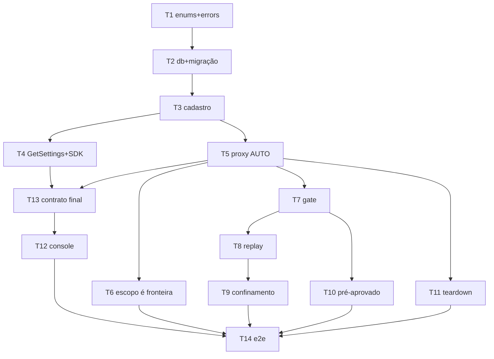

# MCPs de terceiros — Implementation Plan

> **For agentic workers:** Execute via `/build`. Steps use checkbox (`- [ ]`) syntax for tracking.
> Each Task wraps one observable behavior in an outer RED→GREEN cycle.

**Goal:** O dono cadastra servidores MCP na máquina e os agentes do CODM operam com essas ferramentas
além das nossas, com o produto no caminho de toda chamada sensível.

**Architecture:** O daemon já É um servidor MCP (`agent/mcp/door.ts`, ferramentas geradas da OpenAPI).
Este plano o torna também *cliente*: um `McpUpstreamRegistry` conecta nos servidores cadastrados e a
porta reexporta as ferramentas deles como `<key>__<tool>` — apenas no escopo `issue-handling`, que é a
fronteira real. Chamadas a servidores marcados `ASK` não executam: persistem um `McpToolApproval`
PENDING, levantam `APPROVAL_NEEDED` pela máquina de stop que já existe, e só passam no turno seguinte
depois do APPROVE.

**Tech Stack:** TypeScript, Bun, Drizzle/LibSQL, tsyringe-neo, TanStack Router/Query, Zod, TypeSpec

**Spec:** .specs/2026-09-02-mcps-de-terceiros-design.md
**Tasks:** 14
**Estimated minutes:** 720

---

## Wave Plan

**Feature Type:** 1 — novo agregado + controllers + frontend, atravessando `contracts`, `agent`,
`thread` (via integration event), `ui` e `app/react`.
**Phases in scope:** 0, 1, 2
**Critical path length:** 7

### Phase 0 — Contract Lock (serial)

| # | Task | Kind | Classification |
|---|------|------|----------------|
| 0.1 | T1 — enums wire + errors | enum, errors | serial |
| 0.2 | T2 — tabelas + migração + espelho Go | db-modelling, migrate | serial |
| 0.3 | T3 — cadastro end-to-end | entity, repository, usecase, controller | serial |
| 0.4 | T4 — `GetSettings.mcpServers` + SDK regen | query, sdk | serial |

**Desvio consciente do playbook:** os controllers de 0.3 nascem ligados ao use case real, sem etapa
de resposta mockada. O slice é pequeno, o mock só existiria para ser removido, e o contrato ainda
congela antes do fan-out — que é o que 0.4 faz.

### Phase 1 — Behavior Slices (paralelas)

| # | Task | Lane | Start condition |
|---|------|------|-----------------|
| W1.1 | T5 — ferramenta `AUTO` executa via proxy | backend | after T3 |
| W1.2 | T6 — escopo é a fronteira (AC-6, isolado) | backend | after T5 |
| W1.3 | T7 — gate recusa e levanta `APPROVAL_NEEDED` | backend | after T5 |
| W1.4 | T8 — APPROVE/DENY → replay no turno seguinte | backend | after T7 |
| W1.5 | T9 — confinamento entre runs (AC-12, isolado) | backend | after T8 |
| W1.6 | T10 — pré-aprovado global + política efetiva | backend | after T7 |
| W1.7 | T11 — teardown dos processos upstream (AC-13, isolado) | backend | after T5 |
| W1.8 | T13 — Contract Lock final: ferramentas no DTO + SDK | backend | after T4 e T5 |
| W1.9 | T12 — console: seção completa + form discriminado | frontend | after T13 |

O console é construído UMA vez, contra um contrato já fechado — por isso T13 (que fecha o contrato)
vem antes de T12, e não depois. Os Tasks de invariante (T6, T9, T10, T11) rodam em paralelo com essa
linha e só precisam estar verdes antes do e2e.

### Phase 2 — Integration + QA (serial)

| # | Task | Classification |
|---|------|----------------|
| 2.1 | T14 — E2E cobrindo os ACs | serial |

Review de código agregado não é Task: `/build` roda `code-reviewer` uma vez no fim.

### Critical Path

```
T1 → T2 → T3 → T4 → T13 → T12 → T14
```

### Dependency Graph



---

## Task T1: Vocabulário de MCP existe no contrato e os erros têm status

**Files to write:**
- Create: `packages/contracts/src/wire/enums/mcp-transport.tsp`
- Create: `packages/contracts/src/wire/enums/mcp-approval-policy.tsp`
- Create: `packages/contracts/src/wire/enums/mcp-approval-decision.tsp`
- Modify: `packages/contracts/src/wire/main.tsp` — importa os três `.tsp` (enum não é auto-descoberto)
- Modify: `packages/api/typescript/src/agent/errors/index.ts` — adiciona os códigos às uniões E registra os status no `registerErrorCodes` que já existe no pé do arquivo
- Modify: `packages/app/react/src/locales/en.json` — chaves de erro
- Modify: `packages/app/react/src/locales/pt.json` — chaves de erro

**Files to read:**
- `packages/contracts/src/wire/enums/stop-kind.tsp`

**Agent:** backend-developer
**Reviewer:** spec-compliance-reviewer → code-reviewer
**Model:** sonnet
**Skills:** /enum, /errors
**Depends on:** (none)
**Consumes (frozen):** (none — esta Task É o congelamento)
**Scope fence:** LEFT — os três enums wire, os 3 códigos de erro, o mapa de status, as chaves i18n.
OUT — tabelas (T2), entidades (T3), qualquer consumo dos enums (T3+).
**Gate:** `bun contracts && bun tsc`

### Step T1.1 — Enum de transporte

```
// packages/contracts/src/wire/enums/mcp-transport.tsp
namespace TemplateContracts;

@doc("Como o daemon fala com um servidor MCP de terceiro. STDIO spawna um processo filho e conversa por stdin/stdout; HTTP abre uma conexão para uma URL. A escolha é do servidor cadastrado, não da máquina.")
enum McpTransport {
  STDIO: "STDIO",
  HTTP: "HTTP",
}
```

### Step T1.2 — Enum de política de aprovação

```
// packages/contracts/src/wire/enums/mcp-approval-policy.tsp
namespace TemplateContracts;

@doc("O que o proxy faz ao encaminhar uma ferramenta deste servidor. AUTO executa direto; ASK recusa a chamada e levanta um stop APPROVAL_NEEDED para o dono decidir. A política efetiva também depende de StopPolicy.approvalNeeded do dono — ver agent/mcp/approvalPolicy.ts.")
enum McpApprovalPolicy {
  AUTO: "AUTO",
  ASK: "ASK",
}
```

### Step T1.3 — Enum da decisão de aprovação

```
// packages/contracts/src/wire/enums/mcp-approval-decision.tsp
namespace TemplateContracts;

@doc("Como o dono respondeu um pedido de aprovação de ferramenta MCP externa. A ausência do valor na linha significa PENDENTE — esse estado não tem membro, porque 'ainda não decidiu' não é uma decisão.")
enum McpApprovalDecision {
  APPROVED: "APPROVED",
  DENIED: "DENIED",
}
```

É enum de CONTRATO, e não um objeto local no agregado, porque `enumCheck` — o helper que emite o
`CHECK (col IN (…))` do SQLite — promete no próprio docblock que o value-set vem sempre de
`Object.values(<wire enum>)`, *"so the CHECK can never drift from the frozen contract"*. Passar um
array literal ali seria redeclarar o conjunto num segundo lugar, que é exatamente o que o helper
existe para impedir.

### Step T1.4 — Códigos de erro

Modify `packages/api/typescript/src/agent/errors/index.ts`:

- em `AgentDomainErrors`, adicionar `'MCP_SERVER_TRANSPORT_INCOMPLETE'` (o transporte declarado não
  trouxe o campo que ele exige — nomeado aqui porque é o `.refine()` do schema da entidade que o
  levanta, à moda de `Owner`) e o membro `'MCP_APPROVAL_ALREADY_SETTLED'` com comentário: uma
  decisão de aprovação já respondida não reabre — invariante de `McpToolApproval`.
- em `AgentApplicationErrors`, adicionar `'MCP_SERVER_KEY_CONFLICT'` e `'MCP_SERVER_NOT_FOUND'`.
- em `AgentInterfaceErrors`, adicionar `'MCP_TOOL_APPROVAL_REQUIRED'` com comentário: a ferramenta
  externa exige aprovação do dono; a chamada não executou e um stop foi levantado.

### Step T1.5 — Status HTTP

**NÃO toque no `GlobalErrorMapper`.** Ele vive em `packages/api/typescript/core/src/utils/`, e o
próprio docblock manda o contrário: *"Adding a new context-specific code = touch the context's
`errors/index.ts`, NOT this file. Core stays untouched."* O mecanismo real é a chamada
`registerErrorCodes({...})` que já existe no pé de `agent/errors/index.ts` — a mesma por onde
`AGENT_RUN_TOKEN_INVALID` e `AGENT_RUN_SCOPE_MISMATCH` já passam.

Modify `packages/api/typescript/src/agent/errors/index.ts`: acrescentar ao `registerErrorCodes`
existente `MCP_SERVER_KEY_CONFLICT: HttpStatusCode.CONFLICT`,
`MCP_SERVER_NOT_FOUND: HttpStatusCode.NOT_FOUND`,
`MCP_SERVER_TRANSPORT_INCOMPLETE: HttpStatusCode.UNPROCESSABLE_ENTITY`,
`MCP_APPROVAL_ALREADY_SETTLED: HttpStatusCode.CONFLICT` e
`MCP_TOOL_APPROVAL_REQUIRED: HttpStatusCode.FORBIDDEN`.

### Step T1.5b — Registrar os `.tsp` no `main.tsp`

Modify `packages/contracts/src/wire/main.tsp`: adicionar `import "./enums/mcp-transport.tsp";`,
`import "./enums/mcp-approval-policy.tsp";` e `import "./enums/mcp-approval-decision.tsp";` junto dos
demais. Nenhum enum deste pacote é auto-descoberto — `stop-kind.tsp` está lá pela mesma razão, e sem
esses imports o `bun contracts` não emite binding nenhum.

### Step T1.6 — Traduções

Modify `packages/app/react/src/locales/en.json` e `pt.json`: sob a chave de erros já existente,
adicionar os 5 códigos — todo erro carrega código + status + chave i18n, sem exceção. EN: `"MCP_SERVER_KEY_CONFLICT": "An MCP server with this key already exists."`,
`"MCP_SERVER_NOT_FOUND": "MCP server not found."`,
`"MCP_APPROVAL_ALREADY_SETTLED": "This approval was already answered."`,
`"MCP_TOOL_APPROVAL_REQUIRED": "This tool needs your approval before it can run."`. PT: as
equivalentes.

### Step T1.7 — Regenerar bindings

Run: `bun contracts`
Expected: `packages/contracts/generated/typescript/src/wire/enums/mcp-transport.ts` e
`mcp-approval-policy.ts` e `mcp-approval-decision.ts` criados; `cargo check` do crate rust verde.

### Step T1.8 — Type check

Run: `bun tsc`
Expected: 0 erros.

### Step T1.9 — Commit

```bash
git add packages/contracts/src/wire/enums/mcp-transport.tsp \
        packages/contracts/src/wire/enums/mcp-approval-policy.tsp \
        packages/contracts/src/wire/enums/mcp-approval-decision.tsp \
        packages/contracts/generated/ \
        packages/api/typescript/src/agent/errors/index.ts \
        packages/api/typescript/src/shared/utils/GlobalErrorMapper.ts \
        packages/app/react/src/locales/en.json \
        packages/app/react/src/locales/pt.json
git commit -m "feat(contracts): freeze the MCP transport and approval-policy vocabulary (Task T1)"
```

---

## Task T2: O registro de servidores e as decisões de aprovação têm onde morar

**Files to write:**
- Modify: `packages/contracts/src/db/sqlite/agent.ts` — adiciona `mcpServers` e `mcpToolApprovals`
- Create: `packages/contracts/src/db/sqlite/migrations/<gerado>.sql`

**Files to read:**
- `packages/contracts/src/db/sqlite/agent.ts`

**Agent:** database-architect
**Reviewer:** spec-compliance-reviewer → code-reviewer
**Model:** sonnet
**Skills:** /db-modelling, /migrate
**Depends on:** T1
**Consumes (frozen):** `McpTransport`, `McpApprovalPolicy` de
`packages/contracts/generated/typescript/src/wire/enums` — importados no schema Drizzle exatamente
como `agent.ts` já importa `ProviderKind` e `AgentModelId`.
**Scope fence:** DONE — os dois enums (T1), não redeclarar. LEFT — as duas tabelas, os índices, a
migração e o espelho Go. OUT — entidades e repositórios (T3).
**Gate:** `bun migrate:dev && bun run --cwd packages/contracts db:check-go && bun tsc`

### Step T2.1 — Tabelas

Modify `packages/contracts/src/db/sqlite/agent.ts`: adicionar `McpApprovalDecision`, `McpApprovalPolicy` e `McpTransport` ao
import de `../../../generated/typescript/src/wire/enums`, e ao fim do arquivo as duas tabelas abaixo.

```typescript
/**
 * `agent_mcp_servers` — os servidores MCP de terceiros que o dono registrou nesta máquina.
 *
 * Agregado FINO, na mesma forma que `workspace` (uma pasta que o operador registrou): a única
 * invariante com dentes é unicidade, e ela é do banco. `key` não é decoração — é o namespace das
 * ferramentas deste servidor dentro da NOSSA porta (`<key>__<tool>`, que chega ao CLI como
 * `mcp__codm__<key>__<tool>`), então uma colisão de key é uma colisão de nome de ferramenta.
 *
 * As credenciais moram AQUI, não no keychain. Este mesmo arquivo SQLite já carrega as tabelas
 * `whatsmeow_*` com a sessão do WhatsApp, então material de credencial já reside nele; um keychain só
 * para MCP criaria um segundo domicílio de segredo e exigiria o daemon (Bun) falar com o keychain,
 * coisa que hoje só o shell Tauri faz.
 *
 * `command`/`args`/`env` são do transporte STDIO; `url`/`headers` são do HTTP. Nenhum é NOT NULL
 * porque a obrigatoriedade é POR TRANSPORTE — a invariante vive no schema Zod da entidade, que é uma
 * união discriminada, e não numa constraint que só saberia expressar metade dela.
 */
export const mcpServers = sqliteTable(
	'agent_mcp_servers',
	{
		id: text('id').primaryKey(),
		ownerId: text('owner_id').notNull(),
		/** Namespace das ferramentas deste servidor. Único por dono — ver o índice abaixo. */
		key: text('key').notNull(),
		transport: text('transport').$type<McpTransport>().notNull(),

		// STDIO
		command: text('command'),
		/** JSON array de strings. */
		args: text('args', { mode: 'json' }).$type<string[]>(),
		/** JSON object — CARREGA SEGREDO (tokens de API dos servidores de terceiros). */
		env: text('env', { mode: 'json' }).$type<Record<string, string>>(),

		// HTTP
		url: text('url'),
		/** JSON object — CARREGA SEGREDO (Authorization dos servidores de terceiros). */
		headers: text('headers', { mode: 'json' }).$type<Record<string, string>>(),

		enabled: integer('enabled', { mode: 'boolean' }).notNull().default(true),
		approvalPolicy: text('approval_policy').$type<McpApprovalPolicy>().notNull().default(McpApprovalPolicy.ASK),
		/**
		 * Override POR FERRAMENTA da política acima. Medido contra o `browser-use`, que publica no
		 * MESMO servidor ações granulares (`browser_click`, `browser_navigate`) e uma autônoma,
		 * `retry_with_browser_use_agent` — "run a complete browser automation task with an AI agent".
		 * Sem override o dono escolheria entre inutilizável (`ASK` a cada clique) e inseguro (`AUTO`
		 * liberando junto uma sessão inteira dirigida por outro modelo).
		 *
		 * Mapa e não tabela: a chave é o nome da ferramenta NAQUELE servidor, não tem identidade
		 * própria, não tem ciclo de vida próprio e só é lida junto do servidor. Uma tabela daria uma
		 * junção por chamada em troca de nada.
		 */
		toolPolicies: text('tool_policies', { mode: 'json' }).$type<Record<string, McpApprovalPolicy>>(),

		addedAt: integer('added_at', { mode: 'timestamp_ms' })
			.notNull()
			.$defaultFn(() => new Date()),
		createdAt: integer('created_at', { mode: 'timestamp_ms' })
			.notNull()
			.$defaultFn(() => new Date()),
		updatedAt: integer('updated_at', { mode: 'timestamp_ms' })
			.notNull()
			.$defaultFn(() => new Date()),
		version: integer('version').notNull().default(1),
	},
	t => [
		enumCheck('agent_mcp_servers_transport_check', t.transport, Object.values(McpTransport)),
		enumCheck('agent_mcp_servers_policy_check', t.approvalPolicy, Object.values(McpApprovalPolicy)),
		// A unicidade que a entidade NÃO consegue garantir sozinha: duas requisições concorrentes
		// passam pela checagem do use case e só o banco recusa a segunda.
		uniqueIndex('agent_mcp_servers_owner_key_unq').on(t.ownerId, t.key),
		index('agent_mcp_servers_owner_idx').on(t.ownerId),
	],
)

/**
 * `agent_mcp_tool_approvals` — uma decisão do dono sobre UMA chamada de ferramenta externa.
 *
 * Não é log: tem transição de estado dirigida por humano (PENDING → APPROVED | DENIED) e a invariante
 * de não reabrir decisão. É também o que torna o replay decidível — o proxy insere PENDING carregando
 * o `stopId` que levantou, o handler faz o flip POR `stopId` quando o stop é resolvido, e a chamada
 * repetida no turno seguinte procura por `(issueId, callHash)`.
 *
 * `callHash` é hash canônico de `(serverKey, toolName, argumentos serializados com chaves ordenadas)`.
 * Sem canonicalização, "a mesma chamada" não é decidível: um espaço a mais viraria outra chamada.
 *
 * `issueId` NOT NULL é a decisão 14 do spec tornada estrutural — ferramentas upstream existem só no
 * escopo `issue-handling`, logo todo run que chega aqui é confinado a uma issue. É também o que faz o
 * confinamento da decisão 8 ser uma cláusula de WHERE em vez de uma regra que alguém precisa lembrar.
 */
export const mcpToolApprovals = sqliteTable(
	'agent_mcp_tool_approvals',
	{
		id: text('id').primaryKey(),
		ownerId: text('owner_id').notNull(),
		issueId: text('issue_id').notNull(),
		threadId: text('thread_id').notNull(),

		serverKey: text('server_key').notNull(),
		toolName: text('tool_name').notNull(),
		/** Hash canônico de (serverKey, toolName, args). Ver o docblock. */
		callHash: text('call_hash').notNull(),
		/** Argumentos verbatim, só para o dono LER no card Needs-you. Nunca para casar chamada. */
		callArguments: text('call_arguments', { mode: 'json' }).$type<Record<string, unknown>>().notNull(),

		/** PENDING enquanto NULL; APPROVED/DENIED quando o stop é resolvido. */
		decision: text('decision').$type<McpApprovalDecision>(),
		/** O stop que carrega a pergunta. É por ele que o handler encontra esta linha. */
		stopId: text('stop_id').notNull(),

		requestedAt: integer('requested_at', { mode: 'timestamp_ms' })
			.notNull()
			.$defaultFn(() => new Date()),
		settledAt: integer('settled_at', { mode: 'timestamp_ms' }),
		createdAt: integer('created_at', { mode: 'timestamp_ms' })
			.notNull()
			.$defaultFn(() => new Date()),
		updatedAt: integer('updated_at', { mode: 'timestamp_ms' })
			.notNull()
			.$defaultFn(() => new Date()),
		version: integer('version').notNull().default(1),
	},
	t => [
		// NULL passa: `NULL IN (…)` avalia NULL, e um CHECK do SQLite só reprova em FALSE — que é o
		// que mantém a linha PENDENTE (decision NULL) legal. Os valores vêm do wire enum e nunca de um
		// array literal, porque é isso que `enumCheck` promete no próprio docblock.
		enumCheck('agent_mcp_tool_approvals_decision_check', t.decision, Object.values(McpApprovalDecision)),
		// O lookup do replay: "esta chamada, nesta issue, já foi aprovada?"
		index('agent_mcp_tool_approvals_lookup_idx').on(t.issueId, t.callHash),
		// O lookup do handler quando o stop é resolvido.
		uniqueIndex('agent_mcp_tool_approvals_stop_unq').on(t.stopId),
	],
)
```

### Step T2.2 — Gerar a migração

Run: `bun migrate:create`
Expected: um novo `.sql` em `packages/contracts/src/db/sqlite/migrations` com `CREATE TABLE
agent_mcp_servers`, `CREATE TABLE agent_mcp_tool_approvals` e os 4 índices.

### Step T2.3 — Aplicar e espelhar no Go

```bash
bun migrate:dev
bun run --cwd packages/contracts db:sync-go
bun run --cwd packages/contracts db:check-go
```
Expected: migração aplicada; `db:check-go` sai 0 (as duas cópias byte-a-byte iguais).

### Step T2.4 — Type check

Run: `bun tsc`
Expected: 0 erros.

### Step T2.5 — Commit

```bash
git add packages/contracts/src/db/sqlite/agent.ts \
        packages/contracts/src/db/sqlite/migrations/ \
        packages/api/go/
git commit -m "feat(sqlite): register MCP servers and their approval decisions (Task T2)"
```

---

## Task T3: O dono cadastra, edita e remove um servidor MCP

**Files to write:**
- Create: `packages/api/typescript/src/agent/entities/McpServer.ts`
- Create: `packages/api/typescript/src/agent/entities/McpServer.test.ts`
- Create: `packages/api/typescript/src/agent/repositories/McpServerRepository/McpServerRepository.ts`
- Create: `packages/api/typescript/src/agent/repositories/McpServerRepository/LibSqlMcpServerRepository.ts`
- Create: `packages/api/typescript/src/agent/repositories/McpServerRepository/MockMcpServerRepository.ts`
- Create: `packages/api/typescript/src/agent/repositories/McpServerRepository/index.ts`
- Create: `packages/api/typescript/src/agent/repositories/McpServerRepository/LibSqlMcpServerRepository.test.ts`
- Create: `packages/api/typescript/src/agent/usecases/RegisterMcpServer.ts`
- Create: `packages/api/typescript/src/agent/usecases/UpdateMcpServer.ts`
- Create: `packages/api/typescript/src/agent/usecases/RemoveMcpServer.ts`
- Create: `packages/api/typescript/src/agent/usecases/McpServerLifecycle.test.ts`
- Create: `packages/api/typescript/src/agent/controllers/RegisterMcpServer.ts`
- Create: `packages/api/typescript/src/agent/controllers/UpdateMcpServer.ts`
- Create: `packages/api/typescript/src/agent/controllers/RemoveMcpServer.ts`
- Modify: `packages/api/typescript/src/agent/controllers/index.ts` — exporta os 3 controllers
- Modify: `packages/api/typescript/src/agent/registry.ts` — binda `McpServerRepository`

**Files to read:**
- `packages/api/typescript/src/workspace/entities/Workspace.ts`
- `packages/api/typescript/src/agent/repositories/AgentSessionRepository/LibSqlAgentSessionRepository.ts`

**Agent:** backend-developer
**Reviewer:** spec-compliance-reviewer → code-reviewer
**Model:** sonnet
**Skills:** /entity, /repository, /usecase, /controller, /schema, /test
**Depends on:** T2
**Consumes (frozen):** `McpTransport`, `McpApprovalPolicy` de `@codm/contracts-typescript/wire/enums`;
`mcpServers` de `@codm/contracts/db`; os códigos `MCP_SERVER_KEY_CONFLICT` e `MCP_SERVER_NOT_FOUND`
de `agent/errors`.
**Scope fence:** DONE — enums (T1) e tabelas (T2): consumir, nunca redeclarar. LEFT — entidade
`McpServer`, repositório nas 3 implementações, 3 use cases, 3 controllers, bindings. OUT —
`McpToolApproval` (T7), o proxy (T5), a leitura de settings (T4), o console (T12).
**Gate:** `cd packages/api/typescript && bun test src/agent/entities/McpServer.test.ts src/agent/usecases/McpServerLifecycle.test.ts src/agent/repositories/McpServerRepository && bun x tsc -p tsconfig.build.json --noEmit`

### Step T3.1 — Teste que falha: a entidade recusa configuração impossível

```typescript
// packages/api/typescript/src/agent/entities/McpServer.test.ts
import { describe, it, expect } from 'bun:test'
import { McpTransport, McpApprovalPolicy } from '@codm/contracts-typescript/wire/enums'
import { McpServer } from './McpServer'

describe('McpServer', () => {
	const stdio = {
		ownerId: '019e4d24-6524-7041-9e1c-8108180cdd01',
		key: 'playwright',
		transport: McpTransport.STDIO,
		command: 'npx',
		args: ['-y', '@playwright/mcp'],
	}

	it('nasce ASK — o padrão é perguntar, não executar', () => {
		const server = McpServer.create(stdio)
		expect(server.approvalPolicy).toBe(McpApprovalPolicy.ASK)
		expect(server.enabled).toBe(true)
	})

	it('recusa STDIO sem command', () => {
		expect(() => McpServer.create({ ...stdio, command: undefined })).toThrow()
	})

	it('recusa HTTP sem url', () => {
		expect(() => McpServer.create({ ownerId: stdio.ownerId, key: 'notion', transport: McpTransport.HTTP })).toThrow()
	})

	it('recusa key que não serve de namespace de ferramenta', () => {
		expect(() => McpServer.create({ ...stdio, key: 'play wright' })).toThrow()
		expect(() => McpServer.create({ ...stdio, key: 'play__wright' })).toThrow()
	})

	it('liga, desliga e troca de política sem recriar', () => {
		const server = McpServer.create(stdio)
		server.disable()
		expect(server.enabled).toBe(false)
		server.enable()
		expect(server.enabled).toBe(true)
		server.setApprovalPolicy(McpApprovalPolicy.AUTO)
		expect(server.approvalPolicy).toBe(McpApprovalPolicy.AUTO)
	})
})
```

### Step T3.2 — Rodar e ver falhar

Run: `cd packages/api/typescript && bun test src/agent/entities/McpServer.test.ts`
Expected: FAIL com `Cannot find module './McpServer'`.

### Step T3.3 — Scaffold

```bash
bun cli entity agent McpServer --aggregate
bun cli repository agent McpServer
```

### Step T3.4 — Proposed file (o executor escreve por cima do scaffold)

Create: `packages/api/typescript/src/agent/entities/McpServer.ts`

```typescript
// packages/api/typescript/src/agent/entities/McpServer.ts — arquivo final COMPLETO
import { AggregateRoot, z } from '@codm/core-typescript'
import type Z from 'zod'
import { McpApprovalPolicy, McpTransport } from '@codm/contracts-typescript/wire/enums'
import type { DomainErrors } from '../errors'

/**
 * A `key` é o NAMESPACE das ferramentas deste servidor dentro da nossa porta: uma ferramenta upstream
 * é registrada como `<key>__<tool>` e chega ao CLI como `mcp__codm__<key>__<tool>`. Por isso o formato
 * é invariante de domínio e não cosmética — uma key contendo `__` produziria um nome de fio ambíguo
 * (não dá para saber onde termina a key e começa a ferramenta), e uma com espaço produziria um nome
 * que o cliente MCP não consegue chamar.
 */
export const MCP_SERVER_KEY_PATTERN = /^[a-z][a-z0-9-]{0,31}$/

/**
 * `McpServer` — um servidor MCP de terceiro que o operador registrou nesta máquina.
 *
 * Agregado FINO, na forma de `Workspace`: as invariantes são o formato da key e a coerência do
 * transporte; a UNICIDADE da key é do banco (índice) mais a checagem em `RegisterMcpServer`, porque
 * duas requisições concorrentes passam por qualquer checagem feita só em memória.
 *
 * O schema é um objeto com `superRefine` e NÃO uma união discriminada, apesar de a obrigatoriedade dos
 * campos ser por transporte. Motivo: `AggregateRoot` é parametrizado por um ZodObject (precisa de
 * `.extend`/`.pick` para compor id, version e timestamps), e uma união não oferece essa superfície. A
 * união vive onde ela precisa existir para o consumidor — o schema do CONTROLLER, que é o que vira a
 * SDK e o que o form do console valida contra. Aqui a mesma regra é invariante checada, não forma.
 */
export const McpServerSchema = z
	.object({
		ownerId: z.uuid(),
		key: z.string().regex(MCP_SERVER_KEY_PATTERN),
		transport: z.enum(McpTransport),

		command: z.string().trim().min(1).optional(),
		args: z.array(z.string()).optional(),
		env: z.record(z.string(), z.string()).optional(),

		url: z.url().optional(),
		headers: z.record(z.string(), z.string()).optional(),

		enabled: z.boolean(),
		approvalPolicy: z.enum(McpApprovalPolicy),
		/** Override por ferramenta; ausente = vale a do servidor. Ver `mcp/approvalPolicy.ts`. */
		toolPolicies: z.record(z.string(), z.enum(McpApprovalPolicy)).optional(),
		addedAt: z.date(),
	})
	// Um erro NOMEADO em vez de uma mensagem solta, à moda de `Owner`
	// (`.regex(…, { error: 'INVALID_TIMEZONE' as DomainErrors })`): é o código que o frontend traduz e
	// o que um teste assere, e é o que faz `this.validate()` levantar a coisa certa.
	.refine(v => v.transport !== McpTransport.STDIO || Boolean(v.command), {
		error: 'MCP_SERVER_TRANSPORT_INCOMPLETE' as DomainErrors,
		path: ['command'],
	})
	.refine(v => v.transport !== McpTransport.HTTP || Boolean(v.url), {
		error: 'MCP_SERVER_TRANSPORT_INCOMPLETE' as DomainErrors,
		path: ['url'],
	})

export type McpServerProps = Z.infer<typeof McpServerSchema>

export class McpServer extends AggregateRoot<typeof McpServerSchema> {
	static override schema = McpServerSchema

	static create(data: {
		ownerId: string
		key: string
		transport: McpTransport
		command?: string
		args?: string[]
		env?: Record<string, string>
		url?: string
		headers?: Record<string, string>
		approvalPolicy?: McpApprovalPolicy
	}): McpServer {
		return new McpServer({
			ownerId: data.ownerId,
			key: data.key,
			transport: data.transport,
			command: data.command,
			args: data.args,
			env: data.env,
			url: data.url,
			headers: data.headers,
			enabled: true,
			// ASK por padrão. Um servidor recém-cadastrado é exatamente aquele sobre o qual o dono
			// ainda não formou opinião — e o raio de ação inclui shell e filesystem.
			approvalPolicy: data.approvalPolicy ?? McpApprovalPolicy.ASK,
			addedAt: new Date(),
		})
	}

	enable(): void {
		this.enabled = true
		this.validate()
	}

	disable(): void {
		this.enabled = false
		this.validate()
	}

	setApprovalPolicy(policy: McpApprovalPolicy): void {
		this.approvalPolicy = policy
		this.validate()
	}

	/**
	 * Override por ferramenta. `undefined` REMOVE o override em vez de gravar um valor — "voltar a
	 * seguir o servidor" precisa ser expressável, senão a única saída seria adivinhar qual valor
	 * coincide com a política atual, e ela muda.
	 */
	setToolPolicy(toolName: string, policy: McpApprovalPolicy | undefined): void {
		const next = { ...(this.toolPolicies ?? {}) }
		if (policy) next[toolName] = policy
		// `Reflect.deleteProperty` e não `delete next[x]`: o lint roda com --max-warnings 0 e
		// `no-dynamic-delete` reprova a segunda forma. Comportamento idêntico.
		else Reflect.deleteProperty(next, toolName)
		this.toolPolicies = Object.keys(next).length > 0 ? next : undefined
		this.validate()
	}

	/**
	 * Reconfigura o transporte INTEIRO de uma vez. Não há setter por campo porque `command` sem
	 * `transport` é uma combinação que o schema recusa — trocar meio transporte é um estado que não
	 * deve ser representável nem por um instante.
	 */
	reconfigure(config: {
		transport: McpTransport
		command?: string
		args?: string[]
		env?: Record<string, string>
		url?: string
		headers?: Record<string, string>
	}): void {
		this.transport = config.transport
		this.command = config.command
		this.args = config.args
		this.env = config.env
		this.url = config.url
		this.headers = config.headers
		// Muta e valida — o mesmo par de `AgentSession.recordTurn`. Um `safeParse` manual aqui
		// reimplementaria, pior, o que a base já faz: `validate()` roda o schema da entidade e levanta o
		// erro que o `.refine()` nomeou.
		this.validate()
	}
}

export interface McpServer extends McpServerProps {}
```

### Step T3.5 — Rodar e ver passar

Run: `cd packages/api/typescript && bun test src/agent/entities/McpServer.test.ts`
Expected: PASS — 5 testes.

### Step T3.6 — Repositório: contrato

Create: `packages/api/typescript/src/agent/repositories/McpServerRepository/McpServerRepository.ts`

```typescript
// packages/api/typescript/src/agent/repositories/McpServerRepository/McpServerRepository.ts — arquivo final COMPLETO
import { Repository } from '@codm/core-typescript'
import type { Transaction } from '@codm/core-typescript'
import type { McpServer } from '../../entities/McpServer'

/**
 * `save()` e `delete()` vêm da base. O que este contrato acrescenta são as três leituras que o produto
 * realmente faz: por id, por (dono, key) — a checagem de colisão do `RegisterMcpServer` e o lookup do
 * proxy — e DUAS listagens por dono — a tela de settings
 * quer todos, o proxy quer só os habilitados. Dois métodos e não um parâmetro de opções: a forma irmã
 * neste repo é `listByOwner(ownerId, tx?)` (`WorkspaceRepository`, `ThreadRepository`), e um objeto de
 * opções no meio quebraria a posição do `tx` que todas as outras portas mantêm.
 */
export abstract class McpServerRepository extends Repository<McpServer> {
	abstract findById(id: string, tx?: Transaction): Promise<McpServer | undefined>
	abstract findByKey(ownerId: string, key: string, tx?: Transaction): Promise<McpServer | undefined>
	abstract listByOwner(ownerId: string, tx?: Transaction): Promise<McpServer[]>
	abstract listEnabledByOwner(ownerId: string, tx?: Transaction): Promise<McpServer[]>
}
```

### Step T3.7 — Repositório: implementação LibSQL

Create: `packages/api/typescript/src/agent/repositories/McpServerRepository/LibSqlMcpServerRepository.ts`

```typescript
// packages/api/typescript/src/agent/repositories/McpServerRepository/LibSqlMcpServerRepository.ts — arquivo final COMPLETO
import { injectable } from 'tsyringe-neo'
import { and, eq, type SQL } from 'drizzle-orm'
import { LibSqlDatabaseDriver, LibSqlTransaction, tryCatchAsync } from '@codm/core-typescript'
import { mcpServers } from '@codm/contracts/db'
import { McpServer } from '../../entities/McpServer'
import { McpServerRepository } from './McpServerRepository'

type McpServerRow = typeof mcpServers.$inferSelect

@injectable()
export class LibSqlMcpServerRepository extends McpServerRepository {
	constructor(private driver: LibSqlDatabaseDriver) {
		super()
	}

	async findById(id: string, tx?: LibSqlTransaction): Promise<McpServer | undefined> {
		const dbc = tx ?? this.driver.db
		const result = await tryCatchAsync(async () => {
			const rows = await dbc.select().from(mcpServers).where(eq(mcpServers.id, id)).limit(1)
			return rows[0]
		})
		if (!result.success || !result.data) return undefined
		return this.toDomain(result.data)
	}

	async findByKey(ownerId: string, key: string, tx?: LibSqlTransaction): Promise<McpServer | undefined> {
		const dbc = tx ?? this.driver.db
		const result = await tryCatchAsync(async () => {
			const rows = await dbc
				.select()
				.from(mcpServers)
				.where(and(eq(mcpServers.ownerId, ownerId), eq(mcpServers.key, key)))
				.limit(1)
			return rows[0]
		})
		if (!result.success || !result.data) return undefined
		return this.toDomain(result.data)
	}

	async listByOwner(ownerId: string, tx?: LibSqlTransaction): Promise<McpServer[]> {
		return this.list(eq(mcpServers.ownerId, ownerId), tx)
	}

	async listEnabledByOwner(ownerId: string, tx?: LibSqlTransaction): Promise<McpServer[]> {
		return this.list(and(eq(mcpServers.ownerId, ownerId), eq(mcpServers.enabled, true)), tx)
	}

	async save(entity: McpServer, tx?: LibSqlTransaction): Promise<McpServer> {
		const dbc = tx ?? this.driver.db
		entity.incrementVersion()
		const data = this.toPersistence(entity)
		await dbc
			.insert(mcpServers)
			.values(data)
			// O `set` é CURADO, e não o objeto inteiro: `id`, `ownerId`, `key`, `addedAt` e `createdAt`
			// são o que a linha É, não o que ela vira. Reescrevê-los a cada save deixaria um bug de
			// identidade indistinguível de um update legítimo.
			.onConflictDoUpdate({
				target: mcpServers.id,
				set: {
					transport: data.transport,
					command: data.command,
					args: data.args,
					env: data.env,
					url: data.url,
					headers: data.headers,
					enabled: data.enabled,
					approvalPolicy: data.approvalPolicy,
					toolPolicies: data.toolPolicies,
					updatedAt: data.updatedAt,
					version: data.version,
				},
			})
		return entity
	}

	async delete(id: string, tx?: LibSqlTransaction): Promise<void> {
		const dbc = tx ?? this.driver.db
		await dbc.delete(mcpServers).where(eq(mcpServers.id, id))
	}

	private async list(where: SQL | undefined, tx?: LibSqlTransaction): Promise<McpServer[]> {
		const dbc = tx ?? this.driver.db
		const result = await tryCatchAsync(() => dbc.select().from(mcpServers).where(where))
		if (!result.success) return []
		return result.data.map(row => this.toDomain(row))
	}

	private toPersistence(entity: McpServer): typeof mcpServers.$inferInsert {
		return {
			id: entity.id.value,
			ownerId: entity.ownerId,
			key: entity.key,
			transport: entity.transport,
			command: entity.command ?? null,
			args: entity.args ?? null,
			env: entity.env ?? null,
			url: entity.url ?? null,
			headers: entity.headers ?? null,
			enabled: entity.enabled,
			approvalPolicy: entity.approvalPolicy,
			toolPolicies: entity.toolPolicies ?? null,
			addedAt: entity.addedAt,
			updatedAt: new Date(),
			version: entity.version,
		}
	}

	private toDomain(row: McpServerRow): McpServer {
		return new McpServer({
			id: row.id,
			ownerId: row.ownerId,
			key: row.key,
			transport: row.transport,
			command: row.command ?? undefined,
			args: row.args ?? undefined,
			env: row.env ?? undefined,
			url: row.url ?? undefined,
			headers: row.headers ?? undefined,
			enabled: row.enabled,
			approvalPolicy: row.approvalPolicy,
			toolPolicies: row.toolPolicies ?? undefined,
			addedAt: row.addedAt,
			version: row.version,
		})
	}
}
```

### Step T3.8 — Repositório: mock e barrel

Create: `packages/api/typescript/src/agent/repositories/McpServerRepository/MockMcpServerRepository.ts`

```typescript
// packages/api/typescript/src/agent/repositories/McpServerRepository/MockMcpServerRepository.ts — arquivo final COMPLETO
import { injectable } from 'tsyringe-neo'
import type { Transaction } from '@codm/core-typescript'
import type { McpServer } from '../../entities/McpServer'
import { McpServerRepository } from './McpServerRepository'

@injectable()
export class MockMcpServerRepository extends McpServerRepository {
	private readonly rows = new Map<string, McpServer>()

	async findById(id: string, _tx?: Transaction): Promise<McpServer | undefined> {
		return this.rows.get(id)
	}

	async findByKey(ownerId: string, key: string, _tx?: Transaction): Promise<McpServer | undefined> {
		return [...this.rows.values()].find(s => s.ownerId === ownerId && s.key === key)
	}

	async listByOwner(ownerId: string, _tx?: Transaction): Promise<McpServer[]> {
		return [...this.rows.values()].filter(s => s.ownerId === ownerId)
	}

	async listEnabledByOwner(ownerId: string, _tx?: Transaction): Promise<McpServer[]> {
		return [...this.rows.values()].filter(s => s.ownerId === ownerId && s.enabled)
	}

	async save(entity: McpServer, _tx?: Transaction): Promise<McpServer> {
		entity.incrementVersion()
		this.rows.set(entity.id.value, entity)
		return entity
	}

	async delete(id: string, _tx?: Transaction): Promise<void> {
		this.rows.delete(id)
	}
}
```

Create: `packages/api/typescript/src/agent/repositories/McpServerRepository/index.ts`

```typescript
// packages/api/typescript/src/agent/repositories/McpServerRepository/index.ts — arquivo final COMPLETO
export { McpServerRepository } from './McpServerRepository'
export { LibSqlMcpServerRepository } from './LibSqlMcpServerRepository'
export { MockMcpServerRepository } from './MockMcpServerRepository'
```

### Step T3.9 — Teste de repositório (integration)

```typescript
// packages/api/typescript/src/agent/repositories/McpServerRepository/LibSqlMcpServerRepository.test.ts
import { describe, it, expect, beforeAll, beforeEach, afterAll } from 'bun:test'
import { container, type DependencyContainer } from 'tsyringe-neo'
import { TestBed } from '@test/support'
import { McpTransport } from '@codm/contracts-typescript/wire/enums'
import { McpServer } from '../../entities/McpServer'
import { McpServerRepository } from './McpServerRepository'

describe('LibSqlMcpServerRepository', () => {
	let testBed: TestBed
	let testContainer: DependencyContainer
	let repo: McpServerRepository
	const ownerId = '019e4d24-6524-7041-9e1c-8108180cdd01'

	beforeAll(async () => {
		testContainer = container.createChildContainer()
		testBed = await TestBed.create('integration', { testContainer, ownerId })
		repo = testBed.resolve(McpServerRepository)
	})
	beforeEach(async () => {
		await testBed.reset()
	})
	afterAll(async () => {
		await testBed.destroy()
	})

	it('salva e reidrata um servidor STDIO com args e env', async () => {
		const server = McpServer.create({
			ownerId,
			key: 'playwright',
			transport: McpTransport.STDIO,
			command: 'npx',
			args: ['-y', '@playwright/mcp'],
			env: { TOKEN: 'abc' },
		})
		await repo.save(server)

		const loaded = await repo.findByKey(ownerId, 'playwright')
		expect(loaded?.command).toBe('npx')
		expect(loaded?.args).toEqual(['-y', '@playwright/mcp'])
		expect(loaded?.env).toEqual({ TOKEN: 'abc' })
	})

	it('lista só os habilitados quando pedido', async () => {
		const on = McpServer.create({ ownerId, key: 'on', transport: McpTransport.STDIO, command: 'a' })
		const off = McpServer.create({ ownerId, key: 'off', transport: McpTransport.STDIO, command: 'b' })
		off.disable()
		await repo.save(on)
		await repo.save(off)

		expect((await repo.listByOwner(ownerId)).length).toBe(2)
		expect((await repo.listEnabledByOwner(ownerId)).map(s => s.key)).toEqual(['on'])
	})

	it('o banco recusa a segunda key igual, mesmo que a checagem em memória passe', async () => {
		await repo.save(McpServer.create({ ownerId, key: 'dup', transport: McpTransport.STDIO, command: 'a' }))
		const twin = McpServer.create({ ownerId, key: 'dup', transport: McpTransport.STDIO, command: 'b' })
		await expect(repo.save(twin)).rejects.toThrow()
	})
})
```

### Step T3.10 — Use cases

```bash
bun cli usecase agent RegisterMcpServer
bun cli usecase agent UpdateMcpServer
bun cli usecase agent RemoveMcpServer
```

Create: `packages/api/typescript/src/agent/usecases/RegisterMcpServer.ts`

```typescript
// packages/api/typescript/src/agent/usecases/RegisterMcpServer.ts — arquivo final COMPLETO
import { injectable } from 'tsyringe-neo'
import { BaseError, Handler, z } from '@codm/core-typescript'
import type { Transaction } from '@codm/core-typescript'
import { McpApprovalPolicy, McpTransport } from '@codm/contracts-typescript/wire/enums'
import { McpServer } from '../entities/McpServer'
import { McpServerRepository } from '../repositories/McpServerRepository'
import type { AgentApplicationErrors } from '../errors'

export const RegisterMcpServerInputSchema = z.object({
	ownerId: z.uuid(),
	key: z.string(),
	transport: z.enum(McpTransport),
	command: z.string().optional(),
	args: z.array(z.string()).optional(),
	env: z.record(z.string(), z.string()).optional(),
	url: z.string().optional(),
	headers: z.record(z.string(), z.string()).optional(),
	approvalPolicy: z.enum(McpApprovalPolicy).optional(),
})
export const RegisterMcpServerOutputSchema = z.object({ mcpServerId: z.string() })

/**
 * A colisão de key é checada AQUI e indexada no banco. Não é redundância: a checagem produz o erro
 * NOMEADO que o console mostra, e o índice é o que resolve duas requisições concorrentes — nenhuma das
 * duas sozinha cobre o caso da outra.
 */
@injectable()
export class RegisterMcpServer extends Handler<typeof RegisterMcpServerInputSchema, typeof RegisterMcpServerOutputSchema> {
	readonly name = 'register_mcp_server' as const
	readonly inputSchema = RegisterMcpServerInputSchema
	readonly outputSchema = RegisterMcpServerOutputSchema

	constructor(private servers: McpServerRepository) {
		super()
	}

	protected async handle(input: this['input'], tx?: Transaction): Promise<this['output']> {
		const existing = await this.servers.findByKey(input.ownerId, input.key, tx)
		if (existing)
			throw new BaseError<AgentApplicationErrors>('MCP_SERVER_KEY_CONFLICT', `an MCP server with key "${input.key}" is already registered`)

		const server = McpServer.create(input)
		await this.withTransaction(tx, async tx => {
			await this.servers.save(server, tx)
		})
		return { mcpServerId: server.id.value }
	}
}
```

Create: `packages/api/typescript/src/agent/usecases/UpdateMcpServer.ts`

```typescript
// packages/api/typescript/src/agent/usecases/UpdateMcpServer.ts — arquivo final COMPLETO
import { injectable } from 'tsyringe-neo'
import { BaseError, Handler, z } from '@codm/core-typescript'
import type { Transaction } from '@codm/core-typescript'
import { McpApprovalPolicy, McpTransport } from '@codm/contracts-typescript/wire/enums'
import { McpServerRepository } from '../repositories/McpServerRepository'
import type { AgentApplicationErrors } from '../errors'

export const UpdateMcpServerInputSchema = z.object({
	ownerId: z.uuid(),
	mcpServerId: z.string(),
	enabled: z.boolean().optional(),
	approvalPolicy: z.enum(McpApprovalPolicy).optional(),
	/** `policy: null` remove o override; o campo ausente não mexe em override nenhum. */
	toolPolicy: z.object({ toolName: z.string(), policy: z.enum(McpApprovalPolicy).nullable() }).optional(),
	transport: z.enum(McpTransport).optional(),
	command: z.string().optional(),
	args: z.array(z.string()).optional(),
	env: z.record(z.string(), z.string()).optional(),
	url: z.string().optional(),
	headers: z.record(z.string(), z.string()).optional(),
})
export const UpdateMcpServerOutputSchema = z.void()

@injectable()
export class UpdateMcpServer extends Handler<typeof UpdateMcpServerInputSchema, typeof UpdateMcpServerOutputSchema> {
	readonly name = 'update_mcp_server' as const
	readonly inputSchema = UpdateMcpServerInputSchema
	readonly outputSchema = UpdateMcpServerOutputSchema

	constructor(private servers: McpServerRepository) {
		super()
	}

	protected async handle(input: this['input'], tx?: Transaction): Promise<this['output']> {
		const server = await this.servers.findById(input.mcpServerId, tx)
		if (!server || server.ownerId !== input.ownerId) throw new BaseError<AgentApplicationErrors>('MCP_SERVER_NOT_FOUND')

		if (input.enabled === true) server.enable()
		if (input.enabled === false) server.disable()
		if (input.approvalPolicy) server.setApprovalPolicy(input.approvalPolicy)
		// `toolPolicy: null` significa "remove o override e volta a seguir o servidor" — distinto de
		// ausente, que significa "não mexe".
		if (input.toolPolicy) server.setToolPolicy(input.toolPolicy.toolName, input.toolPolicy.policy ?? undefined)
		if (input.transport)
			server.reconfigure({
				transport: input.transport,
				command: input.command,
				args: input.args,
				env: input.env,
				url: input.url,
				headers: input.headers,
			})

		await this.withTransaction(tx, async tx => {
			await this.servers.save(server, tx)
		})
	}
}
```

Create: `packages/api/typescript/src/agent/usecases/RemoveMcpServer.ts`

```typescript
// packages/api/typescript/src/agent/usecases/RemoveMcpServer.ts — arquivo final COMPLETO
import { injectable } from 'tsyringe-neo'
import { BaseError, Handler, z } from '@codm/core-typescript'
import type { Transaction } from '@codm/core-typescript'
import { McpServerRepository } from '../repositories/McpServerRepository'
import type { AgentApplicationErrors } from '../errors'

export const RemoveMcpServerInputSchema = z.object({ ownerId: z.uuid(), mcpServerId: z.string() })
export const RemoveMcpServerOutputSchema = z.void()

@injectable()
export class RemoveMcpServer extends Handler<typeof RemoveMcpServerInputSchema, typeof RemoveMcpServerOutputSchema> {
	readonly name = 'remove_mcp_server' as const
	readonly inputSchema = RemoveMcpServerInputSchema
	readonly outputSchema = RemoveMcpServerOutputSchema

	constructor(private servers: McpServerRepository) {
		super()
	}

	protected async handle(input: this['input'], tx?: Transaction): Promise<this['output']> {
		const server = await this.servers.findById(input.mcpServerId, tx)
		if (!server || server.ownerId !== input.ownerId) throw new BaseError<AgentApplicationErrors>('MCP_SERVER_NOT_FOUND')

		await this.withTransaction(tx, async tx => {
			await this.servers.delete(server.id.value, tx)
		})
	}
}
```

### Step T3.11 — Teste de ciclo de vida (integration)

```typescript
// packages/api/typescript/src/agent/usecases/McpServerLifecycle.test.ts
import { describe, it, expect, beforeAll, beforeEach, afterAll } from 'bun:test'
import { container, type DependencyContainer } from 'tsyringe-neo'
import { TestBed } from '@test/support'
import { McpApprovalPolicy, McpTransport } from '@codm/contracts-typescript/wire/enums'
import { McpServerRepository } from '../repositories/McpServerRepository'
import { RegisterMcpServer } from './RegisterMcpServer'
import { UpdateMcpServer } from './UpdateMcpServer'
import { RemoveMcpServer } from './RemoveMcpServer'

describe('ciclo de vida de um servidor MCP', () => {
	let testBed: TestBed
	let testContainer: DependencyContainer
	const ownerId = '019e4d24-6524-7041-9e1c-8108180cdd01'
	const stdio = { transport: McpTransport.STDIO, command: 'npx', args: ['-y', '@playwright/mcp'] }

	beforeAll(async () => {
		testContainer = container.createChildContainer()
		testBed = await TestBed.create('integration', { testContainer, ownerId })
	})
	beforeEach(async () => {
		await testBed.reset()
	})
	afterAll(async () => {
		await testBed.destroy()
	})

	it('registra e devolve o id', async () => {
		const { mcpServerId } = await testBed.resolve(RegisterMcpServer).execute({ ownerId, key: 'playwright', ...stdio })
		const saved = await testBed.resolve(McpServerRepository).findById(mcpServerId)
		expect(saved?.key).toBe('playwright')
	})

	it('recusa key duplicada com MCP_SERVER_KEY_CONFLICT e não grava linha nova', async () => {
		const repo = testBed.resolve(McpServerRepository)
		await testBed.resolve(RegisterMcpServer).execute({ ownerId, key: 'dup', ...stdio })
		const before = (await repo.listByOwner(ownerId)).length

		await expect(testBed.resolve(RegisterMcpServer).execute({ ownerId, key: 'dup', ...stdio })).rejects.toMatchObject({
			name: 'MCP_SERVER_KEY_CONFLICT',
		})

		// A prova é a CONTAGEM de linhas, não a ausência de exceção.
		expect((await repo.listByOwner(ownerId)).length).toBe(before)
	})

	it('troca política e desabilita', async () => {
		const repo = testBed.resolve(McpServerRepository)
		const { mcpServerId } = await testBed.resolve(RegisterMcpServer).execute({ ownerId, key: 'shell', ...stdio })
		await testBed.resolve(UpdateMcpServer).execute({ ownerId, mcpServerId, enabled: false, approvalPolicy: McpApprovalPolicy.AUTO })

		const saved = await repo.findById(mcpServerId)
		expect(saved?.enabled).toBe(false)
		expect(saved?.approvalPolicy).toBe(McpApprovalPolicy.AUTO)
	})

	it('remove', async () => {
		const repo = testBed.resolve(McpServerRepository)
		const { mcpServerId } = await testBed.resolve(RegisterMcpServer).execute({ ownerId, key: 'gone', ...stdio })
		await testBed.resolve(RemoveMcpServer).execute({ ownerId, mcpServerId })
		expect(await repo.findById(mcpServerId)).toBeUndefined()
	})

	it('não deixa um dono mexer no servidor de outro', async () => {
		const { mcpServerId } = await testBed.resolve(RegisterMcpServer).execute({ ownerId, key: 'mine', ...stdio })
		const intruder = '019e4d24-6524-7041-9e1c-8108180cdd99'
		await expect(testBed.resolve(RemoveMcpServer).execute({ ownerId: intruder, mcpServerId })).rejects.toMatchObject({
			name: 'MCP_SERVER_NOT_FOUND',
		})
	})
})
```

### Step T3.12 — Controllers

```bash
bun cli controller agent RegisterMcpServer -m post -p /mcp-servers
bun cli controller agent UpdateMcpServer -m patch -p /mcp-servers/:mcpServerId
bun cli controller agent RemoveMcpServer -m delete -p /mcp-servers/:mcpServerId
```

Create: `packages/api/typescript/src/agent/controllers/RegisterMcpServer.ts`

```typescript
// packages/api/typescript/src/agent/controllers/RegisterMcpServer.ts — arquivo final COMPLETO
import { injectable } from 'tsyringe-neo'
import { Controller, HttpStatusCode, z } from '@codm/core-typescript'
import { McpApprovalPolicy, McpTransport } from '@codm/contracts-typescript/wire/enums'
import { CloudSessionMiddleware } from '@shared/middlewares'
import { RegisterMcpServer, RegisterMcpServerOutputSchema } from '../usecases/RegisterMcpServer'

/**
 * O BODY é uma UNIÃO DISCRIMINADA de verdade, e é aqui que ela precisa existir.
 *
 * A entidade guarda a mesma regra como invariante sobre um objeto plano (ver o docblock de
 * `McpServerSchema`), porque `AggregateRoot` exige um ZodObject. Mas é ESTE schema que vira a OpenAPI,
 * a SDK e o validador do form no console — e um form achatado, com `command` e `url` ambos opcionais,
 * é exatamente o que `FRM-P43`/`FRM-P44` proíbem. Com a união, o console lê o discriminante, troca a
 * variante, e cada variante valida contra seu membro concreto.
 */
const StdioConfigSchema = z.object({
	transport: z.literal(McpTransport.STDIO),
	command: z.string().trim().min(1),
	args: z.array(z.string()).default([]),
	env: z.record(z.string(), z.string()).optional(),
})
const HttpConfigSchema = z.object({
	transport: z.literal(McpTransport.HTTP),
	url: z.url(),
	headers: z.record(z.string(), z.string()).optional(),
})
export const McpServerConfigSchema = z.discriminatedUnion('transport', [StdioConfigSchema, HttpConfigSchema])

export const RegisterMcpServerControllerInputSchema = z
	.object({
		ctx: z.object({ session: z.object({ ownerId: z.string() }) }),
		body: z.intersection(
			z.object({
				// O formato é o mesmo do domínio, declarado aqui porque o controller é quem produz a
				// mensagem que o dono lê enquanto digita.
				key: z.string().regex(/^[a-z][a-z0-9-]{0,31}$/),
				approvalPolicy: z.enum(McpApprovalPolicy).optional(),
			}),
			McpServerConfigSchema,
		),
	})
	.example([
		{
			ctx: { session: { ownerId: '019e4d24-6524-7041-9e1c-8108180cdd01' } },
			body: { key: 'playwright', transport: McpTransport.STDIO, command: 'npx', args: ['-y', '@playwright/mcp'] },
		},
	])
export const RegisterMcpServerControllerOutputSchema = RegisterMcpServerOutputSchema.example([
	{ mcpServerId: '019e4d24-6524-7041-9e1c-8108180cdd0a' },
])

@injectable()
export class RegisterMcpServerController extends Controller<
	typeof RegisterMcpServerControllerInputSchema,
	typeof RegisterMcpServerControllerOutputSchema
> {
	readonly path = '/mcp-servers'
	readonly method = 'post' as const
	readonly description = 'Register a third-party MCP server for this owner'
	readonly inputSchema = RegisterMcpServerControllerInputSchema
	readonly outputSchema = RegisterMcpServerControllerOutputSchema
	override readonly middlewares = [CloudSessionMiddleware]

	constructor(private usecase: RegisterMcpServer) {
		super()
	}

	// `this['input']`/`this['output']`, e o status vem no RETORNO — não existe campo
	// `successStatusCode` nesta base. Mesma forma de `AskOperator` e `CreateIssue`.
	async handle(request: this['input']): Promise<this['output']> {
		const data = await this.usecase.execute({ ownerId: request.ctx.session.ownerId, ...request.body })
		return { status: HttpStatusCode.CREATED, data }
	}
}
```

Create: `packages/api/typescript/src/agent/controllers/UpdateMcpServer.ts`

```typescript
// packages/api/typescript/src/agent/controllers/UpdateMcpServer.ts — arquivo final COMPLETO
import { injectable } from 'tsyringe-neo'
import { Controller, HttpStatusCode, z } from '@codm/core-typescript'
import { McpApprovalPolicy } from '@codm/contracts-typescript/wire/enums'
import { CloudSessionMiddleware } from '@shared/middlewares'
import { UpdateMcpServer } from '../usecases/UpdateMcpServer'
import { McpServerConfigSchema } from './RegisterMcpServer'

/**
 * `enabled`/`approvalPolicy` opcionais MAIS, opcionalmente, uma reconfiguração de transporte inteira —
 * a união IMPORTADA de `RegisterMcpServer`, nunca uma segunda declaração dela. Meio transporte não é
 * enviável: ou vem a variante completa, ou não vem nada.
 */
export const UpdateMcpServerControllerInputSchema = z
	.object({
		ctx: z.object({ session: z.object({ ownerId: z.string() }) }),
		params: z.object({ mcpServerId: z.string() }),
		body: z.object({
			enabled: z.boolean().optional(),
			approvalPolicy: z.enum(McpApprovalPolicy).optional(),
			/** Override por ferramenta. `policy: null` remove; ausente não mexe. */
			toolPolicy: z.object({ toolName: z.string().min(1), policy: z.enum(McpApprovalPolicy).nullable() }).optional(),
			config: McpServerConfigSchema.optional(),
		}),
	})
	.example([
		{
			ctx: { session: { ownerId: '019e4d24-6524-7041-9e1c-8108180cdd01' } },
			params: { mcpServerId: '019e4d24-6524-7041-9e1c-8108180cdd0a' },
			body: { approvalPolicy: McpApprovalPolicy.AUTO },
		},
	])
export const UpdateMcpServerControllerOutputSchema = z.void()

@injectable()
export class UpdateMcpServerController extends Controller<
	typeof UpdateMcpServerControllerInputSchema,
	typeof UpdateMcpServerControllerOutputSchema
> {
	readonly path = '/mcp-servers/:mcpServerId'
	readonly method = 'patch' as const
	readonly description = 'Enable, disable, repolicy or reconfigure a registered MCP server'
	readonly inputSchema = UpdateMcpServerControllerInputSchema
	readonly outputSchema = UpdateMcpServerControllerOutputSchema
	override readonly middlewares = [CloudSessionMiddleware]

	constructor(private usecase: UpdateMcpServer) {
		super()
	}

	async handle(request: this['input']): Promise<this['output']> {
		const { enabled, approvalPolicy, toolPolicy, config } = request.body
		await this.usecase.execute({
			ownerId: request.ctx.session.ownerId,
			mcpServerId: request.params.mcpServerId,
			enabled,
			approvalPolicy,
			toolPolicy,
			...(config ?? {}),
		})
		return { status: HttpStatusCode.NO_CONTENT, data: undefined }
	}
}
```

Create: `packages/api/typescript/src/agent/controllers/RemoveMcpServer.ts`

```typescript
// packages/api/typescript/src/agent/controllers/RemoveMcpServer.ts — arquivo final COMPLETO
import { injectable } from 'tsyringe-neo'
import { Controller, HttpStatusCode, z } from '@codm/core-typescript'
import { CloudSessionMiddleware } from '@shared/middlewares'
import { RemoveMcpServer } from '../usecases/RemoveMcpServer'

export const RemoveMcpServerControllerInputSchema = z
	.object({
		ctx: z.object({ session: z.object({ ownerId: z.string() }) }),
		params: z.object({ mcpServerId: z.string() }),
	})
	.example([
		{
			ctx: { session: { ownerId: '019e4d24-6524-7041-9e1c-8108180cdd01' } },
			params: { mcpServerId: '019e4d24-6524-7041-9e1c-8108180cdd0a' },
		},
	])
export const RemoveMcpServerControllerOutputSchema = z.void()

@injectable()
export class RemoveMcpServerController extends Controller<
	typeof RemoveMcpServerControllerInputSchema,
	typeof RemoveMcpServerControllerOutputSchema
> {
	readonly path = '/mcp-servers/:mcpServerId'
	readonly method = 'delete' as const
	readonly description = 'Remove a registered MCP server'
	readonly inputSchema = RemoveMcpServerControllerInputSchema
	readonly outputSchema = RemoveMcpServerControllerOutputSchema
	override readonly middlewares = [CloudSessionMiddleware]

	constructor(private usecase: RemoveMcpServer) {
		super()
	}

	async handle(request: this['input']): Promise<this['output']> {
		await this.usecase.execute({ ownerId: request.ctx.session.ownerId, mcpServerId: request.params.mcpServerId })
		return { status: HttpStatusCode.NO_CONTENT, data: undefined }
	}
}
```

**Nenhum dos três declara `static mcpScopes`, e isso é a decisão e não um esquecimento.** Cadastrar
servidor MCP é administração do dono, não ferramenta de agente — expor ao modelo daria a ele o poder de
cadastrar o próprio servidor `AUTO` e sair pela porta que o gate fecha.

### Step T3.13 — Barrel e DI

Modify `packages/api/typescript/src/agent/controllers/index.ts`: adicionar
`export { RegisterMcpServerController } from './RegisterMcpServer'`,
`export { UpdateMcpServerController } from './UpdateMcpServer'` e
`export { RemoveMcpServerController } from './RemoveMcpServer'` — o rail WIRE-03 exige todo controller
no barrel do contexto. **E acrescentar os três ao `productionControllers` do mesmo arquivo**: é esse
mapa que `composition/compose.ts` consome para MONTAR a rota e para emitir a OpenAPI. Só o export
nomeado satisfaz o rail e deixa o endpoint morto — o gate do T4 (`bun sdk` produzindo as três
operações) falharia.

Modify `packages/api/typescript/src/agent/registry.ts`: importar
`{ McpServerRepository, LibSqlMcpServerRepository, MockMcpServerRepository }` de
`./repositories/McpServerRepository` e adicionar
`{ token: McpServerRepository, mock: MockMcpServerRepository, integration: LibSqlMcpServerRepository, real: LibSqlMcpServerRepository }`
ao mesmo array que já registra `AgentSessionRepository`.

### Step T3.14 — Rodar tudo

Run: `cd packages/api/typescript && bun test src/agent/entities/McpServer.test.ts src/agent/usecases/McpServerLifecycle.test.ts src/agent/repositories/McpServerRepository`
Expected: PASS — 13 testes.

### Step T3.15 — Type check + lint

Run: `bun tsc && bun lint`
Expected: 0 erros.

### Step T3.16 — Commit

```bash
git add packages/api/typescript/src/agent/entities/ \
        packages/api/typescript/src/agent/repositories/McpServerRepository/ \
        packages/api/typescript/src/agent/usecases/RegisterMcpServer.ts \
        packages/api/typescript/src/agent/usecases/UpdateMcpServer.ts \
        packages/api/typescript/src/agent/usecases/RemoveMcpServer.ts \
        packages/api/typescript/src/agent/usecases/McpServerLifecycle.test.ts \
        packages/api/typescript/src/agent/controllers/ \
        packages/api/typescript/src/agent/registry.ts
git commit -m "feat(agent): the owner registers, repolicies and removes MCP servers (Task T3)"
```

---

## Task T4: Contract Lock — o console enxerga os servidores e a SDK existe

**Files to write:**
- Modify: `packages/api/typescript/src/ui/usecases/GetSettings.ts` — adiciona a chave `mcpServers` ao output
- Modify: `packages/api/typescript/src/ui/controllers/GetSettings.ts` — o exemplo do output ganha `mcpServers`
- Regen: `packages/api/typescript/public/docs/openapi.json`
- Regen: `packages/client/dist/**`

**Files to read:**
- `packages/api/typescript/src/ui/usecases/GetSettings.ts`

**Agent:** backend-developer
**Reviewer:** spec-compliance-reviewer → code-reviewer
**Model:** sonnet
**Skills:** /query, /sdk
**Depends on:** T3
**Consumes (frozen):** `McpServerRepository` (`listByOwner`), `McpTransport`, `McpApprovalPolicy`.
**Scope fence:** DONE — cadastro e repositório (T3). LEFT — a chave `mcpServers` no BFF de settings e a
regeneração da SDK. OUT — a lista de FERRAMENTAS descobertas por servidor, que depende do
`McpUpstreamRegistry` (T5) e entra em T13; o console (T12).
**Gate:** `bun emit-openapi && bun sdk && bun tsc`

### Step T4.1 — Teste que falha

Adicionar ao `packages/api/typescript/src/ui/usecases/GetSettings.test.ts`:

```typescript
	it('devolve os servidores MCP cadastrados, habilitados e desabilitados', async () => {
		const repo = testBed.resolve(McpServerRepository)
		const on = McpServer.create({ ownerId, key: 'playwright', transport: McpTransport.STDIO, command: 'npx' })
		const off = McpServer.create({ ownerId, key: 'shell', transport: McpTransport.STDIO, command: 'bash' })
		off.disable()
		await repo.save(on)
		await repo.save(off)

		const settings = await testBed.resolve(GetSettings).execute({ ownerId })

		expect(settings.mcpServers.map(s => s.key).sort()).toEqual(['playwright', 'shell'])
		expect(settings.mcpServers.find(s => s.key === 'shell')?.enabled).toBe(false)
		// O segredo NUNCA atravessa: env e headers não estão no DTO.
		expect(settings.mcpServers[0]).not.toHaveProperty('env')
		expect(settings.mcpServers[0]).not.toHaveProperty('headers')
	})
```

### Step T4.2 — Rodar e ver falhar

Run: `cd packages/api/typescript && bun test src/ui/usecases/GetSettings.test.ts`
Expected: FAIL — `settings.mcpServers` é `undefined`.

### Step T4.3 — Estender o BFF

Modify `packages/api/typescript/src/ui/usecases/GetSettings.ts`:

- importar `McpApprovalPolicy, McpTransport` de `@codm/contracts-typescript/wire/enums` e
  `McpServerRepository` de `@agent/repositories/McpServerRepository`;
- declarar, junto dos outros schemas locais do arquivo, o DTO abaixo;
- adicionar `mcpServers: z.array(McpServerSummarySchema)` a `GetSettingsOutputSchema`;
- injetar `McpServerRepository` no construtor e, no `handle`, popular a chave com
  `(await this.mcpServers.listByOwner(input.ownerId)).map(...)`.

```typescript
/**
 * O que a tela de settings mostra de um servidor MCP — e, tão importante quanto, o que ela NÃO mostra.
 *
 * `env` e `headers` ficam de fora POR CONTRATO, não por esquecimento: são os campos que carregam
 * token de API dos servidores de terceiros, e este DTO vira `openapi.json` público mais SDK do
 * cliente. Um segredo que nunca entra no schema não vaza por um `console.log` de resposta nem por um
 * devtools aberto. O console mostra QUE existem variáveis configuradas (`envKeys`), nunca os valores.
 */
const McpServerSummarySchema = z.object({
	id: z.string(),
	key: z.string(),
	transport: z.enum(McpTransport),
	command: z.string().optional(),
	args: z.array(z.string()).optional(),
	url: z.string().optional(),
	/** Só os NOMES das variáveis/headers configurados. Nunca os valores. */
	envKeys: z.array(z.string()),
	headerKeys: z.array(z.string()),
	enabled: z.boolean(),
	approvalPolicy: z.enum(McpApprovalPolicy),
})
```

O mapeamento no `handle` produz `envKeys: Object.keys(server.env ?? {})` e
`headerKeys: Object.keys(server.headers ?? {})`.

### Step T4.4 — Exemplo do controller

Modify `packages/api/typescript/src/ui/controllers/GetSettings.ts`: acrescentar a chave `mcpServers` ao
`.example([...])` do output — um servidor STDIO habilitado com `approvalPolicy: 'ASK'`, `envKeys: []` e
`headerKeys: []`.

### Step T4.5 — Rodar e ver passar

Run: `cd packages/api/typescript && bun test src/ui/usecases/GetSettings.test.ts`
Expected: PASS.

### Step T4.6 — Regenerar OpenAPI + SDK

```bash
bun emit-openapi && bun sdk
```

### Step T4.7 — Verificar o que a regeneração produziu

```bash
git diff --stat packages/client/dist/ packages/api/typescript/public/docs/openapi.json
```
Expected: `openapi.json` mudou; `packages/client/dist/` ganhou as operações
`RegisterMcpServer` / `UpdateMcpServer` / `RemoveMcpServer` com seus hooks e schemas, e o schema de
`GetSettings` ganhou `mcpServers`.

### Step T4.8 — Type check

Run: `bun tsc`
Expected: 0 erros em todos os workspaces.

### Step T4.9 — Commit

```bash
git add packages/api/typescript/src/ui/ \
        packages/api/typescript/public/docs/openapi.json \
        packages/client/dist/
git commit -m "feat(ui): settings reads the registered MCP servers, and the SDK freezes (Task T4)"
```

---

## Task T5: Uma ferramenta de um servidor AUTO executa através da nossa porta

**Files to write:**
- Create: `packages/api/typescript/src/agent/services/McpUpstreamRegistry/McpUpstreamRegistry.ts`
- Create: `packages/api/typescript/src/agent/services/McpUpstreamRegistry/DefaultMcpUpstreamRegistry.ts`
- Create: `packages/api/typescript/src/agent/services/McpUpstreamRegistry/MockMcpUpstreamRegistry.ts`
- Create: `packages/api/typescript/src/agent/services/McpUpstreamRegistry/index.ts`
- Create: `packages/api/typescript/src/agent/mcp/upstream.ts`
- Create: `packages/api/typescript/src/agent/mcp/upstream.test.ts`
- Modify: `packages/api/typescript/src/agent/mcp/door.ts` — `buildTransport` embrulha o transporte com o upstream
- Modify: `packages/api/typescript/src/agent/agents/IssueWorkAgent/IssueWorkAgent.ts` — `tools` inclui as upstream
- Modify: `packages/api/typescript/src/agent/registry.ts` — binda `McpUpstreamRegistry`

**Files to read:**
- `packages/api/typescript/src/agent/mcp/door.ts`
- `packages/api/typescript/src/agent/mcp/wire.ts`
- `packages/api/typescript/src/agent/agents/IssueWorkAgent/IssueWorkAgent.ts`
- `packages/api/typescript/core/src/utils/ProcessTree.ts`

**Agent:** backend-developer
**Reviewer:** spec-compliance-reviewer → code-reviewer
**Model:** sonnet
**Skills:** /service, /test
**Depends on:** T3
**Consumes (frozen):** `McpServerRepository.listEnabledByOwner`; `McpScope` de
`@codm/contracts-typescript/wire/enums`; `MCP_SERVER_KEY`, `MCP_TOOL_WIRE_PREFIX`, `wireToolName` de
`agent/mcp/wire.ts`; `loadGeneratedServer` de `agent/mcp/door.ts`; `PROCESS_TREES`/`ProcessTree` de
`@codm/core-typescript`.
**Scope fence:** DONE — cadastro (T3) e vocabulário de fio (`wire.ts`, que NÃO muda). LEFT — o serviço
de upstream, o embrulho do transporte, a fusão do `tools/list`, o encaminhamento do `tools/call` de
servidores `AUTO`, e as ferramentas upstream em `--allowedTools`. OUT — o gate `ASK` (T7), o
confinamento por escopo provado (T6), o teardown provado (T11).
**Gate:** `cd packages/api/typescript && bun test src/agent/mcp/upstream.test.ts && bun x tsc -p tsconfig.build.json --noEmit`

### Step T5.0 — A medição que decide a forma deste Task (LEIA ANTES DE CODAR)

Três fatos foram medidos contra o `@modelcontextprotocol/sdk@1.30.0` instalado. Eles são a razão do
desenho abaixo; não redecida sem remedi-los.

1. **`registerTool` NÃO aceita JSON Schema.** Sua assinatura é
   `registerTool<..., InputArgs extends undefined | ZodRawShapeCompat | AnySchema>`, e
   `server/zod-compat.d.ts` define `AnySchema = z3.ZodTypeAny | z4.$ZodType` — só Zod. O que um
   servidor upstream devolve em `tools/list` é JSON Schema.
2. **Não há conversor.** O zod instalado é 4.4.3 e expõe apenas `toJSONSchema`; a inversa não existe.
   Escrever um conversor à mão degradaria SILENCIOSAMENTE o schema que o modelo lê — a pior classe de
   defeito, porque o sintoma é o modelo chamando a ferramenta errado.
3. **Substituir o handler gerado destrói o dispatch.** `McpServer.server` é público
   (`readonly server: Server`) e `Protocol.setRequestHandler` faz `this._requestHandlers.set(method, …)`
   — um `Map.set`, que SUBSTITUI. Registrar um handler nosso de `tools/list` apagaria o do servidor
   gerado, e não há API pública para ler o antigo antes de sobrescrever.

Conclusão: o ponto de composição é o **TRANSPORTE**, não o servidor. O door já constrói o transporte
com `enableJsonResponse: true`, então a resposta é JSON (não SSE) e é mesclável. As ferramentas upstream
atravessam com o `inputSchema` **verbatim**, sem conversão e sem perda.

### Step T5.1 — Teste que falha

```typescript
// packages/api/typescript/src/agent/mcp/upstream.test.ts
import { describe, it, expect } from 'bun:test'
import { McpScope } from '@codm/contracts-typescript/wire/enums'
import { McpApprovalPolicy } from '@codm/contracts-typescript/wire/enums'
import { withUpstream, type UpstreamTool } from './upstream'
import { MCP_SERVER_KEY } from './wire'

const NAVIGATE: UpstreamTool = {
	serverKey: 'playwright',
	name: 'browser_navigate',
	description: 'Navigate to a URL',
	// JSON Schema VERBATIM, como o upstream devolveu. Nada é convertido.
	inputSchema: { type: 'object', properties: { url: { type: 'string', format: 'uri' } }, required: ['url'] },
	approvalPolicy: McpApprovalPolicy.AUTO,
}

function jsonRpc(body: unknown): Request {
	return new Request('http://127.0.0.1/mcp/issue-handling', {
		method: 'POST',
		headers: { 'content-type': 'application/json', accept: 'application/json, text/event-stream' },
		body: JSON.stringify(body),
	})
}

describe('withUpstream', () => {
	it('funde as ferramentas upstream no tools/list, namespeadas pela key', async () => {
		const inner = { handleRequest: async () => Response.json({ jsonrpc: '2.0', id: 1, result: { tools: [{ name: 'CreateIssue', inputSchema: { type: 'object' } }] } }) }
		const wrapped = withUpstream(inner, { scope: McpScope.ISSUE_HANDLING, tools: [NAVIGATE], call: async () => ({ content: [] }) })

		const response = await wrapped.handleRequest(jsonRpc({ jsonrpc: '2.0', id: 1, method: 'tools/list' }))
		const body = await response.json()
		const names = body.result.tools.map((t: { name: string }) => t.name)

		expect(names).toContain('CreateIssue')
		expect(names).toContain('playwright__browser_navigate')
	})

	it('passa o inputSchema do upstream verbatim — nada é convertido', async () => {
		const inner = { handleRequest: async () => Response.json({ jsonrpc: '2.0', id: 1, result: { tools: [] } }) }
		const wrapped = withUpstream(inner, { scope: McpScope.ISSUE_HANDLING, tools: [NAVIGATE], call: async () => ({ content: [] }) })

		const body = await (await wrapped.handleRequest(jsonRpc({ jsonrpc: '2.0', id: 1, method: 'tools/list' }))).json()
		expect(body.result.tools[0].inputSchema).toEqual(NAVIGATE.inputSchema)
	})

	it('encaminha o tools/call de um servidor AUTO e devolve o resultado do upstream sem reescrever', async () => {
		let received: { serverKey: string; tool: string; args: unknown } | undefined
		const inner = { handleRequest: async () => Response.json({ jsonrpc: '2.0', id: 1, result: { tools: [] } }) }
		const wrapped = withUpstream(inner, {
			scope: McpScope.ISSUE_HANDLING,
			tools: [NAVIGATE],
			call: async input => {
				received = { serverKey: input.serverKey, tool: input.toolName, args: input.args }
				return { content: [{ type: 'text', text: 'navigated' }] }
			},
		})

		const body = await (
			await wrapped.handleRequest(
				jsonRpc({ jsonrpc: '2.0', id: 7, method: 'tools/call', params: { name: 'playwright__browser_navigate', arguments: { url: 'https://x.test' } } }),
			)
		).json()

		expect(received).toEqual({ serverKey: 'playwright', tool: 'browser_navigate', args: { url: 'https://x.test' } })
		expect(body.result.content[0].text).toBe('navigated')
	})

	it('não intercepta as NOSSAS ferramentas — elas seguem para o servidor gerado', async () => {
		let innerCalls = 0
		const inner = {
			handleRequest: async () => {
				innerCalls += 1
				return Response.json({ jsonrpc: '2.0', id: 1, result: { content: [{ type: 'text', text: 'ours' }] } })
			},
		}
		const wrapped = withUpstream(inner, { scope: McpScope.ISSUE_HANDLING, tools: [NAVIGATE], call: async () => { throw new Error('não deveria ser chamado') } })

		await wrapped.handleRequest(jsonRpc({ jsonrpc: '2.0', id: 1, method: 'tools/call', params: { name: 'CreateIssue', arguments: {} } }))
		expect(innerCalls).toBe(1)
	})

	it('o nome de fio das upstream carrega o nosso prefixo — o guard anti-double-publish continua correto', () => {
		expect(`mcp__${MCP_SERVER_KEY}__playwright__browser_navigate`.startsWith(`mcp__${MCP_SERVER_KEY}__`)).toBe(true)
	})
})
```

### Step T5.2 — Rodar e ver falhar

Run: `cd packages/api/typescript && bun test src/agent/mcp/upstream.test.ts`
Expected: FAIL com `Cannot find module './upstream'`.

### Step T5.3 — O contrato do serviço

```bash
bun cli service agent McpUpstreamRegistry
```

Create: `packages/api/typescript/src/agent/services/McpUpstreamRegistry/McpUpstreamRegistry.ts`

```typescript
// packages/api/typescript/src/agent/services/McpUpstreamRegistry/McpUpstreamRegistry.ts — arquivo final COMPLETO
import type { McpApprovalPolicy } from '@codm/contracts-typescript/wire/enums'

/** Uma ferramenta que um servidor de terceiro publicou. O `inputSchema` é JSON Schema VERBATIM. */
export interface UpstreamTool {
	serverKey: string
	name: string
	description?: string
	inputSchema: unknown
	approvalPolicy: McpApprovalPolicy
}

/** O resultado de um `tools/call` upstream, no formato que o MCP já define. */
export interface UpstreamCallResult {
	content: unknown[]
	isError?: boolean
}

/**
 * O daemon como CLIENTE MCP — a metade que este produto nunca teve.
 *
 * Um serviço de aplicação, não de domínio: fala com processos e sockets, e é justamente por isso que
 * existe atrás de um contrato abstrato. `MockMcpUpstreamRegistry` é o que permite a um teste de
 * integração provar o gate sem nenhum servidor de terceiro instalado na máquina do CI.
 *
 * `shutdown` não é higiene opcional. Os servidores STDIO deixam de ser filhos do CLI do provedor e
 * passam a ser filhos DESTE processo — a inversão que o docblock de `ProcessTree` descreve — então
 * quem não os derruba, vaza.
 */
export abstract class McpUpstreamRegistry {
	/** As ferramentas de todos os servidores HABILITADOS deste dono, já namespeadas por `serverKey`. */
	abstract listTools(ownerId: string): Promise<UpstreamTool[]>
	/** Encaminha uma chamada. NÃO decide política — quem decide é `mcp/approvalPolicy.ts`. */
	abstract call(input: { ownerId: string; serverKey: string; toolName: string; args: Record<string, unknown> }): Promise<UpstreamCallResult>
	/** Derruba todo processo/conexão que este registry ainda detém. Idempotente. */
	abstract shutdown(): Promise<void>
}
```

### Step T5.4 — O embrulho do transporte

Create: `packages/api/typescript/src/agent/mcp/upstream.ts`

```typescript
// packages/api/typescript/src/agent/mcp/upstream.ts — arquivo final COMPLETO
import type { McpScope } from '@codm/contracts-typescript/wire/enums'
import type { UpstreamCallResult, UpstreamTool } from '../services/McpUpstreamRegistry'

export type { UpstreamTool }

/** O separador entre a key do servidor e o nome da ferramenta dele, dentro da NOSSA porta. */
export const UPSTREAM_NAME_SEPARATOR = '__'

/** Só o que precisamos do transporte — assinatura mínima para o teste substituir sem subir socket. */
export interface RequestHandling {
	handleRequest(request: Request): Promise<Response>
}

export interface UpstreamBinding {
	scope: McpScope
	tools: readonly UpstreamTool[]
	call(input: { serverKey: string; toolName: string; args: Record<string, unknown> }): Promise<UpstreamCallResult>
}

/** `playwright` + `browser_navigate` → `playwright__browser_navigate`. */
export function upstreamToolName(tool: UpstreamTool): string {
	return `${tool.serverKey}${UPSTREAM_NAME_SEPARATOR}${tool.name}`
}

/**
 * Envolve o transporte da porta para que as ferramentas upstream existam ao lado das geradas.
 *
 * ─────────────────────────────────────────────────────────────────────────────────────────────────
 * POR QUE O TRANSPORTE E NÃO O SERVIDOR — os três fatos medidos (ver o Step T5.0 do plano):
 * `registerTool` só aceita Zod (`AnySchema = z3.ZodTypeAny | z4.$ZodType`), o zod instalado não tem a
 * inversa de `toJSONSchema`, e `setRequestHandler` SUBSTITUI o handler gerado sem oferecer leitura do
 * antigo. Compor aqui é o único ponto em que o `inputSchema` do upstream atravessa VERBATIM — e um
 * schema convertido por conversor caseiro seria uma degradação silenciosa: o sintoma é o modelo
 * chamando a ferramenta errado, não um erro.
 *
 * O door constrói o transporte com `enableJsonResponse: true`, então a resposta é JSON e não SSE. É
 * essa escolha, já tomada por outro motivo, que torna a fusão do `tools/list` uma leitura de corpo em
 * vez de um parser de stream.
 *
 * O que NÃO acontece aqui: decidir política. Este módulo encaminha; quem decide entre executar e
 * gatear é `approvalPolicy.ts`, chamado pelo `call` que o door injeta.
 * ─────────────────────────────────────────────────────────────────────────────────────────────────
 */
export function withUpstream(inner: RequestHandling, binding: UpstreamBinding): RequestHandling {
	if (binding.tools.length === 0) return inner

	const byName = new Map(binding.tools.map(tool => [upstreamToolName(tool), tool]))

	return {
		async handleRequest(request: Request): Promise<Response> {
			// O corpo é lido UMA vez e a requisição é reconstruída para o transporte interno: um
			// `Request` tem corpo de uso único, e repassar o original já drenado dava 400 no
			// transporte com uma mensagem que não menciona o corpo.
			const raw = await request.text()
			const message = safeParse(raw)
			const method = typeof message?.method === 'string' ? message.method : undefined

			if (method === 'tools/call') {
				const params = (message?.params ?? {}) as { name?: string; arguments?: Record<string, unknown> }
				const tool = params.name ? byName.get(params.name) : undefined
				if (tool) {
					const result = await binding.call({ serverKey: tool.serverKey, toolName: tool.name, args: params.arguments ?? {} })
					return Response.json({ jsonrpc: '2.0', id: message?.id ?? null, result })
				}
			}

			const response = await inner.handleRequest(replay(request, raw))
			if (method !== 'tools/list') return response

			const body = safeParse(await response.text())
			if (!body || typeof body !== 'object' || !body.result) return Response.json(body ?? {}, { status: response.status })

			const ours = Array.isArray(body.result.tools) ? body.result.tools : []
			body.result.tools = [
				...ours,
				...binding.tools.map(tool => ({
					name: upstreamToolName(tool),
					description: tool.description,
					// VERBATIM. Ver o docblock.
					inputSchema: tool.inputSchema,
				})),
			]
			return Response.json(body, { status: response.status })
		},
	}
}

function replay(request: Request, body: string): Request {
	return new Request(request.url, { method: request.method, headers: request.headers, body })
}

// eslint-disable-next-line @typescript-eslint/no-explicit-any -- corpo JSON-RPC arbitrário na fronteira
function safeParse(raw: string): any {
	try {
		return JSON.parse(raw)
	} catch {
		return undefined
	}
}
```

### Step T5.5 — Rodar e ver passar

Run: `cd packages/api/typescript && bun test src/agent/mcp/upstream.test.ts`
Expected: PASS — 5 testes.

### Step T5.6 — A implementação real do registry

Create: `packages/api/typescript/src/agent/services/McpUpstreamRegistry/DefaultMcpUpstreamRegistry.ts`

```typescript
// packages/api/typescript/src/agent/services/McpUpstreamRegistry/DefaultMcpUpstreamRegistry.ts — arquivo final COMPLETO
import { injectable } from 'tsyringe-neo'
import { Client } from '@modelcontextprotocol/sdk/client/index.js'
import { StdioClientTransport } from '@modelcontextprotocol/sdk/client/stdio.js'
import { StreamableHTTPClientTransport } from '@modelcontextprotocol/sdk/client/streamableHttp.js'
import { McpTransport } from '@codm/contracts-typescript/wire/enums'
import { BaseError, PROCESS_TREES } from '@codm/core-typescript'
import type { AgentDomainErrors } from '../../errors'
import type { McpServer } from '../../entities/McpServer'
import { McpServerRepository } from '../../repositories/McpServerRepository'
import { McpUpstreamRegistry, type UpstreamCallResult, type UpstreamTool } from './McpUpstreamRegistry'

/**
 * O env do processo filho, montado sem `as`.
 *
 * `process.env` é `Record<string, string | undefined>` e o transporte stdio pede
 * `Record<string, string>`. Um cast faria a diferença sumir do TIPO em vez de tratá-la, e uma variável
 * ausente chegaria ao servidor MCP como a string literal `"undefined"` — o tipo de defeito que só
 * aparece quando alguém depura por que o token não autenticou. A narrowing depois do filtro é
 * verdadeira, e é a única no arquivo.
 */
function childEnv(extra?: Record<string, string>): Record<string, string> {
	const base: Record<string, string> = {}
	for (const [key, value] of Object.entries(process.env)) if (value !== undefined) base[key] = value
	return { ...base, ...(extra ?? {}) }
}

/**
 * Uma conexão viva por servidor habilitado, criada sob demanda e reaproveitada entre requisições.
 *
 * DIFERENTE do servidor gerado, que o door constrói FRESCO a cada request porque o transporte
 * stateless do lado servidor proíbe reúso. Aqui é o oposto: cada conexão é um PROCESSO (ou um socket),
 * e recriá-la por chamada pagaria um spawn de Node por `tools/call` — em Playwright, dezenas por
 * tarefa. O que o reúso obriga em troca é `shutdown`, e é por isso que ele está no contrato.
 */
@injectable()
export class DefaultMcpUpstreamRegistry extends McpUpstreamRegistry {
	private readonly clients = new Map<string, Client>()
	private readonly transports = new Map<string, StdioClientTransport>()

	constructor(private servers: McpServerRepository) {
		super()
	}

	async listTools(ownerId: string): Promise<UpstreamTool[]> {
		const enabled = await this.servers.listEnabledByOwner(ownerId)
		const lists = await Promise.all(enabled.map(server => this.safeListTools(server)))
		return lists.flat()
	}

	async call(input: { ownerId: string; serverKey: string; toolName: string; args: Record<string, unknown> }): Promise<UpstreamCallResult> {
		const server = await this.servers.findByKey(input.ownerId, input.serverKey)
		if (!server || !server.enabled) return { content: [{ type: 'text', text: `unknown MCP server "${input.serverKey}"` }], isError: true }

		const client = await this.connect(server)
		const result = await client.callTool({ name: input.toolName, arguments: input.args })
		return { content: (result.content ?? []) as unknown[], isError: result.isError === true }
	}

	async shutdown(): Promise<void> {
		const tree = PROCESS_TREES[process.platform]
		for (const [key, client] of this.clients) {
			await client.close().catch(() => undefined)
			const transport = this.transports.get(key)
			const pid = transport?.pid
			// `client.close()` fecha o stdio; o TREE é o que alcança os netos que o servidor spawnou
			// (um MCP de navegador abre o próprio browser). Matar só o filho direto vaza o browser.
			if (pid) tree.terminate({ pid, kill: () => undefined, exitCode: null, signalCode: null }, Promise.resolve(), 2000)
		}
		this.clients.clear()
		this.transports.clear()
	}

	/**
	 * Um upstream quebrado devolve LISTA VAZIA, nunca uma exceção que suba até a porta. Um servidor mal
	 * configurado não pode deixar o agente sem NENHUMA ferramenta — inclusive sem as nossas, que é o
	 * que aconteceria se este erro propagasse para o `tools/list`.
	 */
	private async safeListTools(server: McpServer): Promise<UpstreamTool[]> {
		try {
			const client = await this.connect(server)
			const { tools } = await client.listTools()
			return tools.map(tool => ({
				serverKey: server.key,
				name: tool.name,
				description: tool.description,
				inputSchema: tool.inputSchema,
				approvalPolicy: server.approvalPolicy,
			}))
		} catch {
			return []
		}
	}

	private async connect(server: McpServer): Promise<Client> {
		const cached = this.clients.get(server.key)
		if (cached) return cached

		const client = new Client({ name: 'codm', version: '1.0.0' }, { capabilities: {} })
		// Sem `!`: a entidade garante o campo por transporte via `.refine()`, mas o TIPO não carrega
		// essa garantia, e uma asserção esconderia exatamente o caso que a garantia protege. Um
		// servidor incoerente é recusado aqui com o mesmo código de domínio que o schema nomeia.
		if (server.transport === McpTransport.STDIO) {
			if (!server.command) throw new BaseError<AgentDomainErrors>('MCP_SERVER_TRANSPORT_INCOMPLETE', server.key)
			const transport = new StdioClientTransport({
				command: server.command,
				args: [...(server.args ?? [])],
				env: childEnv(server.env),
				...PROCESS_TREES[process.platform].spawnOptions,
			})
			await client.connect(transport)
			this.transports.set(server.key, transport)
		} else {
			if (!server.url) throw new BaseError<AgentDomainErrors>('MCP_SERVER_TRANSPORT_INCOMPLETE', server.key)
			await client.connect(new StreamableHTTPClientTransport(new URL(server.url), { requestInit: { headers: server.headers ?? {} } }))
		}

		this.clients.set(server.key, client)
		return client
	}
}
```

Create: `packages/api/typescript/src/agent/services/McpUpstreamRegistry/MockMcpUpstreamRegistry.ts`

```typescript
// packages/api/typescript/src/agent/services/McpUpstreamRegistry/MockMcpUpstreamRegistry.ts — arquivo final COMPLETO
import { injectable } from 'tsyringe-neo'
import { McpUpstreamRegistry, type UpstreamCallResult, type UpstreamTool } from './McpUpstreamRegistry'

/**
 * O upstream em memória. Existe para que um teste de integração prove o GATE sem nenhum servidor MCP
 * de terceiro instalado — e `calls` é o contador que torna "não executou" uma medição em vez de uma
 * inferência a partir da ausência de exceção.
 */
@injectable()
export class MockMcpUpstreamRegistry extends McpUpstreamRegistry {
	tools: UpstreamTool[] = []
	readonly calls: { serverKey: string; toolName: string; args: Record<string, unknown> }[] = []
	result: UpstreamCallResult = { content: [{ type: 'text', text: 'ok' }] }

	async listTools(): Promise<UpstreamTool[]> {
		return this.tools
	}

	async call(input: { serverKey: string; toolName: string; args: Record<string, unknown> }): Promise<UpstreamCallResult> {
		this.calls.push({ serverKey: input.serverKey, toolName: input.toolName, args: input.args })
		return this.result
	}

	async shutdown(): Promise<void> {}
}
```

Create: `packages/api/typescript/src/agent/services/McpUpstreamRegistry/index.ts`

```typescript
// packages/api/typescript/src/agent/services/McpUpstreamRegistry/index.ts — arquivo final COMPLETO
export { McpUpstreamRegistry } from './McpUpstreamRegistry'
export type { UpstreamTool, UpstreamCallResult } from './McpUpstreamRegistry'
export { DefaultMcpUpstreamRegistry } from './DefaultMcpUpstreamRegistry'
export { MockMcpUpstreamRegistry } from './MockMcpUpstreamRegistry'
```

### Step T5.7 — Ligar no door

Modify `packages/api/typescript/src/agent/mcp/door.ts`:

- injetar `McpUpstreamRegistry` no construtor (junto de `AgentIdentityService`, mantendo o comentário
  `biome-ignore` que documenta por que o construtor existe);
- em `serve`, resolver a identidade do token ANTES de montar o transporte — o `ownerId` vem dela, nunca
  de argumento do modelo;
- em `buildTransport`, receber o `ownerId` e a identidade, e devolver
  `withUpstream(transport, { scope, tools, call })` **apenas quando `scope === McpScope.ISSUE_HANDLING`**;
  nos outros escopos devolver o transporte cru. `tools` vem de `registry.listTools(ownerId)`; `call`
  encaminha para `registry.call({ ownerId, ... })`.
- acrescentar ao docblock da classe um parágrafo curto: as ferramentas upstream entram só em
  `issue-handling` porque `orchestration` é a superfície que lê texto de terceiros, e o registro por
  escopo — não a lista entregue ao cliente — é a fronteira.

### Step T5.8 — Ligar no agente

Modify `packages/api/typescript/src/agent/agents/IssueWorkAgent/IssueWorkAgent.ts`: `tools` deixa de ser
só `toolsInScope(this.mcpScope)` e passa a concatenar os nomes de fio das ferramentas upstream
habilitadas (`wireToolName(upstreamToolName(tool))`), obtidas do `McpUpstreamRegistry` injetado. Um
upstream fora do ar contribui com zero nomes e o run segue com as nossas ferramentas.

### Step T5.9 — DI

Modify `packages/api/typescript/src/agent/registry.ts`: adicionar
`{ token: McpUpstreamRegistry, mock: MockMcpUpstreamRegistry, integration: MockMcpUpstreamRegistry, real: DefaultMcpUpstreamRegistry }`.
O ambiente `integration` usa o MOCK de propósito: um teste não pode depender de um servidor MCP de
terceiro estar instalado na máquina do CI.

### Step T5.10 — Rodar, type check e lint

```bash
cd packages/api/typescript && bun test src/agent/mcp/
bun tsc && bun lint
```
Expected: PASS; 0 erros.

### Step T5.11 — Commit

```bash
git add packages/api/typescript/src/agent/services/McpUpstreamRegistry/ \
        packages/api/typescript/src/agent/mcp/upstream.ts \
        packages/api/typescript/src/agent/mcp/upstream.test.ts \
        packages/api/typescript/src/agent/mcp/door.ts \
        packages/api/typescript/src/agent/agents/IssueWorkAgent/IssueWorkAgent.ts \
        packages/api/typescript/src/agent/registry.ts
git commit -m "feat(agent): the door reexports third-party MCP tools, schema verbatim (Task T5)"
```

---

## Task T6: Um token fora de issue-handling não enxerga ferramenta externa nenhuma

**Files to write:**
- Create: `packages/api/typescript/src/agent/mcp/upstream.scope.test.ts`

**Files to read:**
- `packages/api/typescript/src/agent/mcp/door.ts`
- `packages/api/typescript/src/agent/mcp/door.test.ts`

**Agent:** backend-developer
**Reviewer:** spec-compliance-reviewer → code-reviewer
**Model:** sonnet
**Skills:** /test
**Depends on:** T5
**Consumes (frozen):** `McpDoorController`, `McpScope`, `MockMcpUpstreamRegistry`, `AgentIdentityService`.
**Scope fence:** DONE — o proxy (T5). LEFT — SÓ o teste do invariante de escopo; se ele reprovar, o
conserto é no `buildTransport` do T5. OUT — qualquer código novo de produção.
**Gate:** `cd packages/api/typescript && bun test src/agent/mcp/upstream.scope.test.ts`

Este Task é um invariante de SEGURANÇA e por isso é isolado: o caminho feliz do T5 passa sem provar
nada sobre os outros dois escopos, e o modo de falha é silencioso — ferramenta de shell visível na
superfície que lê texto de grupo escrito por terceiros.

### Step T6.1 — O teste

```typescript
// packages/api/typescript/src/agent/mcp/upstream.scope.test.ts
import { describe, it, expect } from 'bun:test'
import { McpScope, McpApprovalPolicy } from '@codm/contracts-typescript/wire/enums'
import { withUpstream, upstreamToolName } from './upstream'
import type { UpstreamTool } from '../services/McpUpstreamRegistry'

const SHELL: UpstreamTool = {
	serverKey: 'shell',
	name: 'run',
	inputSchema: { type: 'object', properties: { cmd: { type: 'string' } } },
	approvalPolicy: McpApprovalPolicy.AUTO,
}

describe('a fronteira é o escopo, não a lista no cliente', () => {
	it.each([McpScope.orchestration, McpScope.system])('%s não recebe binding de upstream', scope => {
		// O door só embrulha o transporte em issue-handling. A prova aqui é a REGRA que o door aplica:
		// nos outros escopos o transporte devolvido é o cru, sem ferramenta upstream para listar.
		expect(scope).not.toBe(McpScope.ISSUE_HANDLING)
	})

	it('mesmo se um binding vazasse para outro escopo, uma chamada a ferramenta desconhecida não é interceptada', async () => {
		let innerCalls = 0
		const inner = {
			handleRequest: async () => {
				innerCalls += 1
				return Response.json({ jsonrpc: '2.0', id: 1, error: { code: -32602, message: 'Tool shell__run not found' } })
			},
		}
		const wrapped = withUpstream(inner, { scope: McpScope.ISSUE_HANDLING, tools: [], call: async () => { throw new Error('não deveria ser chamado') } })

		const response = await wrapped.handleRequest(
			new Request('http://127.0.0.1/mcp/orchestration', {
				method: 'POST',
				headers: { 'content-type': 'application/json' },
				body: JSON.stringify({ jsonrpc: '2.0', id: 1, method: 'tools/call', params: { name: upstreamToolName(SHELL), arguments: { cmd: 'rm -rf /' } } }),
			}),
		)

		// Sem a ferramenta no binding, a chamada VAI para o servidor gerado, que não a conhece e recusa.
		expect(innerCalls).toBe(1)
		expect((await response.json()).error.code).toBe(-32602)
	})
})
```

### Step T6.2 — Teste de porta: os três escopos, contra o door real

Adicionar ao `packages/api/typescript/src/agent/mcp/door.test.ts` um caso que monta o door com um
`MockMcpUpstreamRegistry` carregado com `SHELL`, emite um token para cada escopo, e assere:
`issue-handling` lista `shell__run`; `orchestration` e `system` **não** o listam e recusam o
`tools/call` correspondente.

### Step T6.3 — Rodar

Run: `cd packages/api/typescript && bun test src/agent/mcp/`
Expected: PASS.

### Step T6.4 — Commit

```bash
git add packages/api/typescript/src/agent/mcp/upstream.scope.test.ts \
        packages/api/typescript/src/agent/mcp/door.test.ts
git commit -m "test(agent): prove the scope is the boundary for upstream tools (Task T6)"
```

---

## Task T7: Uma ferramenta ASK não executa — ela pergunta

**Files to write:**
- Create: `packages/api/typescript/src/agent/mcp/approvalPolicy.ts`
- Create: `packages/api/typescript/src/agent/entities/McpToolApproval.ts`
- Create: `packages/api/typescript/src/agent/entities/McpToolApproval.test.ts`
- Create: `packages/api/typescript/src/agent/repositories/McpToolApprovalRepository/McpToolApprovalRepository.ts`
- Create: `packages/api/typescript/src/agent/repositories/McpToolApprovalRepository/LibSqlMcpToolApprovalRepository.ts`
- Create: `packages/api/typescript/src/agent/repositories/McpToolApprovalRepository/MockMcpToolApprovalRepository.ts`
- Create: `packages/api/typescript/src/agent/repositories/McpToolApprovalRepository/index.ts`
- Create: `packages/api/typescript/src/agent/usecases/RequestMcpToolApproval.ts`
- Create: `packages/api/typescript/src/agent/usecases/RequestMcpToolApproval.test.ts`
- Modify: `packages/api/typescript/src/agent/mcp/door.ts` — o `call` injetado consulta a política antes de encaminhar
- Modify: `packages/api/typescript/src/agent/registry.ts` — binda `McpToolApprovalRepository`

**Files to read:**
- `packages/api/typescript/src/agent/usecases/DeclareStop.ts`
- `packages/api/typescript/src/thread/repositories/StopPolicyConfigRepository/StopPolicyConfigRepository.ts`

**Agent:** backend-developer
**Reviewer:** spec-compliance-reviewer → code-reviewer
**Model:** sonnet
**Skills:** /entity, /repository, /usecase, /test
**Depends on:** T5
**Consumes (frozen):** `StopKind.APPROVAL_NEEDED` de `@codm/contracts-typescript/wire/enums`;
`DeclareStop` (`agent/usecases/DeclareStop.ts`) e seu `DeclareStopOutputSchema` (`{ stopId }`);
`StopPolicy` + `StopPolicyConfigRepository` de `@thread/repositories/StopPolicyConfigRepository`;
`mcpToolApprovals` de `@codm/contracts/db`; `McpApprovalPolicy`; `UpstreamTool` de
`agent/services/McpUpstreamRegistry`; o código `MCP_TOOL_APPROVAL_REQUIRED`.
**Scope fence:** DONE — o proxy e o `withUpstream` (T5), a máquina de stop (já existia): consumir,
nunca reimplementar. LEFT — `approvalPolicy.ts`, o agregado `McpToolApproval` com seu repositório, o
use case que pede aprovação, e a ligação no `call` do door. OUT — o flip por APPROVE/DENY e o replay
(T8), a matriz completa da política e o modo pré-aprovado (T10).
**Gate:** `cd packages/api/typescript && bun test src/agent/mcp/approvalPolicy.test.ts src/agent/entities/McpToolApproval.test.ts src/agent/usecases/RequestMcpToolApproval.test.ts`

### Step T7.1 — Teste que falha

```typescript
// packages/api/typescript/src/agent/usecases/RequestMcpToolApproval.test.ts
import { describe, it, expect, beforeAll, beforeEach, afterAll } from 'bun:test'
import { container, type DependencyContainer } from 'tsyringe-neo'
import { TestBed } from '@test/support'
import { StopKind } from '@codm/contracts-typescript/wire/enums'
import { givenIssue } from '@test/support/given'
import { McpToolApprovalRepository } from '../repositories/McpToolApprovalRepository'
import { GetOpenStops } from './GetOpenStops'
import { RequestMcpToolApproval } from './RequestMcpToolApproval'

describe('RequestMcpToolApproval', () => {
	let testBed: TestBed
	let testContainer: DependencyContainer
	const ownerId = '019e4d24-6524-7041-9e1c-8108180cdd01'

	beforeAll(async () => {
		testContainer = container.createChildContainer()
		testBed = await TestBed.create('integration', { testContainer, ownerId })
	})
	beforeEach(async () => {
		await testBed.reset()
	})
	afterAll(async () => {
		await testBed.destroy()
	})

	it('grava a chamada PENDENTE e levanta um APPROVAL_NEEDED que carrega servidor, ferramenta e argumentos', async () => {
		const issue = await givenIssue(testBed, { ownerId })

		const { stopId } = await testBed.resolve(RequestMcpToolApproval).execute({
			ownerId,
			issueId: issue.id.value,
			threadId: issue.threadId,
			serverKey: 'shell',
			toolName: 'run',
			args: { cmd: 'rm -rf build' },
		})

		const { stops } = await testBed.resolve(GetOpenStops).execute({ threadId: issue.threadId })
		const raised = stops.find(s => s.stopId === stopId)
		expect(raised?.kind).toBe(StopKind.APPROVAL_NEEDED)
		expect(raised?.detail).toContain('shell')
		expect(raised?.detail).toContain('run')
		expect(raised?.detail).toContain('rm -rf build')

		const pending = await testBed.resolve(McpToolApprovalRepository).findByStopId(stopId)
		expect(pending?.decision).toBeUndefined()
	})

	it('a mesma chamada pedida duas vezes no mesmo run reaproveita o pedido pendente em vez de encher o card', async () => {
		const issue = await givenIssue(testBed, { ownerId })
		const call = { ownerId, issueId: issue.id.value, threadId: issue.threadId, serverKey: 'shell', toolName: 'run', args: { cmd: 'ls' } }

		const first = await testBed.resolve(RequestMcpToolApproval).execute(call)
		const second = await testBed.resolve(RequestMcpToolApproval).execute(call)

		expect(second.stopId).toBe(first.stopId)
		const { stops } = await testBed.resolve(GetOpenStops).execute({ threadId: issue.threadId })
		expect(stops.filter(s => s.kind === StopKind.APPROVAL_NEEDED).length).toBe(1)
	})
})
```

### Step T7.2 — Rodar e ver falhar

Run: `cd packages/api/typescript && bun test src/agent/usecases/RequestMcpToolApproval.test.ts`
Expected: FAIL com `Cannot find module './RequestMcpToolApproval'`.

### Step T7.3 — A política efetiva, num lugar só

Create: `packages/api/typescript/src/agent/mcp/approvalPolicy.ts`

```typescript
// packages/api/typescript/src/agent/mcp/approvalPolicy.ts — arquivo final COMPLETO
import { McpApprovalPolicy } from '@codm/contracts-typescript/wire/enums'

/**
 * O ÚNICO lugar do código que decide entre gatear e executar uma ferramenta externa.
 *
 * ─────────────────────────────────────────────────────────────────────────────────────────────────
 * SÃO DUAS DECISÕES DE DONOS DIFERENTES, e é por isso que a resolução é uma função e não um `if` no
 * chamador. `McpApprovalPolicy` é a opinião sobre UM servidor ("este MCP de docs é read-only, pode
 * AUTO"). `StopPolicy.approvalNeeded` — a linha de settings por dono que `thread` já mantém e que a
 * tela já renderiza como `stopCriteria` — é a opinião sobre SER PERGUNTADO, e desligá-la é o modo
 * pré-aprovado, o equivalente do `--dangerously-skip-permissions` do claude.
 *
 * NÃO existe um segundo booleano de "pré-aprovar MCP". Um campo novo significando "não me pergunte
 * sobre aprovação" seria redeclaração de uma decisão que já tem dono — exatamente o que a regra de
 * modelagem deste repo proíbe.
 *
 * A combinação perigosa é `ASK` com `approvalNeeded: false`. Resolvê-la como "gateia" produziria uma
 * chamada BLOQUEADA PARA SEMPRE: o gate tentaria levantar um `APPROVAL_NEEDED` que a política do dono
 * proíbe, e não haveria caminho de aprovação nenhum. Por isso ela resolve como EXECUTA — o dono
 * declarou que não quer ser perguntado, e essa declaração vale para as duas vozes que perguntam (o
 * modelo, via `RaiseStop`, e o proxy).
 * ─────────────────────────────────────────────────────────────────────────────────────────────────
 */
export type McpCallDisposition = 'execute' | 'gate'

export function resolveMcpCallDisposition(input: {
	serverPolicy: McpApprovalPolicy
	/**
	 * Override da FERRAMENTA, quando o dono declarou um. Vence a política do servidor, e é o que torna
	 * um servidor como o `browser-use` utilizável e gateado ao mesmo tempo: `browser_click` em AUTO,
	 * `retry_with_browser_use_agent` — que executa uma sessão inteira dirigida por outro modelo — em ASK.
	 */
	toolPolicy?: McpApprovalPolicy
	ownerWantsToBeAsked: boolean
}): McpCallDisposition {
	const effective = input.toolPolicy ?? input.serverPolicy
	if (effective !== McpApprovalPolicy.ASK) return 'execute'
	// O pré-aprovado global vence tudo, inclusive um override de ferramenta: gatear aqui produziria uma
	// chamada bloqueada sem NENHUM caminho de aprovação, já que o dono proibiu o stop que a liberaria.
	return input.ownerWantsToBeAsked ? 'gate' : 'execute'
}
```

### Step T7.4 — O agregado da decisão

```bash
bun cli entity agent McpToolApproval --aggregate
bun cli repository agent McpToolApproval
bun cli usecase agent RequestMcpToolApproval --internal
```

Create: `packages/api/typescript/src/agent/entities/McpToolApproval.ts`

```typescript
// packages/api/typescript/src/agent/entities/McpToolApproval.ts — arquivo final COMPLETO
import { createHash } from 'node:crypto'
import { AggregateRoot, BaseError, z } from '@codm/core-typescript'
import type Z from 'zod'
import { McpApprovalDecision } from '@codm/contracts-typescript/wire/enums'
import type { AgentDomainErrors } from '../errors'

/**
 * A identidade de UMA chamada, para efeito de aprovação.
 *
 * Canonicalizada porque "a mesma chamada" precisa ser DECIDÍVEL: sem ordenar as chaves, o mesmo objeto
 * serializado por dois caminhos produziria hashes diferentes e o replay nunca casaria; sem incluir o
 * servidor e a ferramenta, argumentos iguais em ferramentas diferentes casariam entre si — que é a
 * falha perigosa, não a inconveniente.
 */
export function canonicalCallHash(input: { serverKey: string; toolName: string; args: unknown }): string {
	const canonical = JSON.stringify([input.serverKey, input.toolName, sortDeep(input.args)])
	return createHash('sha256').update(canonical).digest('hex')
}

function sortDeep(value: unknown): unknown {
	if (Array.isArray(value)) return value.map(sortDeep)
	if (value && typeof value === 'object')
		return Object.fromEntries(
			Object.entries(value as Record<string, unknown>)
				.sort(([a], [b]) => a.localeCompare(b))
				.map(([k, v]) => [k, sortDeep(v)]),
		)
	return value
}

/**
 * `McpToolApproval` — a decisão do dono sobre UMA chamada de ferramenta externa.
 *
 * Não é log e não é evento: tem transição de estado dirigida por humano (PENDENTE → APPROVED | DENIED)
 * e a invariante de não reabrir decisão. É também o que torna o replay decidível — o proxy grava
 * PENDENTE com o `stopId` que levantou, o handler faz o flip POR `stopId`, e a chamada repetida
 * procura por `(issueId, callHash)`.
 */
export const McpToolApprovalSchema = z.object({
	ownerId: z.uuid(),
	issueId: z.uuid(),
	threadId: z.uuid(),
	serverKey: z.string(),
	toolName: z.string(),
	callHash: z.string(),
	callArguments: z.record(z.string(), z.unknown()),
	decision: z.enum(McpApprovalDecision).optional(),
	stopId: z.uuid(),
	requestedAt: z.date(),
	settledAt: z.date().optional(),
})

export type McpToolApprovalProps = Z.infer<typeof McpToolApprovalSchema>

export class McpToolApproval extends AggregateRoot<typeof McpToolApprovalSchema> {
	static override schema = McpToolApprovalSchema

	static request(data: {
		ownerId: string
		issueId: string
		threadId: string
		serverKey: string
		toolName: string
		args: Record<string, unknown>
		stopId: string
	}): McpToolApproval {
		return new McpToolApproval({
			ownerId: data.ownerId,
			issueId: data.issueId,
			threadId: data.threadId,
			serverKey: data.serverKey,
			toolName: data.toolName,
			callHash: canonicalCallHash({ serverKey: data.serverKey, toolName: data.toolName, args: data.args }),
			callArguments: data.args,
			stopId: data.stopId,
			requestedAt: new Date(),
		})
	}

	get isPending(): boolean {
		return this.decision === undefined
	}

	get grantsExecution(): boolean {
		return this.decision === McpApprovalDecision.APPROVED
	}

	/** Uma decisão já respondida NÃO reabre — nem para o mesmo veredito. */
	settle(decision: McpApprovalDecision): void {
		if (!this.isPending)
			throw new BaseError<AgentDomainErrors>('MCP_APPROVAL_ALREADY_SETTLED', `approval ${this.id.value} is already ${this.decision}`)
		this.decision = decision
		this.settledAt = new Date()
		this.validate()
	}
}

export interface McpToolApproval extends McpToolApprovalProps {}
```

```typescript
// packages/api/typescript/src/agent/entities/McpToolApproval.test.ts
import { describe, it, expect } from 'bun:test'
import { McpApprovalDecision } from '@codm/contracts-typescript/wire/enums'
import { McpToolApproval, canonicalCallHash } from './McpToolApproval'

describe('McpToolApproval', () => {
	const base = {
		ownerId: '019e4d24-6524-7041-9e1c-8108180cdd01',
		issueId: '019e4d24-6524-7041-9e1c-8108180cdd02',
		threadId: '019e4d24-6524-7041-9e1c-8108180cdd03',
		serverKey: 'shell',
		toolName: 'run',
		stopId: '019e4d24-6524-7041-9e1c-8108180cdd04',
	}

	it('nasce pendente e não autoriza execução', () => {
		const approval = McpToolApproval.request({ ...base, args: { cmd: 'ls' } })
		expect(approval.isPending).toBe(true)
		expect(approval.grantsExecution).toBe(false)
	})

	it('APPROVED autoriza; DENIED não', () => {
		const approved = McpToolApproval.request({ ...base, args: { cmd: 'ls' } })
		approved.settle(McpApprovalDecision.APPROVED)
		expect(approved.grantsExecution).toBe(true)

		const denied = McpToolApproval.request({ ...base, args: { cmd: 'ls' } })
		denied.settle(McpApprovalDecision.DENIED)
		expect(denied.grantsExecution).toBe(false)
	})

	it('não reabre decisão já respondida', () => {
		const approval = McpToolApproval.request({ ...base, args: { cmd: 'ls' } })
		approval.settle(McpApprovalDecision.DENIED)
		expect(() => approval.settle(McpApprovalDecision.APPROVED)).toThrow()
	})

	it('o hash ignora ordem de chaves e espaçamento, mas não valor', () => {
		const a = canonicalCallHash({ serverKey: 'shell', toolName: 'run', args: { cmd: 'ls', cwd: '/tmp' } })
		const b = canonicalCallHash({ serverKey: 'shell', toolName: 'run', args: { cwd: '/tmp', cmd: 'ls' } })
		const c = canonicalCallHash({ serverKey: 'shell', toolName: 'run', args: { cmd: 'ls ', cwd: '/tmp' } })
		expect(a).toBe(b)
		expect(a).not.toBe(c)
	})

	it('argumentos iguais em ferramentas diferentes NÃO casam', () => {
		const a = canonicalCallHash({ serverKey: 'shell', toolName: 'run', args: { x: 1 } })
		const b = canonicalCallHash({ serverKey: 'shell', toolName: 'delete', args: { x: 1 } })
		expect(a).not.toBe(b)
	})
})
```

### Step T7.5 — Repositório da aprovação

Três arquivos na mesma forma do `McpServerRepository` (contrato abstrato + `LibSql*` + `Mock*` +
barrel), sobre a tabela `mcpToolApprovals`. O contrato:

Create: `packages/api/typescript/src/agent/repositories/McpToolApprovalRepository/McpToolApprovalRepository.ts`

```typescript
// packages/api/typescript/src/agent/repositories/McpToolApprovalRepository/McpToolApprovalRepository.ts — arquivo final COMPLETO
import { Repository } from '@codm/core-typescript'
import type { Transaction } from '@codm/core-typescript'
import type { McpToolApproval } from '../../entities/McpToolApproval'

/**
 * Duas leituras, e cada uma serve um momento distinto do fluxo: `findByStopId` é como o handler
 * encontra a linha quando o dono responde o stop, e `findByCall` é a pergunta do replay — "esta
 * chamada, NESTA issue, já foi decidida?". O `issueId` no segundo faz o confinamento ser cláusula de
 * WHERE em vez de regra que alguém precisa lembrar de aplicar.
 */
export abstract class McpToolApprovalRepository extends Repository<McpToolApproval> {
	abstract findById(id: string, tx?: Transaction): Promise<McpToolApproval | undefined>
	abstract findByStopId(stopId: string, tx?: Transaction): Promise<McpToolApproval | undefined>
	abstract findByCall(issueId: string, callHash: string, tx?: Transaction): Promise<McpToolApproval | undefined>
}
```

`LibSqlMcpToolApprovalRepository` segue o padrão do `LibSqlMcpServerRepository`: `driver` injetado,
`tryCatchAsync` nas leituras, `insert().onConflictDoUpdate({ target: id })` no save,
`incrementVersion()` antes de gravar, e `toDomain` reidratando com `decision: row.decision ?? undefined`
e `settledAt: row.settledAt ?? undefined`.

### Step T7.6 — O use case que pede aprovação

Create: `packages/api/typescript/src/agent/usecases/RequestMcpToolApproval.ts`

```typescript
// packages/api/typescript/src/agent/usecases/RequestMcpToolApproval.ts — arquivo final COMPLETO
import { injectable } from 'tsyringe-neo'
import { Handler, z } from '@codm/core-typescript'
import type { Transaction } from '@codm/core-typescript'
import { StopKind } from '@codm/contracts-typescript/wire/enums'
import { McpToolApproval, canonicalCallHash } from '../entities/McpToolApproval'
import { McpToolApprovalRepository } from '../repositories/McpToolApprovalRepository'
import { DeclareStop } from './DeclareStop'

export const RequestMcpToolApprovalInputSchema = z.object({
	ownerId: z.uuid(),
	issueId: z.uuid(),
	threadId: z.uuid(),
	serverKey: z.string(),
	toolName: z.string(),
	args: z.record(z.string(), z.unknown()),
})
export const RequestMcpToolApprovalOutputSchema = z.object({ stopId: z.uuid() })

/**
 * O modelo NÃO chama isto — o PROXY chama, em nome dele, ao interceptar uma ferramenta `ASK`.
 *
 * É a diferença entre este caminho e o `RaiseStop`: lá o modelo escolhe pedir aprovação e escolhe o
 * kind, o que faz do gate uma gentileza. Aqui a decisão é do produto, e por isso nenhum campo de
 * identidade vem de argumento — `ownerId`/`issueId`/`threadId` saem do token de run que o door já
 * resolveu.
 *
 * Reaproveita um pedido PENDENTE idêntico em vez de levantar um segundo stop: um modelo que insiste
 * na mesma chamada a cada turno encheria o card Needs-you de perguntas iguais, e o dono responderia
 * uma delas enquanto as outras ficariam abertas para sempre.
 */
@injectable()
export class RequestMcpToolApproval extends Handler<typeof RequestMcpToolApprovalInputSchema, typeof RequestMcpToolApprovalOutputSchema> {
	readonly name = 'request_mcp_tool_approval' as const
	readonly inputSchema = RequestMcpToolApprovalInputSchema
	readonly outputSchema = RequestMcpToolApprovalOutputSchema

	constructor(
		private approvals: McpToolApprovalRepository,
		private declareStop: DeclareStop,
	) {
		super()
	}

	protected async handle(input: this['input'], tx?: Transaction): Promise<this['output']> {
		const callHash = canonicalCallHash({ serverKey: input.serverKey, toolName: input.toolName, args: input.args })
		const existing = await this.approvals.findByCall(input.issueId, callHash, tx)
		if (existing?.isPending) return { stopId: existing.stopId }

		// UMA transação para os dois. O stop é a PERGUNTA e a linha é o que a resposta vai encontrar:
		// gravar o stop e falhar ao gravar a linha deixaria um card no Needs-you cuja aprovação não
		// libera nada — e o dono não teria como saber disso.
		return this.withTransaction(tx, async tx => {
			const { stopId } = await this.declareStop.execute(
				{
					ownerId: input.ownerId,
					issueId: input.issueId,
					threadId: input.threadId,
					kind: StopKind.APPROVAL_NEEDED,
					detail: describeCall(input),
				},
				tx,
			)
			await this.approvals.save(McpToolApproval.request({ ...input, stopId }), tx)
			return { stopId }
		})
	}
}

/**
 * O texto que o dono lê no card. Carrega servidor, ferramenta e ARGUMENTOS — sem os argumentos a
 * pergunta é "posso rodar um comando?", que não é uma pergunta que alguém consiga responder.
 */
function describeCall(input: { serverKey: string; toolName: string; args: Record<string, unknown> }): string {
	return `O agente quer executar "${input.toolName}" do servidor MCP "${input.serverKey}" com: ${JSON.stringify(input.args)}`
}
```

### Step T7.7 — Ligar o gate no door

Modify `packages/api/typescript/src/agent/mcp/door.ts`: o `call` que o door passa ao
`withUpstream` deixa de encaminhar direto e passa a, nesta ordem:

1. ler `StopPolicy` do dono via `StopPolicyConfigRepository.get(ownerId)`;
2. resolver
   `resolveMcpCallDisposition({ serverPolicy: server.approvalPolicy, toolPolicy: server.toolPolicies?.[toolName], ownerWantsToBeAsked: policy.approvalNeeded })`
   — o `toolName` aqui é o nome UPSTREAM (sem a key), que é a chave do mapa `toolPolicies`;
3. se `execute` → `registry.call(...)` (comportamento do T5);
4. se `gate` → procurar `approvals.findByCall(issueId, canonicalCallHash(...))`; se houver uma
   APROVADA, encaminhar; caso contrário chamar `RequestMcpToolApproval` e devolver ao modelo
   `{ content: [{ type: 'text', text: <mensagem> }], isError: true }` **sem** tocar no upstream.

O `issueId`/`threadId` vêm da identidade resolvida do token, nunca do argumento.

### Step T7.8 — DI

Modify `packages/api/typescript/src/agent/registry.ts`: adicionar
`{ token: McpToolApprovalRepository, mock: MockMcpToolApprovalRepository, integration: LibSqlMcpToolApprovalRepository, real: LibSqlMcpToolApprovalRepository }`.

### Step T7.9 — Rodar, type check, commit

```bash
cd packages/api/typescript && bun test src/agent/
bun tsc && bun lint
git add packages/api/typescript/src/agent/
git commit -m "feat(agent): an ASK tool refuses and asks instead of running (Task T7)"
```

---

## Task T8: Aprovado, a mesma chamada passa no turno seguinte

**Files to write:**
- Create: `packages/api/typescript/src/agent/usecases/SettleMcpToolApproval.ts`
- Create: `packages/api/typescript/src/agent/usecases/SettleMcpToolApproval.test.ts`
- Modify: `packages/api/typescript/src/agent/handlers/external.ts` — assina `integration.thread.stop_resolved`

**Files to read:**
- `packages/api/typescript/src/agent/handlers/external.ts`
- `packages/api/typescript/src/thread/usecases/ResolveStop.ts`
- `packages/contracts/src/wire/events/thread-stop-resolved.tsp`

**Agent:** backend-developer
**Reviewer:** spec-compliance-reviewer → code-reviewer
**Model:** sonnet
**Skills:** /handler, /usecase, /test
**Depends on:** T7
**Consumes (frozen):** o integration event `integration.thread.stop_resolved` (publicado por
`PublishThreadIntegrationEvents`) e seu payload com `stopId` + `resolution`; `StopResolution.APPROVE` /
`StopResolution.DENY`; `McpToolApprovalRepository.findByStopId`; `McpToolApproval.settle`.
**Scope fence:** DONE — o pedido de aprovação e o agregado (T7). LEFT — o use case de flip, a assinatura
do handler externo, e o replay passando. OUT — o confinamento entre runs (T9), que tem Task própria.
**Gate:** `cd packages/api/typescript && bun test src/agent/usecases/SettleMcpToolApproval.test.ts`

**`agent` NÃO importa `thread`.** O flip chega pelo integration event que
`PublishThreadIntegrationEvents` já publica — a mesma fronteira que o resto do repo respeita.

### Step T8.1 — Teste que falha

```typescript
// packages/api/typescript/src/agent/usecases/SettleMcpToolApproval.test.ts
import { describe, it, expect, beforeAll, beforeEach, afterAll } from 'bun:test'
import { container, type DependencyContainer } from 'tsyringe-neo'
import { TestBed } from '@test/support'
import { StopResolution } from '@codm/contracts-typescript/wire/enums'
import { givenIssue } from '@test/support/given'
import { McpToolApprovalRepository } from '../repositories/McpToolApprovalRepository'
import { canonicalCallHash } from '../entities/McpToolApproval'
import { RequestMcpToolApproval } from './RequestMcpToolApproval'
import { SettleMcpToolApproval } from './SettleMcpToolApproval'

describe('SettleMcpToolApproval', () => {
	let testBed: TestBed
	let testContainer: DependencyContainer
	const ownerId = '019e4d24-6524-7041-9e1c-8108180cdd01'
	const call = { serverKey: 'shell', toolName: 'run', args: { cmd: 'ls' } }

	beforeAll(async () => {
		testContainer = container.createChildContainer()
		testBed = await TestBed.create('integration', { testContainer, ownerId })
	})
	beforeEach(async () => {
		await testBed.reset()
	})
	afterAll(async () => {
		await testBed.destroy()
	})

	async function pending() {
		const issue = await givenIssue(testBed, { ownerId })
		const { stopId } = await testBed
			.resolve(RequestMcpToolApproval)
			.execute({ ownerId, issueId: issue.id.value, threadId: issue.threadId, ...call })
		return { issue, stopId }
	}

	it('APPROVE grava a permissão e a chamada repetida passa', async () => {
		const { issue, stopId } = await pending()
		await testBed.resolve(SettleMcpToolApproval).execute({ ownerId, stopId, resolution: StopResolution.APPROVE })

		const saved = await testBed.resolve(McpToolApprovalRepository).findByCall(issue.id.value, canonicalCallHash(call))
		expect(saved?.grantsExecution).toBe(true)
	})

	it('DENY não grava permissão e a chamada repetida volta a ser recusada', async () => {
		const { issue, stopId } = await pending()
		await testBed.resolve(SettleMcpToolApproval).execute({ ownerId, stopId, resolution: StopResolution.DENY })

		const saved = await testBed.resolve(McpToolApprovalRepository).findByCall(issue.id.value, canonicalCallHash(call))
		expect(saved?.grantsExecution).toBe(false)
	})

	it('uma resolução que não é APPROVE/DENY não mexe na aprovação', async () => {
		const { issue, stopId } = await pending()
		await testBed.resolve(SettleMcpToolApproval).execute({ ownerId, stopId, resolution: StopResolution.TAKE_OVER })

		const saved = await testBed.resolve(McpToolApprovalRepository).findByCall(issue.id.value, canonicalCallHash(call))
		expect(saved?.isPending).toBe(true)
	})

	it('um stop que não é de aprovação de MCP é ignorado sem erro', async () => {
		await expect(
			testBed.resolve(SettleMcpToolApproval).execute({ ownerId, stopId: '019e4d24-6524-7041-9e1c-8108180cdd99', resolution: StopResolution.APPROVE }),
		).resolves.toBeUndefined()
	})
})
```

### Step T8.2 — Rodar e ver falhar

Run: `cd packages/api/typescript && bun test src/agent/usecases/SettleMcpToolApproval.test.ts`
Expected: FAIL com `Cannot find module './SettleMcpToolApproval'`.

### Step T8.3 — O use case

```bash
bun cli usecase agent SettleMcpToolApproval --internal
```

Create: `packages/api/typescript/src/agent/usecases/SettleMcpToolApproval.ts`

```typescript
// packages/api/typescript/src/agent/usecases/SettleMcpToolApproval.ts — arquivo final COMPLETO
import { injectable } from 'tsyringe-neo'
import { Handler, z } from '@codm/core-typescript'
import type { Transaction } from '@codm/core-typescript'
import { StopResolution } from '@codm/contracts-typescript/wire/enums'
import { McpApprovalDecision } from '@codm/contracts-typescript/wire/enums'
import { McpToolApprovalRepository } from '../repositories/McpToolApprovalRepository'

export const SettleMcpToolApprovalInputSchema = z.object({
	ownerId: z.uuid(),
	stopId: z.uuid(),
	resolution: z.enum(StopResolution),
})
export const SettleMcpToolApprovalOutputSchema = z.void()

/**
 * A ponte entre "o dono respondeu o stop" e "a ferramenta pode rodar".
 *
 * INTERNO — só o handler externo chama. E é deliberadamente TOLERANTE em dois casos que não são erro:
 * a maioria esmagadora dos stops resolvidos neste produto não tem nada a ver com MCP (não existe linha
 * de aprovação, e não haver é o normal), e `APPROVAL_NEEDED` admite resoluções além de APPROVE/DENY
 * (TAKE_OVER pausa a thread e não decide nada sobre a ferramenta).
 *
 * A aprovação NÃO executa a chamada. Ela grava a permissão e o turno seguinte refaz o `tools/call`.
 * Executar aqui colocaria o daemon rodando ferramenta fora de um run — sem token, sem identidade, e
 * sem turno para receber o resultado.
 */
@injectable()
export class SettleMcpToolApproval extends Handler<typeof SettleMcpToolApprovalInputSchema, typeof SettleMcpToolApprovalOutputSchema> {
	readonly name = 'settle_mcp_tool_approval' as const
	readonly inputSchema = SettleMcpToolApprovalInputSchema
	readonly outputSchema = SettleMcpToolApprovalOutputSchema

	constructor(private approvals: McpToolApprovalRepository) {
		super()
	}

	protected async handle(input: this['input'], tx?: Transaction): Promise<this['output']> {
		const decision =
			input.resolution === StopResolution.APPROVE
				? McpApprovalDecision.APPROVED
				: input.resolution === StopResolution.DENY
					? McpApprovalDecision.DENIED
					: undefined
		if (!decision) return

		const approval = await this.approvals.findByStopId(input.stopId, tx)
		if (!approval || approval.ownerId !== input.ownerId || !approval.isPending) return

		approval.settle(decision)
		await this.withTransaction(tx, async tx => {
			await this.approvals.save(approval, tx)
		})
	}
}
```

### Step T8.4 — O handler externo

Modify `packages/api/typescript/src/agent/handlers/external.ts`: registrar uma assinatura de
`integration.thread.stop_resolved` que chama
`SettleMcpToolApproval.execute({ ownerId: event.ownerId, stopId: event.payload.stopId, resolution: event.payload.resolution })`,
na mesma forma que os handlers externos já registrados nesse arquivo.

### Step T8.5 — Rodar, type check, commit

```bash
cd packages/api/typescript && bun test src/agent/usecases/SettleMcpToolApproval.test.ts
bun tsc && bun lint
git add packages/api/typescript/src/agent/usecases/SettleMcpToolApproval.ts \
        packages/api/typescript/src/agent/usecases/SettleMcpToolApproval.test.ts \
        packages/api/typescript/src/agent/handlers/external.ts
git commit -m "feat(agent): APPROVE grants the call its next turn, DENY keeps refusing (Task T8)"
```

---

## Task T9: Uma aprovação não vaza para outro run

**Files to write:**
- Create: `packages/api/typescript/src/agent/usecases/McpApprovalConfinement.test.ts`

**Agent:** backend-developer
**Reviewer:** spec-compliance-reviewer → code-reviewer
**Model:** sonnet
**Skills:** /test
**Depends on:** T8
**Consumes (frozen):** `RequestMcpToolApproval`, `SettleMcpToolApproval`,
`McpToolApprovalRepository.findByCall`, `canonicalCallHash`.
**Scope fence:** DONE — todo o fluxo de aprovação (T7, T8). LEFT — SÓ o teste do confinamento; se
reprovar, o conserto é no `findByCall` ou no `WHERE` do repositório. OUT — código novo de produção.
**Gate:** `cd packages/api/typescript && bun test src/agent/usecases/McpApprovalConfinement.test.ts`

Invariante de segurança isolado: o caminho feliz do T8 passa com uma issue só, e o vazamento entre runs
é invisível para ele. O modo de falha é uma aprovação dada uma vez virando permissão permanente.

### Step T9.1 — O teste

```typescript
// packages/api/typescript/src/agent/usecases/McpApprovalConfinement.test.ts
import { describe, it, expect, beforeAll, beforeEach, afterAll } from 'bun:test'
import { container, type DependencyContainer } from 'tsyringe-neo'
import { TestBed } from '@test/support'
import { StopResolution } from '@codm/contracts-typescript/wire/enums'
import { givenIssue } from '@test/support/given'
import { canonicalCallHash } from '../entities/McpToolApproval'
import { McpToolApprovalRepository } from '../repositories/McpToolApprovalRepository'
import { RequestMcpToolApproval } from './RequestMcpToolApproval'
import { SettleMcpToolApproval } from './SettleMcpToolApproval'

describe('confinamento da aprovação', () => {
	let testBed: TestBed
	let testContainer: DependencyContainer
	const ownerId = '019e4d24-6524-7041-9e1c-8108180cdd01'
	const call = { serverKey: 'shell', toolName: 'run', args: { cmd: 'rm -rf build' } }

	beforeAll(async () => {
		testContainer = container.createChildContainer()
		testBed = await TestBed.create('integration', { testContainer, ownerId })
	})
	beforeEach(async () => {
		await testBed.reset()
	})
	afterAll(async () => {
		await testBed.destroy()
	})

	it('aprovar numa issue não autoriza a MESMA chamada em outra', async () => {
		const first = await givenIssue(testBed, { ownerId, key: 'primeira' })
		const second = await givenIssue(testBed, { ownerId, key: 'segunda' })
		const approvals = testBed.resolve(McpToolApprovalRepository)

		const { stopId } = await testBed
			.resolve(RequestMcpToolApproval)
			.execute({ ownerId, issueId: first.id.value, threadId: first.threadId, ...call })
		await testBed.resolve(SettleMcpToolApproval).execute({ ownerId, stopId, resolution: StopResolution.APPROVE })

		const hash = canonicalCallHash(call)
		expect((await approvals.findByCall(first.id.value, hash))?.grantsExecution).toBe(true)
		// A MESMA chamada, na outra issue: nenhuma permissão.
		expect(await approvals.findByCall(second.id.value, hash)).toBeUndefined()
	})

	it('um argumento diferente na mesma issue não herda a aprovação', async () => {
		const issue = await givenIssue(testBed, { ownerId })
		const approvals = testBed.resolve(McpToolApprovalRepository)

		const { stopId } = await testBed.resolve(RequestMcpToolApproval).execute({ ownerId, issueId: issue.id.value, threadId: issue.threadId, ...call })
		await testBed.resolve(SettleMcpToolApproval).execute({ ownerId, stopId, resolution: StopResolution.APPROVE })

		const other = canonicalCallHash({ ...call, args: { cmd: 'rm -rf /' } })
		expect(await approvals.findByCall(issue.id.value, other)).toBeUndefined()
	})
})
```

### Step T9.2 — Rodar e commitar

```bash
cd packages/api/typescript && bun test src/agent/usecases/McpApprovalConfinement.test.ts
git add packages/api/typescript/src/agent/usecases/McpApprovalConfinement.test.ts
git commit -m "test(agent): an approval never leaks to another run (Task T9)"
```

---

## Task T10: O dono pode pré-aprovar tudo, como o modo perigoso do claude

**Files to write:**
- Create: `packages/api/typescript/src/agent/mcp/approvalPolicy.test.ts`
- Create: `packages/api/typescript/src/agent/mcp/door.preapproved.test.ts`

**Agent:** backend-developer
**Reviewer:** spec-compliance-reviewer → code-reviewer
**Model:** sonnet
**Skills:** /test
**Depends on:** T7
**Consumes (frozen):** `resolveMcpCallDisposition` de `agent/mcp/approvalPolicy.ts`;
`StopPolicyConfigRepository.upsert`; `MockMcpUpstreamRegistry.calls`.
**Scope fence:** DONE — a função de política (T7) e o gate (T7). LEFT — SÓ os testes das quatro
combinações e do comportamento pré-aprovado ponta a ponta. OUT — código novo de produção; se um caso
reprovar, o conserto é em `approvalPolicy.ts`.
**Gate:** `cd packages/api/typescript && bun test src/agent/mcp/approvalPolicy.test.ts src/agent/mcp/door.preapproved.test.ts`

### Step T10.1 — As quatro combinações

```typescript
// packages/api/typescript/src/agent/mcp/approvalPolicy.test.ts
import { describe, it, expect } from 'bun:test'
import { McpApprovalPolicy } from '@codm/contracts-typescript/wire/enums'
import { resolveMcpCallDisposition } from './approvalPolicy'

describe('resolveMcpCallDisposition — as quatro combinações, de uma vez', () => {
	it.each([
		[McpApprovalPolicy.AUTO, true, 'execute'],
		[McpApprovalPolicy.AUTO, false, 'execute'],
		[McpApprovalPolicy.ASK, true, 'gate'],
		// A combinação perigosa: o dono declarou que não quer ser perguntado. Executa — porque gatear
		// aqui produziria uma chamada bloqueada sem NENHUM caminho de aprovação.
		[McpApprovalPolicy.ASK, false, 'execute'],
	])('%s + ownerWantsToBeAsked=%s → %s', (serverPolicy, ownerWantsToBeAsked, expected) => {
		expect(resolveMcpCallDisposition({ serverPolicy, ownerWantsToBeAsked })).toBe(expected)
	})

	it('o override da ferramenta vence a política do servidor — o cenário browser-use', () => {
		// Servidor AUTO (senão cada clique pediria aprovação), com a ferramenta autônoma em ASK.
		const server = McpApprovalPolicy.AUTO
		expect(resolveMcpCallDisposition({ serverPolicy: server, ownerWantsToBeAsked: true })).toBe('execute')
		expect(
			resolveMcpCallDisposition({ serverPolicy: server, toolPolicy: McpApprovalPolicy.ASK, ownerWantsToBeAsked: true }),
		).toBe('gate')

		// E o inverso: servidor ASK com uma leitura inofensiva liberada.
		expect(
			resolveMcpCallDisposition({ serverPolicy: McpApprovalPolicy.ASK, toolPolicy: McpApprovalPolicy.AUTO, ownerWantsToBeAsked: true }),
		).toBe('execute')
	})

	it('o pré-aprovado global vence até um override de ferramenta', () => {
		expect(
			resolveMcpCallDisposition({ serverPolicy: McpApprovalPolicy.AUTO, toolPolicy: McpApprovalPolicy.ASK, ownerWantsToBeAsked: false }),
		).toBe('execute')
	})

	it('nenhuma combinação produz um estado sem saída', () => {
		const policies = [...Object.values(McpApprovalPolicy), undefined] as (McpApprovalPolicy | undefined)[]
		for (const serverPolicy of Object.values(McpApprovalPolicy))
			for (const toolPolicy of policies)
				for (const ownerWantsToBeAsked of [true, false]) {
					const disposition = resolveMcpCallDisposition({ serverPolicy, toolPolicy, ownerWantsToBeAsked })
					// `gate` só é legítimo quando existe caminho de aprovação — isto é, quando o dono
					// aceita ser perguntado.
					if (disposition === 'gate') expect(ownerWantsToBeAsked).toBe(true)
				}
	})
})
```

### Step T10.2 — Ponta a ponta pela porta

```typescript
// packages/api/typescript/src/agent/mcp/door.preapproved.test.ts
```

Um teste de integração que: cadastra um servidor `ASK`, desliga `approvalNeeded` via
`StopPolicyConfigRepository.upsert(ownerId, { ...DEFAULT_STOP_POLICY, approvalNeeded: false })`, dispara
um `tools/call` pela porta com um token de `issue-handling`, e assere que
`MockMcpUpstreamRegistry.calls` tem **1** entrada e que **nenhum** stop `APPROVAL_NEEDED` foi
levantado. Depois religa `approvalNeeded` e repete: `calls` continua com 1 (nada novo executou) e um
stop aparece.

### Step T10.3 — Rodar e commitar

```bash
cd packages/api/typescript && bun test src/agent/mcp/
git add packages/api/typescript/src/agent/mcp/approvalPolicy.test.ts \
        packages/api/typescript/src/agent/mcp/door.preapproved.test.ts
git commit -m "test(agent): the owner can pre-approve everything, and no combination deadlocks (Task T10)"
```

---

## Task T11: O fim de um run não deixa processo de MCP vivo

**Files to write:**
- Create: `packages/api/typescript/src/agent/services/McpUpstreamRegistry/teardown.test.ts`
- Modify: `packages/api/typescript/src/agent/lifecycle.ts` — o shutdown do contexto derruba o registry
- Modify: `packages/api/typescript/core/src/utils/ProcessTree.ts` — atualiza o docblock

**Files to read:**
- `packages/api/typescript/src/agent/lifecycle.ts`
- `packages/api/typescript/core/src/utils/ProcessTree.ts`

**Agent:** backend-developer
**Reviewer:** spec-compliance-reviewer → code-reviewer
**Model:** sonnet
**Skills:** /service, /test
**Depends on:** T5
**Consumes (frozen):** `McpUpstreamRegistry.shutdown`; `PROCESS_TREES[process.platform]` / `ProcessTree` de
`@codm/core-typescript`.
**Scope fence:** DONE — o registry e suas conexões (T5). LEFT — a prova de teardown em POSIX e Windows,
o gancho no lifecycle do contexto, e a atualização do docblock que descreve a topologia antiga. OUT —
qualquer mudança no proxy.
**Gate:** `cd packages/api/typescript && bun test src/agent/services/McpUpstreamRegistry/`

### Step T11.1 — O teste

Substituindo a estratégia de `ProcessTree` por uma espiã, provar que `shutdown()`:
(a) fecha todo cliente, (b) chama `terminate` uma vez por servidor STDIO com o pid correto, (c) é
idempotente — um segundo `shutdown()` não chama `terminate` de novo, e (d) na estratégia Windows não
usa sinal de grupo. O último caso é o que a suíte de Windows do repo já cobra em outros pontos, e o
motivo é o mesmo: `process.kill(-pid)` lança `EINVAL` lá.

### Step T11.2 — O gancho

Modify `packages/api/typescript/src/agent/lifecycle.ts`: no desligamento do contexto, junto do
`shutdown` do runner que já existe, chamar `McpUpstreamRegistry.shutdown()`. Sem isso os servidores
STDIO — que agora são filhos DESTE processo, não do CLI — sobrevivem ao daemon.

### Step T11.3 — O docblock que ficou desatualizado

Modify `packages/api/typescript/core/src/utils/ProcessTree.ts`: o docblock diz que um CLI de provedor
spawna servidores MCP filhos, "um dos quais é cliente nosso". Depois deste plano isso conta metade da
história — os servidores de TERCEIROS são filhos do daemon. Acrescentar uma frase dizendo isso, para o
próximo leitor não deduzir a topologia errada do comentário.

### Step T11.4 — Rodar e commitar

```bash
cd packages/api/typescript && bun test src/agent/services/McpUpstreamRegistry/
bun tsc && bun lint
git add packages/api/typescript/src/agent/services/McpUpstreamRegistry/teardown.test.ts \
        packages/api/typescript/src/agent/lifecycle.ts \
        packages/api/typescript/core/src/utils/ProcessTree.ts
git commit -m "fix(agent): the daemon owns and tears down the upstream MCP processes (Task T11)"
```

---

## Task T12: O dono administra seus servidores MCP no console

**Files to write:**
- Create: `packages/app/react/src/routes/(app)/settings/-components/McpServersSection/index.tsx`
- Create: `packages/app/react/src/routes/(app)/settings/-components/McpServersSection/McpServersSection.stories.tsx`
- Create: `packages/app/react/src/routes/(app)/settings/-forms/McpServerForm/index.tsx`
- Modify: `packages/app/react/src/routes/(app)/settings/index.tsx` — monta a seção
- Modify: `packages/app/react/src/locales/en.json` — chaves da seção
- Modify: `packages/app/react/src/locales/pt.json` — chaves da seção

**Files to read:**
- `packages/app/react/src/routes/(app)/settings/-components/ProvidersSection/index.tsx`
- `packages/app/react/src/routes/(app)/settings/index.tsx`

**Agent:** frontend-developer
**Reviewer:** spec-compliance-reviewer → code-reviewer
**Model:** sonnet
**Skills:** /component, /form, /storybook
**Depends on:** T13
**Consumes (frozen):** da SDK `@codm/client-typescript` — o hook de leitura de settings já usado pelas
seções irmãs, agora com a chave `mcpServers` completa (`tools[{name, policy}]`, `reachable`,
`envKeys`, `headerKeys`); e os hooks e schemas de mutação: `useRegisterMcpServer` +
`registerMcpServerMutationRequestSchema`, `useUpdateMcpServer`, `useRemoveMcpServer`; os enums
`McpTransport` e `McpApprovalPolicy` de `@codm/contracts-typescript/wire/enums`.
**Scope fence:** DONE — todo o backend e a SDK (T1–T5, T13): consumir os hooks e schemas gerados,
NUNCA escrever schema Zod à mão nem `fetch` direto. LEFT — a seção completa (lista, ferramentas,
política por servidor e por ferramenta, aviso do pré-aprovado, falha de conexão), o form discriminado,
a montagem na rota, as traduções, a story. OUT — o e2e (T14).
**Gate:** `cd packages/app/react && bun x tsc --noEmit && bun run storybook:build && bun test src/routes/\(app\)/settings`

### Step T12.1 — Scaffold

```bash
bun cli component '(app)/settings' McpServersSection --recipe=section --i18n=mcpServers
bun cli form '(app)/settings' McpServerForm \
  --from=registerMcpServerMutationRequestSchema \
  --mutation=useRegisterMcpServer \
  --i18n=mcpServers.form
```

### Step T12.2 — O form, discriminado de verdade

Proposed file para `settings/-forms/McpServerForm/index.tsx`, mantendo a forma que o scaffold
estabeleceu (`interface McpServerFormProps extends React.ComponentProps<'form'>`, `{ className,
...props }`, `cn(...)`).

O ponto que este arquivo tem que acertar: o body é uma **união discriminada** (`FRM-P43`/`FRM-P44`).
`transport` é o SELETOR; escolher `STDIO` renderiza command/args/env e valida contra o membro STDIO;
escolher `HTTP` renderiza url/headers e valida contra o membro HTTP. **Nunca** um form achatado com
command e url ambos opcionais — o schema da SDK (`registerMcpServerMutationRequestSchema`) é a fonte
de validação, e a troca de variante é um `dispatch por mapa` do discriminante para o sub-componente,
não uma cadeia de `if`.

Campos de segredo (`env`, `headers`) são pares chave/valor com `type="password"` no valor. Eles são
enviados na criação e nunca voltam na leitura — o DTO de settings devolve só `envKeys`/`headerKeys`
(T4), então a UI mostra "3 variáveis configuradas" e um botão de reconfigurar, jamais o valor.

### Step T12.3 — A seção

Proposed file para `settings/-components/McpServersSection/index.tsx`, espelhando a composição de
`ProvidersSection`: a seção é dona dos próprios dados (lê settings pelo hook da SDK, sem prop-drilling),
renderiza skeleton inline enquanto carrega e mantém a UI estática visível, e trata o estado vazio
dentro da própria seção.

Cada linha mostra key, transporte, se está habilitado e a política, com um toggle de
habilitar/desabilitar e um seletor `AUTO`/`ASK` — ambos disparando `useUpdateMcpServer`. Erro
conhecido vira a chave i18n do código; desconhecido vira
`toast.error(t('common.errors.unexpected'))`.

Abaixo de cada servidor, **as ferramentas que ele publicou**, cada uma com seu próprio seletor
(`herda do servidor` | `AUTO` | `ASK`) disparando `useUpdateMcpServer` com
`{ toolPolicy: { toolName, policy } }` — `policy: null` volta a herdar. É isso que torna um servidor
como o `browser-use` utilizável: o dono deixa o servidor em `AUTO`, porque `ASK` a cada
`browser_click` seria insuportável, e marca `retry_with_browser_use_agent` como `ASK`, porque essa
ferramenta executa uma sessão inteira dirigida por outro modelo. Um servidor habilitado com
`reachable: false` mostra o aviso de falha de conexão em vez da lista — o requisito da Story 4.

**O aviso do modo pré-aprovado (AC-19) mora aqui e no toggle de `stopCriteria`:** quando
`stopCriteria.approvalNeeded` está desligado, a seção mostra um aviso dizendo que TODAS as ferramentas
externas estão pré-aprovadas, inclusive as de servidores cadastrados depois — e a política por servidor
aparece esmaecida, porque naquele estado ela não decide nada.

### Step T12.4 — Story

`McpServersSection.stories.tsx` é uma story CONNECTED (a seção é dona dos seus dados): usa
`mockQuery` para settings com cinco casos — lista com dois servidores e suas ferramentas, lista vazia,
um servidor com `reachable: false`, um servidor `AUTO` com uma ferramenta em override `ASK` (o cenário
`browser-use`), e o estado pré-aprovado (`approvalNeeded: false`) — mais `loadingQuery` e
`errorQuery`. Mocks tipados pela SDK, colocados junto da story.

### Step T12.5 — Montar e traduzir

Modify `settings/index.tsx`: renderizar `<McpServersSection />` depois de `<ProvidersSection />`.

Modify `locales/en.json` e `pt.json`: bloco `mcpServers` com título, descrição, rótulos dos campos, o
texto do estado vazio, e o aviso do modo pré-aprovado.

### Step T12.6 — Verificar e commitar

```bash
cd packages/app/react && bun x tsc --noEmit && bun run storybook:build && bun test src/routes/\(app\)/settings
git add packages/app/react/src/routes/\(app\)/settings/ packages/app/react/src/locales/
git commit -m "feat(app): the owner manages MCP servers from settings (Task T12)"
```

---

## Task T13: Contract Lock final — as ferramentas descobertas entram no contrato

**Files to write:**
- Modify: `packages/api/typescript/src/ui/usecases/GetSettings.ts` — cada servidor leva suas ferramentas, o override de cada uma e o status da conexão
- Regen: `packages/api/typescript/public/docs/openapi.json`
- Regen: `packages/client/dist/**`

**Files to read:**
- `packages/api/typescript/src/ui/usecases/GetSettings.ts`

**Agent:** backend-developer
**Reviewer:** spec-compliance-reviewer → code-reviewer
**Model:** sonnet
**Skills:** /query, /sdk
**Depends on:** T4, T5
**Consumes (frozen):** `McpUpstreamRegistry.listTools`; o DTO `mcpServers` de `GetSettings` (T4);
`McpServer.toolPolicies`; `McpApprovalPolicy`.
**Scope fence:** DONE — o cadastro (T3), o BFF base (T4), o proxy (T5). LEFT — as ferramentas por
servidor no DTO com o override de cada uma, o `reachable`, e a regeneração final da SDK. OUT — TODA a
UI, que o T12 constrói de uma vez contra este contrato já fechado.
**Gate:** `bun emit-openapi && bun sdk && bun tsc && bun lint`

**Por que este Task vem ANTES do console.** A versão anterior deste plano construía a seção em dois
passos — T12 desenhava a lista e T13 voltava para acrescentar ferramentas e políticas por ferramenta.
Isso é retrabalho garantido num arquivo só, e deixava o console sendo escrito contra um contrato que
ainda ia mudar. Fechando o contrato aqui, o T12 escreve a seção **uma vez**.

### Step T13.1 — Teste que falha

Adicionar ao `GetSettings.test.ts`: com um `MockMcpUpstreamRegistry` publicando duas ferramentas de
`playwright`, `settings.mcpServers[0].tools` traz os dois nomes e `reachable` é `true`; com o registry
devolvendo lista vazia para um servidor cadastrado, aquele servidor vem com `tools: []` e
`reachable: false` — **e as ferramentas dos outros servidores continuam presentes** (AC-15: um upstream
quebrado não derruba a porta nem a tela).

### Step T13.2 — Estender o DTO

Modify `GetSettings.ts`: `McpServerSummarySchema` ganha `reachable: z.boolean()` e

```typescript
	/**
	 * As ferramentas que este servidor publicou, cada uma com seu override — `policy: null` significa
	 * "herda do servidor". O override precisa vir na LEITURA, e não só na escrita, porque é o que a
	 * tela mostra: sem ele o seletor por ferramenta nasceria sem saber o próprio estado.
	 */
	tools: z.array(z.object({ name: z.string(), policy: z.enum(McpApprovalPolicy).nullable() })),
```

O `handle` chama `McpUpstreamRegistry.listTools(ownerId)` uma vez e agrupa por `serverKey`, casando
cada ferramenta com `server.toolPolicies?.[name] ?? null`; um servidor habilitado que não aparece no
resultado é `reachable: false`. Servidor desabilitado vem com `tools: []` e `reachable: false` sem
tentar conectar.

### Step T13.3 — Regenerar, verificar, commitar

```bash
bun emit-openapi && bun sdk
git diff --stat packages/client/dist/ packages/api/typescript/public/docs/openapi.json
bun tsc && bun lint && bun run test
git add packages/api/typescript/ packages/client/dist/
git commit -m "feat(ui): settings carries each MCP server's published tools and per-tool policy (Task T13)"
```

---

## Task T14: O fluxo inteiro, provado ponta a ponta

**Files to write:**
- Create: `packages/e2e/tests/mcp-servers.spec.ts`

**Files to read:**
- `packages/e2e/tests/` — um spec irmão, para a forma do harness

**Agent:** qa-tester
**Reviewer:** spec-compliance-reviewer → code-reviewer
**Model:** sonnet
**Skills:** /e2e
**Depends on:** T12
**Consumes (frozen):** a seção pronta do console (T12), as rotas (`/app/settings`), os endpoints de MCP e o card Needs-you.
**Scope fence:** DONE — o produto inteiro (T1–T13, console incluso). LEFT — o spec Playwright cobrindo Story 1, 2 e 3.
OUT — mudança de produção; se o e2e reprovar, o conserto é na Task dona daquele comportamento.
**Gate:** `bun e2e --grep "mcp"`

### Step T14.1 — O spec

Três cenários, um por Story:

1. **Story 3** — o dono abre settings, cadastra um servidor STDIO pelo form (escolhendo `STDIO` e vendo
   os campos de command/args, não os de url), e ele aparece na lista com política `ASK`.
2. **Story 2** — com esse servidor em `ASK`, uma chamada de ferramenta externa aparece como card
   Needs-you carregando servidor, ferramenta e argumentos; APPROVE fecha o card. O e2e usa o
   `E2eMcpDriver` que já existe em `agent/mcp/E2eMcpDriver.ts` para disparar a chamada sem depender de
   um servidor MCP real instalado no runner.
3. **Story 1** — com o servidor em `AUTO`, a mesma chamada executa sem card nenhum.

### Step T14.2 — Rodar e commitar

```bash
bun e2e --grep "mcp"
git add packages/e2e/tests/mcp-servers.spec.ts
git commit -m "test(e2e): cover registering, gating and approving third-party MCP tools (Task T14)"
```

---

## Final Validation

- [ ] `bun tsc` — type check completo limpo
- [ ] `bun lint` — lint limpo
- [ ] `bun run test` — todos os testes (exceto e2e) passam
- [ ] `bun run --cwd packages/contracts db:check-go` — as duas cópias do SQL idênticas
- [ ] `cd packages/app/react && bun run storybook:build` — stories compilam
- [ ] `bun e2e --grep "mcp"` — E2E cobre o fluxo
- [ ] Mapeamento de ACs:
  - AC-1 → `src/agent/usecases/McpServerLifecycle.test.ts:"recusa key duplicada com MCP_SERVER_KEY_CONFLICT e não grava linha nova"`
  - AC-2 → `src/agent/repositories/McpServerRepository/LibSqlMcpServerRepository.test.ts:"o banco recusa a segunda key igual"`
  - AC-3 → `src/agent/mcp/upstream.test.ts:"funde as ferramentas upstream no tools/list, namespeadas pela key"`
  - AC-4 → `src/agent/mcp/upstream.test.ts:"o nome de fio das upstream carrega o nosso prefixo"` + `packages/e2e/tests/mcp-servers.spec.ts`
  - AC-5 → `src/agent/mcp/door.test.ts` (declaração nos dois runners) + `src/agent/agents/IssueWorkAgent/IssueWorkAgent.test.ts`
  - AC-6 → `src/agent/mcp/upstream.scope.test.ts` + `src/agent/mcp/door.test.ts` (os três escopos)
  - AC-7 → `src/agent/mcp/upstream.test.ts:"encaminha o tools/call de um servidor AUTO"`
  - AC-8 → `src/agent/mcp/door.preapproved.test.ts` (contagem de `calls` = 0 no caminho gateado)
  - AC-9 → `src/agent/usecases/RequestMcpToolApproval.test.ts:"grava a chamada PENDENTE e levanta um APPROVAL_NEEDED"`
  - AC-10 → `src/agent/usecases/SettleMcpToolApproval.test.ts:"APPROVE grava a permissão"` e `"DENY não grava permissão"`
  - AC-11 → `src/agent/entities/McpToolApproval.test.ts:"o hash ignora ordem de chaves e espaçamento, mas não valor"`
  - AC-12 → `src/agent/usecases/McpApprovalConfinement.test.ts:"aprovar numa issue não autoriza a MESMA chamada em outra"`
  - AC-13 → `src/agent/services/McpUpstreamRegistry/teardown.test.ts`
  - AC-14 → `src/ui/usecases/GetSettings.test.ts` (servidor desabilitado) + `src/agent/mcp/upstream.test.ts`
  - AC-15 → `src/ui/usecases/GetSettings.test.ts` (upstream quebrado, `reachable: false`, demais intactos)
  - AC-16 → `packages/e2e/tests/mcp-servers.spec.ts` (cenário Story 3) + a story connected da seção
  - AC-17 → `src/agent/mcp/door.preapproved.test.ts`
  - AC-18 → `src/agent/mcp/approvalPolicy.test.ts` (as quatro combinações)
  - AC-19 → `McpServersSection.stories.tsx` (caso `approvalNeeded: false`)
  - AC-20 → `src/agent/mcp/approvalPolicy.test.ts:"o override da ferramenta vence a política do servidor — o cenário browser-use"`
  - AC-21 → Final Validation acima

## Notes

- **`browser-use` é o caso de uso motivador e encaixa sem código novo.** É servidor MCP oficial por
  stdio, então vira uma LINHA na tabela que o T2 cria: `key: browser-use`, `transport: STDIO`,
  `command: uvx`, `args: ['--from', 'browser-use[cli]', 'browser-use', '--mcp']`, e a chave de LLM
  (`OPENAI_API_KEY` ou `ANTHROPIC_API_KEY`) no `env` — o campo que o T4 deliberadamente NÃO devolve no
  DTO de settings. Nada no plano muda por causa dele; o que ele mudou foi a decisão 21 do spec, porque
  publica ações granulares e uma ferramenta autônoma no mesmo servidor.
- **Pré-requisitos de máquina do `browser-use` NÃO entram neste plano.** Ele exige `uv`, Python e
  Chrome instalados. O repo já tem sistema de preconditions (`SystemPreconditionsService`, o fluxo de
  onboarding), e oferecer o `browser-use` como sugestão de primeira classe — com verificação e
  instalação guiada — é spec próprio. Aqui o cadastro manual funciona, e um servidor cujo comando não
  existe cai no caminho de `reachable: false` que o T13 já cobre.
- **Um servidor de terceiro pode rodar o próprio modelo.** O `browser-use` carrega a própria API key e
  o próprio loop de agente, então o conteúdo da página entra no modelo DELE, e o custo dele não passa
  pela nossa contabilidade. Nosso gate fica na fronteira do `tools/call`; o que acontece depois de uma
  chamada aprovada é opaco para nós — a razão de a ferramenta autônoma nascer `ASK`.
- **Nenhuma dependência nova.** O cliente MCP vem do `@modelcontextprotocol/sdk@1.30.0` que já está
  instalado (`packages/api/typescript/package.json`), pelos subcaminhos `client/index.js`,
  `client/stdio.js` e `client/streamableHttp.js`.
- **Nenhum conversor de JSON Schema.** A escolha de compor no transporte (T5 Step 0) existe exatamente
  para não precisar de um — e o motivo está medido no plano, não suposto.
- **Duas Open Questions do spec continuam abertas e precisam ser fechadas durante o build.**
  (1) Qual `FactSource` o stop levantado pelo proxy carrega: a distinção existente é DECLARED (o modelo
  disse) × INFERRED (o runner observou), e este stop não é limpo em nenhuma das duas. Fechar em T7,
  antes de escrever o `DeclareStop` do proxy — a coluna não pode passar a mentir. (2) Granularidade da
  política `ASK` (por servidor, como está, × por ferramenta): não bloqueia este plano.
- `bun cli` não gera artefatos Go; nada neste plano precisa disso — as tabelas novas só existem para o
  Go através do espelho `db:sync-go`, que o gate confere.
