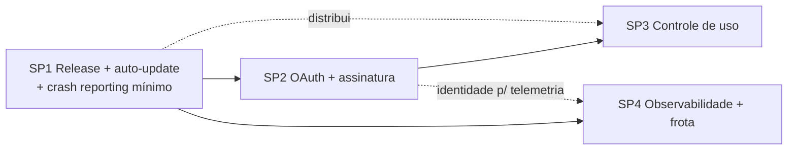

# codm como produto desktop assinável — Roadmap

**Date:** 2026-08-06
**Status:** Draft
**Bounded Context:** cross-context: desktop-shell, auth, owner, billing/quota (base), agent, thread, channel
**Kind:** roadmap
**Story Points:** 21 — agregado de 4 sub-specs; a decomposição É o produto deste documento (regra do rubric: 21 ⇒ decompor, e é o que as seções abaixo fazem). Estimativas por sub-projeto no corpo.

> **Natureza deste documento:** visão e sequenciamento, não spec implementável. Cada sub-projeto
> vira sua própria spec (`/brainstorm` → `/plan`) quando chegar a vez. As "Acceptance Criteria"
> aqui são **checkpoints de fase** — cada sub-spec as refina em ACs testáveis de verdade.

## Context

O codm hoje é um app Tauri v2 (`packages/app/tauri`) que hospeda o console react e **dois sidecars
compilados** — `codm-daemon` (TS) e `codm-gateway` (Go/whatsmeow) — declarados como `externalBin`
no `tauri.conf.json` (`bundle.active: true`, identifier `app.codm.desktop`). A persistência é um
único SQLite em `$CODM_DATA_DIR`, e os dois sidecars aplicam as migrações **idempotentemente no
boot** sobre a mesma ledger `_sqlite_migrations` — um desenho que, sem ter sido feito para isso, já
é exatamente o que um auto-update atômico precisa: trocar o bundle e rebootar migra sozinho.

O template-base já carrega os alicerces da metade comercial: `better-auth` (contexto `auth`),
multi-tenancy por `ownerId` único (contexto `owner`) e os contextos de base `billing`+`quota` —
até hoje sem papel no produto. Os dois backends já emitem traces OTLP para o stack LGTM do docker
de dev; o console react **não** tem instrumentação de cliente.

O que NÃO existe: plugin de updater (`tauri-plugin-updater` ausente do `Cargo.toml`), assinatura de
código, notarização, CI de release (só `correctness.yml`), login OAuth no app, cobrança, crash
reporting. Distribuição hoje = `bun desktop:dev` na máquina do founder.

Duas restrições estruturais descobertas em produção (2026-08-05/06) que moldam o desenho:

1. **A execução de agente é intrinsecamente local.** O runner usa o CLI do Claude instalado na
   máquina do usuário, com a assinatura Claude *do próprio usuário* (o orquestrador herda até o
   default pessoal do CLI — registrado como defeito de velocidade), e os workspaces/repos vivem no
   disco local. O produto não paga a inferência: o assinante traz a própria conta Claude.
2. **A dor de distribuição já é real com um usuário só.** No incidente de 2026-08-05, o daemon
   rodou um binário de 03:00 o dia inteiro sem nenhuma das correções do dia, porque atualizar exige
   recompilar na mão. O canal beta do auto-update é o mecanismo de dogfooding, não só de entrega.

## Problem

1. Não há como um terceiro instalar o codm — nem como o próprio founder atualizar as suas máquinas
   sem recompilar. Todo fix mergeado fica parado até um restart manual.
2. Não há identidade de usuário final, licença, nem forma de cobrar — o app roda para quem tiver o
   repo e o toolchain.
3. Não há visibilidade de campo: sem crash report, sem trace de cliente, um bug numa máquina alheia
   é irreproduzível por construção (hoje diagnosticamos com acesso direto ao SQLite e ao `pmset`
   da máquina — isso não existe num cliente pagante).

## Goal

Um app desktop instalável e **auto-atualizável** que qualquer pessoa assina por um valor baixo,
loga via OAuth no browser do sistema (como o Claude desktop), e usa com a **própria conta Claude**
e o **próprio WhatsApp** — com os dados de domínio (issues, threads, conversas) morando na máquina
do usuário, e a nuvem fazendo apenas o mínimo comercial: identidade, licença e controle de uso.
A main continua sendo o centro do desenvolvimento: cada merge alimenta o canal beta; tags promovem
o stable que os assinantes recebem.

## Decisions

*(decisões de visão tomadas pelo founder em 2026-08-06; cada sub-spec as detalha, nenhuma as reverte)*

1. **Nuvem mínima: identidade + licença + controle de uso. Dados de domínio ficam locais.**
   Issues, threads e conversas NÃO sobem para a nuvem — sem sync bidirecional, sem espelho web.
   O que sobe: quem é o usuário (OAuth), o que ele pode (entitlement da assinatura) e quanto usou
   (eventos de metering para quota). Os contextos-base `billing`+`quota` são o encaixe natural.
2. **A execução permanece local por definição de produto**: CLI do Claude do usuário, workspaces do
   usuário, WhatsApp pareado na máquina do usuário. O produto vende orquestração, não inferência.
3. **Canais de release: beta = main, stable = tags.** Cada merge na main publica no beta (as
   máquinas do founder assinam beta — dogfooding = distribuição); uma tag `vX.Y.Z` promove ao
   stable depois que o beta sobreviveu. Push na main nunca atualiza o stable diretamente.
4. **Update é do bundle inteiro, atomicamente** — shell + sidecars viajam juntos, como já estão no
   `externalBin`. A migração de dados é o boot idempotente que já existe. Política decorrente:
   **migrações aditivas entre releases adjacentes**, para rollback não quebrar.
5. **Login OAuth pelo browser do sistema** com callback via deep link (`codm://`), token no
   keychain via o seam de secrets do desktop-shell — o fluxo do Claude desktop, citado pelo founder
   como referência explícita.
6. **Observabilidade de cliente entra em duas doses**: crash reporting mínimo JUNTO com a primeira
   distribuição (sub-projeto 1 — sem isso, bug de campo é indiagnosticável), e o corpo completo
   (session replay, tracing de frontend, analytics) como sub-projeto próprio (4), com **masking
   obrigatório**: o console exibe conversas reais de WhatsApp de terceiros; replay sem redação é
   vazamento. Tracing de frontend se acopla à pipeline OTLP que os backends já usam.
7. **Distribuição direta por DMG, nunca App Store — e assinatura Apple em duas fases** (founder,
   2026-08-06). O produto se instala baixando o `.dmg` e arrastando para Aplicativos; a loja da
   Apple está fora do plano em todas as fases (o updater do Tauri nem opera sob o update próprio
   e o sandbox da loja). A assinatura Apple (Developer ID + notarização, US$99/ano) NÃO é
   pré-requisito de desenvolvimento: o beta circula **sem** ela, com o bypass do Gatekeeper
   documentado na página de download (Ajustes → Privacidade e Segurança → "Abrir Mesmo Assim" —
   o macOS atual removeu o atalho do clique-direito). Ela entra como **gate de cobrança** no SP2,
   sob a regra: *no dia em que alguém paga, o app abre sem susto*. O auto-update independe da
   Apple nas duas fases — os updates são assinados pela nossa chave minisign do Tauri, e o
   download do updater não passa pelo browser, logo não ganha quarentena; o pedágio do Gatekeeper
   é só na primeira instalação.

## User Stories

- **Story 1:** Como assinante, quero instalar um `.dmg`, logar com minha conta e parear meu
  WhatsApp, para ter o orquestrador rodando sem toolchain de desenvolvedor.
  - Dado um Mac sem nada instalado, quando abro o app pela primeira vez, então logo via browser,
    minha assinatura é verificada e o app funciona — sem git, sem bun, sem cargo.
- **Story 2:** Como assinante, quero que o app se atualize sozinho, para receber correções sem
  saber o que é um binário.
  - Dado um stable novo publicado, quando abro o app (ou no check periódico), então ele baixa,
    verifica a assinatura e relança — e o boot migra o SQLite sem eu perceber.
- **Story 3:** Como founder, quero que minhas máquinas assinem o canal beta alimentado pela main,
  para que o incidente do "daemon com binário de 15 horas atrás" seja estruturalmente impossível.
  - Dado um merge na main, quando o CI publica o beta, então minhas máquinas atualizam no próximo
    check — dogfooding pela mesma máquina que entrega ao cliente.
- **Story 4:** Como founder, quero crash reports e traces das máquinas dos assinantes, para
  diagnosticar sem o acesso direto que tenho hoje à minha própria máquina.
- **Story 5:** Como operador do negócio, quero medir uso por assinante (controle de uso), para
  precificar barato com teto justo em vez de subsidiar outliers.

## Acceptance Criteria

*(checkpoints de fase — cada um vira ACs testáveis na sub-spec correspondente)*

- [ ] CP-1 (SP1): um `.dmg` beta (sem assinatura Apple) instala numa máquina limpa seguindo o
      bypass documentado; o app atualiza sozinho do canal beta após um merge na main; crash nativo
      ou do webview gera report visível ao founder.
- [ ] CP-2 (SP2): login OAuth pelo browser devolve sessão válida ao app via deep link; uma
      assinatura ativa no Stripe libera o app; uma cancelada o bloqueia após período de graça; o
      `.dmg` do stable é assinado (Developer ID) e notarizado — instala sem aviso do Gatekeeper.
- [ ] CP-3 (SP3): o daemon local reporta eventos de uso à nuvem; estourar a quota do plano degrada
      o serviço conforme política definida na sub-spec (nunca perda de dados locais).
- [ ] CP-4 (SP4): session replay com masking de conteúdo de conversa ativo por default; traces de
      frontend chegam à mesma pipeline OTLP dos backends; rollout staged por percentual no stable.

## Emenda de 2026-08-06 (pós-grilling do SP2) — o pivô do gratuito

Duas decisões do founder durante o grilling do SP2 alteram este documento:

1. **O produto será GRATUITO, plano único, sem Stripe** ("desisti de colocar preço, vai ser 0,00
   de graça um plano apenas"). O SP2 perde a metade de billing e vira **conta + login OAuth**
   (spec: `.specs/2026-08-06-sp2-conta-oauth-design.md`); as chaves de teste do Stripe ficam
   estacionadas no `.env` para um futuro replanejamento de monetização. O SP3 fica re-motivado:
   controle de uso deixa de ser precificação e passa a ser **controle de abuso do plano
   gratuito** — decisão de fazê-lo ou não fica para depois do SP2.
2. **Assinatura Apple adiada indefinidamente** ("por enquanto download sem a licença funciona") —
   a decisão 7 fica emendada: o gate deixa de ser "quando alguém paga" (não haverá cobrança) e
   não há novo gate marcado; o download público usa o caminho do beta (DMG sem Developer ID +
   bypass documentado) até o founder decidir comprar a conta.

## Os quatro sub-projetos

### SP1 — Pipeline de release + auto-update (~13 pts) — PRIMEIRO

**Entrega:** `tauri-plugin-updater` + chave minisign embarcada (nossa e gratuita — é ela que
assina os updates; a Apple não participa do auto-update); workflow de release que no push de tag
compila o bundle (shell + sidecars), gera `latest.json` e publica artefatos (GitHub Releases ou
R2 — manifest estático, sem servidor); canal **beta** publicado a cada merge na main; crash
reporting mínimo (Sentry ou equivalente — decisão na sub-spec) no shell Rust e no webview; página
de download com o bypass do Gatekeeper documentado — o DMG beta é **deliberadamente sem assinatura
Apple** (decisão 7): custo zero, nenhum pré-requisito externo. macOS/arm64 primeiro; Windows/Linux
são Open Question.

**Por que primeiro:** autocontido (zero dependência de nuvem E zero pré-requisito externo),
resolve a dor operacional de hoje, e tudo que vem depois distribui por ele.

### SP2 — Identidade + assinatura na nuvem (~13 pts)

**Entrega:** deploy de uma fatia da api (auth + owner + billing) num servidor; OAuth
(better-auth já suporta providers) com fluxo browser→deep link→keychain; Stripe para a assinatura;
endpoint de entitlement que o app consulta no boot e cacheia com período de graça offline;
`minVersion` no manifest de update para forçar atualização quando o contrato de fio exigir.
**Developer ID + notarização entram AQUI como pré-requisito** (US$99/ano — decisão 7): a
assinatura Apple é gate de cobrança, não de desenvolvimento — o stable que um pagante baixa
instala sem aviso do Gatekeeper.

### SP3 — Controle de uso local↔nuvem (~8 pts)

**Entrega:** o daemon local emite eventos de metering (a unidade de medida — turnos? issues?
mensagens? — é A decisão de precificação e fica para a sub-spec) para a nuvem via a identidade do
SP2; os contextos `billing`+`quota` aplicam o teto do plano; o app exibe consumo e reage ao
estouro. Explicitamente FORA: qualquer sync de dados de domínio (decisão 1).

### SP4 — Observabilidade de cliente + operação de frota (~8-13 pts)

**Entrega:** session replay e analytics de produto (PostHog/Sentry/OpenReplay — decisão na
sub-spec, viés para SaaS com free tier no início) com masking de conversa obrigatório; tracing de
frontend (OTel web) desaguando na pipeline OTLP existente; rollout staged por percentual e rollback
de release (re-apontar o manifest); telemetria de update ("atualizou para vX e sobreviveu ao boot").

## Sequenciamento

SP1 → SP2 → SP3, com SP4 podendo começar em paralelo a SP3 (depende de SP1 pela distribuição e de
SP2 pela identidade nos eventos). O grilling pesado de precificação (unidade de quota, preço,
graça) acontece na sub-spec do SP3, com dados reais de uso do founder colhidos via SP4.

## Open Questions

- **Plataformas além de macOS/arm64** — Windows exige certificado de signing próprio (Azure Trusted
  Signing ~US$10/mês); Linux (AppImage) dispensa. Decidir na sub-spec do SP1 se entram no MVP.
- **A unidade do controle de uso** (turnos de agente? issues abertas? mensagens?) — é a decisão de
  precificação inteira; precisa dos dados de uso do próprio founder antes de ser honesta.
- **Ferramenta de replay/analytics** (PostHog vs Sentry vs OpenReplay self-hosted) — decidir no SP4
  com o requisito de masking como critério eliminatório.
- **Nome/branding do produto** — o template é domain-agnostic (`template.config.ts` carrega
  `brand`); a release pública fixa o nome de vez.
- **O gateway Go e os limites do WhatsApp** — distribuição em massa de um cliente whatsmeow merece
  uma leitura de risco (ToS/ban) antes do lançamento público; fora do escopo técnico deste roadmap,
  registrado para não ser esquecido.
