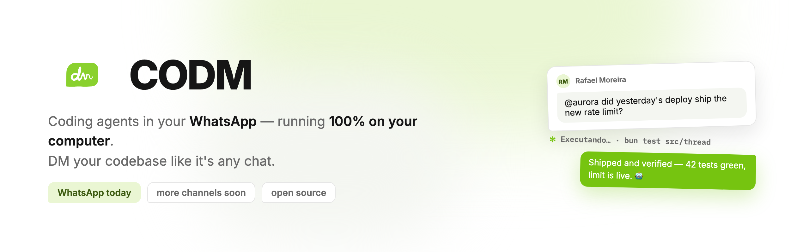

<p align="center">
  <a href="https://codm-landing.pages.dev"></a>
</p>

<p align="center">
  <a href="https://codm-landing.pages.dev"><strong>codm-landing.pages.dev</strong></a><br />
  <sub>Visit the landing page — what codm is, and the download.</sub>
</p>

# codm

**codm** is a desktop-first product: AI agents you operate through your messaging channels — **WhatsApp today**, more channels coming soon. You pair a channel, attach a conversation to a workspace, and drive real work (issues, artifacts, code) by talking to your agent from your phone.

The desktop app is a **Tauri v2** shell hosting a React console and supervising two local sidecars — a **TypeScript daemon** (Bun) and a **Go gateway** (whatsmeow) — that share a **single SQLite file** on the user's machine. Identity is the one thing that is not local: a small **cloud profile** (auth + owner) is the authoritative source of who you are and which tenancy you belong to; the daemon mirrors the session and works offline from there. The decisions behind that split live in `docs/adr/`.

## How it works

```
WhatsApp ──► Go gateway (whatsmeow) ──► SQLite (shared file, outbox) ──► TS daemon
                                                                          │
             Tauri shell ◄── React console (BFF `ui` context) ◄───────────┘
                                          cloud profile (auth + owner) ──► identity
```

- **channel** (Go) — the WhatsApp bridge: pairing via QR, message ingest, receipts, presence, sync.
- **thread / agent / issue / workspace / artifact** (TS) — the product core: conversations attached to workspaces, agents that pick up issues and produce artifacts.
- **auth + owner** — identity mirrored from the cloud profile; the machine never invents an `ownerId`.
- **ui** — the BFF context serving the console's read models.

## Architecture

Polyglot fullstack descending from the `template-fullstack` architecture: **DDD + Clean Architecture + CQRS + Event-Driven**, with **TypeSpec-sourced contracts** generating cross-language bindings (TS / Go / Rust) and a wire-first SDK (controller Zod → OpenAPI → Kubb) shared by backend and frontend.

| Package | Stack | Role |
|---|---|---|
| `packages/contracts` | TypeSpec + Drizzle | Source of truth: cross-boundary enums, integration events, DB schema |
| `packages/api/typescript` | Bun · Drizzle · tsyringe | Daemon: product core contexts + `ui` BFF; cloud profile (auth + owner) |
| `packages/api/go` | Go · fx · net/http | Gateway: WhatsApp channel, projectors, schedulers |
| `packages/app/react` | React 19 · TanStack Router/Start · Vite | Console (served under `/app`) |
| `packages/app/astro` | Astro 5 · MDX · Tailwind 4 | Landing + blog + SEO (served at `/`) |
| `packages/app/tauri` | Tauri v2 (Rust) | Desktop shell + sidecar supervision + auto-update |
| `packages/app/ui` | React · CSS | UI primitives + design tokens shared by react + astro |
| `packages/client` | Kubb / oapi-codegen / progenitor | Generated SDKs (TS committed at `packages/client/dist/typescript`) |
| `packages/e2e` | Playwright | Cross-stack flows |

Both sidecars open the **same SQLite file** under `$CODM_DATA_DIR` and apply the same Drizzle-authored migrations idempotently at boot — on the user's machine there is no external database and no manual migrate step. The **cloud profile is the exception, and the only one**: it speaks Postgres, and its driver *verifies* migrations rather than applying them, so that database is created and migrated explicitly (`bun stack:up`, `bun migrate:deploy:cloud`). Cross-context and cross-service facts travel through a **transactional outbox**; Redis streams back the external mediator in dev.

## Quick start

```bash
cp .env.example .env          # see "Before you start" — one of these is not optional
bun install
bun stack:up                  # redis + LGTM + postgres (the cloud profile's database)
bun migrate:deploy:cloud      # required: the cloud driver verifies migrations, it never applies them
bun desktop:dev               # the app itself
```

`bun desktop:dev` is the product: it compiles both sidecars, starts the cloud profile on `:3033`, and
opens the Tauri shell hosting the console — the shell supervises the sidecars, so there is nothing
else to keep running. Expect the first launch to be slow; it builds a Rust binary.

### Before you start

**Sign-in needs an OAuth app.** There is no email/password path — the console offers GitHub and
Google and nothing else. Fill `GITHUB_CLIENT_ID`/`GITHUB_CLIENT_SECRET` **or** the `GOOGLE_*` pair in
`.env`, or you will reach the login screen and stop there. The three secrets the file ships as
`CHANGE_ME` (`JWT_SECRET`, `BETTER_AUTH_SECRET`, `INTERNAL_SERVICE_KEY`) still need real values.

**Prereqs**: `bun >= 1.0`, `docker`, `go`, `cargo`. The Rust toolchain is what makes `desktop:dev`
the heaviest of the four — it builds the shell — and `go` compiles the gateway sidecar. If you only
want the services (next section), `cargo` is not needed: the generated Rust, Go and TypeScript all
ship committed, so nothing on that path compiles a crate.

**One data dir, one daemon.** `bun desktop:dev` opens the same SQLite store an installed CoDM.app
uses (`~/Library/Application Support/app.codm.desktop/data` on macOS), and the daemon holds an
exclusive lock on it. Start the dev build while the installed app is running and you get the error
splash, with `DATA_DIR_LOCKED` and the offending pid in the log — the guard working, not a bug. Quit
the installed app, or give the dev build its own store with `CODM_DATA_DIR`.

**`bun sdk` is not a setup step.** The TypeScript client is committed under
`packages/client/dist/typescript`, and nx builds it as a dependency of the console's dev target. Run
it after you change a contract or a controller, not to boot the stack.

### Running the pieces separately

The desktop shell is the product, not the only way in. To work on a service — or on the landing,
which the shell does not host — run them as plain dev servers instead:

```bash
bun dev                       # api-ts:3030 · api-go:3032 · console:5173/app · landing:4321
bun dev:cloud                 # :3033 — identity (auth + owner); the console's sign-in points here
curl localhost:3030/health    # every component "up" = the stack is sound
```

Those are two long-running commands, so use two terminals. The console at `:5173/app` is the same
React app the shell hosts, minus the desktop capabilities the shell provides.

Full setup notes live in `CLAUDE.md` ("Environment Setup"); desktop packaging and the two release
signatures are in `docs/RELEASE.md`.

## Documentation

- **`CLAUDE.md`** — project orientation: first-class citizens, commands, non-negotiables.
- **`docs/BACKEND.md`** / **`docs/FRONTEND.md`** — architecture deep dives per side.
- **`docs/CLI.md`** — frontend scaffolder (`bun cli`).
- **`docs/RELEASE.md`** — stable/beta tracks, auto-update, desktop signing.
- **`docs/ECOSYSTEM.md`** — the template family this repo descends from and syncs with.
- **`.claude/skills/`** — per-artifact playbooks used by the agentic workflow.
- **Privacy Policy** — [English](packages/app/astro/src/pages/%5Blocale%5D/legal/_content/privacy.en.mdx) · [Português](packages/app/astro/src/pages/%5Blocale%5D/legal/_content/privacy.pt.mdx). The same MDX files the landing renders at `/en/legal/privacy` and `/pt/legal/privacy` — what stays on your machine, what leaves it, and how to turn that off.

## Code signing policy

Release artifacts are signed, and this section says by whom and under what process — the same
information the [SignPath Foundation](https://signpath.org/) asks every project to publish.

- **Committers and reviewers:** [Gabriel Araújo](https://github.com/gabriellst) (maintainer).
- **Approvers:** the maintainer. A release is cut by pushing a `vX.Y.Z` tag whose version must match
  the desktop config, or the build refuses to publish (`.github/workflows/release-stable.yml`);
  nothing is signed by a workflow that a pull request can trigger.
- **macOS** — `.dmg` and the updater artifacts are signed with an Apple Developer ID certificate and
  notarized by Apple. The update payloads carry a separate minisign signature the client verifies
  (`packages/app/tauri/config/updater.ts`); its public key is committed on purpose.
- **Windows** — the NSIS installer is **not signed yet**, which is why SmartScreen warns on download.
  Removing that warning is what the SignPath Foundation application is for; the wiring point already
  exists (`bundle > windows > signCommand`).
- **Linux** — AppImage and `.deb` carry the same minisign signature as every other update payload.

Builds are reproducible from this repository: every artifact comes out of the workflows in
`.github/workflows/`, from the tagged commit, with no manual step in between.

### What the app sends over the network

The desktop app runs on your machine and keeps its data in a local SQLite file. It talks to the
network in exactly four ways, all of them the point of the product or stated here:

1. **WhatsApp**, through your own paired device — the messages you and your agents exchange.
2. **The cloud profile** (`codm.up.railway.app`) — sign-in and which tenancy you belong to. Identity
   only; conversations and workspaces never leave your machine.
3. **Updates** — the app asks a public bucket for the latest version manifest.
4. **Product analytics** (PostHog) — anonymous usage counters, off when the build carries no key.

Everything else — your files, your repositories, your conversations — stays on the machine.

## License

MIT (`LICENSE`), with one exception: the WhatsApp gateway in `packages/api/go` is **GPL-3.0-or-later**, because it links `whatsmeow` → `libsignal` (GPL-3.0). The gateway is a separate program (own binary, HTTP + shared SQLite), so the daemon, shell, console and landing stay MIT. The full reasoning is in [`LICENSING.md`](LICENSING.md); third-party licenses in `THIRD_PARTY_NOTICES.md`.
